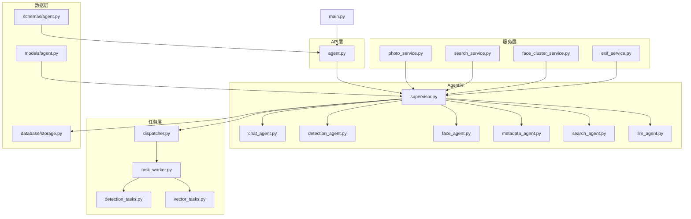
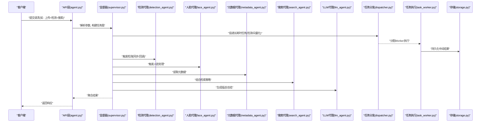
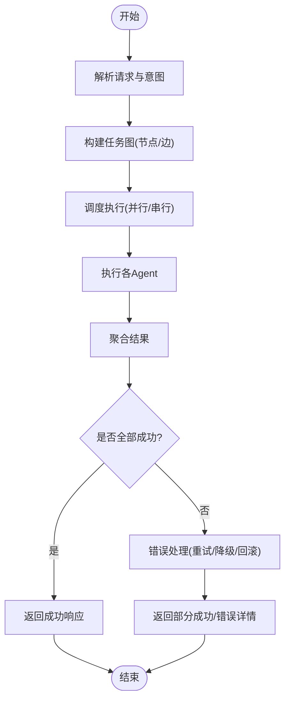
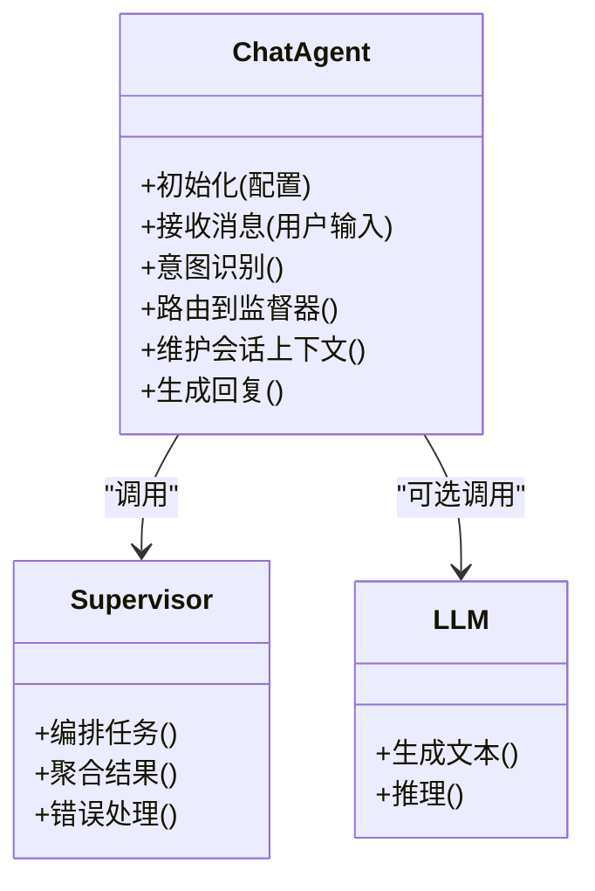
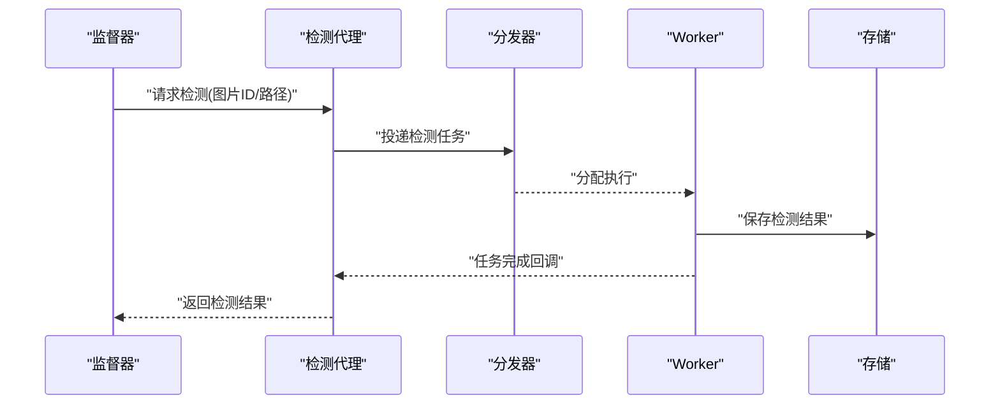
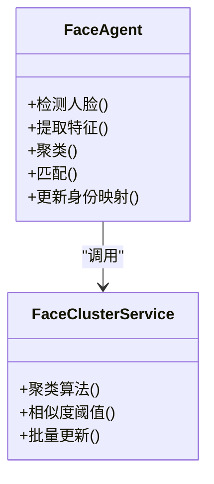
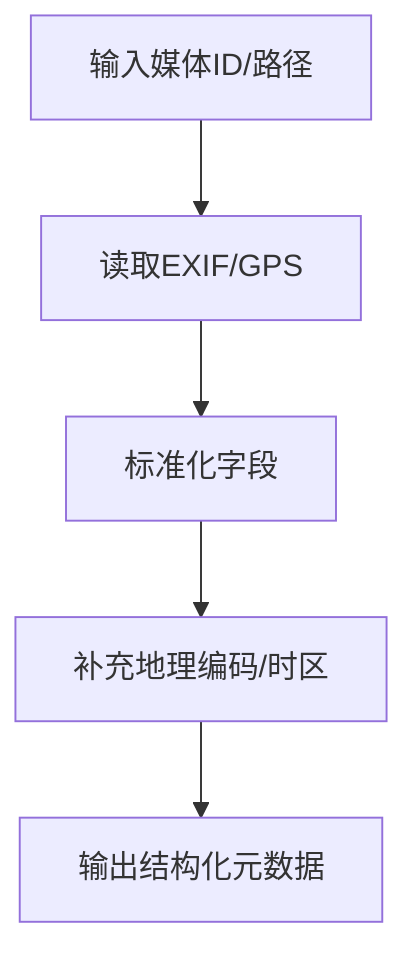
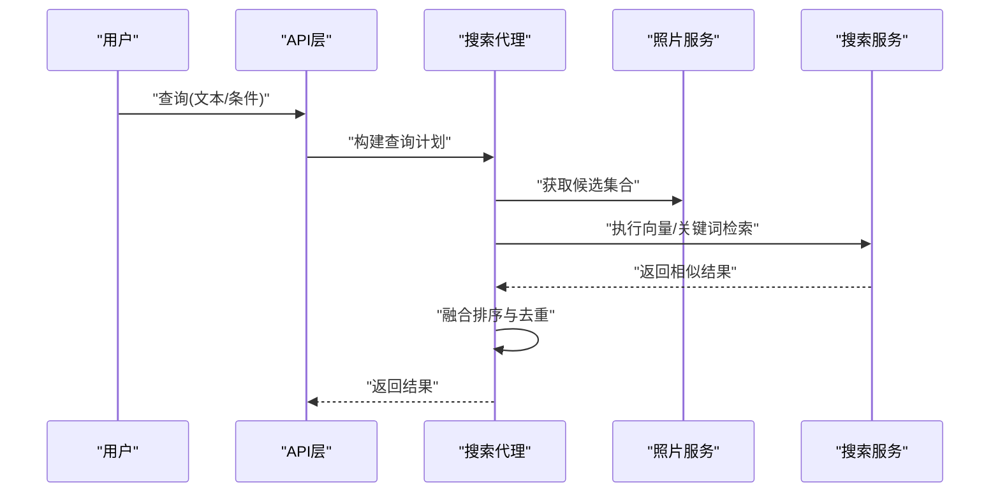
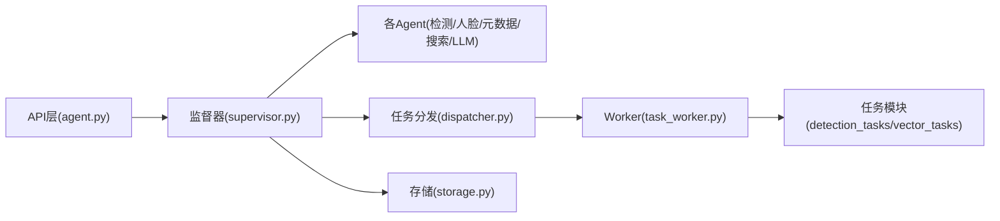

# AI代理架构

<cite>
**本文引用的文件**   
- [backend/app/services/agent/supervisor.py](file://backend/app/services/agent/supervisor.py)
- [backend/app/services/agent/chat_agent.py](file://backend/app/services/agent/chat_agent.py)
- [backend/app/services/agent/detection_agent.py](file://backend/app/services/agent/detection_agent.py)
- [backend/app/services/agent/face_agent.py](file://backend/app/services/agent/face_agent.py)
- [backend/app/services/agent/metadata_agent.py](file://backend/app/services/agent/metadata_agent.py)
- [backend/app/services/agent/search_agent.py](file://backend/app/services/agent/search_agent.py)
- [backend/app/services/agent/llm_agent.py](file://backend/app/services/agent/llm_agent.py)
- [backend/app/api/agent.py](file://backend/app/api/agent.py)
- [backend/app/models/agent.py](file://backend/app/models/agent.py)
- [backend/app/schemas/agent.py](file://backend/app/schemas/agent.py)
- [backend/app/tasks/dispatcher.py](file://backend/app/tasks/dispatcher.py)
- [backend/app/tasks/task_worker.py](file://backend/app/tasks/task_worker.py)
- [backend/app/tasks/detection_tasks.py](file://backend/app/tasks/detection_tasks.py)
- [backend/app/tasks/vector_tasks.py](file://backend/app/tasks/vector_tasks.py)
- [backend/app/services/photo_service.py](file://backend/app/services/photo_service.py)
- [backend/app/services/search_service.py](file://backend/app/services/search_service.py)
- [backend/app/services/face_cluster_service.py](file://backend/app/services/face_cluster_service.py)
- [backend/app/services/exif_service.py](file://backend/app/services/exif_service.py)
- [backend/app/database/storage.py](file://backend/app/database/storage.py)
- [backend/main.py](file://backend/main.py)
</cite>

## 目录
1. [简介](#简介)
2. [项目结构](#项目结构)
3. [核心组件](#核心组件)
4. [架构总览](#架构总览)
5. [详细组件分析](#详细组件分析)
6. [依赖关系分析](#依赖关系分析)
7. [性能考虑](#性能考虑)
8. [故障排查指南](#故障排查指南)
9. [结论](#结论)
10. [附录](#附录)

## 简介
本技术文档围绕AI代理（Agent）协作系统展开，聚焦多Agent架构的设计与实现。系统包含聊天代理、检测代理、人脸代理、元数据代理、搜索代理等角色，由监督器统一编排任务分发、结果聚合与错误处理。文档同时覆盖消息传递协议、状态管理、并发控制机制，并提供自定义Agent开发指南、调用示例与性能优化建议，帮助读者快速理解并扩展该架构。

## 项目结构
后端采用分层组织：API层暴露REST接口；服务层封装业务逻辑；Agent层提供可插拔的AI能力；任务层负责异步调度与执行；模型与Schema定义数据契约；数据库层提供存储抽象。

图表来源
- [backend/main.py](file://backend/main.py)
- [backend/app/api/agent.py](file://backend/app/api/agent.py)
- [backend/app/services/agent/supervisor.py](file://backend/app/services/agent/supervisor.py)
- [backend/app/services/agent/chat_agent.py](file://backend/app/services/agent/chat_agent.py)
- [backend/app/services/agent/detection_agent.py](file://backend/app/services/agent/detection_agent.py)
- [backend/app/services/agent/face_agent.py](file://backend/app/services/agent/face_agent.py)
- [backend/app/services/agent/metadata_agent.py](file://backend/app/services/agent/metadata_agent.py)
- [backend/app/services/agent/search_agent.py](file://backend/app/services/agent/search_agent.py)
- [backend/app/services/agent/llm_agent.py](file://backend/app/services/agent/llm_agent.py)
- [backend/app/tasks/dispatcher.py](file://backend/app/tasks/dispatcher.py)
- [backend/app/tasks/task_worker.py](file://backend/app/tasks/task_worker.py)
- [backend/app/tasks/detection_tasks.py](file://backend/app/tasks/detection_tasks.py)
- [backend/app/tasks/vector_tasks.py](file://backend/app/tasks/vector_tasks.py)
- [backend/app/services/photo_service.py](file://backend/app/services/photo_service.py)
- [backend/app/services/search_service.py](file://backend/app/services/search_service.py)
- [backend/app/services/face_cluster_service.py](file://backend/app/services/face_cluster_service.py)
- [backend/app/services/exif_service.py](file://backend/app/services/exif_service.py)
- [backend/app/models/agent.py](file://backend/app/models/agent.py)
- [backend/app/schemas/agent.py](file://backend/app/schemas/agent.py)
- [backend/app/database/storage.py](file://backend/app/database/storage.py)

章节来源
- [backend/main.py](file://backend/main.py)
- [backend/app/api/agent.py](file://backend/app/api/agent.py)
- [backend/app/services/agent/supervisor.py](file://backend/app/services/agent/supervisor.py)
- [backend/app/tasks/dispatcher.py](file://backend/app/tasks/dispatcher.py)
- [backend/app/tasks/task_worker.py](file://backend/app/tasks/task_worker.py)

## 核心组件
- 监督器（Supervisor）：作为编排中心，负责任务解析、路由到具体Agent、并行执行、结果聚合与错误恢复。
- 聊天代理（Chat Agent）：面向对话交互，协调其他Agent完成复杂问答或创作任务。
- 检测代理（Detection Agent）：负责图像目标检测、OCR等视觉识别任务，通常通过任务队列异步执行。
- 人脸代理（Face Agent）：负责人脸检测、聚类、比对与标注，结合人脸聚类服务使用。
- 元数据代理（Metadata Agent）：提取EXIF、地理位置、时间线等媒体元信息。
- 搜索代理（Search Agent）：整合向量检索、关键词检索与规则过滤，返回结构化搜索结果。
- LLM代理（LLM Agent）：与大语言模型交互，用于文本生成、摘要、推理与提示工程。

章节来源
- [backend/app/services/agent/supervisor.py](file://backend/app/services/agent/supervisor.py)
- [backend/app/services/agent/chat_agent.py](file://backend/app/services/agent/chat_agent.py)
- [backend/app/services/agent/detection_agent.py](file://backend/app/services/agent/detection_agent.py)
- [backend/app/services/agent/face_agent.py](file://backend/app/services/agent/face_agent.py)
- [backend/app/services/agent/metadata_agent.py](file://backend/app/services/agent/metadata_agent.py)
- [backend/app/services/agent/search_agent.py](file://backend/app/services/agent/search_agent.py)
- [backend/app/services/agent/llm_agent.py](file://backend/app/services/agent/llm_agent.py)

## 架构总览
整体流程从API进入，经监督器编排多个Agent协同工作，必要时将耗时任务投递至任务队列，最终聚合结果返回给前端。

图表来源
- [backend/app/api/agent.py](file://backend/app/api/agent.py)
- [backend/app/services/agent/supervisor.py](file://backend/app/services/agent/supervisor.py)
- [backend/app/services/agent/detection_agent.py](file://backend/app/services/agent/detection_agent.py)
- [backend/app/services/agent/face_agent.py](file://backend/app/services/agent/face_agent.py)
- [backend/app/services/agent/metadata_agent.py](file://backend/app/services/agent/metadata_agent.py)
- [backend/app/services/agent/search_agent.py](file://backend/app/services/agent/search_agent.py)
- [backend/app/services/agent/llm_agent.py](file://backend/app/services/agent/llm_agent.py)
- [backend/app/tasks/dispatcher.py](file://backend/app/tasks/dispatcher.py)
- [backend/app/tasks/task_worker.py](file://backend/app/tasks/task_worker.py)
- [backend/app/database/storage.py](file://backend/app/database/storage.py)

## 详细组件分析

### 监督器（Supervisor）
职责
- 任务解析与图构建：根据输入意图拆解为子任务（检测、人脸、元数据、搜索、LLM）。
- 并发编排：对无依赖子任务并行执行，对有依赖的子任务按拓扑顺序调度。
- 结果聚合：合并各Agent输出，进行格式标准化与去重。
- 错误处理：捕获异常、重试、降级与回滚策略。
- 状态管理：维护任务生命周期状态（待处理、进行中、成功、失败、部分成功）。

关键设计点
- 基于事件/回调的异步通信，避免阻塞主线程。
- 幂等性保障：对重复提交的任务具备去重与一致性校验。
- 可观测性：记录关键步骤日志与指标，便于追踪与排障。

图表来源
- [backend/app/services/agent/supervisor.py](file://backend/app/services/agent/supervisor.py)

章节来源
- [backend/app/services/agent/supervisor.py](file://backend/app/services/agent/supervisor.py)

### 聊天代理（Chat Agent）
职责
- 对话上下文管理：维护会话历史、用户偏好与记忆。
- 意图识别与路由：将自然语言请求转换为结构化任务，交由监督器编排。
- 多轮交互：支持追问、澄清与确认（例如人名确认）。

与其他组件的关系
- 依赖监督器进行任务分发。
- 可能调用LLM代理进行内容生成与推理。
- 与人脸代理协作以进行人物相关对话。

图表来源
- [backend/app/services/agent/chat_agent.py](file://backend/app/services/agent/chat_agent.py)
- [backend/app/services/agent/supervisor.py](file://backend/app/services/agent/supervisor.py)
- [backend/app/services/agent/llm_agent.py](file://backend/app/services/agent/llm_agent.py)

章节来源
- [backend/app/services/agent/chat_agent.py](file://backend/app/services/agent/chat_agent.py)
- [backend/app/services/agent/llm_agent.py](file://backend/app/services/agent/llm_agent.py)

### 检测代理（Detection Agent）
职责
- 图像目标检测、OCR、场景分类等视觉任务。
- 与任务队列集成，将耗时计算卸载到Worker。
- 产出检测结果（边界框、标签、置信度），供后续人脸、搜索等使用。

与任务层的交互
- 通过分发器投递检测任务。
- Worker执行后写回中间结果，供监督器聚合。

图表来源
- [backend/app/services/agent/detection_agent.py](file://backend/app/services/agent/detection_agent.py)
- [backend/app/tasks/dispatcher.py](file://backend/app/tasks/dispatcher.py)
- [backend/app/tasks/task_worker.py](file://backend/app/tasks/task_worker.py)
- [backend/app/tasks/detection_tasks.py](file://backend/app/tasks/detection_tasks.py)
- [backend/app/database/storage.py](file://backend/app/database/storage.py)

章节来源
- [backend/app/services/agent/detection_agent.py](file://backend/app/services/agent/detection_agent.py)
- [backend/app/tasks/detection_tasks.py](file://backend/app/tasks/detection_tasks.py)

### 人脸代理（Face Agent）
职责
- 人脸检测、特征提取、聚类与匹配。
- 与人脸聚类服务协作，生成人脸簇与身份映射。
- 在对话中支持“识人”、“按人检索”等能力。

图表来源
- [backend/app/services/agent/face_agent.py](file://backend/app/services/agent/face_agent.py)
- [backend/app/services/face_cluster_service.py](file://backend/app/services/face_cluster_service.py)

章节来源
- [backend/app/services/agent/face_agent.py](file://backend/app/services/agent/face_agent.py)
- [backend/app/services/face_cluster_service.py](file://backend/app/services/face_cluster_service.py)

### 元数据代理（Metadata Agent）
职责
- 读取并解析EXIF、GPS、拍摄设备、时间戳等元数据。
- 标准化时间线与地理信息，供相册与地图展示。
- 与EXIF服务协作，确保兼容不同格式与缺失字段。

图表来源
- [backend/app/services/agent/metadata_agent.py](file://backend/app/services/agent/metadata_agent.py)
- [backend/app/services/exif_service.py](file://backend/app/services/exif_service.py)

章节来源
- [backend/app/services/agent/metadata_agent.py](file://backend/app/services/agent/metadata_agent.py)
- [backend/app/services/exif_service.py](file://backend/app/services/exif_service.py)

### 搜索代理（Search Agent）
职责
- 融合向量检索、关键词检索与规则过滤。
- 支持按时间、地点、人物、标签等多维筛选。
- 返回排序后的结果集与解释性片段。

图表来源
- [backend/app/services/agent/search_agent.py](file://backend/app/services/agent/search_agent.py)
- [backend/app/services/search_service.py](file://backend/app/services/search_service.py)
- [backend/app/services/photo_service.py](file://backend/app/services/photo_service.py)

章节来源
- [backend/app/services/agent/search_agent.py](file://backend/app/services/agent/search_agent.py)
- [backend/app/services/search_service.py](file://backend/app/services/search_service.py)

### LLM代理（LLM Agent）
职责
- 与大语言模型交互，完成文本生成、摘要、翻译、推理等。
- 提供统一的提示模板管理与上下文注入。
- 与聊天代理配合，提升对话质量与可控性。

章节来源
- [backend/app/services/agent/llm_agent.py](file://backend/app/services/agent/llm_agent.py)

## 依赖关系分析
- API层依赖监督器与服务层，负责入参校验与响应格式化。
- 监督器依赖各Agent与任务分发器，形成松耦合的插件式架构。
- 任务层解耦了CPU密集型计算，提高吞吐与稳定性。
- 数据层通过存储抽象屏蔽底层差异，保证可扩展性。

图表来源
- [backend/app/api/agent.py](file://backend/app/api/agent.py)
- [backend/app/services/agent/supervisor.py](file://backend/app/services/agent/supervisor.py)
- [backend/app/tasks/dispatcher.py](file://backend/app/tasks/dispatcher.py)
- [backend/app/tasks/task_worker.py](file://backend/app/tasks/task_worker.py)
- [backend/app/tasks/detection_tasks.py](file://backend/app/tasks/detection_tasks.py)
- [backend/app/tasks/vector_tasks.py](file://backend/app/tasks/vector_tasks.py)
- [backend/app/database/storage.py](file://backend/app/database/storage.py)

章节来源
- [backend/app/api/agent.py](file://backend/app/api/agent.py)
- [backend/app/services/agent/supervisor.py](file://backend/app/services/agent/supervisor.py)
- [backend/app/tasks/dispatcher.py](file://backend/app/tasks/dispatcher.py)
- [backend/app/tasks/task_worker.py](file://backend/app/tasks/task_worker.py)

## 性能考虑
- 并发与批处理：对独立子任务并行执行，对I/O密集操作使用异步；对大样本检测/向量化采用批处理降低开销。
- 缓存与索引：热点结果缓存（如人脸特征、向量索引），减少重复计算。
- 任务削峰：通过任务队列平滑峰值负载，避免雪崩。
- 资源隔离：将CPU密集型任务与Web进程分离，防止阻塞请求线程。
- 超时与熔断：设置合理的超时与重试上限，失败快速失败，保护系统稳定。
- 存储优化：分片与分页读取，避免一次性加载大量数据。

[本节为通用指导，不直接分析具体文件]

## 故障排查指南
- 常见问题定位
  - 任务未执行：检查分发器与Worker连接、队列健康与Worker存活。
  - 结果不一致：核对幂等键与去重策略，确认中间结果写入与读取一致性。
  - 超时失败：调整超时阈值与重试次数，查看下游服务延迟。
  - 内存溢出：限制批次大小，启用流式处理与对象池。
- 可观测性与日志
  - 记录关键步骤（任务创建、派发、执行、聚合、错误）与耗时。
  - 为每个任务分配唯一ID，贯穿全链路追踪。
- 错误恢复策略
  - 重试：对瞬时错误指数退避重试。
  - 降级：当某Agent不可用时，返回部分结果或替代方案。
  - 回滚：对已写入的中间结果进行清理，保持状态一致。

章节来源
- [backend/app/tasks/dispatcher.py](file://backend/app/tasks/dispatcher.py)
- [backend/app/tasks/task_worker.py](file://backend/app/tasks/task_worker.py)
- [backend/app/services/agent/supervisor.py](file://backend/app/services/agent/supervisor.py)

## 结论
本架构通过监督器统一编排多Agent协作，结合任务队列实现高吞吐与高可用。各Agent职责清晰、接口明确，易于扩展与维护。通过合理的并发控制、错误处理与性能优化策略，系统可在复杂场景中稳定运行。

[本节为总结性内容，不直接分析具体文件]

## 附录

### 自定义Agent开发指南
- 接口规范
  - 输入：标准化任务对象（包含类型、参数、上下文）。
  - 输出：结构化结果（包含状态、数据、错误信息）。
  - 错误：抛出领域异常或返回错误码，便于上层统一处理。
- 注册与发现
  - 在监督器中注册新Agent名称与处理器。
  - 提供能力声明（支持的输入/输出、依赖项、超时）。
- 配置方法
  - 环境变量或配置文件注入（模型路径、阈值、并发数）。
  - 运行时可切换开关（灰度发布、A/B测试）。
- 测试策略
  - 单元测试：验证输入校验、边界条件与错误分支。
  - 集成测试：模拟下游服务与任务队列，端到端验证。
  - 性能测试：压测关键路径，评估吞吐与延迟。

章节来源
- [backend/app/services/agent/supervisor.py](file://backend/app/services/agent/supervisor.py)
- [backend/app/schemas/agent.py](file://backend/app/schemas/agent.py)
- [backend/app/models/agent.py](file://backend/app/models/agent.py)

### 调用示例（概念性）
- 上传并自动检测
  - 客户端调用API上传照片，监督器编排检测、人脸、元数据与向量化任务，完成后返回结果。
- 对话式检索
  - 用户在聊天界面输入“找去年在海边的合影”，聊天代理解析意图，调用搜索代理与人脸代理，返回相关照片。
- 批量处理
  - 提交一批照片，监督器并行派发检测与向量化任务，Worker完成后聚合结果并通知客户端。

[本节为概念性说明，不直接分析具体文件]