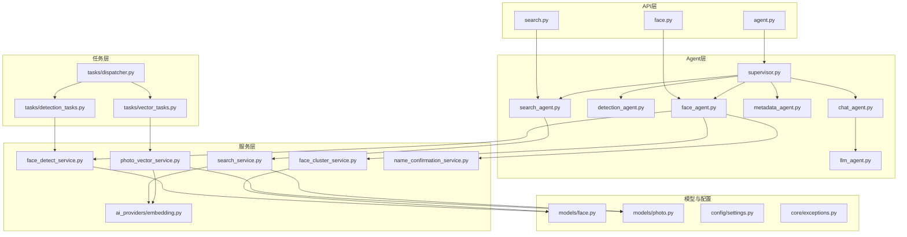
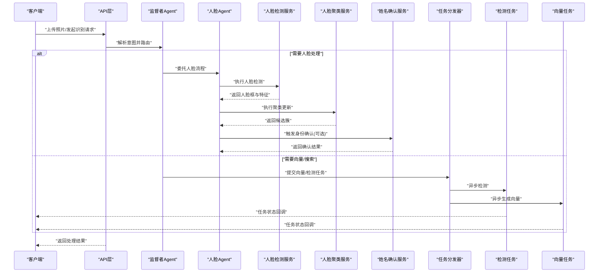
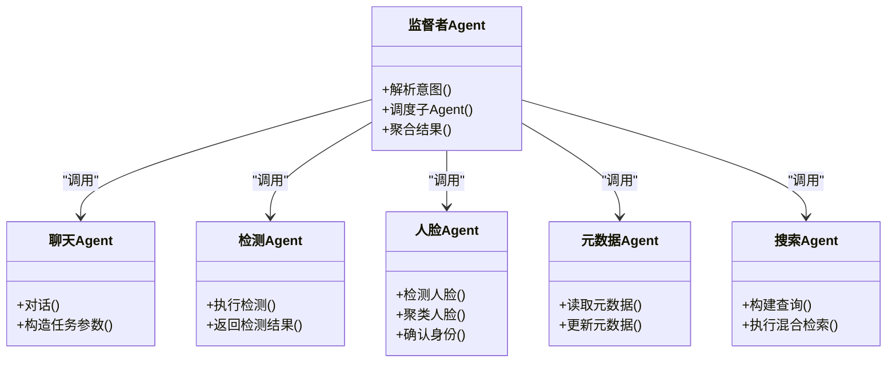
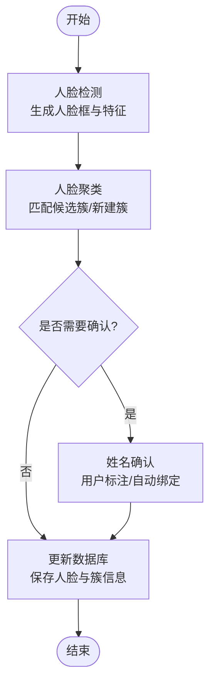
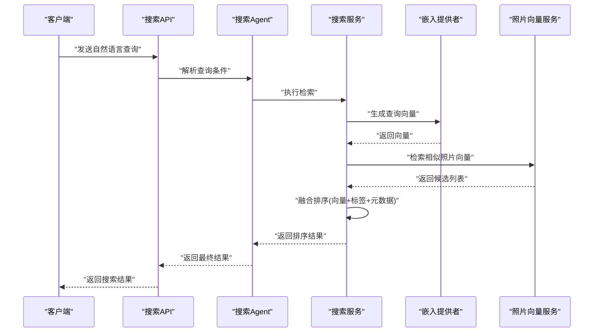
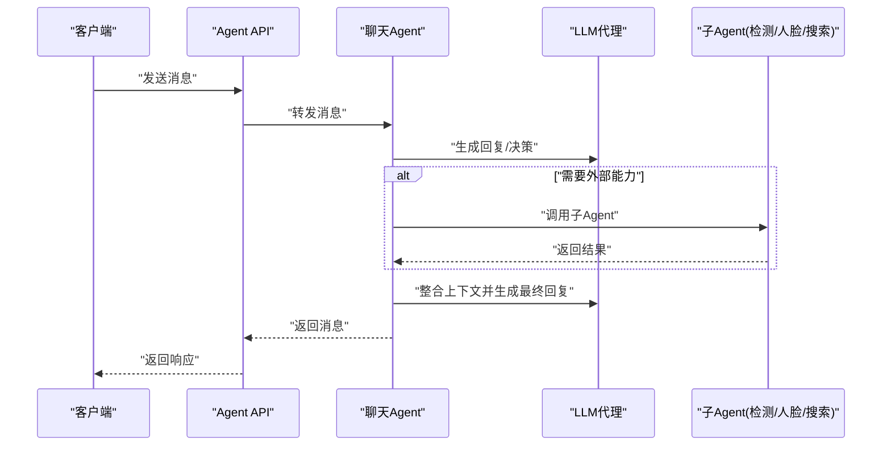
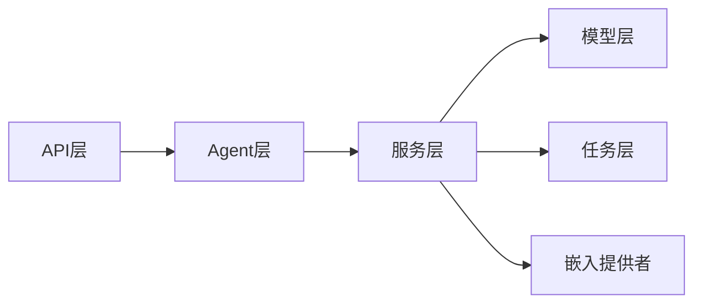

# AI智能功能

<cite>
**本文引用的文件**   
- [backend/app/api/agent.py](file://backend/app/api/agent.py)
- [backend/app/api/face.py](file://backend/app/api/face.py)
- [backend/app/api/search.py](file://backend/app/api/search.py)
- [backend/app/services/agent/chat_agent.py](file://backend/app/services/agent/chat_agent.py)
- [backend/app/services/agent/detection_agent.py](file://backend/app/services/agent/detection_agent.py)
- [backend/app/services/agent/face_agent.py](file://backend/app/services/agent/face_agent.py)
- [backend/app/services/agent/llm_agent.py](file://backend/app/services/agent/llm_agent.py)
- [backend/app/services/agent/metadata_agent.py](file://backend/app/services/agent/metadata_agent.py)
- [backend/app/services/agent/search_agent.py](file://backend/app/services/agent/search_agent.py)
- [backend/app/services/agent/supervisor.py](file://backend/app/services/agent/supervisor.py)
- [backend/app/services/ai_providers/embedding.py](file://backend/app/services/ai_providers/embedding.py)
- [backend/app/services/photo_vector_service.py](file://backend/app/services/photo_vector_service.py)
- [backend/app/services/search_service.py](file://backend/app/services/search_service.py)
- [backend/app/services/face_detect_service.py](file://backend/app/services/face_detect_service.py)
- [backend/app/services/face_cluster_service.py](file://backend/app/services/face_cluster_service.py)
- [backend/app/services/name_confirmation_service.py](file://backend/app/services/name_confirmation_service.py)
- [backend/app/models/face.py](file://backend/app/models/face.py)
- [backend/app/models/photo.py](file://backend/app/models/photo.py)
- [backend/app/config/settings.py](file://backend/app/config/settings.py)
- [backend/app/core/exceptions.py](file://backend/app/core/exceptions.py)
- [backend/app/tasks/dispatcher.py](file://backend/app/tasks/dispatcher.py)
- [backend/app/tasks/detection_tasks.py](file://backend/app/tasks/detection_tasks.py)
- [backend/app/tasks/vector_tasks.py](file://backend/app/tasks/vector_tasks.py)
</cite>

## 目录
1. [简介](#简介)
2. [项目结构](#项目结构)
3. [核心组件](#核心组件)
4. [架构总览](#架构总览)
5. [详细组件分析](#详细组件分析)
6. [依赖关系分析](#依赖关系分析)
7. [性能考虑](#性能考虑)
8. [故障排查指南](#故障排查指南)
9. [结论](#结论)
10. [附录](#附录)

## 简介
本技术文档聚焦于AI智能功能的实现与使用，涵盖多Agent协作架构、人脸识别系统（检测-聚类-确认）、语义搜索（向量嵌入-相似度计算-排序）等关键能力。文档同时提供配置方法、性能调优建议、扩展新模型的指导以及调用示例与错误处理策略，帮助开发者快速集成与优化AI服务。

## 项目结构
后端采用分层与模块化设计：API层暴露REST接口；Agent层负责多Agent编排与任务路由；Service层封装具体AI能力（人脸、向量、搜索等）；Task层异步执行耗时任务；Model层定义数据模型；Config提供全局配置；Core提供异常与安全等通用能力。

图表来源
- [backend/app/api/agent.py](file://backend/app/api/agent.py)
- [backend/app/api/face.py](file://backend/app/api/face.py)
- [backend/app/api/search.py](file://backend/app/api/search.py)
- [backend/app/services/agent/supervisor.py](file://backend/app/services/agent/supervisor.py)
- [backend/app/services/agent/chat_agent.py](file://backend/app/services/agent/chat_agent.py)
- [backend/app/services/agent/detection_agent.py](file://backend/app/services/agent/detection_agent.py)
- [backend/app/services/agent/face_agent.py](file://backend/app/services/agent/face_agent.py)
- [backend/app/services/agent/llm_agent.py](file://backend/app/services/agent/llm_agent.py)
- [backend/app/services/agent/metadata_agent.py](file://backend/app/services/agent/metadata_agent.py)
- [backend/app/services/agent/search_agent.py](file://backend/app/services/agent/search_agent.py)
- [backend/app/services/photo_vector_service.py](file://backend/app/services/photo_vector_service.py)
- [backend/app/services/search_service.py](file://backend/app/services/search_service.py)
- [backend/app/services/face_detect_service.py](file://backend/app/services/face_detect_service.py)
- [backend/app/services/face_cluster_service.py](file://backend/app/services/face_cluster_service.py)
- [backend/app/services/name_confirmation_service.py](file://backend/app/services/name_confirmation_service.py)
- [backend/app/services/ai_providers/embedding.py](file://backend/app/services/ai_providers/embedding.py)
- [backend/app/models/face.py](file://backend/app/models/face.py)
- [backend/app/models/photo.py](file://backend/app/models/photo.py)
- [backend/app/config/settings.py](file://backend/app/config/settings.py)
- [backend/app/core/exceptions.py](file://backend/app/core/exceptions.py)
- [backend/app/tasks/dispatcher.py](file://backend/app/tasks/dispatcher.py)
- [backend/app/tasks/detection_tasks.py](file://backend/app/tasks/detection_tasks.py)
- [backend/app/tasks/vector_tasks.py](file://backend/app/tasks/vector_tasks.py)

章节来源
- [backend/app/api/agent.py](file://backend/app/api/agent.py)
- [backend/app/api/face.py](file://backend/app/api/face.py)
- [backend/app/api/search.py](file://backend/app/api/search.py)
- [backend/app/services/agent/supervisor.py](file://backend/app/services/agent/supervisor.py)
- [backend/app/services/agent/chat_agent.py](file://backend/app/services/agent/chat_agent.py)
- [backend/app/services/agent/detection_agent.py](file://backend/app/services/agent/detection_agent.py)
- [backend/app/services/agent/face_agent.py](file://backend/app/services/agent/face_agent.py)
- [backend/app/services/agent/llm_agent.py](file://backend/app/services/agent/llm_agent.py)
- [backend/app/services/agent/metadata_agent.py](file://backend/app/services/agent/metadata_agent.py)
- [backend/app/services/agent/search_agent.py](file://backend/app/services/agent/search_agent.py)
- [backend/app/services/photo_vector_service.py](file://backend/app/services/photo_vector_service.py)
- [backend/app/services/search_service.py](file://backend/app/services/search_service.py)
- [backend/app/services/face_detect_service.py](file://backend/app/services/face_detect_service.py)
- [backend/app/services/face_cluster_service.py](file://backend/app/services/face_cluster_service.py)
- [backend/app/services/name_confirmation_service.py](file://backend/app/services/name_confirmation_service.py)
- [backend/app/services/ai_providers/embedding.py](file://backend/app/services/ai_providers/embedding.py)
- [backend/app/models/face.py](file://backend/app/models/face.py)
- [backend/app/models/photo.py](file://backend/app/models/photo.py)
- [backend/app/config/settings.py](file://backend/app/config/settings.py)
- [backend/app/core/exceptions.py](file://backend/app/core/exceptions.py)
- [backend/app/tasks/dispatcher.py](file://backend/app/tasks/dispatcher.py)
- [backend/app/tasks/detection_tasks.py](file://backend/app/tasks/detection_tasks.py)
- [backend/app/tasks/vector_tasks.py](file://backend/app/tasks/vector_tasks.py)

## 核心组件
- 多Agent协作
  - 监督者Agent：统一入口，解析用户意图并调度子Agent（聊天、检测、人脸、元数据、搜索）。
  - 聊天Agent：基于大语言模型进行对话与指令理解，必要时调用其他Agent完成复杂任务。
  - 检测Agent：触发图片目标检测流程，产出检测结果供后续处理。
  - 人脸Agent：协调人脸检测、聚类与姓名确认，维护人脸身份映射。
  - 元数据Agent：提取或补充照片元信息（如时间、地点、设备），辅助检索与展示。
  - 搜索Agent：将自然语言查询转换为结构化检索条件，结合向量与标签进行混合检索。
- 人脸识别系统
  - 人脸检测：从图像中定位人脸区域并生成特征向量。
  - 人脸聚类：对历史人脸特征进行聚类，形成“人脸簇”代表潜在同一人。
  - 身份确认：在检测到新人脸时，通过候选簇匹配与人工确认机制确定最终身份。
- 语义搜索
  - 向量嵌入：为照片生成视觉/文本描述向量，支持跨模态相似性。
  - 相似度计算：基于余弦相似度或内积度量，结合阈值过滤低置信结果。
  - 结果排序：融合向量相似度、标签权重、时间/地理等元数据，输出最终排序列表。

章节来源
- [backend/app/services/agent/supervisor.py](file://backend/app/services/agent/supervisor.py)
- [backend/app/services/agent/chat_agent.py](file://backend/app/services/agent/chat_agent.py)
- [backend/app/services/agent/detection_agent.py](file://backend/app/services/agent/detection_agent.py)
- [backend/app/services/agent/face_agent.py](file://backend/app/services/agent/face_agent.py)
- [backend/app/services/agent/metadata_agent.py](file://backend/app/services/agent/metadata_agent.py)
- [backend/app/services/agent/search_agent.py](file://backend/app/services/agent/search_agent.py)
- [backend/app/services/face_detect_service.py](file://backend/app/services/face_detect_service.py)
- [backend/app/services/face_cluster_service.py](file://backend/app/services/face_cluster_service.py)
- [backend/app/services/name_confirmation_service.py](file://backend/app/services/name_confirmation_service.py)
- [backend/app/services/photo_vector_service.py](file://backend/app/services/photo_vector_service.py)
- [backend/app/services/search_service.py](file://backend/app/services/search_service.py)
- [backend/app/services/ai_providers/embedding.py](file://backend/app/services/ai_providers/embedding.py)

## 架构总览
下图展示了从API到Agent再到具体服务的端到端调用路径，以及异步任务如何驱动批量处理。

图表来源
- [backend/app/api/agent.py](file://backend/app/api/agent.py)
- [backend/app/services/agent/supervisor.py](file://backend/app/services/agent/supervisor.py)
- [backend/app/services/agent/face_agent.py](file://backend/app/services/agent/face_agent.py)
- [backend/app/services/face_detect_service.py](file://backend/app/services/face_detect_service.py)
- [backend/app/services/face_cluster_service.py](file://backend/app/services/face_cluster_service.py)
- [backend/app/services/name_confirmation_service.py](file://backend/app/services/name_confirmation_service.py)
- [backend/app/tasks/dispatcher.py](file://backend/app/tasks/dispatcher.py)
- [backend/app/tasks/detection_tasks.py](file://backend/app/tasks/detection_tasks.py)
- [backend/app/tasks/vector_tasks.py](file://backend/app/tasks/vector_tasks.py)

## 详细组件分析

### 多Agent协作架构
- 职责分工
  - 监督者Agent：接收上层请求，判断意图（对话、检测、人脸、搜索），选择对应子Agent并聚合结果。
  - 聊天Agent：与大语言模型交互，生成回复或构造下游任务参数。
  - 检测Agent：封装检测流程，调用检测服务并返回结构化结果。
  - 人脸Agent：串联检测、聚类与确认，管理人脸ID与名称映射。
  - 元数据Agent：读取/写入照片元数据，增强检索维度。
  - 搜索Agent：将自然语言转为查询条件，组合向量与标签进行检索。
- 协作机制
  - 同步调用：轻量任务（如元数据读取、简单分类）直接由监督者同步调用。
  - 异步任务：耗时操作（批量检测、向量生成）通过任务分发器入队，后台Worker执行并回写结果。
  - 事件驱动：任务完成后触发后续步骤（如检测完成后自动进入向量生成与索引）。

图表来源
- [backend/app/services/agent/supervisor.py](file://backend/app/services/agent/supervisor.py)
- [backend/app/services/agent/chat_agent.py](file://backend/app/services/agent/chat_agent.py)
- [backend/app/services/agent/detection_agent.py](file://backend/app/services/agent/detection_agent.py)
- [backend/app/services/agent/face_agent.py](file://backend/app/services/agent/face_agent.py)
- [backend/app/services/agent/metadata_agent.py](file://backend/app/services/agent/metadata_agent.py)
- [backend/app/services/agent/search_agent.py](file://backend/app/services/agent/search_agent.py)

章节来源
- [backend/app/services/agent/supervisor.py](file://backend/app/services/agent/supervisor.py)
- [backend/app/services/agent/chat_agent.py](file://backend/app/services/agent/chat_agent.py)
- [backend/app/services/agent/detection_agent.py](file://backend/app/services/agent/detection_agent.py)
- [backend/app/services/agent/face_agent.py](file://backend/app/services/agent/face_agent.py)
- [backend/app/services/agent/metadata_agent.py](file://backend/app/services/agent/metadata_agent.py)
- [backend/app/services/agent/search_agent.py](file://backend/app/services/agent/search_agent.py)

### 人脸识别系统（检测-聚类-确认）
- 工作流
  - 人脸检测：输入图像，输出人脸框与特征向量。
  - 人脸聚类：将新特征与历史簇中心比较，决定新增簇或加入现有簇。
  - 身份确认：当存在高置信候选簇时，提示用户确认或自动绑定名称。
- 数据结构
  - 人脸记录：包含人脸ID、所属照片ID、人脸框坐标、特征向量、创建/更新时间。
  - 照片记录：包含媒体路径、元数据、关联的人脸集合。
- 算法要点
  - 相似度阈值：用于判定是否属于同一人，需根据数据集分布调优。
  - 增量更新：支持在线聚类，避免全量重算。
  - 冲突解决：多人同框或遮挡场景下的边界框修正与特征融合。

图表来源
- [backend/app/services/face_detect_service.py](file://backend/app/services/face_detect_service.py)
- [backend/app/services/face_cluster_service.py](file://backend/app/services/face_cluster_service.py)
- [backend/app/services/name_confirmation_service.py](file://backend/app/services/name_confirmation_service.py)
- [backend/app/models/face.py](file://backend/app/models/face.py)
- [backend/app/models/photo.py](file://backend/app/models/photo.py)

章节来源
- [backend/app/services/face_detect_service.py](file://backend/app/services/face_detect_service.py)
- [backend/app/services/face_cluster_service.py](file://backend/app/services/face_cluster_service.py)
- [backend/app/services/name_confirmation_service.py](file://backend/app/services/name_confirmation_service.py)
- [backend/app/models/face.py](file://backend/app/models/face.py)
- [backend/app/models/photo.py](file://backend/app/models/photo.py)

### 语义搜索（向量嵌入-相似度-排序）
- 向量嵌入
  - 为照片生成视觉向量，并可结合文本描述生成文本向量，支持跨模态检索。
  - 嵌入提供者抽象化，便于替换不同模型后端。
- 相似度计算
  - 常用余弦相似度或点积，配合阈值过滤低相关结果。
- 结果排序
  - 融合向量相似度、标签权重、时间/地理位置等元数据，按业务规则加权排序。
- 索引与缓存
  - 向量持久化至存储，建立近似最近邻索引以提升检索效率。
  - 热点查询结果可缓存，降低重复计算开销。

图表来源
- [backend/app/api/search.py](file://backend/app/api/search.py)
- [backend/app/services/agent/search_agent.py](file://backend/app/services/agent/search_agent.py)
- [backend/app/services/search_service.py](file://backend/app/services/search_service.py)
- [backend/app/services/ai_providers/embedding.py](file://backend/app/services/ai_providers/embedding.py)
- [backend/app/services/photo_vector_service.py](file://backend/app/services/photo_vector_service.py)

章节来源
- [backend/app/api/search.py](file://backend/app/api/search.py)
- [backend/app/services/agent/search_agent.py](file://backend/app/services/agent/search_agent.py)
- [backend/app/services/search_service.py](file://backend/app/services/search_service.py)
- [backend/app/services/ai_providers/embedding.py](file://backend/app/services/ai_providers/embedding.py)
- [backend/app/services/photo_vector_service.py](file://backend/app/services/photo_vector_service.py)

### 聊天与大模型集成
- 聊天Agent负责与LLM交互，支持多轮对话与工具调用。
- LLM代理封装模型调用细节（鉴权、重试、限流），对外暴露统一接口。
- 典型用法：用户提问→聊天Agent解析→必要时调用检测/人脸/搜索子Agent→汇总回答。

图表来源
- [backend/app/api/agent.py](file://backend/app/api/agent.py)
- [backend/app/services/agent/chat_agent.py](file://backend/app/services/agent/chat_agent.py)
- [backend/app/services/agent/llm_agent.py](file://backend/app/services/agent/llm_agent.py)

章节来源
- [backend/app/api/agent.py](file://backend/app/api/agent.py)
- [backend/app/services/agent/chat_agent.py](file://backend/app/services/agent/chat_agent.py)
- [backend/app/services/agent/llm_agent.py](file://backend/app/services/agent/llm_agent.py)

## 依赖关系分析
- 组件耦合
  - API层仅依赖Agent与服务层接口，保持松耦合。
  - Agent层通过服务层访问AI能力，避免直接依赖底层模型实现。
  - 任务层解耦耗时操作，提升系统吞吐与稳定性。
- 外部依赖
  - 嵌入提供者可替换，便于接入不同厂商的向量模型。
  - 数据库与对象存储作为持久化后端，承载人脸、照片与向量数据。
- 循环依赖检查
  - 当前分层清晰，未发现明显循环依赖；若新增模块，应遵循单向依赖原则。

图表来源
- [backend/app/api/agent.py](file://backend/app/api/agent.py)
- [backend/app/api/face.py](file://backend/app/api/face.py)
- [backend/app/api/search.py](file://backend/app/api/search.py)
- [backend/app/services/agent/supervisor.py](file://backend/app/services/agent/supervisor.py)
- [backend/app/services/face_detect_service.py](file://backend/app/services/face_detect_service.py)
- [backend/app/services/face_cluster_service.py](file://backend/app/services/face_cluster_service.py)
- [backend/app/services/name_confirmation_service.py](file://backend/app/services/name_confirmation_service.py)
- [backend/app/services/photo_vector_service.py](file://backend/app/services/photo_vector_service.py)
- [backend/app/services/search_service.py](file://backend/app/services/search_service.py)
- [backend/app/services/ai_providers/embedding.py](file://backend/app/services/ai_providers/embedding.py)
- [backend/app/tasks/dispatcher.py](file://backend/app/tasks/dispatcher.py)
- [backend/app/tasks/detection_tasks.py](file://backend/app/tasks/detection_tasks.py)
- [backend/app/tasks/vector_tasks.py](file://backend/app/tasks/vector_tasks.py)

章节来源
- [backend/app/api/agent.py](file://backend/app/api/agent.py)
- [backend/app/api/face.py](file://backend/app/api/face.py)
- [backend/app/api/search.py](file://backend/app/api/search.py)
- [backend/app/services/agent/supervisor.py](file://backend/app/services/agent/supervisor.py)
- [backend/app/services/face_detect_service.py](file://backend/app/services/face_detect_service.py)
- [backend/app/services/face_cluster_service.py](file://backend/app/services/face_cluster_service.py)
- [backend/app/services/name_confirmation_service.py](file://backend/app/services/name_confirmation_service.py)
- [backend/app/services/photo_vector_service.py](file://backend/app/services/photo_vector_service.py)
- [backend/app/services/search_service.py](file://backend/app/services/search_service.py)
- [backend/app/services/ai_providers/embedding.py](file://backend/app/services/ai_providers/embedding.py)
- [backend/app/tasks/dispatcher.py](file://backend/app/tasks/dispatcher.py)
- [backend/app/tasks/detection_tasks.py](file://backend/app/tasks/detection_tasks.py)
- [backend/app/tasks/vector_tasks.py](file://backend/app/tasks/vector_tasks.py)

## 性能考虑
- 并发与批处理
  - 使用任务分发器将检测与向量生成放入队列，Worker并行处理，提高吞吐。
  - 批量提交任务可减少网络往返与模型加载开销。
- 内存与GPU利用
  - 合理设置批次大小，避免OOM；复用模型实例减少初始化成本。
  - 对高频查询启用缓存（结果缓存、向量缓存）。
- 索引与检索
  - 为向量建立近似最近邻索引，显著降低检索延迟。
  - 对相似度阈值与排序权重进行离线评估与在线A/B测试。
- 监控与降级
  - 记录关键指标（QPS、延迟、错误率），设置熔断与降级策略。
  - 对第三方模型服务增加超时与重试退避。

[本节为通用性能建议，不直接分析具体文件]

## 故障排查指南
- 常见错误类型
  - 模型加载失败：检查模型路径、权限与依赖库版本。
  - 向量生成超时：调整超时与重试策略，检查GPU/CPU资源占用。
  - 人脸聚类不稳定：调整相似度阈值，检查人脸框质量与遮挡情况。
- 日志与诊断
  - 开启详细日志，记录请求ID、输入摘要与中间结果。
  - 对关键路径添加埋点，定位瓶颈与异常分支。
- 恢复策略
  - 任务失败重试与死信队列，确保数据一致性。
  - 提供回滚与补偿接口，支持部分失败场景的修复。

章节来源
- [backend/app/core/exceptions.py](file://backend/app/core/exceptions.py)
- [backend/app/tasks/dispatcher.py](file://backend/app/tasks/dispatcher.py)
- [backend/app/tasks/detection_tasks.py](file://backend/app/tasks/detection_tasks.py)
- [backend/app/tasks/vector_tasks.py](file://backend/app/tasks/vector_tasks.py)

## 结论
本AI智能功能以多Agent协作为核心，围绕人脸识别与语义搜索两大能力构建完整闭环。通过分层架构与异步任务机制，系统在可扩展性与性能之间取得平衡。建议在生产环境完善监控与降级策略，持续优化相似度阈值与排序权重，并根据业务需求灵活扩展新的AI模型。

[本节为总结性内容，不直接分析具体文件]

## 附录

### 配置方法
- 全局配置
  - 在配置文件中设置模型路径、阈值、并发数、超时等参数。
  - 指定嵌入提供者后端与认证信息。
- 运行时开关
  - 控制是否启用人脸聚类、是否启用向量索引、是否启用缓存等。
- 环境变量
  - 通过环境变量注入敏感信息与外部服务地址。

章节来源
- [backend/app/config/settings.py](file://backend/app/config/settings.py)

### 性能调优技巧
- 调整相似度阈值与聚类参数，平衡召回与精度。
- 增大Worker数量与批次大小，充分利用硬件资源。
- 引入向量索引与缓存，降低检索延迟。
- 对热门查询进行预计算与预热。

[本节为通用建议，不直接分析具体文件]

### 扩展新AI模型
- 嵌入提供者扩展
  - 实现统一的嵌入接口，注册新的模型后端。
  - 在配置中切换默认提供者。
- 服务层适配
  - 在人脸或搜索服务中接入新模型，保持对外接口不变。
- 任务层适配
  - 为新模型的任务类型添加处理器，纳入任务分发器。

章节来源
- [backend/app/services/ai_providers/embedding.py](file://backend/app/services/ai_providers/embedding.py)
- [backend/app/services/face_detect_service.py](file://backend/app/services/face_detect_service.py)
- [backend/app/services/search_service.py](file://backend/app/services/search_service.py)
- [backend/app/tasks/dispatcher.py](file://backend/app/tasks/dispatcher.py)

### 调用示例与错误处理策略
- 人脸检测
  - 通过人脸API提交图片，返回人脸框与特征；若失败，检查图片格式与模型状态。
- 人脸聚类与确认
  - 提交待聚类的人脸特征，返回候选簇；如需确认，调用确认接口完成命名。
- 语义搜索
  - 提交自然语言查询，返回排序后的照片列表；若为空，调整阈值或扩展标签。
- 错误处理
  - 统一异常包装，返回明确的状态码与提示信息。
  - 对超时与网络错误实施重试与降级。

章节来源
- [backend/app/api/face.py](file://backend/app/api/face.py)
- [backend/app/api/search.py](file://backend/app/api/search.py)
- [backend/app/core/exceptions.py](file://backend/app/core/exceptions.py)