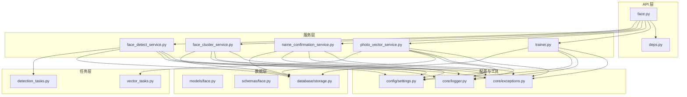
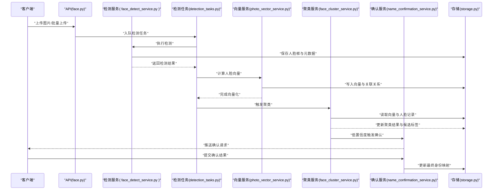
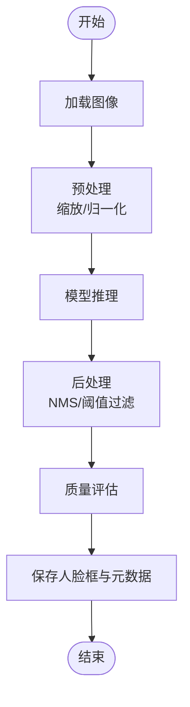
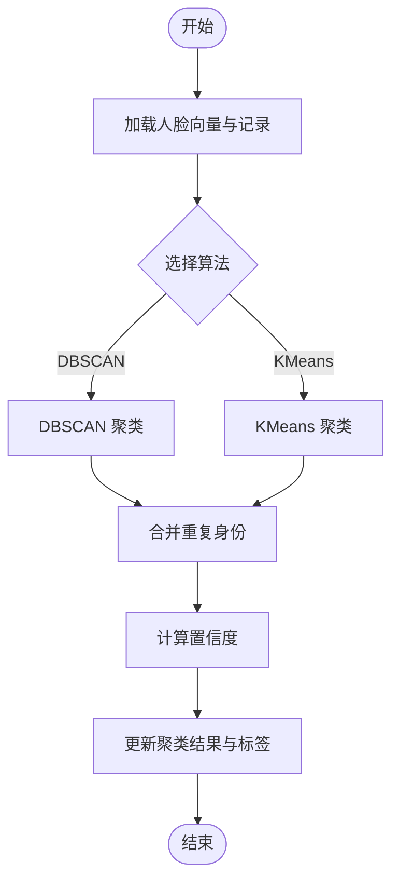
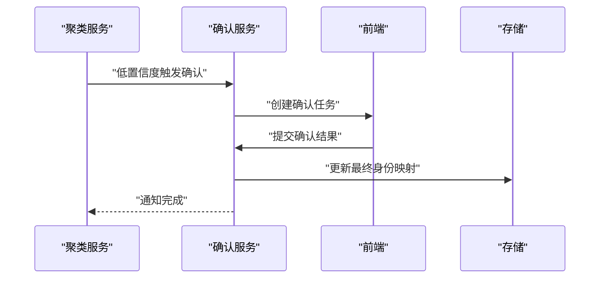
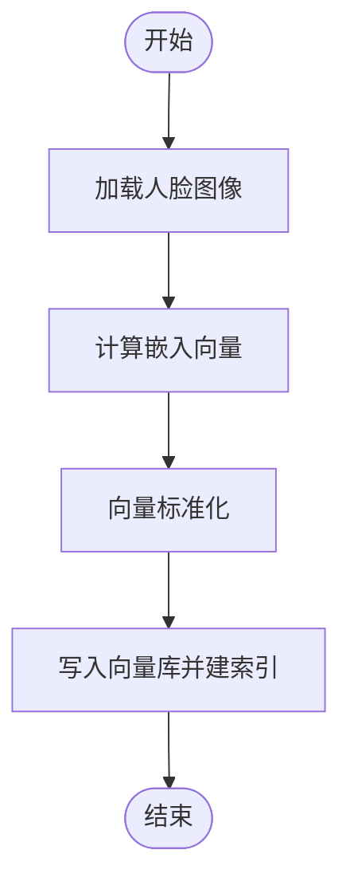
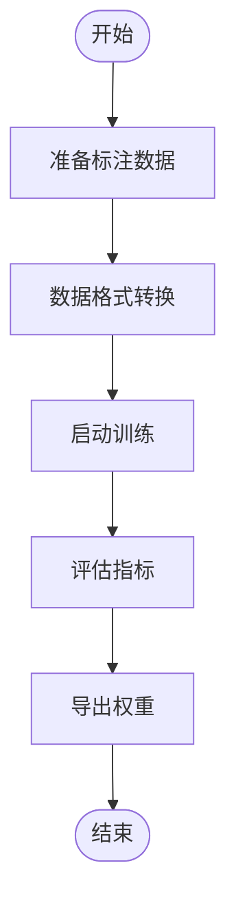
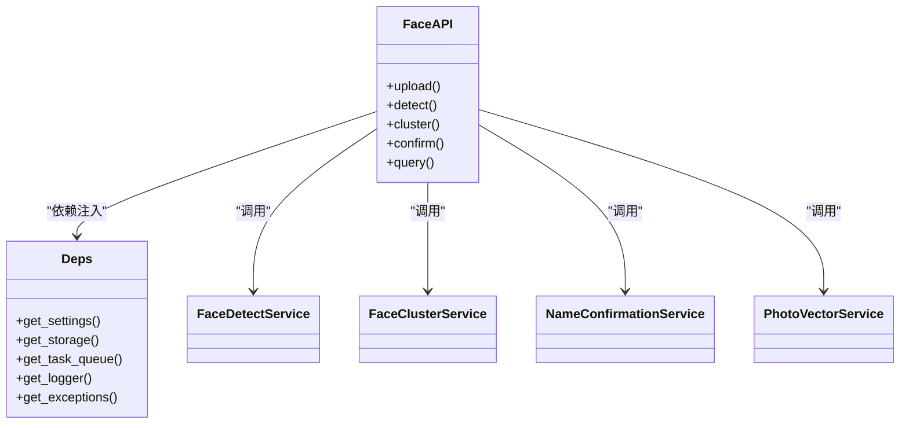
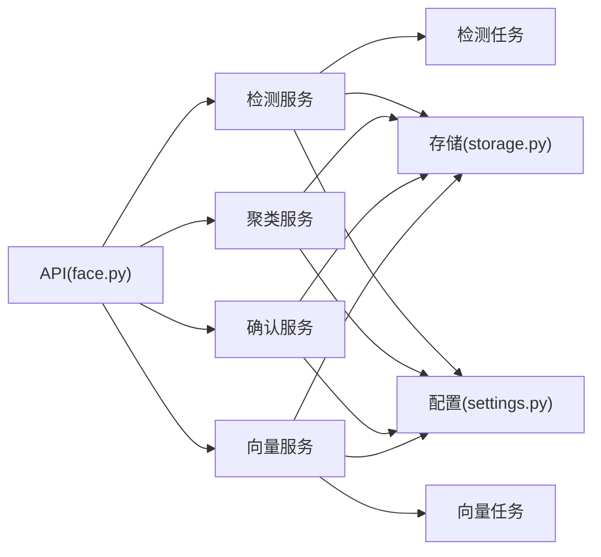

# 人脸识别系统

<cite>
**本文引用的文件**   
- [backend/app/api/face.py](file://backend/app/api/face.py)
- [backend/app/services/face_detect_service.py](file://backend/app/services/face_detect_service.py)
- [backend/app/services/face_cluster_service.py](file://backend/app/services/face_cluster_service.py)
- [backend/app/services/name_confirmation_service.py](file://backend/app/services/name_confirmation_service.py)
- [backend/app/models/face.py](file://backend/app/models/face.py)
- [backend/app/schemas/face.py](file://backend/app/schemas/face.py)
- [backend/app/database/storage.py](file://backend/app/database/storage.py)
- [backend/app/tasks/detection_tasks.py](file://backend/app/tasks/detection_tasks.py)
- [backend/app/tasks/vector_tasks.py](file://backend/app/tasks/vector_tasks.py)
- [backend/app/config/settings.py](file://backend/app/config/settings.py)
- [backend/app/core/logger.py](file://backend/app/core/logger.py)
- [backend/app/core/exceptions.py](file://backend/app/core/exceptions.py)
- [backend/app/api/deps.py](file://backend/app/api/deps.py)
- [backend/app/services/photo_vector_service.py](file://backend/app/services/photo_vector_service.py)
- [backend/app/services/trainer.py](file://backend/app/services/trainer.py)
- [backend/app/services/train/config.py](file://backend/app/services/train/config.py)
</cite>

## 目录
1. [简介](#简介)
2. [项目结构](#项目结构)
3. [核心组件](#核心组件)
4. [架构总览](#架构总览)
5. [详细组件分析](#详细组件分析)
6. [依赖关系分析](#依赖关系分析)
7. [性能考虑](#性能考虑)
8. [故障排查指南](#故障排查指南)
9. [结论](#结论)
10. [附录](#附录)

## 简介
本技术文档面向“人脸识别系统”的完整工作流，覆盖从人脸检测到聚类再到身份确认的全链路实现与优化。重点包括：
- 人脸检测算法的实现原理、精度调优与性能优化策略
- 人脸聚类的算法选择（如 DBSCAN、KMeans）与参数配置方法
- 身份确认机制：人脸比对阈值设置、误识别处理与用户确认流程
- 人脸数据库设计、索引优化与查询性能调优
- API 调用示例、错误处理策略与故障排查方法

## 项目结构
后端采用分层架构：API 层暴露接口，服务层封装业务逻辑，模型与存储层负责数据持久化，任务层异步执行耗时操作（检测、向量化、训练等）。前端通过 REST API 与后端交互，提供上传、管理、搜索与确认界面。

图表来源
- [backend/app/api/face.py](file://backend/app/api/face.py)
- [backend/app/services/face_detect_service.py](file://backend/app/services/face_detect_service.py)
- [backend/app/services/face_cluster_service.py](file://backend/app/services/face_cluster_service.py)
- [backend/app/services/name_confirmation_service.py](file://backend/app/services/name_confirmation_service.py)
- [backend/app/services/photo_vector_service.py](file://backend/app/services/photo_vector_service.py)
- [backend/app/services/trainer.py](file://backend/app/services/trainer.py)
- [backend/app/tasks/detection_tasks.py](file://backend/app/tasks/detection_tasks.py)
- [backend/app/tasks/vector_tasks.py](file://backend/app/tasks/vector_tasks.py)
- [backend/app/models/face.py](file://backend/app/models/face.py)
- [backend/app/schemas/face.py](file://backend/app/schemas/face.py)
- [backend/app/database/storage.py](file://backend/app/database/storage.py)
- [backend/app/config/settings.py](file://backend/app/config/settings.py)
- [backend/app/core/logger.py](file://backend/app/core/logger.py)
- [backend/app/core/exceptions.py](file://backend/app/core/exceptions.py)

章节来源
- [backend/app/api/face.py](file://backend/app/api/face.py)
- [backend/app/services/face_detect_service.py](file://backend/app/services/face_detect_service.py)
- [backend/app/services/face_cluster_service.py](file://backend/app/services/face_cluster_service.py)
- [backend/app/services/name_confirmation_service.py](file://backend/app/services/name_confirmation_service.py)
- [backend/app/services/photo_vector_service.py](file://backend/app/services/photo_vector_service.py)
- [backend/app/services/trainer.py](file://backend/app/services/trainer.py)
- [backend/app/tasks/detection_tasks.py](file://backend/app/tasks/detection_tasks.py)
- [backend/app/tasks/vector_tasks.py](file://backend/app/tasks/vector_tasks.py)
- [backend/app/models/face.py](file://backend/app/models/face.py)
- [backend/app/schemas/face.py](file://backend/app/schemas/face.py)
- [backend/app/database/storage.py](file://backend/app/database/storage.py)
- [backend/app/config/settings.py](file://backend/app/config/settings.py)
- [backend/app/core/logger.py](file://backend/app/core/logger.py)
- [backend/app/core/exceptions.py](file://backend/app/core/exceptions.py)

## 核心组件
- 人脸检测服务：负责图像中人脸区域的定位与裁剪，输出人脸框与质量指标，支持批量与异步任务。
- 人脸聚类服务：基于人脸向量进行聚类，合并重复身份，生成或更新身份标签。
- 名称确认服务：在低置信度场景下触发人工确认流程，维护用户最终确认的身份映射。
- 照片向量服务：提取人脸特征向量并写入向量库，支撑相似度检索与聚类。
- 训练服务：用于自定义模型微调与评估，提升特定场景下的检测与识别精度。
- 任务调度：将检测、向量化、训练等耗时任务放入队列，避免阻塞请求。

章节来源
- [backend/app/services/face_detect_service.py](file://backend/app/services/face_detect_service.py)
- [backend/app/services/face_cluster_service.py](file://backend/app/services/face_cluster_service.py)
- [backend/app/services/name_confirmation_service.py](file://backend/app/services/name_confirmation_service.py)
- [backend/app/services/photo_vector_service.py](file://backend/app/services/photo_vector_service.py)
- [backend/app/services/trainer.py](file://backend/app/services/trainer.py)
- [backend/app/tasks/detection_tasks.py](file://backend/app/tasks/detection_tasks.py)
- [backend/app/tasks/vector_tasks.py](file://backend/app/tasks/vector_tasks.py)

## 架构总览
整体流程分为三个阶段：
- 检测阶段：接收图片，执行人脸检测，保存人脸区域与元数据。
- 聚类阶段：对人脸向量进行聚类，合并重复身份，生成候选标签。
- 确认阶段：对低置信度结果发起用户确认，形成最终身份映射。

图表来源
- [backend/app/api/face.py](file://backend/app/api/face.py)
- [backend/app/services/face_detect_service.py](file://backend/app/services/face_detect_service.py)
- [backend/app/tasks/detection_tasks.py](file://backend/app/tasks/detection_tasks.py)
- [backend/app/services/photo_vector_service.py](file://backend/app/services/photo_vector_service.py)
- [backend/app/tasks/vector_tasks.py](file://backend/app/tasks/vector_tasks.py)
- [backend/app/services/face_cluster_service.py](file://backend/app/services/face_cluster_service.py)
- [backend/app/services/name_confirmation_service.py](file://backend/app/services/name_confirmation_service.py)
- [backend/app/database/storage.py](file://backend/app/database/storage.py)

## 详细组件分析

### 人脸检测服务
职责与流程
- 输入：单张或多张图片路径或字节流。
- 处理：加载图像、预处理、推理检测模型、后处理（NMS、过滤）、质量评估。
- 输出：人脸框坐标、置信度、质量分数、裁剪图、关联任务ID。
- 异步：通过任务队列执行，避免阻塞主线程。

关键要点
- 检测精度调优：调整输入分辨率、阈值、NMS IoU、多尺度增强；使用高质量数据集进行微调。
- 性能优化：批处理推理、GPU 加速、缓存中间结果、限制最小尺寸与最大并发。
- 错误处理：捕获解码失败、模型加载异常、内存不足等，记录日志并回退到降级策略。

图表来源
- [backend/app/services/face_detect_service.py](file://backend/app/services/face_detect_service.py)
- [backend/app/tasks/detection_tasks.py](file://backend/app/tasks/detection_tasks.py)
- [backend/app/database/storage.py](file://backend/app/database/storage.py)
- [backend/app/core/logger.py](file://backend/app/core/logger.py)
- [backend/app/core/exceptions.py](file://backend/app/core/exceptions.py)

章节来源
- [backend/app/services/face_detect_service.py](file://backend/app/services/face_detect_service.py)
- [backend/app/tasks/detection_tasks.py](file://backend/app/tasks/detection_tasks.py)
- [backend/app/database/storage.py](file://backend/app/database/storage.py)
- [backend/app/core/logger.py](file://backend/app/core/logger.py)
- [backend/app/core/exceptions.py](file://backend/app/core/exceptions.py)

### 人脸聚类服务
职责与流程
- 输入：人脸向量集合及对应的人脸记录。
- 处理：选择聚类算法（DBSCAN/KMeans），计算相似度矩阵或距离，执行聚类，合并重复身份。
- 输出：聚类标签、簇中心、成员列表、置信度评分。
- 策略：根据数据规模与分布选择算法；DBSCAN 适合未知类别数且存在噪声；KMeans 适合已知类别数且簇形状近似球形。

参数配置建议
- DBSCAN：eps（邻域半径）、min_samples（最小样本数）、metric（余弦/欧氏）。
- KMeans：n_clusters（簇数量）、init（初始化策略）、max_iter（最大迭代）、tol（收敛容差）。
- 评估：轮廓系数、Calinski-Harabasz 指数、人工抽检。

图表来源
- [backend/app/services/face_cluster_service.py](file://backend/app/services/face_cluster_service.py)
- [backend/app/database/storage.py](file://backend/app/database/storage.py)

章节来源
- [backend/app/services/face_cluster_service.py](file://backend/app/services/face_cluster_service.py)
- [backend/app/database/storage.py](file://backend/app/database/storage.py)

### 名称确认服务
职责与流程
- 触发条件：聚类置信度低于阈值、新簇无历史标签、用户主动修正。
- 流程：生成待确认任务，推送至前端，收集用户确认结果，更新最终身份映射。
- 策略：支持批量确认、撤销与审计日志；保留原始候选标签以便回溯。

图表来源
- [backend/app/services/name_confirmation_service.py](file://backend/app/services/name_confirmation_service.py)
- [backend/app/database/storage.py](file://backend/app/database/storage.py)

章节来源
- [backend/app/services/name_confirmation_service.py](file://backend/app/services/name_confirmation_service.py)
- [backend/app/database/storage.py](file://backend/app/database/storage.py)

### 照片向量服务
职责与流程
- 输入：人脸裁剪图或人脸记录 ID。
- 处理：加载嵌入模型，计算人脸特征向量，标准化与降维（可选）。
- 输出：向量、维度、来源人脸 ID、时间戳。
- 存储：写入向量库与关系表，建立索引以支持快速检索。

图表来源
- [backend/app/services/photo_vector_service.py](file://backend/app/services/photo_vector_service.py)
- [backend/app/database/storage.py](file://backend/app/database/storage.py)

章节来源
- [backend/app/services/photo_vector_service.py](file://backend/app/services/photo_vector_service.py)
- [backend/app/database/storage.py](file://backend/app/database/storage.py)

### 训练服务
职责与流程
- 目标：针对特定场景微调检测或识别模型，提升精度。
- 流程：准备标注数据、转换格式、启动训练、评估指标、导出权重。
- 配置：学习率、批次大小、轮次、早停策略、数据增强。

图表来源
- [backend/app/services/trainer.py](file://backend/app/services/trainer.py)
- [backend/app/services/train/config.py](file://backend/app/services/train/config.py)

章节来源
- [backend/app/services/trainer.py](file://backend/app/services/trainer.py)
- [backend/app/services/train/config.py](file://backend/app/services/train/config.py)

### API 层与依赖注入
职责与流程
- 暴露接口：上传、检测、聚类、确认、查询等。
- 依赖注入：统一获取配置、数据库连接、任务队列、日志与异常处理器。
- 校验与响应：参数校验、统一响应格式、错误码与消息。

图表来源
- [backend/app/api/face.py](file://backend/app/api/face.py)
- [backend/app/api/deps.py](file://backend/app/api/deps.py)
- [backend/app/services/face_detect_service.py](file://backend/app/services/face_detect_service.py)
- [backend/app/services/face_cluster_service.py](file://backend/app/services/face_cluster_service.py)
- [backend/app/services/name_confirmation_service.py](file://backend/app/services/name_confirmation_service.py)
- [backend/app/services/photo_vector_service.py](file://backend/app/services/photo_vector_service.py)

章节来源
- [backend/app/api/face.py](file://backend/app/api/face.py)
- [backend/app/api/deps.py](file://backend/app/api/deps.py)

## 依赖关系分析
- 模块耦合：API 层仅依赖服务层与依赖注入；服务层依赖存储与配置；任务层解耦主流程。
- 外部依赖：向量库、对象存储、任务队列、模型运行时。
- 潜在循环：通过依赖注入与服务接口化解循环风险。

图表来源
- [backend/app/api/face.py](file://backend/app/api/face.py)
- [backend/app/services/face_detect_service.py](file://backend/app/services/face_detect_service.py)
- [backend/app/services/face_cluster_service.py](file://backend/app/services/face_cluster_service.py)
- [backend/app/services/name_confirmation_service.py](file://backend/app/services/name_confirmation_service.py)
- [backend/app/services/photo_vector_service.py](file://backend/app/services/photo_vector_service.py)
- [backend/app/tasks/detection_tasks.py](file://backend/app/tasks/detection_tasks.py)
- [backend/app/tasks/vector_tasks.py](file://backend/app/tasks/vector_tasks.py)
- [backend/app/database/storage.py](file://backend/app/database/storage.py)
- [backend/app/config/settings.py](file://backend/app/config/settings.py)

章节来源
- [backend/app/api/face.py](file://backend/app/api/face.py)
- [backend/app/services/face_detect_service.py](file://backend/app/services/face_detect_service.py)
- [backend/app/services/face_cluster_service.py](file://backend/app/services/face_cluster_service.py)
- [backend/app/services/name_confirmation_service.py](file://backend/app/services/name_confirmation_service.py)
- [backend/app/services/photo_vector_service.py](file://backend/app/services/photo_vector_service.py)
- [backend/app/tasks/detection_tasks.py](file://backend/app/tasks/detection_tasks.py)
- [backend/app/tasks/vector_tasks.py](file://backend/app/app/tasks/vector_tasks.py)
- [backend/app/database/storage.py](file://backend/app/database/storage.py)
- [backend/app/config/settings.py](file://backend/app/config/settings.py)

## 性能考虑
- 检测阶段
  - 批处理与流水线并行：提高吞吐，降低延迟。
  - 模型量化与半精度：减少显存占用，提升推理速度。
  - 动态分辨率：按人脸大小自适应缩放，平衡精度与性能。
- 向量检索
  - 索引类型：HNSW/IVF-PQ 等近似最近邻索引，权衡召回率与查询时延。
  - 分片与副本：水平扩展，读写分离。
  - 预取与缓存：热点向量缓存，减少 IO 压力。
- 聚类阶段
  - 增量聚类：对新加入人脸进行局部更新，避免全量重算。
  - 采样与降维：PCA/t-SNE 辅助可视化与参数调优。
- 任务队列
  - 优先级与限流：高优先级任务优先，防止资源争用。
  - 重试与幂等：保证任务执行的可靠性与一致性。

[本节为通用指导，不直接分析具体文件]

## 故障排查指南
常见问题与定位步骤
- 检测失败
  - 检查图像解码与预处理日志，确认输入格式与尺寸。
  - 查看模型加载与 GPU 状态，验证驱动与版本兼容。
  - 核对阈值与 NMS 参数，必要时放宽阈值或调整 IoU。
- 向量检索慢
  - 检查索引构建进度与磁盘 IO，确认索引参数是否合理。
  - 监控向量库 CPU/GPU 使用率，评估是否需要扩容或分片。
- 聚类效果差
  - 观察向量分布与相似度直方图，调整 eps/min_samples 或 n_clusters。
  - 抽样人工复核，结合业务需求校准阈值。
- 确认流程卡住
  - 检查任务队列积压与消费者健康状态。
  - 确认前端推送通道与回调地址可达性。

错误处理策略
- 统一异常分类：输入错误、模型错误、存储错误、网络错误。
- 日志与追踪：结构化日志，包含请求 ID、上下文与堆栈。
- 降级与回滚：关键路径失败时回滚事务，保持数据一致性。

章节来源
- [backend/app/core/logger.py](file://backend/app/core/logger.py)
- [backend/app/core/exceptions.py](file://backend/app/core/exceptions.py)
- [backend/app/database/storage.py](file://backend/app/database/storage.py)

## 结论
本系统通过“检测—聚类—确认”的分阶段流水线，兼顾精度与效率。检测阶段强调可配置的后处理与异步任务；聚类阶段提供多种算法与参数空间；确认阶段引入人机协同，确保最终身份映射的准确性。配合合理的数据库设计与索引优化，可实现大规模人脸数据的稳定检索与高效更新。

[本节为总结性内容，不直接分析具体文件]

## 附录

### API 调用示例（概念性说明）
- 上传与检测
  - 端点：POST /api/face/upload
  - 请求体：multipart/form-data，字段包含图片文件与可选参数（分辨率、阈值）。
  - 响应：任务 ID、预计完成时间、状态查询端点。
- 查询检测结果
  - 端点：GET /api/face/detect/{task_id}
  - 响应：人脸框、置信度、质量分数、裁剪图 URL。
- 触发聚类
  - 端点：POST /api/face/cluster
  - 请求体：聚类算法与参数（eps、min_samples 或 n_clusters）。
  - 响应：聚类统计、候选标签列表。
- 提交确认结果
  - 端点：POST /api/face/confirm
  - 请求体：确认任务 ID、最终身份标签、备注。
  - 响应：确认成功、审计日志 ID。
- 检索相似人脸
  - 端点：POST /api/face/search
  - 请求体：人脸向量或图片、top_k、阈值。
  - 响应：匹配结果列表、相似度分数、关联身份。

[本节为概念性说明，不直接分析具体文件]

### 人脸数据库设计（概念性说明）
- 实体与关系
  - 人脸记录：ID、图片 ID、框坐标、置信度、质量分数、时间戳。
  - 人脸向量：ID、人脸记录 ID、向量数据、维度、更新时间。
  - 身份标签：ID、标签名、创建者、更新时间、置信度。
  - 聚类结果：ID、人脸记录 ID、簇 ID、置信度、状态。
  - 确认任务：ID、簇 ID、触发原因、状态、确认人、确认时间。
- 索引优化
  - 人脸记录：按图片 ID、时间戳建立复合索引。
  - 人脸向量：向量库内建近似最近邻索引（HNSW/IVF-PQ）。
  - 身份标签：按标签名与更新时间建立索引，支持模糊查询。
- 查询性能调优
  - 分页与游标：避免大结果集一次性返回。
  - 预聚合：常用统计结果物化视图或缓存。
  - 冷热分离：近期数据常驻内存，历史数据归档。

[本节为概念性说明，不直接分析具体文件]