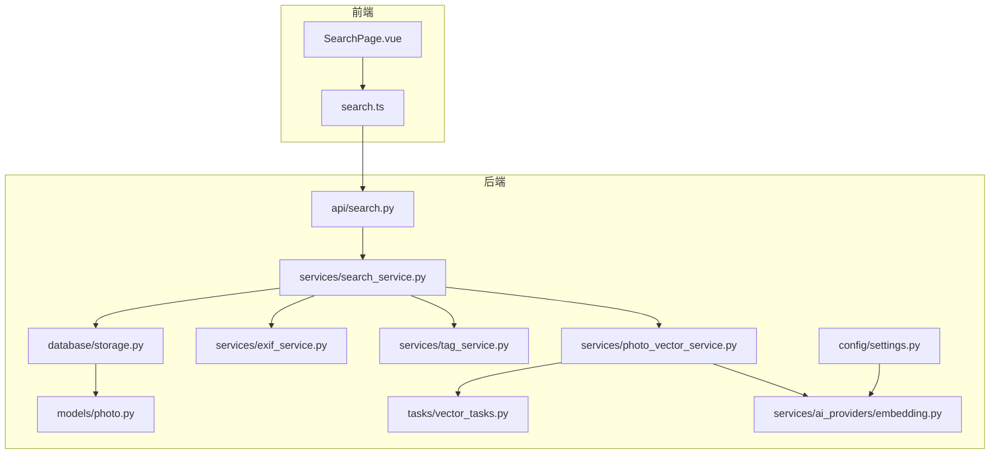
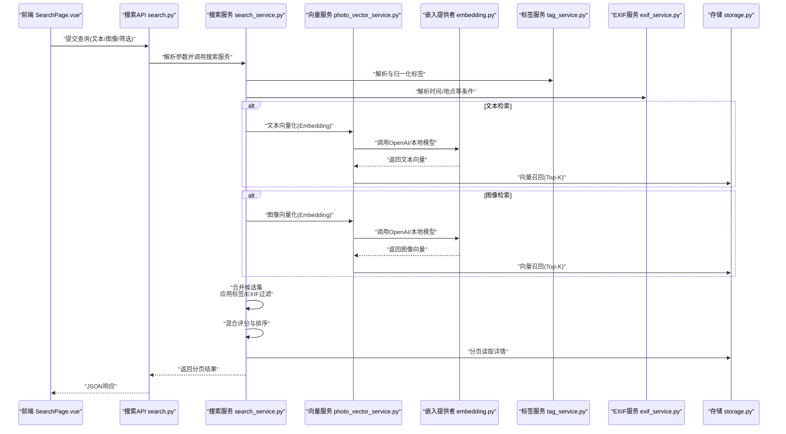
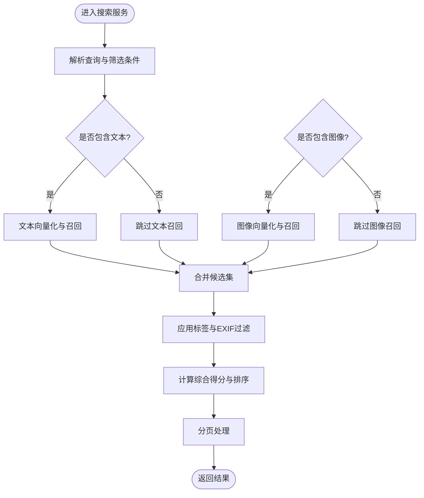
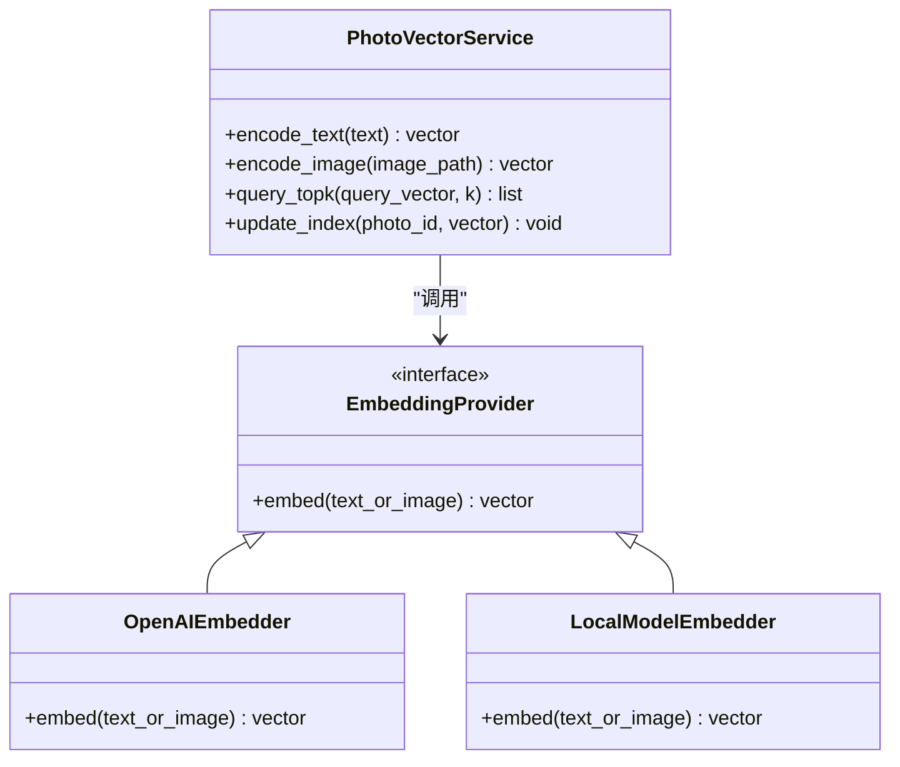
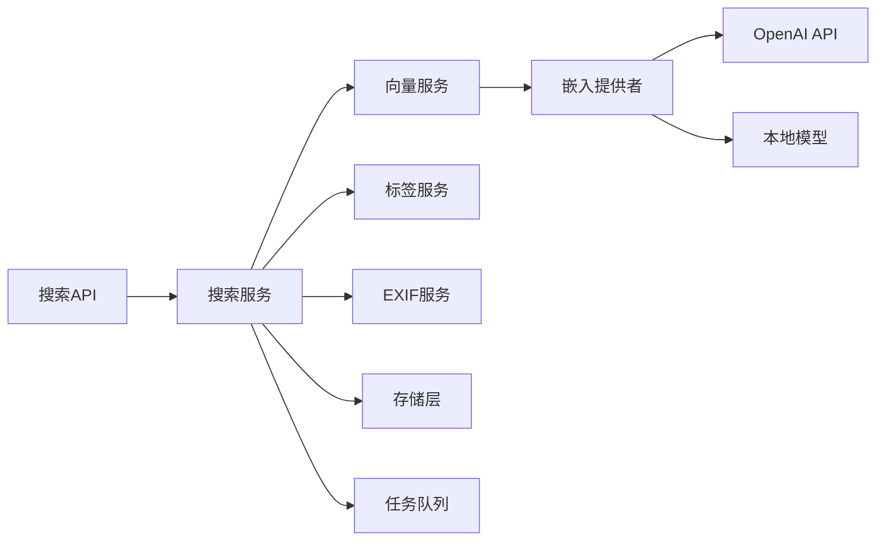

# 智能搜索系统

<cite>
**本文引用的文件**   
- [backend/app/api/search.py](file://backend/app/api/search.py)
- [backend/app/services/search_service.py](file://backend/app/services/search_service.py)
- [backend/app/services/photo_vector_service.py](file://backend/app/services/photo_vector_service.py)
- [backend/app/services/ai_providers/embedding.py](file://backend/app/services/ai_providers/embedding.py)
- [backend/app/services/tag_service.py](file://backend/app/services/tag_service.py)
- [backend/app/services/exif_service.py](file://backend/app/services/exif_service.py)
- [backend/app/models/photo.py](file://backend/app/models/photo.py)
- [backend/app/database/storage.py](file://backend/app/database/storage.py)
- [backend/app/config/settings.py](file://backend/app/config/settings.py)
- [backend/app/tasks/vector_tasks.py](file://backend/app/tasks/vector_tasks.py)
- [frontend/src/api/search.ts](file://frontend/src/api/search.ts)
- [frontend/src/views/SearchPage.vue](file://frontend/src/views/SearchPage.vue)
</cite>

## 目录
1. [简介](#简介)
2. [项目结构](#项目结构)
3. [核心组件](#核心组件)
4. [架构总览](#架构总览)
5. [详细组件分析](#详细组件分析)
6. [依赖关系分析](#依赖关系分析)
7. [性能考虑](#性能考虑)
8. [故障排查指南](#故障排查指南)
9. [结论](#结论)
10. [附录](#附录)

## 简介
本技术文档围绕“智能相册”的语义搜索能力展开，重点阐述文本与图像的混合检索实现原理、向量嵌入生成流程（OpenAI API 集成与本地模型支持）、相似度计算策略、标签服务与 EXIF 信息对结果的影响与优化方法，以及索引、缓存与分页等性能调优手段。同时提供搜索 API 使用示例、查询语法与高级筛选技巧，帮助开发者快速落地并扩展搜索功能。

## 项目结构
后端采用分层架构：API 层负责路由与参数校验，服务层封装业务逻辑（搜索、向量化、标签、EXIF），数据访问层对接数据库与对象存储，任务层异步处理耗时操作（如批量向量化）。前端通过 TypeScript API 调用后端接口，并在页面中展示搜索结果。

图表来源
- [backend/app/api/search.py](file://backend/app/api/search.py)
- [backend/app/services/search_service.py](file://backend/app/services/search_service.py)
- [backend/app/services/photo_vector_service.py](file://backend/app/services/photo_vector_service.py)
- [backend/app/services/ai_providers/embedding.py](file://backend/app/services/ai_providers/embedding.py)
- [backend/app/services/tag_service.py](file://backend/app/services/tag_service.py)
- [backend/app/services/exif_service.py](file://backend/app/services/exif_service.py)
- [backend/app/database/storage.py](file://backend/app/database/storage.py)
- [backend/app/models/photo.py](file://backend/app/models/photo.py)
- [backend/app/tasks/vector_tasks.py](file://backend/app/tasks/vector_tasks.py)
- [backend/app/config/settings.py](file://backend/app/config/settings.py)
- [frontend/src/api/search.ts](file://frontend/src/api/search.ts)
- [frontend/src/views/SearchPage.vue](file://frontend/src/views/SearchPage.vue)

章节来源
- [backend/app/api/search.py](file://backend/app/api/search.py)
- [backend/app/services/search_service.py](file://backend/app/services/search_service.py)
- [backend/app/services/photo_vector_service.py](file://backend/app/services/photo_vector_service.py)
- [backend/app/services/ai_providers/embedding.py](file://backend/app/services/ai_providers/embedding.py)
- [backend/app/services/tag_service.py](file://backend/app/services/tag_service.py)
- [backend/app/services/exif_service.py](file://backend/app/services/exif_service.py)
- [backend/app/database/storage.py](file://backend/app/database/storage.py)
- [backend/app/models/photo.py](file://backend/app/models/photo.py)
- [backend/app/tasks/vector_tasks.py](file://backend/app/tasks/vector_tasks.py)
- [backend/app/config/settings.py](file://backend/app/config/settings.py)
- [frontend/src/api/search.ts](file://frontend/src/api/search.ts)
- [frontend/src/views/SearchPage.vue](file://frontend/src/views/SearchPage.vue)

## 核心组件
- 搜索 API 层：接收查询参数（文本、图像、时间范围、地点、标签等），进行基础校验后委派给搜索服务。
- 搜索服务：组合文本语义检索、图像特征检索、标签过滤与 EXIF 条件筛选，执行混合排序与分页。
- 向量服务：负责图片/文本向量化，统一接入 OpenAI 或本地模型，管理向量索引与召回。
- 嵌入提供者：抽象不同嵌入源（OpenAI API、本地模型）的调用方式，屏蔽差异。
- 标签服务：解析与归一化标签，参与过滤与重排。
- EXIF 服务：读取拍摄时间、地理位置、设备信息等，用于条件筛选与排序增强。
- 存储与模型：持久化照片元数据、向量索引与中间结果。
- 任务队列：异步批量生成向量、更新索引，避免阻塞请求。

章节来源
- [backend/app/api/search.py](file://backend/app/api/search.py)
- [backend/app/services/search_service.py](file://backend/app/services/search_service.py)
- [backend/app/services/photo_vector_service.py](file://backend/app/services/photo_vector_service.py)
- [backend/app/services/ai_providers/embedding.py](file://backend/app/services/ai_providers/embedding.py)
- [backend/app/services/tag_service.py](file://backend/app/services/tag_service.py)
- [backend/app/services/exif_service.py](file://backend/app/services/exif_service.py)
- [backend/app/database/storage.py](file://backend/app/database/storage.py)
- [backend/app/models/photo.py](file://backend/app/models/photo.py)
- [backend/app/tasks/vector_tasks.py](file://backend/app/tasks/vector_tasks.py)

## 架构总览
下图展示了从前端发起搜索到后端返回结果的完整链路，包括文本与图像双路检索、标签与 EXIF 过滤、混合排序与分页。

图表来源
- [backend/app/api/search.py](file://backend/app/api/search.py)
- [backend/app/services/search_service.py](file://backend/app/services/search_service.py)
- [backend/app/services/photo_vector_service.py](file://backend/app/services/photo_vector_service.py)
- [backend/app/services/ai_providers/embedding.py](file://backend/app/services/ai_providers/embedding.py)
- [backend/app/services/tag_service.py](file://backend/app/services/tag_service.py)
- [backend/app/services/exif_service.py](file://backend/app/services/exif_service.py)
- [backend/app/database/storage.py](file://backend/app/database/storage.py)

## 详细组件分析

### 搜索 API 层
- 职责：定义搜索接口，校验输入（文本、图像、时间范围、地点、标签、分页等），转发至搜索服务。
- 关键点：
  - 支持多模态输入（文本+可选图像）。
  - 支持结构化筛选（时间区间、地理范围、标签集合）。
  - 返回分页结果与统计信息。

章节来源
- [backend/app/api/search.py](file://backend/app/api/search.py)

### 搜索服务（混合检索与排序）
- 职责：协调文本与图像检索、标签与 EXIF 过滤、候选集合并与重排、分页输出。
- 关键流程：
  - 解析查询与筛选条件。
  - 分别执行文本与图像向量召回。
  - 基于标签与 EXIF 条件过滤候选。
  - 计算综合得分（语义相似度 + 规则权重 + 时间/距离衰减等）。
  - 按得分排序并分页返回。

图表来源
- [backend/app/services/search_service.py](file://backend/app/services/search_service.py)

章节来源
- [backend/app/services/search_service.py](file://backend/app/services/search_service.py)

### 向量服务与嵌入提供者（OpenAI 与本地模型）
- 职责：
  - 向量服务：封装向量化流程、索引管理与召回策略。
  - 嵌入提供者：统一接入 OpenAI API 与本地模型，屏蔽差异。
- 关键点：
  - 文本与图像均通过 Embedding 接口获取向量。
  - 支持配置切换（环境变量或配置文件）。
  - 向量维度与模型选择影响召回质量与性能。

图表来源
- [backend/app/services/photo_vector_service.py](file://backend/app/services/photo_vector_service.py)
- [backend/app/services/ai_providers/embedding.py](file://backend/app/services/ai_providers/embedding.py)

章节来源
- [backend/app/services/photo_vector_service.py](file://backend/app/services/photo_vector_service.py)
- [backend/app/services/ai_providers/embedding.py](file://backend/app/services/ai_providers/embedding.py)
- [backend/app/config/settings.py](file://backend/app/config/settings.py)

### 标签服务与 EXIF 服务
- 标签服务：
  - 解析用户输入的标签字符串，进行去重、大小写与同义词归一化。
  - 将标签映射为内部 ID 或关键词集合，参与过滤与加权。
- EXIF 服务：
  - 读取拍摄时间、GPS 坐标、相机型号等元数据。
  - 支持时间窗口与地理半径筛选，并可作为排序因子（如时间衰减、距离衰减）。

章节来源
- [backend/app/services/tag_service.py](file://backend/app/services/tag_service.py)
- [backend/app/services/exif_service.py](file://backend/app/services/exif_service.py)

### 存储与模型
- 存储层：
  - 提供照片元数据、标签、EXIF 与向量索引的读写接口。
  - 支持分页查询与批量更新。
- 模型：
  - 定义照片实体字段（路径、描述、标签、EXIF、向量引用等）。

章节来源
- [backend/app/database/storage.py](file://backend/app/database/storage.py)
- [backend/app/models/photo.py](file://backend/app/models/photo.py)

### 任务队列（异步向量化）
- 职责：在后台批量处理新上传照片的向量化与索引更新，避免阻塞主流程。
- 关键点：
  - 任务调度与重试机制。
  - 进度追踪与失败告警。

章节来源
- [backend/app/tasks/vector_tasks.py](file://backend/app/tasks/vector_tasks.py)

## 依赖关系分析
- 模块耦合：
  - 搜索服务依赖向量服务、标签服务、EXIF 服务与存储层。
  - 向量服务依赖嵌入提供者与存储层。
  - 嵌入提供者可被 OpenAI 与本地模型实现替换。
- 外部依赖：
  - OpenAI API（网络调用，需鉴权与限流）。
  - 本地模型（CPU/GPU 资源占用较高）。
- 潜在循环依赖：
  - 确保服务层不反向依赖 API 层；任务层仅依赖服务与存储。

图表来源
- [backend/app/api/search.py](file://backend/app/api/search.py)
- [backend/app/services/search_service.py](file://backend/app/services/search_service.py)
- [backend/app/services/photo_vector_service.py](file://backend/app/services/photo_vector_service.py)
- [backend/app/services/ai_providers/embedding.py](file://backend/app/services/ai_providers/embedding.py)
- [backend/app/services/tag_service.py](file://backend/app/services/tag_service.py)
- [backend/app/services/exif_service.py](file://backend/app/services/exif_service.py)
- [backend/app/database/storage.py](file://backend/app/database/storage.py)
- [backend/app/tasks/vector_tasks.py](file://backend/app/tasks/vector_tasks.py)

章节来源
- [backend/app/api/search.py](file://backend/app/api/search.py)
- [backend/app/services/search_service.py](file://backend/app/services/search_service.py)
- [backend/app/services/photo_vector_service.py](file://backend/app/services/photo_vector_service.py)
- [backend/app/services/ai_providers/embedding.py](file://backend/app/services/ai_providers/embedding.py)
- [backend/app/services/tag_service.py](file://backend/app/services/tag_service.py)
- [backend/app/services/exif_service.py](file://backend/app/services/exif_service.py)
- [backend/app/database/storage.py](file://backend/app/database/storage.py)
- [backend/app/tasks/vector_tasks.py](file://backend/app/tasks/vector_tasks.py)

## 性能考虑
- 索引优化
  - 向量索引分片与分区（按时间或标签），减少扫描范围。
  - 增量更新与批处理，降低写入放大。
- 缓存策略
  - 热点查询结果缓存（短 TTL），结合标签与时间窗口的复合键。
  - 嵌入结果缓存（相同文本/图像指纹复用）。
- 分页处理
  - 游标分页优于偏移分页，避免深翻页性能退化。
  - 预取必要字段，减少二次 IO。
- 相似度算法选择
  - 余弦相似度：适合高维稀疏向量，关注方向一致性。
  - 欧氏距离：适合低维稠密向量，关注绝对距离。
  - 混合策略：根据模型特性与数据分布选择或加权融合。
- 并发与限流
  - 对 OpenAI API 调用进行令牌桶限流与退避重试。
  - 本地模型推理使用线程池或进程池隔离。

[本节为通用指导，无需特定文件来源]

## 故障排查指南
- 常见问题
  - 向量维度不一致：检查嵌入模型配置与索引构建脚本。
  - 标签匹配异常：确认标签归一化规则与同义词表。
  - EXIF 缺失：部分图片无元数据，需降级策略（忽略时间/地点筛选）。
  - 超时与限流：监控 OpenAI 调用延迟与错误码，调整批次大小与重试策略。
- 定位步骤
  - 查看任务队列日志，确认向量化任务状态。
  - 核对存储层索引完整性与一致性。
  - 对比不同模型的召回质量与延迟指标。

章节来源
- [backend/app/tasks/vector_tasks.py](file://backend/app/tasks/vector_tasks.py)
- [backend/app/database/storage.py](file://backend/app/database/storage.py)
- [backend/app/services/tag_service.py](file://backend/app/services/tag_service.py)
- [backend/app/services/exif_service.py](file://backend/app/services/exif_service.py)
- [backend/app/services/ai_providers/embedding.py](file://backend/app/services/ai_providers/embedding.py)

## 结论
本系统通过文本与图像双路语义检索、标签与 EXIF 条件筛选、混合评分与分页输出，实现了高效且灵活的智能搜索。借助统一的嵌入提供者，系统可在 OpenAI API 与本地模型之间灵活切换，兼顾效果与成本。配合索引优化、缓存与任务队列，系统在大规模数据场景下仍保持良好性能与可扩展性。

[本节为总结，无需特定文件来源]

## 附录

### 搜索 API 使用示例
- 文本语义搜索
  - 请求：POST /api/search，body 包含 query 文本、page、size、可选标签与时间范围。
  - 响应：分页结果列表、总数、下一页游标。
- 图像相似搜索
  - 请求：POST /api/search，body 包含 image_url 或 base64、page、size、可选标签与时间范围。
  - 响应：同上。
- 高级筛选
  - 标签：支持 AND/OR 组合与同义词映射。
  - 时间：start_time、end_time 区间筛选。
  - 地点：经纬度与半径筛选。

章节来源
- [backend/app/api/search.py](file://backend/app/api/search.py)
- [frontend/src/api/search.ts](file://frontend/src/api/search.ts)
- [frontend/src/views/SearchPage.vue](file://frontend/src/views/SearchPage.vue)

### 查询语法与高级技巧
- 文本查询
  - 自然语言短语优先，搭配标签提升精确度。
  - 使用否定词排除无关结果（如“非海边”）。
- 图像查询
  - 提供清晰主体图像，避免过度裁剪。
  - 结合时间/地点缩小候选集，提高召回质量。
- 混合排序
  - 语义相似度为主，标签命中与时间/距离衰减为辅。
  - 可根据业务需求调整权重系数。

章节来源
- [backend/app/services/search_service.py](file://backend/app/services/search_service.py)
- [backend/app/services/tag_service.py](file://backend/app/services/tag_service.py)
- [backend/app/services/exif_service.py](file://backend/app/services/exif_service.py)