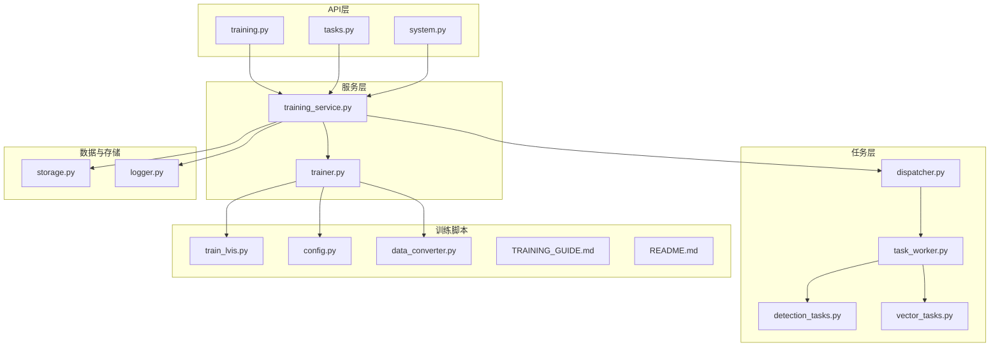
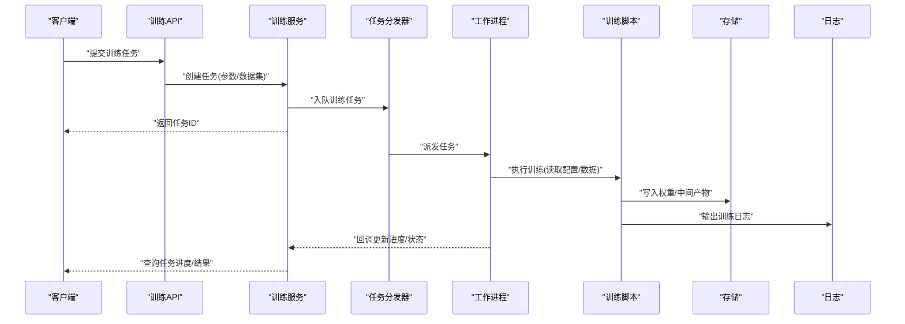
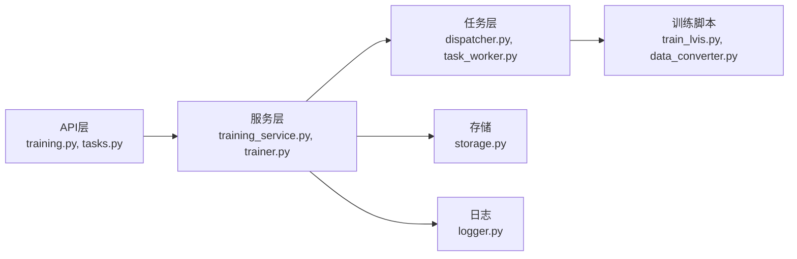

# 模型训练系统

<cite>
**本文引用的文件**   
- [backend/app/api/training.py](file://backend/app/api/training.py)
- [backend/app/services/trainer.py](file://backend/app/services/trainer.py)
- [backend/app/services/training_service.py](file://backend/app/services/training_service.py)
- [backend/app/models/training.py](file://backend/app/models/training.py)
- [backend/app/schemas/training.py](file://backend/app/schemas/training.py)
- [backend/app/crud/task.py](file://backend/app/crud/task.py)
- [backend/app/tasks/dispatcher.py](file://backend/app/tasks/dispatcher.py)
- [backend/app/tasks/task_worker.py](file://backend/app/tasks/task_worker.py)
- [backend/app/tasks/detection_tasks.py](file://backend/app/tasks/detection_tasks.py)
- [backend/app/tasks/vector_tasks.py](file://backend/app/tasks/vector_tasks.py)
- [backend/app/services/train/README.md](file://backend/app/services/train/README.md)
- [backend/app/services/train/TRAINING_GUIDE.md](file://backend/app/services/train/TRAINING_GUIDE.md)
- [backend/app/services/train/config.py](file://backend/app/services/train/config.py)
- [backend/app/services/train/data_converter.py](file://backend/app/services/train/data_converter.py)
- [backend/app/services/train/train_lvis.py](file://backend/app/services/train/train_lvis.py)
- [backend/app/services/train/requirements.txt](file://backend/app/services/train/requirements.txt)
- [backend/app/api/tasks.py](file://backend/app/api/tasks.py)
- [backend/app/api/system.py](file://backend/app/api/system.py)
- [backend/app/core/logger.py](file://backend/app/core/logger.py)
- [backend/app/database/storage.py](file://backend/app/database/storage.py)
</cite>

## 目录
1. [简介](#简介)
2. [项目结构](#项目结构)
3. [核心组件](#核心组件)
4. [架构总览](#架构总览)
5. [详细组件分析](#详细组件分析)
6. [依赖关系分析](#依赖关系分析)
7. [性能与资源管理](#性能与资源管理)
8. [故障排查指南](#故障排查指南)
9. [结论](#结论)
10. [附录：API与数据格式](#附录api与数据格式)

## 简介
本技术文档围绕“自定义AI模型的训练系统”展开，覆盖从数据集准备、模型配置、训练参数调优到评估指标的全流程；并深入解析训练任务的异步处理机制（任务队列、进度跟踪、错误恢复）、模型版本管理与部署策略（注册、A/B测试、灰度发布），以及训练环境配置、GPU资源管理与性能监控方法。文档同时提供训练API调用示例、数据集格式要求与常见问题解决方案，帮助读者快速上手并稳定运行训练流水线。

## 项目结构
训练系统位于后端服务中，采用分层设计：
- API层：暴露训练任务创建、查询、取消等接口
- 服务层：封装训练编排、任务调度、结果持久化
- 任务层：基于异步任务分发器与工作进程执行具体训练作业
- 数据与存储：负责训练产物与日志的落盘与检索
- 训练脚本：面向特定任务（如LVIS）的数据转换与训练入口

图表来源
- [backend/app/api/training.py](file://backend/app/api/training.py)
- [backend/app/api/tasks.py](file://backend/app/api/tasks.py)
- [backend/app/api/system.py](file://backend/app/api/system.py)
- [backend/app/services/trainer.py](file://backend/app/services/trainer.py)
- [backend/app/services/training_service.py](file://backend/app/services/training_service.py)
- [backend/app/tasks/dispatcher.py](file://backend/app/tasks/dispatcher.py)
- [backend/app/tasks/task_worker.py](file://backend/app/tasks/task_worker.py)
- [backend/app/tasks/detection_tasks.py](file://backend/app/tasks/detection_tasks.py)
- [backend/app/tasks/vector_tasks.py](file://backend/app/tasks/vector_tasks.py)
- [backend/app/database/storage.py](file://backend/app/database/storage.py)
- [backend/app/core/logger.py](file://backend/app/core/logger.py)
- [backend/app/services/train/train_lvis.py](file://backend/app/services/train/train_lvis.py)
- [backend/app/services/train/config.py](file://backend/app/services/train/config.py)
- [backend/app/services/train/data_converter.py](file://backend/app/services/train/data_converter.py)
- [backend/app/services/train/TRAINING_GUIDE.md](file://backend/app/services/train/TRAINING_GUIDE.md)
- [backend/app/services/train/README.md](file://backend/app/services/train/README.md)

章节来源
- [backend/app/api/training.py](file://backend/app/api/training.py)
- [backend/app/services/training_service.py](file://backend/app/services/training_service.py)
- [backend/app/tasks/dispatcher.py](file://backend/app/tasks/dispatcher.py)
- [backend/app/tasks/task_worker.py](file://backend/app/tasks/task_worker.py)
- [backend/app/services/train/train_lvis.py](file://backend/app/services/train/train_lvis.py)

## 核心组件
- 训练API控制器：提供训练任务生命周期管理（创建、查询、取消、列表）
- 训练服务：编排训练流程、维护任务状态、对接存储与日志
- 训练器：封装训练脚本调用、参数注入、结果收集
- 任务分发器与工作进程：实现异步任务调度与执行
- 训练脚本与配置：针对具体任务的数据转换与训练入口
- 存储与日志：训练产物、权重、日志持久化与检索

章节来源
- [backend/app/api/training.py](file://backend/app/api/training.py)
- [backend/app/services/training_service.py](file://backend/app/services/training_service.py)
- [backend/app/services/trainer.py](file://backend/app/services/trainer.py)
- [backend/app/tasks/dispatcher.py](file://backend/app/tasks/dispatcher.py)
- [backend/app/tasks/task_worker.py](file://backend/app/tasks/task_worker.py)
- [backend/app/services/train/train_lvis.py](file://backend/app/services/train/train_lvis.py)
- [backend/app/services/train/config.py](file://backend/app/services/train/config.py)
- [backend/app/services/train/data_converter.py](file://backend/app/services/train/data_converter.py)

## 架构总览
训练系统采用“API -> 服务 -> 任务 -> 脚本”的分层架构，通过异步任务队列解耦请求与耗时训练过程，确保高可用与可扩展性。

图表来源
- [backend/app/api/training.py](file://backend/app/api/training.py)
- [backend/app/services/training_service.py](file://backend/app/services/training_service.py)
- [backend/app/tasks/dispatcher.py](file://backend/app/tasks/dispatcher.py)
- [backend/app/tasks/task_worker.py](file://backend/app/tasks/task_worker.py)
- [backend/app/services/train/train_lvis.py](file://backend/app/services/train/train_lvis.py)
- [backend/app/database/storage.py](file://backend/app/database/storage.py)
- [backend/app/core/logger.py](file://backend/app/core/logger.py)

## 详细组件分析

### 训练API层
- 职责：接收前端或外部系统的训练请求，校验输入，委托服务层处理，返回任务ID与状态
- 关键能力：
  - 创建训练任务：包含数据集路径、模型配置、超参、设备选择等
  - 查询任务：支持按任务ID获取状态、进度、结果摘要
  - 取消任务：向任务队列发送取消信号
  - 任务列表：分页与过滤（按状态、时间范围等）

章节来源
- [backend/app/api/training.py](file://backend/app/api/training.py)
- [backend/app/api/tasks.py](file://backend/app/api/tasks.py)

### 训练服务层
- 职责：编排训练全流程，维护任务元数据与状态机，协调存储与日志
- 关键能力：
  - 任务状态机：新建、排队、运行、完成、失败、已取消
  - 进度上报：周期性将进度写入持久化存储
  - 结果归档：训练完成后打包权重与指标，生成可复现实验信息
  - 错误恢复：对失败任务进行重试或标记不可恢复

章节来源
- [backend/app/services/training_service.py](file://backend/app/services/training_service.py)
- [backend/app/models/training.py](file://backend/app/models/training.py)
- [backend/app/schemas/training.py](file://backend/app/schemas/training.py)

### 训练器（Trainer）
- 职责：封装训练脚本调用，注入配置与参数，捕获输出与异常
- 关键能力：
  - 参数合并：默认配置 + 用户传入配置
  - 环境变量：设备、并行、缓存路径等
  - 输出解析：从标准输出/日志中提取指标与进度
  - 超时与中断：支持优雅终止与清理临时文件

章节来源
- [backend/app/services/trainer.py](file://backend/app/services/trainer.py)
- [backend/app/services/train/config.py](file://backend/app/services/train/config.py)
- [backend/app/services/train/train_lvis.py](file://backend/app/services/train/train_lvis.py)

### 任务分发器与工作进程
- 职责：将训练任务从队列取出，分配给工作进程执行，保证并发与隔离
- 关键能力：
  - 队列管理：优先级、重试、死信队列
  - 进程池：限制并发数，避免资源争用
  - 心跳与保活：检测僵尸任务并回收
  - 错误分类：网络、IO、计算、数据异常分别处理

章节来源
- [backend/app/tasks/dispatcher.py](file://backend/app/tasks/dispatcher.py)
- [backend/app/tasks/task_worker.py](file://backend/app/tasks/task_worker.py)
- [backend/app/tasks/detection_tasks.py](file://backend/app/tasks/detection_tasks.py)
- [backend/app/tasks/vector_tasks.py](file://backend/app/tasks/vector_tasks.py)

### 训练脚本与数据转换
- 职责：面向具体任务（如LVIS）的数据预处理、模型加载、训练循环、评估与保存
- 关键能力：
  - 数据格式校验：标签、图像尺寸、类别映射一致性
  - 增量训练：检查点续训与断点恢复
  - 指标计算：mAP、召回率、精确率、损失曲线
  - 产物组织：权重、配置文件、实验记录、可视化图

章节来源
- [backend/app/services/train/train_lvis.py](file://backend/app/services/train/train_lvis.py)
- [backend/app/services/train/data_converter.py](file://backend/app/services/train/data_converter.py)
- [backend/app/services/train/TRAINING_GUIDE.md](file://backend/app/services/train/TRAINING_GUIDE.md)
- [backend/app/services/train/README.md](file://backend/app/services/train/README.md)

### 存储与日志
- 职责：训练产物与日志的持久化、检索与生命周期管理
- 关键能力：
  - 分桶/目录结构：按任务ID、版本、时间组织
  - 大对象存储：权重文件、数据集快照
  - 结构化日志：JSON格式便于聚合与分析
  - 访问控制：读写权限与审计

章节来源
- [backend/app/database/storage.py](file://backend/app/database/storage.py)
- [backend/app/core/logger.py](file://backend/app/core/logger.py)

## 依赖关系分析
训练系统内部模块耦合清晰，API与服务之间通过明确的服务契约交互，任务层通过消息队列与工作进程解耦。训练脚本作为独立可执行单元，仅依赖配置与数据。

图表来源
- [backend/app/api/training.py](file://backend/app/api/training.py)
- [backend/app/api/tasks.py](file://backend/app/api/tasks.py)
- [backend/app/services/training_service.py](file://backend/app/services/training_service.py)
- [backend/app/services/trainer.py](file://backend/app/services/trainer.py)
- [backend/app/tasks/dispatcher.py](file://backend/app/tasks/dispatcher.py)
- [backend/app/tasks/task_worker.py](file://backend/app/tasks/task_worker.py)
- [backend/app/services/train/train_lvis.py](file://backend/app/services/train/train_lvis.py)
- [backend/app/services/train/data_converter.py](file://backend/app/services/train/data_converter.py)
- [backend/app/database/storage.py](file://backend/app/database/storage.py)
- [backend/app/core/logger.py](file://backend/app/core/logger.py)

章节来源
- [backend/app/api/training.py](file://backend/app/api/training.py)
- [backend/app/services/training_service.py](file://backend/app/services/training_service.py)
- [backend/app/tasks/dispatcher.py](file://backend/app/tasks/dispatcher.py)
- [backend/app/services/train/train_lvis.py](file://backend/app/services/train/train_lvis.py)

## 性能与资源管理
- GPU资源管理
  - 显存上限与批大小自适应：根据显存占用动态调整batch size
  - 多卡并行：分布式训练时的进程/线程绑定与通信开销控制
  - 设备选择：CPU/GPU/CUDA可见设备掩码与环境变量
- 训练性能优化
  - 数据管道：预取、缓存、内存映射、多进程加载
  - 混合精度与算子融合：减少内存与提升吞吐
  - 检查点策略：频繁小检查点与增量保存
- 监控与观测
  - 指标采集：损失、学习率、吞吐、显存、I/O等待
  - 日志聚合：集中式日志平台与告警规则
  - 资源配额：任务级资源限制与抢占

[本节为通用指导，不直接分析具体文件]

## 故障排查指南
- 常见错误与定位
  - 数据格式不一致：类别缺失、标注越界、图像损坏
  - 显存溢出：降低batch size、启用梯度累积、释放缓存
  - 任务超时：增加超时阈值、检查磁盘I/O瓶颈
  - 队列堆积：扩容工作进程、优化任务粒度
- 恢复策略
  - 断点续训：从最近检查点恢复
  - 重试与退避：指数退避与最大重试次数
  - 降级模式：回滚到上一稳定版本
- 诊断工具
  - 查看任务日志与指标
  - 导出训练事件与资源使用曲线
  - 对比不同配置的差异报告

章节来源
- [backend/app/core/logger.py](file://backend/app/core/logger.py)
- [backend/app/database/storage.py](file://backend/app/database/storage.py)
- [backend/app/tasks/dispatcher.py](file://backend/app/tasks/dispatcher.py)
- [backend/app/tasks/task_worker.py](file://backend/app/tasks/task_worker.py)

## 结论
本训练系统以分层架构与异步任务为核心，实现了从数据准备到模型产物的端到端流水线。通过明确的任务状态机、完善的错误恢复与监控手段，系统在稳定性与可扩展性上具备良好表现。结合版本管理与灰度发布策略，可在生产环境中安全地迭代与上线新模型。

[本节为总结性内容，不直接分析具体文件]

## 附录：API与数据格式

### 训练API参考
- 创建训练任务
  - 方法：POST
  - 路径：/api/training/tasks
  - 请求体字段：数据集路径、模型配置、超参、设备、并发、检查点策略
  - 响应：任务ID、初始状态
- 查询任务
  - 方法：GET
  - 路径：/api/training/tasks/{task_id}
  - 响应：状态、进度、指标摘要、产物位置
- 取消任务
  - 方法：DELETE
  - 路径：/api/training/tasks/{task_id}
  - 响应：确认信息
- 任务列表
  - 方法：GET
  - 路径：/api/training/tasks
  - 查询参数：状态、时间范围、分页
  - 响应：任务列表与总数

章节来源
- [backend/app/api/training.py](file://backend/app/api/training.py)
- [backend/app/api/tasks.py](file://backend/app/api/tasks.py)

### 数据集格式要求
- 图像与标注分离目录结构
- 标注文件格式：JSON/XML（含类别ID、边界框、关键点等）
- 类别映射文件：统一类别名与ID对应表
- 数据校验：完整性、重复项、空标注、越界坐标
- 可选：数据增强配置、验证集划分比例

章节来源
- [backend/app/services/train/data_converter.py](file://backend/app/services/train/data_converter.py)
- [backend/app/services/train/TRAINING_GUIDE.md](file://backend/app/services/train/TRAINING_GUIDE.md)

### 模型配置与训练参数
- 基础配置：模型类型、输入尺寸、类别数、预训练权重
- 优化器与学习率：策略、预热、衰减、权重衰减
- 训练循环：轮次、批大小、检查点频率、早停条件
- 评估指标：mAP、召回率、精确率、混淆矩阵
- 设备与并行：GPU数量、进程数、通信后端

章节来源
- [backend/app/services/train/config.py](file://backend/app/services/train/config.py)
- [backend/app/services/train/train_lvis.py](file://backend/app/services/train/train_lvis.py)

### 模型版本管理与部署策略
- 模型注册
  - 元数据：版本、哈希、训练配置、指标、作者、日期
  - 产物归档：权重、配置文件、实验记录、可视化
- A/B测试
  - 流量切分：按比例路由到新/旧模型
  - 指标对比：在线指标与离线评估一致
  - 回滚策略：一键切换至上一稳定版本
- 灰度发布
  - 逐步放量：按区域/用户群逐步开放
  - 熔断与降级：异常自动回退
  - 监控告警：关键指标阈值触发

章节来源
- [backend/app/services/training_service.py](file://backend/app/services/training_service.py)
- [backend/app/database/storage.py](file://backend/app/database/storage.py)

### 训练环境配置与GPU资源管理
- 环境变量
  - CUDA_VISIBLE_DEVICES、NCCL相关、DISTRIBUTED_BACKEND
  - 日志级别、存储路径、缓存目录
- 资源配额
  - 单任务GPU上限、CPU核数、内存限制
  - 队列容量与工作进程数
- 性能监控
  - 指标采集：GPU利用率、显存、I/O吞吐
  - 日志聚合：集中式平台与可视化面板

章节来源
- [backend/app/api/system.py](file://backend/app/api/system.py)
- [backend/app/core/logger.py](file://backend/app/core/logger.py)
- [backend/app/database/storage.py](file://backend/app/database/storage.py)

### 常见问题解决方案
- 训练无法启动
  - 检查数据集路径与权限
  - 验证模型配置与类别映射
  - 查看任务日志与错误堆栈
- 训练缓慢或OOM
  - 降低批大小、启用混合精度
  - 检查数据加载瓶颈与磁盘I/O
  - 调整并行度与缓存策略
- 任务长时间无进展
  - 检查工作进程健康与队列积压
  - 重启分发器或扩容工作进程
  - 设置超时与自动重试

章节来源
- [backend/app/tasks/dispatcher.py](file://backend/app/tasks/dispatcher.py)
- [backend/app/tasks/task_worker.py](file://backend/app/tasks/task_worker.py)
- [backend/app/core/logger.py](file://backend/app/core/logger.py)