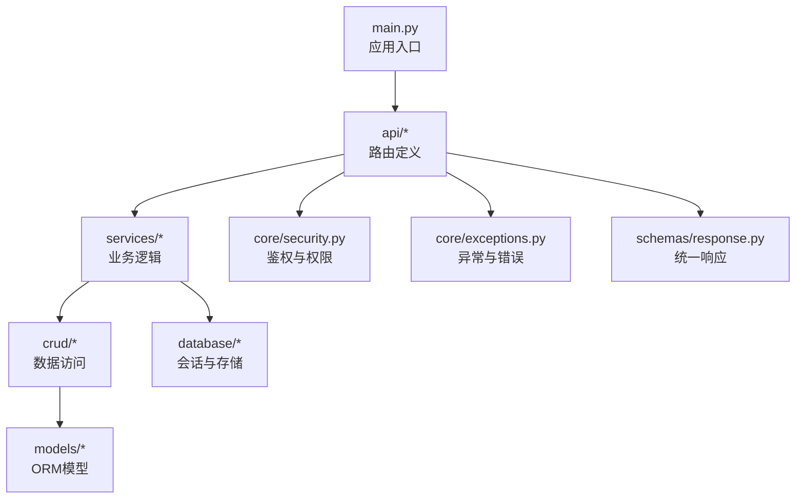
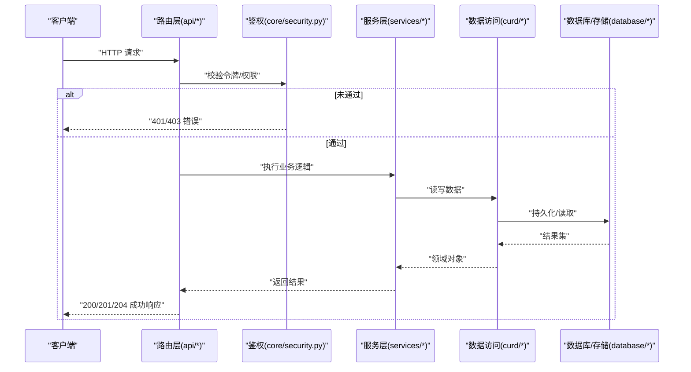
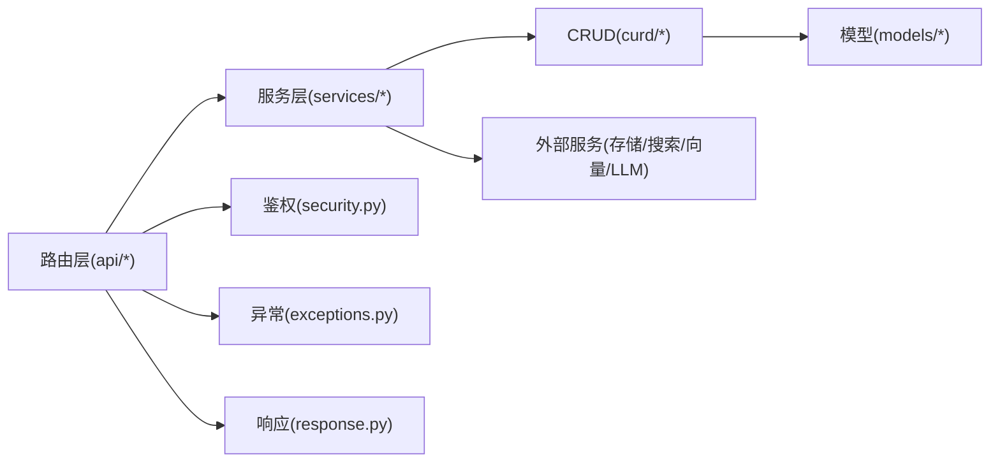

# API接口文档

<cite>
**本文档引用的文件**   
- [main.py](file://backend/main.py)
- [auth.py](file://backend/app/api/auth.py)
- [photo.py](file://backend/app/api/photo.py)
- [album.py](file://backend/app/api/album.py)
- [face.py](file://backend/app/api/face.py)
- [search.py](file://backend/app/api/search.py)
- [tasks.py](file://backend/app/api/tasks.py)
- [system.py](file://backend/app/api/system.py)
- [agent.py](file://backend/app/api/agent.py)
- [training.py](file://backend/app/api/training.py)
- [recycle_bin.py](file://backend/app/api/recycle_bin.py)
- [deps.py](file://backend/app/api/deps.py)
- [security.py](file://backend/app/core/security.py)
- [exceptions.py](file://backend/app/core/exceptions.py)
- [response.py](file://backend/app/schemas/response.py)
- [user.py](file://backend/app/models/user.py)
- [photo_model.py](file://backend/app/models/photo.py)
- [album_model.py](file://backend/app/models/album.py)
- [face_model.py](file://backend/app/models/face.py)
- [task_model.py](file://backend/app/models/task.py)
</cite>

## 目录
1. [简介](#简介)
2. [项目结构](#项目结构)
3. [核心组件](#核心组件)
4. [架构总览](#架构总览)
5. [详细组件分析](#详细组件分析)
6. [依赖关系分析](#依赖关系分析)
7. [性能考虑](#性能考虑)
8. [故障排查指南](#故障排查指南)
9. [结论](#结论)
10. [附录](#附录)

## 简介
本文件为AI相册系统的API接口参考文档，覆盖用户认证、照片管理、相册操作、人脸识别、搜索查询、任务管理、系统信息、智能体与训练等公共接口。文档按功能模块组织，提供HTTP方法、URL模式、请求参数、响应格式、状态码、错误处理策略、认证机制与速率限制说明，并给出向后兼容性与版本管理建议。

## 项目结构
后端采用分层架构：路由层（API）、服务层（Services）、数据访问层（CRUD/Models）、配置与安全（Core）、数据库与存储（Database）。入口由主应用初始化并挂载各模块路由。

图表来源
- [main.py:1-200](file://backend/main.py#L1-L200)
- [auth.py:1-200](file://backend/app/api/auth.py#L1-L200)
- [photo.py:1-200](file://backend/app/api/photo.py#L1-L200)
- [album.py:1-200](file://backend/app/api/album.py#L1-L200)
- [face.py:1-200](file://backend/app/api/face.py#L1-L200)
- [search.py:1-200](file://backend/app/api/search.py#L1-L200)
- [tasks.py:1-200](file://backend/app/api/tasks.py#L1-L200)
- [system.py:1-200](file://backend/app/api/system.py#L1-L200)
- [agent.py:1-200](file://backend/app/api/agent.py#L1-L200)
- [training.py:1-200](file://backend/app/api/training.py#L1-L200)
- [recycle_bin.py:1-200](file://backend/app/api/recycle_bin.py#L1-L200)
- [deps.py:1-200](file://backend/app/api/deps.py#L1-L200)
- [security.py:1-200](file://backend/app/core/security.py#L1-L200)
- [exceptions.py:1-200](file://backend/app/core/exceptions.py#L1-L200)
- [response.py:1-200](file://backend/app/schemas/response.py#L1-L200)

章节来源
- [main.py:1-200](file://backend/main.py#L1-L200)

## 核心组件
- 路由层：按功能划分模块，集中定义RESTful端点与路径前缀。
- 安全与鉴权：基于令牌或会话的认证中间件与依赖注入。
- 统一响应：标准化成功/失败响应结构与字段。
- 异常体系：业务异常与通用异常映射到HTTP状态码。
- 服务层：封装复杂业务（如人脸检测、向量检索、任务调度）。
- 数据层：ORM模型与CRUD操作，持久化至数据库与对象存储。

章节来源
- [auth.py:1-200](file://backend/app/api/auth.py#L1-L200)
- [photo.py:1-200](file://backend/app/api/photo.py#L1-L200)
- [album.py:1-200](file://backend/app/api/album.py#L1-L200)
- [face.py:1-200](file://backend/app/api/face.py#L1-L200)
- [search.py:1-200](file://backend/app/api/search.py#L1-L200)
- [tasks.py:1-200](file://backend/app/api/tasks.py#L1-L200)
- [system.py:1-200](file://backend/app/api/system.py#L1-L200)
- [agent.py:1-200](file://backend/app/api/agent.py#L1-L200)
- [training.py:1-200](file://backend/app/api/training.py#L1-L200)
- [recycle_bin.py:1-200](file://backend/app/api/recycle_bin.py#L1-L200)
- [deps.py:1-200](file://backend/app/api/deps.py#L1-L200)
- [security.py:1-200](file://backend/app/core/security.py#L1-L200)
- [exceptions.py:1-200](file://backend/app/core/exceptions.py#L1-L200)
- [response.py:1-200](file://backend/app/schemas/response.py#L1-L200)

## 架构总览
下图展示从客户端到后端各层的调用关系与关键组件交互。

图表来源
- [main.py:1-200](file://backend/main.py#L1-L200)
- [security.py:1-200](file://backend/app/core/security.py#L1-L200)
- [response.py:1-200](file://backend/app/schemas/response.py#L1-L200)
- [deps.py:1-200](file://backend/app/api/deps.py#L1-L200)

## 详细组件分析

### 认证与授权
- 登录与注册：创建用户会话或颁发令牌；支持验证码与密码强度校验。
- 令牌刷新与登出：刷新短期令牌有效期；撤销当前会话。
- 权限控制：基于角色的资源访问控制，敏感操作需管理员权限。
- 安全策略：密码哈希、令牌签名、防重放与最小权限原则。

典型端点（示例）
- POST /api/v1/auth/login
  - 请求体：用户名、密码、可选验证码
  - 响应：令牌、过期时间、用户基本信息
  - 状态码：200、400、401、429
- POST /api/v1/auth/register
  - 请求体：用户名、邮箱、密码、可选邀请码
  - 响应：新用户ID、令牌
  - 状态码：201、400、409
- POST /api/v1/auth/logout
  - 请求头：令牌
  - 响应：成功
  - 状态码：200、401
- GET /api/v1/auth/me
  - 请求头：令牌
  - 响应：当前用户详情
  - 状态码：200、401

章节来源
- [auth.py:1-200](file://backend/app/api/auth.py#L1-L200)
- [security.py:1-200](file://backend/app/core/security.py#L1-L200)
- [deps.py:1-200](file://backend/app/api/deps.py#L1-L200)
- [user.py:1-200](file://backend/app/models/user.py#L1-L200)

### 照片管理
- 上传：支持单张/批量上传，生成缩略图与元数据，异步执行特征提取。
- 列表与分页：按时间、标签、位置、人脸分组过滤；支持排序与游标分页。
- 详情与下载：获取原图、缩略图、EXIF与描述信息。
- 更新与删除：软删除进入回收站，支持恢复与彻底删除。
- 元数据：自动解析EXIF、地理位置、标签与描述。

典型端点（示例）
- POST /api/v1/photos/upload
  - 请求：multipart/form-data，files[]
  - 响应：已上传照片ID列表、任务ID
  - 状态码：201、400、413、429
- GET /api/v1/photos
  - 查询参数：page、size、sort、filter(时间范围、标签、位置、人脸)
  - 响应：照片列表、总数、下一页游标
  - 状态码：200、400
- GET /api/v1/photos/{id}
  - 响应：照片详情、缩略图URL、元数据
  - 状态码：200、404
- PUT /api/v1/photos/{id}
  - 请求体：标签、描述、可见性
  - 响应：更新后的照片
  - 状态码：200、400、404
- DELETE /api/v1/photos/{id}
  - 响应：成功
  - 状态码：204、404

章节来源
- [photo.py:1-200](file://backend/app/api/photo.py#L1-L200)
- [photo_model.py:1-200](file://backend/app/models/photo.py#L1-L200)

### 相册操作
- 创建/更新/删除：支持手动与智能相册（规则自动生成）。
- 成员与权限：所有者、协作者、只读访问控制。
- 内容管理：添加/移除照片、批量移动、排序。
- 统计与导出：照片数量、最近更新时间、导出清单。

典型端点（示例）
- POST /api/v1/albums
  - 请求体：名称、描述、类型(manual/smart)、规则(智能相册)
  - 响应：新相册ID
  - 状态码：201、400
- GET /api/v1/albums
  - 查询参数：page、size、type、owner_id
  - 响应：相册列表
  - 状态码：200
- GET /api/v1/albums/{id}
  - 响应：相册详情、成员、规则
  - 状态码：200、404
- PUT /api/v1/albums/{id}
  - 请求体：名称、描述、规则
  - 响应：更新后的相册
  - 状态码：200、400、404
- DELETE /api/v1/albums/{id}
  - 响应：成功
  - 状态码：204、404
- POST /api/v1/albums/{id}/photos/add
  - 请求体：photo_ids[]
  - 响应：添加结果
  - 状态码：200、400、404

章节来源
- [album.py:1-200](file://backend/app/api/album.py#L1-L200)
- [album_model.py:1-200](file://backend/app/models/album.py#L1-L200)

### 人脸识别
- 检测与聚类：对照片进行人脸检测、特征提取与聚类分组。
- 命名确认：对同一人不同脸簇进行合并确认。
- 人脸详情：查看人脸图片、所属簇、关联照片。
- 批量处理：提交任务异步执行，支持进度查询。

典型端点（示例）
- POST /api/v1/face/detect
  - 请求：photo_id 或 files[]
  - 响应：检测结果、人脸框、特征ID
  - 状态码：201、400、404、429
- GET /api/v1/face/clusters
  - 查询参数：page、size、min_photos
  - 响应：人脸簇列表、每簇样本图
  - 状态码：200
- POST /api/v1/face/confirm
  - 请求体：cluster_ids[]、name
  - 响应：合并后簇ID
  - 状态码：200、400、404
- GET /api/v1/face/{face_id}
  - 响应：人脸详情、关联照片
  - 状态码：200、404

章节来源
- [face.py:1-200](file://backend/app/api/face.py#L1-L200)
- [face_model.py:1-200](file://backend/app/models/face.py#L1-L200)

### 搜索查询
- 关键词搜索：全文检索标题、描述、标签。
- 语义搜索：基于向量嵌入的自然语言查询。
- 组合过滤：时间、地点、人物、标签、相册。
- 结果高亮与分页：返回命中片段与排序权重。

典型端点（示例）
- GET /api/v1/search
  - 查询参数：q、type(keyword/vector)、filters、page、size
  - 响应：搜索结果、总数、下一页
  - 状态码：200、400
- POST /api/v1/search/suggest
  - 请求体：partial_text
  - 响应：自动补全建议
  - 状态码：200

章节来源
- [search.py:1-200](file://backend/app/api/search.py#L1-L200)

### 任务管理
- 任务提交：上传、检测、聚类、向量索引等异步任务。
- 进度查询：轮询或事件推送（若启用）。
- 任务列表与筛选：按类型、状态、创建时间筛选。
- 取消与重试：支持取消可中断任务与失败重试。

典型端点（示例）
- POST /api/v1/tasks
  - 请求体：type、payload
  - 响应：任务ID、预计完成时间
  - 状态码：201、400
- GET /api/v1/tasks
  - 查询参数：status、type、page、size
  - 响应：任务列表
  - 状态码：200
- GET /api/v1/tasks/{id}
  - 响应：任务详情、进度、结果
  - 状态码：200、404
- DELETE /api/v1/tasks/{id}
  - 响应：成功
  - 状态码：204、404

章节来源
- [tasks.py:1-200](file://backend/app/api/tasks.py#L1-L200)
- [task_model.py:1-200](file://backend/app/models/task.py#L1-L200)

### 系统信息与健康检查
- 健康检查：服务可用性、依赖状态。
- 配置与能力：是否启用某项功能、版本信息。
- 统计概览：照片总量、人脸簇数、任务队列长度。

典型端点（示例）
- GET /api/v1/system/health
  - 响应：状态、依赖检查结果
  - 状态码：200、503
- GET /api/v1/system/info
  - 响应：版本、特性开关、配额
  - 状态码：200

章节来源
- [system.py:1-200](file://backend/app/api/system.py#L1-L200)

### 智能体与对话
- 聊天代理：自然语言问答、照片摘要、建议。
- 工具调用：结合搜索、相册、任务等能力。
- 流式输出：支持SSE或WebSocket（若启用）。

典型端点（示例）
- POST /api/v1/agent/chat
  - 请求体：messages[]、context
  - 响应：回复消息、引用来源
  - 状态码：200、400、429
- GET /api/v1/agent/history
  - 查询参数：conversation_id、page、size
  - 响应：历史消息
  - 状态码：200

章节来源
- [agent.py:1-200](file://backend/app/api/agent.py#L1-L200)

### 训练与模型管理
- 数据集准备：标注数据转换与导出。
- 训练任务：提交训练、监控进度、查看指标。
- 模型部署：切换默认模型、回滚版本。

典型端点（示例）
- POST /api/v1/training/jobs
  - 请求体：dataset_id、config
  - 响应：训练任务ID
  - 状态码：201、400
- GET /api/v1/training/jobs/{id}
  - 响应：训练日志、指标、状态
  - 状态码：200、404
- POST /api/v1/training/deploy
  - 请求体：model_version
  - 响应：部署结果
  - 状态码：200、400

章节来源
- [training.py:1-200](file://backend/app/api/training.py#L1-L200)

### 回收站
- 软删除恢复：将照片或相册恢复到原位置。
- 清空回收站：永久删除所有软删除项。
- 保留策略：过期清理与通知。

典型端点（示例）
- GET /api/v1/recycle-bin
  - 查询参数：type(photo/album)、page、size
  - 响应：回收项列表
  - 状态码：200
- POST /api/v1/recycle-bin/{id}/restore
  - 响应：恢复结果
  - 状态码：200、404
- DELETE /api/v1/recycle-bin
  - 响应：清空结果
  - 状态码：204

章节来源
- [recycle_bin.py:1-200](file://backend/app/api/recycle_bin.py#L1-L200)

## 依赖关系分析
- 路由依赖：路由层通过依赖注入获取数据库会话、存储服务、认证上下文。
- 服务耦合：服务层聚合多个外部能力（人脸检测、向量检索、地理编码）。
- 数据一致性：事务边界在CRUD层保证，跨服务通过任务队列解耦。
- 外部集成：对象存储、搜索引擎、向量库、LLM服务。

图表来源
- [deps.py:1-200](file://backend/app/api/deps.py#L1-L200)
- [security.py:1-200](file://backend/app/core/security.py#L1-L200)
- [exceptions.py:1-200](file://backend/app/core/exceptions.py#L1-L200)
- [response.py:1-200](file://backend/app/schemas/response.py#L1-L200)

章节来源
- [deps.py:1-200](file://backend/app/api/deps.py#L1-L200)

## 性能考虑
- 大文件上传：分片上传、断点续传、并发压缩与转码。
- 异步任务：使用任务队列与Worker池，避免阻塞请求。
- 缓存策略：缩略图与热门结果缓存，减少重复计算。
- 分页与游标：大数据量场景使用游标分页提升稳定性。
- 连接池：数据库与外部服务连接复用，降低延迟。

[本节为通用指导，不直接分析具体文件]

## 故障排查指南
- 常见错误码
  - 400 请求参数错误：检查必填字段、类型与约束。
  - 401 未认证：确认令牌有效且未过期。
  - 403 无权限：检查角色与资源归属。
  - 404 资源不存在：确认ID与路径正确。
  - 413 请求过大：调整上传大小限制或使用分片。
  - 429 频率限制：等待重试或申请更高配额。
  - 500 服务器错误：查看服务端日志与依赖状态。
  - 503 服务不可用：健康检查失败，检查依赖服务。
- 诊断步骤
  - 开启调试日志，记录请求ID与链路追踪。
  - 验证令牌签发与刷新流程。
  - 检查任务队列积压与Worker健康。
  - 核对对象存储与向量库连通性。

章节来源
- [exceptions.py:1-200](file://backend/app/core/exceptions.py#L1-L200)
- [security.py:1-200](file://backend/app/core/security.py#L1-L200)
- [system.py:1-200](file://backend/app/api/system.py#L1-L200)

## 结论
本API文档覆盖了AI相册的核心能力与接口规范，提供了清晰的请求/响应约定、错误处理与扩展建议。建议在客户端实现幂等与重试策略，服务端持续优化异步任务与缓存策略，确保在高并发与大数据量场景下的稳定表现。

[本节为总结，不直接分析具体文件]

## 附录

### 认证机制
- 令牌类型：Bearer Token（JWT或自定义），包含用户ID、角色与过期时间。
- 传递方式：Authorization: Bearer <token>
- 刷新策略：短期令牌+刷新令牌；刷新接口需携带旧令牌。
- 安全建议：HTTPS、最小权限、令牌绑定设备/IP（可选）。

章节来源
- [auth.py:1-200](file://backend/app/api/auth.py#L1-L200)
- [security.py:1-200](file://backend/app/core/security.py#L1-L200)

### 错误处理策略
- 统一响应结构：包含状态码、消息、数据与请求ID。
- 业务异常映射：将领域异常转换为标准HTTP状态码。
- 日志与追踪：每个错误附带请求ID与堆栈摘要。

章节来源
- [response.py:1-200](file://backend/app/schemas/response.py#L1-L200)
- [exceptions.py:1-200](file://backend/app/core/exceptions.py#L1-L200)

### 速率限制规则
- 全局限制：按IP或用户维度限制每分钟请求数。
- 接口限制：上传与识别类接口更严格限制。
- 反馈头：X-RateLimit-Remaining、X-RateLimit-Reset。
- 超限响应：429 Too Many Requests，含重试After-Seconds。

章节来源
- [auth.py:1-200](file://backend/app/api/auth.py#L1-L200)
- [photo.py:1-200](file://backend/app/api/photo.py#L1-L200)
- [face.py:1-200](file://backend/app/api/face.py#L1-L200)

### API版本管理与兼容性
- 版本策略：URL前缀 /api/v1，重大变更升级v2。
- 向后兼容：新增字段非破坏性；废弃字段保留至少两个版本。
- 弃用通知：响应头 X-Deprecated、Sunset 日期。
- 迁移指南：发布迁移公告与示例代码。

章节来源
- [main.py:1-200](file://backend/main.py#L1-L200)