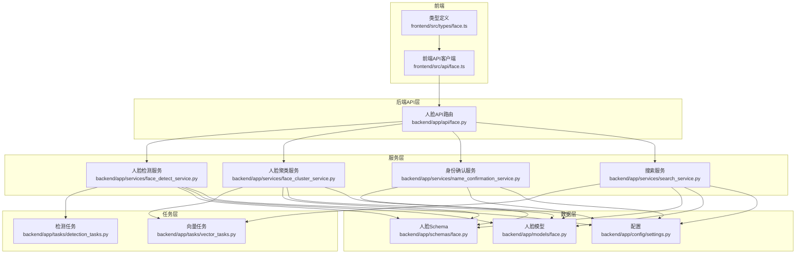
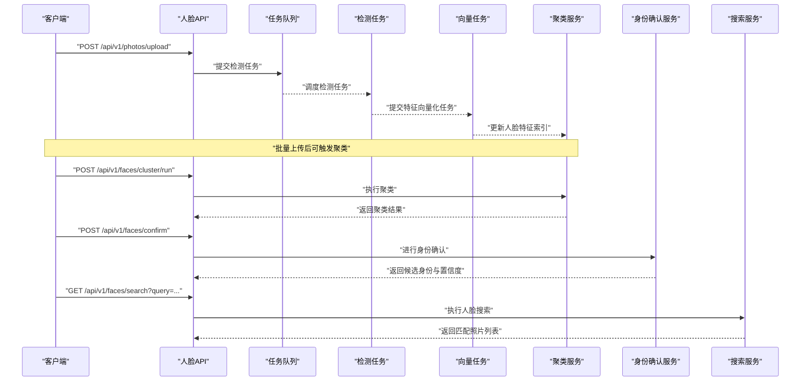
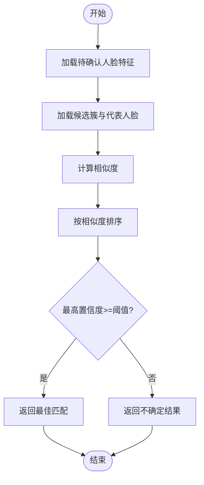
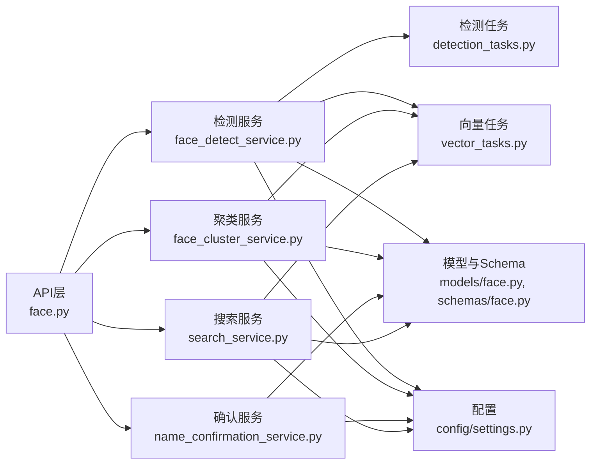

# 人脸识别接口

<cite>
**本文引用的文件**   
- [backend/app/api/face.py](file://backend/app/api/face.py)
- [backend/app/services/face_detect_service.py](file://backend/app/services/face_detect_service.py)
- [backend/app/services/face_cluster_service.py](file://backend/app/services/face_cluster_service.py)
- [backend/app/services/name_confirmation_service.py](file://backend/app/services/name_confirmation_service.py)
- [backend/app/services/search_service.py](file://backend/app/services/search_service.py)
- [backend/app/schemas/face.py](file://backend/app/schemas/face.py)
- [backend/app/models/face.py](file://backend/app/models/face.py)
- [backend/app/tasks/detection_tasks.py](file://backend/app/tasks/detection_tasks.py)
- [backend/app/tasks/vector_tasks.py](file://backend/app/tasks/vector_tasks.py)
- [backend/app/config/settings.py](file://backend/app/config/settings.py)
- [frontend/src/api/face.ts](file://frontend/src/api/face.ts)
- [frontend/src/types/face.ts](file://frontend/src/types/face.ts)
</cite>

## 目录
1. [简介](#简介)
2. [项目结构](#项目结构)
3. [核心组件](#核心组件)
4. [架构总览](#架构总览)
5. [详细组件分析](#详细组件分析)
6. [依赖分析](#依赖分析)
7. [性能考虑](#性能考虑)
8. [故障排查指南](#故障排查指南)
9. [结论](#结论)
10. [附录](#附录) 

## 简介
本文件面向开发者与集成方，提供人脸识别相关API的完整接口文档。内容覆盖人脸检测、人脸聚类、身份确认（姓名确认）、人脸搜索等能力；说明特征提取算法、聚类策略与相似度阈值设置；给出请求/响应示例、数据结构定义、识别结果与置信度评分字段；并提供精度优化建议与隐私保护措施。

## 项目结构
本项目后端采用分层架构：API层暴露REST接口，服务层封装业务逻辑，任务层处理异步计算（检测、向量化），数据模型与Schema定义持久化结构与校验规则。前端通过TypeScript API客户端调用后端接口。

图表来源
- [backend/app/api/face.py](file://backend/app/api/face.py)
- [backend/app/services/face_detect_service.py](file://backend/app/services/face_detect_service.py)
- [backend/app/services/face_cluster_service.py](file://backend/app/services/face_cluster_service.py)
- [backend/app/services/name_confirmation_service.py](file://backend/app/services/name_confirmation_service.py)
- [backend/app/services/search_service.py](file://backend/app/services/search_service.py)
- [backend/app/tasks/detection_tasks.py](file://backend/app/tasks/detection_tasks.py)
- [backend/app/tasks/vector_tasks.py](file://backend/app/tasks/vector_tasks.py)
- [backend/app/schemas/face.py](file://backend/app/schemas/face.py)
- [backend/app/models/face.py](file://backend/app/models/face.py)
- [backend/app/config/settings.py](file://backend/app/config/settings.py)
- [frontend/src/api/face.ts](file://frontend/src/api/face.ts)
- [frontend/src/types/face.ts](file://frontend/src/types/face.ts)

章节来源
- [backend/app/api/face.py](file://backend/app/api/face.py)
- [backend/app/services/face_detect_service.py](file://backend/app/services/face_detect_service.py)
- [backend/app/services/face_cluster_service.py](file://backend/app/services/face_cluster_service.py)
- [backend/app/services/name_confirmation_service.py](file://backend/app/services/name_confirmation_service.py)
- [backend/app/services/search_service.py](file://backend/app/services/search_service.py)
- [backend/app/tasks/detection_tasks.py](file://backend/app/tasks/detection_tasks.py)
- [backend/app/tasks/vector_tasks.py](file://backend/app/tasks/vector_tasks.py)
- [backend/app/schemas/face.py](file://backend/app/schemas/face.py)
- [backend/app/models/face.py](file://backend/app/models/face.py)
- [backend/app/config/settings.py](file://backend/app/config/settings.py)
- [frontend/src/api/face.ts](file://frontend/src/api/face.ts)
- [frontend/src/types/face.ts](file://frontend/src/types/face.ts)

## 核心组件
- 人脸检测服务：负责从图片中定位人脸、裁剪人脸区域并生成人脸特征向量。
- 人脸聚类服务：对已存在的人脸特征进行聚类，合并同一人的多张人脸，维护“人脸簇”与“人物标签”。
- 身份确认服务：基于候选簇与输入人脸特征进行匹配，返回最可能的身份及置信度。
- 搜索服务：以图搜图或按条件检索包含特定人脸的照片，支持相似度排序与分页。
- 任务系统：将耗时的人脸检测与特征向量化操作放入异步任务队列执行，避免阻塞HTTP请求。
- Schema与模型：统一前后端的数据契约与数据库实体映射。

章节来源
- [backend/app/services/face_detect_service.py](file://backend/app/services/face_detect_service.py)
- [backend/app/services/face_cluster_service.py](file://backend/app/services/face_cluster_service.py)
- [backend/app/services/name_confirmation_service.py](file://backend/app/services/name_confirmation_service.py)
- [backend/app/services/search_service.py](file://backend/app/services/search_service.py)
- [backend/app/tasks/detection_tasks.py](file://backend/app/tasks/detection_tasks.py)
- [backend/app/tasks/vector_tasks.py](file://backend/app/tasks/vector_tasks.py)
- [backend/app/schemas/face.py](file://backend/app/schemas/face.py)
- [backend/app/models/face.py](file://backend/app/models/face.py)

## 架构总览
下图展示了典型的人脸识别流程：上传照片后，后端触发检测任务，完成人脸框与特征向量计算；随后进入聚类阶段，将相似人脸归并为同一人；用户可发起身份确认或人脸搜索。

图表来源
- [backend/app/api/face.py](file://backend/app/api/face.py)
- [backend/app/tasks/detection_tasks.py](file://backend/app/tasks/detection_tasks.py)
- [backend/app/tasks/vector_tasks.py](file://backend/app/tasks/vector_tasks.py)
- [backend/app/services/face_cluster_service.py](file://backend/app/services/face_cluster_service.py)
- [backend/app/services/name_confirmation_service.py](file://backend/app/services/name_confirmation_service.py)
- [backend/app/services/search_service.py](file://backend/app/services/search_service.py)

## 详细组件分析

### 接口清单与规范
- 基础路径：/api/v1
- 认证方式：根据全局鉴权中间件要求携带令牌（如Bearer Token）
- 通用响应格式：{ code, message, data }，其中data为具体业务对象
- 错误码：非200状态码表示异常，message描述错误原因

章节来源
- [backend/app/api/face.py](file://backend/app/api/face.py)

#### 人脸检测
- 方法：POST
- URL：/api/v1/faces/detect
- 请求体：
  - image_url: string，图片URL或本地路径
  - min_face_size: int，可选，最小人脸尺寸
  - max_faces: int，可选，最大人脸数
- 响应体：
  - faces: array，人脸列表
    - face_id: string，唯一标识
    - bbox: object，边界框 {x_min, y_min, x_max, y_max}
    - confidence: number，检测置信度
    - embedding: array<number>，特征向量
    - photo_id: string，所属照片ID
- 行为说明：
  - 若图片未入库，先创建照片记录再检测
  - 返回所有检测到的人脸及其特征向量

章节来源
- [backend/app/api/face.py](file://backend/app/api/face.py)
- [backend/app/services/face_detect_service.py](file://backend/app/services/face_detect_service.py)
- [backend/app/schemas/face.py](file://backend/app/schemas/face.py)
- [backend/app/models/face.py](file://backend/app/models/face.py)

#### 人脸聚类
- 方法：POST
- URL：/api/v1/faces/cluster/run
- 请求体：
  - threshold: number，可选，聚类相似度阈值（默认由配置决定）
  - method: string，可选，聚类策略（如层次聚类、DBSCAN等）
- 响应体：
  - clusters: array，人脸簇列表
    - cluster_id: string
    - member_face_ids: array<string>
    - representative_face_id: string，代表人脸
    - label: string，人物标签（可为空）
- 行为说明：
  - 对全库或指定范围的人脸特征进行聚类
  - 支持增量聚类与批量重聚

章节来源
- [backend/app/api/face.py](file://backend/app/api/face.py)
- [backend/app/services/face_cluster_service.py](file://backend/app/services/face_cluster_service.py)
- [backend/app/schemas/face.py](file://backend/app/schemas/face.py)
- [backend/app/models/face.py](file://backend/app/models/face.py)

#### 身份确认
- 方法：POST
- URL：/api/v1/faces/confirm
- 请求体：
  - face_id: string，待确认的人脸ID
  - top_k: int，可选，返回前K个候选
  - threshold: number，可选，确认阈值（低于该值视为不确定）
- 响应体：
  - candidates: array，候选身份列表
    - cluster_id: string
    - label: string，人物标签
    - similarity: number，与候选簇的代表相似度
    - confidence: number，综合置信度
  - best_match: object，最佳匹配
    - cluster_id: string
    - label: string
    - similarity: number
    - confidence: number
- 行为说明：
  - 基于最近邻或加权投票选择最佳匹配
  - 当最高置信度低于threshold时，标记为“不确定”

章节来源
- [backend/app/api/face.py](file://backend/app/api/face.py)
- [backend/app/services/name_confirmation_service.py](file://backend/app/services/name_confirmation_service.py)
- [backend/app/schemas/face.py](file://backend/app/schemas/face.py)
- [backend/app/models/face.py](file://backend/app/models/face.py)

#### 人脸搜索
- 方法：GET
- URL：/api/v1/faces/search
- 查询参数：
  - query_face_id: string，参考人脸ID
  - query_embedding: array<number>，可选，直接传入特征向量
  - top_k: int，可选，返回数量上限
  - threshold: number，可选，相似度阈值
  - photo_ids: array<string>，可选，限定搜索范围
  - page: int，可选，页码
  - page_size: int，可选，每页大小
- 响应体：
  - results: array，搜索结果
    - photo_id: string
    - face_id: string
    - similarity: number
    - confidence: number
    - thumbnail_url: string，缩略图链接
  - total: int，总数
  - page: int
  - page_size: int
- 行为说明：
  - 支持以图搜图或按条件过滤
  - 结果按相似度降序排列

章节来源
- [backend/app/api/face.py](file://backend/app/api/face.py)
- [backend/app/services/search_service.py](file://backend/app/services/search_service.py)
- [backend/app/schemas/face.py](file://backend/app/schemas/face.py)
- [backend/app/models/face.py](file://backend/app/models/face.py)

#### 批量检测与向量化任务
- 方法：POST
- URL：/api/v1/tasks/detection/batch
- 请求体：
  - photo_ids: array<string>，待检测的照片ID列表
- 响应体：
  - task_id: string，任务ID
  - status: string，任务状态
- 说明：
  - 后台异步执行检测与特征向量化
  - 可通过任务状态接口查询进度

章节来源
- [backend/app/api/face.py](file://backend/app/api/face.py)
- [backend/app/tasks/detection_tasks.py](file://backend/app/tasks/detection_tasks.py)
- [backend/app/tasks/vector_tasks.py](file://backend/app/tasks/vector_tasks.py)

### 请求/响应示例
以下为典型请求与响应的结构化示例（字段名与类型遵循Schema定义）。

- 人脸检测请求
  - 方法：POST
  - URL：/api/v1/faces/detect
  - 请求体：
    - image_url: "https://example.com/photo.jpg"
    - min_face_size: 40
    - max_faces: 10
  - 响应体：
    - faces:
      - face_id: "f_001"
        - bbox: { x_min: 120, y_min: 80, x_max: 220, y_max: 220 }
        - confidence: 0.98
        - embedding: [0.12, -0.34, ...]
        - photo_id: "p_001"

- 人脸聚类请求
  - 方法：POST
  - URL：/api/v1/faces/cluster/run
  - 请求体：
    - threshold: 0.75
    - method: "hierarchical"
  - 响应体：
    - clusters:
      - cluster_id: "c_001"
        - member_face_ids: ["f_001", "f_002", "f_003"]
        - representative_face_id: "f_001"
        - label: "张三"

- 身份确认请求
  - 方法：POST
  - URL：/api/v1/faces/confirm
  - 请求体：
    - face_id: "f_001"
    - top_k: 3
    - threshold: 0.8
  - 响应体：
    - candidates:
      - cluster_id: "c_001"
        - label: "张三"
        - similarity: 0.92
        - confidence: 0.90
    - best_match:
      - cluster_id: "c_001"
        - label: "张三"
        - similarity: 0.92
        - confidence: 0.90

- 人脸搜索请求
  - 方法：GET
  - URL：/api/v1/faces/search?query_face_id=f_001&top_k=5&threshold=0.7&page=1&page_size=10
  - 响应体：
    - results:
      - photo_id: "p_002"
        - face_id: "f_005"
        - similarity: 0.88
        - confidence: 0.85
        - thumbnail_url: "/thumbnails/p_002_f_005.jpg"
    - total: 12
    - page: 1
    - page_size: 10

章节来源
- [backend/app/schemas/face.py](file://backend/app/schemas/face.py)
- [backend/app/models/face.py](file://backend/app/models/face.py)
- [backend/app/api/face.py](file://backend/app/api/face.py)

### 算法与策略说明
- 特征提取算法
  - 使用深度学习人脸嵌入模型，输出固定维度的特征向量embedding
  - 向量用于后续相似度计算与聚类
- 相似度度量
  - 余弦相似度或内积相似度（取决于实现）
  - 阈值threshold控制匹配严格程度
- 聚类策略
  - 支持层次聚类、DBSCAN等方法
  - 通过threshold调节簇粒度，较小阈值产生更多小簇，较大阈值合并更多人脸
- 身份确认
  - 基于候选簇的代表人脸进行相似度比较
  - 结合top_k与confidence筛选最终结果
- 搜索策略
  - 支持以图搜图与条件过滤
  - 结果按相似度排序，支持分页

章节来源
- [backend/app/services/face_detect_service.py](file://backend/app/services/face_detect_service.py)
- [backend/app/services/face_cluster_service.py](file://backend/app/services/face_cluster_service.py)
- [backend/app/services/name_confirmation_service.py](file://backend/app/services/name_confirmation_service.py)
- [backend/app/services/search_service.py](file://backend/app/services/search_service.py)
- [backend/app/config/settings.py](file://backend/app/config/settings.py)

### 流程图：身份确认决策

图表来源
- [backend/app/services/name_confirmation_service.py](file://backend/app/services/name_confirmation_service.py)
- [backend/app/config/settings.py](file://backend/app/config/settings.py)

## 依赖分析
- API层依赖服务层：人脸API路由调用检测、聚类、确认、搜索服务
- 服务层依赖任务层：检测与向量化通过任务队列异步执行
- 数据层依赖Schema与模型：统一数据契约与持久化结构
- 配置中心：提供阈值、模型路径、存储路径等全局配置

图表来源
- [backend/app/api/face.py](file://backend/app/api/face.py)
- [backend/app/services/face_detect_service.py](file://backend/app/services/face_detect_service.py)
- [backend/app/services/face_cluster_service.py](file://backend/app/services/face_cluster_service.py)
- [backend/app/services/name_confirmation_service.py](file://backend/app/services/name_confirmation_service.py)
- [backend/app/services/search_service.py](file://backend/app/services/search_service.py)
- [backend/app/tasks/detection_tasks.py](file://backend/app/tasks/detection_tasks.py)
- [backend/app/tasks/vector_tasks.py](file://backend/app/tasks/vector_tasks.py)
- [backend/app/schemas/face.py](file://backend/app/schemas/face.py)
- [backend/app/models/face.py](file://backend/app/models/face.py)
- [backend/app/config/settings.py](file://backend/app/config/settings.py)

章节来源
- [backend/app/api/face.py](file://backend/app/api/face.py)
- [backend/app/services/face_detect_service.py](file://backend/app/services/face_detect_service.py)
- [backend/app/services/face_cluster_service.py](file://backend/app/services/face_cluster_service.py)
- [backend/app/services/name_confirmation_service.py](file://backend/app/services/name_confirmation_service.py)
- [backend/app/services/search_service.py](file://backend/app/services/search_service.py)
- [backend/app/tasks/detection_tasks.py](file://backend/app/tasks/detection_tasks.py)
- [backend/app/tasks/vector_tasks.py](file://backend/app/tasks/vector_tasks.py)
- [backend/app/schemas/face.py](file://backend/app/schemas/face.py)
- [backend/app/models/face.py](file://backend/app/models/face.py)
- [backend/app/config/settings.py](file://backend/app/config/settings.py)

## 性能考虑
- 异步任务：检测与向量化放入任务队列，避免阻塞主线程
- 批量处理：支持批量检测与批量聚类，减少IO与模型加载开销
- 缓存策略：对热门人脸特征与缩略图进行缓存
- 索引优化：对特征向量建立近似最近邻索引以提升搜索速度
- 资源限制：限制max_faces与min_face_size，避免过大图片与过多人脸导致内存溢出
- 分页与限流：搜索接口支持分页与速率限制，防止过载

[本节为通用指导，不直接分析具体文件]

## 故障排查指南
- 常见问题
  - 图片无法解析：检查image_url是否可达、格式是否受支持
  - 无人脸检出：调整min_face_size与max_faces，或检查光照与遮挡
  - 聚类效果差：降低threshold以获得更细粒度簇，或更换聚类方法
  - 身份确认不稳定：提高threshold或增加样本多样性
  - 搜索超时：缩小搜索范围（photo_ids）、提升top_k或优化索引
- 日志与监控
  - 查看任务执行日志，定位失败步骤
  - 监控CPU/GPU与内存占用，评估模型与并发负载
- 回滚与重试
  - 任务失败自动重试机制，必要时手动触发重算

章节来源
- [backend/app/tasks/detection_tasks.py](file://backend/app/tasks/detection_tasks.py)
- [backend/app/tasks/vector_tasks.py](file://backend/app/tasks/vector_tasks.py)
- [backend/app/services/face_cluster_service.py](file://backend/app/services/face_cluster_service.py)
- [backend/app/services/name_confirmation_service.py](file://backend/app/services/name_confirmation_service.py)
- [backend/app/services/search_service.py](file://backend/app/services/search_service.py)

## 结论
本接口体系围绕人脸检测、聚类、身份确认与搜索四大能力构建，采用异步任务与分层架构保障可扩展性与稳定性。通过合理设置相似度阈值与聚类策略，可在不同场景下取得良好识别效果。同时，建议在生产环境实施严格的隐私保护与性能优化措施。

[本节为总结性内容，不直接分析具体文件]

## 附录

### 前端集成要点
- 使用TypeScript类型定义确保前后端契约一致
- 调用API客户端封装请求与错误处理
- 展示识别结果与置信度评分，提供用户交互（如确认/修正标签）

章节来源
- [frontend/src/api/face.ts](file://frontend/src/api/face.ts)
- [frontend/src/types/face.ts](file://frontend/src/types/face.ts)

### 精度优化建议
- 数据质量：提升图片分辨率、减少模糊与遮挡
- 样本均衡：为每个身份收集多角度、多光照样本
- 阈值调优：在验证集上评估不同threshold的准确率与召回率
- 模型升级：定期更新嵌入模型与检测器
- 聚类策略：尝试多种方法与超参组合，选择最优方案

[本节为通用指导，不直接分析具体文件]

### 隐私保护措施
- 数据最小化：仅采集必要的人脸特征与元数据
- 访问控制：对敏感接口启用鉴权与审计
- 加密传输：HTTPS强制启用，敏感字段加密存储
- 数据留存：设定保留策略与删除机制
- 合规审查：遵循相关法律法规与行业标准

[本节为通用指导，不直接分析具体文件]