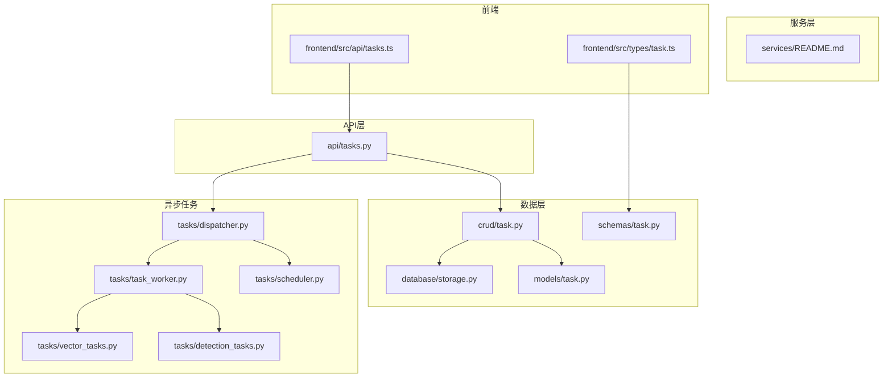
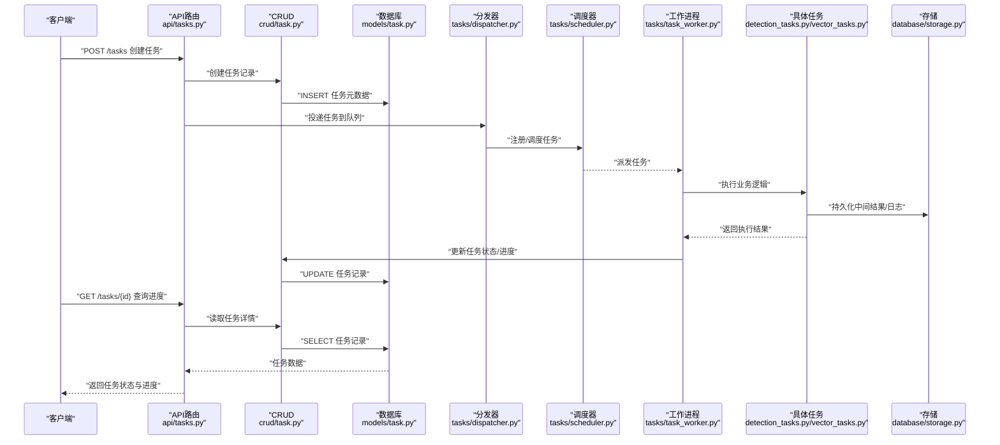
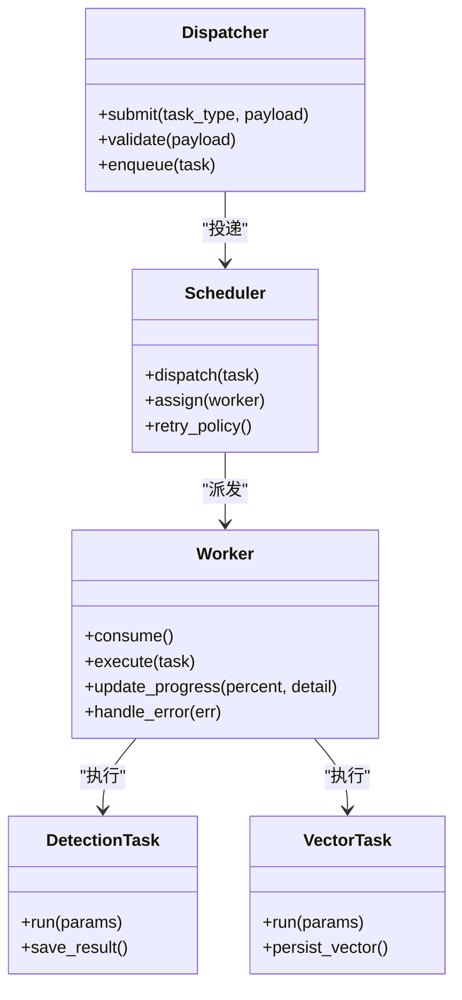
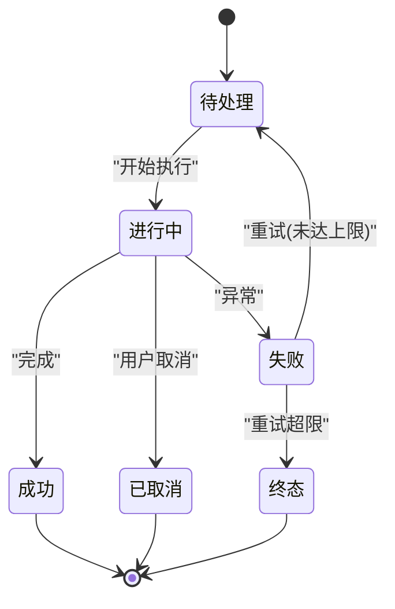
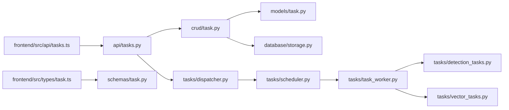

# 任务管理接口

<cite>
**本文引用的文件**   
- [backend/app/api/tasks.py](file://backend/app/api/tasks.py)
- [backend/app/crud/task.py](file://backend/app/crud/task.py)
- [backend/app/models/task.py](file://backend/app/models/task.py)
- [backend/app/schemas/task.py](file://backend/app/schemas/task.py)
- [backend/app/services/README.md](file://backend/app/services/README.md)
- [backend/app/tasks/dispatcher.py](file://backend/app/tasks/dispatcher.py)
- [backend/app/tasks/detection_tasks.py](file://backend/app/tasks/detection_tasks.py)
- [backend/app/tasks/vector_tasks.py](file://backend/app/tasks/vector_tasks.py)
- [backend/app/tasks/task_worker.py](file://backend/app/tasks/task_worker.py)
- [backend/app/tasks/scheduler.py](file://backend/app/tasks/scheduler.py)
- [backend/app/database/storage.py](file://backend/app/database/storage.py)
- [frontend/src/api/tasks.ts](file://frontend/src/api/tasks.ts)
- [frontend/src/types/task.ts](file://frontend/src/types/task.ts)
</cite>

## 目录
1. [简介](#简介)
2. [项目结构](#项目结构)
3. [核心组件](#核心组件)
4. [架构总览](#架构总览)
5. [详细组件分析](#详细组件分析)
6. [依赖关系分析](#依赖关系分析)
7. [性能考虑](#性能考虑)
8. [故障排查指南](#故障排查指南)
9. [结论](#结论)
10. [附录](#附录)

## 简介
本文件面向后端与前端开发者，系统化梳理“任务管理”相关API：任务创建、查询、取消、进度跟踪等；并说明异步任务队列机制、任务状态管理与错误重试策略。文档提供请求/响应示例路径、数据结构定义位置、监控与调试建议，帮助快速集成与排障。

## 项目结构
围绕任务管理的代码主要分布在以下模块：
- API层：路由与参数校验
- 数据模型与模式：数据库模型与请求/响应Schema
- 业务逻辑：CRUD操作与服务编排
- 异步任务：调度器、分发器、Worker与具体任务实现
- 存储：持久化与对象存储
- 前端：调用封装与类型定义

图表来源
- [backend/app/api/tasks.py](file://backend/app/api/tasks.py)
- [backend/app/crud/task.py](file://backend/app/crud/task.py)
- [backend/app/models/task.py](file://backend/app/models/task.py)
- [backend/app/schemas/task.py](file://backend/app/schemas/task.py)
- [backend/app/database/storage.py](file://backend/app/database/storage.py)
- [backend/app/tasks/dispatcher.py](file://backend/app/tasks/dispatcher.py)
- [backend/app/tasks/scheduler.py](file://backend/app/tasks/scheduler.py)
- [backend/app/tasks/task_worker.py](file://backend/app/tasks/task_worker.py)
- [backend/app/tasks/detection_tasks.py](file://backend/app/tasks/detection_tasks.py)
- [backend/app/tasks/vector_tasks.py](file://backend/app/tasks/vector_tasks.py)
- [frontend/src/api/tasks.ts](file://frontend/src/api/tasks.ts)
- [frontend/src/types/task.ts](file://frontend/src/types/task.ts)

章节来源
- [backend/app/api/tasks.py](file://backend/app/api/tasks.py)
- [backend/app/crud/task.py](file://backend/app/crud/task.py)
- [backend/app/models/task.py](file://backend/app/models/task.py)
- [backend/app/schemas/task.py](file://backend/app/schemas/task.py)
- [backend/app/tasks/dispatcher.py](file://backend/app/tasks/dispatcher.py)
- [backend/app/tasks/scheduler.py](file://backend/app/tasks/scheduler.py)
- [backend/app/tasks/task_worker.py](file://backend/app/tasks/task_worker.py)
- [backend/app/tasks/detection_tasks.py](file://backend/app/tasks/detection_tasks.py)
- [backend/app/tasks/vector_tasks.py](file://backend/app/tasks/vector_tasks.py)
- [backend/app/database/storage.py](file://backend/app/database/storage.py)
- [frontend/src/api/tasks.ts](file://frontend/src/api/tasks.ts)
- [frontend/src/types/task.ts](file://frontend/src/types/task.ts)

## 核心组件
- API路由：负责接收HTTP请求、参数校验、返回统一响应格式，并触发任务创建或查询。
- CRUD与模型：维护任务实体的持久化字段、索引与约束。
- Schema：定义请求体与响应体的字段、必填项与校验规则。
- 异步任务：通过调度器将任务入队，由工作进程消费执行，支持失败重试与状态更新。
- 存储：任务元数据落库，大对象（如日志、结果）可落盘或对象存储。
- 前端：封装任务相关的API调用与类型定义，便于页面展示与交互。

章节来源
- [backend/app/api/tasks.py](file://backend/app/api/tasks.py)
- [backend/app/crud/task.py](file://backend/app/crud/task.py)
- [backend/app/models/task.py](file://backend/app/models/task.py)
- [backend/app/schemas/task.py](file://backend/app/schemas/task.py)
- [backend/app/tasks/dispatcher.py](file://backend/app/tasks/dispatcher.py)
- [backend/app/tasks/task_worker.py](file://backend/app/tasks/task_worker.py)
- [backend/app/database/storage.py](file://backend/app/database/storage.py)
- [frontend/src/api/tasks.ts](file://frontend/src/api/tasks.ts)
- [frontend/src/types/task.ts](file://frontend/src/types/task.ts)

## 架构总览
任务从HTTP请求进入，经API路由校验后写入数据库并投递到异步队列；调度器按策略分派给工作进程执行；执行过程中更新任务状态与进度；完成后持久化结果，供查询接口拉取。

图表来源
- [backend/app/api/tasks.py](file://backend/app/api/tasks.py)
- [backend/app/crud/task.py](file://backend/app/crud/task.py)
- [backend/app/models/task.py](file://backend/app/models/task.py)
- [backend/app/tasks/dispatcher.py](file://backend/app/tasks/dispatcher.py)
- [backend/app/tasks/scheduler.py](file://backend/app/tasks/scheduler.py)
- [backend/app/tasks/task_worker.py](file://backend/app/tasks/task_worker.py)
- [backend/app/tasks/detection_tasks.py](file://backend/app/tasks/detection_tasks.py)
- [backend/app/tasks/vector_tasks.py](file://backend/app/tasks/vector_tasks.py)
- [backend/app/database/storage.py](file://backend/app/database/storage.py)

## 详细组件分析

### API接口规范
- 通用约定
  - 基础URL前缀：/api/v1/tasks（以实际路由为准）
  - 认证：根据系统鉴权策略，部分接口需携带令牌
  - 统一响应：包含状态码、消息、数据体；错误时返回错误码与详情
- 任务创建
  - 方法：POST
  - URL：/api/v1/tasks
  - 请求体：参考任务创建Schema定义
  - 响应：返回任务ID与初始状态
- 任务查询
  - 方法：GET
  - URL：/api/v1/tasks/{task_id}
  - 响应：任务元数据、状态、进度、错误信息（如有）
- 任务列表与筛选
  - 方法：GET
  - URL：/api/v1/tasks?status=&type=&page=&size=
  - 响应：分页的任务列表
- 任务取消
  - 方法：DELETE 或 POST /api/v1/tasks/{task_id}/cancel
  - 响应：确认已取消或不可取消的原因
- 进度订阅（可选）
  - 方法：GET/SSE/WebSocket（视实现而定）
  - URL：/api/v1/tasks/{task_id}/progress
  - 响应：增量推送进度事件

章节来源
- [backend/app/api/tasks.py](file://backend/app/api/tasks.py)
- [backend/app/schemas/task.py](file://backend/app/schemas/task.py)
- [backend/app/crud/task.py](file://backend/app/crud/task.py)

### 任务数据模型与Schema
- 模型字段（示例）
  - id：任务唯一标识
  - type：任务类型（如检测、向量化等）
  - status：任务状态（待处理、进行中、成功、失败、已取消）
  - progress：进度百分比或阶段信息
  - result：任务结果引用或摘要
  - error：错误详情（失败时）
  - created_at/updated_at：时间戳
- Schema校验
  - 创建请求：必填字段、枚举值、长度限制等
  - 响应体：字段含义、是否可为空、默认值

章节来源
- [backend/app/models/task.py](file://backend/app/models/task.py)
- [backend/app/schemas/task.py](file://backend/app/schemas/task.py)

### 异步任务队列与调度
- 分发器
  - 职责：接收API层的任务投递，进行参数校验与路由，写入队列
- 调度器
  - 职责：按优先级/资源可用性分配任务到工作进程
- 工作进程
  - 职责：拉取任务、执行、上报进度、处理异常与重试
- 具体任务
  - 检测任务：图片/视频人脸或目标检测
  - 向量任务：特征提取与入库

图表来源
- [backend/app/tasks/dispatcher.py](file://backend/app/tasks/dispatcher.py)
- [backend/app/tasks/scheduler.py](file://backend/app/tasks/scheduler.py)
- [backend/app/tasks/task_worker.py](file://backend/app/tasks/task_worker.py)
- [backend/app/tasks/detection_tasks.py](file://backend/app/tasks/detection_tasks.py)
- [backend/app/tasks/vector_tasks.py](file://backend/app/tasks/vector_tasks.py)

章节来源
- [backend/app/tasks/dispatcher.py](file://backend/app/tasks/dispatcher.py)
- [backend/app/tasks/scheduler.py](file://backend/app/tasks/scheduler.py)
- [backend/app/tasks/task_worker.py](file://backend/app/tasks/task_worker.py)
- [backend/app/tasks/detection_tasks.py](file://backend/app/tasks/detection_tasks.py)
- [backend/app/tasks/vector_tasks.py](file://backend/app/tasks/vector_tasks.py)

### 任务状态机与进度
- 状态流转
  - 待处理 → 进行中 → 成功/失败/已取消
- 进度上报
  - 百分比或阶段节点（如“解析中”、“推理中”、“入库中”）
- 失败与重试
  - 指数退避、最大重试次数、死信队列（若实现）

章节来源
- [backend/app/models/task.py](file://backend/app/models/task.py)
- [backend/app/tasks/task_worker.py](file://backend/app/tasks/task_worker.py)

### 错误处理与重试策略
- 错误分类
  - 参数错误、权限错误、业务异常、外部依赖异常
- 重试策略
  - 可重试错误：网络抖动、临时IO错误
  - 不可重试错误：参数非法、权限不足
- 幂等性
  - 任务ID作为幂等键，避免重复提交导致副作用

章节来源
- [backend/app/tasks/task_worker.py](file://backend/app/tasks/task_worker.py)
- [backend/app/tasks/dispatcher.py](file://backend/app/tasks/dispatcher.py)

### 前端集成要点
- API封装
  - 统一拦截器处理错误与重试
  - 进度轮询或长连接订阅
- 类型定义
  - 任务实体、状态枚举、进度结构

章节来源
- [frontend/src/api/tasks.ts](file://frontend/src/api/tasks.ts)
- [frontend/src/types/task.ts](file://frontend/src/types/task.ts)

## 依赖关系分析
- API层依赖CRUD与分发器
- CRUD依赖模型与存储
- 任务子系统内部：分发器→调度器→工作进程→具体任务
- 前端依赖API与类型定义

图表来源
- [backend/app/api/tasks.py](file://backend/app/api/tasks.py)
- [backend/app/crud/task.py](file://backend/app/crud/task.py)
- [backend/app/models/task.py](file://backend/app/models/task.py)
- [backend/app/schemas/task.py](file://backend/app/schemas/task.py)
- [backend/app/database/storage.py](file://backend/app/database/storage.py)
- [backend/app/tasks/dispatcher.py](file://backend/app/tasks/dispatcher.py)
- [backend/app/tasks/scheduler.py](file://backend/app/tasks/scheduler.py)
- [backend/app/tasks/task_worker.py](file://backend/app/tasks/task_worker.py)
- [backend/app/tasks/detection_tasks.py](file://backend/app/tasks/detection_tasks.py)
- [backend/app/tasks/vector_tasks.py](file://backend/app/tasks/vector_tasks.py)
- [frontend/src/api/tasks.ts](file://frontend/src/api/tasks.ts)
- [frontend/src/types/task.ts](file://frontend/src/types/task.ts)

## 性能考虑
- 批量创建：合并多次小任务为批处理，降低调度开销
- 进度上报频率：合理控制上报间隔，避免频繁写库
- 并发度：根据CPU/GPU资源调整工作进程数
- 结果存储：大对象使用对象存储，数据库仅存引用
- 缓存热点：对常用查询结果做短期缓存

## 故障排查指南
- 常见问题
  - 任务长时间“进行中”：检查工作进程健康与队列堆积
  - 频繁失败：查看错误详情与重试计数，定位外部依赖
  - 进度不更新：核对进度上报逻辑与写库事务
- 诊断步骤
  - 查看任务记录与错误字段
  - 检查调度与分发日志
  - 验证存储读写权限与空间
- 监控指标
  - 队列长度、平均处理时长、失败率、重试次数

章节来源
- [backend/app/tasks/task_worker.py](file://backend/app/tasks/task_worker.py)
- [backend/app/tasks/dispatcher.py](file://backend/app/tasks/dispatcher.py)
- [backend/app/database/storage.py](file://backend/app/database/storage.py)

## 结论
本接口体系围绕“创建-调度-执行-反馈”的闭环设计，结合明确的状态机与重试策略，保障任务的可观测性与可靠性。前后端协作清晰，便于扩展新的任务类型与监控能力。

## 附录
- 请求/响应示例路径
  - 任务创建请求/响应：参见[backend/app/schemas/task.py](file://backend/app/schemas/task.py)
  - 任务查询响应：参见[backend/app/schemas/task.py](file://backend/app/schemas/task.py)
  - 任务取消响应：参见[backend/app/api/tasks.py](file://backend/app/api/tasks.py)
- 数据结构定义
  - 任务模型：参见[backend/app/models/task.py](file://backend/app/models/task.py)
  - 任务类型与Schema：参见[backend/app/schemas/task.py](file://backend/app/schemas/task.py)
- 服务说明
  - 服务层概览：参见[backend/app/services/README.md](file://backend/app/services/README.md)