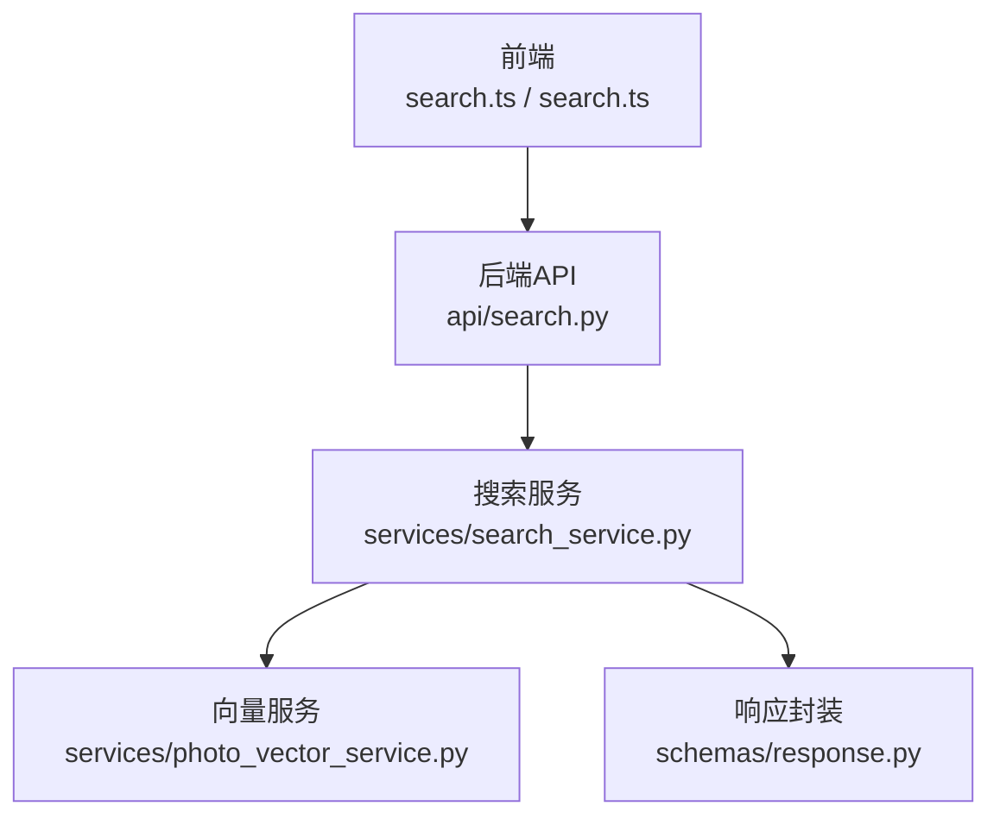
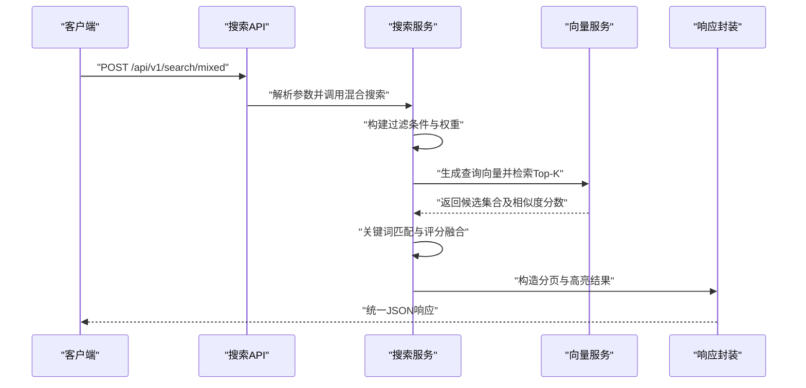
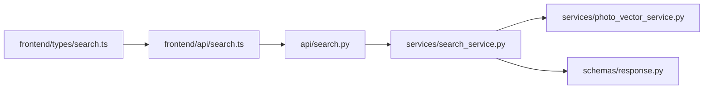

# 搜索接口

<cite>
**本文引用的文件**   
- [backend/app/api/search.py](file://backend/app/api/search.py)
- [backend/app/services/search_service.py](file://backend/app/services/search_service.py)
- [backend/app/services/photo_vector_service.py](file://backend/app/services/photo_vector_service.py)
- [backend/app/schemas/response.py](file://backend/app/schemas/response.py)
- [frontend/src/api/search.ts](file://frontend/src/api/search.ts)
- [frontend/src/types/search.ts](file://frontend/src/types/search.ts)
</cite>

## 目录
1. [简介](#简介)
2. [项目结构](#项目结构)
3. [核心组件](#核心组件)
4. [架构总览](#架构总览)
5. [详细组件分析](#详细组件分析)
6. [依赖分析](#依赖分析)
7. [性能考虑](#性能考虑)
8. [故障排查指南](#故障排查指南)
9. [结论](#结论)
10. [附录](#附录)

## 简介
本文件为“AI相册”项目的搜索相关API文档，覆盖关键词搜索、语义搜索、混合搜索与高级筛选等能力。文档包含：
- HTTP方法与URL模式
- 请求/响应格式与示例
- 向量检索原理、排序算法与过滤组合
- 查询语法与高亮显示格式
- 性能优化与索引策略建议

## 项目结构
搜索功能在后端采用分层设计：API层暴露HTTP接口，服务层实现业务逻辑（含向量检索），数据模型与响应封装在schemas中；前端通过TypeScript API调用并定义类型。

图表来源
- [backend/app/api/search.py](file://backend/app/api/search.py)
- [backend/app/services/search_service.py](file://backend/app/services/search_service.py)
- [backend/app/services/photo_vector_service.py](file://backend/app/services/photo_vector_service.py)
- [backend/app/schemas/response.py](file://backend/app/schemas/response.py)
- [frontend/src/api/search.ts](file://frontend/src/api/search.ts)
- [frontend/src/types/search.ts](file://frontend/src/types/search.ts)

章节来源
- [backend/app/api/search.py](file://backend/app/api/search.py)
- [backend/app/services/search_service.py](file://backend/app/services/search_service.py)
- [backend/app/services/photo_vector_service.py](file://backend/app/services/photo_vector_service.py)
- [backend/app/schemas/response.py](file://backend/app/schemas/response.py)
- [frontend/src/api/search.ts](file://frontend/src/api/search.ts)
- [frontend/src/types/search.ts](file://frontend/src/types/search.ts)

## 核心组件
- 搜索API路由：提供统一入口，解析查询参数、校验输入、转发至服务层。
- 搜索服务：编排关键词匹配、语义向量检索、混合排序与过滤条件组合。
- 向量服务：负责生成/获取图片向量、相似度计算与Top-K检索。
- 响应封装：统一分页、命中片段、高亮标记等返回结构。
- 前端API与类型：封装请求、定义请求/响应数据结构。

章节来源
- [backend/app/api/search.py](file://backend/app/api/search.py)
- [backend/app/services/search_service.py](file://backend/app/services/search_service.py)
- [backend/app/services/photo_vector_service.py](file://backend/app/services/photo_vector_service.py)
- [backend/app/schemas/response.py](file://backend/app/schemas/response.py)
- [frontend/src/api/search.ts](file://frontend/src/api/search.ts)
- [frontend/src/types/search.ts](file://frontend/src/types/search.ts)

## 架构总览
下图展示一次典型“混合搜索”的端到端流程：前端发起请求，API路由解析并校验，服务层执行关键词与向量检索，合并排序后返回结果。

图表来源
- [backend/app/api/search.py](file://backend/app/api/search.py)
- [backend/app/services/search_service.py](file://backend/app/services/search_service.py)
- [backend/app/services/photo_vector_service.py](file://backend/app/services/photo_vector_service.py)
- [backend/app/schemas/response.py](file://backend/app/schemas/response.py)

## 详细组件分析

### 搜索API路由
- 职责
  - 定义HTTP方法、URL模式与路径参数
  - 解析查询字符串与可选JSON体
  - 参数校验与默认值处理
  - 调用服务层并返回统一响应
- 主要接口
  - 关键词搜索：GET /api/v1/search/text
  - 语义搜索：POST /api/v1/search/vector
  - 混合搜索：POST /api/v1/search/mixed
  - 高级筛选：GET /api/v1/search/filter
- 通用查询参数
  - q: 查询文本（关键词或自然语言）
  - type: 搜索类型 text|vector|mixed
  - filters: JSON对象，支持时间范围、地点、标签、人脸等
  - top_k: 返回数量上限
  - page/page_size: 分页
  - highlight: 是否开启高亮
  - sort_by: 排序字段 score|time|relevance
  - sort_order: asc|desc
- 认证与鉴权
  - 根据路由装饰器决定是否需要登录态或角色权限

章节来源
- [backend/app/api/search.py](file://backend/app/api/search.py)

### 搜索服务
- 职责
  - 将用户意图转换为可执行的检索计划
  - 组合关键词匹配与向量检索
  - 应用过滤条件（时间、地点、标签、人脸等）
  - 融合评分与排序
- 关键流程
  - 解析filters并构建SQL/索引过滤表达式
  - 若启用语义检索，调用向量服务生成查询向量
  - 对候选集进行重排（加权融合、去重、截断）
  - 组装高亮片段与元信息
- 复杂度与性能
  - 关键词匹配：O(N)扫描或倒排索引O(logN+K)
  - 向量检索：近似最近邻ANN，近似O(logN)
  - 融合排序：O(K log K)，K为候选数

章节来源
- [backend/app/services/search_service.py](file://backend/app/services/search_service.py)

### 向量服务
- 职责
  - 维护图片向量的存储与更新
  - 提供查询向量生成与相似度检索
- 关键能力
  - 向量维度与归一化策略
  - 相似度度量（余弦/内积）
  - Top-K检索与阈值裁剪
- 注意事项
  - 向量一致性：确保同一内容使用相同编码管线
  - 缓存热点查询向量以降低延迟

章节来源
- [backend/app/services/photo_vector_service.py](file://backend/app/services/photo_vector_service.py)

### 响应封装
- 统一结构
  - code: 状态码
  - message: 消息
  - data: 数据体（分页、列表、高亮等）
- 分页字段
  - total, page, page_size, has_next
- 结果项字段
  - id, title/description, score, highlights, meta
- 错误码约定
  - 4xx: 客户端错误（参数缺失、权限不足）
  - 5xx: 服务端错误（向量服务不可用、索引异常）

章节来源
- [backend/app/schemas/response.py](file://backend/app/schemas/response.py)

### 前端API与类型
- 封装要点
  - 统一请求头（鉴权token、Content-Type）
  - 错误拦截与重试策略
  - 类型约束与自动补全
- 类型定义
  - SearchRequest/SearchResponse
  - FilterSpec、HighlightRule、PageResult

章节来源
- [frontend/src/api/search.ts](file://frontend/src/api/search.ts)
- [frontend/src/types/search.ts](file://frontend/src/types/search.ts)

## 依赖分析
- 模块耦合
  - API层仅依赖服务层，不直接访问向量或数据库
  - 服务层依赖向量服务与响应封装
  - 前端依赖API与类型定义
- 外部依赖
  - 向量库/嵌入模型（由向量服务内部抽象）
  - 搜索引擎/向量数据库（由服务层配置）

图表来源
- [backend/app/api/search.py](file://backend/app/api/search.py)
- [backend/app/services/search_service.py](file://backend/app/services/search_service.py)
- [backend/app/services/photo_vector_service.py](file://backend/app/services/photo_vector_service.py)
- [backend/app/schemas/response.py](file://backend/app/schemas/response.py)
- [frontend/src/api/search.ts](file://frontend/src/api/search.ts)
- [frontend/src/types/search.ts](file://frontend/src/types/search.ts)

章节来源
- [backend/app/api/search.py](file://backend/app/api/search.py)
- [backend/app/services/search_service.py](file://backend/app/services/search_service.py)
- [backend/app/services/photo_vector_service.py](file://backend/app/services/photo_vector_service.py)
- [backend/app/schemas/response.py](file://backend/app/schemas/response.py)
- [frontend/src/api/search.ts](file://frontend/src/api/search.ts)
- [frontend/src/types/search.ts](file://frontend/src/types/search.ts)

## 性能考虑
- 索引策略
  - 关键词：倒排索引或全文索引，按词频/TF-IDF/BM25打分
  - 向量：ANN索引（如HNSW/IVF-PQ），合理设置efConstruction与efSearch
  - 混合：先粗召回再精排，控制候选集规模
- 排序与融合
  - 线性加权融合：score = α·text_score + β·vec_score
  - 归一化后再融合，避免量纲差异
  - 时间衰减因子用于时效性偏好
- 过滤与剪枝
  - 尽早应用强过滤（时间、地点、标签）减少候选集
  - 人脸过滤使用预聚类ID加速
- 缓存与预热
  - 缓存热门查询向量与Top-K结果
  - 批量预计算常用场景的向量索引
- 并发与限流
  - 限制单次top_k上限，防止大结果集拖慢网络
  - 对向量检索接口做速率限制与超时保护

[本节为通用指导，无需代码来源]

## 故障排查指南
- 常见问题
  - 参数缺失或类型错误：检查q、type、filters、top_k等必填项
  - 向量服务不可用：查看健康检查与重试日志
  - 结果无高亮：确认highlight开关与高亮规则配置
  - 排序异常：核对sort_by与sort_order，检查融合权重
- 定位步骤
  - 打开调试日志，记录请求参数与服务耗时
  - 单独测试关键词与向量检索，逐步缩小范围
  - 验证filters表达式是否正确编译
- 恢复措施
  - 降级到纯关键词或纯向量模式
  - 降低top_k或放宽过滤条件
  - 重建或修复索引分区

章节来源
- [backend/app/api/search.py](file://backend/app/api/search.py)
- [backend/app/services/search_service.py](file://backend/app/services/search_service.py)
- [backend/app/services/photo_vector_service.py](file://backend/app/services/photo_vector_service.py)
- [backend/app/schemas/response.py](file://backend/app/schemas/response.py)

## 结论
本项目搜索API以“关键词+向量”的混合检索为核心，结合灵活的过滤与排序策略，兼顾召回率与相关性。通过合理的索引与融合方案，可在大规模媒体库上获得稳定性能与良好体验。

[本节为总结，无需代码来源]

## 附录

### 接口清单与示例

- 关键词搜索
  - 方法：GET
  - URL：/api/v1/search/text
  - 查询参数：q, filters, top_k, page, page_size, highlight, sort_by, sort_order
  - 成功响应示例（示意）
    {
      "code": 0,
      "message": "ok",
      "data": {
        "total": 120,
        "page": 1,
        "page_size": 20,
        "has_next": true,
        "items": [
          {
            "id": "photo_001",
            "title": "海边日落",
            "description": "夕阳下的海岸线",
            "score": 0.92,
            "highlights": ["日落", "海岸"],
            "meta": {"time": "2024-06-01T18:30:00Z", "location": "三亚"}
          }
        ]
      }
    }
  - 失败响应示例（示意）
    {
      "code": 400,
      "message": "缺少必要参数: q",
      "data": null
    }

- 语义搜索
  - 方法：POST
  - URL：/api/v1/search/vector
  - 请求体（示意）
    {
      "query": "穿红色连衣裙的女孩在花丛中拍照",
      "filters": {"tags": ["人像","户外"],"date_range":{"start":"2024-01-01","end":"2024-12-31"}},
      "top_k": 50,
      "threshold": 0.65
    }
  - 成功响应示例（示意）
    {
      "code": 0,
      "message": "ok",
      "data": {
        "total": 45,
        "page": 1,
        "page_size": 20,
        "has_next": true,
        "items": [
          {
            "id": "photo_042",
            "title": "花丛人像",
            "description": "女孩在花海中微笑",
            "score": 0.88,
            "highlights": ["红色连衣裙","花丛"],
            "meta": {"time": "2024-05-12T10:15:00Z", "location": "昆明"}
          }
        ]
      }
    }

- 混合搜索
  - 方法：POST
  - URL：/api/v1/search/mixed
  - 请求体（示意）
    {
      "query": "海边日落人像",
      "weights": {"text": 0.4, "vector": 0.6},
      "filters": {"faces": ["Alice"],"tags":["风景"]},
      "top_k": 30,
      "sort_by": "score",
      "sort_order": "desc"
    }
  - 成功响应示例（示意）
    {
      "code": 0,
      "message": "ok",
      "data": {
        "total": 28,
        "page": 1,
        "page_size": 20,
        "has_next": true,
        "items": [
          {
            "id": "photo_017",
            "title": "海边人像",
            "description": "人物与日落的合影",
            "score": 0.95,
            "highlights": ["海边","日落","人像"],
            "meta": {"time": "2024-07-20T19:05:00Z", "location": "厦门"}
          }
        ]
      }
    }

- 高级筛选
  - 方法：GET
  - URL：/api/v1/search/filter
  - 查询参数：filters, top_k, page, page_size, sort_by, sort_order
  - filters示例（示意）
    {
      "date_range": {"start": "2024-01-01", "end": "2024-12-31"},
      "location": "北京",
      "tags": ["旅行","美食"],
      "faces": ["Bob"],
      "exif": {"camera_make": "Canon"}
    }
  - 成功响应示例（示意）
    {
      "code": 0,
      "message": "ok",
      "data": {
        "total": 100,
        "page": 1,
        "page_size": 20,
        "has_next": true,
        "items": [
          {
            "id": "photo_088",
            "title": "胡同早餐",
            "description": "老北京的早点摊",
            "score": 0.78,
            "highlights": ["早餐","胡同"],
            "meta": {"time": "2024-03-15T07:45:00Z", "location": "北京"}
          }
        ]
      }
    }

### 查询语法与高亮格式
- 查询语法
  - 关键词：支持短语与布尔操作（AND/OR/NOT），例如 "海边 AND 日落 NOT 夜景"
  - 语义：自然语言描述即可，系统自动转为向量
  - 混合：同时提供文本与自然语言，系统分别打分并融合
- 高亮格式
  - highlights为命中片段数组
  - 可在前端渲染时包裹<mark>标签进行样式高亮
  - 可通过highlight_rules自定义片段长度与上下文窗口

### 搜索结果排序与过滤组合
- 排序
  - 基于score的综合得分，可按time或relevance切换
  - 支持asc/desc顺序
- 过滤组合
  - 多条件AND组合为主，OR需显式声明
  - 时间范围优先于其他条件以减少候选集
  - 人脸与标签作为二级过滤提升精准度

### 向量检索原理
- 编码：图像经编码器得到固定维度向量，并进行L2归一化
- 相似度：余弦相似度或内积，取决于索引实现
- 召回：ANN近似最近邻，控制efSearch平衡精度与速度
- 阈值：threshold裁剪低分结果，保证质量

### 前端调用示例（TypeScript）
- 基本调用（示意）
  - 导入API函数
  - 传入查询参数与过滤器
  - 处理分页与高亮展示
- 错误处理
  - 捕获网络与业务错误
  - 提示用户重试或调整参数

章节来源
- [backend/app/api/search.py](file://backend/app/api/search.py)
- [backend/app/services/search_service.py](file://backend/app/services/search_service.py)
- [backend/app/services/photo_vector_service.py](file://backend/app/services/photo_vector_service.py)
- [backend/app/schemas/response.py](file://backend/app/schemas/response.py)
- [frontend/src/api/search.ts](file://frontend/src/api/search.ts)
- [frontend/src/types/search.ts](file://frontend/src/types/search.ts)