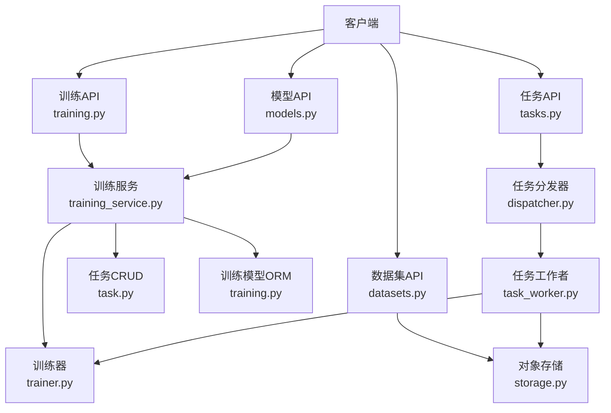
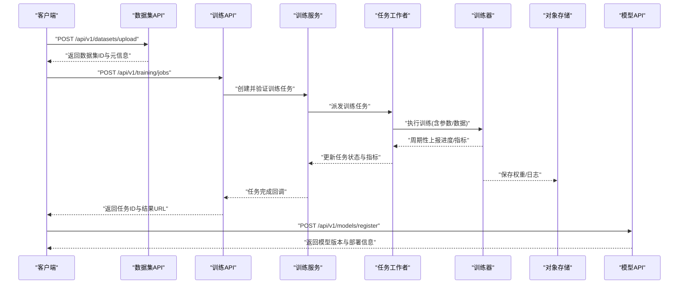
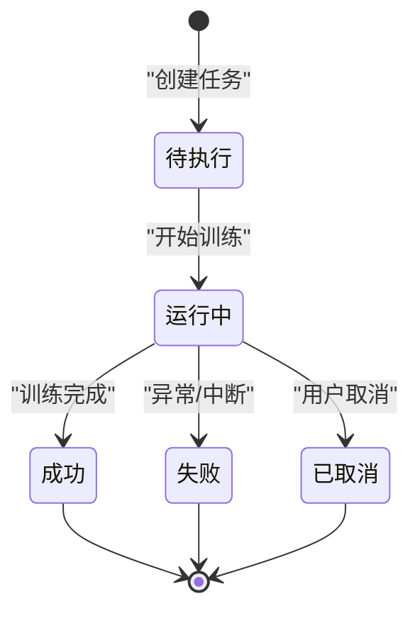
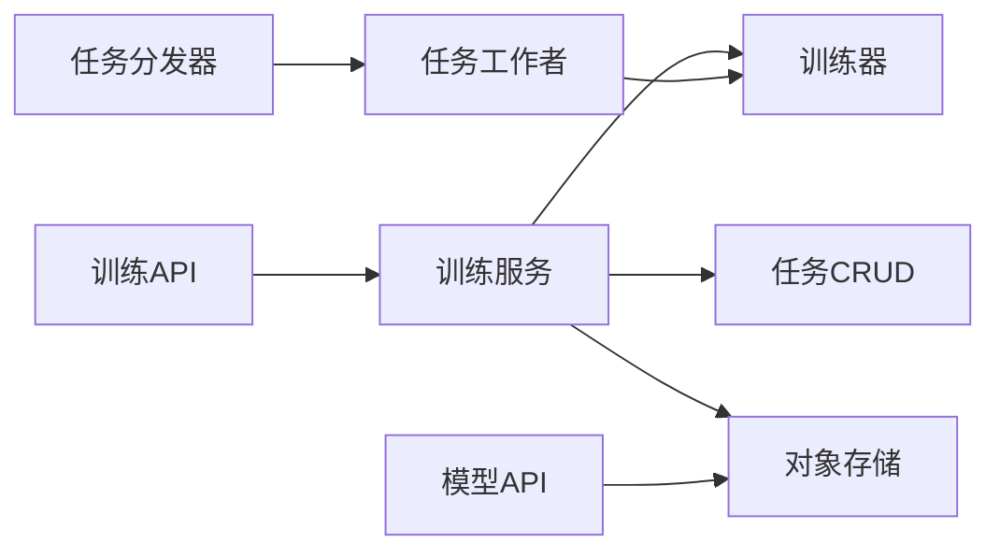

# 模型训练接口

<cite>
**本文引用的文件**   
- [backend/app/api/training.py](file://backend/app/api/training.py)
- [backend/app/api/models.py](file://backend/app/api/models.py)
- [backend/app/schemas/training.py](file://backend/app/schemas/training.py)
- [backend/app/services/trainer.py](file://backend/app/services/trainer.py)
- [backend/app/services/training_service.py](file://backend/app/services/training_service.py)
- [backend/app/models/training.py](file://backend/app/models/training.py)
- [backend/app/crud/task.py](file://backend/app/crud/task.py)
- [backend/app/tasks/dispatcher.py](file://backend/app/tasks/dispatcher.py)
- [backend/app/tasks/task_worker.py](file://backend/app/tasks/task_worker.py)
- [backend/app/database/storage.py](file://backend/app/database/storage.py)
- [backend/app/core/exceptions.py](file://backend/app/core/exceptions.py)
- [backend/app/config/settings.py](file://backend/app/config/settings.py)
- [backend/app/api/datasets.py](file://backend/app/api/datasets.py)
- [backend/app/api/tasks.py](file://backend/app/api/tasks.py)
</cite>

## 目录
1. [简介](#简介)
2. [项目结构](#项目结构)
3. [核心组件](#核心组件)
4. [架构总览](#架构总览)
5. [详细组件分析](#详细组件分析)
6. [依赖关系分析](#依赖关系分析)
7. [性能考虑](#性能考虑)
8. [故障排除指南](#故障排除指南)
9. [结论](#结论)
10. [附录](#附录)

## 简介
本文件面向“模型训练”相关能力，提供完整的API接口文档与最佳实践。内容覆盖：
- 数据集上传与管理
- 模型训练任务创建、执行与监控
- 模型版本管理与部署
- 训练参数配置与评估指标说明
- 请求/响应示例（以字段结构为主）
- 训练任务结构与进度报告
- 常见问题的排查建议

## 项目结构
后端采用分层设计：API层暴露HTTP接口，服务层封装业务逻辑，持久化层负责存储与任务调度，数据模型与Schema定义数据结构。训练相关的关键路径如下：
- API: training.py, models.py, datasets.py, tasks.py
- 服务: trainer.py, training_service.py
- 模型: training.py
- 任务: dispatcher.py, task_worker.py
- 存储: storage.py
- 异常与配置: exceptions.py, settings.py

图表来源
- [backend/app/api/training.py](file://backend/app/api/training.py)
- [backend/app/api/models.py](file://backend/app/api/models.py)
- [backend/app/api/datasets.py](file://backend/app/api/datasets.py)
- [backend/app/api/tasks.py](file://backend/app/api/tasks.py)
- [backend/app/services/training_service.py](file://backend/app/services/training_service.py)
- [backend/app/services/trainer.py](file://backend/app/services/trainer.py)
- [backend/app/models/training.py](file://backend/app/models/training.py)
- [backend/app/crud/task.py](file://backend/app/crud/task.py)
- [backend/app/tasks/dispatcher.py](file://backend/app/tasks/dispatcher.py)
- [backend/app/tasks/task_worker.py](file://backend/app/tasks/task_worker.py)
- [backend/app/database/storage.py](file://backend/app/database/storage.py)

章节来源
- [backend/app/api/training.py](file://backend/app/api/training.py)
- [backend/app/api/models.py](file://backend/app/api/models.py)
- [backend/app/api/datasets.py](file://backend/app/api/datasets.py)
- [backend/app/api/tasks.py](file://backend/app/api/tasks.py)
- [backend/app/services/training_service.py](file://backend/app/services/training_service.py)
- [backend/app/services/trainer.py](file://backend/app/services/trainer.py)
- [backend/app/models/training.py](file://backend/app/models/training.py)
- [backend/app/crud/task.py](file://backend/app/crud/task.py)
- [backend/app/tasks/dispatcher.py](file://backend/app/tasks/dispatcher.py)
- [backend/app/tasks/task_worker.py](file://backend/app/tasks/task_worker.py)
- [backend/app/database/storage.py](file://backend/app/database/storage.py)

## 核心组件
- 训练API层：提供训练任务生命周期管理、进度查询、结果获取等接口
- 模型API层：提供模型注册、版本管理、部署切换等接口
- 数据集API层：提供数据集上传、校验、元信息读取等接口
- 训练服务：编排训练流程、参数校验、指标收集、状态更新
- 训练器：具体训练执行逻辑（可对接不同框架）
- 任务系统：异步任务分发与执行，支持进度上报与失败重试
- 存储：训练产物、权重文件、日志的持久化
- 数据模型与Schema：统一的数据契约与数据库映射

章节来源
- [backend/app/api/training.py](file://backend/app/api/training.py)
- [backend/app/api/models.py](file://backend/app/api/models.py)
- [backend/app/api/datasets.py](file://backend/app/api/datasets.py)
- [backend/app/services/training_service.py](file://backend/app/services/training_service.py)
- [backend/app/services/trainer.py](file://backend/app/services/trainer.py)
- [backend/app/models/training.py](file://backend/app/models/training.py)
- [backend/app/crud/task.py](file://backend/app/crud/task.py)
- [backend/app/tasks/dispatcher.py](file://backend/app/tasks/dispatcher.py)
- [backend/app/tasks/task_worker.py](file://backend/app/tasks/task_worker.py)
- [backend/app/database/storage.py](file://backend/app/database/storage.py)

## 架构总览
训练端到端流程概览：
- 客户端通过数据集API上传数据，生成数据集记录与元信息
- 通过训练API提交训练任务，携带训练参数与数据集ID
- 任务分发器将任务投递至工作者，工作者调用训练器执行训练
- 训练过程中持续上报进度与指标，持久化到任务与模型记录
- 训练完成后，模型API提供版本登记与部署切换

图表来源
- [backend/app/api/datasets.py](file://backend/app/api/datasets.py)
- [backend/app/api/training.py](file://backend/app/api/training.py)
- [backend/app/services/training_service.py](file://backend/app/services/training_service.py)
- [backend/app/tasks/dispatcher.py](file://backend/app/tasks/dispatcher.py)
- [backend/app/tasks/task_worker.py](file://backend/app/tasks/task_worker.py)
- [backend/app/services/trainer.py](file://backend/app/services/trainer.py)
- [backend/app/database/storage.py](file://backend/app/database/storage.py)
- [backend/app/api/models.py](file://backend/app/api/models.py)

## 详细组件分析

### 数据集上传与管理
- 目标：接收图片/标注文件，进行格式校验，生成数据集记录与元信息，供后续训练使用
- 关键行为：
  - 分片或批量上传
  - 文件类型与大小校验
  - 生成唯一数据集ID与目录结构
  - 解析并存储元信息（类别、数量、统计等）
- 典型接口（概念性描述）：
  - 上传数据集：POST /api/v1/datasets/upload
  - 查询数据集详情：GET /api/v1/datasets/{dataset_id}
  - 删除数据集：DELETE /api/v1/datasets/{dataset_id}
- 请求/响应要点：
  - 请求体包含多文件表单字段与可选元信息
  - 响应返回数据集ID、存储路径、统计摘要
- 错误处理：
  - 非法文件格式、超出大小限制、重复数据集名等
- 最佳实践：
  - 合理划分类别标签，保持正负样本均衡
  - 对大文件采用分片上传，断点续传

章节来源
- [backend/app/api/datasets.py](file://backend/app/api/datasets.py)
- [backend/app/database/storage.py](file://backend/app/database/storage.py)

### 模型训练任务
- 目标：创建训练任务、启动训练、查询进度与结果
- 关键行为：
  - 参数校验（学习率、批次大小、轮次、优化器等）
  - 数据准备与预处理
  - 训练执行与指标采集
  - 进度上报与状态机流转
- 典型接口（概念性描述）：
  - 创建训练任务：POST /api/v1/training/jobs
  - 查询任务状态：GET /api/v1/training/jobs/{job_id}
  - 取消任务：POST /api/v1/training/jobs/{job_id}/cancel
  - 获取训练日志：GET /api/v1/training/jobs/{job_id}/logs
- 请求/响应要点：
  - 请求体包含数据集ID、模型类型、超参数字典、资源配额等
  - 响应返回任务ID、初始状态、预计时长
  - 状态枚举：pending、running、success、failed、cancelled
- 进度与指标：
  - 进度字段：epoch、step、loss、mAP、precision、recall、f1等
  - 指标随训练周期上报，最终汇总写入任务结果
- 错误处理：
  - 参数不合法、GPU不可用、OOM、数据缺失等
- 最佳实践：
  - 小步长预热+余弦退火学习率策略
  - 早停与检查点保存，避免长时间无提升
  - 使用混合精度与梯度累积提升吞吐

章节来源
- [backend/app/api/training.py](file://backend/app/api/training.py)
- [backend/app/services/training_service.py](file://backend/app/services/training_service.py)
- [backend/app/services/trainer.py](file://backend/app/services/trainer.py)
- [backend/app/crud/task.py](file://backend/app/crud/task.py)
- [backend/app/tasks/dispatcher.py](file://backend/app/tasks/dispatcher.py)
- [backend/app/tasks/task_worker.py](file://backend/app/tasks/task_worker.py)

#### 训练任务状态机

图表来源
- [backend/app/services/training_service.py](file://backend/app/services/training_service.py)
- [backend/app/tasks/task_worker.py](file://backend/app/tasks/task_worker.py)

### 模型版本管理与部署
- 目标：登记训练产物为模型版本，并提供部署切换能力
- 关键行为：
  - 模型注册（名称、版本、权重路径、评估指标）
  - 版本对比与回滚
  - 在线部署切换（灰度/蓝绿）
- 典型接口（概念性描述）：
  - 注册模型：POST /api/v1/models/register
  - 列出模型版本：GET /api/v1/models/{model_name}/versions
  - 切换活跃版本：PATCH /api/v1/models/{model_name}/deploy
  - 删除版本：DELETE /api/v1/models/{model_name}/versions/{version}
- 请求/响应要点：
  - 注册时需提供模型ID/任务ID、权重路径、评估指标摘要
  - 部署切换返回新活跃版本与生效时间
- 错误处理：
  - 版本冲突、权重文件缺失、权限不足等
- 最佳实践：
  - 严格语义化版本号
  - 部署前进行回归测试与A/B实验
  - 保留历史版本以便快速回滚

章节来源
- [backend/app/api/models.py](file://backend/app/api/models.py)
- [backend/app/database/storage.py](file://backend/app/database/storage.py)

### 任务系统与监控
- 目标：异步执行训练任务，提供进度与日志查询
- 关键行为：
  - 任务分发与负载均衡
  - 工作者心跳与超时检测
  - 进度上报与持久化
- 典型接口（概念性描述）：
  - 任务列表：GET /api/v1/tasks
  - 任务详情：GET /api/v1/tasks/{task_id}
  - 任务日志：GET /api/v1/tasks/{task_id}/logs
- 监控指标：
  - 任务队列长度、平均等待时间、成功率、失败原因分布
- 最佳实践：
  - 设置合理的重试次数与退避策略
  - 对长耗时任务启用心跳保活
  - 集中式日志与告警

章节来源
- [backend/app/api/tasks.py](file://backend/app/api/tasks.py)
- [backend/app/tasks/dispatcher.py](file://backend/app/tasks/dispatcher.py)
- [backend/app/tasks/task_worker.py](file://backend/app/tasks/task_worker.py)

## 依赖关系分析
- 耦合关系：
  - 训练API依赖训练服务；训练服务依赖训练器、任务CRUD、存储
  - 任务分发器与工作者解耦，通过消息队列或内存队列通信
  - 模型API独立于训练流程，仅消费训练产物
- 外部依赖：
  - 对象存储用于权重与日志持久化
  - 可能的GPU驱动与深度学习框架（由训练器实现决定）
- 潜在风险：
  - 循环依赖应避免（当前分层清晰）
  - 任务队列单点故障需引入高可用方案

图表来源
- [backend/app/api/training.py](file://backend/app/api/training.py)
- [backend/app/services/training_service.py](file://backend/app/services/training_service.py)
- [backend/app/services/trainer.py](file://backend/app/services/trainer.py)
- [backend/app/crud/task.py](file://backend/app/crud/task.py)
- [backend/app/database/storage.py](file://backend/app/database/storage.py)
- [backend/app/api/models.py](file://backend/app/api/models.py)
- [backend/app/tasks/dispatcher.py](file://backend/app/tasks/dispatcher.py)
- [backend/app/tasks/task_worker.py](file://backend/app/tasks/task_worker.py)

章节来源
- [backend/app/api/training.py](file://backend/app/api/training.py)
- [backend/app/services/training_service.py](file://backend/app/services/training_service.py)
- [backend/app/services/trainer.py](file://backend/app/services/trainer.py)
- [backend/app/crud/task.py](file://backend/app/crud/task.py)
- [backend/app/database/storage.py](file://backend/app/database/storage.py)
- [backend/app/api/models.py](file://backend/app/api/models.py)
- [backend/app/tasks/dispatcher.py](file://backend/app/tasks/dispatcher.py)
- [backend/app/tasks/task_worker.py](file://backend/app/tasks/task_worker.py)

## 性能考虑
- 数据加载：
  - 使用预取与缓存机制，减少I/O瓶颈
  - 对图像进行按需解码与缩放
- 训练加速：
  - 混合精度训练、梯度累积、分布式并行
  - 合理批次大小与学习率调度
- 存储与网络：
  - 就近读写对象存储，避免跨机房延迟
  - 压缩日志与权重，降低带宽占用
- 任务调度：
  - 基于资源感知的调度，避免过载
  - 失败重试与优雅降级

[本节为通用指导，无需代码引用]

## 故障排除指南
- 常见问题：
  - 数据集上传失败：检查文件格式、大小限制、命名规范
  - 训练任务失败：查看任务日志与错误码，确认GPU资源与内存
  - 模型部署失败：核对权重路径与版本一致性
- 定位方法：
  - 通过任务ID查询日志与进度
  - 检查对象存储中的权重与中间产物
  - 关注异常模块的错误定义与抛出位置
- 恢复策略：
  - 从最近检查点恢复训练
  - 回滚到上一个稳定模型版本
  - 调整超参与资源配额后重试

章节来源
- [backend/app/core/exceptions.py](file://backend/app/core/exceptions.py)
- [backend/app/tasks/task_worker.py](file://backend/app/tasks/task_worker.py)
- [backend/app/database/storage.py](file://backend/app/database/storage.py)

## 结论
本接口体系围绕“数据集—训练—模型—部署”的全链路构建，强调可观测性与可运维性。通过清晰的职责分层与任务系统，可实现高效、稳定的模型训练与版本管理。建议在生产环境结合监控告警与自动化流水线，持续提升训练质量与交付效率。

[本节为总结，无需代码引用]

## 附录

### 训练参数配置参考
- 基础参数：
  - 数据集ID、模型类型、类别数
  - 学习率、批次大小、轮次、优化器、损失函数
- 增强与正则：
  - 数据增强策略、Dropout、权重衰减
- 资源与调度：
  - GPU/CPU配额、并发度、超时时间
- 评估与早停：
  - 评估指标阈值、早停耐心值、检查点间隔

[本节为通用指导，无需代码引用]

### 模型评估指标说明
- 分类类：
  - precision、recall、F1、accuracy
- 检测类：
  - mAP@IoU=0.5、mAP@IoU=0.5:0.95
- 其他：
  - 混淆矩阵、ROC/AUC（如适用）

[本节为通用指导，无需代码引用]

### 请求/响应示例（字段结构）
- 创建训练任务
  - 请求体字段：
    - dataset_id: 字符串
    - model_type: 字符串
    - hyperparameters: 字典
    - resources: 对象（gpu_count、memory_mb等）
  - 响应体字段：
    - job_id: 字符串
    - status: 枚举（pending/running/success/failed/cancelled）
    - created_at: 时间戳
    - estimated_duration_seconds: 整数
- 查询任务状态
  - 响应体字段：
    - job_id: 字符串
    - status: 枚举
    - progress: 对象（epoch、step、loss、metrics）
    - metrics: 对象（precision、recall、f1、mAP等）
    - result_url: 字符串（训练产物下载链接）
- 注册模型
  - 请求体字段：
    - model_name: 字符串
    - version: 字符串（语义化版本）
    - job_id: 字符串
    - weights_path: 字符串
    - metrics_summary: 对象
  - 响应体字段：
    - model_id: 字符串
    - version: 字符串
    - deployed: 布尔
    - deploy_url: 字符串（推理服务入口）

[本节为通用指导，无需代码引用]