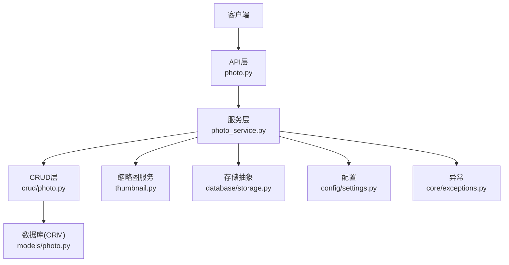
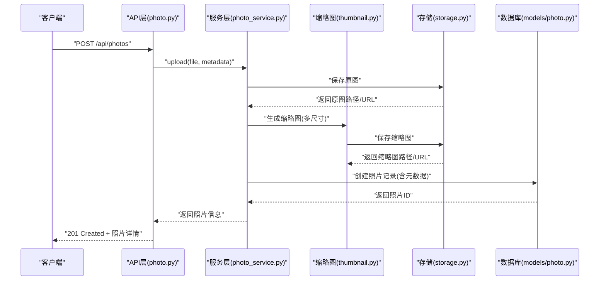
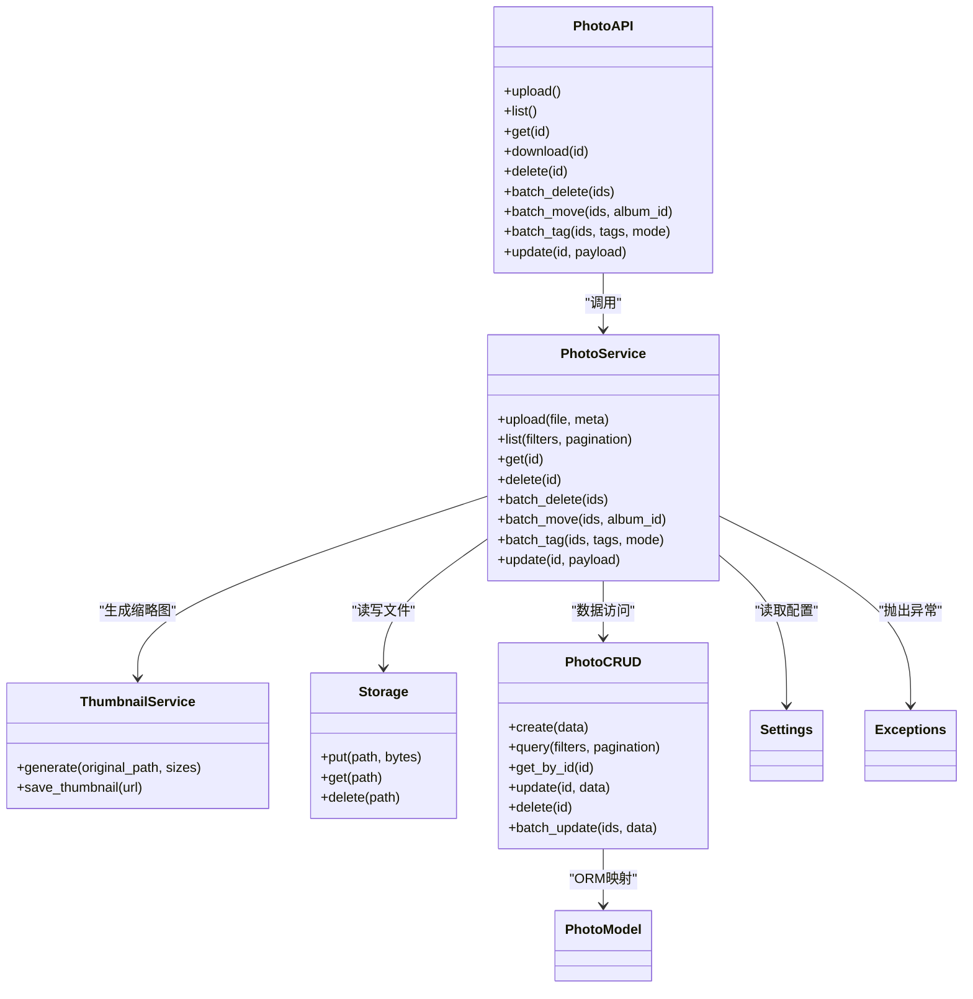

# 照片管理接口

<cite>
**本文引用的文件**   
- [backend/app/api/photo.py](file://backend/app/api/photo.py)
- [backend/app/schemas/photo.py](file://backend/app/schemas/photo.py)
- [backend/app/models/photo.py](file://backend/app/models/photo.py)
- [backend/app/services/photo_service.py](file://backend/app/services/photo_service.py)
- [backend/app/services/thumbnail.py](file://backend/app/services/thumbnail.py)
- [backend/app/database/storage.py](file://backend/app/database/storage.py)
- [backend/app/config/settings.py](file://backend/app/config/settings.py)
- [backend/app/core/exceptions.py](file://backend/app/core/exceptions.py)
- [backend/app/crud/photo.py](file://backend/app/crud/photo.py)
</cite>

## 目录
1. [简介](#简介)
2. [项目结构](#项目结构)
3. [核心组件](#核心组件)
4. [架构总览](#架构总览)
5. [详细组件分析](#详细组件分析)
6. [依赖关系分析](#依赖关系分析)
7. [性能考虑](#性能考虑)
8. [故障排查指南](#故障排查指南)
9. [结论](#结论)
10. [附录](#附录)

## 简介
本文件为“照片管理”相关API的权威文档，覆盖上传、下载、删除、批量操作与元数据管理等能力。文档包含：
- HTTP方法与URL模式
- 请求与响应格式（含分页参数）
- 文件上传限制与支持的图片格式
- 缩略图生成与存储策略
- 错误处理规范与性能优化建议
- 完整请求/响应示例（以字段说明为主，避免直接粘贴代码）

## 项目结构
后端采用分层架构：API层负责路由与参数校验；服务层封装业务逻辑；CRUD层负责数据库访问；模型层定义ORM实体；Schema层定义请求/响应数据结构；配置与异常模块提供全局设置与统一错误处理。

图表来源
- [backend/app/api/photo.py](file://backend/app/api/photo.py)
- [backend/app/services/photo_service.py](file://backend/app/services/photo_service.py)
- [backend/app/crud/photo.py](file://backend/app/crud/photo.py)
- [backend/app/services/thumbnail.py](file://backend/app/services/thumbnail.py)
- [backend/app/database/storage.py](file://backend/app/database/storage.py)
- [backend/app/config/settings.py](file://backend/app/config/settings.py)
- [backend/app/core/exceptions.py](file://backend/app/core/exceptions.py)
- [backend/app/models/photo.py](file://backend/app/models/photo.py)

章节来源
- [backend/app/api/photo.py](file://backend/app/api/photo.py)
- [backend/app/services/photo_service.py](file://backend/app/services/photo_service.py)
- [backend/app/crud/photo.py](file://backend/app/crud/photo.py)
- [backend/app/services/thumbnail.py](file://backend/app/services/thumbnail.py)
- [backend/app/database/storage.py](file://backend/app/database/storage.py)
- [backend/app/config/settings.py](file://backend/app/config/settings.py)
- [backend/app/core/exceptions.py](file://backend/app/core/exceptions.py)
- [backend/app/models/photo.py](file://backend/app/models/photo.py)

## 核心组件
- 路由与控制器：定义RESTful端点，解析请求体与查询参数，返回标准化响应。
- 服务层：实现上传、下载、删除、批量操作、元数据更新等业务流程，协调存储与缩略图生成。
- CRUD层：对照片实体的增删改查进行封装。
- Schema：严格定义请求与响应的字段类型与约束。
- 存储抽象：统一本地或对象存储的读写接口。
- 缩略图服务：按配置生成不同尺寸的缩略图并持久化。
- 配置：集中管理文件大小限制、允许格式、缩略图尺寸等。
- 异常：统一错误码与消息结构。

章节来源
- [backend/app/api/photo.py](file://backend/app/api/photo.py)
- [backend/app/services/photo_service.py](file://backend/app/services/photo_service.py)
- [backend/app/crud/photo.py](file://backend/app/crud/photo.py)
- [backend/app/schemas/photo.py](file://backend/app/schemas/photo.py)
- [backend/app/database/storage.py](file://backend/app/database/storage.py)
- [backend/app/services/thumbnail.py](file://backend/app/services/thumbnail.py)
- [backend/app/config/settings.py](file://backend/app/config/settings.py)
- [backend/app/core/exceptions.py](file://backend/app/core/exceptions.py)

## 架构总览
下图展示一次典型“上传照片”的调用链：客户端发起请求，API层校验后交由服务层处理，服务层写入主文件、生成缩略图、记录元数据，最终返回结果。

图表来源
- [backend/app/api/photo.py](file://backend/app/api/photo.py)
- [backend/app/services/photo_service.py](file://backend/app/services/photo_service.py)
- [backend/app/services/thumbnail.py](file://backend/app/services/thumbnail.py)
- [backend/app/database/storage.py](file://backend/app/database/storage.py)
- [backend/app/models/photo.py](file://backend/app/models/photo.py)

## 详细组件分析

### 上传照片
- 方法：POST
- URL：/api/photos
- 内容类型：multipart/form-data
- 表单字段
  - file：二进制图片文件
  - title：可选，标题
  - description：可选，描述
  - tags：可选，标签数组
  - location：可选，位置信息（经纬度或地址）
  - album_id：可选，所属相册ID
- 上传限制
  - 最大文件大小：由配置项控制
  - 支持格式：JPEG、PNG、WebP、HEIC（若平台支持）、GIF（静态帧）
  - 分辨率上限：由配置项控制
  - 并发上传：建议前端分片或队列控制
- 成功响应：201 Created
  - 返回字段：id、title、description、tags、location、album_id、original_url、thumbnail_urls、created_at、updated_at
- 失败响应
  - 400：参数校验失败（如缺少file、不支持格式）
  - 413：超过大小限制
  - 415：不支持的媒体类型
  - 500：存储或缩略图生成失败

章节来源
- [backend/app/api/photo.py](file://backend/app/api/photo.py)
- [backend/app/schemas/photo.py](file://backend/app/schemas/photo.py)
- [backend/app/services/photo_service.py](file://backend/app/services/photo_service.py)
- [backend/app/services/thumbnail.py](file://backend/app/services/thumbnail.py)
- [backend/app/database/storage.py](file://backend/app/database/storage.py)
- [backend/app/config/settings.py](file://backend/app/config/settings.py)

### 获取照片列表（分页）
- 方法：GET
- URL：/api/photos
- 查询参数
  - page：页码，默认1
  - size：每页数量，默认20，最大受服务端限制
  - sort_by：排序字段（如 created_at、title）
  - order：排序方向 asc/desc
  - keyword：关键词搜索（标题/描述/标签）
  - album_id：按相册过滤
  - tag：按标签过滤
  - date_from/date_to：按时间范围过滤
  - has_location：是否仅返回带位置的记录
- 成功响应：200 OK
  - data：照片条目数组（每条包含基础信息与缩略图URL）
  - total：总数
  - page：当前页
  - size：每页大小
  - pages：总页数
- 失败响应
  - 400：参数非法（如size超限）
  - 500：数据库查询异常

章节来源
- [backend/app/api/photo.py](file://backend/app/api/photo.py)
- [backend/app/schemas/photo.py](file://backend/app/schemas/photo.py)
- [backend/app/crud/photo.py](file://backend/app/crud/photo.py)

### 获取照片详情
- 方法：GET
- URL：/api/photos/{id}
- 路径参数
  - id：照片ID
- 成功响应：200 OK
  - 返回完整照片信息，包括原图URL与缩略图URL集合
- 失败响应
  - 404：未找到
  - 500：内部错误

章节来源
- [backend/app/api/photo.py](file://backend/app/api/photo.py)
- [backend/app/schemas/photo.py](file://backend/app/schemas/photo.py)
- [backend/app/crud/photo.py](file://backend/app/crud/photo.py)

### 下载原图
- 方法：GET
- URL：/api/photos/{id}/download
- 路径参数
  - id：照片ID
- 成功响应：200 OK
  - 返回二进制流，Content-Type为图片类型
- 失败响应
  - 404：未找到
  - 500：读取失败

章节来源
- [backend/app/api/photo.py](file://backend/app/api/photo.py)
- [backend/app/database/storage.py](file://backend/app/database/storage.py)

### 删除照片
- 方法：DELETE
- URL：/api/photos/{id}
- 路径参数
  - id：照片ID
- 成功响应：204 No Content
- 失败响应
  - 404：未找到
  - 500：删除失败（文件或元数据不一致）

章节来源
- [backend/app/api/photo.py](file://backend/app/api/photo.py)
- [backend/app/services/photo_service.py](file://backend/app/services/photo_service.py)
- [backend/app/database/storage.py](file://backend/app/database/storage.py)
- [backend/app/crud/photo.py](file://backend/app/crud/photo.py)

### 批量删除
- 方法：DELETE
- URL：/api/photos/batch
- 请求体
  - ids：照片ID数组
- 成功响应：200 OK
  - 返回已删除数量与失败明细
- 失败响应
  - 400：ids为空或格式错误
  - 500：部分或全部删除失败

章节来源
- [backend/app/api/photo.py](file://backend/app/api/photo.py)
- [backend/app/services/photo_service.py](file://backend/app/services/photo_service.py)
- [backend/app/crud/photo.py](file://backend/app/crud/photo.py)

### 批量移动至相册
- 方法：PATCH
- URL：/api/photos/batch/move
- 请求体
  - ids：照片ID数组
  - album_id：目标相册ID
- 成功响应：200 OK
  - 返回更新数量与失败明细
- 失败响应
  - 400：参数缺失或非法
  - 404：相册不存在
  - 500：更新失败

章节来源
- [backend/app/api/photo.py](file://backend/app/api/photo.py)
- [backend/app/services/photo_service.py](file://backend/app/services/photo_service.py)
- [backend/app/crud/photo.py](file://backend/app/crud/photo.py)

### 批量打标签
- 方法：PATCH
- URL：/api/photos/batch/tag
- 请求体
  - ids：照片ID数组
  - tags：标签数组
  - mode：追加/替换（append/replace）
- 成功响应：200 OK
  - 返回更新数量与失败明细
- 失败响应
  - 400：参数缺失或非法
  - 500：更新失败

章节来源
- [backend/app/api/photo.py](file://backend/app/api/photo.py)
- [backend/app/services/photo_service.py](file://backend/app/services/photo_service.py)
- [backend/app/crud/photo.py](file://backend/app/crud/photo.py)

### 更新元数据
- 方法：PUT
- URL：/api/photos/{id}
- 路径参数
  - id：照片ID
- 请求体
  - title：可选
  - description：可选
  - tags：可选
  - location：可选
  - album_id：可选
- 成功响应：200 OK
  - 返回更新后的照片信息
- 失败响应
  - 400：参数校验失败
  - 404：未找到
  - 500：更新失败

章节来源
- [backend/app/api/photo.py](file://backend/app/api/photo.py)
- [backend/app/schemas/photo.py](file://backend/app/schemas/photo.py)
- [backend/app/services/photo_service.py](file://backend/app/services/photo_service.py)
- [backend/app/crud/photo.py](file://backend/app/crud/photo.py)

### 缩略图生成与存储策略
- 触发时机
  - 上传成功后异步或同步生成
  - 可配置是否立即生成
- 尺寸策略
  - 小图：用于列表预览
  - 中图：用于卡片展示
  - 大图：用于详情页快速加载
- 存储位置
  - 与原图同目录或独立目录，按日期/哈希组织
- 缓存策略
  - CDN或浏览器缓存，配合ETag/Last-Modified
- 失败回退
  - 生成失败时保留原图，延迟重试或标记待处理

章节来源
- [backend/app/services/thumbnail.py](file://backend/app/services/thumbnail.py)
- [backend/app/database/storage.py](file://backend/app/database/storage.py)
- [backend/app/config/settings.py](file://backend/app/config/settings.py)

### 数据模型与Schema
- 照片实体字段
  - id、title、description、tags、location、album_id、original_url、thumbnail_urls、created_at、updated_at
- 请求/响应Schema
  - 上传：表单字段校验、必填性检查
  - 列表：分页与过滤参数校验
  - 更新：字段可选性与类型校验
- 复杂度与索引
  - 建议在常用过滤字段上建立索引（如album_id、created_at、tags）

章节来源
- [backend/app/models/photo.py](file://backend/app/models/photo.py)
- [backend/app/schemas/photo.py](file://backend/app/schemas/photo.py)
- [backend/app/crud/photo.py](file://backend/app/crud/photo.py)

## 依赖关系分析

图表来源
- [backend/app/api/photo.py](file://backend/app/api/photo.py)
- [backend/app/services/photo_service.py](file://backend/app/services/photo_service.py)
- [backend/app/services/thumbnail.py](file://backend/app/services/thumbnail.py)
- [backend/app/database/storage.py](file://backend/app/database/storage.py)
- [backend/app/crud/photo.py](file://backend/app/crud/photo.py)
- [backend/app/models/photo.py](file://backend/app/models/photo.py)
- [backend/app/config/settings.py](file://backend/app/config/settings.py)
- [backend/app/core/exceptions.py](file://backend/app/core/exceptions.py)

## 性能考虑
- 上传
  - 启用分片上传与断点续传，降低大文件失败成本
  - 压缩与转码：在上传前进行客户端压缩，服务端按需转码
  - 限流与配额：防止恶意占用带宽与存储
- 缩略图
  - 使用多线程或任务队列异步生成
  - 缓存命中优先，避免重复计算
- 列表与搜索
  - 合理分页与字段投影，减少传输体积
  - 对高频过滤字段建立数据库索引
- 存储
  - 使用对象存储与CDN加速静态资源访问
  - 冷热分离：热数据就近缓存，冷数据归档

[本节为通用指导，不直接分析具体文件]

## 故障排查指南
- 常见错误码
  - 400：参数校验失败（检查必填字段与类型）
  - 404：资源不存在（确认ID正确）
  - 413：文件过大（调整配置或客户端压缩）
  - 415：不支持的媒体类型（检查扩展名与MIME）
  - 500：内部错误（查看日志与存储状态）
- 定位步骤
  - 核对请求头与表单字段
  - 检查存储路径权限与磁盘空间
  - 验证缩略图生成任务是否执行
  - 查看数据库事务与锁等待情况
- 日志与监控
  - 关键节点埋点：上传开始/结束、缩略图生成、存储读写
  - 指标：成功率、耗时分布、失败原因占比

章节来源
- [backend/app/core/exceptions.py](file://backend/app/core/exceptions.py)
- [backend/app/services/photo_service.py](file://backend/app/services/photo_service.py)
- [backend/app/database/storage.py](file://backend/app/database/storage.py)

## 结论
本接口文档覆盖了照片管理的核心能力，明确了上传、下载、删除、批量操作与元数据更新的HTTP语义、数据格式与约束。通过合理的缩略图策略、存储与缓存设计，以及完善的错误处理与性能优化建议，可在保证可用性的同时提升系统吞吐与用户体验。

[本节为总结，不直接分析具体文件]

## 附录

### 请求/响应示例（字段级）
- 上传
  - 请求
    - 表单字段：file、title、description、tags、location、album_id
  - 响应
    - 字段：id、title、description、tags、location、album_id、original_url、thumbnail_urls、created_at、updated_at
- 列表
  - 查询参数：page、size、sort_by、order、keyword、album_id、tag、date_from、date_to、has_location
  - 响应：data[]、total、page、size、pages
- 更新元数据
  - 请求体：title、description、tags、location、album_id（均为可选）
  - 响应：更新后的照片信息

章节来源
- [backend/app/api/photo.py](file://backend/app/api/photo.py)
- [backend/app/schemas/photo.py](file://backend/app/schemas/photo.py)

### 配置项参考
- 最大文件大小
- 允许的图片格式列表
- 缩略图尺寸配置
- 存储后端选择与路径模板
- 并发与超时参数

章节来源
- [backend/app/config/settings.py](file://backend/app/config/settings.py)