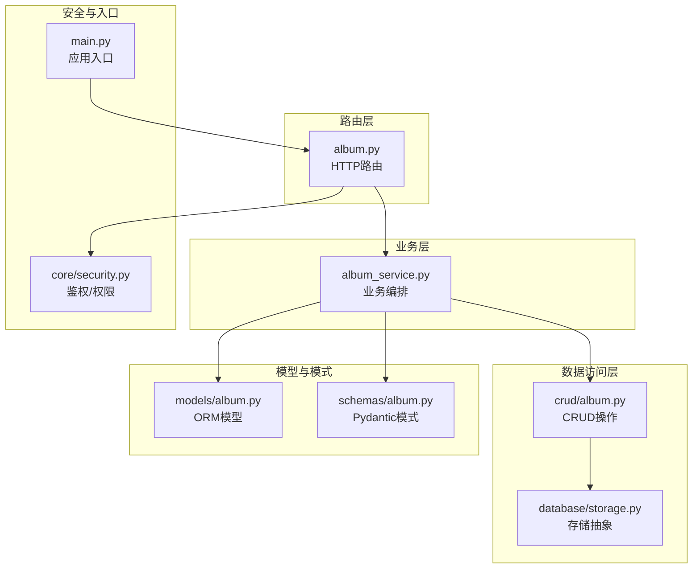
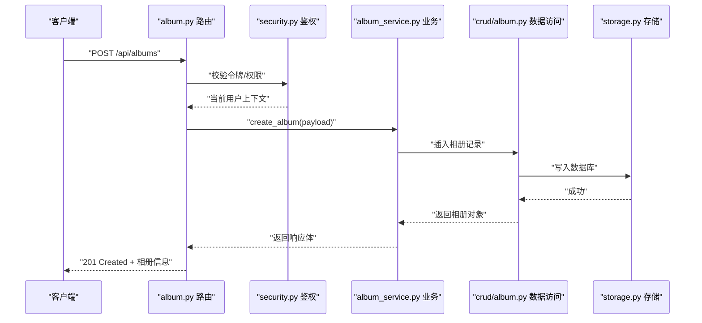
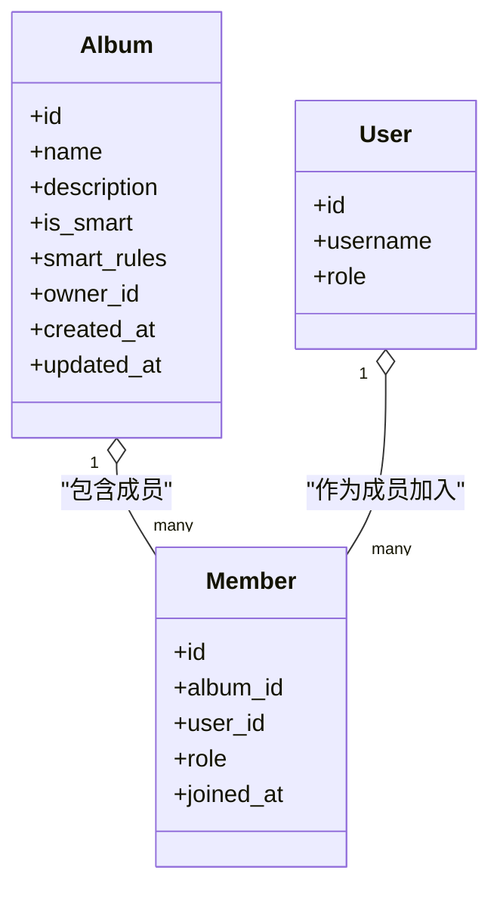
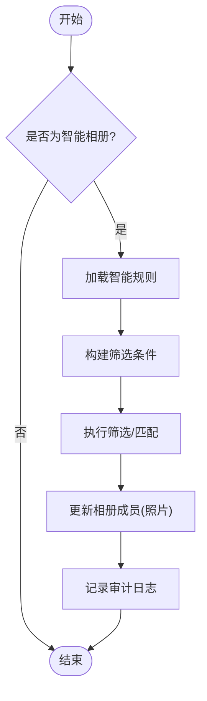
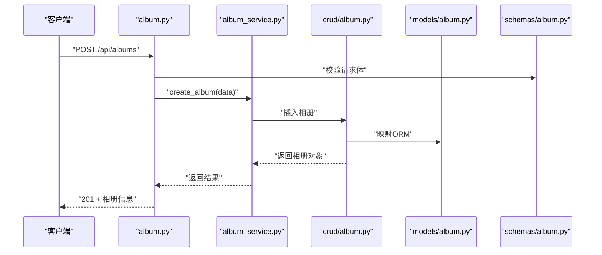
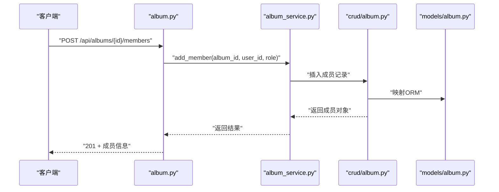
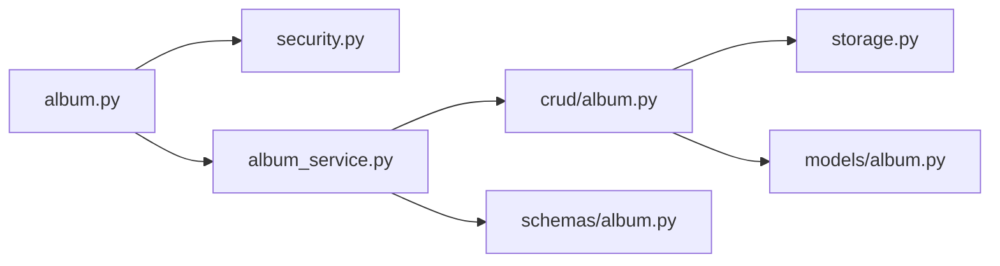

# 相册管理接口

<cite>
**本文引用的文件**   
- [backend/app/api/album.py](file://backend/app/api/album.py)
- [backend/app/crud/album.py](file://backend/app/crud/album.py)
- [backend/app/models/album.py](file://backend/app/models/album.py)
- [backend/app/schemas/album.py](file://backend/app/schemas/album.py)
- [backend/app/services/album_service.py](file://backend/app/services/album_service.py)
- [backend/app/core/security.py](file://backend/app/core/security.py)
- [backend/app/database/storage.py](file://backend/app/database/storage.py)
- [backend/main.py](file://backend/main.py)
</cite>

## 目录
1. [简介](#简介)
2. [项目结构](#项目结构)
3. [核心组件](#核心组件)
4. [架构总览](#架构总览)
5. [详细组件分析](#详细组件分析)
6. [依赖关系分析](#依赖关系分析)
7. [性能考虑](#性能考虑)
8. [故障排查指南](#故障排查指南)
9. [结论](#结论)
10. [附录](#附录)

## 简介
本文件面向后端与前端开发者，系统化梳理“相册管理”相关API：包括相册的创建、编辑、删除、成员管理、智能相册等能力；说明权限控制与共享机制；给出请求/响应示例与数据结构定义；并提供组织最佳实践与性能优化建议。文档以实际源码为依据，确保可追溯与可落地。

## 项目结构
相册功能在后端采用分层设计：路由层（API）、业务层（Service）、数据访问层（CRUD）、模型与模式定义（Models/Schemas），并通过安全模块进行鉴权与权限校验。

图表来源
- [backend/app/api/album.py](file://backend/app/api/album.py)
- [backend/app/services/album_service.py](file://backend/app/services/album_service.py)
- [backend/app/crud/album.py](file://backend/app/crud/album.py)
- [backend/app/database/storage.py](file://backend/app/database/storage.py)
- [backend/app/models/album.py](file://backend/app/models/album.py)
- [backend/app/schemas/album.py](file://backend/app/schemas/album.py)
- [backend/app/core/security.py](file://backend/app/core/security.py)
- [backend/main.py](file://backend/main.py)

章节来源
- [backend/app/api/album.py](file://backend/app/api/album.py)
- [backend/app/services/album_service.py](file://backend/app/services/album_service.py)
- [backend/app/crud/album.py](file://backend/app/crud/album.py)
- [backend/app/models/album.py](file://backend/app/models/album.py)
- [backend/app/schemas/album.py](file://backend/app/schemas/album.py)
- [backend/app/core/security.py](file://backend/app/core/security.py)
- [backend/main.py](file://backend/main.py)

## 核心组件
- 路由层（API）
  - 提供相册增删改查、成员管理、智能相册配置等HTTP端点。
  - 使用安全中间件进行认证与权限校验。
- 业务服务（AlbumService）
  - 编排相册生命周期、成员变更、智能相册规则计算与更新。
- 数据访问（CRUD）
  - 封装相册与成员的持久化操作，统一事务边界。
- 模型与模式
  - ORM模型描述数据库表结构与关系。
  - Pydantic模式用于请求/响应数据校验与序列化。
- 安全模块
  - 负责用户身份解析、角色/权限判定、资源访问控制。
- 存储抽象
  - 为相册元数据与媒体文件提供统一的存储接口。

章节来源
- [backend/app/api/album.py](file://backend/app/api/album.py)
- [backend/app/services/album_service.py](file://backend/app/services/album_service.py)
- [backend/app/crud/album.py](file://backend/app/crud/album.py)
- [backend/app/models/album.py](file://backend/app/models/album.py)
- [backend/app/schemas/album.py](file://backend/app/schemas/album.py)
- [backend/app/core/security.py](file://backend/app/core/security.py)
- [backend/app/database/storage.py](file://backend/app/database/storage.py)

## 架构总览
下图展示一次“创建相册”的典型调用链：客户端通过HTTP发起请求，路由层解析参数并调用业务服务，业务服务协调CRUD与模型/模式，最终落库并返回结果。

图表来源
- [backend/app/api/album.py](file://backend/app/api/album.py)
- [backend/app/core/security.py](file://backend/app/core/security.py)
- [backend/app/services/album_service.py](file://backend/app/services/album_service.py)
- [backend/app/crud/album.py](file://backend/app/crud/album.py)
- [backend/app/database/storage.py](file://backend/app/database/storage.py)

## 详细组件分析

### 相册实体与关系（类图）

图表来源
- [backend/app/models/album.py](file://backend/app/models/album.py)

章节来源
- [backend/app/models/album.py](file://backend/app/models/album.py)

### 请求/响应模式（Schema）
- 请求/响应均基于Pydantic模式进行校验与序列化，字段类型、必填项与默认值在模式中明确定义。
- 典型模式包括：
  - 相册创建/更新请求体
  - 相册列表查询参数（分页、过滤）
  - 成员添加/移除请求体
  - 智能相册规则配置
  - 通用响应包装（状态码、消息、数据）

章节来源
- [backend/app/schemas/album.py](file://backend/app/schemas/album.py)

### HTTP API 规范

#### 通用约定
- 基础路径：/api/albums
- 认证：需携带有效令牌（由安全模块校验）
- 权限：仅相册所有者或具备相应角色的成员可执行写操作
- 错误码：
  - 401 未认证
  - 403 无权限
  - 404 资源不存在
  - 422 请求校验失败
  - 500 服务器内部错误

#### 1) 创建相册
- 方法：POST
- URL：/api/albums
- 请求体：包含名称、描述、是否智能相册、智能规则（可选）等字段
- 响应：返回新建相册的完整信息（含ID、时间戳等）

章节来源
- [backend/app/api/album.py](file://backend/app/api/album.py)
- [backend/app/schemas/album.py](file://backend/app/schemas/album.py)

#### 2) 获取相册详情
- 方法：GET
- URL：/api/albums/{album_id}
- 路径参数：album_id
- 响应：返回相册详细信息（含成员列表、是否智能、规则等）

章节来源
- [backend/app/api/album.py](file://backend/app/api/album.py)
- [backend/app/schemas/album.py](file://backend/app/schemas/album.py)

#### 3) 更新相册
- 方法：PUT/PATCH
- URL：/api/albums/{album_id}
- 路径参数：album_id
- 请求体：可更新的字段（如名称、描述、智能规则等）
- 响应：返回更新后的相册信息

章节来源
- [backend/app/api/album.py](file://backend/app/api/album.py)
- [backend/app/schemas/album.py](file://backend/app/schemas/album.py)

#### 4) 删除相册
- 方法：DELETE
- URL：/api/albums/{album_id}
- 路径参数：album_id
- 响应：返回删除确认或空体

章节来源
- [backend/app/api/album.py](file://backend/app/api/album.py)

#### 5) 列出相册（分页/过滤）
- 方法：GET
- URL：/api/albums
- 查询参数：页码、每页数量、按所有者/标签/智能标记过滤等
- 响应：返回相册列表及分页元信息

章节来源
- [backend/app/api/album.py](file://backend/app/api/album.py)
- [backend/app/schemas/album.py](file://backend/app/schemas/album.py)

#### 6) 成员管理
- 添加成员
  - 方法：POST
  - URL：/api/albums/{album_id}/members
  - 路径参数：album_id
  - 请求体：用户标识、角色
  - 响应：返回成员信息
- 移除成员
  - 方法：DELETE
  - URL：/api/albums/{album_id}/members/{user_id}
  - 路径参数：album_id, user_id
  - 响应：返回确认
- 更新成员角色
  - 方法：PUT/PATCH
  - URL：/api/albums/{album_id}/members/{user_id}
  - 路径参数：album_id, user_id
  - 请求体：新角色
  - 响应：返回更新后的成员信息
- 列出成员
  - 方法：GET
  - URL：/api/albums/{album_id}/members
  - 路径参数：album_id
  - 响应：返回成员列表

章节来源
- [backend/app/api/album.py](file://backend/app/api/album.py)
- [backend/app/schemas/album.py](file://backend/app/schemas/album.py)

#### 7) 智能相册
- 开启/关闭智能相册
  - 方法：PATCH
  - URL：/api/albums/{album_id}/smart
  - 路径参数：album_id
  - 请求体：开关标志
  - 响应：返回最新配置
- 设置智能规则
  - 方法：PATCH
  - URL：/api/albums/{album_id}/smart/rules
  - 路径参数：album_id
  - 请求体：规则集合（如标签、时间范围、地点、人脸等条件）
  - 响应：返回已保存的规则
- 触发重新计算
  - 方法：POST
  - URL：/api/albums/{album_id}/smart/recalculate
  - 路径参数：album_id
  - 响应：返回任务ID或执行结果

章节来源
- [backend/app/api/album.py](file://backend/app/api/album.py)
- [backend/app/services/album_service.py](file://backend/app/services/album_service.py)
- [backend/app/schemas/album.py](file://backend/app/schemas/album.py)

### 权限控制与共享机制
- 认证：所有写操作需携带有效令牌，由安全模块解析用户上下文。
- 授权：
  - 所有者：拥有全部权限（读/写/管理成员/修改智能规则）。
  - 成员：根据角色决定读写权限（例如只读、可编辑、管理员）。
  - 非成员：默认不可见或仅可见公开相册（若实现）。
- 共享：通过成员表维护相册与用户的关联，支持多对多关系与角色区分。

章节来源
- [backend/app/core/security.py](file://backend/app/core/security.py)
- [backend/app/models/album.py](file://backend/app/models/album.py)
- [backend/app/api/album.py](file://backend/app/api/album.py)

### 智能相册规则与处理流程
智能相册通过规则引擎动态筛选照片，规则可组合多个条件（如标签、时间、地点、人脸等）。当规则变更或新增照片时，系统会触发重新计算。

图表来源
- [backend/app/services/album_service.py](file://backend/app/services/album_service.py)
- [backend/app/crud/album.py](file://backend/app/crud/album.py)

章节来源
- [backend/app/services/album_service.py](file://backend/app/services/album_service.py)
- [backend/app/crud/album.py](file://backend/app/crud/album.py)

### 关键业务流程时序

#### 创建相册（含可选智能规则）

图表来源
- [backend/app/api/album.py](file://backend/app/api/album.py)
- [backend/app/services/album_service.py](file://backend/app/services/album_service.py)
- [backend/app/crud/album.py](file://backend/app/crud/album.py)
- [backend/app/models/album.py](file://backend/app/models/album.py)
- [backend/app/schemas/album.py](file://backend/app/schemas/album.py)

#### 成员管理（添加成员）

图表来源
- [backend/app/api/album.py](file://backend/app/api/album.py)
- [backend/app/services/album_service.py](file://backend/app/services/album_service.py)
- [backend/app/crud/album.py](file://backend/app/crud/album.py)
- [backend/app/models/album.py](file://backend/app/models/album.py)

## 依赖关系分析
- 路由层依赖安全模块进行鉴权，依赖业务服务完成具体逻辑。
- 业务服务依赖CRUD与模型/模式，必要时调用存储服务。
- CRU D层依赖数据库存储抽象，屏蔽底层差异。
- 整体耦合度适中，职责清晰，便于扩展与维护。

图表来源
- [backend/app/api/album.py](file://backend/app/api/album.py)
- [backend/app/core/security.py](file://backend/app/core/security.py)
- [backend/app/services/album_service.py](file://backend/app/services/album_service.py)
- [backend/app/crud/album.py](file://backend/app/crud/album.py)
- [backend/app/schemas/album.py](file://backend/app/schemas/album.py)
- [backend/app/database/storage.py](file://backend/app/database/storage.py)
- [backend/app/models/album.py](file://backend/app/models/album.py)

章节来源
- [backend/app/api/album.py](file://backend/app/api/album.py)
- [backend/app/core/security.py](file://backend/app/core/security.py)
- [backend/app/services/album_service.py](file://backend/app/services/album_service.py)
- [backend/app/crud/album.py](file://backend/app/crud/album.py)
- [backend/app/schemas/album.py](file://backend/app/schemas/album.py)
- [backend/app/database/storage.py](file://backend/app/database/storage.py)
- [backend/app/models/album.py](file://backend/app/models/album.py)

## 性能考虑
- 分页与过滤：列表接口应支持分页与常用过滤条件，避免一次性拉取大量数据。
- 索引优化：对相册ID、所有者ID、成员关联键建立索引，提升查询效率。
- 懒加载：相册详情按需加载成员列表与智能规则，减少首屏开销。
- 异步计算：智能相册规则重算可放入任务队列，避免阻塞主线程。
- 缓存策略：对热点相册元数据与成员列表进行短期缓存，降低数据库压力。
- 批量操作：成员批量添加/移除尽量使用批量接口，减少往返次数。

[本节为通用指导，不直接分析具体文件]

## 故障排查指南
- 401 未认证：检查令牌是否过期或缺失，确认安全模块是否正确挂载。
- 403 无权限：确认当前用户对目标相册是否具有所需角色。
- 404 资源不存在：核对相册ID与成员ID是否存在。
- 422 请求校验失败：依据Pydantic模式的错误提示修正请求体字段。
- 500 服务器错误：查看服务端日志，定位异常堆栈与服务层错误。

章节来源
- [backend/app/core/security.py](file://backend/app/core/security.py)
- [backend/app/schemas/album.py](file://backend/app/schemas/album.py)

## 结论
相册管理API围绕“创建/更新/删除/查询/成员管理/智能相册”形成完整闭环，配合安全模块与清晰的层次划分，具备良好的可扩展性与可维护性。建议在后续迭代中持续完善分页与过滤、引入异步任务与缓存策略，以提升用户体验与系统吞吐。

[本节为总结性内容，不直接分析具体文件]

## 附录

### 请求/响应示例（路径引用）
- 创建相册请求体与响应体结构参考：
  - [backend/app/schemas/album.py](file://backend/app/schemas/album.py)
- 成员管理请求体与响应体结构参考：
  - [backend/app/schemas/album.py](file://backend/app/schemas/album.py)
- 智能相册规则配置参考：
  - [backend/app/schemas/album.py](file://backend/app/schemas/album.py)
- 路由定义与调用顺序参考：
  - [backend/app/api/album.py](file://backend/app/api/album.py)

### 最佳实践
- 命名规范：相册名称简洁明确，描述补充背景信息。
- 权限最小化：仅授予必要角色，定期审查成员列表。
- 智能规则：保持规则简洁可解释，避免过度复杂导致性能问题。
- 版本兼容：对模式变更保持向后兼容，逐步迁移旧客户端。

[本节为通用指导，不直接分析具体文件]