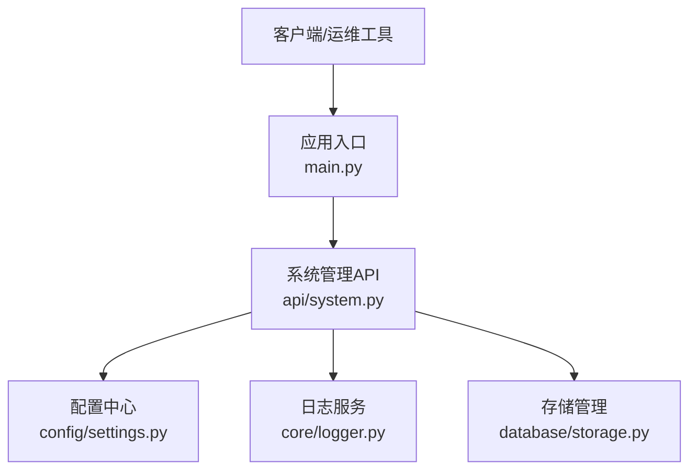
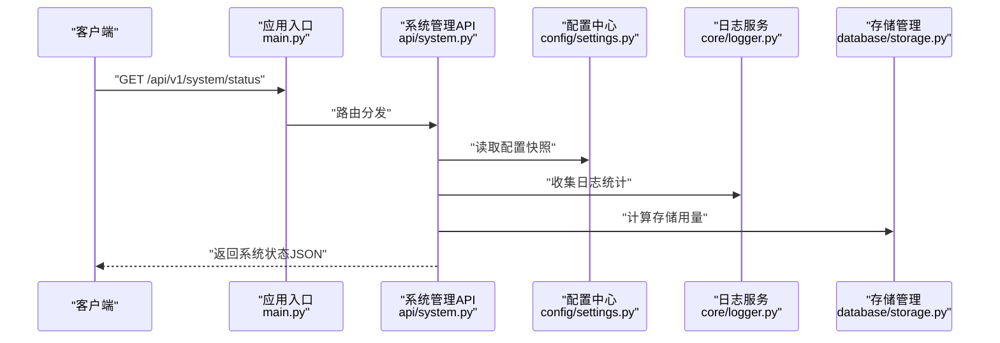
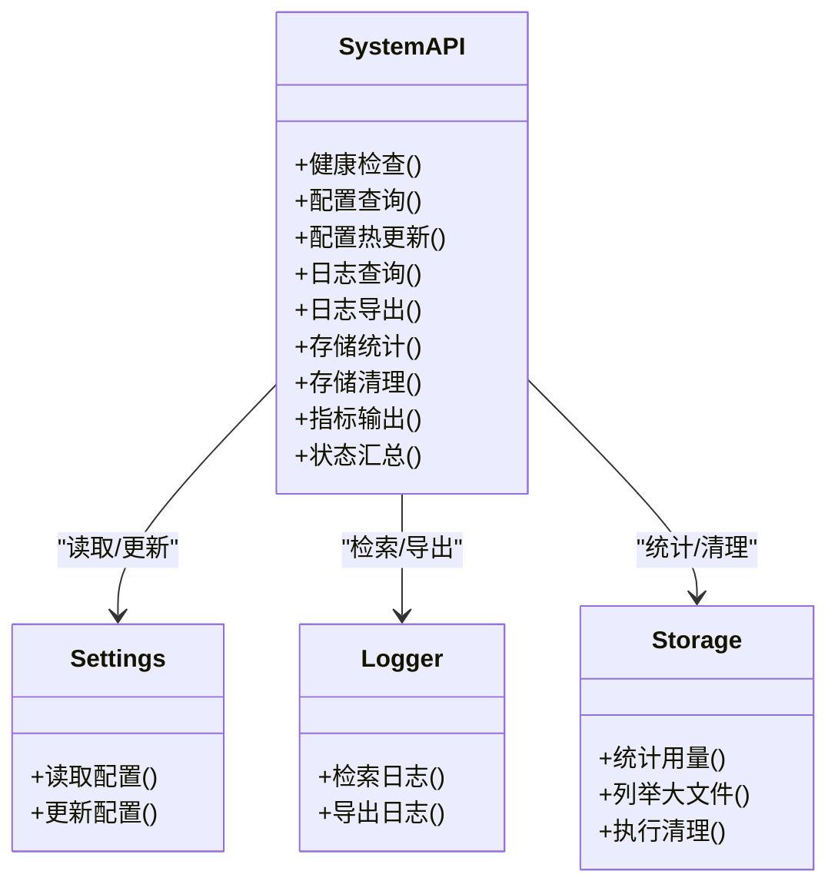

# 系统管理接口

<cite>
**本文引用的文件**   
- [backend/app/api/system.py](file://backend/app/api/system.py)
- [backend/app/config/settings.py](file://backend/app/config/settings.py)
- [backend/app/core/logger.py](file://backend/app/core/logger.py)
- [backend/app/database/storage.py](file://backend/app/database/storage.py)
- [backend/main.py](file://backend/main.py)
</cite>

## 目录
1. [简介](#简介)
2. [项目结构](#项目结构)
3. [核心组件](#核心组件)
4. [架构总览](#架构总览)
5. [详细组件分析](#详细组件分析)
6. [依赖分析](#依赖分析)
7. [性能考虑](#性能考虑)
8. [故障诊断指南](#故障诊断指南)
9. [结论](#结论)
10. [附录](#附录) 

## 简介
本文件面向运维与平台管理员，系统化梳理并记录“系统管理”相关API接口，覆盖以下能力：
- 系统配置查询与热更新
- 健康检查（存活/就绪）
- 日志查询与导出
- 存储管理（容量、使用率、清理策略等）
- 监控指标与资源使用情况
- 请求/响应示例与字段说明
- 常见故障定位与排障建议

## 项目结构
后端采用模块化分层设计，系统管理相关接口集中在 API 层，并通过配置、日志、存储等子系统完成具体实现。

图表来源
- [backend/main.py](file://backend/main.py)
- [backend/app/api/system.py](file://backend/app/api/system.py)
- [backend/app/config/settings.py](file://backend/app/config/settings.py)
- [backend/app/core/logger.py](file://backend/app/core/logger.py)
- [backend/app/database/storage.py](file://backend/app/database/storage.py)

章节来源
- [backend/main.py](file://backend/main.py)
- [backend/app/api/system.py](file://backend/app/api/system.py)

## 核心组件
- 系统管理API：提供统一的HTTP端点，封装配置、健康、日志、存储、指标等能力。
- 配置中心：集中管理运行时配置项，支持读取与热更新。
- 日志服务：提供日志级别控制、按时间范围检索、滚动与导出。
- 存储管理：统计磁盘/对象存储用量、列出大文件、执行清理任务。
- 监控指标：暴露系统运行指标（CPU、内存、磁盘、队列等）。

章节来源
- [backend/app/api/system.py](file://backend/app/api/system.py)
- [backend/app/config/settings.py](file://backend/app/config/settings.py)
- [backend/app/core/logger.py](file://backend/app/core/logger.py)
- [backend/app/database/storage.py](file://backend/app/database/storage.py)

## 架构总览
下图展示一次典型“获取系统状态”的调用链路，从HTTP入口到各子系统的协作过程。

图表来源
- [backend/main.py](file://backend/main.py)
- [backend/app/api/system.py](file://backend/app/api/system.py)
- [backend/app/config/settings.py](file://backend/app/config/settings.py)
- [backend/app/core/logger.py](file://backend/app/core/logger.py)
- [backend/app/database/storage.py](file://backend/app/database/storage.py)

## 详细组件分析

### 健康检查接口
- 目的：用于负载均衡与健康探针，区分存活与就绪两种状态。
- 端点与方法
  - GET /api/v1/system/healthz：存活检查（进程是否可响应）
  - GET /api/v1/system/readyz：就绪检查（依赖是否可用）
- 请求参数
  - 无
- 响应格式
  - 通用成功体：包含状态码、消息、时间戳
  - 健康检查体：包含状态、检查项明细（如数据库、存储、外部依赖）
- 错误处理
  - 未就绪时返回非2xx状态码，并在响应体中给出失败原因
- 示例
  - 请求示例：GET /api/v1/system/healthz
  - 响应示例：{ "status": "ok", "timestamp": "2024-01-01T00:00:00Z" }
  - 就绪失败示例：{ "status": "degraded", "checks": { "db": "error", "storage": "ok" } }

章节来源
- [backend/app/api/system.py](file://backend/app/api/system.py)

### 系统配置接口
- 目的：查询当前配置；按需进行热更新（部分配置项）。
- 端点与方法
  - GET /api/v1/system/config：获取配置快照
  - PUT /api/v1/system/config：热更新配置（受白名单保护）
- 请求参数
  - GET：无
  - PUT：JSON Body，包含待更新的键值对
- 响应格式
  - 配置快照：扁平或分层的键值结构
  - 热更新结果：操作结果、受影响模块、生效时间
- 安全与权限
  - 仅允许具备管理员角色的用户访问
- 示例
  - 请求示例：PUT /api/v1/system/config
  - 响应示例：{ "updated": true, "keys": ["log.level","storage.max_size"], "effective_at": "immediate" }

章节来源
- [backend/app/api/system.py](file://backend/app/api/system.py)
- [backend/app/config/settings.py](file://backend/app/config/settings.py)

### 日志查询接口
- 目的：按条件检索日志，支持级别过滤、时间范围、关键字匹配与分页。
- 端点与方法
  - GET /api/v1/system/logs：查询日志
  - POST /api/v1/system/logs/export：导出日志（异步任务）
- 请求参数
  - 查询：query 参数（level、start_time、end_time、keyword、page、size）
  - 导出：JSON Body（导出范围、目标格式、通知回调）
- 响应格式
  - 列表：分页数据，包含条目数组、总数、页码
  - 导出：任务ID与预计完成时间
- 示例
  - 请求示例：GET /api/v1/system/logs?level=error&start_time=...&end_time=...
  - 响应示例：{ "items": [...], "total": 120, "page": 1, "size": 20 }

章节来源
- [backend/app/api/system.py](file://backend/app/api/system.py)
- [backend/app/core/logger.py](file://backend/app/core/logger.py)

### 存储管理接口
- 目的：查看存储用量、空间分布、大文件清单，以及触发清理任务。
- 端点与方法
  - GET /api/v1/system/storage/stats：存储统计
  - GET /api/v1/system/storage/files：大文件列表
  - POST /api/v1/system/storage/cleanup：执行清理（需确认）
- 请求参数
  - 统计：无
  - 大文件：可选阈值、排序字段
  - 清理：JSON Body（策略、保留规则、dry_run）
- 响应格式
  - 统计：总量、已用、剩余、使用率、分区/桶信息
  - 大文件：文件路径、大小、创建时间、所属模块
  - 清理：任务ID、预估耗时、影响范围
- 示例
  - 请求示例：POST /api/v1/system/storage/cleanup
  - 响应示例：{ "task_id": "...", "estimated_minutes": 5, "scope": "temp,thumbnails" }

章节来源
- [backend/app/api/system.py](file://backend/app/api/system.py)
- [backend/app/database/storage.py](file://backend/app/database/storage.py)

### 监控指标接口
- 目的：暴露系统运行指标，供Prometheus/Grafana等采集。
- 端点与方法
  - GET /api/v1/system/metrics：文本格式指标
- 请求参数
  - 无
- 响应格式
  - Prometheus兼容文本格式，包含CPU、内存、磁盘、队列长度、请求延迟等
- 示例
  - 请求示例：GET /api/v1/system/metrics
  - 响应示例：首行以注释开头，随后为指标名与数值

章节来源
- [backend/app/api/system.py](file://backend/app/api/system.py)

### 系统状态接口
- 目的：聚合系统关键状态，便于快速巡检。
- 端点与方法
  - GET /api/v1/system/status：系统状态汇总
- 请求参数
  - 无
- 响应格式
  - 包含版本、启动时间、运行时长、依赖状态、资源概览
- 示例
  - 请求示例：GET /api/v1/system/status
  - 响应示例：{ "version": "x.y.z", "uptime_seconds": 12345, "dependencies": { "db": "ok", "storage": "ok" }, "resources": { "cpu_percent": 12.3, "memory_percent": 45.6 } }

章节来源
- [backend/app/api/system.py](file://backend/app/api/system.py)

## 依赖分析
系统管理API依赖配置、日志、存储三个子系统，整体耦合度低、职责清晰。

图表来源
- [backend/app/api/system.py](file://backend/app/api/system.py)
- [backend/app/config/settings.py](file://backend/app/config/settings.py)
- [backend/app/core/logger.py](file://backend/app/core/logger.py)
- [backend/app/database/storage.py](file://backend/app/database/storage.py)

章节来源
- [backend/app/api/system.py](file://backend/app/api/system.py)

## 性能考虑
- 缓存策略：配置快照与系统状态建议在内存中缓存，设置合理过期时间，避免频繁IO。
- 日志查询：默认限制最大返回条数与时间窗口，防止全表扫描导致超时。
- 存储统计：对大文件列表与清理任务采用异步化，避免阻塞主线程。
- 指标输出：保持轻量，避免在指标端点执行重计算。

[本节为通用指导，不直接分析具体文件]

## 故障诊断指南
- 健康检查异常
  - 现象：/readyz 返回非2xx
  - 排查：检查数据库连接、存储可用性、外部依赖
  - 参考：健康检查实现与依赖探测逻辑
- 配置热更新无效
  - 现象：更新后未生效
  - 排查：确认键名是否在白名单、权限是否足够、是否需要重启特定模块
  - 参考：配置更新流程与校验逻辑
- 日志查询缓慢
  - 现象：查询超时或响应慢
  - 排查：缩小时间范围、增加索引、限制关键字复杂度
  - 参考：日志检索实现
- 存储清理误删
  - 现象：重要文件被清理
  - 排查：核对清理策略与保留规则，先启用 dry_run 验证
  - 参考：存储清理实现

章节来源
- [backend/app/api/system.py](file://backend/app/api/system.py)
- [backend/app/config/settings.py](file://backend/app/config/settings.py)
- [backend/app/core/logger.py](file://backend/app/core/logger.py)
- [backend/app/database/storage.py](file://backend/app/database/storage.py)

## 结论
系统管理接口围绕“可观测、可配置、可维护”的目标，提供健康检查、配置热更新、日志查询、存储管理与监控指标等能力。通过清晰的职责划分与低耦合设计，便于扩展与维护。建议在生产环境结合告警与自动化脚本，提升运维效率与稳定性。

[本节为总结性内容，不直接分析具体文件]

## 附录

### 统一响应格式
- 成功响应
  - 字段：code、message、data、timestamp
- 错误响应
  - 字段：code、message、details（可选）

[本节为通用约定，不直接分析具体文件]

### 常用运维命令与场景
- 快速巡检：调用状态与指标接口，观察资源与依赖
- 容量治理：定期查看存储统计与大文件，制定清理策略
- 问题回溯：按时间范围与关键字检索日志，定位根因
- 配置变更：灰度调整关键参数，观察健康与指标变化

[本节为通用实践，不直接分析具体文件]