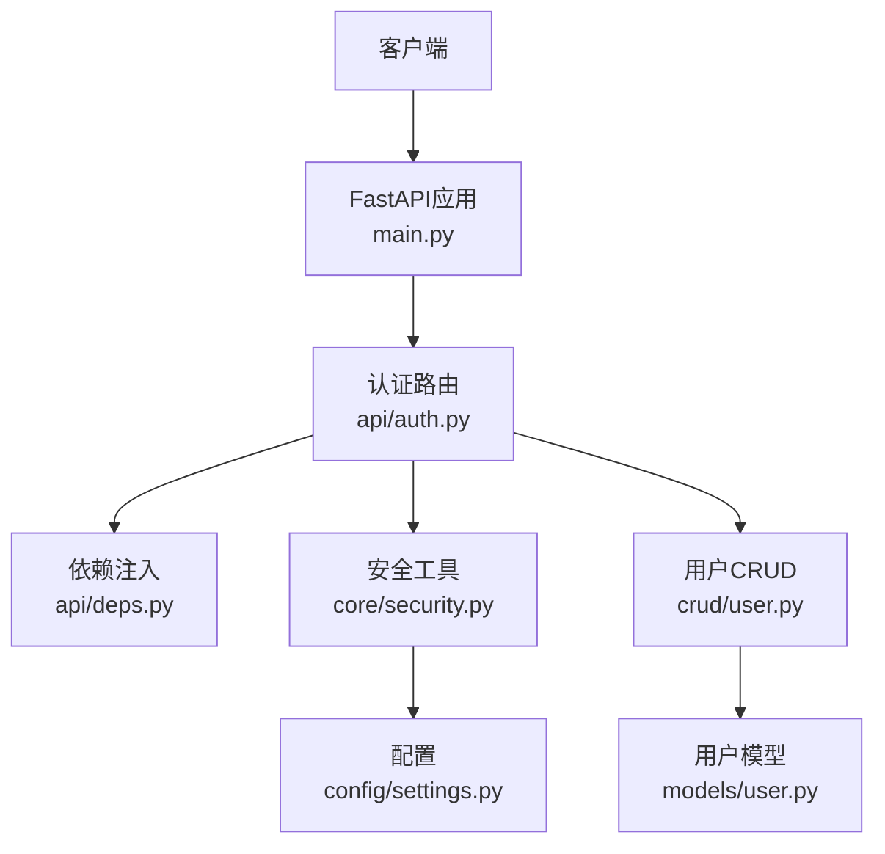
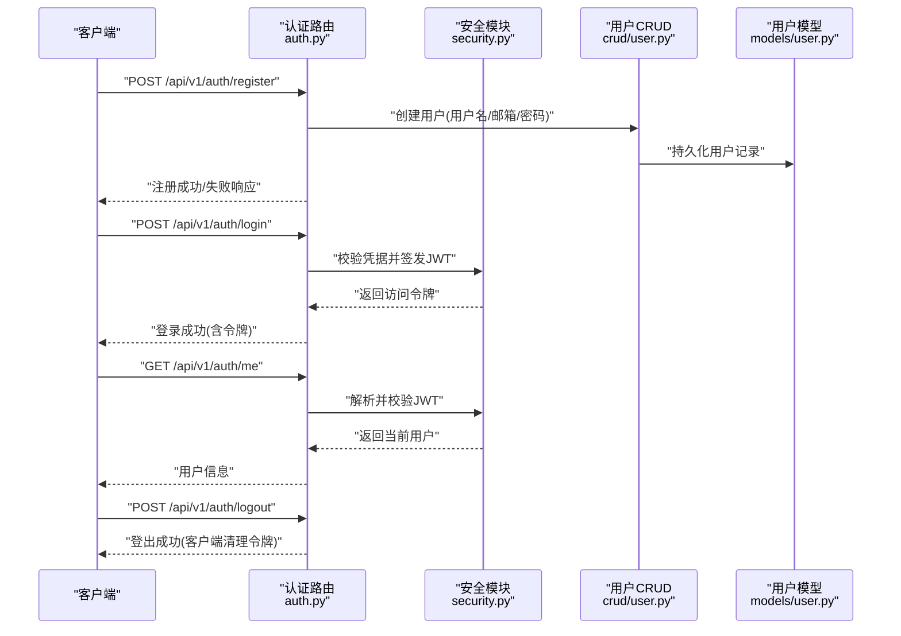
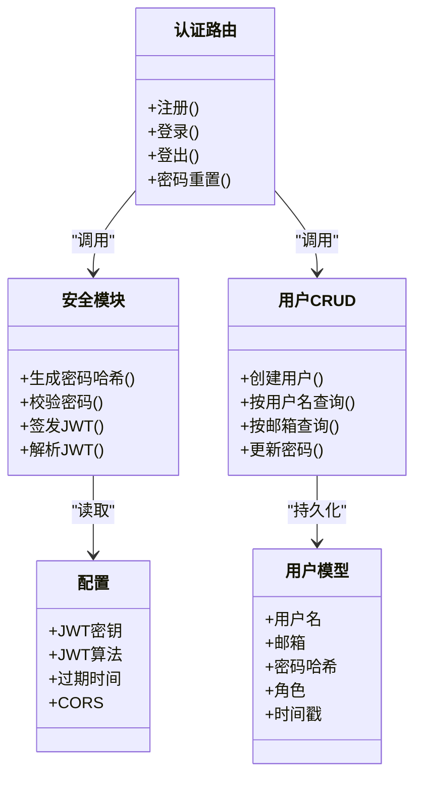

# 认证接口

<cite>
**本文引用的文件**   
- [backend/app/api/auth.py](file://backend/app/api/auth.py)
- [backend/app/crud/user.py](file://backend/app/crud/user.py)
- [backend/app/models/user.py](file://backend/app/models/user.py)
- [backend/app/schemas/user.py](file://backend/app/schemas/user.py)
- [backend/app/core/security.py](file://backend/app/core/security.py)
- [backend/app/api/deps.py](file://backend/app/api/deps.py)
- [backend/app/config/settings.py](file://backend/app/config/settings.py)
- [backend/main.py](file://backend/main.py)
</cite>

## 目录
1. [简介](#简介)
2. [项目结构](#项目结构)
3. [核心组件](#核心组件)
4. [架构总览](#架构总览)
5. [详细组件分析](#详细组件分析)
6. [依赖关系分析](#依赖关系分析)
7. [性能考虑](#性能考虑)
8. [故障排查指南](#故障排查指南)
9. [结论](#结论)
10. [附录](#附录)

## 简介
本文件面向后端开发者与集成方，系统化梳理用户认证相关API：注册、登录、登出、密码重置等。文档涵盖HTTP方法、URL模式、请求参数、响应格式、JWT令牌机制、会话管理、权限验证流程，并提供错误处理说明与安全性最佳实践。

## 项目结构
认证能力由以下模块协同实现：
- API层：路由定义与请求/响应校验
- 业务层：CRUD操作（用户增删改查）
- 数据模型：数据库ORM映射
- 安全模块：密码哈希、JWT签发与校验、依赖注入
- 配置：密钥、过期时间、CORS等

图表来源
- [backend/main.py](file://backend/main.py)
- [backend/app/api/auth.py](file://backend/app/api/auth.py)
- [backend/app/api/deps.py](file://backend/app/api/deps.py)
- [backend/app/core/security.py](file://backend/app/core/security.py)
- [backend/app/crud/user.py](file://backend/app/crud/user.py)
- [backend/app/models/user.py](file://backend/app/models/user.py)
- [backend/app/config/settings.py](file://backend/app/config/settings.py)

章节来源
- [backend/main.py](file://backend/main.py)
- [backend/app/api/auth.py](file://backend/app/api/auth.py)
- [backend/app/api/deps.py](file://backend/app/api/deps.py)
- [backend/app/core/security.py](file://backend/app/core/security.py)
- [backend/app/crud/user.py](file://backend/app/crud/user.py)
- [backend/app/models/user.py](file://backend/app/models/user.py)
- [backend/app/config/settings.py](file://backend/app/config/settings.py)

## 核心组件
- 认证路由：提供注册、登录、登出、密码重置等端点，负责入参校验与返回统一响应体。
- 安全模块：负责密码哈希与校验、JWT签发与解析、访问令牌提取与鉴权中间件。
- 用户CRUD：封装用户的创建、查询、更新等操作。
- 用户模型：定义用户表结构与字段约束。
- 配置：集中管理JWT密钥、过期时间、安全策略等。

章节来源
- [backend/app/api/auth.py](file://backend/app/api/auth.py)
- [backend/app/core/security.py](file://backend/app/core/security.py)
- [backend/app/crud/user.py](file://backend/app/crud/user.py)
- [backend/app/models/user.py](file://backend/app/models/user.py)
- [backend/app/config/settings.py](file://backend/app/config/settings.py)

## 架构总览
认证流程采用无状态JWT方案：
- 登录成功后服务端签发JWT（包含用户标识与必要声明），客户端保存并在后续请求中携带。
- 受保护接口通过依赖注入获取当前用户上下文，完成权限校验。
- 登出为客户端侧销毁本地令牌；服务端不维护会话状态。

图表来源
- [backend/app/api/auth.py](file://backend/app/api/auth.py)
- [backend/app/core/security.py](file://backend/app/core/security.py)
- [backend/app/crud/user.py](file://backend/app/crud/user.py)
- [backend/app/models/user.py](file://backend/app/models/user.py)

## 详细组件分析

### 认证路由（注册、登录、登出、密码重置）
- 注册
  - 方法：POST
  - URL：/api/v1/auth/register
  - 请求体：用户名、邮箱、密码（遵循用户Schema校验规则）
  - 响应：注册结果（成功返回用户基本信息或提示；失败返回错误码与消息）
- 登录
  - 方法：POST
  - URL：/api/v1/auth/login
  - 请求体：用户名或邮箱、密码
  - 响应：登录成功返回访问令牌（JWT）及必要元信息；失败返回错误码与消息
- 登出
  - 方法：POST
  - URL：/api/v1/auth/logout
  - 说明：服务端无状态登出，主要指示客户端清除本地令牌
  - 响应：登出成功
- 密码重置
  - 方法：POST
  - URL：/api/v1/auth/reset-password
  - 请求体：邮箱（或用户名）、新密码（可结合验证码/令牌，视具体实现）
  - 响应：重置成功或失败

注意：
- 所有接口均使用JSON内容类型。
- 受保护接口需在请求头中携带Authorization: Bearer <token>。

章节来源
- [backend/app/api/auth.py](file://backend/app/api/auth.py)

### 安全模块（JWT与密码）
- 密码处理
  - 生成密码哈希用于存储
  - 校验明文密码与哈希是否匹配
- JWT签发与校验
  - 签发：基于用户标识与配置中的密钥、算法、过期时间生成访问令牌
  - 解析：从请求头中提取Bearer令牌，校验签名与有效期，反序列化为当前用户上下文
- 依赖注入
  - 提供“当前用户”依赖，供受保护路由快速获得已认证用户对象

章节来源
- [backend/app/core/security.py](file://backend/app/core/security.py)
- [backend/app/api/deps.py](file://backend/app/api/deps.py)

### 用户CRUD与模型
- 用户CRUD
  - 创建用户：写入数据库前进行唯一性校验（用户名/邮箱）
  - 查询用户：按用户名或邮箱查找
  - 更新用户：支持密码更新等
- 用户模型
  - 字段：用户名、邮箱、密码哈希、角色/权限、时间戳等
  - 约束：唯一性、非空、长度限制等

章节来源
- [backend/app/crud/user.py](file://backend/app/crud/user.py)
- [backend/app/models/user.py](file://backend/app/models/user.py)

### 配置项（JWT与安全）
- JWT密钥与算法：用于签发与校验令牌
- 过期时间：访问令牌有效期
- CORS设置：跨域白名单
- 其他安全策略：如最小密码强度、速率限制等

章节来源
- [backend/app/config/settings.py](file://backend/app/config/settings.py)

## 依赖关系分析

图表来源
- [backend/app/api/auth.py](file://backend/app/api/auth.py)
- [backend/app/core/security.py](file://backend/app/core/security.py)
- [backend/app/crud/user.py](file://backend/app/crud/user.py)
- [backend/app/models/user.py](file://backend/app/models/user.py)
- [backend/app/config/settings.py](file://backend/app/config/settings.py)

## 性能考虑
- 密码哈希计算开销较大，建议在生产环境合理调整工作因子，避免过高导致延迟。
- JWT为无状态，适合水平扩展；但需确保密钥轮换策略与短期过期时间以控制风险。
- 登录与注册接口应配合限流与验证码，防止暴力破解与滥用。
- 数据库索引优化：对用户名、邮箱建立唯一索引以提升查询性能。

[本节为通用指导，无需代码来源]

## 故障排查指南
常见错误与定位要点：
- 401 未授权
  - 可能原因：缺少Authorization头、令牌过期、签名无效
  - 排查：检查令牌是否正确附加、服务器时间与系统时钟是否同步、JWT密钥是否一致
- 403 禁止访问
  - 可能原因：当前用户无所需权限
  - 排查：确认用户角色与资源权限策略
- 400 请求参数错误
  - 可能原因：必填字段缺失、格式不符、密码强度不足
  - 排查：对照Schema校验规则修正请求体
- 409 冲突
  - 可能原因：用户名或邮箱已存在
  - 排查：更换唯一值或提示用户修改
- 500 内部错误
  - 可能原因：数据库异常、第三方服务不可用
  - 排查：查看服务端日志与数据库连接状态

章节来源
- [backend/app/api/auth.py](file://backend/app/api/auth.py)
- [backend/app/core/security.py](file://backend/app/core/security.py)
- [backend/app/crud/user.py](file://backend/app/crud/user.py)

## 结论
本项目采用无状态JWT认证方案，结合严格的输入校验与依赖注入的权限上下文，实现了清晰的注册、登录、登出与密码重置流程。生产部署时建议强化密钥管理、令牌过期策略、限流与审计日志，以确保认证链路的安全性与稳定性。

[本节为总结，无需代码来源]

## 附录

### 请求/响应示例（示意）
- 注册
  - 请求体示例字段：用户名、邮箱、密码
  - 成功响应：返回用户基本信息（不含敏感字段）
  - 失败响应：错误码与消息
- 登录
  - 请求体示例字段：用户名或邮箱、密码
  - 成功响应：访问令牌（JWT）与过期时间
  - 失败响应：错误码与消息
- 登出
  - 请求体：无
  - 成功响应：登出成功
- 密码重置
  - 请求体示例字段：邮箱（或用户名）、新密码
  - 成功响应：重置成功
  - 失败响应：错误码与消息

[本节为通用示例，无需代码来源]

### 认证状态码参考
- 200 成功
- 201 已创建（注册）
- 400 请求参数错误
- 401 未授权
- 403 禁止访问
- 409 资源冲突（重复注册）
- 500 内部错误

[本节为通用参考，无需代码来源]

### 安全性最佳实践
- 强制HTTPS传输，启用HSTS
- 使用强随机JWT密钥与合适算法，定期轮换
- 设置合理的令牌过期时间，必要时引入刷新令牌机制
- 实施登录/注册限流与验证码防护
- 最小化响应数据，避免泄露敏感信息
- 记录关键审计日志（登录成功/失败、密码重置等）

[本节为通用指导，无需代码来源]