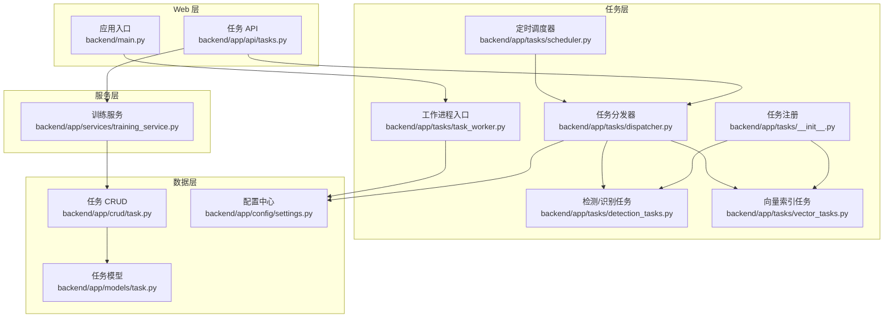
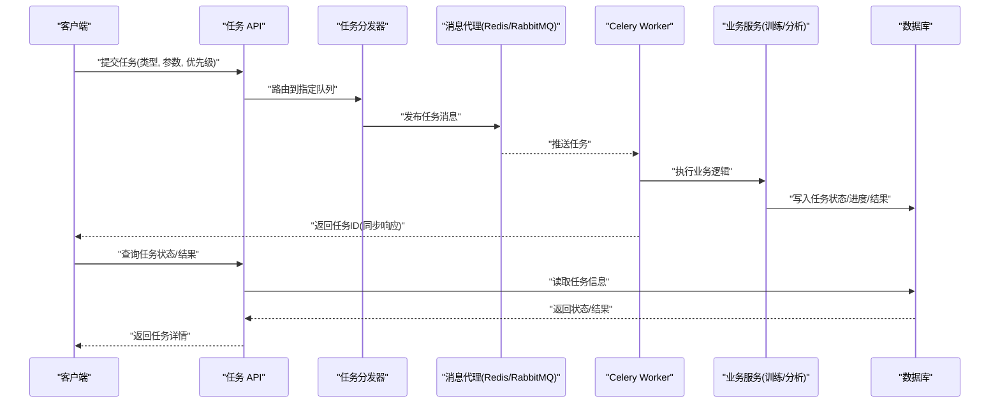
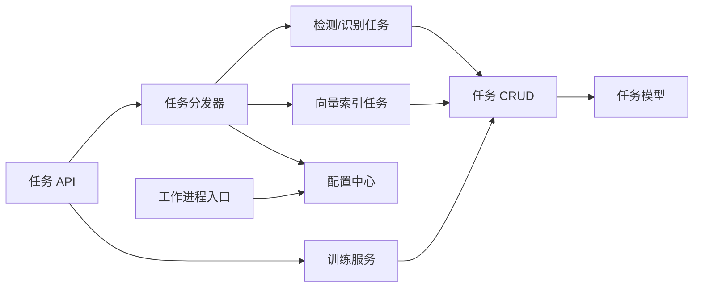

# 任务调度系统

<cite>
**本文引用的文件**   
- [backend/app/tasks/__init__.py](file://backend/app/tasks/__init__.py)
- [backend/app/tasks/dispatcher.py](file://backend/app/tasks/dispatcher.py)
- [backend/app/tasks/scheduler.py](file://backend/app/tasks/scheduler.py)
- [backend/app/tasks/task_worker.py](file://backend/app/tasks/task_worker.py)
- [backend/app/tasks/detection_tasks.py](file://backend/app/tasks/detection_tasks.py)
- [backend/app/tasks/vector_tasks.py](file://backend/app/tasks/vector_tasks.py)
- [backend/app/api/tasks.py](file://backend/app/api/tasks.py)
- [backend/app/services/training_service.py](file://backend/app/services/training_service.py)
- [backend/app/models/task.py](file://backend/app/models/task.py)
- [backend/app/crud/task.py](file://backend/app/crud/task.py)
- [backend/app/config/settings.py](file://backend/app/config/settings.py)
- [backend/main.py](file://backend/main.py)
</cite>

## 目录
1. [简介](#简介)
2. [项目结构](#项目结构)
3. [核心组件](#核心组件)
4. [架构总览](#架构总览)
5. [详细组件分析](#详细组件分析)
6. [依赖关系分析](#依赖关系分析)
7. [性能与资源管理](#性能与资源管理)
8. [监控、进度与错误处理](#监控进度与错误处理)
9. [故障排查指南](#故障排查指南)
10. [结论](#结论)
11. [附录：配置项与最佳实践](#附录配置项与最佳实践)

## 简介
本技术文档围绕基于 Celery 的异步任务调度系统，系统性阐述任务队列配置、工作进程管理与任务分发机制；深入解析照片分析、人脸识别、向量索引与模型训练等任务类型的实现要点；并提供任务监控、进度跟踪、错误处理策略，以及优先级设置、重试与超时控制、性能调优、资源管理与故障恢复的最佳实践。

## 项目结构
后端任务相关代码集中于 backend/app/tasks 目录，并通过 API 层触发任务、通过服务层编排业务逻辑、通过数据模型与持久化层记录任务状态。关键路径如下：
- 任务定义与注册：tasks 包初始化与各任务模块
- 任务分发器：统一的任务路由与队列选择
- 定时调度器：周期性任务的计划执行
- 工作进程入口：Celery Worker 启动与进程管理
- API 接口：任务提交、查询与控制
- 服务层：训练任务编排与外部工具调用
- 数据模型与 CRUD：任务实体与状态持久化
- 配置中心：Celery Broker/Backend 与运行时参数
- 应用入口：FastAPI 应用装配与生命周期钩子

图表来源
- [backend/app/api/tasks.py](file://backend/app/api/tasks.py)
- [backend/app/tasks/dispatcher.py](file://backend/app/tasks/dispatcher.py)
- [backend/app/tasks/scheduler.py](file://backend/app/tasks/scheduler.py)
- [backend/app/tasks/task_worker.py](file://backend/app/tasks/task_worker.py)
- [backend/app/tasks/detection_tasks.py](file://backend/app/tasks/detection_tasks.py)
- [backend/app/tasks/vector_tasks.py](file://backend/app/tasks/vector_tasks.py)
- [backend/app/services/training_service.py](file://backend/app/services/training_service.py)
- [backend/app/models/task.py](file://backend/app/models/task.py)
- [backend/app/crud/task.py](file://backend/app/crud/task.py)
- [backend/app/config/settings.py](file://backend/app/config/settings.py)
- [backend/main.py](file://backend/main.py)

章节来源
- [backend/app/tasks/__init__.py](file://backend/app/tasks/__init__.py)
- [backend/app/tasks/dispatcher.py](file://backend/app/tasks/dispatcher.py)
- [backend/app/tasks/scheduler.py](file://backend/app/tasks/scheduler.py)
- [backend/app/tasks/task_worker.py](file://backend/app/tasks/task_worker.py)
- [backend/app/tasks/detection_tasks.py](file://backend/app/tasks/detection_tasks.py)
- [backend/app/tasks/vector_tasks.py](file://backend/app/tasks/vector_tasks.py)
- [backend/app/api/tasks.py](file://backend/app/api/tasks.py)
- [backend/app/services/training_service.py](file://backend/app/services/training_service.py)
- [backend/app/models/task.py](file://backend/app/models/task.py)
- [backend/app/crud/task.py](file://backend/app/crud/task.py)
- [backend/app/config/settings.py](file://backend/app/config/settings.py)
- [backend/main.py](file://backend/main.py)

## 核心组件
- 任务注册与发现：在任务包初始化中集中导入并注册所有任务，确保 Worker 启动时能自动发现任务定义。
- 任务分发器：提供统一的路由能力，根据任务类型或标签将任务投递到不同队列（如高优先级的实时分析队列、低优先级的批量索引队列）。
- 定时调度器：基于 Celery Beat 或自定义调度器，周期性触发扫描、重建索引、清理过期数据等后台作业。
- 工作进程入口：封装 Celery Worker 启动参数、日志、信号处理与优雅退出，支持多进程/多线程并发。
- 任务实现：
  - 检测与识别任务：照片分析、人脸检测与聚类、元数据提取等。
  - 向量索引任务：图片特征抽取与向量入库、增量更新与去重。
  - 训练任务：训练流程编排、数据准备、模型导出与版本管理。
- API 集成：REST 接口负责接收任务提交请求、返回任务 ID、查询任务状态与结果。
- 数据持久化：任务模型与 CRUD 用于存储任务元数据、状态、进度与结果摘要。
- 配置中心：Broker/Backend、并发度、重试、超时、队列映射等全局参数。

章节来源
- [backend/app/tasks/__init__.py](file://backend/app/tasks/__init__.py)
- [backend/app/tasks/dispatcher.py](file://backend/app/tasks/dispatcher.py)
- [backend/app/tasks/scheduler.py](file://backend/app/tasks/scheduler.py)
- [backend/app/tasks/task_worker.py](file://backend/app/tasks/task_worker.py)
- [backend/app/tasks/detection_tasks.py](file://backend/app/tasks/detection_tasks.py)
- [backend/app/tasks/vector_tasks.py](file://backend/app/tasks/vector_tasks.py)
- [backend/app/api/tasks.py](file://backend/app/api/tasks.py)
- [backend/app/services/training_service.py](file://backend/app/services/training_service.py)
- [backend/app/models/task.py](file://backend/app/models/task.py)
- [backend/app/crud/task.py](file://backend/app/crud/task.py)
- [backend/app/config/settings.py](file://backend/app/config/settings.py)

## 架构总览
整体采用“Web 触发 -> 任务分发 -> 队列路由 -> Worker 消费”的异步流水线。Web 端通过 API 提交任务，分发器根据任务类型与优先级选择目标队列，Worker 从队列拉取任务并执行业务逻辑，最终将结果写回数据库或对象存储。

图表来源
- [backend/app/api/tasks.py](file://backend/app/api/tasks.py)
- [backend/app/tasks/dispatcher.py](file://backend/app/tasks/dispatcher.py)
- [backend/app/tasks/task_worker.py](file://backend/app/tasks/task_worker.py)
- [backend/app/services/training_service.py](file://backend/app/services/training_service.py)
- [backend/app/models/task.py](file://backend/app/models/task.py)
- [backend/app/crud/task.py](file://backend/app/crud/task.py)

## 详细组件分析

### 任务注册与发现
- 职责：集中导入并注册所有任务函数，确保 Worker 启动后能自动发现任务。
- 关键点：
  - 使用 Celery 装饰器声明任务名称、队列、重试策略、超时等。
  - 按功能域拆分任务模块，便于维护与扩展。
  - 在包初始化中统一 import，避免遗漏注册。

章节来源
- [backend/app/tasks/__init__.py](file://backend/app/tasks/__init__.py)
- [backend/app/tasks/detection_tasks.py](file://backend/app/tasks/detection_tasks.py)
- [backend/app/tasks/vector_tasks.py](file://backend/app/tasks/vector_tasks.py)

### 任务分发器
- 职责：根据任务类型、优先级与负载情况，将任务投递到合适的队列。
- 关键点：
  - 队列映射：为不同任务类型绑定不同队列（如 face_detect、photo_analyze、vector_index、training）。
  - 优先级：通过 Celery 的 priority 或队列隔离实现。
  - 幂等性：对重复提交进行去重或合并。
  - 可观测性：记录任务路由日志与指标。

章节来源
- [backend/app/tasks/dispatcher.py](file://backend/app/tasks/dispatcher.py)

### 定时调度器
- 职责：周期性触发后台作业，如全量索引重建、人脸聚类、过期数据清理等。
- 关键点：
  - 使用 Celery Beat 或自定义调度器。
  - 支持动态开关与时间窗口控制。
  - 失败重试与告警。

章节来源
- [backend/app/tasks/scheduler.py](file://backend/app/tasks/scheduler.py)

### 工作进程入口
- 职责：启动 Celery Worker，配置并发、队列、日志、信号处理与优雅退出。
- 关键点：
  - 多进程/线程并发策略与 CPU/GPU 资源分配。
  - 优雅关闭：等待正在执行的任务完成或安全中断。
  - 健康检查与存活探针。

章节来源
- [backend/app/tasks/task_worker.py](file://backend/app/tasks/task_worker.py)
- [backend/main.py](file://backend/main.py)

### 检测与识别任务（照片分析、人脸识别）
- 职责：执行照片元数据提取、人脸检测、人脸聚类、标签生成等。
- 关键点：
  - 输入校验与异常捕获。
  - 分片处理大图片与批量优化。
  - 中间结果缓存与断点续跑。
  - 与向量索引任务的协作（先检测再建索引）。

章节来源
- [backend/app/tasks/detection_tasks.py](file://backend/app/tasks/detection_tasks.py)

### 向量索引任务
- 职责：抽取图片特征向量，写入向量库，支持增量更新与去重。
- 关键点：
  - 向量化模型加载与批推理。
  - 向量库连接池与写入吞吐优化。
  - 冲突解决与一致性保证。

章节来源
- [backend/app/tasks/vector_tasks.py](file://backend/app/tasks/vector_tasks.py)

### 训练任务编排
- 职责：协调数据准备、训练过程、模型评估与导出。
- 关键点：
  - 训练步骤串行/并行编排。
  - 检查点保存与断点恢复。
  - 资源隔离与配额控制。

章节来源
- [backend/app/services/training_service.py](file://backend/app/services/training_service.py)

### API 集成
- 职责：暴露 REST 接口，接受任务提交、查询任务状态与结果。
- 关键点：
  - 参数校验与权限控制。
  - 返回任务 ID 供前端轮询或 WebSocket 推送。
  - 分页与过滤查询历史任务。

章节来源
- [backend/app/api/tasks.py](file://backend/app/api/tasks.py)

### 数据模型与持久化
- 职责：定义任务实体、状态机与结果结构，提供 CRUD 操作。
- 关键点：
  - 状态枚举：待处理、进行中、成功、失败、取消。
  - 进度字段：百分比、阶段、错误信息。
  - 事务性与幂等写入。

章节来源
- [backend/app/models/task.py](file://backend/app/models/task.py)
- [backend/app/crud/task.py](file://backend/app/crud/task.py)

### 配置中心
- 职责：集中管理 Celery Broker/Backend、队列、并发、重试、超时等参数。
- 关键点：
  - 环境变量注入与默认值。
  - 多环境配置（开发/测试/生产）。
  - 运行时热重载（可选）。

章节来源
- [backend/app/config/settings.py](file://backend/app/config/settings.py)

## 依赖关系分析
- 耦合关系：
  - API 层依赖分发器与服务层，不直接访问数据库。
  - 任务实现依赖服务层与数据层，保持无状态与可重试。
  - 配置中心被各层共享，作为单一事实源。
- 外部依赖：
  - 消息代理（Redis/RabbitMQ）与结果后端（Redis/DB）。
  - 向量数据库与对象存储。
  - GPU/CPU 资源管理器（可选）。

图表来源
- [backend/app/api/tasks.py](file://backend/app/api/tasks.py)
- [backend/app/tasks/dispatcher.py](file://backend/app/tasks/dispatcher.py)
- [backend/app/tasks/detection_tasks.py](file://backend/app/tasks/detection_tasks.py)
- [backend/app/tasks/vector_tasks.py](file://backend/app/tasks/vector_tasks.py)
- [backend/app/services/training_service.py](file://backend/app/services/training_service.py)
- [backend/app/crud/task.py](file://backend/app/crud/task.py)
- [backend/app/models/task.py](file://backend/app/models/task.py)
- [backend/app/config/settings.py](file://backend/app/config/settings.py)
- [backend/app/tasks/task_worker.py](file://backend/app/tasks/task_worker.py)

章节来源
- [backend/app/api/tasks.py](file://backend/app/api/tasks.py)
- [backend/app/tasks/dispatcher.py](file://backend/app/tasks/dispatcher.py)
- [backend/app/tasks/detection_tasks.py](file://backend/app/tasks/detection_tasks.py)
- [backend/app/tasks/vector_tasks.py](file://backend/app/tasks/vector_tasks.py)
- [backend/app/services/training_service.py](file://backend/app/services/training_service.py)
- [backend/app/crud/task.py](file://backend/app/crud/task.py)
- [backend/app/models/task.py](file://backend/app/models/task.py)
- [backend/app/config/settings.py](file://backend/app/config/settings.py)
- [backend/app/tasks/task_worker.py](file://backend/app/tasks/task_worker.py)

## 性能与资源管理
- 并发与队列隔离
  - 为不同任务类型分配独立队列，避免热点任务阻塞其他任务。
  - 针对 CPU/GPU 密集型任务启用专用 Worker 实例与资源限制。
- 批处理与流式处理
  - 大批量任务拆分为子任务，降低单次内存占用与失败影响面。
  - 向量化与索引写入采用批量提交，提升吞吐。
- 缓存与去重
  - 对重复图片或相同参数的任务进行去重，减少冗余计算。
  - 中间结果缓存，支持断点续跑。
- 资源配额与限流
  - 限制单任务最大内存/CPU 使用，防止 OOM。
  - 对向量库写入与外部 API 调用进行速率限制。
- 水平扩展
  - 按队列维度横向扩容 Worker，结合容器编排实现弹性伸缩。

[本节为通用指导，无需具体文件引用]

## 监控、进度与错误处理
- 任务监控
  - 通过 API 查询任务状态与进度，支持分页与过滤。
  - 结合外部监控系统采集队列长度、消费延迟与错误率。
- 进度跟踪
  - 任务内部定期更新进度字段，支持阶段划分与剩余时间估算。
  - 长耗时任务可采用事件驱动通知（WebSocket/SSE）。
- 错误处理
  - 明确区分可重试与不可重试错误，配置指数退避与最大重试次数。
  - 失败任务进入死信队列，便于人工干预与审计。
  - 统一异常包装与结构化日志，便于定位问题。

章节来源
- [backend/app/api/tasks.py](file://backend/app/api/tasks.py)
- [backend/app/tasks/dispatcher.py](file://backend/app/tasks/dispatcher.py)
- [backend/app/tasks/task_worker.py](file://backend/app/tasks/task_worker.py)
- [backend/app/models/task.py](file://backend/app/models/task.py)
- [backend/app/crud/task.py](file://backend/app/crud/task.py)

## 故障排查指南
- 常见问题
  - 任务未执行：检查 Broker/Backend 连通性、队列名与 Worker 订阅。
  - 任务卡住：查看任务进度与日志，确认是否资源不足或外部依赖超时。
  - 结果不一致：核对幂等性与去重逻辑，检查并发写入竞争。
- 诊断步骤
  - 查看任务状态与错误堆栈。
  - 检查队列积压与 Worker 健康状态。
  - 复现最小用例，逐步缩小范围。
- 恢复策略
  - 对失败任务进行重试或重新入队。
  - 清理僵尸任务与无效中间结果。
  - 回滚至最近稳定版本并验证。

章节来源
- [backend/app/api/tasks.py](file://backend/app/api/tasks.py)
- [backend/app/tasks/dispatcher.py](file://backend/app/tasks/dispatcher.py)
- [backend/app/tasks/task_worker.py](file://backend/app/tasks/task_worker.py)
- [backend/app/models/task.py](file://backend/app/models/task.py)
- [backend/app/crud/task.py](file://backend/app/crud/task.py)

## 结论
本任务调度系统以 Celery 为核心，结合分层设计与清晰的数据流，实现了照片分析、人脸识别、向量索引与模型训练等复杂业务的异步化处理。通过队列隔离、重试与超时控制、进度跟踪与错误处理，系统在可扩展性、稳定性与可观测性方面具备良好基础。建议在生产环境中持续完善监控告警、资源配额与自动化运维能力，进一步提升整体可靠性与效率。

[本节为总结性内容，无需具体文件引用]

## 附录：配置项与最佳实践
- 队列与路由
  - 为不同任务类型配置独立队列，避免相互干扰。
  - 使用任务标签与路由规则实现灵活分发。
- 优先级与公平性
  - 高优先级任务走专用队列，保障 SLA。
  - 低优先级任务批量处理，避免饥饿。
- 重试与超时
  - 合理设置最大重试次数与退避策略。
  - 为长耗时任务设置合理超时，防止资源泄漏。
- 幂等与去重
  - 任务参数签名去重，避免重复执行。
  - 结果幂等写入，支持重复消费。
- 资源管理
  - 按任务类型隔离 Worker，限制 CPU/GPU 使用。
  - 对 I/O 密集任务提高并发，CPU 密集任务适度并发。
- 监控与告警
  - 采集队列长度、消费延迟、错误率与资源使用。
  - 设置阈值告警，快速定位瓶颈与异常。

[本节为通用指导，无需具体文件引用]