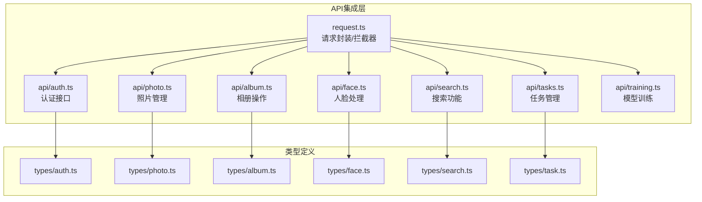
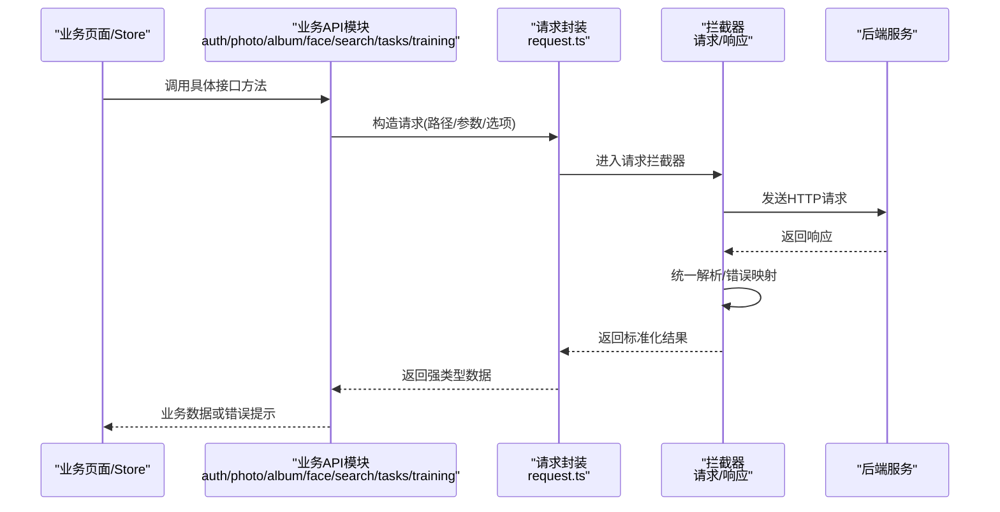
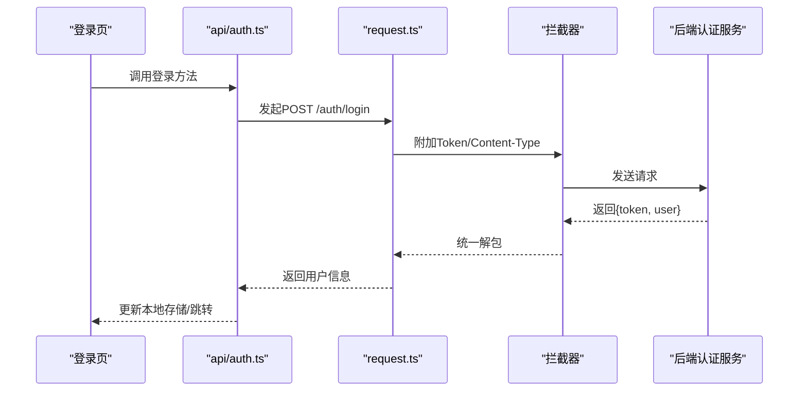
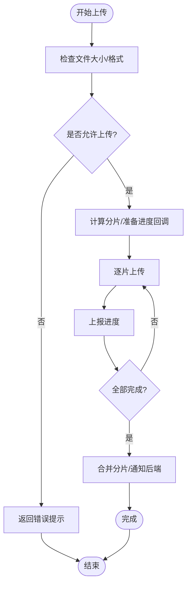
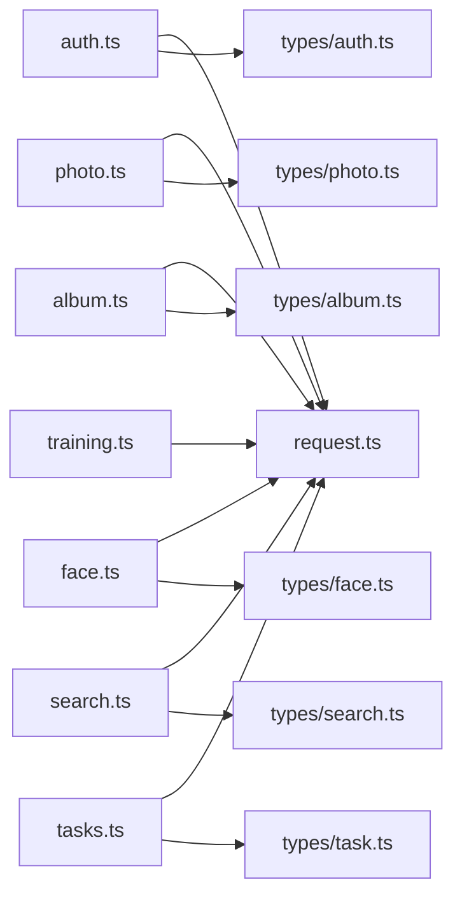

# API集成层

<cite>
**本文引用的文件**   
- [frontend/src/utils/request.ts](file://frontend/src/utils/request.ts)
- [frontend/src/api/auth.ts](file://frontend/src/api/auth.ts)
- [frontend/src/api/photo.ts](file://frontend/src/api/photo.ts)
- [frontend/src/api/album.ts](file://frontend/src/api/album.ts)
- [frontend/src/api/face.ts](file://frontend/src/api/face.ts)
- [frontend/src/api/search.ts](file://frontend/src/api/search.ts)
- [frontend/src/api/tasks.ts](file://frontend/src/api/tasks.ts)
- [frontend/src/api/training.ts](file://frontend/src/api/training.ts)
- [frontend/src/types/auth.ts](file://frontend/src/types/auth.ts)
- [frontend/src/types/photo.ts](file://frontend/src/types/photo.ts)
- [frontend/src/types/album.ts](file://frontend/src/types/album.ts)
- [frontend/src/types/face.ts](file://frontend/src/types/face.ts)
- [frontend/src/types/search.ts](file://frontend/src/types/search.ts)
- [frontend/src/types/task.ts](file://frontend/src/types/task.ts)
</cite>

## 目录
1. [简介](#简介)
2. [项目结构](#项目结构)
3. [核心组件](#核心组件)
4. [架构总览](#架构总览)
5. [详细组件分析](#详细组件分析)
6. [依赖关系分析](#依赖关系分析)
7. [性能与可靠性](#性能与可靠性)
8. [故障排查指南](#故障排查指南)
9. [结论](#结论)
10. [附录](#附录)

## 简介
本文件面向前端开发者，系统化阐述AI相册项目的API集成层设计与实现。内容覆盖HTTP请求封装、拦截器配置、统一错误处理、各业务模块（认证、照片、相册、人脸、搜索、任务、训练）的接口组织方式，以及请求重试、超时控制、进度跟踪、缓存策略、TypeScript类型规范、API版本管理与Mock数据方案等最佳实践。目标是帮助团队构建健壮、可维护、可扩展的前端API调用体系。

## 项目结构
前端API相关代码主要位于以下目录：
- utils/request.ts：统一的HTTP请求封装与拦截器
- api/*.ts：按业务域划分的API模块（auth、photo、album、face、search、tasks、training）
- types/*.ts：与后端Schema对应的TypeScript类型定义

图表来源
- [frontend/src/utils/request.ts](file://frontend/src/utils/request.ts)
- [frontend/src/api/auth.ts](file://frontend/src/api/auth.ts)
- [frontend/src/api/photo.ts](file://frontend/src/api/photo.ts)
- [frontend/src/api/album.ts](file://frontend/src/api/album.ts)
- [frontend/src/api/face.ts](file://frontend/src/api/face.ts)
- [frontend/src/api/search.ts](file://frontend/src/api/search.ts)
- [frontend/src/api/tasks.ts](file://frontend/src/api/tasks.ts)
- [frontend/src/api/training.ts](file://frontend/src/api/training.ts)
- [frontend/src/types/auth.ts](file://frontend/src/types/auth.ts)
- [frontend/src/types/photo.ts](file://frontend/src/types/photo.ts)
- [frontend/src/types/album.ts](file://frontend/src/types/album.ts)
- [frontend/src/types/face.ts](file://frontend/src/types/face.ts)
- [frontend/src/types/search.ts](file://frontend/src/types/search.ts)
- [frontend/src/types/task.ts](file://frontend/src/types/task.ts)

章节来源
- [frontend/src/utils/request.ts](file://frontend/src/utils/request.ts)
- [frontend/src/api/auth.ts](file://frontend/src/api/auth.ts)
- [frontend/src/api/photo.ts](file://frontend/src/api/photo.ts)
- [frontend/src/api/album.ts](file://frontend/src/api/album.ts)
- [frontend/src/api/face.ts](file://frontend/src/api/face.ts)
- [frontend/src/api/search.ts](file://frontend/src/api/search.ts)
- [frontend/src/api/tasks.ts](file://frontend/src/api/tasks.ts)
- [frontend/src/api/training.ts](file://frontend/src/api/training.ts)
- [frontend/src/types/auth.ts](file://frontend/src/types/auth.ts)
- [frontend/src/types/photo.ts](file://frontend/src/types/photo.ts)
- [frontend/src/types/album.ts](file://frontend/src/types/album.ts)
- [frontend/src/types/face.ts](file://frontend/src/types/face.ts)
- [frontend/src/types/search.ts](file://frontend/src/types/search.ts)
- [frontend/src/types/task.ts](file://frontend/src/types/task.ts)

## 核心组件
本节聚焦于HTTP请求封装与拦截器的设计要点，包括：
- 基础URL与版本前缀管理
- 请求头注入（如鉴权令牌、Content-Type）
- 响应拦截：统一解包、状态码校验、错误映射
- 错误分类：网络异常、服务端错误、业务错误
- 可选能力：重试、超时、取消、进度回调、缓存键生成

建议将通用逻辑集中在utils/request.ts中，业务API仅负责参数组装与返回类型约束，保持职责清晰。

章节来源
- [frontend/src/utils/request.ts](file://frontend/src/utils/request.ts)

## 架构总览
下图展示了从业务页面到后端接口的完整调用链路，以及拦截器在其中的作用点。

图表来源
- [frontend/src/utils/request.ts](file://frontend/src/utils/request.ts)
- [frontend/src/api/auth.ts](file://frontend/src/api/auth.ts)
- [frontend/src/api/photo.ts](file://frontend/src/api/photo.ts)
- [frontend/src/api/album.ts](file://frontend/src/api/album.ts)
- [frontend/src/api/face.ts](file://frontend/src/api/face.ts)
- [frontend/src/api/search.ts](file://frontend/src/api/search.ts)
- [frontend/src/api/tasks.ts](file://frontend/src/api/tasks.ts)
- [frontend/src/api/training.ts](file://frontend/src/api/training.ts)

## 详细组件分析

### 认证接口（auth.ts）
- 职责：登录、注册、刷新令牌、获取当前用户信息、退出登录等
- 典型流程：
  - 登录：提交用户名/密码，接收并持久化令牌；失败时统一错误提示
  - 刷新令牌：无感续期，避免用户中断
  - 鉴权：通过请求拦截器自动附加Authorization头
- 类型约定：使用types/auth.ts中的类型约束入参与返回值

图表来源
- [frontend/src/api/auth.ts](file://frontend/src/api/auth.ts)
- [frontend/src/utils/request.ts](file://frontend/src/utils/request.ts)
- [frontend/src/types/auth.ts](file://frontend/src/types/auth.ts)

章节来源
- [frontend/src/api/auth.ts](file://frontend/src/api/auth.ts)
- [frontend/src/types/auth.ts](file://frontend/src/types/auth.ts)

### 照片管理（photo.ts）
- 职责：上传、删除、批量操作、元数据读取、缩略图获取
- 关键点：
  - 大文件上传：支持分片、断点续传、进度回调
  - 并发控制：限制同时上传数量，避免阻塞
  - 错误重试：对瞬时网络错误进行有限次重试
  - 类型约束：使用types/photo.ts

图表来源
- [frontend/src/api/photo.ts](file://frontend/src/api/photo.ts)
- [frontend/src/utils/request.ts](file://frontend/src/utils/request.ts)
- [frontend/src/types/photo.ts](file://frontend/src/types/photo.ts)

章节来源
- [frontend/src/api/photo.ts](file://frontend/src/api/photo.ts)
- [frontend/src/types/photo.ts](file://frontend/src/types/photo.ts)

### 相册操作（album.ts）
- 职责：创建、更新、删除相册，添加/移除照片，排序与标签管理
- 设计要点：
  - 幂等性：对重复提交做去重（如基于请求ID）
  - 乐观更新：先更新本地状态，失败再回滚
  - 类型约束：使用types/album.ts

章节来源
- [frontend/src/api/album.ts](file://frontend/src/api/album.ts)
- [frontend/src/types/album.ts](file://frontend/src/types/album.ts)

### 人脸处理（face.ts）
- 职责：人脸检测、识别、聚类、确认姓名、批量标注
- 设计要点：
  - 长耗时任务：采用轮询或事件推送（如SSE/WebSocket）
  - 进度反馈：结合任务ID与进度字段展示
  - 类型约束：使用types/face.ts

章节来源
- [frontend/src/api/face.ts](file://frontend/src/api/face.ts)
- [frontend/src/types/face.ts](file://frontend/src/types/face.ts)

### 搜索功能（search.ts）
- 职责：关键词检索、向量语义搜索、过滤条件组合
- 设计要点：
  - 防抖与节流：输入框防抖，列表滚动节流
  - 缓存策略：相同查询条件命中内存缓存
  - 分页加载：游标或偏移分页
  - 类型约束：使用types/search.ts

章节来源
- [frontend/src/api/search.ts](file://frontend/src/api/search.ts)
- [frontend/src/types/search.ts](file://frontend/src/types/search.ts)

### 任务管理（tasks.ts）
- 职责：查看任务队列、触发任务、查询任务状态、取消任务
- 设计要点：
  - 状态机：待处理/进行中/成功/失败
  - 轮询间隔自适应：根据任务阶段动态调整
  - 类型约束：使用types/task.ts

章节来源
- [frontend/src/api/tasks.ts](file://frontend/src/api/tasks.ts)
- [frontend/src/types/task.ts](file://frontend/src/types/task.ts)

### 模型训练（training.ts）
- 职责：启动训练、查看训练日志、导出模型、版本管理
- 设计要点：
  - 长时间运行：后台任务+进度/日志流式输出
  - 资源监控：GPU/CPU占用提示
  - 类型约束：与后端训练Schema一致

章节来源
- [frontend/src/api/training.ts](file://frontend/src/api/training.ts)

## 依赖关系分析
API模块均依赖统一的请求封装，类型定义独立维护并与后端Schema对齐。

图表来源
- [frontend/src/utils/request.ts](file://frontend/src/utils/request.ts)
- [frontend/src/api/auth.ts](file://frontend/src/api/auth.ts)
- [frontend/src/api/photo.ts](file://frontend/src/api/photo.ts)
- [frontend/src/api/album.ts](file://frontend/src/api/album.ts)
- [frontend/src/api/face.ts](file://frontend/src/api/face.ts)
- [frontend/src/api/search.ts](file://frontend/src/api/search.ts)
- [frontend/src/api/tasks.ts](file://frontend/src/api/tasks.ts)
- [frontend/src/api/training.ts](file://frontend/src/api/training.ts)
- [frontend/src/types/auth.ts](file://frontend/src/types/auth.ts)
- [frontend/src/types/photo.ts](file://frontend/src/types/photo.ts)
- [frontend/src/types/album.ts](file://frontend/src/types/album.ts)
- [frontend/src/types/face.ts](file://frontend/src/types/face.ts)
- [frontend/src/types/search.ts](file://frontend/src/types/search.ts)
- [frontend/src/types/task.ts](file://frontend/src/types/task.ts)

章节来源
- [frontend/src/utils/request.ts](file://frontend/src/utils/request.ts)
- [frontend/src/api/auth.ts](file://frontend/src/api/auth.ts)
- [frontend/src/api/photo.ts](file://frontend/src/api/photo.ts)
- [frontend/src/api/album.ts](file://frontend/src/api/album.ts)
- [frontend/src/api/face.ts](file://frontend/src/api/face.ts)
- [frontend/src/api/search.ts](file://frontend/src/api/search.ts)
- [frontend/src/api/tasks.ts](file://frontend/src/api/tasks.ts)
- [frontend/src/api/training.ts](file://frontend/src/api/training.ts)
- [frontend/src/types/auth.ts](file://frontend/src/types/auth.ts)
- [frontend/src/types/photo.ts](file://frontend/src/types/photo.ts)
- [frontend/src/types/album.ts](file://frontend/src/types/album.ts)
- [frontend/src/types/face.ts](file://frontend/src/types/face.ts)
- [frontend/src/types/search.ts](file://frontend/src/types/search.ts)
- [frontend/src/types/task.ts](file://frontend/src/types/task.ts)

## 性能与可靠性
- 请求重试机制
  - 适用场景：网络抖动、临时5xx、限流429
  - 策略：指数退避、最大重试次数、区分可重试错误
  - 注意：非幂等请求谨慎重试
- 超时处理
  - 全局默认超时与接口级覆盖
  - 长连接/上传下载单独设置更合理的超时
- 进度跟踪
  - 上传/下载：onUploadProgress/onDownloadProgress
  - 任务类接口：轮询或事件流，提供百分比与阶段信息
- 缓存策略
  - 读多写少接口：内存缓存+失效策略（时间/版本号/手动失效）
  - 列表接口：分页游标缓存，避免重复请求
  - 敏感数据不缓存
- 并发与背压
  - 上传/批量操作限制并发数
  - 失败快速失败与整体回滚策略
- 取消与清理
  - 路由切换或组件卸载时取消未完成的请求
  - 定时器/轮询在离开页面时清理

[本节为通用指导，无需特定文件引用]

## 故障排查指南
- 常见问题定位
  - 401未授权：检查令牌是否存在、是否过期、刷新流程是否生效
  - 403权限不足：核对当前用户角色与资源访问策略
  - 429限流：降低请求频率或等待退避后重试
  - 5xx服务端错误：记录请求ID与上下文，联系后端排查
  - 网络异常：检查代理、跨域、证书与DNS
- 调试技巧
  - 开启请求日志（脱敏），记录URL、方法、请求体摘要、响应码、耗时
  - 对关键接口增加traceId透传，便于全链路追踪
  - 使用浏览器Network面板与前端控制台对比前后端行为
- 恢复策略
  - 用户可见的错误提示与重试按钮
  - 自动重试后的降级显示（如部分失败）
  - 离线模式下的本地缓存与队列

章节来源
- [frontend/src/utils/request.ts](file://frontend/src/utils/request.ts)

## 结论
通过将HTTP请求封装与拦截器集中管理，并按业务域拆分API模块，配合严格的TypeScript类型定义与完善的错误处理、重试、超时、进度与缓存策略，可以显著提升前端API集成的稳定性与可维护性。建议在团队内推广统一的开发规范与最佳实践，持续优化性能与用户体验。

[本节为总结性内容，无需特定文件引用]

## 附录

### TypeScript类型定义规范
- 命名与结构
  - 类型文件按模块划分，文件名与API模块对应
  - 使用interface描述对象结构，enum描述枚举值
  - 对可选字段明确标记，避免any
- 与后端对齐
  - 以后端Schema为准，变更需同步更新前端类型
  - 新增字段遵循向后兼容原则
- 示例参考
  - [types/auth.ts](file://frontend/src/types/auth.ts)
  - [types/photo.ts](file://frontend/src/types/photo.ts)
  - [types/album.ts](file://frontend/src/types/album.ts)
  - [types/face.ts](file://frontend/src/types/face.ts)
  - [types/search.ts](file://frontend/src/types/search.ts)
  - [types/task.ts](file://frontend/src/types/task.ts)

章节来源
- [frontend/src/types/auth.ts](file://frontend/src/types/auth.ts)
- [frontend/src/types/photo.ts](file://frontend/src/types/photo.ts)
- [frontend/src/types/album.ts](file://frontend/src/types/album.ts)
- [frontend/src/types/face.ts](file://frontend/src/types/face.ts)
- [frontend/src/types/search.ts](file://frontend/src/types/search.ts)
- [frontend/src/types/task.ts](file://frontend/src/types/task.ts)

### API版本管理
- 路径前缀：/api/v1/...
- 兼容性策略：
  - 新增字段保持向后兼容
  - 破坏性变更升级主版本（v2）
  - 废弃字段保留过渡期并给出迁移指引
- 客户端适配：
  - 通过环境变量或配置中心切换版本
  - 灰度发布与A/B测试支持

[本节为通用指导，无需特定文件引用]

### Mock数据开发方案
- 本地Mock
  - 使用Vite插件或自定义中间件拦截请求，返回模拟数据
  - 按模块组织mock数据，与真实接口保持一致的路径与类型
- 远程Mock
  - 通过Nginx或网关转发至Mock服务
  - 支持开关与权重控制
- 数据一致性
  - 使用固定种子保证可复现
  - 提供随机化与边界用例数据

[本节为通用指导，无需特定文件引用]

### 最佳实践清单
- 所有对外请求统一走request.ts，禁止直接调用原生fetch/axios
- 每个API模块只关注参数组装与返回类型，不处理通用逻辑
- 严格使用类型定义，避免隐式any
- 对长耗时任务提供进度与取消能力
- 合理设置超时与重试，避免雪崩
- 对敏感数据不做缓存，必要时加密存储
- 完善错误提示与日志，便于问题定位
- 定期审查接口变更，及时更新类型与文档

[本节为通用指导，无需特定文件引用]