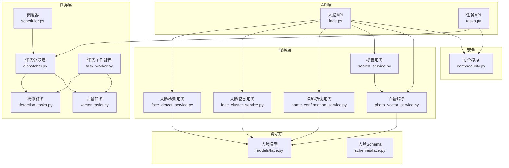
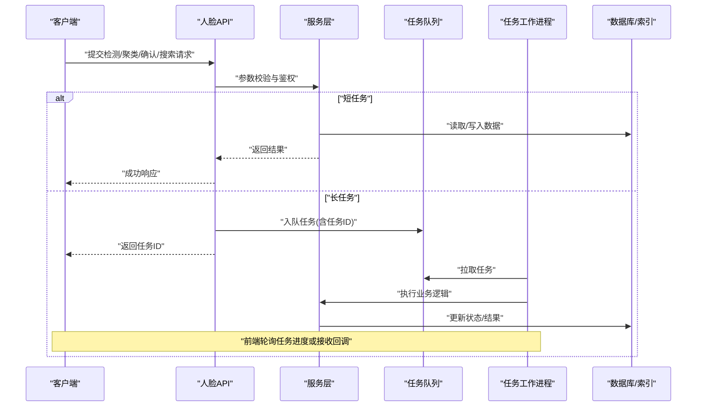
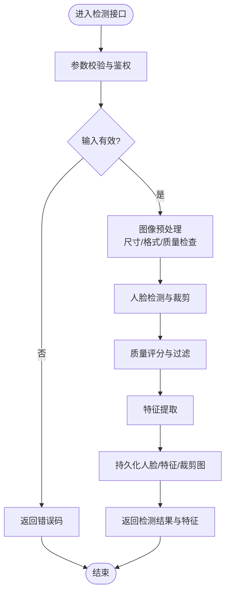
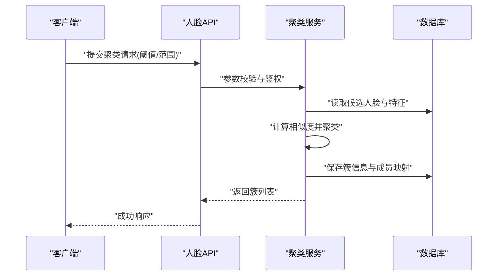
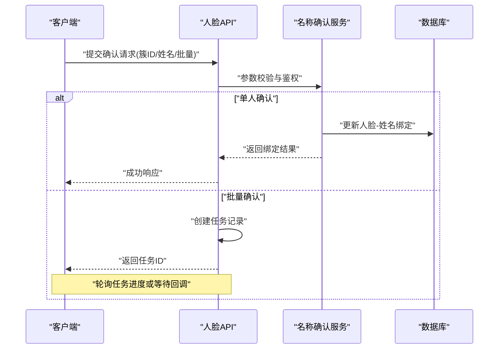
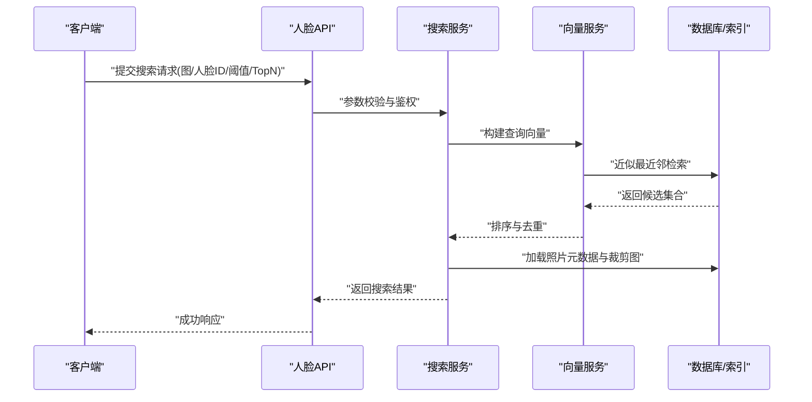
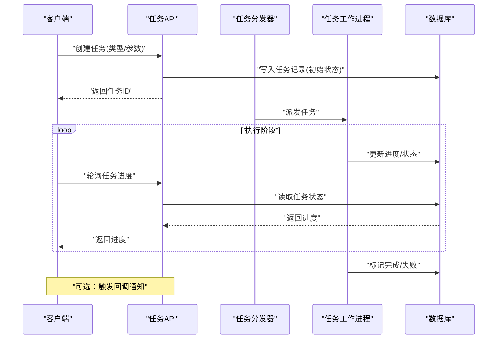
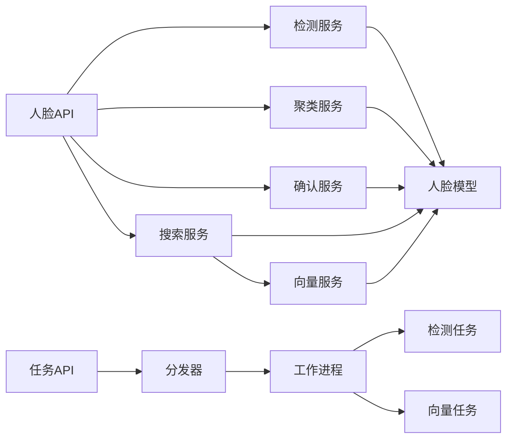

# 人脸处理接口

<cite>
**本文引用的文件**   
- [backend/app/api/face.py](file://backend/app/api/face.py)
- [backend/app/services/face_detect_service.py](file://backend/app/services/face_detect_service.py)
- [backend/app/services/face_cluster_service.py](file://backend/app/services/face_cluster_service.py)
- [backend/app/services/name_confirmation_service.py](file://backend/app/services/name_confirmation_service.py)
- [backend/app/services/search_service.py](file://backend/app/services/search_service.py)
- [backend/app/services/photo_vector_service.py](file://backend/app/services/photo_vector_service.py)
- [backend/app/models/face.py](file://backend/app/models/face.py)
- [backend/app/schemas/face.py](file://backend/app/schemas/face.py)
- [backend/app/tasks/detection_tasks.py](file://backend/app/tasks/detection_tasks.py)
- [backend/app/tasks/vector_tasks.py](file://backend/app/tasks/vector_tasks.py)
- [backend/app/tasks/dispatcher.py](file://backend/app/tasks/dispatcher.py)
- [backend/app/tasks/task_worker.py](file://backend/app/tasks/task_worker.py)
- [backend/app/tasks/scheduler.py](file://backend/app/tasks/scheduler.py)
- [backend/app/api/tasks.py](file://backend/app/api/tasks.py)
- [backend/app/core/security.py](file://backend/app/core/security.py)
</cite>

## 目录
1. [简介](#简介)
2. [项目结构](#项目结构)
3. [核心组件](#核心组件)
4. [架构总览](#架构总览)
5. [详细组件分析](#详细组件分析)
6. [依赖关系分析](#依赖关系分析)
7. [性能考量](#性能考量)
8. [故障排查指南](#故障排查指南)
9. [结论](#结论)
10. [附录](#附录)

## 简介
本文件面向开发者，系统化说明本项目中“人脸处理API模块”的接口与实现，覆盖以下能力：
- 人脸检测、特征提取、聚类、确认（命名绑定）、搜索
- 批量确认流程与长任务进度查询、异步处理与结果回调策略
- 图片裁剪、质量检查、隐私保护等安全机制
- 端到端集成方案与最佳实践

## 项目结构
后端采用分层架构：API层暴露REST接口，服务层封装业务逻辑，模型与Schema定义数据契约，任务层负责异步与调度。人脸相关代码主要分布在如下位置：
- API层：人脸接口、任务接口
- 服务层：检测、聚类、名称确认、搜索、向量检索
- 模型与Schema：人脸实体与请求/响应结构
- 任务层：检测与向量任务、任务分发器与工作进程、调度器
- 安全：鉴权与权限控制

图表来源
- [backend/app/api/face.py](file://backend/app/api/face.py)
- [backend/app/api/tasks.py](file://backend/app/api/tasks.py)
- [backend/app/services/face_detect_service.py](file://backend/app/services/face_detect_service.py)
- [backend/app/services/face_cluster_service.py](file://backend/app/services/face_cluster_service.py)
- [backend/app/services/name_confirmation_service.py](file://backend/app/services/name_confirmation_service.py)
- [backend/app/services/search_service.py](file://backend/app/services/search_service.py)
- [backend/app/services/photo_vector_service.py](file://backend/app/services/photo_vector_service.py)
- [backend/app/tasks/detection_tasks.py](file://backend/app/tasks/detection_tasks.py)
- [backend/app/tasks/vector_tasks.py](file://backend/app/tasks/vector_tasks.py)
- [backend/app/tasks/dispatcher.py](file://backend/app/tasks/dispatcher.py)
- [backend/app/tasks/task_worker.py](file://backend/app/tasks/task_worker.py)
- [backend/app/tasks/scheduler.py](file://backend/app/tasks/scheduler.py)
- [backend/app/models/face.py](file://backend/app/models/face.py)
- [backend/app/schemas/face.py](file://backend/app/schemas/face.py)
- [backend/app/core/security.py](file://backend/app/core/security.py)

章节来源
- [backend/app/api/face.py](file://backend/app/api/face.py)
- [backend/app/api/tasks.py](file://backend/app/api/tasks.py)
- [backend/app/services/face_detect_service.py](file://backend/app/services/face_detect_service.py)
- [backend/app/services/face_cluster_service.py](file://backend/app/services/face_cluster_service.py)
- [backend/app/services/name_confirmation_service.py](file://backend/app/services/name_confirmation_service.py)
- [backend/app/services/search_service.py](file://backend/app/services/search_service.py)
- [backend/app/services/photo_vector_service.py](file://backend/app/services/photo_vector_service.py)
- [backend/app/tasks/detection_tasks.py](file://backend/app/tasks/detection_tasks.py)
- [backend/app/tasks/vector_tasks.py](file://backend/app/tasks/vector_tasks.py)
- [backend/app/tasks/dispatcher.py](file://backend/app/tasks/dispatcher.py)
- [backend/app/tasks/task_worker.py](file://backend/app/tasks/task_worker.py)
- [backend/app/tasks/scheduler.py](file://backend/app/tasks/scheduler.py)
- [backend/app/models/face.py](file://backend/app/models/face.py)
- [backend/app/schemas/face.py](file://backend/app/schemas/face.py)
- [backend/app/core/security.py](file://backend/app/core/security.py)

## 核心组件
- 人脸API：提供检测、聚类、确认、搜索等HTTP接口，统一参数校验、错误码与安全校验。
- 服务层：
  - 人脸检测服务：执行图像预处理、人脸检测、特征提取、质量评估与裁剪。
  - 人脸聚类服务：基于特征相似度进行聚类，生成身份簇。
  - 名称确认服务：将人脸簇与用户姓名绑定，支持批量确认。
  - 搜索服务：以图搜脸或文本语义检索，返回相似人脸及照片。
  - 向量服务：维护人脸/照片向量索引，支撑快速检索。
- 任务层：
  - 检测任务与向量任务：将耗时操作入队，由工作进程异步执行。
  - 任务分发器与工作进程：解耦API与服务，提升吞吐与稳定性。
  - 调度器：定时触发批量任务（如全量检测、重建索引）。
- 数据契约：
  - 模型：持久化人脸、照片、任务等实体。
  - Schema：统一的请求/响应结构，便于前后端协作。
- 安全：
  - 鉴权与权限控制，确保仅授权用户可访问敏感接口。

章节来源
- [backend/app/api/face.py](file://backend/app/api/face.py)
- [backend/app/services/face_detect_service.py](file://backend/app/services/face_detect_service.py)
- [backend/app/services/face_cluster_service.py](file://backend/app/services/face_cluster_service.py)
- [backend/app/services/name_confirmation_service.py](file://backend/app/services/name_confirmation_service.py)
- [backend/app/services/search_service.py](file://backend/app/services/search_service.py)
- [backend/app/services/photo_vector_service.py](file://backend/app/services/photo_vector_service.py)
- [backend/app/tasks/detection_tasks.py](file://backend/app/tasks/detection_tasks.py)
- [backend/app/tasks/vector_tasks.py](file://backend/app/tasks/vector_tasks.py)
- [backend/app/tasks/dispatcher.py](file://backend/app/tasks/dispatcher.py)
- [backend/app/tasks/task_worker.py](file://backend/app/tasks/task_worker.py)
- [backend/app/tasks/scheduler.py](file://backend/app/tasks/scheduler.py)
- [backend/app/models/face.py](file://backend/app/models/face.py)
- [backend/app/schemas/face.py](file://backend/app/schemas/face.py)
- [backend/app/core/security.py](file://backend/app/core/security.py)

## 架构总览
整体调用链遵循“API -> 服务 -> 任务 -> 存储/索引”的分层模式，关键流程包括：
- 同步短任务：直接由服务完成并返回结果（如单张图检测、简单搜索）。
- 异步长任务：API创建任务记录，返回任务ID；前端轮询或通过回调获取结果。
- 批量处理：通过调度器周期性触发，或按批次提交任务队列。

图表来源
- [backend/app/api/face.py](file://backend/app/api/face.py)
- [backend/app/api/tasks.py](file://backend/app/api/tasks.py)
- [backend/app/tasks/dispatcher.py](file://backend/app/tasks/dispatcher.py)
- [backend/app/tasks/task_worker.py](file://backend/app/tasks/task_worker.py)
- [backend/app/tasks/detection_tasks.py](file://backend/app/tasks/detection_tasks.py)
- [backend/app/tasks/vector_tasks.py](file://backend/app/tasks/vector_tasks.py)

## 详细组件分析

### 人脸检测接口
- 功能要点
  - 输入：图片文件或URL、可选裁剪区域、质量阈值、是否提取特征。
  - 输出：人脸框、关键点、特征向量、质量评分、裁剪后的子图。
  - 安全：尺寸限制、格式校验、恶意内容过滤、隐私脱敏（可选）。
- 调用流程
  - 同步：直接返回检测结果与特征。
  - 异步：当批量或高分辨率时，建议走任务队列，返回任务ID，后续查询进度。
- 关键实现路径
  - 接口定义与参数校验：[backend/app/api/face.py](file://backend/app/api/face.py)
  - 检测与特征提取服务：[backend/app/services/face_detect_service.py](file://backend/app/services/face_detect_service.py)
  - 检测任务定义与执行：[backend/app/tasks/detection_tasks.py](file://backend/app/tasks/detection_tasks.py)
  - 任务分发与工作进程：[backend/app/tasks/dispatcher.py](file://backend/app/tasks/dispatcher.py), [backend/app/tasks/task_worker.py](file://backend/app/tasks/task_worker.py)
  - 人脸模型与Schema：[backend/app/models/face.py](file://backend/app/models/face.py), [backend/app/schemas/face.py](file://backend/app/schemas/face.py)

图表来源
- [backend/app/api/face.py](file://backend/app/api/face.py)
- [backend/app/services/face_detect_service.py](file://backend/app/services/face_detect_service.py)
- [backend/app/schemas/face.py](file://backend/app/schemas/face.py)
- [backend/app/models/face.py](file://backend/app/models/face.py)

章节来源
- [backend/app/api/face.py](file://backend/app/api/face.py)
- [backend/app/services/face_detect_service.py](file://backend/app/services/face_detect_service.py)
- [backend/app/tasks/detection_tasks.py](file://backend/app/tasks/detection_tasks.py)
- [backend/app/tasks/dispatcher.py](file://backend/app/tasks/dispatcher.py)
- [backend/app/tasks/task_worker.py](file://backend/app/tasks/task_worker.py)
- [backend/app/models/face.py](file://backend/app/models/face.py)
- [backend/app/schemas/face.py](file://backend/app/schemas/face.py)

### 人脸聚类接口
- 功能要点
  - 输入：时间窗口或相册范围、相似度阈值、最大簇大小。
  - 输出：人脸簇列表（包含成员人脸ID、代表人脸、置信度）。
  - 策略：基于特征向量相似度进行聚类，支持增量更新。
- 调用流程
  - 短任务：对少量人脸进行即时聚类。
  - 长任务：对大量历史数据进行批量聚类，返回任务ID，支持进度查询。
- 关键实现路径
  - 接口定义：[backend/app/api/face.py](file://backend/app/api/face.py)
  - 聚类服务：[backend/app/services/face_cluster_service.py](file://backend/app/services/face_cluster_service.py)
  - 任务与持久化：[backend/app/tasks/detection_tasks.py](file://backend/app/tasks/detection_tasks.py), [backend/app/models/face.py](file://backend/app/models/face.py)

图表来源
- [backend/app/api/face.py](file://backend/app/api/face.py)
- [backend/app/services/face_cluster_service.py](file://backend/app/services/face_cluster_service.py)
- [backend/app/models/face.py](file://backend/app/models/face.py)

章节来源
- [backend/app/api/face.py](file://backend/app/api/face.py)
- [backend/app/services/face_cluster_service.py](file://backend/app/services/face_cluster_service.py)
- [backend/app/models/face.py](file://backend/app/models/face.py)

### 人脸确认（身份绑定）接口
- 功能要点
  - 输入：人脸簇ID、目标姓名、可选头像、是否批量确认。
  - 输出：绑定结果、受影响的人脸数量、冲突提示。
  - 策略：支持单人绑定与批量合并，避免重复绑定与冲突。
- 调用流程
  - 单人确认：立即生效。
  - 批量确认：异步执行，返回任务ID，支持进度查询与结果回调。
- 关键实现路径
  - 接口定义：[backend/app/api/face.py](file://backend/app/api/face.py)
  - 名称确认服务：[backend/app/services/name_confirmation_service.py](file://backend/app/services/name_confirmation_service.py)
  - 任务与持久化：[backend/app/tasks/detection_tasks.py](file://backend/app/tasks/detection_tasks.py), [backend/app/models/face.py](file://backend/app/models/face.py)

图表来源
- [backend/app/api/face.py](file://backend/app/api/face.py)
- [backend/app/services/name_confirmation_service.py](file://backend/app/services/name_confirmation_service.py)
- [backend/app/models/face.py](file://backend/app/models/face.py)

章节来源
- [backend/app/api/face.py](file://backend/app/api/face.py)
- [backend/app/services/name_confirmation_service.py](file://backend/app/services/name_confirmation_service.py)
- [backend/app/models/face.py](file://backend/app/models/face.py)

### 人脸搜索接口
- 功能要点
  - 输入：参考图或人脸ID、相似度阈值、返回数量、是否启用文本语义。
  - 输出：相似人脸列表（含照片信息、相似度、裁剪图）。
  - 策略：向量检索优先，必要时结合文本描述增强召回。
- 调用流程
  - 同步：小批量或在线实时搜索。
  - 异步：大规模库检索或复杂条件组合时，使用任务队列。
- 关键实现路径
  - 接口定义：[backend/app/api/face.py](file://backend/app/api/face.py)
  - 搜索服务：[backend/app/services/search_service.py](file://backend/app/services/search_service.py)
  - 向量服务：[backend/app/services/photo_vector_service.py](file://backend/app/services/photo_vector_service.py)
  - 任务与持久化：[backend/app/tasks/vector_tasks.py](file://backend/app/tasks/vector_tasks.py), [backend/app/models/face.py](file://backend/app/models/face.py)

图表来源
- [backend/app/api/face.py](file://backend/app/api/face.py)
- [backend/app/services/search_service.py](file://backend/app/services/search_service.py)
- [backend/app/services/photo_vector_service.py](file://backend/app/services/photo_vector_service.py)
- [backend/app/models/face.py](file://backend/app/models/face.py)

章节来源
- [backend/app/api/face.py](file://backend/app/api/face.py)
- [backend/app/services/search_service.py](file://backend/app/services/search_service.py)
- [backend/app/services/photo_vector_service.py](file://backend/app/services/photo_vector_service.py)
- [backend/app/tasks/vector_tasks.py](file://backend/app/tasks/vector_tasks.py)
- [backend/app/models/face.py](file://backend/app/models/face.py)

### 长任务进度查询与异步处理
- 任务生命周期
  - 创建：API创建任务记录，返回任务ID。
  - 执行：任务分发器将任务派发给工作进程，执行具体服务逻辑。
  - 更新：工作进程定期更新任务状态与进度。
  - 完成：任务完成后，持久化结果并可触发回调。
- 进度查询
  - 通过任务API查询任务状态、进度百分比、错误信息。
- 回调策略
  - 支持Webhook回调或消息推送，失败重试与幂等性保证。
- 关键实现路径
  - 任务API：[backend/app/api/tasks.py](file://backend/app/api/tasks.py)
  - 任务分发器与工作进程：[backend/app/tasks/dispatcher.py](file://backend/app/tasks/dispatcher.py), [backend/app/tasks/task_worker.py](file://backend/app/tasks/task_worker.py)
  - 调度器：[backend/app/tasks/scheduler.py](file://backend/app/tasks/scheduler.py)
  - 检测与向量任务：[backend/app/tasks/detection_tasks.py](file://backend/app/tasks/detection_tasks.py), [backend/app/tasks/vector_tasks.py](file://backend/app/tasks/vector_tasks.py)

图表来源
- [backend/app/api/tasks.py](file://backend/app/api/tasks.py)
- [backend/app/tasks/dispatcher.py](file://backend/app/tasks/dispatcher.py)
- [backend/app/tasks/task_worker.py](file://backend/app/tasks/task_worker.py)
- [backend/app/tasks/detection_tasks.py](file://backend/app/tasks/detection_tasks.py)
- [backend/app/tasks/vector_tasks.py](file://backend/app/tasks/vector_tasks.py)

章节来源
- [backend/app/api/tasks.py](file://backend/app/api/tasks.py)
- [backend/app/tasks/dispatcher.py](file://backend/app/tasks/dispatcher.py)
- [backend/app/tasks/task_worker.py](file://backend/app/tasks/task_worker.py)
- [backend/app/tasks/scheduler.py](file://backend/app/tasks/scheduler.py)
- [backend/app/tasks/detection_tasks.py](file://backend/app/tasks/detection_tasks.py)
- [backend/app/tasks/vector_tasks.py](file://backend/app/tasks/vector_tasks.py)

### 安全与隐私保护
- 鉴权与权限
  - 所有人脸接口均需鉴权，防止未授权访问。
- 输入校验与防护
  - 图片格式、尺寸、大小限制；恶意内容检测；注入与越权防护。
- 隐私保护
  - 可选脱敏：模糊背景、隐藏非人脸区域；最小化数据留存策略。
- 审计与日志
  - 记录关键操作与异常，便于追踪与合规审计。
- 关键实现路径
  - 安全模块：[backend/app/core/security.py](file://backend/app/core/security.py)
  - 各API入口均调用安全中间件进行鉴权与校验。

章节来源
- [backend/app/core/security.py](file://backend/app/core/security.py)
- [backend/app/api/face.py](file://backend/app/api/face.py)
- [backend/app/api/tasks.py](file://backend/app/api/tasks.py)

## 依赖关系分析
- 组件耦合
  - API层依赖服务层，服务层依赖模型与Schema，任务层解耦API与服务。
- 外部依赖
  - 向量索引与数据库用于持久化与检索。
- 潜在循环依赖
  - 服务层内部应避免相互强引用，通过任务层或事件机制解耦。
- 接口契约
  - 请求/响应结构由Schema统一约束，降低前后端耦合。

图表来源
- [backend/app/api/face.py](file://backend/app/api/face.py)
- [backend/app/api/tasks.py](file://backend/app/api/tasks.py)
- [backend/app/services/face_detect_service.py](file://backend/app/services/face_detect_service.py)
- [backend/app/services/face_cluster_service.py](file://backend/app/services/face_cluster_service.py)
- [backend/app/services/name_confirmation_service.py](file://backend/app/services/name_confirmation_service.py)
- [backend/app/services/search_service.py](file://backend/app/services/search_service.py)
- [backend/app/services/photo_vector_service.py](file://backend/app/services/photo_vector_service.py)
- [backend/app/tasks/dispatcher.py](file://backend/app/tasks/dispatcher.py)
- [backend/app/tasks/task_worker.py](file://backend/app/tasks/task_worker.py)
- [backend/app/tasks/detection_tasks.py](file://backend/app/tasks/detection_tasks.py)
- [backend/app/tasks/vector_tasks.py](file://backend/app/tasks/vector_tasks.py)
- [backend/app/models/face.py](file://backend/app/models/face.py)

章节来源
- [backend/app/api/face.py](file://backend/app/api/face.py)
- [backend/app/api/tasks.py](file://backend/app/api/tasks.py)
- [backend/app/services/face_detect_service.py](file://backend/app/services/face_detect_service.py)
- [backend/app/services/face_cluster_service.py](file://backend/app/services/face_cluster_service.py)
- [backend/app/services/name_confirmation_service.py](file://backend/app/services/name_confirmation_service.py)
- [backend/app/services/search_service.py](file://backend/app/services/search_service.py)
- [backend/app/services/photo_vector_service.py](file://backend/app/services/photo_vector_service.py)
- [backend/app/tasks/dispatcher.py](file://backend/app/tasks/dispatcher.py)
- [backend/app/tasks/task_worker.py](file://backend/app/tasks/task_worker.py)
- [backend/app/tasks/detection_tasks.py](file://backend/app/tasks/detection_tasks.py)
- [backend/app/tasks/vector_tasks.py](file://backend/app/tasks/vector_tasks.py)
- [backend/app/models/face.py](file://backend/app/models/face.py)

## 性能考量
- 批处理与分片
  - 大库检测与聚类应分批处理，避免单次请求过大导致超时。
- 缓存与索引
  - 向量索引预热与增量更新，减少冷启动延迟。
- 并发与限流
  - 任务队列设置合理并发度，API层增加限流与熔断。
- 资源隔离
  - 检测与向量任务使用独立工作进程池，避免互相影响。
- 监控与告警
  - 记录任务耗时、失败率、队列积压，及时告警。

## 故障排查指南
- 常见问题
  - 任务卡住：检查工作进程健康、队列消费速率、数据库连接。
  - 搜索无结果：检查向量索引是否完整、相似度阈值是否过高。
  - 确认冲突：检查同一人脸是否被多次绑定不同姓名。
- 定位步骤
  - 查看任务状态与日志，确认失败原因。
  - 核对输入参数是否符合Schema约束。
  - 检查鉴权与权限配置是否正确。
- 恢复策略
  - 重试失败任务，清理僵尸任务，重建索引或回滚到稳定版本。

章节来源
- [backend/app/api/tasks.py](file://backend/app/api/tasks.py)
- [backend/app/tasks/dispatcher.py](file://backend/app/tasks/dispatcher.py)
- [backend/app/tasks/task_worker.py](file://backend/app/tasks/task_worker.py)
- [backend/app/services/search_service.py](file://backend/app/services/search_service.py)
- [backend/app/services/name_confirmation_service.py](file://backend/app/services/name_confirmation_service.py)

## 结论
本模块通过清晰的分层设计与异步任务机制，提供了完整的人脸检测、聚类、确认与搜索能力。配合严格的安全与隐私保护策略，以及完善的进度查询与回调机制，能够满足从单机到集群的多场景需求。建议在生产环境完善监控与告警，持续优化向量索引与任务队列性能。

## 附录
- 集成建议
  - 前端在发起长任务后，采用轮询或WebSocket接收进度与结果。
  - 对批量确认与批量检测，建议分页提交，避免一次性提交过多数据。
  - 对敏感数据，开启脱敏与最小化留存策略，符合隐私合规要求。
- 扩展方向
  - 引入多模态检索（文本+图像），提升召回质量。
  - 支持跨设备同步与增量更新，提高系统可扩展性。