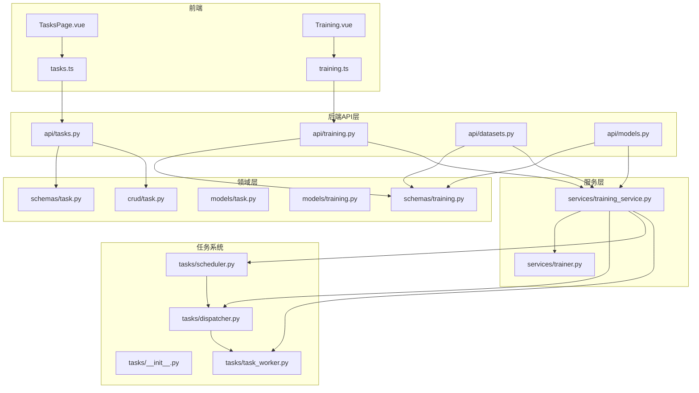
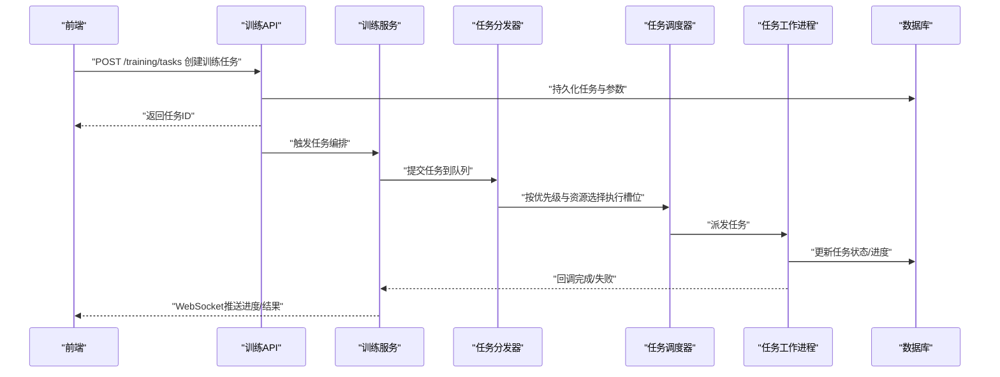
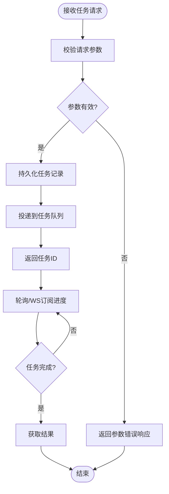
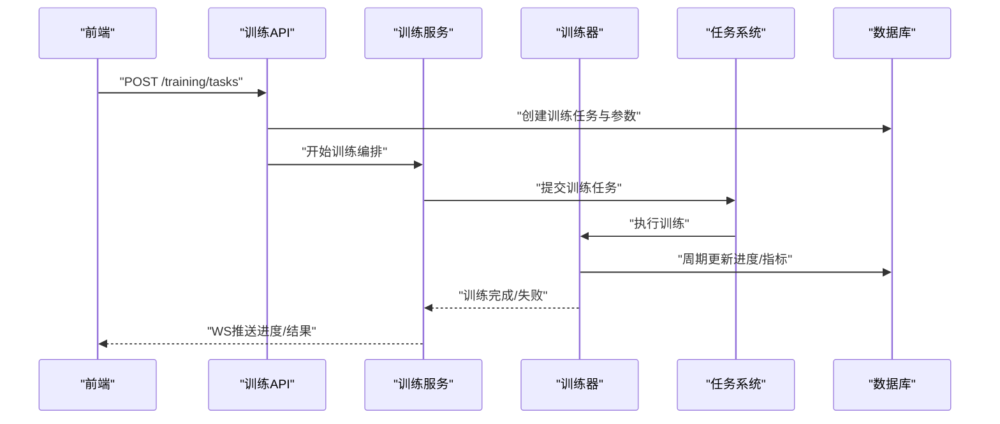
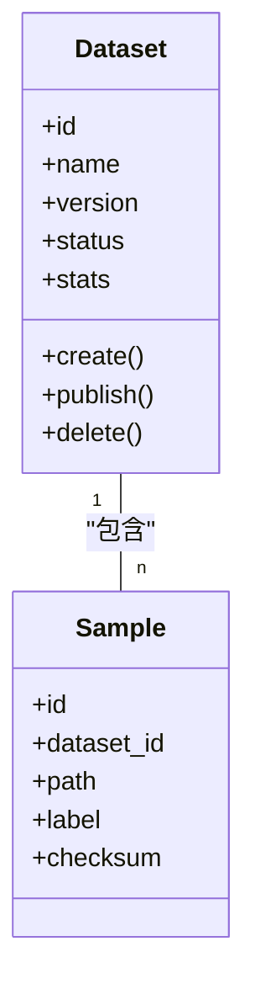
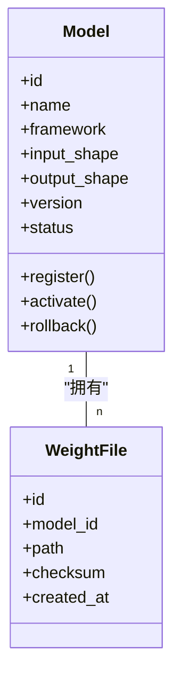
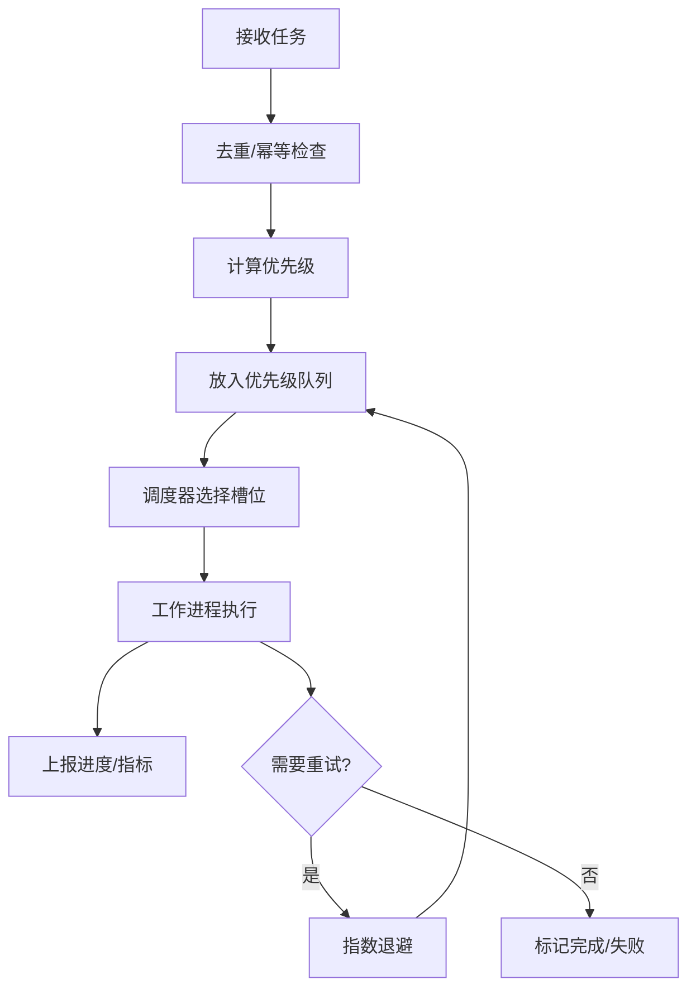
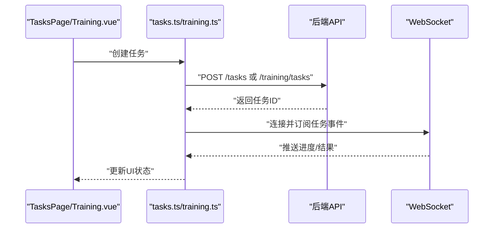
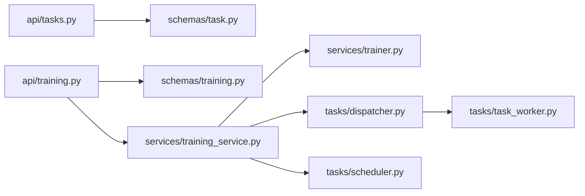

# 任务与训练接口

<cite>
**本文引用的文件**   
- [backend/app/api/tasks.py](file://backend/app/api/tasks.py)
- [backend/app/api/training.py](file://backend/app/api/training.py)
- [backend/app/api/datasets.py](file://backend/app/api/datasets.py)
- [backend/app/api/models.py](file://backend/app/api/models.py)
- [backend/app/schemas/task.py](file://backend/app/schemas/task.py)
- [backend/app/schemas/training.py](file://backend/app/schemas/training.py)
- [backend/app/models/task.py](file://backend/app/models/task.py)
- [backend/app/models/training.py](file://backend/app/models/training.py)
- [backend/app/crud/task.py](file://backend/app/crud/task.py)
- [backend/app/services/trainer.py](file://backend/app/services/trainer.py)
- [backend/app/services/training_service.py](file://backend/app/services/training_service.py)
- [backend/app/tasks/dispatcher.py](file://backend/app/tasks/dispatcher.py)
- [backend/app/tasks/scheduler.py](file://backend/app/tasks/scheduler.py)
- [backend/app/tasks/task_worker.py](file://backend/app/tasks/task_worker.py)
- [backend/app/tasks/__init__.py](file://backend/app/tasks/__init__.py)
- [backend/app/config/settings.py](file://backend/app/config/settings.py)
- [frontend/src/api/tasks.ts](file://frontend/src/api/tasks.ts)
- [frontend/src/api/training.ts](file://frontend/src/api/training.ts)
- [frontend/src/views/TasksPage.vue](file://frontend/src/views/TasksPage.vue)
- [frontend/src/views/Training.vue](file://frontend/src/views/Training.vue)
</cite>

## 目录
1. [简介](#简介)
2. [项目结构](#项目结构)
3. [核心组件](#核心组件)
4. [架构总览](#架构总览)
5. [详细组件分析](#详细组件分析)
6. [依赖关系分析](#依赖关系分析)
7. [性能考量](#性能考量)
8. [故障排查指南](#故障排查指南)
9. [结论](#结论)
10. [附录](#附录) 

## 简介
本文件面向开发者，系统化梳理“任务管理与模型训练API”模块的设计与实现，覆盖异步任务提交、进度查询、结果获取的接口调用；模型训练任务创建、数据集管理、训练参数配置；以及任务队列监控、错误重试、资源调度机制。文档同时给出长时间任务处理、WebSocket实时更新、任务优先级管理的策略建议，帮助快速集成AI任务处理方案。

## 项目结构
后端采用分层设计：API层暴露REST接口，Schema定义请求/响应结构，Model映射数据库表，CRUD封装数据访问，Services承载业务逻辑，Tasks提供异步任务执行与调度。前端通过TypeScript API客户端与Vue页面进行交互。

图表来源
- [backend/app/api/tasks.py](file://backend/app/api/tasks.py)
- [backend/app/api/training.py](file://backend/app/api/training.py)
- [backend/app/api/datasets.py](file://backend/app/api/datasets.py)
- [backend/app/api/models.py](file://backend/app/api/models.py)
- [backend/app/schemas/task.py](file://backend/app/schemas/task.py)
- [backend/app/schemas/training.py](file://backend/app/schemas/training.py)
- [backend/app/models/task.py](file://backend/app/models/task.py)
- [backend/app/models/training.py](file://backend/app/models/training.py)
- [backend/app/crud/task.py](file://backend/app/crud/task.py)
- [backend/app/services/trainer.py](file://backend/app/services/trainer.py)
- [backend/app/services/training_service.py](file://backend/app/services/training_service.py)
- [backend/app/tasks/dispatcher.py](file://backend/app/tasks/dispatcher.py)
- [backend/app/tasks/scheduler.py](file://backend/app/tasks/scheduler.py)
- [backend/app/tasks/task_worker.py](file://backend/app/tasks/task_worker.py)
- [backend/app/tasks/__init__.py](file://backend/app/tasks/__init__.py)

章节来源
- [backend/app/api/tasks.py](file://backend/app/api/tasks.py)
- [backend/app/api/training.py](file://backend/app/api/training.py)
- [backend/app/api/datasets.py](file://backend/app/api/datasets.py)
- [backend/app/api/models.py](file://backend/app/api/models.py)
- [backend/app/schemas/task.py](file://backend/app/schemas/task.py)
- [backend/app/schemas/training.py](file://backend/app/schemas/training.py)
- [backend/app/models/task.py](file://backend/app/models/task.py)
- [backend/app/models/training.py](file://backend/app/models/training.py)
- [backend/app/crud/task.py](file://backend/app/crud/task.py)
- [backend/app/services/trainer.py](file://backend/app/services/trainer.py)
- [backend/app/services/training_service.py](file://backend/app/services/training_service.py)
- [backend/app/tasks/dispatcher.py](file://backend/app/tasks/dispatcher.py)
- [backend/app/tasks/scheduler.py](file://backend/app/tasks/scheduler.py)
- [backend/app/tasks/task_worker.py](file://backend/app/tasks/task_worker.py)
- [backend/app/tasks/__init__.py](file://backend/app/tasks/__init__.py)

## 核心组件
- 任务API（tasks）：负责异步任务的创建、状态查询、结果获取、批量操作与列表过滤。
- 训练API（training）：负责训练任务生命周期管理（创建、启动、暂停、恢复、终止）、训练参数校验与持久化。
- 数据集API（datasets）：负责数据集注册、版本管理、样本清单维护、数据有效性检查。
- 模型API（models）：负责模型元信息登记、权重文件关联、模型版本切换与回滚。
- 任务系统（tasks/*）：包含任务分发器、调度器、工作进程，支撑异步执行、重试与资源隔离。
- 服务层（services/*）：封装训练编排、训练器调用、任务编排与状态同步。
- 前端API与视图：提供任务与训练的可视化界面与HTTP/WebSocket通信封装。

章节来源
- [backend/app/api/tasks.py](file://backend/app/api/tasks.py)
- [backend/app/api/training.py](file://backend/app/api/training.py)
- [backend/app/api/datasets.py](file://backend/app/api/datasets.py)
- [backend/app/api/models.py](file://backend/app/api/models.py)
- [backend/app/tasks/dispatcher.py](file://backend/app/tasks/dispatcher.py)
- [backend/app/tasks/scheduler.py](file://backend/app/tasks/scheduler.py)
- [backend/app/tasks/task_worker.py](file://backend/app/tasks/task_worker.py)
- [backend/app/services/training_service.py](file://backend/app/services/training_service.py)
- [backend/app/services/trainer.py](file://backend/app/services/trainer.py)
- [frontend/src/api/tasks.ts](file://frontend/src/api/tasks.ts)
- [frontend/src/api/training.ts](file://frontend/src/api/training.ts)
- [frontend/src/views/TasksPage.vue](file://frontend/src/views/TasksPage.vue)
- [frontend/src/views/Training.vue](file://frontend/src/views/Training.vue)

## 架构总览
整体流程围绕“任务即训练”的理念展开：前端发起训练或通用任务请求，后端API校验并落库，服务层将任务投递至任务系统，调度器根据资源与优先级分配至工作进程执行，执行过程中更新任务状态与进度，最终返回结果或通过WebSocket推送实时事件。

图表来源
- [backend/app/api/training.py](file://backend/app/api/training.py)
- [backend/app/services/training_service.py](file://backend/app/services/training_service.py)
- [backend/app/tasks/dispatcher.py](file://backend/app/tasks/dispatcher.py)
- [backend/app/tasks/scheduler.py](file://backend/app/tasks/scheduler.py)
- [backend/app/tasks/task_worker.py](file://backend/app/tasks/task_worker.py)
- [backend/app/models/training.py](file://backend/app/models/training.py)

## 详细组件分析

### 任务API（tasks）
- 职责
  - 提供任务创建、查询、取消、批量操作等REST接口。
  - 统一任务状态机：待处理、运行中、成功、失败、已取消。
  - 支持分页、过滤、排序与导出。
- 关键流程
  - 创建任务：校验入参、写入任务记录、投递至任务系统。
  - 查询进度：从数据库读取最新状态与进度字段。
  - 获取结果：根据任务类型返回结构化结果或下载链接。
- 错误处理
  - 参数校验失败返回明确错误码。
  - 任务不存在或权限不足返回相应提示。
  - 内部异常转换为标准响应格式。

图表来源
- [backend/app/api/tasks.py](file://backend/app/api/tasks.py)
- [backend/app/schemas/task.py](file://backend/app/schemas/task.py)
- [backend/app/models/task.py](file://backend/app/models/task.py)
- [backend/app/crud/task.py](file://backend/app/crud/task.py)
- [backend/app/tasks/dispatcher.py](file://backend/app/tasks/dispatcher.py)

章节来源
- [backend/app/api/tasks.py](file://backend/app/api/tasks.py)
- [backend/app/schemas/task.py](file://backend/app/schemas/task.py)
- [backend/app/models/task.py](file://backend/app/models/task.py)
- [backend/app/crud/task.py](file://backend/app/crud/task.py)
- [backend/app/tasks/dispatcher.py](file://backend/app/tasks/dispatcher.py)

### 训练API（training）
- 职责
  - 训练任务全生命周期管理：创建、启动、暂停、恢复、终止。
  - 训练参数校验与默认值填充。
  - 与数据集、模型、日志、指标存储对接。
- 关键流程
  - 创建训练任务：校验数据集与模型存在性，生成训练配置，落库。
  - 启动训练：将训练任务投递至任务系统，绑定GPU/CPU资源。
  - 进度上报：工作进程周期性更新进度、损失、指标。
  - 结果产出：保存权重、日志、评估报告，更新任务状态为成功。
- 错误处理
  - 资源不足时排队或拒绝。
  - 训练异常捕获并记录，支持自动重试或人工干预。

图表来源
- [backend/app/api/training.py](file://backend/app/api/training.py)
- [backend/app/services/training_service.py](file://backend/app/services/training_service.py)
- [backend/app/services/trainer.py](file://backend/app/services/trainer.py)
- [backend/app/tasks/dispatcher.py](file://backend/app/tasks/dispatcher.py)
- [backend/app/models/training.py](file://backend/app/models/training.py)

章节来源
- [backend/app/api/training.py](file://backend/app/api/training.py)
- [backend/app/services/training_service.py](file://backend/app/services/training_service.py)
- [backend/app/services/trainer.py](file://backend/app/services/trainer.py)
- [backend/app/models/training.py](file://backend/app/models/training.py)

### 数据集API（datasets）
- 职责
  - 数据集注册、版本管理、样本清单维护。
  - 数据有效性检查（标签完整性、类别分布、重复检测）。
  - 提供训练任务的数据源引用。
- 关键流程
  - 上传/导入样本：校验格式、生成索引、统计信息。
  - 版本发布：冻结快照，供训练任务锁定使用。
  - 删除与回收：软删除与清理策略。

图表来源
- [backend/app/api/datasets.py](file://backend/app/api/datasets.py)
- [backend/app/schemas/training.py](file://backend/app/schemas/training.py)
- [backend/app/models/training.py](file://backend/app/models/training.py)

章节来源
- [backend/app/api/datasets.py](file://backend/app/api/datasets.py)
- [backend/app/schemas/training.py](file://backend/app/schemas/training.py)
- [backend/app/models/training.py](file://backend/app/models/training.py)

### 模型API（models）
- 职责
  - 模型元信息登记（名称、框架、输入输出形状、依赖）。
  - 权重文件关联与版本管理。
  - 模型切换与回滚。
- 关键流程
  - 注册模型：填写元信息，上传权重，生成指纹。
  - 激活模型：设置当前可用版本。
  - 删除模型：清理权重与缓存。

图表来源
- [backend/app/api/models.py](file://backend/app/api/models.py)
- [backend/app/schemas/training.py](file://backend/app/schemas/training.py)
- [backend/app/models/training.py](file://backend/app/models/training.py)

章节来源
- [backend/app/api/models.py](file://backend/app/api/models.py)
- [backend/app/schemas/training.py](file://backend/app/schemas/training.py)
- [backend/app/models/training.py](file://backend/app/models/training.py)

### 任务系统（dispatcher/scheduler/worker）
- 职责
  - 分发器：接收任务、路由到合适队列、去重与幂等。
  - 调度器：基于资源与优先级选择执行槽位，避免过载。
  - 工作进程：执行具体任务、上报进度、处理异常与重试。
- 关键特性
  - 优先级队列：高优先级优先调度。
  - 资源隔离：CPU/GPU配额限制与抢占策略。
  - 错误重试：指数退避与最大重试次数。
  - 心跳与超时：长任务保活与失败判定。

图表来源
- [backend/app/tasks/dispatcher.py](file://backend/app/tasks/dispatcher.py)
- [backend/app/tasks/scheduler.py](file://backend/app/tasks/scheduler.py)
- [backend/app/tasks/task_worker.py](file://backend/app/tasks/task_worker.py)
- [backend/app/tasks/__init__.py](file://backend/app/tasks/__init__.py)

章节来源
- [backend/app/tasks/dispatcher.py](file://backend/app/tasks/dispatcher.py)
- [backend/app/tasks/scheduler.py](file://backend/app/tasks/scheduler.py)
- [backend/app/tasks/task_worker.py](file://backend/app/tasks/task_worker.py)
- [backend/app/tasks/__init__.py](file://backend/app/tasks/__init__.py)

### 前端集成（API与视图）
- 职责
  - 封装HTTP与WebSocket调用，提供任务与训练的统一客户端。
  - 渲染任务列表、进度条、结果展示与操作按钮。
- 关键流程
  - 创建任务：调用后端API，显示任务卡片。
  - 轮询/WS：订阅任务进度，实时更新UI。
  - 结果下载：根据任务类型提供下载入口。

图表来源
- [frontend/src/api/tasks.ts](file://frontend/src/api/tasks.ts)
- [frontend/src/api/training.ts](file://frontend/src/api/training.ts)
- [frontend/src/views/TasksPage.vue](file://frontend/src/views/TasksPage.vue)
- [frontend/src/views/Training.vue](file://frontend/src/views/Training.vue)

章节来源
- [frontend/src/api/tasks.ts](file://frontend/src/api/tasks.ts)
- [frontend/src/api/training.ts](file://frontend/src/api/training.ts)
- [frontend/src/views/TasksPage.vue](file://frontend/src/views/TasksPage.vue)
- [frontend/src/views/Training.vue](file://frontend/src/views/Training.vue)

## 依赖关系分析
- API层依赖Schema与CRUD，服务层依赖任务系统与训练器。
- 任务系统内部解耦：分发器不关心执行细节，调度器只关注资源与优先级，工作进程专注执行与上报。
- 前端仅依赖HTTP与WebSocket，屏蔽后端实现差异。

图表来源
- [backend/app/api/tasks.py](file://backend/app/api/tasks.py)
- [backend/app/api/training.py](file://backend/app/api/training.py)
- [backend/app/schemas/task.py](file://backend/app/schemas/task.py)
- [backend/app/schemas/training.py](file://backend/app/schemas/training.py)
- [backend/app/services/training_service.py](file://backend/app/services/training_service.py)
- [backend/app/services/trainer.py](file://backend/app/services/trainer.py)
- [backend/app/tasks/dispatcher.py](file://backend/app/tasks/dispatcher.py)
- [backend/app/tasks/scheduler.py](file://backend/app/tasks/scheduler.py)
- [backend/app/tasks/task_worker.py](file://backend/app/tasks/task_worker.py)

章节来源
- [backend/app/api/tasks.py](file://backend/app/api/tasks.py)
- [backend/app/api/training.py](file://backend/app/api/training.py)
- [backend/app/schemas/task.py](file://backend/app/schemas/task.py)
- [backend/app/schemas/training.py](file://backend/app/schemas/training.py)
- [backend/app/services/training_service.py](file://backend/app/services/training_service.py)
- [backend/app/services/trainer.py](file://backend/app/services/trainer.py)
- [backend/app/tasks/dispatcher.py](file://backend/app/tasks/dispatcher.py)
- [backend/app/tasks/scheduler.py](file://backend/app/tasks/scheduler.py)
- [backend/app/tasks/task_worker.py](file://backend/app/tasks/task_worker.py)

## 性能考量
- 批处理与流式处理：大批量任务拆分批次，减少单次负载。
- 资源配额与限流：按GPU/CPU配额限制并发，防止过载。
- 进度上报频率：合理控制上报间隔，平衡实时性与开销。
- 结果缓存与增量更新：对频繁查询的结果进行缓存，降低数据库压力。
- 长任务保活：心跳机制与超时判定，避免僵尸任务。

[本节为通用指导，无需代码来源]

## 故障排查指南
- 常见问题
  - 任务卡住：检查工作进程心跳、资源占用与队列堆积。
  - 训练失败：查看训练日志、损失曲线与错误堆栈。
  - 进度不同步：确认数据库事务与WS推送链路。
- 定位步骤
  - 通过任务ID检索数据库记录，核对状态与进度字段。
  - 查看任务系统日志，确认分发与调度是否异常。
  - 检查工作进程健康状态与重试计数。
  - 验证数据集与模型路径、权限与完整性。

章节来源
- [backend/app/tasks/task_worker.py](file://backend/app/tasks/task_worker.py)
- [backend/app/tasks/dispatcher.py](file://backend/app/tasks/dispatcher.py)
- [backend/app/tasks/scheduler.py](file://backend/app/tasks/scheduler.py)
- [backend/app/models/task.py](file://backend/app/models/task.py)
- [backend/app/models/training.py](file://backend/app/models/training.py)

## 结论
本模块以“任务即训练”为核心，构建了从API到任务系统的完整闭环。通过优先级调度、资源隔离、错误重试与WebSocket实时更新，实现了稳定高效的AI任务处理能力。建议在生产环境完善监控告警、审计日志与容量规划，确保长期稳定运行。

[本节为总结，无需代码来源]

## 附录

### 接口速览（任务）
- 创建任务：POST /tasks
- 查询任务：GET /tasks/{id}
- 任务列表：GET /tasks?status=&page=&size=
- 取消任务：POST /tasks/{id}/cancel
- 获取结果：GET /tasks/{id}/result

章节来源
- [backend/app/api/tasks.py](file://backend/app/api/tasks.py)
- [backend/app/schemas/task.py](file://backend/app/schemas/task.py)
- [backend/app/models/task.py](file://backend/app/models/task.py)
- [backend/app/crud/task.py](file://backend/app/crud/task.py)

### 接口速览（训练）
- 创建训练任务：POST /training/tasks
- 启动训练：POST /training/tasks/{id}/start
- 暂停训练：POST /training/tasks/{id}/pause
- 恢复训练：POST /training/tasks/{id}/resume
- 终止训练：POST /training/tasks/{id}/stop
- 查询训练进度：GET /training/tasks/{id}/progress
- 获取训练结果：GET /training/tasks/{id}/result

章节来源
- [backend/app/api/training.py](file://backend/app/api/training.py)
- [backend/app/schemas/training.py](file://backend/app/schemas/training.py)
- [backend/app/models/training.py](file://backend/app/models/training.py)
- [backend/app/services/training_service.py](file://backend/app/services/training_service.py)

### 数据集与模型管理
- 数据集
  - 注册数据集：POST /datasets
  - 发布版本：POST /datasets/{id}/publish
  - 删除数据集：DELETE /datasets/{id}
- 模型
  - 注册模型：POST /models
  - 激活版本：POST /models/{id}/activate
  - 回滚版本：POST /models/{id}/rollback

章节来源
- [backend/app/api/datasets.py](file://backend/app/api/datasets.py)
- [backend/app/api/models.py](file://backend/app/api/models.py)
- [backend/app/schemas/training.py](file://backend/app/schemas/training.py)
- [backend/app/models/training.py](file://backend/app/models/training.py)

### 配置与环境
- 任务系统相关配置项（示例键名）
  - 队列大小、最大并发、重试次数、退避策略、心跳间隔、超时阈值、资源配额（CPU/GPU）。
- 训练相关配置项（示例键名）
  - 学习率、批次大小、迭代次数、早停策略、日志路径、权重保存路径。

章节来源
- [backend/app/config/settings.py](file://backend/app/config/settings.py)
- [backend/app/services/training_service.py](file://backend/app/services/training_service.py)
- [backend/app/services/trainer.py](file://backend/app/services/trainer.py)