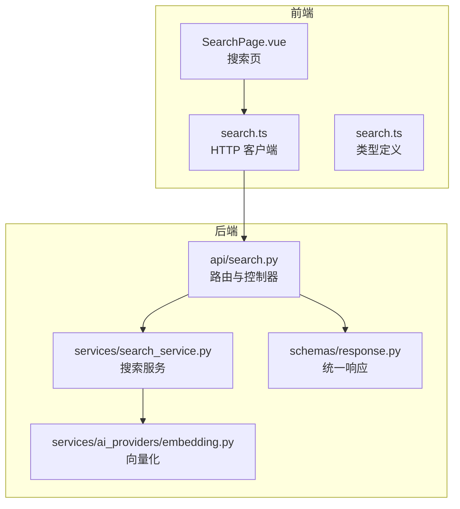
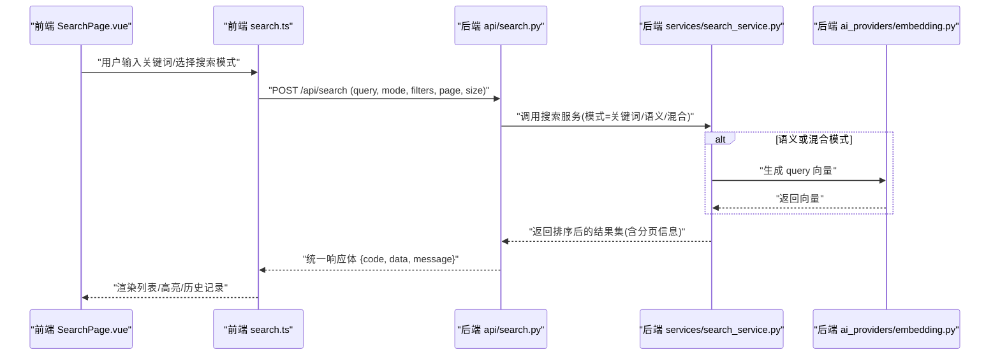
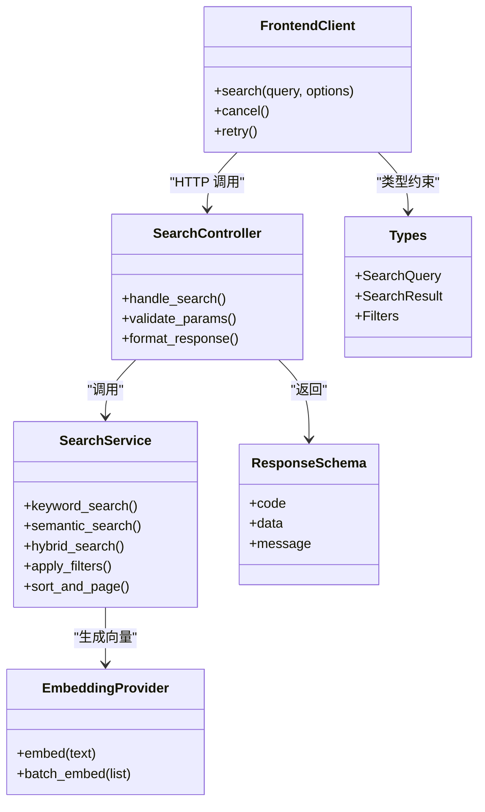

# 搜索功能接口

<cite>
**本文引用的文件**   
- [backend/app/api/search.py](file://backend/app/api/search.py)
- [backend/app/services/search_service.py](file://backend/app/services/search_service.py)
- [backend/app/services/ai_providers/embedding.py](file://backend/app/services/ai_providers/embedding.py)
- [backend/app/schemas/response.py](file://backend/app/schemas/response.py)
- [frontend/src/api/search.ts](file://frontend/src/api/search.ts)
- [frontend/src/types/search.ts](file://frontend/src/types/search.ts)
- [frontend/src/views/SearchPage.vue](file://frontend/src/views/SearchPage.vue)
</cite>

## 目录
1. [简介](#简介)
2. [项目结构](#项目结构)
3. [核心组件](#核心组件)
4. [架构总览](#架构总览)
5. [详细组件分析](#详细组件分析)
6. [依赖关系分析](#依赖关系分析)
7. [性能考虑](#性能考虑)
8. [故障排查指南](#故障排查指南)
9. [结论](#结论)
10. [附录](#附录)

## 简介
本文件面向开发者，系统化梳理并文档化“搜索功能API模块”，覆盖关键词搜索、语义搜索与混合搜索的接口调用方式；详细说明搜索条件构建、结果排序、分页加载机制；并提供高级筛选、搜索结果高亮、搜索历史管理、性能优化、缓存策略与实时搜索实现建议。目标是帮助前端与后端工程师快速集成强大且稳定的搜索体验。

## 项目结构
搜索相关代码主要分布在以下位置：
- 后端 API 层：定义路由与请求/响应处理
- 后端服务层：封装搜索业务逻辑（关键词、向量检索、混合排序等）
- AI 提供者：负责文本/图像向量化
- 前端 API 客户端：封装 HTTP 调用与类型定义
- 前端视图：搜索页面交互与展示

图表来源
- [backend/app/api/search.py](file://backend/app/api/search.py)
- [backend/app/services/search_service.py](file://backend/app/services/search_service.py)
- [backend/app/services/ai_providers/embedding.py](file://backend/app/services/ai_providers/embedding.py)
- [backend/app/schemas/response.py](file://backend/app/schemas/response.py)
- [frontend/src/api/search.ts](file://frontend/src/api/search.ts)
- [frontend/src/types/search.ts](file://frontend/src/types/search.ts)
- [frontend/src/views/SearchPage.vue](file://frontend/src/views/SearchPage.vue)

章节来源
- [backend/app/api/search.py](file://backend/app/api/search.py)
- [backend/app/services/search_service.py](file://backend/app/services/search_service.py)
- [backend/app/services/ai_providers/embedding.py](file://backend/app/services/ai_providers/embedding.py)
- [backend/app/schemas/response.py](file://backend/app/schemas/response.py)
- [frontend/src/api/search.ts](file://frontend/src/api/search.ts)
- [frontend/src/types/search.ts](file://frontend/src/types/search.ts)
- [frontend/src/views/SearchPage.vue](file://frontend/src/views/SearchPage.vue)

## 核心组件
- 搜索 API 控制器：提供统一的搜索入口，解析查询参数、校验输入、转发至服务层，并返回统一格式响应。
- 搜索服务：实现关键词匹配、语义检索（基于向量相似度）、混合排序（加权融合），以及分页与排序策略。
- 向量化提供者：将自然语言或图片描述转换为向量，供语义检索使用。
- 统一响应模型：对外暴露一致的 JSON 结构，便于前端消费。
- 前端搜索客户端：封装请求、错误处理、重试与取消令牌，支持分页与增量更新。
- 搜索类型定义：前后端共享的数据契约，确保字段一致。

章节来源
- [backend/app/api/search.py](file://backend/app/api/search.py)
- [backend/app/services/search_service.py](file://backend/app/services/search_service.py)
- [backend/app/services/ai_providers/embedding.py](file://backend/app/services/ai_providers/embedding.py)
- [backend/app/schemas/response.py](file://backend/app/schemas/response.py)
- [frontend/src/api/search.ts](file://frontend/src/api/search.ts)
- [frontend/src/types/search.ts](file://frontend/src/types/search.ts)

## 架构总览
搜索流程从前端发起请求开始，经 API 控制器进入服务层，根据搜索模式选择关键词或向量检索路径，必要时调用向量化提供者生成嵌入向量，最终按规则排序并分页返回。

图表来源
- [backend/app/api/search.py](file://backend/app/api/search.py)
- [backend/app/services/search_service.py](file://backend/app/services/search_service.py)
- [backend/app/services/ai_providers/embedding.py](file://backend/app/services/ai_providers/embedding.py)
- [frontend/src/views/SearchPage.vue](file://frontend/src/views/SearchPage.vue)
- [frontend/src/api/search.ts](file://frontend/src/api/search.ts)

## 详细组件分析

### 搜索 API 控制器（后端）
职责
- 接收并校验搜索请求参数（关键词、模式、筛选、分页、排序）。
- 调用搜索服务执行具体检索逻辑。
- 包装为统一响应格式返回。

关键能力
- 模式控制：关键词、语义、混合。
- 参数校验：非空、范围限制、枚举值校验。
- 分页与排序：支持页码、每页大小、排序字段与方向。
- 统一响应：遵循 schemas/response.py 的结构。

章节来源
- [backend/app/api/search.py](file://backend/app/api/search.py)
- [backend/app/schemas/response.py](file://backend/app/schemas/response.py)

### 搜索服务（后端）
职责
- 实现三种搜索模式的核心逻辑：
  - 关键词搜索：基于倒排索引或全文检索引擎进行匹配。
  - 语义搜索：通过 embedding 获取 query 向量，在向量库中做相似度检索。
  - 混合搜索：融合关键词得分与语义相似度得分，按权重计算最终排序。
- 应用高级筛选：时间范围、标签、地点、人脸等维度过滤。
- 排序与分页：支持多字段排序、游标/偏移分页。

数据结构与复杂度
- 候选集规模 N：关键词阶段 O(N) 扫描或倒排合并；向量检索近似最近邻 O(logN) 或 O(N) 取决于索引。
- 混合排序：对候选集打分与归一化，O(K log K)，K 为候选数量。
- 空间复杂度：存储倒排索引与向量索引，随数据量线性增长。

容错与降级
- 当向量化失败时，自动回退到关键词搜索。
- 向量库不可用时，降级为纯关键词检索。
- 超时与限流保护，避免雪崩。

章节来源
- [backend/app/services/search_service.py](file://backend/app/services/search_service.py)
- [backend/app/services/ai_providers/embedding.py](file://backend/app/services/ai_providers/embedding.py)

### 向量化提供者（AI 提供者）
职责
- 将自然语言 query 或图片描述转换为固定维度的向量。
- 支持多种模型配置与切换。
- 提供缓存键生成与失效策略。

性能要点
- 批量向量化与异步任务队列。
- 结果缓存：以 query 指纹为键，减少重复计算。
- 模型热切换与版本兼容。

章节来源
- [backend/app/services/ai_providers/embedding.py](file://backend/app/services/ai_providers/embedding.py)

### 统一响应模型
职责
- 定义标准响应结构：状态码、数据体、消息提示。
- 便于前端统一处理成功与异常分支。

章节来源
- [backend/app/schemas/response.py](file://backend/app/schemas/response.py)

### 前端搜索客户端
职责
- 封装 HTTP 请求，支持取消令牌、重试与节流。
- 维护搜索历史与常用词。
- 分页加载与无限滚动。
- 结果高亮与片段截取。

章节来源
- [frontend/src/api/search.ts](file://frontend/src/api/search.ts)
- [frontend/src/types/search.ts](file://frontend/src/types/search.ts)

### 搜索页面（前端）
职责
- 提供搜索框、模式切换、筛选面板、结果网格与详情抽屉。
- 管理本地搜索历史与收藏。
- 触发实时搜索（防抖）与增量加载。

章节来源
- [frontend/src/views/SearchPage.vue](file://frontend/src/views/SearchPage.vue)

## 依赖关系分析
- 控制器依赖服务层与响应模型。
- 服务层依赖向量化提供者与外部检索引擎（如向量数据库/全文检索）。
- 前端依赖 TypeScript 类型定义与 HTTP 客户端。

图表来源
- [backend/app/api/search.py](file://backend/app/api/search.py)
- [backend/app/services/search_service.py](file://backend/app/services/search_service.py)
- [backend/app/services/ai_providers/embedding.py](file://backend/app/services/ai_providers/embedding.py)
- [backend/app/schemas/response.py](file://backend/app/schemas/response.py)
- [frontend/src/api/search.ts](file://frontend/src/api/search.ts)
- [frontend/src/types/search.ts](file://frontend/src/types/search.ts)

## 性能考虑
- 索引优化
  - 关键词：建立高效倒排索引，启用前缀匹配与同义词扩展。
  - 语义：采用 HNSW/IVF 等近似最近邻索引，平衡召回率与延迟。
- 缓存策略
  - 查询级缓存：对稳定 query 指纹命中缓存，设置合理 TTL。
  - 结果级缓存：热门结果短期缓存，结合版本号失效。
  - 向量化缓存：相同文本复用向量，降低 LLM/Embedding 成本。
- 并发与限流
  - 服务端限流与熔断，防止热点查询打满资源。
  - 前端节流与去抖，避免频繁请求。
- 分页与增量
  - 优先使用游标分页，避免深翻页性能问题。
  - 增量更新：仅拉取新增/变更条目。
- 实时搜索
  - 前端防抖（例如 200-300ms），后端短轮询或 SSE/WS 推送变更。
  - 预取与预计算：对高频词提前生成向量与中间结果。

[本节为通用性能指导，不直接分析具体文件]

## 故障排查指南
常见问题与定位步骤
- 无结果或结果不准确
  - 检查关键词分词与停用词配置。
  - 验证向量维度与模型版本是否一致。
  - 确认筛选条件是否过严导致空集。
- 延迟过高
  - 查看向量检索耗时与索引命中率。
  - 评估候选集规模与排序开销。
  - 检查网络与下游服务可用性。
- 缓存未生效
  - 核对缓存键生成规则与 TTL。
  - 观察缓存命中率与失效事件。
- 前端报错
  - 检查请求头、鉴权与跨域配置。
  - 确认取消令牌与重试策略是否正确。

章节来源
- [backend/app/api/search.py](file://backend/app/api/search.py)
- [backend/app/services/search_service.py](file://backend/app/services/search_service.py)
- [backend/app/services/ai_providers/embedding.py](file://backend/app/services/ai_providers/embedding.py)
- [frontend/src/api/search.ts](file://frontend/src/api/search.ts)

## 结论
本模块通过清晰的三层架构（API 控制器、搜索服务、向量化提供者）实现了关键词、语义与混合搜索的统一入口，配合统一响应模型与前端客户端，形成端到端的搜索链路。借助索引优化、多级缓存、分页与实时机制，可在保证准确性的同时获得良好的性能与用户体验。建议在上线前完成压测与回归测试，并根据业务特征调优权重与阈值。

[本节为总结性内容，不直接分析具体文件]

## 附录

### 接口规范（建议）
- 基础路径
  - POST /api/search
- 请求体字段（示例）
  - query: string，必填，搜索关键词
  - mode: enum，可选，取值 ["keyword", "semantic", "hybrid"]，默认 "hybrid"
  - filters: object，可选，包含时间范围、标签、地点、人脸等
  - sort: object，可选，包含字段与方向
  - page: number，可选，默认 1
  - size: number，可选，默认 20，最大受服务端限制
- 响应体结构（遵循统一响应模型）
  - code: number
  - data: object，包含 results 数组与 pagination 对象
  - message: string

章节来源
- [backend/app/api/search.py](file://backend/app/api/search.py)
- [backend/app/schemas/response.py](file://backend/app/schemas/response.py)

### 搜索条件构建与排序
- 条件构建
  - 关键词：支持短语、通配符、布尔操作（若引擎支持）。
  - 语义：支持上下文增强与意图识别。
  - 混合：可配置关键词权重与语义权重。
- 排序策略
  - 多字段排序：相关性、时间、热度等。
  - 自定义评分：业务规则与学习排序结合。

章节来源
- [backend/app/services/search_service.py](file://backend/app/services/search_service.py)

### 分页加载机制
- 偏移分页：适用于小数据集与简单场景。
- 游标分页：适用于大数据集与无限滚动。
- 增量加载：基于时间戳或版本号拉取变更。

章节来源
- [backend/app/services/search_service.py](file://backend/app/services/search_service.py)
- [frontend/src/api/search.ts](file://frontend/src/api/search.ts)

### 高级筛选
- 时间范围：起止时间、相对时间（近一周/一月）。
- 标签/分类：多选与层级筛选。
- 地点：经纬度范围、城市/国家。
- 人脸：指定人物或排除特定人物。

章节来源
- [backend/app/services/search_service.py](file://backend/app/services/search_service.py)

### 搜索结果高亮
- 关键词高亮：在标题/摘要中加粗或着色。
- 片段截取：返回命中片段与上下文。
- 前端渲染：安全转义与样式隔离。

章节来源
- [frontend/src/api/search.ts](file://frontend/src/api/search.ts)
- [frontend/src/views/SearchPage.vue](file://frontend/src/views/SearchPage.vue)

### 搜索历史管理
- 本地存储：记录最近搜索词与常用词。
- 云端同步：登录态下跨设备同步。
- 隐私控制：允许清空与导出。

章节来源
- [frontend/src/api/search.ts](file://frontend/src/api/search.ts)
- [frontend/src/views/SearchPage.vue](file://frontend/src/views/SearchPage.vue)

### 实时搜索实现
- 前端防抖：减少无效请求。
- 后端增量：SSE/WS 推送变更，或短轮询。
- 预取与预热：对高频词提前计算。

章节来源
- [frontend/src/api/search.ts](file://frontend/src/api/search.ts)
- [backend/app/services/search_service.py](file://backend/app/services/search_service.py)