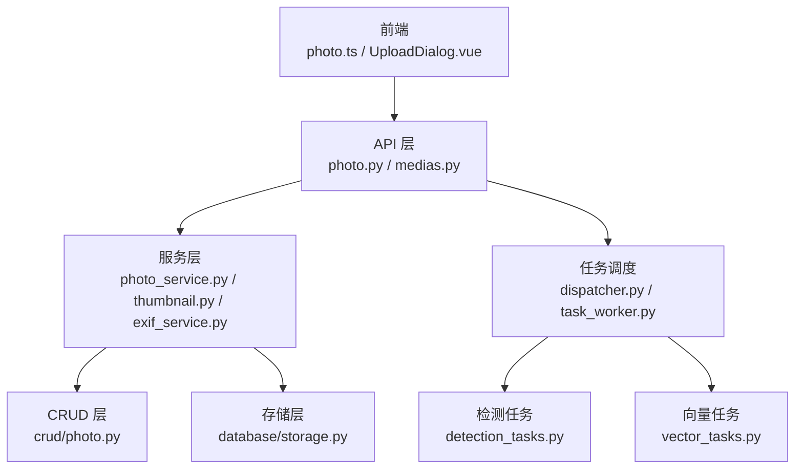
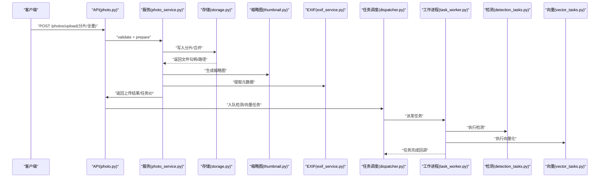
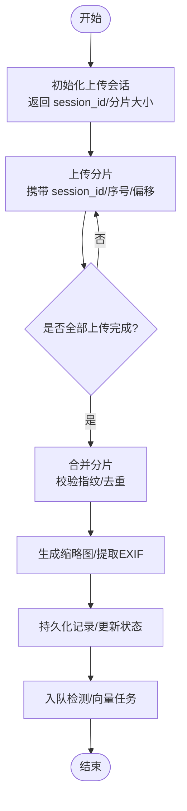
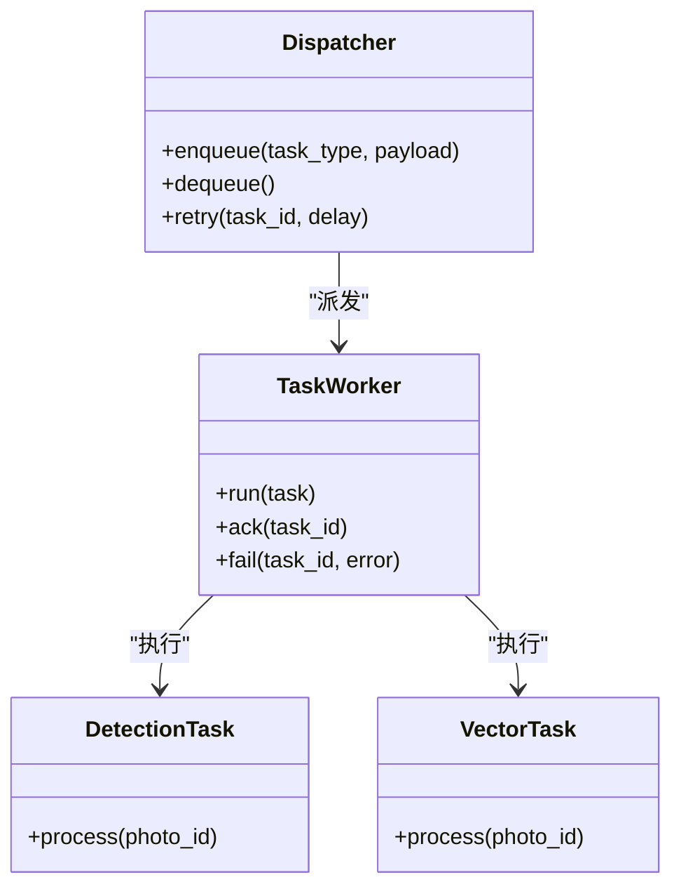
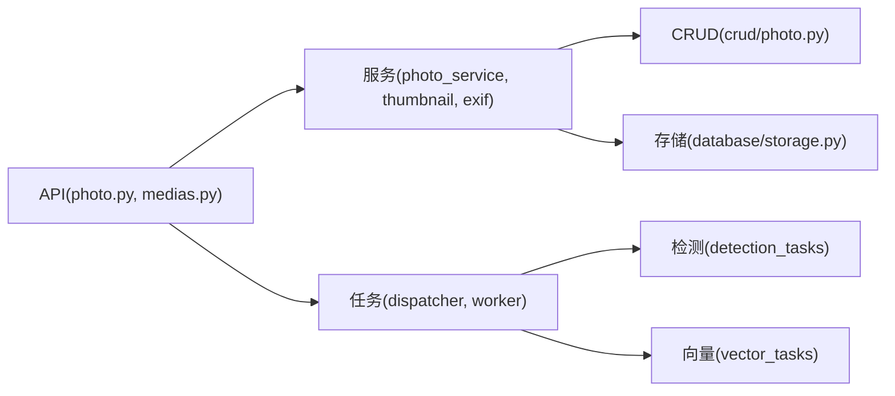

# 照片管理接口

<cite>
**本文引用的文件**   
- [backend/app/api/photo.py](file://backend/app/api/photo.py)
- [backend/app/api/medias.py](file://backend/app/api/medias.py)
- [backend/app/services/photo_service.py](file://backend/app/services/photo_service.py)
- [backend/app/services/thumbnail.py](file://backend/app/services/thumbnail.py)
- [backend/app/services/exif_service.py](file://backend/app/services/exif_service.py)
- [backend/app/crud/photo.py](file://backend/app/crud/photo.py)
- [backend/app/models/photo.py](file://backend/app/models/photo.py)
- [backend/app/schemas/photo.py](file://backend/app/schemas/photo.py)
- [backend/app/database/storage.py](file://backend/app/database/storage.py)
- [backend/app/tasks/detection_tasks.py](file://backend/app/tasks/detection_tasks.py)
- [backend/app/tasks/vector_tasks.py](file://backend/app/tasks/vector_tasks.py)
- [backend/app/tasks/dispatcher.py](file://backend/app/tasks/dispatcher.py)
- [backend/app/tasks/task_worker.py](file://backend/app/tasks/task_worker.py)
- [backend/app/core/exceptions.py](file://backend/app/core/exceptions.py)
- [backend/app/core/logger.py](file://backend/app/core/logger.py)
- [frontend/src/api/photo.ts](file://frontend/src/api/photo.ts)
- [frontend/src/components/photo/UploadDialog.vue](file://frontend/src/components/photo/UploadDialog.vue)
</cite>

## 目录
1. [简介](#简介)
2. [项目结构](#项目结构)
3. [核心组件](#核心组件)
4. [架构总览](#架构总览)
5. [详细组件分析](#详细组件分析)
6. [依赖关系分析](#依赖关系分析)
7. [性能与并发优化](#性能与并发优化)
8. [故障排查指南](#故障排查指南)
9. [结论](#结论)
10. [附录：API 参考](#附录api-参考)

## 简介
本文件面向开发者，系统化梳理“照片管理”模块的 API 设计与实现，覆盖上传、下载、删除、批量操作、分片上传、进度跟踪、断点续传、元数据获取、缩略图生成与格式转换等能力。文档同时给出大文件处理优化、并发控制与错误恢复策略，帮助快速集成并稳定运行。

## 项目结构
后端采用分层架构：API 层暴露 RESTful 接口；服务层封装业务逻辑（上传、缩略图、EXIF、向量索引等）；持久化层通过 CRUD 与模型访问数据库；任务队列异步执行耗时任务（人脸检测、向量化等）。前端提供上传对话框与调用封装。

图表来源
- [backend/app/api/photo.py](file://backend/app/api/photo.py)
- [backend/app/api/medias.py](file://backend/app/api/medias.py)
- [backend/app/services/photo_service.py](file://backend/app/services/photo_service.py)
- [backend/app/services/thumbnail.py](file://backend/app/services/thumbnail.py)
- [backend/app/services/exif_service.py](file://backend/app/services/exif_service.py)
- [backend/app/crud/photo.py](file://backend/app/crud/photo.py)
- [backend/app/database/storage.py](file://backend/app/database/storage.py)
- [backend/app/tasks/dispatcher.py](file://backend/app/tasks/dispatcher.py)
- [backend/app/tasks/task_worker.py](file://backend/app/tasks/task_worker.py)
- [backend/app/tasks/detection_tasks.py](file://backend/app/tasks/detection_tasks.py)
- [backend/app/tasks/vector_tasks.py](file://backend/app/tasks/vector_tasks.py)

章节来源
- [backend/app/api/photo.py](file://backend/app/api/photo.py)
- [backend/app/api/medias.py](file://backend/app/api/medias.py)
- [backend/app/services/photo_service.py](file://backend/app/services/photo_service.py)
- [backend/app/services/thumbnail.py](file://backend/app/services/thumbnail.py)
- [backend/app/services/exif_service.py](file://backend/app/services/exif_service.py)
- [backend/app/crud/photo.py](file://backend/app/crud/photo.py)
- [backend/app/models/photo.py](file://backend/app/models/photo.py)
- [backend/app/schemas/photo.py](file://backend/app/schemas/photo.py)
- [backend/app/database/storage.py](file://backend/app/database/storage.py)
- [backend/app/tasks/dispatcher.py](file://backend/app/tasks/dispatcher.py)
- [backend/app/tasks/task_worker.py](file://backend/app/tasks/task_worker.py)
- [backend/app/tasks/detection_tasks.py](file://backend/app/tasks/detection_tasks.py)
- [backend/app/tasks/vector_tasks.py](file://backend/app/tasks/vector_tasks.py)
- [frontend/src/api/photo.ts](file://frontend/src/api/photo.ts)
- [frontend/src/components/photo/UploadDialog.vue](file://frontend/src/components/photo/UploadDialog.vue)

## 核心组件
- 路由与控制器
  - 照片主接口：创建、查询、更新、删除、批量操作、分片上传、进度查询、断点续传、下载、缩略图、元数据读取、格式转换等。
  - 媒体通用接口：统一的文件流式下载、预览、类型校验等。
- 服务层
  - 照片服务：编排上传流程、分片合并、元数据提取、缩略图生成、格式转换、索引构建。
  - 缩略图服务：尺寸计算、缓存策略、质量与格式选择。
  - EXIF 服务：解析拍摄信息、GPS、相机参数等。
- 持久化层
  - 模型：照片实体字段定义（路径、尺寸、格式、哈希、状态等）。
  - CRUD：增删改查、分页、过滤、聚合统计。
  - 存储：对象存储抽象（本地磁盘或云存储），支持分片写入与原子落盘。
- 任务系统
  - 调度器与工作进程：异步执行人脸检测、特征向量化、标签抽取等。
  - 任务类型：检测任务、向量任务等。

章节来源
- [backend/app/api/photo.py](file://backend/app/api/photo.py)
- [backend/app/api/medias.py](file://backend/app/api/medias.py)
- [backend/app/services/photo_service.py](file://backend/app/services/photo_service.py)
- [backend/app/services/thumbnail.py](file://backend/app/services/thumbnail.py)
- [backend/app/services/exif_service.py](file://backend/app/services/exif_service.py)
- [backend/app/crud/photo.py](file://backend/app/crud/photo.py)
- [backend/app/models/photo.py](file://backend/app/models/photo.py)
- [backend/app/schemas/photo.py](file://backend/app/schemas/photo.py)
- [backend/app/database/storage.py](file://backend/app/database/storage.py)
- [backend/app/tasks/dispatcher.py](file://backend/app/tasks/dispatcher.py)
- [backend/app/tasks/task_worker.py](file://backend/app/tasks/task_worker.py)
- [backend/app/tasks/detection_tasks.py](file://backend/app/tasks/detection_tasks.py)
- [backend/app/tasks/vector_tasks.py](file://backend/app/tasks/vector_tasks.py)

## 架构总览
照片上传到入库的整体时序如下：客户端发起上传请求，服务端进行鉴权与校验，按分片策略接收并落盘，合并后生成缩略图与元数据，持久化记录，随后触发异步任务（如人脸检测、向量化）。

图表来源
- [backend/app/api/photo.py](file://backend/app/api/photo.py)
- [backend/app/services/photo_service.py](file://backend/app/services/photo_service.py)
- [backend/app/database/storage.py](file://backend/app/database/storage.py)
- [backend/app/services/thumbnail.py](file://backend/app/services/thumbnail.py)
- [backend/app/services/exif_service.py](file://backend/app/services/exif_service.py)
- [backend/app/tasks/dispatcher.py](file://backend/app/tasks/dispatcher.py)
- [backend/app/tasks/task_worker.py](file://backend/app/tasks/task_worker.py)
- [backend/app/tasks/detection_tasks.py](file://backend/app/tasks/detection_tasks.py)
- [backend/app/tasks/vector_tasks.py](file://backend/app/tasks/vector_tasks.py)

## 详细组件分析

### 上传与分片（含进度与断点续传）
- 功能要点
  - 支持单文件与多文件上传。
  - 分片上传：客户端将大文件切分为固定大小分片，逐个上传；服务端维护分片临时目录与清单。
  - 进度跟踪：每次分片上传成功后返回累计字节数与百分比；也可通过任务/会话查询整体进度。
  - 断点续传：客户端携带上次成功分片列表，服务端跳过已存在分片，仅补传缺失分片。
  - 合并与校验：所有分片完成后触发合并，计算文件指纹（如 MD5/SHA），去重与完整性校验。
  - 后续处理：生成缩略图、提取 EXIF、入队检测与向量化任务。
- 关键流程
  - 初始化上传会话：返回 session_id、分片大小、最大并发等。
  - 上传分片：携带 session_id、分片序号、偏移量、分片数据。
  - 查询进度：根据 session_id 返回已完成分片集合与总体进度。
  - 合并分片：校验分片完整性，原子合并为最终文件，更新数据库记录。
  - 失败重试：网络异常时客户端可基于进度继续上传缺失分片。
- 并发与限流
  - 建议客户端并行上传 N 个分片（默认 4~8），服务端对同一 session 做串行合并保护。
  - 全局速率限制与每用户配额，避免资源争用。
- 错误恢复
  - 分片级幂等：相同分片重复上传不产生副作用。
  - 会话超时清理：长时间未活动的分片会话自动回收。
  - 事务回滚：合并失败时清理中间产物，保证一致性。

图表来源
- [backend/app/api/photo.py](file://backend/app/api/photo.py)
- [backend/app/services/photo_service.py](file://backend/app/services/photo_service.py)
- [backend/app/database/storage.py](file://backend/app/database/storage.py)

章节来源
- [backend/app/api/photo.py](file://backend/app/api/photo.py)
- [backend/app/services/photo_service.py](file://backend/app/services/photo_service.py)
- [backend/app/database/storage.py](file://backend/app/database/storage.py)
- [frontend/src/components/photo/UploadDialog.vue](file://frontend/src/components/photo/UploadDialog.vue)

### 下载与预览
- 功能要点
  - 原图下载：按 ID 或路径直接返回二进制流，支持 Range 头断点下载。
  - 缩略图预览：优先命中缓存，不存在则按需生成并缓存。
  - 安全校验：鉴权、路径白名单、防越权访问。
- 性能优化
  - 静态资源直出或 CDN 加速。
  - 压缩输出与按需缩放。
  - 响应缓存与 ETag。

章节来源
- [backend/app/api/medias.py](file://backend/app/api/medias.py)
- [backend/app/services/thumbnail.py](file://backend/app/services/thumbnail.py)
- [backend/app/database/storage.py](file://backend/app/database/storage.py)

### 删除与批量操作
- 功能要点
  - 单条删除：软删除标记与物理清理分离，支持回收站恢复。
  - 批量删除：按 ID 列表或条件批量标记删除，后台异步清理。
  - 权限控制：仅允许所有者或管理员执行。
- 一致性保障
  - 先更新数据库状态，再异步清理存储，失败重试与补偿。

章节来源
- [backend/app/api/photo.py](file://backend/app/api/photo.py)
- [backend/app/crud/photo.py](file://backend/app/crud/photo.py)
- [backend/app/models/photo.py](file://backend/app/models/photo.py)

### 元数据获取与展示
- 功能要点
  - EXIF 信息：拍摄时间、设备、镜头、曝光、GPS 等。
  - 图片属性：宽高、分辨率、色彩空间、文件大小、格式。
  - 扩展元数据：人脸数量、标签、描述文本、向量维度等。
- 性能考虑
  - 懒加载：首次访问时提取并缓存。
  - 增量更新：当图片被替换或转码后重新提取。

章节来源
- [backend/app/services/exif_service.py](file://backend/app/services/exif_service.py)
- [backend/app/services/photo_service.py](file://backend/app/services/photo_service.py)
- [backend/app/models/photo.py](file://backend/app/models/photo.py)

### 缩略图生成与格式转换
- 功能要点
  - 缩略图：按比例缩放、裁剪、质量调节、缓存键策略。
  - 格式转换：输入多种格式，输出 WebP/JPEG/PNG 等，兼顾兼容性与体积。
  - 缓存：按源文件指纹与参数生成唯一键，命中即返回。
- 质量控制
  - 阈值判断：大图才生成缩略图，小图直接复用。
  - 颜色空间与 ICC 配置，确保显示一致。

章节来源
- [backend/app/services/thumbnail.py](file://backend/app/services/thumbnail.py)
- [backend/app/services/photo_service.py](file://backend/app/services/photo_service.py)

### 任务系统与异步处理
- 功能要点
  - 任务类型：人脸检测、特征向量化、标签抽取、OCR 等。
  - 调度器：持久化任务队列，支持优先级与重试。
  - 工作进程：水平扩展，独立于 API 进程，提高吞吐。
- 可靠性
  - 任务幂等：重复消费不产生副作用。
  - 死信队列：失败多次的任务进入人工干预队列。
  - 监控指标：成功率、延迟分布、队列积压。

图表来源
- [backend/app/tasks/dispatcher.py](file://backend/app/tasks/dispatcher.py)
- [backend/app/tasks/task_worker.py](file://backend/app/tasks/task_worker.py)
- [backend/app/tasks/detection_tasks.py](file://backend/app/tasks/detection_tasks.py)
- [backend/app/tasks/vector_tasks.py](file://backend/app/tasks/vector_tasks.py)

章节来源
- [backend/app/tasks/dispatcher.py](file://backend/app/tasks/dispatcher.py)
- [backend/app/tasks/task_worker.py](file://backend/app/tasks/task_worker.py)
- [backend/app/tasks/detection_tasks.py](file://backend/app/tasks/detection_tasks.py)
- [backend/app/tasks/vector_tasks.py](file://backend/app/tasks/vector_tasks.py)

## 依赖关系分析
- 耦合与内聚
  - API 层薄耦合，主要做参数校验与编排，业务集中在服务层。
  - 服务层依赖存储抽象与任务调度，便于替换存储与扩展任务。
  - 任务系统解耦耗时逻辑，提升 API 响应速度。
- 外部依赖
  - 对象存储：本地磁盘或云存储（S3/OSS 等）。
  - 图像处理库：用于缩略图与格式转换。
  - 任务队列：内存/Redis/消息队列实现。
- 潜在风险
  - 循环依赖：需避免服务层反向依赖 API 层。
  - 存储一致性：合并与持久化的原子性需要严格保障。

图表来源
- [backend/app/api/photo.py](file://backend/app/api/photo.py)
- [backend/app/api/medias.py](file://backend/app/api/medias.py)
- [backend/app/services/photo_service.py](file://backend/app/services/photo_service.py)
- [backend/app/services/thumbnail.py](file://backend/app/services/thumbnail.py)
- [backend/app/services/exif_service.py](file://backend/app/services/exif_service.py)
- [backend/app/crud/photo.py](file://backend/app/crud/photo.py)
- [backend/app/database/storage.py](file://backend/app/database/storage.py)
- [backend/app/tasks/dispatcher.py](file://backend/app/tasks/dispatcher.py)
- [backend/app/tasks/task_worker.py](file://backend/app/tasks/task_worker.py)
- [backend/app/tasks/detection_tasks.py](file://backend/app/tasks/detection_tasks.py)
- [backend/app/tasks/vector_tasks.py](file://backend/app/tasks/vector_tasks.py)

章节来源
- [backend/app/api/photo.py](file://backend/app/api/photo.py)
- [backend/app/api/medias.py](file://backend/app/api/medias.py)
- [backend/app/services/photo_service.py](file://backend/app/services/photo_service.py)
- [backend/app/services/thumbnail.py](file://backend/app/services/thumbnail.py)
- [backend/app/services/exif_service.py](file://backend/app/services/exif_service.py)
- [backend/app/crud/photo.py](file://backend/app/crud/photo.py)
- [backend/app/database/storage.py](file://backend/app/database/storage.py)
- [backend/app/tasks/dispatcher.py](file://backend/app/tasks/dispatcher.py)
- [backend/app/tasks/task_worker.py](file://backend/app/tasks/task_worker.py)
- [backend/app/tasks/detection_tasks.py](file://backend/app/tasks/detection_tasks.py)
- [backend/app/tasks/vector_tasks.py](file://backend/app/tasks/vector_tasks.py)

## 性能与并发优化
- 上传优化
  - 分片大小：建议 5~10MB，平衡吞吐与重试成本。
  - 并发度：客户端 4~8 并发，服务端按 CPU/IO 调整。
  - 去重：基于文件指纹在合并前快速判定，避免重复存储。
- 缩略图与转码
  - 预生成：热门图片提前生成多规格缩略图。
  - 缓存：按指纹+参数作为缓存键，命中率优先。
  - 渐进式：首帧快速返回，后续精细化渲染。
- 任务系统
  - 水平扩展：增加工作进程提升吞吐。
  - 背压：队列长度超过阈值时拒绝新任务或降级。
  - 重试退避：指数退避与最大重试次数。
- 存储与网络
  - 使用对象存储的分片上传与断点续传能力。
  - 启用 HTTP/2 与连接复用，减少握手开销。
  - 开启 Gzip/Brotli 压缩（适用于 JSON/文本）。

[本节为通用指导，无需代码来源]

## 故障排查指南
- 常见问题
  - 上传中断：检查分片进度与会话是否过期；确认网络与重试策略。
  - 合并失败：核对分片完整性与顺序；查看中间产物是否残留。
  - 缩略图缺失：检查缓存键与权限；确认图像库可用。
  - 任务堆积：检查工作进程健康与队列深度；必要时扩容。
- 日志与诊断
  - 结构化日志：记录请求 ID、用户 ID、文件指纹、阶段耗时。
  - 指标上报：QPS、错误率、P95/P99 延迟、队列积压。
  - 告警规则：错误率突增、任务失败率、存储 IO 饱和。
- 恢复策略
  - 幂等设计：分片与任务均支持重复执行。
  - 补偿任务：定期扫描失败任务并自动重试。
  - 灰度发布：新功能逐步放量，快速回滚。

章节来源
- [backend/app/core/exceptions.py](file://backend/app/core/exceptions.py)
- [backend/app/core/logger.py](file://backend/app/core/logger.py)

## 结论
本模块以“上传-处理-索引-检索”为主线，通过分片上传、缩略图与元数据提取、任务异步化等手段，构建了高吞吐、可扩展的照片管理能力。结合并发控制、缓存与重试机制，可在大规模场景下保持稳定与高效。建议在生产环境完善监控告警与容量规划，持续优化用户体验与系统稳定性。

[本节为总结，无需代码来源]

## 附录：API 参考
以下为常用端点与行为说明（具体路径与参数以后端实现为准）：
- 上传
  - POST /photos/upload：支持单文件/多文件上传；大文件建议使用分片接口。
  - POST /photos/upload/init：初始化分片会话，返回 session_id、分片大小、并发上限。
  - POST /photos/upload/chunk：上传分片，携带 session_id、分片序号、偏移量、分片数据。
  - GET /photos/upload/progress：查询上传进度（已完成分片集合、百分比）。
  - POST /photos/upload/merge：合并分片，触发后续处理。
- 下载与预览
  - GET /photos/{id}/download：原图下载，支持 Range 断点。
  - GET /photos/{id}/thumbnail：缩略图预览，命中缓存优先。
- 元数据
  - GET /photos/{id}/metadata：返回 EXIF、尺寸、格式、人脸数量等。
- 删除与批量
  - DELETE /photos/{id}：软删除，支持回收站恢复。
  - POST /photos/batch/delete：批量删除，按 ID 列表或条件。
- 格式转换
  - POST /photos/{id}/convert：指定目标格式与质量，返回新资源地址。
- 任务相关
  - GET /tasks/{task_id}：查询任务状态与结果。
  - POST /tasks/retry：手动重试失败任务。

章节来源
- [backend/app/api/photo.py](file://backend/app/api/photo.py)
- [backend/app/api/medias.py](file://backend/app/api/medias.py)
- [backend/app/services/photo_service.py](file://backend/app/services/photo_service.py)
- [backend/app/services/thumbnail.py](file://backend/app/services/thumbnail.py)
- [backend/app/services/exif_service.py](file://backend/app/services/exif_service.py)
- [backend/app/crud/photo.py](file://backend/app/crud/photo.py)
- [backend/app/models/photo.py](file://backend/app/models/photo.py)
- [backend/app/schemas/photo.py](file://backend/app/schemas/photo.py)
- [backend/app/database/storage.py](file://backend/app/database/storage.py)
- [backend/app/tasks/dispatcher.py](file://backend/app/tasks/dispatcher.py)
- [backend/app/tasks/task_worker.py](file://backend/app/tasks/task_worker.py)
- [backend/app/tasks/detection_tasks.py](file://backend/app/tasks/detection_tasks.py)
- [backend/app/tasks/vector_tasks.py](file://backend/app/tasks/vector_tasks.py)
- [frontend/src/api/photo.ts](file://frontend/src/api/photo.ts)
- [frontend/src/components/photo/UploadDialog.vue](file://frontend/src/components/photo/UploadDialog.vue)