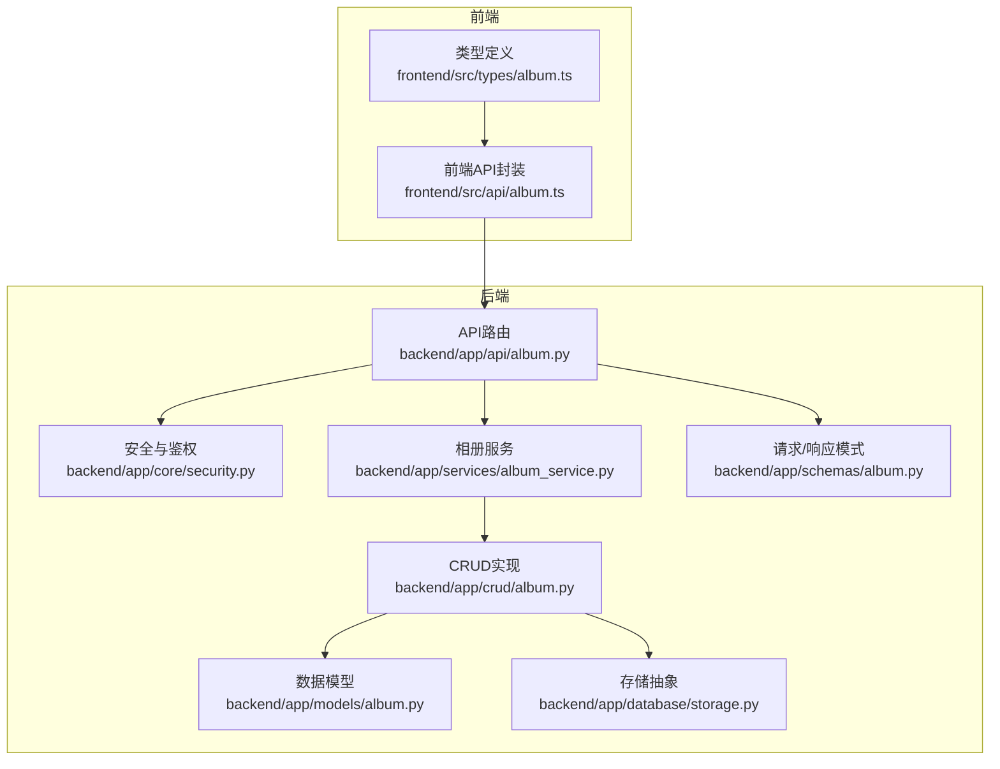
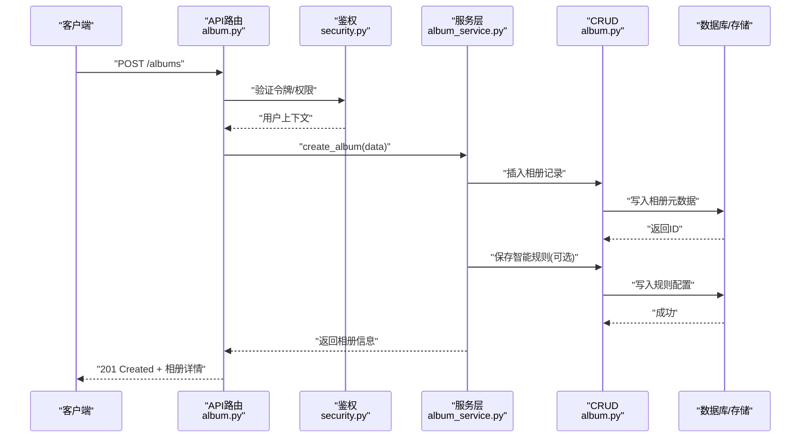
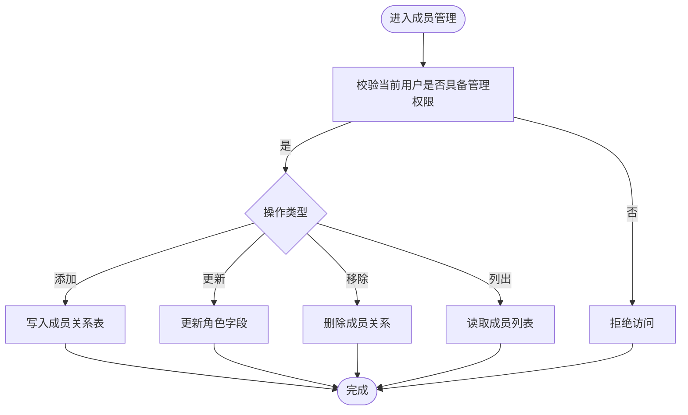
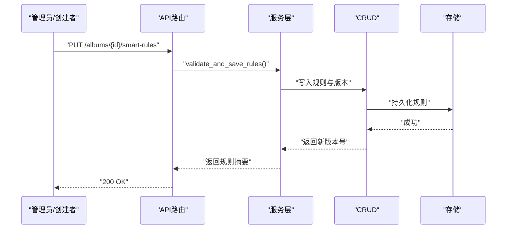
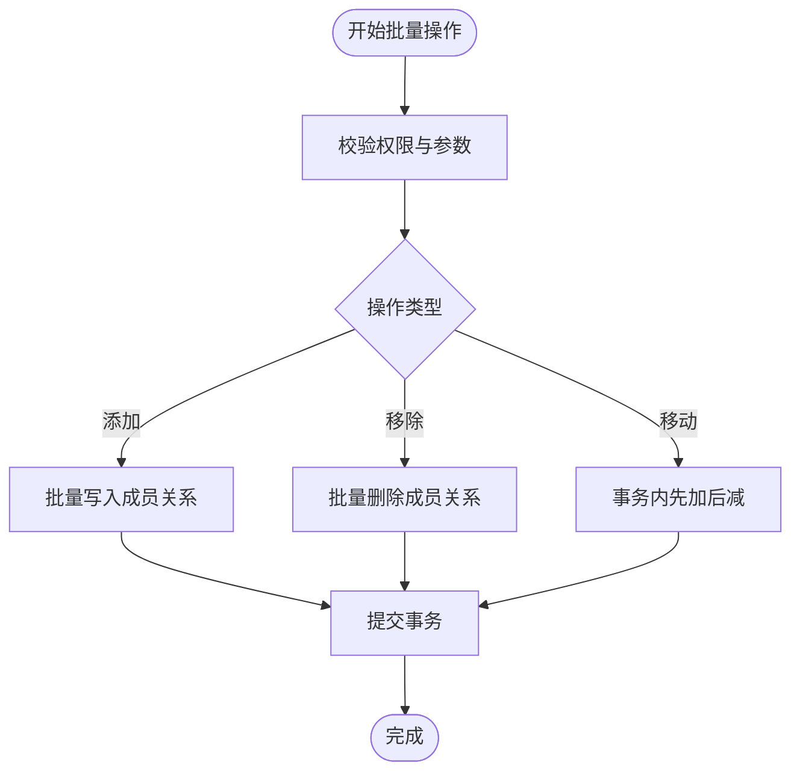
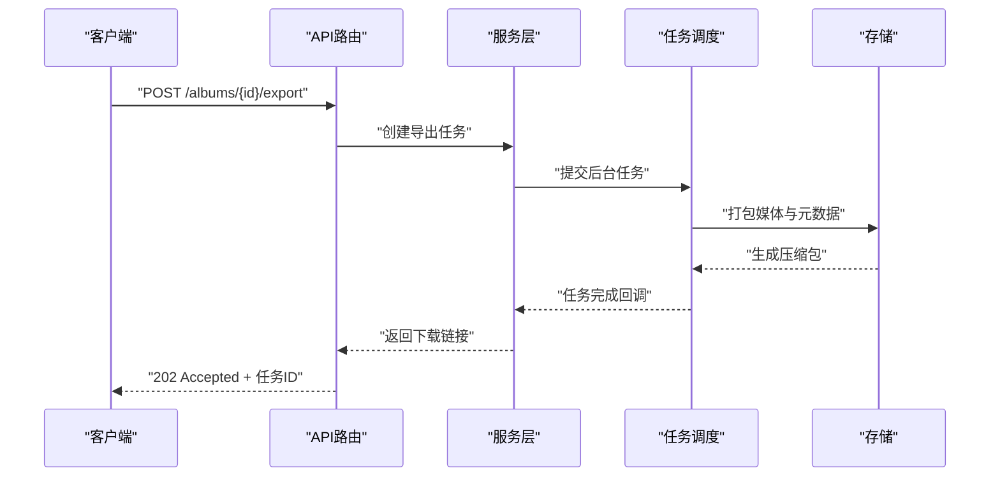
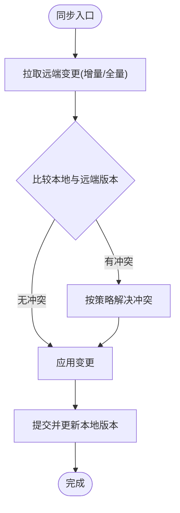
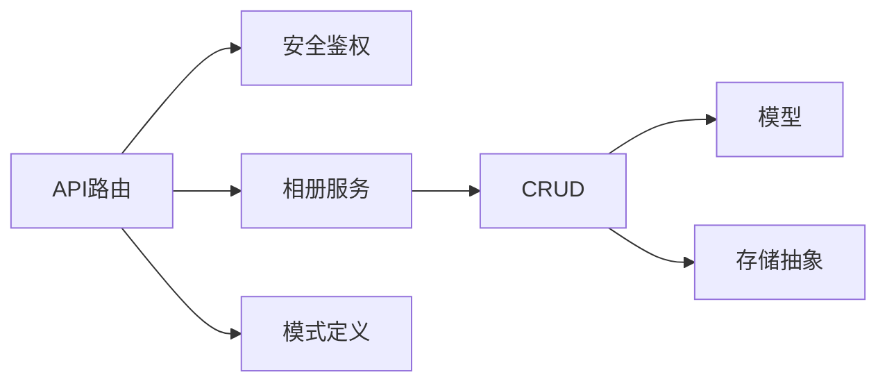

# 相册管理接口

<cite>
**本文引用的文件**   
- [backend/app/api/album.py](file://backend/app/api/album.py)
- [backend/app/crud/album.py](file://backend/app/crud/album.py)
- [backend/app/models/album.py](file://backend/app/models/album.py)
- [backend/app/schemas/album.py](file://backend/app/schemas/album.py)
- [backend/app/services/album_service.py](file://backend/app/services/album_service.py)
- [backend/app/database/storage.py](file://backend/app/database/storage.py)
- [backend/app/core/security.py](file://backend/app/core/security.py)
- [frontend/src/api/album.ts](file://frontend/src/api/album.ts)
- [frontend/src/types/album.ts](file://frontend/src/types/album.ts)
</cite>

## 目录
1. [简介](#简介)
2. [项目结构](#项目结构)
3. [核心组件](#核心组件)
4. [架构总览](#架构总览)
5. [详细组件分析](#详细组件分析)
6. [依赖分析](#依赖分析)
7. [性能考虑](#性能考虑)
8. [故障排查指南](#故障排查指南)
9. [结论](#结论)
10. [附录](#附录)

## 简介
本文件面向开发者，提供“相册管理API模块”的完整集成文档。内容覆盖：
- 相册创建、编辑、删除、共享（成员与权限）
- 智能相册规则设置与执行
- 批量照片操作（添加/移除/移动）
- 排序、搜索、导出等高级特性
- 数据同步、冲突解决与版本管理策略
- 前后端对接要点与最佳实践

## 项目结构
后端采用分层架构：API层路由与鉴权 -> 服务层业务编排 -> CRUD层数据访问 -> 模型与存储。前端通过TypeScript API封装调用后端接口。

图表来源
- [backend/app/api/album.py](file://backend/app/api/album.py)
- [backend/app/core/security.py](file://backend/app/core/security.py)
- [backend/app/services/album_service.py](file://backend/app/services/album_service.py)
- [backend/app/crud/album.py](file://backend/app/crud/album.py)
- [backend/app/models/album.py](file://backend/app/models/album.py)
- [backend/app/schemas/album.py](file://backend/app/schemas/album.py)
- [backend/app/database/storage.py](file://backend/app/database/storage.py)
- [frontend/src/api/album.ts](file://frontend/src/api/album.ts)
- [frontend/src/types/album.ts](file://frontend/src/types/album.ts)

章节来源
- [backend/app/api/album.py](file://backend/app/api/album.py)
- [backend/app/services/album_service.py](file://backend/app/services/album_service.py)
- [backend/app/crud/album.py](file://backend/app/crud/album.py)
- [backend/app/models/album.py](file://backend/app/models/album.py)
- [backend/app/schemas/album.py](file://backend/app/schemas/album.py)
- [backend/app/database/storage.py](file://backend/app/database/storage.py)
- [backend/app/core/security.py](file://backend/app/core/security.py)
- [frontend/src/api/album.ts](file://frontend/src/api/album.ts)
- [frontend/src/types/album.ts](file://frontend/src/types/album.ts)

## 核心组件
- API路由层：暴露RESTful接口，负责参数校验、鉴权、事务边界与错误映射。
- 服务层：编排复杂业务（如智能相册规则计算、批量操作、导出任务）。
- CRUD层：对数据库进行增删改查，维护相册与成员关系、规则配置等。
- 模型层：定义相册、成员、规则等实体字段与约束。
- 模式层：统一请求/响应体结构，便于前后端契约一致。
- 存储层：抽象对象存储或本地文件系统，用于媒体与元数据持久化。
- 安全层：用户认证、权限校验与访问控制。

章节来源
- [backend/app/api/album.py](file://backend/app/api/album.py)
- [backend/app/services/album_service.py](file://backend/app/services/album_service.py)
- [backend/app/crud/album.py](file://backend/app/crud/album.py)
- [backend/app/models/album.py](file://backend/app/models/album.py)
- [backend/app/schemas/album.py](file://backend/app/schemas/album.py)
- [backend/app/database/storage.py](file://backend/app/database/storage.py)
- [backend/app/core/security.py](file://backend/app/core/security.py)

## 架构总览
下图展示一次“创建相册并设置智能规则”的典型调用链。

图表来源
- [backend/app/api/album.py](file://backend/app/api/album.py)
- [backend/app/core/security.py](file://backend/app/core/security.py)
- [backend/app/services/album_service.py](file://backend/app/services/album_service.py)
- [backend/app/crud/album.py](file://backend/app/crud/album.py)

## 详细组件分析

### 相册基础CRUD接口
- 创建相册
  - 方法路径：POST /api/v1/albums
  - 入参：名称、描述、可见性、封面图URL（可选）、初始成员列表（可选）
  - 出参：相册ID、名称、可见性、创建者、时间戳
  - 权限：当前登录用户为创建者
  - 事务：创建相册后，若包含初始成员，则批量写入成员关系
- 更新相册
  - 方法路径：PUT /api/v1/albums/{id}
  - 入参：可更新的字段集合（名称、描述、可见性等）
  - 权限：创建者或拥有编辑权限的成员
- 删除相册
  - 方法路径：DELETE /api/v1/albums/{id}
  - 权限：创建者或管理员；级联清理成员关系与规则
- 获取相册详情
  - 方法路径：GET /api/v1/albums/{id}
  - 权限：根据可见性与成员权限判定
- 列出相册
  - 方法路径：GET /api/v1/albums
  - 查询参数：分页、排序字段、过滤条件（如可见性、标签）

章节来源
- [backend/app/api/album.py](file://backend/app/api/album.py)
- [backend/app/crud/album.py](file://backend/app/crud/album.py)
- [backend/app/models/album.py](file://backend/app/models/album.py)
- [backend/app/schemas/album.py](file://backend/app/schemas/album.py)

### 成员与权限管理
- 添加成员
  - 方法路径：POST /api/v1/albums/{id}/members
  - 入参：用户ID、角色（查看/编辑/管理）
  - 权限：仅创建者或管理角色可操作
- 更新成员权限
  - 方法路径：PATCH /api/v1/albums/{id}/members/{user_id}
  - 入参：新角色
- 移除成员
  - 方法路径：DELETE /api/v1/albums/{id}/members/{user_id}
- 列出成员
  - 方法路径：GET /api/v1/albums/{id}/members
  - 返回：成员列表及角色

图表来源
- [backend/app/api/album.py](file://backend/app/api/album.py)
- [backend/app/crud/album.py](file://backend/app/crud/album.py)
- [backend/app/models/album.py](file://backend/app/models/album.py)

章节来源
- [backend/app/api/album.py](file://backend/app/api/album.py)
- [backend/app/crud/album.py](file://backend/app/crud/album.py)
- [backend/app/models/album.py](file://backend/app/models/album.py)

### 智能相册规则
- 规则定义
  - 支持基于标签、时间范围、地点、人脸聚类结果、AI识别结果等条件组合
  - 规则以JSON形式存储，包含条件表达式与优先级
- 规则设置
  - 方法路径：PUT /api/v1/albums/{id}/smart-rules
  - 入参：规则数组（含条件、权重、生效状态）
  - 权限：创建者或管理角色
- 规则执行与同步
  - 触发方式：定时任务或手动触发
  - 执行流程：解析规则 -> 检索候选照片 -> 应用条件 -> 生成匹配集 -> 更新相册成员关系
- 规则版本
  - 每次更新保留历史版本，支持回滚与对比

图表来源
- [backend/app/api/album.py](file://backend/app/api/album.py)
- [backend/app/services/album_service.py](file://backend/app/services/album_service.py)
- [backend/app/crud/album.py](file://backend/app/crud/album.py)
- [backend/app/models/album.py](file://backend/app/models/album.py)

章节来源
- [backend/app/api/album.py](file://backend/app/api/album.py)
- [backend/app/services/album_service.py](file://backend/app/services/album_service.py)
- [backend/app/crud/album.py](file://backend/app/crud/album.py)
- [backend/app/models/album.py](file://backend/app/models/album.py)

### 批量照片操作
- 批量添加
  - 方法路径：POST /api/v1/albums/{id}/photos/batch-add
  - 入参：照片ID列表
  - 行为：去重、幂等写入成员关系
- 批量移除
  - 方法路径：POST /api/v1/albums/{id}/photos/batch-remove
  - 入参：照片ID列表
- 批量移动（跨相册）
  - 方法路径：POST /api/v1/photos/batch-move
  - 入参：源相册ID、目标相册ID、照片ID列表
  - 行为：原子性事务，失败回滚

图表来源
- [backend/app/api/album.py](file://backend/app/api/album.py)
- [backend/app/crud/album.py](file://backend/app/crud/album.py)

章节来源
- [backend/app/api/album.py](file://backend/app/api/album.py)
- [backend/app/crud/album.py](file://backend/app/crud/album.py)

### 排序、搜索与导出
- 排序
  - 查询参数：sort_by（时间、名称、大小、评分等）、order（asc/desc）
  - 适用场景：相册内照片列表、相册列表
- 搜索
  - 方法路径：GET /api/v1/search
  - 参数：关键词、标签、时间范围、地点、人脸等
  - 返回：匹配的照片与所属相册
- 导出
  - 方法路径：POST /api/v1/albums/{id}/export
  - 参数：格式（ZIP/CSV）、包含字段（元数据/缩略图/原图）
  - 行为：异步任务，完成后提供下载链接

图表来源
- [backend/app/api/album.py](file://backend/app/api/album.py)
- [backend/app/services/album_service.py](file://backend/app/services/album_service.py)
- [backend/app/database/storage.py](file://backend/app/database/storage.py)

章节来源
- [backend/app/api/album.py](file://backend/app/api/album.py)
- [backend/app/services/album_service.py](file://backend/app/services/album_service.py)
- [backend/app/database/storage.py](file://backend/app/database/storage.py)

### 数据同步、冲突解决与版本管理
- 数据同步
  - 增量同步：基于更新时间戳或版本号拉取变更
  - 全量同步：按相册ID拉取完整元数据
- 冲突解决
  - 策略：最后写入优先（LWW），或基于操作类型合并（如成员权限取最高权限）
  - 检测：比较版本号与变更指纹
- 版本管理
  - 规则版本：每次更新生成新版本号，支持回滚
  - 成员关系版本：记录变更日志，支持审计与恢复

[此图为概念流程图，不直接映射具体源码文件]

## 依赖分析
- 组件耦合
  - API层依赖安全与服务层，服务层依赖CRUD与存储抽象
  - 模型与模式层被多组件复用，保证数据结构一致性
- 外部依赖
  - 对象存储用于媒体文件与导出包
  - 任务调度器用于异步导出与智能规则执行

图表来源
- [backend/app/api/album.py](file://backend/app/api/album.py)
- [backend/app/core/security.py](file://backend/app/core/security.py)
- [backend/app/services/album_service.py](file://backend/app/services/album_service.py)
- [backend/app/crud/album.py](file://backend/app/crud/album.py)
- [backend/app/models/album.py](file://backend/app/models/album.py)
- [backend/app/schemas/album.py](file://backend/app/schemas/album.py)
- [backend/app/database/storage.py](file://backend/app/database/storage.py)

章节来源
- [backend/app/api/album.py](file://backend/app/api/album.py)
- [backend/app/services/album_service.py](file://backend/app/services/album_service.py)
- [backend/app/crud/album.py](file://backend/app/crud/album.py)
- [backend/app/models/album.py](file://backend/app/models/album.py)
- [backend/app/schemas/album.py](file://backend/app/schemas/album.py)
- [backend/app/database/storage.py](file://backend/app/database/storage.py)

## 性能考虑
- 批量操作使用事务与批量SQL，减少往返次数
- 智能规则执行采用异步任务，避免阻塞主线程
- 导出任务分片打包，支持断点续传与进度查询
- 索引优化：在相册ID、更新时间戳、标签与人脸ID上建立索引，提升查询效率
- 缓存策略：热点相册元数据与成员列表可短期缓存

[本节为通用指导，无需特定文件引用]

## 故障排查指南
- 鉴权失败
  - 检查令牌有效性、用户角色与资源归属
  - 参考安全层实现确认权限判断逻辑
- 规则执行异常
  - 检查规则语法与条件字段是否存在
  - 查看任务日志与错误堆栈
- 导出失败
  - 检查存储空间配额与权限
  - 确认打包过程中文件可读性
- 同步冲突
  - 比对版本号与变更指纹
  - 依据冲突策略重新应用变更

章节来源
- [backend/app/core/security.py](file://backend/app/core/security.py)
- [backend/app/services/album_service.py](file://backend/app/services/album_service.py)
- [backend/app/database/storage.py](file://backend/app/database/storage.py)

## 结论
本模块围绕“相册”这一核心实体，提供了完整的生命周期管理与高级能力（智能规则、批量操作、搜索导出、同步与版本管理）。通过清晰的分层设计与明确的权限模型，既保证了可扩展性，也提升了系统的稳定性与可维护性。建议在生产环境结合任务队列与对象存储优化大规模数据处理体验。

## 附录

### 前端集成要点
- API封装
  - 使用统一的请求工具处理鉴权头与错误码
  - 将相册相关接口集中到前端API模块
- 类型定义
  - 对齐后端模式，确保前后端数据结构一致
- 交互设计
  - 批量操作提供进度反馈
  - 导出任务提供轮询或WebSocket通知

章节来源
- [frontend/src/api/album.ts](file://frontend/src/api/album.ts)
- [frontend/src/types/album.ts](file://frontend/src/types/album.ts)