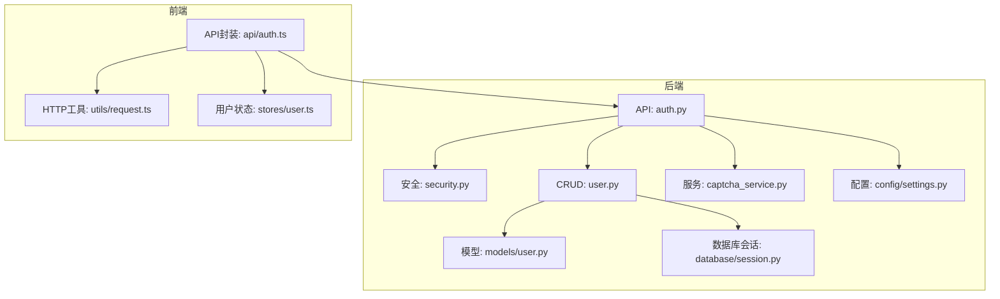
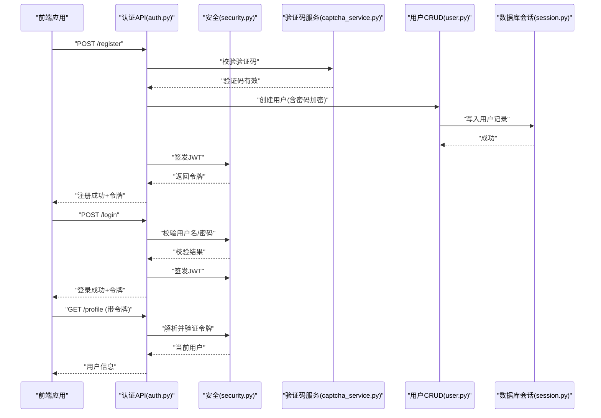
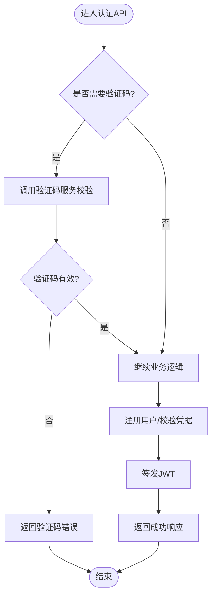
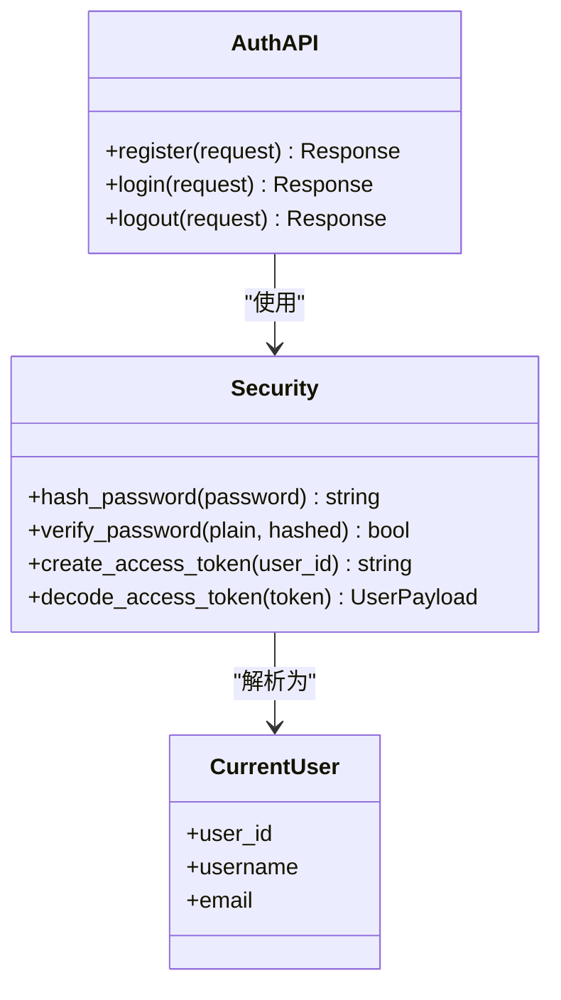
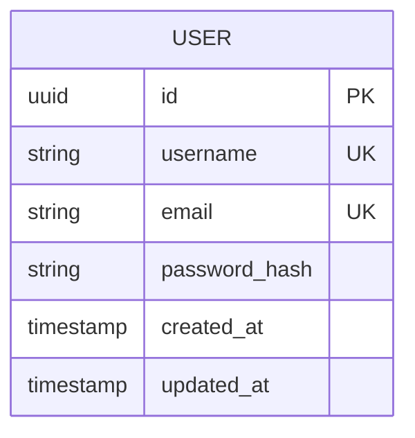
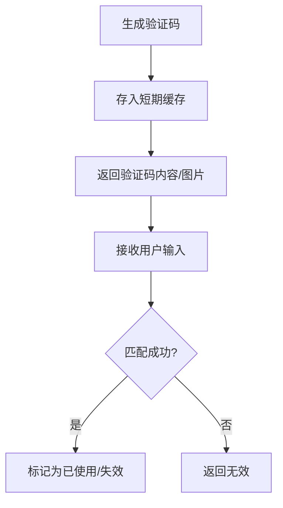
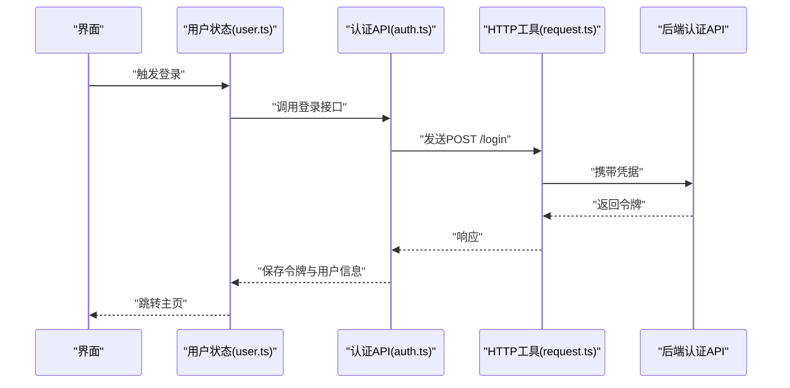
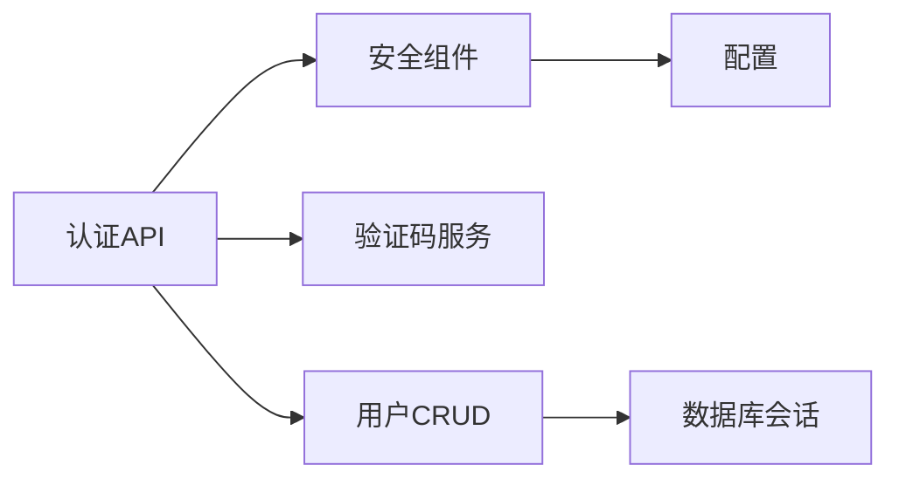

# 认证接口模块

<cite>
**本文引用的文件**   
- [backend/app/api/auth.py](file://backend/app/api/auth.py)
- [backend/app/core/security.py](file://backend/app/core/security.py)
- [backend/app/crud/user.py](file://backend/app/crud/user.py)
- [backend/app/models/user.py](file://backend/app/models/user.py)
- [backend/app/schemas/user.py](file://backend/app/schemas/user.py)
- [backend/app/services/captcha_service.py](file://backend/app/services/captcha_service.py)
- [backend/app/database/session.py](file://backend/app/database/session.py)
- [backend/app/config/settings.py](file://backend/app/config/settings.py)
- [frontend/src/api/auth.ts](file://frontend/src/api/auth.ts)
- [frontend/src/stores/user.ts](file://frontend/src/stores/user.ts)
- [frontend/src/utils/request.ts](file://frontend/src/utils/request.ts)
</cite>

## 目录
1. [简介](#简介)
2. [项目结构](#项目结构)
3. [核心组件](#核心组件)
4. [架构总览](#架构总览)
5. [详细组件分析](#详细组件分析)
6. [依赖关系分析](#依赖关系分析)
7. [性能考虑](#性能考虑)
8. [故障排查指南](#故障排查指南)
9. [结论](#结论)
10. [附录](#附录)

## 简介
本模块聚焦于认证相关能力，包括用户注册、登录、登出、验证码获取与校验、JWT令牌管理、权限验证与会话保持机制。文档面向开发者，提供端到端的集成指南：从后端API定义、安全策略到前端调用示例、错误码处理、登录状态同步与自动刷新令牌的策略建议。

## 项目结构
认证功能在后端主要分布在以下位置：
- API层：路由与请求/响应处理
- 安全层：密码哈希、JWT签发与校验、依赖注入
- 数据访问层：用户CRUD操作
- 模型与模式：数据库模型与Pydantic模式
- 服务层：验证码生成与校验
- 配置与数据库会话：全局设置与连接管理

图表来源
- [backend/app/api/auth.py](file://backend/app/api/auth.py)
- [backend/app/core/security.py](file://backend/app/core/security.py)
- [backend/app/crud/user.py](file://backend/app/crud/user.py)
- [backend/app/models/user.py](file://backend/app/models/user.py)
- [backend/app/services/captcha_service.py](file://backend/app/services/captcha_service.py)
- [backend/app/database/session.py](file://backend/app/database/session.py)
- [backend/app/config/settings.py](file://backend/app/config/settings.py)
- [frontend/src/api/auth.ts](file://frontend/src/api/auth.ts)
- [frontend/src/utils/request.ts](file://frontend/src/utils/request.ts)
- [frontend/src/stores/user.ts](file://frontend/src/stores/user.ts)

章节来源
- [backend/app/api/auth.py](file://backend/app/api/auth.py)
- [backend/app/core/security.py](file://backend/app/core/security.py)
- [backend/app/crud/user.py](file://backend/app/crud/user.py)
- [backend/app/models/user.py](file://backend/app/models/user.py)
- [backend/app/services/captcha_service.py](file://backend/app/services/captcha_service.py)
- [backend/app/database/session.py](file://backend/app/database/session.py)
- [backend/app/config/settings.py](file://backend/app/config/settings.py)
- [frontend/src/api/auth.ts](file://frontend/src/api/auth.ts)
- [frontend/src/utils/request.ts](file://frontend/src/utils/request.ts)
- [frontend/src/stores/user.ts](file://frontend/src/stores/user.ts)

## 核心组件
- 认证API（注册、登录、登出、验证码）：负责接收请求、参数校验、调用服务与CRUD、返回统一响应。
- 安全组件（security）：提供密码加密、JWT签发与解析、依赖注入的当前用户获取等。
- 用户CRUD：基于数据库会话执行用户的增删改查。
- 验证码服务：生成与校验一次性验证码，用于注册或敏感操作保护。
- 配置与数据库会话：加载JWT密钥、过期时间等配置；提供数据库连接。
- 前端API封装与状态管理：封装认证接口调用、维护登录态、处理令牌刷新与错误。

章节来源
- [backend/app/api/auth.py](file://backend/app/api/auth.py)
- [backend/app/core/security.py](file://backend/app/core/security.py)
- [backend/app/crud/user.py](file://backend/app/crud/user.py)
- [backend/app/services/captcha_service.py](file://backend/app/services/captcha_service.py)
- [backend/app/config/settings.py](file://backend/app/config/settings.py)
- [backend/app/database/session.py](file://backend/app/database/session.py)
- [frontend/src/api/auth.ts](file://frontend/src/api/auth.ts)
- [frontend/src/stores/user.ts](file://frontend/src/stores/user.ts)
- [frontend/src/utils/request.ts](file://frontend/src/utils/request.ts)

## 架构总览
认证流程涉及前后端协作：前端通过HTTPS发起请求，携带验证码（如需要），后端校验并签发JWT；后续请求在Header中携带令牌，由中间件或依赖注入进行鉴权。

图表来源
- [backend/app/api/auth.py](file://backend/app/api/auth.py)
- [backend/app/core/security.py](file://backend/app/core/security.py)
- [backend/app/services/captcha_service.py](file://backend/app/services/captcha_service.py)
- [backend/app/crud/user.py](file://backend/app/crud/user.py)
- [backend/app/database/session.py](file://backend/app/database/session.py)

## 详细组件分析

### 认证API（注册、登录、登出、验证码）
- 注册接口
  - 输入：用户名、邮箱、密码、验证码等
  - 处理：验证码校验、密码加密、用户唯一性检查、持久化
  - 输出：注册结果与JWT令牌
- 登录接口
  - 输入：用户名/邮箱、密码
  - 处理：凭据校验、签发JWT
  - 输出：登录结果与JWT令牌
- 登出接口
  - 输入：当前令牌（通常通过Header传递）
  - 处理：服务端黑名单或客户端清理（根据实现）
  - 输出：登出结果
- 验证码接口
  - 输入：可选（如手机号/邮箱）
  - 处理：生成验证码、存储短期缓存、返回图片/文本
  - 输出：验证码内容或图片URL

图表来源
- [backend/app/api/auth.py](file://backend/app/api/auth.py)
- [backend/app/services/captcha_service.py](file://backend/app/services/captcha_service.py)

章节来源
- [backend/app/api/auth.py](file://backend/app/api/auth.py)
- [backend/app/services/captcha_service.py](file://backend/app/services/captcha_service.py)

### 安全组件（密码加密与JWT管理）
- 密码加密
  - 使用安全的哈希算法对用户密码进行加盐哈希，避免明文存储。
- JWT签发与解析
  - 签发：包含用户标识、过期时间、签名等字段。
  - 解析：校验签名、有效期，提取用户上下文。
- 依赖注入
  - 提供“当前用户”依赖项，供其他API快速获得已认证用户。

图表来源
- [backend/app/core/security.py](file://backend/app/core/security.py)
- [backend/app/api/auth.py](file://backend/app/api/auth.py)

章节来源
- [backend/app/core/security.py](file://backend/app/core/security.py)

### 用户CRUD与数据模型
- 用户CRUD
  - 创建用户：插入新用户记录，确保唯一约束。
  - 查询用户：按用户名/邮箱查找，用于登录校验。
  - 更新用户：修改个人信息（头像、昵称等）。
- 数据模型与模式
  - 模型：映射数据库表结构。
  - 模式：定义请求/响应的数据结构与校验规则。

图表来源
- [backend/app/models/user.py](file://backend/app/models/user.py)
- [backend/app/schemas/user.py](file://backend/app/schemas/user.py)
- [backend/app/crud/user.py](file://backend/app/crud/user.py)

章节来源
- [backend/app/models/user.py](file://backend/app/models/user.py)
- [backend/app/schemas/user.py](file://backend/app/schemas/user.py)
- [backend/app/crud/user.py](file://backend/app/crud/user.py)

### 验证码服务
- 生成验证码：随机生成数字/字母组合，支持图形或文本形式。
- 校验验证码：比对输入与缓存中的值，支持一次有效与短过期时间。
- 防刷策略：限制同一来源的请求频率。

图表来源
- [backend/app/services/captcha_service.py](file://backend/app/services/captcha_service.py)

章节来源
- [backend/app/services/captcha_service.py](file://backend/app/services/captcha_service.py)

### 配置与数据库会话
- 配置
  - JWT密钥、过期时间、算法等全局设置。
- 数据库会话
  - 提供连接池与事务管理，保证并发安全。

章节来源
- [backend/app/config/settings.py](file://backend/app/config/settings.py)
- [backend/app/database/session.py](file://backend/app/database/session.py)

### 前端集成（API封装、状态管理与请求拦截）
- API封装
  - 封装注册、登录、登出、验证码等接口调用。
- 状态管理
  - 维护登录态、用户信息与令牌。
- 请求拦截
  - 自动附加令牌、处理401/403、触发刷新策略。

图表来源
- [frontend/src/api/auth.ts](file://frontend/src/api/auth.ts)
- [frontend/src/stores/user.ts](file://frontend/src/stores/user.ts)
- [frontend/src/utils/request.ts](file://frontend/src/utils/request.ts)

章节来源
- [frontend/src/api/auth.ts](file://frontend/src/api/auth.ts)
- [frontend/src/stores/user.ts](file://frontend/src/stores/user.ts)
- [frontend/src/utils/request.ts](file://frontend/src/utils/request.ts)

## 依赖关系分析
- 耦合与内聚
  - 认证API与安全组件解耦良好，通过依赖注入复用安全能力。
  - 用户CRUD与数据库会话分离，便于测试与扩展。
- 外部依赖
  - 验证码服务可能依赖缓存或外部服务。
  - JWT依赖配置中的密钥与算法。
- 循环依赖
  - 当前结构未发现明显循环依赖。

图表来源
- [backend/app/api/auth.py](file://backend/app/api/auth.py)
- [backend/app/core/security.py](file://backend/app/core/security.py)
- [backend/app/services/captcha_service.py](file://backend/app/services/captcha_service.py)
- [backend/app/crud/user.py](file://backend/app/crud/user.py)
- [backend/app/database/session.py](file://backend/app/database/session.py)
- [backend/app/config/settings.py](file://backend/app/config/settings.py)

章节来源
- [backend/app/api/auth.py](file://backend/app/api/auth.py)
- [backend/app/core/security.py](file://backend/app/core/security.py)
- [backend/app/services/captcha_service.py](file://backend/app/services/captcha_service.py)
- [backend/app/crud/user.py](file://backend/app/crud/user.py)
- [backend/app/database/session.py](file://backend/app/database/session.py)
- [backend/app/config/settings.py](file://backend/app/config/settings.py)

## 性能考虑
- 密码哈希
  - 选择合适的工作因子，平衡安全性与性能。
- JWT
  - 合理设置过期时间，结合刷新令牌减少频繁登录。
- 验证码
  - 使用内存缓存（如Redis）提升读取速度，控制容量与过期时间。
- 数据库
  - 对用户名/邮箱建立唯一索引，加速查询与冲突检测。
- 并发
  - 使用连接池与事务隔离级别优化并发写入。

[本节为通用指导，不直接分析具体文件]

## 故障排查指南
- 常见错误码
  - 400：参数校验失败（如缺少必填字段、格式错误）
  - 401：未认证或令牌无效/过期
  - 403：无权限访问
  - 409：资源冲突（如用户名/邮箱已存在）
  - 429：验证码或登录尝试过多
  - 500：服务器内部错误
- 调试建议
  - 检查请求头是否携带正确的令牌与Content-Type。
  - 确认验证码是否重复使用或已过期。
  - 查看服务端日志定位异常堆栈。
  - 核对JWT密钥与算法配置一致性。

章节来源
- [backend/app/api/auth.py](file://backend/app/api/auth.py)
- [backend/app/core/security.py](file://backend/app/core/security.py)

## 结论
本认证模块以清晰的职责划分实现了注册、登录、登出、验证码与JWT管理的完整闭环。通过安全组件与依赖注入，保证了可测试性与可扩展性。前端采用统一的API封装与状态管理，配合请求拦截器可实现良好的用户体验与健壮的错误处理。建议在生产环境启用HTTPS、严格配置JWT密钥与过期策略，并结合刷新令牌机制提升安全性与可用性。

[本节为总结，不直接分析具体文件]

## 附录

### 接口清单与调用要点
- 注册
  - 方法：POST
  - 路径：/api/v1/auth/register
  - 请求体：用户名、邮箱、密码、验证码
  - 响应：注册结果、JWT令牌
- 登录
  - 方法：POST
  - 路径：/api/v1/auth/login
  - 请求体：用户名/邮箱、密码
  - 响应：登录结果、JWT令牌
- 登出
  - 方法：POST
  - 路径：/api/v1/auth/logout
  - 请求头：Authorization: Bearer <token>
  - 响应：登出结果
- 验证码
  - 方法：GET
  - 路径：/api/v1/auth/captcha
  - 响应：验证码图片或文本
- 用户信息更新
  - 方法：PUT/PATCH
  - 路径：/api/v1/users/profile
  - 请求头：Authorization: Bearer <token>
  - 请求体：待更新的字段
  - 响应：更新后的用户信息

章节来源
- [backend/app/api/auth.py](file://backend/app/api/auth.py)
- [backend/app/schemas/user.py](file://backend/app/schemas/user.py)

### 令牌管理与刷新策略
- 令牌传输
  - 推荐在请求头中携带Authorization: Bearer <token>。
- 刷新令牌
  - 策略一：双令牌（Access Token短期 + Refresh Token长期），在Access过期前主动刷新。
  - 策略二：滑动过期，每次请求延长有效期（需服务端支持）。
- 本地存储
  - 前端将令牌保存在内存或安全存储（如HttpOnly Cookie），避免XSS风险。
- 状态同步
  - 监听网络错误或401响应，触发重新登录或刷新流程。

章节来源
- [backend/app/core/security.py](file://backend/app/core/security.py)
- [frontend/src/utils/request.ts](file://frontend/src/utils/request.ts)
- [frontend/src/stores/user.ts](file://frontend/src/stores/user.ts)

### 安全最佳实践
- 全链路HTTPS，防止中间人攻击。
- 密码使用强哈希算法与足够工作因子。
- 验证码限频与一次性使用。
- JWT最小化载荷，仅包含必要声明。
- 定期轮换JWT密钥，支持灰度切换。

[本节为通用指导，不直接分析具体文件]