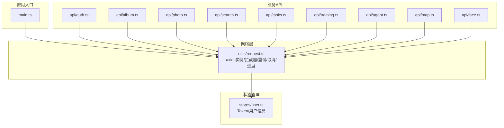
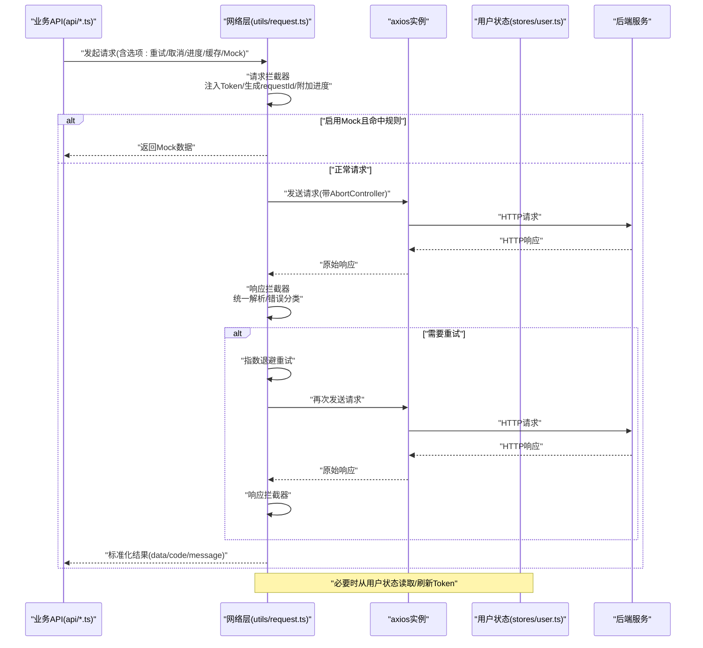
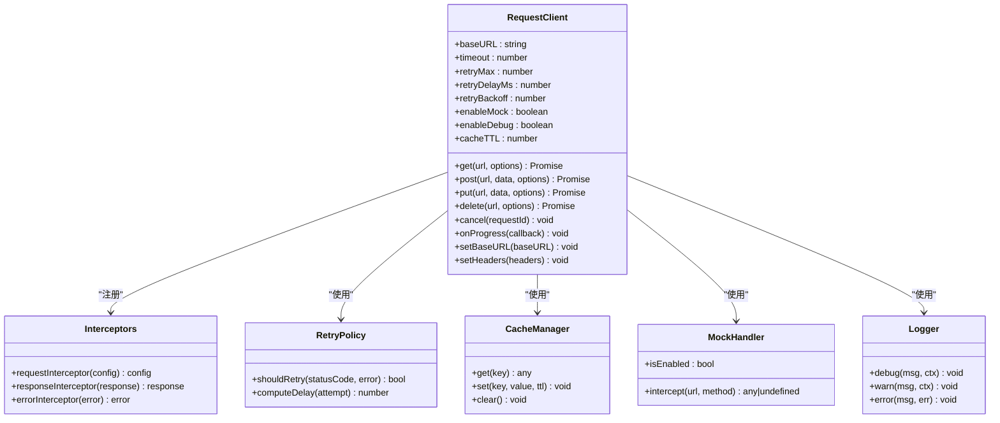
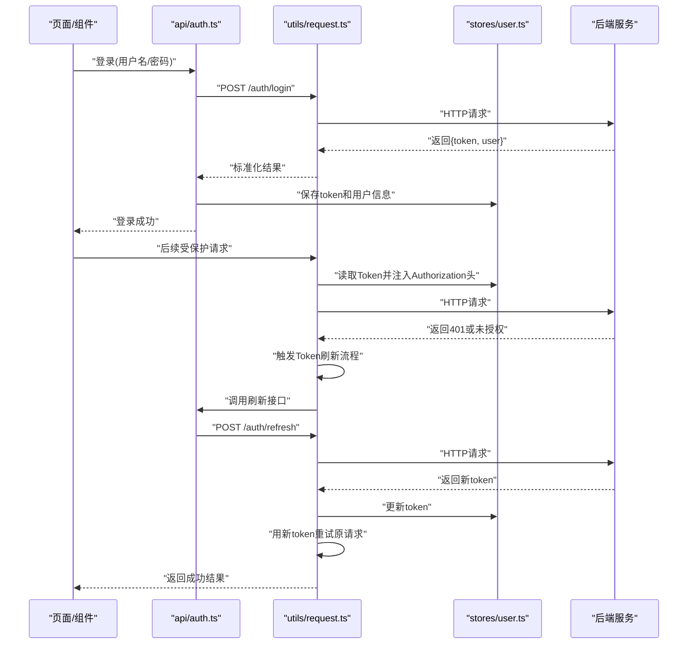
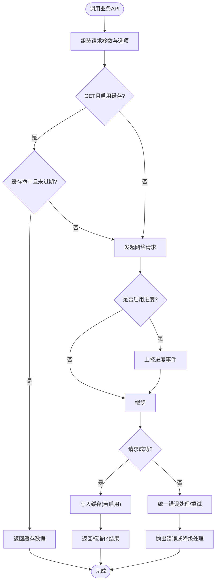
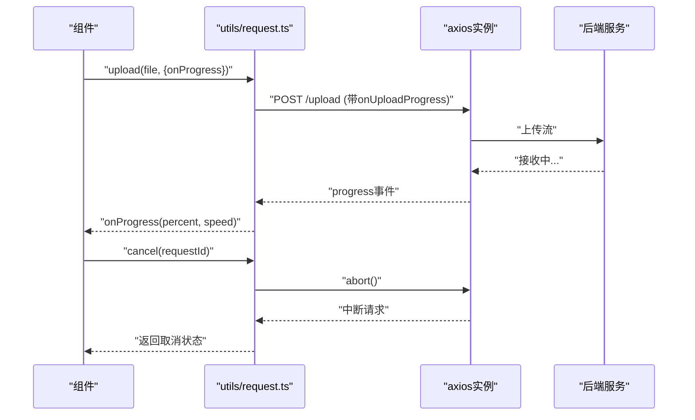
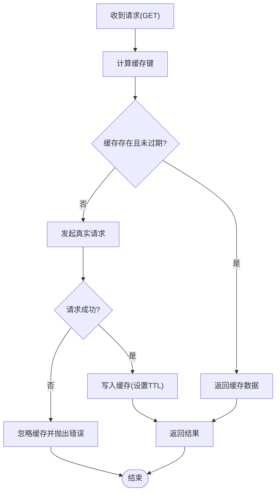
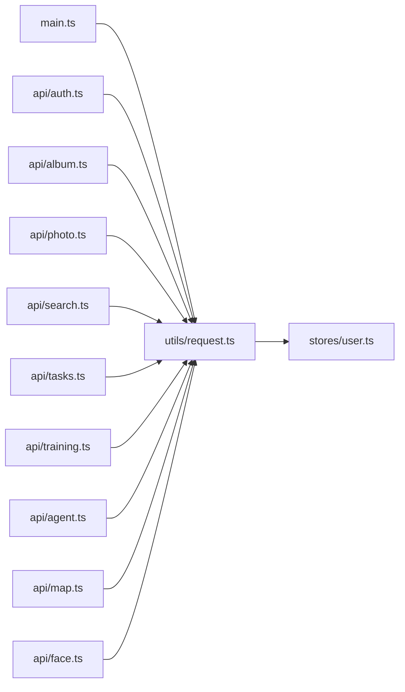

# 请求封装与拦截器

<cite>
**本文引用的文件**   
- [frontend/src/utils/request.ts](file://frontend/src/utils/request.ts)
- [frontend/src/api/auth.ts](file://frontend/src/api/auth.ts)
- [frontend/src/api/album.ts](file://frontend/src/api/album.ts)
- [frontend/src/api/photo.ts](file://frontend/src/api/photo.ts)
- [frontend/src/api/search.ts](file://frontend/src/api/search.ts)
- [frontend/src/api/tasks.ts](file://frontend/src/api/tasks.ts)
- [frontend/src/api/training.ts](file://frontend/src/api/training.ts)
- [frontend/src/api/agent.ts](file://frontend/src/api/agent.ts)
- [frontend/src/api/map.ts](file://frontend/src/api/map.ts)
- [frontend/src/api/face.ts](file://frontend/src/api/face.ts)
- [frontend/src/stores/user.ts](file://frontend/src/stores/user.ts)
- [frontend/src/main.ts](file://frontend/src/main.ts)
</cite>

## 目录
1. [简介](#简介)
2. [项目结构](#项目结构)
3. [核心组件](#核心组件)
4. [架构总览](#架构总览)
5. [详细组件分析](#详细组件分析)
6. [依赖关系分析](#依赖关系分析)
7. [性能考虑](#性能考虑)
8. [故障排查指南](#故障排查指南)
9. [结论](#结论)
10. [附录](#附录)

## 简介
本文件面向前端开发者，系统化梳理并沉淀本项目中基于 axios 的 HTTP 客户端封装与拦截器实现。内容覆盖：axios 实例配置、请求/响应拦截器、错误统一处理、Token 自动注入、请求重试策略、超时与取消、进度跟踪、缓存策略、Mock 数据支持、日志记录、性能监控与调试工具使用，并提供最佳实践建议，帮助构建健壮、可维护的前端网络层。

## 项目结构
前端网络相关代码集中在 utils 与 api 两个层次：
- utils/request.ts：统一的 axios 实例、拦截器、错误处理、重试、取消、进度等能力封装
- api/*.ts：按业务域划分的 API 调用方法，复用 utils/request.ts 提供的能力
- stores/user.ts：用户状态（如 Token）管理，供请求时读取或刷新
- main.ts：应用入口，负责初始化全局配置（如 baseURL、环境开关等）

图表来源
- [frontend/src/main.ts](file://frontend/src/main.ts)
- [frontend/src/utils/request.ts](file://frontend/src/utils/request.ts)
- [frontend/src/stores/user.ts](file://frontend/src/stores/user.ts)
- [frontend/src/api/auth.ts](file://frontend/src/api/auth.ts)
- [frontend/src/api/album.ts](file://frontend/src/api/album.ts)
- [frontend/src/api/photo.ts](file://frontend/src/api/photo.ts)
- [frontend/src/api/search.ts](file://frontend/src/api/search.ts)
- [frontend/src/api/tasks.ts](file://frontend/src/api/tasks.ts)
- [frontend/src/api/training.ts](file://frontend/src/api/training.ts)
- [frontend/src/api/agent.ts](file://frontend/src/api/agent.ts)
- [frontend/src/api/map.ts](file://frontend/src/api/map.ts)
- [frontend/src/api/face.ts](file://frontend/src/api/face.ts)

章节来源
- [frontend/src/main.ts](file://frontend/src/main.ts)
- [frontend/src/utils/request.ts](file://frontend/src/utils/request.ts)
- [frontend/src/stores/user.ts](file://frontend/src/stores/user.ts)

## 核心组件
本节聚焦 utils/request.ts 中的关键能力点，说明其职责与交互方式。

- axios 实例与基础配置
  - 提供统一的 baseURL、超时时间、Content-Type、跨域凭据等默认值
  - 通过环境变量控制是否启用 Mock、调试日志、重试次数等
- 请求拦截器
  - 自动注入 Authorization 头（从用户状态中读取 Token）
  - 为需要上传进度的请求附加 onUploadProgress 回调
  - 为每个请求生成唯一 requestId，便于追踪与去重
  - 可选：在开发环境下打印请求摘要（URL、方法、参数）
- 响应拦截器
  - 统一解析后端返回体，提取 data/code/message 等字段
  - 根据 code 进行成功/失败分支；对特定错误码触发 Token 刷新或跳转登录
  - 将标准化后的结果透传给业务 API
- 错误统一处理
  - 区分网络错误、超时、HTTP 状态码异常、业务错误码
  - 对可重试错误（如 5xx、网络抖动）执行指数退避重试
  - 对不可重试错误直接抛出，交由上层 UI 提示
- 请求重试策略
  - 可配置最大重试次数、初始延迟、退避倍数、是否仅针对特定状态码重试
  - 使用 Promise 链式重试，避免并发风暴
- 超时与取消
  - 为每次请求创建 AbortController，暴露 cancel() 方法
  - 支持全局超时与单个请求级超时的优先级
- 进度跟踪
  - 上传/下载进度事件上报，支持百分比与速率统计
- 缓存策略
  - 基于 URL + 查询串 + 方法的键生成缓存项
  - 支持 GET 请求的内存缓存与 TTL 过期策略
- Mock 数据支持
  - 通过环境变量开关，在本地开发阶段拦截指定接口返回模拟数据
- 日志与性能监控
  - 记录请求开始/结束时间、耗时、状态码、错误堆栈
  - 提供 debug 模式输出更详细的上下文信息

章节来源
- [frontend/src/utils/request.ts](file://frontend/src/utils/request.ts)

## 架构总览
下图展示了从业务 API 到网络层的完整调用链路，以及拦截器、重试、取消、进度、缓存、Mock 的协作关系。

图表来源
- [frontend/src/utils/request.ts](file://frontend/src/utils/request.ts)
- [frontend/src/stores/user.ts](file://frontend/src/stores/user.ts)
- [frontend/src/api/auth.ts](file://frontend/src/api/auth.ts)

## 详细组件分析

### 组件A：网络层封装（utils/request.ts）
该模块是 HTTP 客户端的核心，承担以下职责：
- 实例化 axios 并设置默认配置
- 注册请求/响应拦截器
- 实现重试、取消、进度、缓存、Mock、日志与监控
- 对外暴露 get/post/put/delete 等方法，屏蔽底层细节

图表来源
- [frontend/src/utils/request.ts](file://frontend/src/utils/request.ts)

章节来源
- [frontend/src/utils/request.ts](file://frontend/src/utils/request.ts)

### 组件B：认证与Token管理（stores/user.ts 与 api/auth.ts）
- stores/user.ts 负责持久化与读写 Token、用户信息，并在 Token 失效时触发刷新流程
- api/auth.ts 提供登录、刷新 Token、退出等接口，内部复用网络层能力

图表来源
- [frontend/src/api/auth.ts](file://frontend/src/api/auth.ts)
- [frontend/src/stores/user.ts](file://frontend/src/stores/user.ts)
- [frontend/src/utils/request.ts](file://frontend/src/utils/request.ts)

章节来源
- [frontend/src/api/auth.ts](file://frontend/src/api/auth.ts)
- [frontend/src/stores/user.ts](file://frontend/src/stores/user.ts)
- [frontend/src/utils/request.ts](file://frontend/src/utils/request.ts)

### 组件C：业务API示例（以 album.ts、photo.ts、search.ts 为例）
- 各业务 API 文件仅关注“做什么”，不关心“怎么做”
- 通过 import 网络层方法，传入 URL、参数、选项（如是否需要重试、是否启用缓存）
- 对于大文件上传，可在 options 中开启进度回调，用于 UI 展示上传进度条

图表来源
- [frontend/src/api/album.ts](file://frontend/src/api/album.ts)
- [frontend/src/api/photo.ts](file://frontend/src/api/photo.ts)
- [frontend/src/api/search.ts](file://frontend/src/api/search.ts)
- [frontend/src/utils/request.ts](file://frontend/src/utils/request.ts)

章节来源
- [frontend/src/api/album.ts](file://frontend/src/api/album.ts)
- [frontend/src/api/photo.ts](file://frontend/src/api/photo.ts)
- [frontend/src/api/search.ts](file://frontend/src/api/search.ts)
- [frontend/src/utils/request.ts](file://frontend/src/utils/request.ts)

### 组件D：进度跟踪与取消请求
- 进度跟踪：在上传/下载时，通过 onUploadProgress/onDownloadProgress 回调上报百分比与速率
- 取消请求：为每个请求绑定 AbortController，暴露 cancel(requestId) 方法，支持在路由切换或组件卸载时主动取消

图表来源
- [frontend/src/utils/request.ts](file://frontend/src/utils/request.ts)

章节来源
- [frontend/src/utils/request.ts](file://frontend/src/utils/request.ts)

### 组件E：缓存策略与Mock数据
- 缓存策略：针对 GET 请求，基于 URL+查询串+方法生成键，存储于内存，支持 TTL 过期与手动清理
- Mock 数据：通过环境变量开关，在本地开发阶段拦截指定接口返回模拟数据，加速联调

图表来源
- [frontend/src/utils/request.ts](file://frontend/src/utils/request.ts)

章节来源
- [frontend/src/utils/request.ts](file://frontend/src/utils/request.ts)

## 依赖关系分析
- 业务 API 均依赖网络层封装，形成稳定的契约：输入为 URL/参数/选项，输出为标准化的 Promise 结果
- 网络层依赖用户状态获取 Token，依赖配置与环境变量控制行为
- 主入口负责初始化 baseURL、全局 Header、调试开关等

图表来源
- [frontend/src/main.ts](file://frontend/src/main.ts)
- [frontend/src/utils/request.ts](file://frontend/src/utils/request.ts)
- [frontend/src/stores/user.ts](file://frontend/src/stores/user.ts)
- [frontend/src/api/auth.ts](file://frontend/src/api/auth.ts)
- [frontend/src/api/album.ts](file://frontend/src/api/album.ts)
- [frontend/src/api/photo.ts](file://frontend/src/api/photo.ts)
- [frontend/src/api/search.ts](file://frontend/src/api/search.ts)
- [frontend/src/api/tasks.ts](file://frontend/src/api/tasks.ts)
- [frontend/src/api/training.ts](file://frontend/src/api/training.ts)
- [frontend/src/api/agent.ts](file://frontend/src/api/agent.ts)
- [frontend/src/api/map.ts](file://frontend/src/api/map.ts)
- [frontend/src/api/face.ts](file://frontend/src/api/face.ts)

章节来源
- [frontend/src/main.ts](file://frontend/src/main.ts)
- [frontend/src/utils/request.ts](file://frontend/src/utils/request.ts)
- [frontend/src/stores/user.ts](file://frontend/src/stores/user.ts)

## 性能考虑
- 合理设置超时时间与重试次数，避免雪崩效应
- 对高频 GET 接口启用缓存，减少重复请求
- 上传大文件时使用分片与断点续传（如需），结合进度反馈提升体验
- 在路由切换或组件卸载时主动取消无用请求，降低带宽占用
- 使用连接池与 Keep-Alive，提高复用率
- 对敏感接口增加防抖与节流，避免误触导致多次请求

[本节为通用指导，无需具体文件引用]

## 故障排查指南
- 常见问题定位
  - 401 未授权：检查 Token 是否存在、是否过期、刷新逻辑是否正确
  - 5xx 服务端错误：确认重试策略是否生效，查看服务端日志
  - 网络错误/超时：检查 baseURL、代理、跨域配置与网络连通性
  - 进度不更新：确认是否传递了正确的 onUploadProgress/onDownloadProgress
  - 取消无效：确认是否在正确时机调用 cancel(requestId)，并检查是否已发出请求
- 调试技巧
  - 启用 debug 模式，观察请求/响应摘要与错误堆栈
  - 使用浏览器 Network 面板核对实际请求与响应
  - 在 Mock 模式下验证前端逻辑，隔离后端不稳定因素
- 日志与监控
  - 记录关键指标：请求耗时、成功率、错误类型分布
  - 对慢请求与频繁失败接口进行告警与优化

章节来源
- [frontend/src/utils/request.ts](file://frontend/src/utils/request.ts)

## 结论
通过统一的 axios 实例与拦截器封装，本项目实现了 Token 自动注入、错误统一处理、重试与取消、进度跟踪、缓存与 Mock 等关键能力。配合完善的日志与监控，能够显著提升前端的稳定性与可观测性。建议在新增业务 API 时遵循现有约定，按需启用重试、缓存与进度功能，保持网络层的一致性与可维护性。

[本节为总结性内容，无需具体文件引用]

## 附录
- 最佳实践清单
  - 所有受保护接口必须携带 Authorization 头
  - 对幂等 GET 请求启用缓存，合理设置 TTL
  - 对易失败的写操作启用重试，但需限制最大次数与退避策略
  - 长耗时任务务必支持取消与进度反馈
  - 在开发环境开启 Mock 与 debug 日志，生产环境关闭
  - 对关键接口埋点监控，收集耗时与错误率
- 常用配置项参考
  - baseURL：后端服务地址
  - timeout：请求超时时间（毫秒）
  - retryMax：最大重试次数
  - retryDelayMs：初始重试延迟（毫秒）
  - retryBackoff：退避倍数
  - enableMock：是否启用 Mock
  - enableDebug：是否启用调试日志
  - cacheTTL：缓存过期时间（毫秒）

[本节为补充说明，无需具体文件引用]