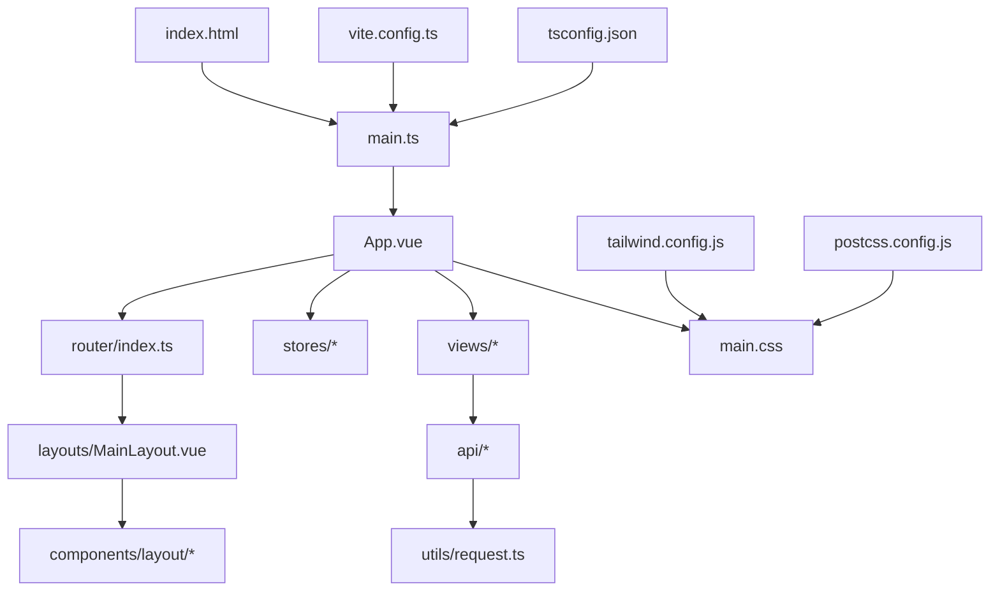
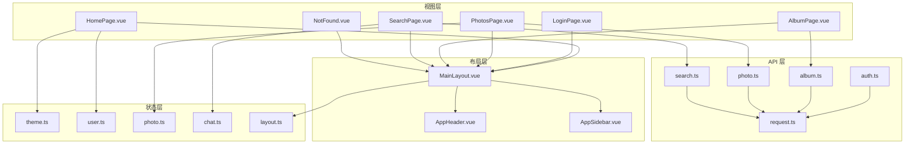
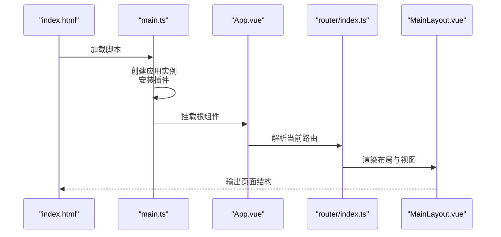
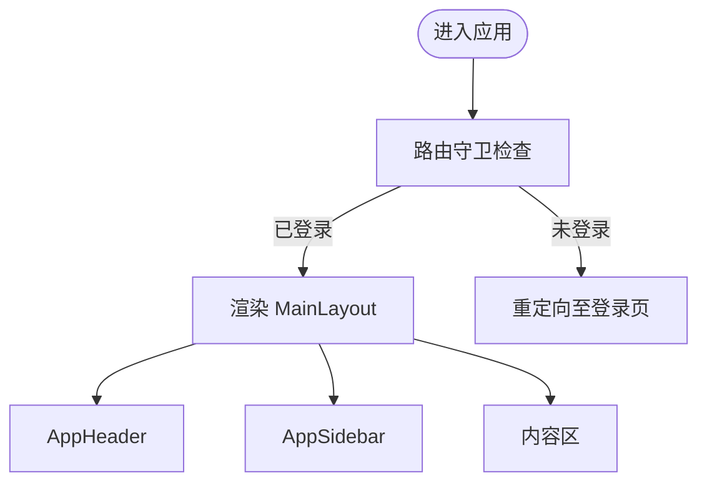
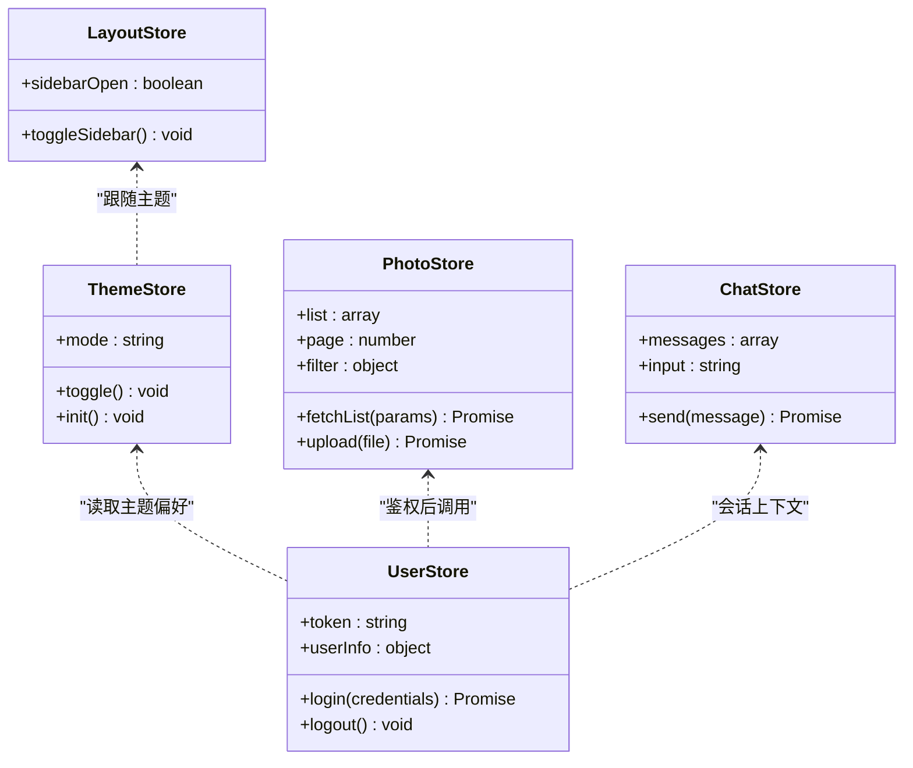
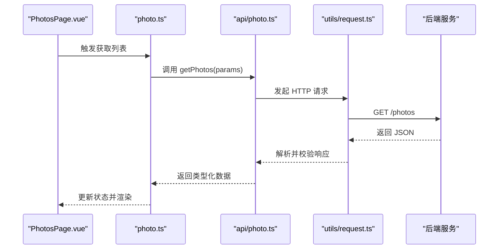
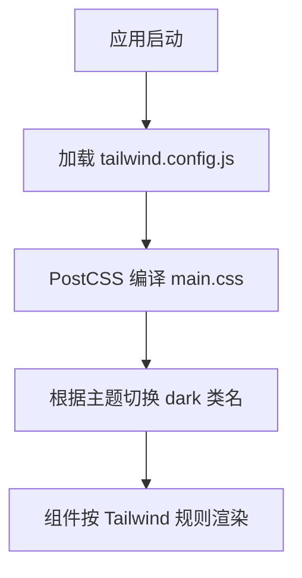
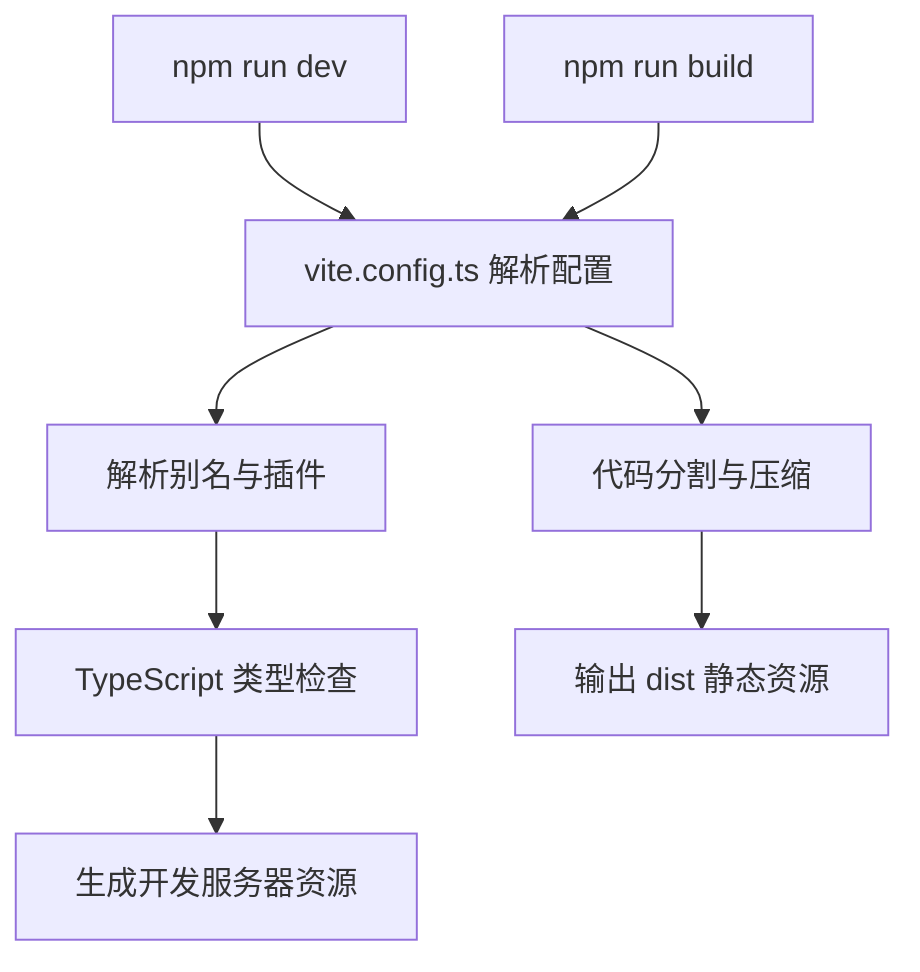
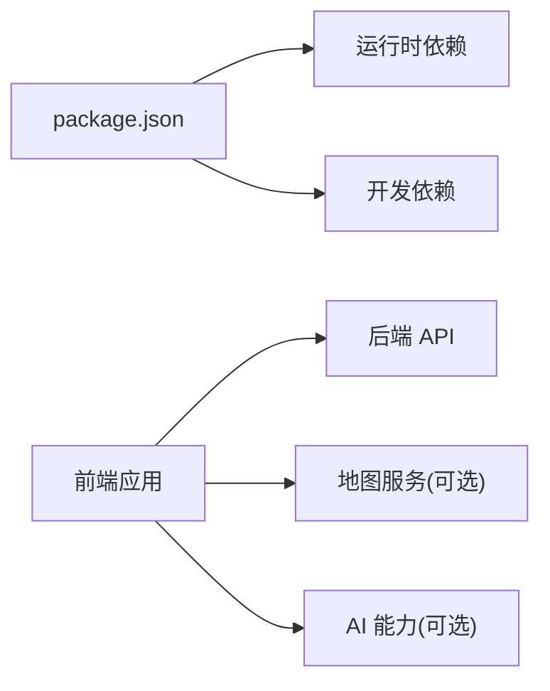

# 前端开发指南

<cite>
**本文引用的文件**   
- [frontend/package.json](file://frontend/package.json)
- [frontend/vite.config.ts](file://frontend/vite.config.ts)
- [frontend/tailwind.config.js](file://frontend/tailwind.config.js)
- [frontend/postcss.config.js](file://frontend/postcss.config.js)
- [frontend/tsconfig.json](file://frontend/tsconfig.json)
- [frontend/tsconfig.node.json](file://frontend/tsconfig.node.json)
- [frontend/index.html](file://frontend/index.html)
- [frontend/src/main.ts](file://frontend/src/main.ts)
- [frontend/src/App.vue](file://frontend/src/App.vue)
- [frontend/src/main.css](file://frontend/src/main.css)
- [frontend/src/env.d.ts](file://frontend/src/env.d.ts)
- [frontend/src/router/index.ts](file://frontend/src/router/index.ts)
- [frontend/src/layouts/MainLayout.vue](file://frontend/src/layouts/MainLayout.vue)
- [frontend/src/components/layout/AppHeader.vue](file://frontend/src/components/layout/AppHeader.vue)
- [frontend/src/components/layout/AppSidebar.vue](file://frontend/src/components/layout/AppSidebar.vue)
- [frontend/src/stores/theme.ts](file://frontend/src/stores/theme.ts)
- [frontend/src/stores/user.ts](file://frontend/src/stores/user.ts)
- [frontend/src/stores/photo.ts](file://frontend/src/stores/photo.ts)
- [frontend/src/stores/chat.ts](file://frontend/src/stores/chat.ts)
- [frontend/src/stores/layout.ts](file://frontend/src/stores/layout.ts)
- [frontend/src/utils/request.ts](file://frontend/src/utils/request.ts)
- [frontend/src/api/auth.ts](file://frontend/src/api/auth.ts)
- [frontend/src/api/album.ts](file://frontend/src/api/album.ts)
- [frontend/src/api/photo.ts](file://frontend/src/api/photo.ts)
- [frontend/src/api/search.ts](file://frontend/src/api/search.ts)
- [frontend/src/types/auth.ts](file://frontend/src/types/auth.ts)
- [frontend/src/types/photo.ts](file://frontend/src/types/photo.ts)
- [frontend/src/views/HomePage.vue](file://frontend/src/views/HomePage.vue)
- [frontend/src/views/LoginPage.vue](file://frontend/src/views/LoginPage.vue)
- [frontend/src/views/PhotosPage.vue](file://frontend/src/views/PhotosPage.vue)
- [frontend/src/views/AlbumPage.vue](file://frontend/src/views/AlbumPage.vue)
- [frontend/src/views/SearchPage.vue](file://frontend/src/views/SearchPage.vue)
- [frontend/src/views/NotFound.vue](file://frontend/src/views/NotFound.vue)
</cite>

## 目录
1. [简介](#简介)
2. [项目结构](#项目结构)
3. [核心组件](#核心组件)
4. [架构总览](#架构总览)
5. [详细组件分析](#详细组件分析)
6. [依赖分析](#依赖分析)
7. [性能考虑](#性能考虑)
8. [故障排查指南](#故障排查指南)
9. [结论](#结论)
10. [附录](#附录)

## 简介
本指南面向基于 Vue 3 + TypeScript 的前端工程，覆盖项目结构、组件设计模式、状态管理策略、Vite 构建配置、Tailwind CSS 样式系统、路由与 API 集成层封装、错误处理与用户体验优化。文档同时提供组件开发示例（响应式、动画、跨浏览器兼容）、工具链配置与调试技巧，帮助开发者快速上手并高效迭代。

## 项目结构
前端采用按功能域组织的方式：
- src/api：API 接口层，按业务域拆分模块
- src/components：可复用 UI 组件，按领域分组
- src/layouts：页面布局容器
- src/router：路由定义与守卫
- src/stores：Pinia 状态管理，按领域划分
- src/types：TypeScript 类型定义
- src/utils：通用工具函数与请求封装
- src/views：页面级视图组件
- 根目录包含 Vite、Tailwind、PostCSS、TS 等构建与类型配置

图表来源
- [frontend/index.html:1-50](file://frontend/index.html#L1-L50)
- [frontend/src/main.ts:1-80](file://frontend/src/main.ts#L1-L80)
- [frontend/src/App.vue:1-120](file://frontend/src/App.vue#L1-L120)
- [frontend/src/router/index.ts:1-120](file://frontend/src/router/index.ts#L1-L120)
- [frontend/src/layouts/MainLayout.vue:1-120](file://frontend/src/layouts/MainLayout.vue#L1-L120)
- [frontend/src/components/layout/AppHeader.vue:1-120](file://frontend/src/components/layout/AppHeader.vue#L1-L120)
- [frontend/src/components/layout/AppSidebar.vue:1-120](file://frontend/src/components/layout/AppSidebar.vue#L1-L120)
- [frontend/src/stores/theme.ts:1-120](file://frontend/src/stores/theme.ts#L1-L120)
- [frontend/src/stores/user.ts:1-120](file://frontend/src/stores/user.ts#L1-L120)
- [frontend/src/stores/photo.ts:1-120](file://frontend/src/stores/photo.ts#L1-L120)
- [frontend/src/stores/chat.ts:1-120](file://frontend/src/stores/chat.ts#L1-L120)
- [frontend/src/stores/layout.ts:1-120](file://frontend/src/stores/layout.ts#L1-L120)
- [frontend/src/api/auth.ts:1-120](file://frontend/src/api/auth.ts#L1-L120)
- [frontend/src/api/album.ts:1-120](file://frontend/src/api/album.ts#L1-L120)
- [frontend/src/api/photo.ts:1-120](file://frontend/src/api/photo.ts#L1-L120)
- [frontend/src/api/search.ts:1-120](file://frontend/src/api/search.ts#L1-L120)
- [frontend/src/utils/request.ts:1-120](file://frontend/src/utils/request.ts#L1-L120)
- [frontend/src/main.css:1-120](file://frontend/src/main.css#L1-L120)
- [frontend/tailwind.config.js:1-120](file://frontend/tailwind.config.js#L1-L120)
- [frontend/postcss.config.js:1-120](file://frontend/postcss.config.js#L1-L120)
- [frontend/vite.config.ts:1-120](file://frontend/vite.config.ts#L1-L120)
- [frontend/tsconfig.json:1-120](file://frontend/tsconfig.json#L1-L120)

章节来源
- [frontend/package.json:1-120](file://frontend/package.json#L1-L120)
- [frontend/vite.config.ts:1-120](file://frontend/vite.config.ts#L1-L120)
- [frontend/tailwind.config.js:1-120](file://frontend/tailwind.config.js#L1-L120)
- [frontend/postcss.config.js:1-120](file://frontend/postcss.config.js#L1-L120)
- [frontend/tsconfig.json:1-120](file://frontend/tsconfig.json#L1-L120)
- [frontend/tsconfig.node.json:1-120](file://frontend/tsconfig.node.json#L1-L120)
- [frontend/index.html:1-50](file://frontend/index.html#L1-L50)
- [frontend/src/main.ts:1-80](file://frontend/src/main.ts#L1-L80)
- [frontend/src/App.vue:1-120](file://frontend/src/App.vue#L1-L120)
- [frontend/src/main.css:1-120](file://frontend/src/main.css#L1-L120)
- [frontend/src/env.d.ts:1-120](file://frontend/src/env.d.ts#L1-L120)

## 核心组件
- 应用入口与挂载
  - main.ts 负责创建应用实例、注册插件、挂载到 DOM，并引入全局样式与主题初始化逻辑
  - App.vue 作为根组件，承载路由出口与全局布局容器
- 布局系统
  - MainLayout.vue 提供头部、侧边栏与内容区布局
  - AppHeader.vue 与 AppSidebar.vue 分别实现导航与菜单交互
- 状态管理（Pinia）
  - theme.ts：主题切换、暗色模式持久化
  - user.ts：用户信息、登录态与权限
  - photo.ts：相册与照片列表、分页、筛选与上传进度
  - chat.ts：对话消息流、输入状态与发送流程
  - layout.ts：侧边栏展开、面包屑等布局状态
- API 集成层
  - utils/request.ts：统一请求封装（拦截器、错误处理、重试、超时）
  - api/*.ts：按业务域暴露方法，返回 Promise 并携带类型约束
- 类型系统
  - types/*.ts：与后端 Schema 对齐的 TS 类型定义，确保前后端契约一致

章节来源
- [frontend/src/main.ts:1-80](file://frontend/src/main.ts#L1-L80)
- [frontend/src/App.vue:1-120](file://frontend/src/App.vue#L1-L120)
- [frontend/src/layouts/MainLayout.vue:1-120](file://frontend/src/layouts/MainLayout.vue#L1-L120)
- [frontend/src/components/layout/AppHeader.vue:1-120](file://frontend/src/components/layout/AppHeader.vue#L1-L120)
- [frontend/src/components/layout/AppSidebar.vue:1-120](file://frontend/src/components/layout/AppSidebar.vue#L1-L120)
- [frontend/src/stores/theme.ts:1-120](file://frontend/src/stores/theme.ts#L1-L120)
- [frontend/src/stores/user.ts:1-120](file://frontend/src/stores/user.ts#L1-L120)
- [frontend/src/stores/photo.ts:1-120](file://frontend/src/stores/photo.ts#L1-L120)
- [frontend/src/stores/chat.ts:1-120](file://frontend/src/stores/chat.ts#L1-L120)
- [frontend/src/stores/layout.ts:1-120](file://frontend/src/stores/layout.ts#L1-L120)
- [frontend/src/utils/request.ts:1-120](file://frontend/src/utils/request.ts#L1-L120)
- [frontend/src/api/auth.ts:1-120](file://frontend/src/api/auth.ts#L1-L120)
- [frontend/src/api/album.ts:1-120](file://frontend/src/api/album.ts#L1-L120)
- [frontend/src/api/photo.ts:1-120](file://frontend/src/api/photo.ts#L1-L120)
- [frontend/src/api/search.ts:1-120](file://frontend/src/api/search.ts#L1-L120)
- [frontend/src/types/auth.ts:1-120](file://frontend/src/types/auth.ts#L1-L120)
- [frontend/src/types/photo.ts:1-120](file://frontend/src/types/photo.ts#L1-L120)

## 架构总览
整体采用“视图-布局-组件-状态-API”的分层架构：
- 视图层（views）通过组合布局与组件呈现界面
- 布局层（layouts）提供页面骨架与全局交互
- 组件层（components）聚焦可复用 UI 与交互细节
- 状态层（stores）集中管理跨组件数据与副作用
- API 层（api + utils/request）统一网络请求与错误处理
- 构建与样式（vite、tailwind、postcss）保障开发与生产体验

图表来源
- [frontend/src/views/HomePage.vue:1-120](file://frontend/src/views/HomePage.vue#L1-L120)
- [frontend/src/views/LoginPage.vue:1-120](file://frontend/src/views/LoginPage.vue#L1-L120)
- [frontend/src/views/PhotosPage.vue:1-120](file://frontend/src/views/PhotosPage.vue#L1-L120)
- [frontend/src/views/AlbumPage.vue:1-120](file://frontend/src/views/AlbumPage.vue#L1-L120)
- [frontend/src/views/SearchPage.vue:1-120](file://frontend/src/views/SearchPage.vue#L1-L120)
- [frontend/src/views/NotFound.vue:1-120](file://frontend/src/views/NotFound.vue#L1-L120)
- [frontend/src/layouts/MainLayout.vue:1-120](file://frontend/src/layouts/MainLayout.vue#L1-L120)
- [frontend/src/components/layout/AppHeader.vue:1-120](file://frontend/src/components/layout/AppHeader.vue#L1-L120)
- [frontend/src/components/layout/AppSidebar.vue:1-120](file://frontend/src/components/layout/AppSidebar.vue#L1-L120)
- [frontend/src/stores/theme.ts:1-120](file://frontend/src/stores/theme.ts#L1-L120)
- [frontend/src/stores/user.ts:1-120](file://frontend/src/stores/user.ts#L1-L120)
- [frontend/src/stores/photo.ts:1-120](file://frontend/src/stores/photo.ts#L1-L120)
- [frontend/src/stores/chat.ts:1-120](file://frontend/src/stores/chat.ts#L1-L120)
- [frontend/src/stores/layout.ts:1-120](file://frontend/src/stores/layout.ts#L1-L120)
- [frontend/src/utils/request.ts:1-120](file://frontend/src/utils/request.ts#L1-L120)
- [frontend/src/api/auth.ts:1-120](file://frontend/src/api/auth.ts#L1-L120)
- [frontend/src/api/album.ts:1-120](file://frontend/src/api/album.ts#L1-L120)
- [frontend/src/api/photo.ts:1-120](file://frontend/src/api/photo.ts#L1-L120)
- [frontend/src/api/search.ts:1-120](file://frontend/src/api/search.ts#L1-L120)

## 详细组件分析

### 应用入口与根组件
- main.ts
  - 创建应用实例、安装路由与状态管理插件、挂载到 DOM
  - 初始化主题与全局样式
- App.vue
  - 提供 <router-view/> 出口，承载全局布局与过渡动画
  - 监听主题变化以更新 DOM 类名或属性

图表来源
- [frontend/index.html:1-50](file://frontend/index.html#L1-L50)
- [frontend/src/main.ts:1-80](file://frontend/src/main.ts#L1-L80)
- [frontend/src/App.vue:1-120](file://frontend/src/App.vue#L1-L120)
- [frontend/src/router/index.ts:1-120](file://frontend/src/router/index.ts#L1-L120)
- [frontend/src/layouts/MainLayout.vue:1-120](file://frontend/src/layouts/MainLayout.vue#L1-L120)

章节来源
- [frontend/src/main.ts:1-80](file://frontend/src/main.ts#L1-L80)
- [frontend/src/App.vue:1-120](file://frontend/src/App.vue#L1-L120)

### 路由与布局
- router/index.ts
  - 定义页面路由、嵌套路由与路由守卫（如鉴权）
  - 懒加载视图组件以提升首屏性能
- MainLayout.vue
  - 组合 AppHeader 与 AppSidebar，提供主内容区域
  - 根据路由高亮当前菜单项

图表来源
- [frontend/src/router/index.ts:1-120](file://frontend/src/router/index.ts#L1-L120)
- [frontend/src/layouts/MainLayout.vue:1-120](file://frontend/src/layouts/MainLayout.vue#L1-L120)
- [frontend/src/components/layout/AppHeader.vue:1-120](file://frontend/src/components/layout/AppHeader.vue#L1-L120)
- [frontend/src/components/layout/AppSidebar.vue:1-120](file://frontend/src/components/layout/AppSidebar.vue#L1-L120)

章节来源
- [frontend/src/router/index.ts:1-120](file://frontend/src/router/index.ts#L1-L120)
- [frontend/src/layouts/MainLayout.vue:1-120](file://frontend/src/layouts/MainLayout.vue#L1-L120)
- [frontend/src/components/layout/AppHeader.vue:1-120](file://frontend/src/components/layout/AppHeader.vue#L1-L120)
- [frontend/src/components/layout/AppSidebar.vue:1-120](file://frontend/src/components/layout/AppSidebar.vue#L1-L120)

### 状态管理（Pinia）
- stores/theme.ts
  - 维护主题模式（亮/暗），支持本地存储持久化
- stores/user.ts
  - 维护用户信息与登录态，提供登录/登出方法
- stores/photo.ts
  - 维护照片列表、分页、筛选条件与上传进度
- stores/chat.ts
  - 维护对话消息、输入内容与发送状态
- stores/layout.ts
  - 维护侧边栏展开、面包屑等布局相关状态

图表来源
- [frontend/src/stores/theme.ts:1-120](file://frontend/src/stores/theme.ts#L1-L120)
- [frontend/src/stores/user.ts:1-120](file://frontend/src/stores/user.ts#L1-L120)
- [frontend/src/stores/photo.ts:1-120](file://frontend/src/stores/photo.ts#L1-L120)
- [frontend/src/stores/chat.ts:1-120](file://frontend/src/stores/chat.ts#L1-L120)
- [frontend/src/stores/layout.ts:1-120](file://frontend/src/stores/layout.ts#L1-L120)

章节来源
- [frontend/src/stores/theme.ts:1-120](file://frontend/src/stores/theme.ts#L1-L120)
- [frontend/src/stores/user.ts:1-120](file://frontend/src/stores/user.ts#L1-L120)
- [frontend/src/stores/photo.ts:1-120](file://frontend/src/stores/photo.ts#L1-L120)
- [frontend/src/stores/chat.ts:1-120](file://frontend/src/stores/chat.ts#L1-L120)
- [frontend/src/stores/layout.ts:1-120](file://frontend/src/stores/layout.ts#L1-L120)

### API 集成层与错误处理
- utils/request.ts
  - 统一封装 fetch/axios 请求，设置基础 URL、超时、重试与错误码映射
  - 在拦截器中注入认证头、刷新 token、统一错误提示
- api/*.ts
  - 按业务域导出方法，参数与返回值使用 types/*.ts 进行类型约束
  - 将业务错误转换为可处理的异常对象

图表来源
- [frontend/src/views/PhotosPage.vue:1-120](file://frontend/src/views/PhotosPage.vue#L1-L120)
- [frontend/src/stores/photo.ts:1-120](file://frontend/src/stores/photo.ts#L1-L120)
- [frontend/src/api/photo.ts:1-120](file://frontend/src/api/photo.ts#L1-L120)
- [frontend/src/utils/request.ts:1-120](file://frontend/src/utils/request.ts#L1-L120)

章节来源
- [frontend/src/utils/request.ts:1-120](file://frontend/src/utils/request.ts#L1-L120)
- [frontend/src/api/auth.ts:1-120](file://frontend/src/api/auth.ts#L1-L120)
- [frontend/src/api/album.ts:1-120](file://frontend/src/api/album.ts#L1-L120)
- [frontend/src/api/photo.ts:1-120](file://frontend/src/api/photo.ts#L1-L120)
- [frontend/src/api/search.ts:1-120](file://frontend/src/api/search.ts#L1-L120)
- [frontend/src/types/auth.ts:1-120](file://frontend/src/types/auth.ts#L1-L120)
- [frontend/src/types/photo.ts:1-120](file://frontend/src/types/photo.ts#L1-L120)

### 样式系统与主题
- Tailwind CSS
  - tailwind.config.js 配置主题色、字体、断点与自定义扩展
  - postcss.config.js 启用 Tailwind 与必要的 PostCSS 插件
  - main.css 引入 Tailwind 指令与全局样式
- 主题切换
  - stores/theme.ts 控制 dark 类名或 data-theme 属性
  - 组件通过 Tailwind 的 dark:* 变体实现明暗适配

图表来源
- [frontend/tailwind.config.js:1-120](file://frontend/tailwind.config.js#L1-L120)
- [frontend/postcss.config.js:1-120](file://frontend/postcss.config.js#L1-L120)
- [frontend/src/main.css:1-120](file://frontend/src/main.css#L1-L120)
- [frontend/src/stores/theme.ts:1-120](file://frontend/src/stores/theme.ts#L1-L120)

章节来源
- [frontend/tailwind.config.js:1-120](file://frontend/tailwind.config.js#L1-L120)
- [frontend/postcss.config.js:1-120](file://frontend/postcss.config.js#L1-L120)
- [frontend/src/main.css:1-120](file://frontend/src/main.css#L1-L120)
- [frontend/src/stores/theme.ts:1-120](file://frontend/src/stores/theme.ts#L1-L120)

### 构建与类型配置
- Vite
  - vite.config.ts 配置别名、代理、插件与打包优化
- TypeScript
  - tsconfig.json 与 tsconfig.node.json 分别配置前端与 Node 环境类型
  - env.d.ts 声明环境变量类型

图表来源
- [frontend/vite.config.ts:1-120](file://frontend/vite.config.ts#L1-L120)
- [frontend/tsconfig.json:1-120](file://frontend/tsconfig.json#L1-L120)
- [frontend/tsconfig.node.json:1-120](file://frontend/tsconfig.node.json#L1-L120)
- [frontend/src/env.d.ts:1-120](file://frontend/src/env.d.ts#L1-L120)

章节来源
- [frontend/vite.config.ts:1-120](file://frontend/vite.config.ts#L1-L120)
- [frontend/tsconfig.json:1-120](file://frontend/tsconfig.json#L1-L120)
- [frontend/tsconfig.node.json:1-120](file://frontend/tsconfig.node.json#L1-L120)
- [frontend/src/env.d.ts:1-120](file://frontend/src/env.d.ts#L1-L120)

## 依赖分析
- 运行时依赖
  - Vue 3、Vue Router、Pinia、Axios/Fetch 封装、Tailwind CSS、PostCSS
- 开发依赖
  - Vite、TypeScript、ESLint/Prettier（可选）、Jest/Vitest（可选）
- 外部集成
  - 后端 REST API、地图服务（可选）、AI 能力（可选）

图表来源
- [frontend/package.json:1-120](file://frontend/package.json#L1-L120)

章节来源
- [frontend/package.json:1-120]

## 性能考虑
- 首屏优化
  - 路由懒加载、按需引入组件与第三方库
  - 图片懒加载与缩略图优先展示
- 状态与渲染
  - 合理拆分 store，避免大对象频繁响应式更新
  - 使用 computed 与 watchEffect 精准订阅依赖
- 网络请求
  - 请求合并与去抖/节流，减少重复请求
  - 缓存策略（HTTP 缓存与内存缓存结合）
- 构建产物
  - 代码分割、Tree Shaking、资源压缩与 CDN 部署
- 样式与主题
  - 使用 Tailwind 原子类减少冗余 CSS
  - 主题切换避免全量重绘，局部更新必要节点

[本节为通用指导，不直接分析具体文件]

## 故障排查指南
- 常见问题定位
  - 网络错误：检查 request.ts 的错误拦截器与后端返回码映射
  - 路由跳转失败：确认 router/index.ts 的路径与守卫逻辑
  - 样式错乱：检查 Tailwind 指令是否引入、dark 类名是否正确
  - 类型报错：核对 types/*.ts 与后端字段一致性
- 调试技巧
  - 使用浏览器开发者工具的 Network、Console、Sources 面板
  - 在 Pinia 中使用调试插件观察状态变更
  - 利用 Vite 的 HMR 快速验证修改效果
- 日志与监控
  - 在关键路径添加结构化日志，区分 warn/error
  - 上报关键错误与性能指标（如首屏时间、接口耗时）

章节来源
- [frontend/src/utils/request.ts:1-120](file://frontend/src/utils/request.ts#L1-L120)
- [frontend/src/router/index.ts:1-120](file://frontend/src/router/index.ts#L1-L120)
- [frontend/src/main.css:1-120](file://frontend/src/main.css#L1-L120)
- [frontend/src/stores/theme.ts:1-120](file://frontend/src/stores/theme.ts#L1-L120)

## 结论
本项目采用清晰的层次化架构与现代化的工具链，结合 Vue 3 + TypeScript + Vite + Tailwind CSS，提供了良好的可维护性与可扩展性。通过统一的 API 封装与类型定义，前后端契约得到严格保障；Pinia 的状态管理使复杂交互易于追踪与维护。遵循本指南的实践，团队可在保证质量的前提下持续提升交付效率。

[本节为总结性内容，不直接分析具体文件]

## 附录
- 开发命令
  - 启动开发服务器：npm run dev
  - 构建生产包：npm run build
  - 预览构建产物：npm run preview
- 常用配置参考
  - 代理配置：vite.config.ts
  - 主题扩展：tailwind.config.js
  - 类型声明：src/env.d.ts

章节来源
- [frontend/vite.config.ts:1-120](file://frontend/vite.config.ts#L1-L120)
- [frontend/tailwind.config.js:1-120](file://frontend/tailwind.config.js#L1-L120)
- [frontend/src/env.d.ts:1-120](file://frontend/src/env.d.ts#L1-L120)