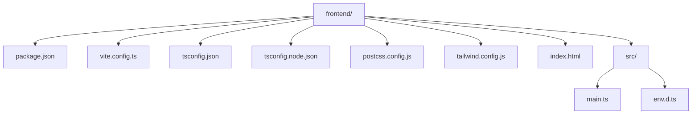
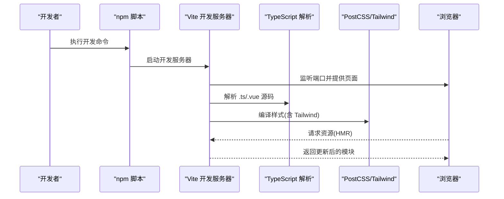
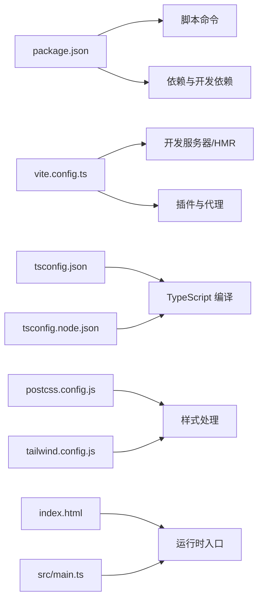

# 开发环境搭建

<cite>
**本文引用的文件**   
- [frontend/package.json](file://frontend/package.json)
- [frontend/vite.config.ts](file://frontend/vite.config.ts)
- [frontend/tsconfig.json](file://frontend/tsconfig.json)
- [frontend/tsconfig.node.json](file://frontend/tsconfig.node.json)
- [frontend/postcss.config.js](file://frontend/postcss.config.js)
- [frontend/tailwind.config.js](file://frontend/tailwind.config.js)
- [frontend/index.html](file://frontend/index.html)
- [frontend/src/main.ts](file://frontend/src/main.ts)
- [frontend/src/env.d.ts](file://frontend/src/env.d.ts)
</cite>

## 目录
1. [简介](#简介)
2. [项目结构](#项目结构)
3. [核心组件](#核心组件)
4. [架构总览](#架构总览)
5. [详细组件分析](#详细组件分析)
6. [依赖关系分析](#依赖关系分析)
7. [性能考虑](#性能考虑)
8. [故障排查指南](#故障排查指南)
9. [结论](#结论)
10. [附录](#附录)

## 简介
本指南面向初学者，提供从零开始的前端开发环境搭建流程。内容涵盖 Node.js 与 npm 版本要求、前端依赖安装、Vite 构建工具配置、TypeScript 编译选项、PostCSS 与 Tailwind CSS 样式系统配置、开发服务器启动命令、热重载与环境变量设置，以及 IDE 与调试建议。

## 项目结构
本项目采用前后端分离的目录组织方式，前端位于 frontend 子目录，使用 Vite + TypeScript + Vue 技术栈，并通过 PostCSS 与 Tailwind CSS 进行样式处理。

图表来源
- [frontend/package.json](file://frontend/package.json)
- [frontend/vite.config.ts](file://frontend/vite.config.ts)
- [frontend/tsconfig.json](file://frontend/tsconfig.json)
- [frontend/tsconfig.node.json](file://frontend/tsconfig.node.json)
- [frontend/postcss.config.js](file://frontend/postcss.config.js)
- [frontend/tailwind.config.js](file://frontend/tailwind.config.js)
- [frontend/index.html](file://frontend/index.html)
- [frontend/src/main.ts](file://frontend/src/main.ts)
- [frontend/src/env.d.ts](file://frontend/src/env.d.ts)

章节来源
- [frontend/package.json](file://frontend/package.json)
- [frontend/vite.config.ts](file://frontend/vite.config.ts)
- [frontend/tsconfig.json](file://frontend/tsconfig.json)
- [frontend/tsconfig.node.json](file://frontend/tsconfig.node.json)
- [frontend/postcss.config.js](file://frontend/postcss.config.js)
- [frontend/tailwind.config.js](file://frontend/tailwind.config.js)
- [frontend/index.html](file://frontend/index.html)
- [frontend/src/main.ts](file://frontend/src/main.ts)
- [frontend/src/env.d.ts](file://frontend/src/env.d.ts)

## 核心组件
本节聚焦前端工程的核心配置文件与入口，说明其职责与关键项。

- package.json：定义 Node.js 版本约束、脚本命令（如开发、构建）、依赖与开发依赖列表。
- vite.config.ts：Vite 构建与开发服务器配置，包括端口、代理、插件等。
- tsconfig.json / tsconfig.node.json：TypeScript 编译目标、模块解析、路径映射与节点环境类型。
- postcss.config.js：PostCSS 插件链，通常包含 Tailwind CSS、Autoprefixer 等。
- tailwind.config.js：Tailwind CSS 主题、自定义扩展与扫描范围。
- index.html：应用 HTML 入口，注入 Vite 资源。
- src/main.ts：Vue 应用初始化入口。
- src/env.d.ts：为 Vite 环境变量提供类型声明。

章节来源
- [frontend/package.json](file://frontend/package.json)
- [frontend/vite.config.ts](file://frontend/vite.config.ts)
- [frontend/tsconfig.json](file://frontend/tsconfig.json)
- [frontend/tsconfig.node.json](file://frontend/tsconfig.node.json)
- [frontend/postcss.config.js](file://frontend/postcss.config.js)
- [frontend/tailwind.config.js](file://frontend/tailwind.config.js)
- [frontend/index.html](file://frontend/index.html)
- [frontend/src/main.ts](file://frontend/src/main.ts)
- [frontend/src/env.d.ts](file://frontend/src/env.d.ts)

## 架构总览
下图展示了前端开发环境的整体工作流：开发者通过 npm 脚本启动 Vite 开发服务器，浏览器访问本地地址；Vite 根据 vite.config.ts 加载插件、解析 TypeScript 与样式（PostCSS/Tailwind），并基于 index.html 与 src/main.ts 初始化应用。

图表来源
- [frontend/vite.config.ts](file://frontend/vite.config.ts)
- [frontend/tsconfig.json](file://frontend/tsconfig.json)
- [frontend/postcss.config.js](file://frontend/postcss.config.js)
- [frontend/tailwind.config.js](file://frontend/tailwind.config.js)
- [frontend/index.html](file://frontend/index.html)
- [frontend/src/main.ts](file://frontend/src/main.ts)

## 详细组件分析

### Node.js 与 npm 版本要求
- 在 package.json 中定义了 Node.js 版本约束，请确保本地 Node.js 版本满足该要求。
- 推荐使用与 package.json 中一致的 Node.js 版本管理工具（如 nvm）以避免版本冲突。
- npm 版本随 Node.js 自带，无需单独升级；若需特定版本，可通过 npm install -g npm@<version> 指定。

章节来源
- [frontend/package.json](file://frontend/package.json)

### 依赖安装与包管理器选择
- 进入前端目录后，使用 npm 或 pnpm/yarn 安装依赖。
- 若存在 lock 文件（如 package-lock.json），优先使用该锁文件以保证一致性。
- 安装完成后，可运行开发脚本验证环境是否就绪。

章节来源
- [frontend/package.json](file://frontend/package.json)

### Vite 构建工具配置
- 开发服务器：在 vite.config.ts 中配置端口、主机、HMR 行为等。
- 代理：如需跨域调用后端 API，可在 vite.config.ts 中配置 devServer.proxy。
- 插件：按需引入 Vite 官方或社区插件（例如 @vitejs/plugin-vue）。
- 构建输出：生产构建产物目录与资源前缀可在 vite.config.ts 中调整。

章节来源
- [frontend/vite.config.ts](file://frontend/vite.config.ts)

### TypeScript 编译选项
- tsconfig.json：定义目标语言版本、模块系统、严格模式、路径别名等。
- tsconfig.node.json：针对 Vite 构建脚本与 Node 环境的类型与解析配置。
- 建议在 IDE 中启用 TypeScript 诊断，以获得更准确的错误提示。

章节来源
- [frontend/tsconfig.json](file://frontend/tsconfig.json)
- [frontend/tsconfig.node.json](file://frontend/tsconfig.node.json)

### PostCSS 与 Tailwind CSS 样式系统
- postcss.config.js：注册 PostCSS 插件链，常见组合为 Tailwind CSS 与 Autoprefixer。
- tailwind.config.js：配置 Tailwind 的主题、自定义扩展、扫描的文件路径等。
- 在样式文件中引入 Tailwind 指令（如 @tailwind base/components/utilities），由 PostCSS 处理。

章节来源
- [frontend/postcss.config.js](file://frontend/postcss.config.js)
- [frontend/tailwind.config.js](file://frontend/tailwind.config.js)

### 应用入口与 HTML 模板
- index.html：作为 Vite 应用的 HTML 入口，Vite 会自动注入客户端 HMR 脚本与打包资源。
- src/main.ts：Vue 应用初始化入口，挂载根组件并启动路由、状态管理等。

章节来源
- [frontend/index.html](file://frontend/index.html)
- [frontend/src/main.ts](file://frontend/src/main.ts)

### 环境变量设置
- 在 Vite 项目中，以 VITE_ 开头的变量会在构建时注入到全局 import.meta.env 中。
- 为获得类型提示，可在 src/env.d.ts 中声明环境变量类型。
- 开发环境与生产环境可使用不同的 .env 文件（如 .env.development、.env.production）。

章节来源
- [frontend/src/env.d.ts](file://frontend/src/env.d.ts)

## 依赖关系分析
下图展示前端工程的关键依赖关系：package.json 驱动脚本与依赖；vite.config.ts 控制构建与开发行为；tsconfig.* 影响 TypeScript 编译；postcss.config.js 与 tailwind.config.js 共同完成样式处理；index.html 与 main.ts 构成运行时入口。

图表来源
- [frontend/package.json](file://frontend/package.json)
- [frontend/vite.config.ts](file://frontend/vite.config.ts)
- [frontend/tsconfig.json](file://frontend/tsconfig.json)
- [frontend/tsconfig.node.json](file://frontend/tsconfig.node.json)
- [frontend/postcss.config.js](file://frontend/postcss.config.js)
- [frontend/tailwind.config.js](file://frontend/tailwind.config.js)
- [frontend/index.html](file://frontend/index.html)
- [frontend/src/main.ts](file://frontend/src/main.ts)

## 性能考虑
- 合理使用 Tree Shaking：避免引入未使用的模块，保持代码精简。
- 图片与静态资源优化：对大图进行压缩或使用合适的格式（WebP/AVIF）。
- 按需引入第三方库：减少打包体积，提升首屏加载速度。
- 开启 Gzip/Brotli：在生产部署时启用服务端压缩。
- 缓存策略：利用浏览器缓存与 CDN 缓存静态资源。

## 故障排查指南
- 端口占用：若默认端口被占用，修改 vite.config.ts 中的端口配置或释放占用进程。
- 代理失败：检查 vite.config.ts 中的代理规则与后端服务地址是否正确。
- 样式不生效：确认 postcss.config.js 与 tailwind.config.js 已正确配置，且样式文件已被扫描。
- TypeScript 报错：核对 tsconfig.json 与 tsconfig.node.json 的目标与模块设置是否与 Vite 兼容。
- 环境变量未注入：确认变量名以 VITE_ 开头，并在需要处通过 import.meta.env 读取。
- 依赖安装失败：清理 node_modules 与锁文件后重试，或切换镜像源。

## 结论
按照本指南完成 Node.js 与依赖安装、Vite/TypeScript/PostCSS/Tailwind 配置后，即可顺利启动开发服务器并进行热重载开发。结合 IDE 与调试工具的建议，可进一步提升开发与排错效率。

## 附录

### 从零开始的完整流程（步骤清单）
- 安装 Node.js：确保版本满足 package.json 中的要求。
- 安装依赖：进入 frontend 目录，执行依赖安装命令。
- 启动开发服务器：执行开发脚本，打开浏览器访问本地地址。
- 配置代理（可选）：如需访问后端 API，在 vite.config.ts 中配置代理。
- 编写样式：在样式文件中引入 Tailwind 指令，按需在 tailwind.config.js 中扩展主题。
- 设置环境变量：在 .env 文件中添加 VITE_ 前缀的变量，并在 src/env.d.ts 中声明类型。
- 构建生产包：执行构建脚本，将产物部署至静态服务器或容器。

### IDE 与调试建议
- VS Code 推荐插件：
  - Vue Language Features (Volar)
  - TypeScript Vue Plugin (Volar)
  - ESLint
  - Prettier
  - Tailwind CSS IntelliSense
  - Error Lens
- 调试方法：
  - 使用浏览器开发者工具的 Sources 面板进行断点调试。
  - 在 Vite 开发模式下，HMR 会快速刷新变更，便于定位问题。
  - 对于网络请求，可在 Network 面板查看请求与响应。