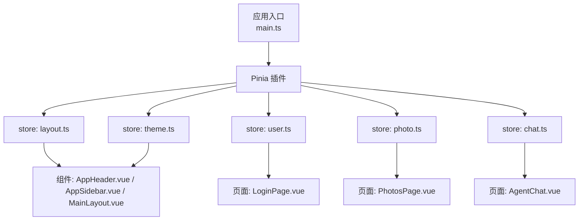
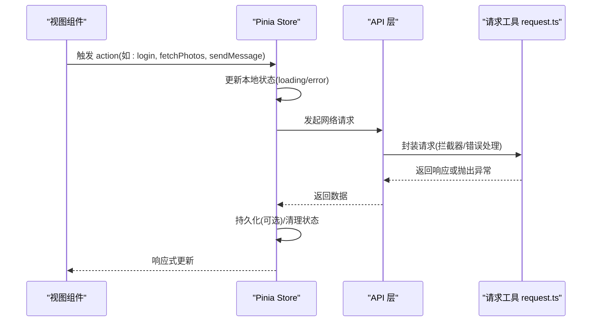
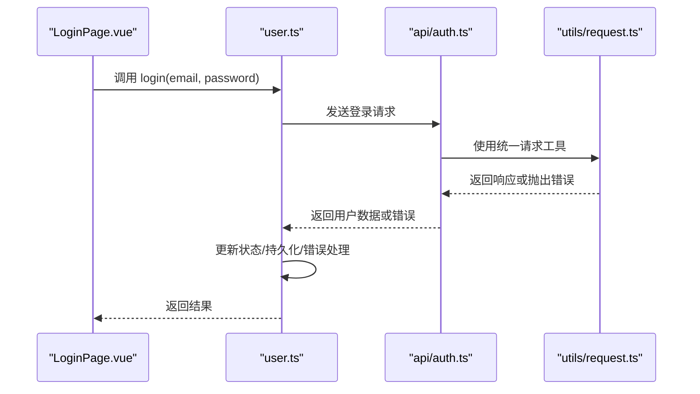
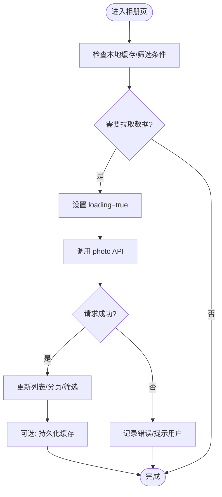
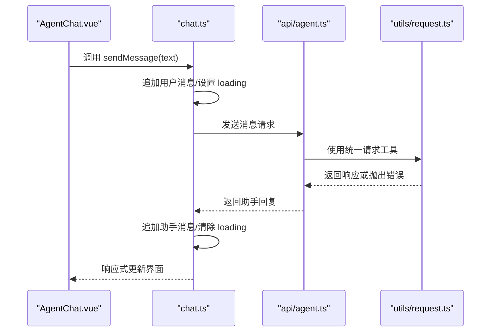
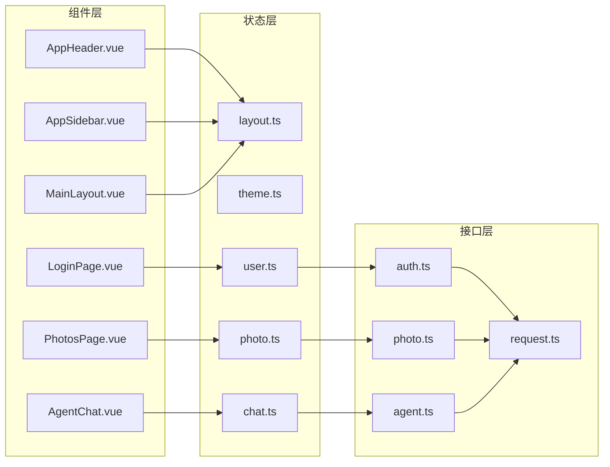

# 状态管理

<cite>
**本文引用的文件**   
- [frontend/src/stores/layout.ts](file://frontend/src/stores/layout.ts)
- [frontend/src/stores/theme.ts](file://frontend/src/stores/theme.ts)
- [frontend/src/stores/user.ts](file://frontend/src/stores/user.ts)
- [frontend/src/stores/photo.ts](file://frontend/src/stores/photo.ts)
- [frontend/src/stores/chat.ts](file://frontend/src/stores/chat.ts)
- [frontend/src/main.ts](file://frontend/src/main.ts)
- [frontend/src/api/auth.ts](file://frontend/src/api/auth.ts)
- [frontend/src/api/agent.ts](file://frontend/src/api/agent.ts)
- [frontend/src/api/photo.ts](file://frontend/src/api/photo.ts)
- [frontend/src/utils/request.ts](file://frontend/src/utils/request.ts)
- [frontend/src/components/layout/AppHeader.vue](file://frontend/src/components/layout/AppHeader.vue)
- [frontend/src/components/layout/AppSidebar.vue](file://frontend/src/components/layout/AppSidebar.vue)
- [frontend/src/layouts/MainLayout.vue](file://frontend/src/layouts/MainLayout.vue)
- [frontend/src/views/LoginPage.vue](file://frontend/src/views/LoginPage.vue)
- [frontend/src/views/AgentChat.vue](file://frontend/src/views/AgentChat.vue)
- [frontend/src/views/PhotosPage.vue](file://frontend/src/views/PhotosPage.vue)
</cite>

## 目录
1. [简介](#简介)
2. [项目结构](#项目结构)
3. [核心组件](#核心组件)
4. [架构总览](#架构总览)
5. [详细组件分析](#详细组件分析)
6. [依赖分析](#依赖分析)
7. [性能考虑](#性能考虑)
8. [故障排查指南](#故障排查指南)
9. [结论](#结论)
10. [附录](#附录)

## 简介
本文件聚焦于前端 Vue 3 + Pinia 的状态管理实践，围绕以下 store 展开：layout.ts（布局）、theme.ts（主题）、user.ts（用户信息）、photo.ts（照片数据）、chat.ts（聊天状态）。文档涵盖 store 结构设计、状态持久化策略、异步操作处理、状态同步模式、错误处理与性能优化技巧，并提供可落地的最佳实践。

## 项目结构
前端采用按功能域划分的 stores 目录组织状态模块，配合 API 层与视图组件进行解耦。Pinia 在应用入口初始化并挂载到全局实例中，各 store 通过组合式 API 暴露 state、getters、actions，供组件消费。

图表来源
- [frontend/src/main.ts](file://frontend/src/main.ts)
- [frontend/src/stores/layout.ts](file://frontend/src/stores/layout.ts)
- [frontend/src/stores/theme.ts](file://frontend/src/stores/theme.ts)
- [frontend/src/stores/user.ts](file://frontend/src/stores/user.ts)
- [frontend/src/stores/photo.ts](file://frontend/src/stores/photo.ts)
- [frontend/src/stores/chat.ts](file://frontend/src/stores/chat.ts)
- [frontend/src/components/layout/AppHeader.vue](file://frontend/src/components/layout/AppHeader.vue)
- [frontend/src/components/layout/AppSidebar.vue](file://frontend/src/components/layout/AppSidebar.vue)
- [frontend/src/layouts/MainLayout.vue](file://frontend/src/layouts/MainLayout.vue)
- [frontend/src/views/LoginPage.vue](file://frontend/src/views/LoginPage.vue)
- [frontend/src/views/PhotosPage.vue](file://frontend/src/views/PhotosPage.vue)
- [frontend/src/views/AgentChat.vue](file://frontend/src/views/AgentChat.vue)

章节来源
- [frontend/src/main.ts](file://frontend/src/main.ts)

## 核心组件
本节概述五个核心 store 的职责边界与交互方式：
- layout.ts：控制侧边栏/头部折叠、抽屉开关等 UI 布局状态。
- theme.ts：维护主题色、明暗模式等主题相关状态，支持持久化。
- user.ts：保存登录态、用户基本信息、权限等，提供登录/登出等动作。
- photo.ts：承载照片列表、分页、筛选、上传进度等数据与流程。
- chat.ts：管理对话消息、输入状态、AI 代理交互流。

章节来源
- [frontend/src/stores/layout.ts](file://frontend/src/stores/layout.ts)
- [frontend/src/stores/theme.ts](file://frontend/src/stores/theme.ts)
- [frontend/src/stores/user.ts](file://frontend/src/stores/user.ts)
- [frontend/src/stores/photo.ts](file://frontend/src/stores/photo.ts)
- [frontend/src/stores/chat.ts](file://frontend/src/stores/chat.ts)

## 架构总览
下图展示从组件到 store 再到 API 层的调用链路与数据流向。

图表来源
- [frontend/src/stores/user.ts](file://frontend/src/stores/user.ts)
- [frontend/src/stores/photo.ts](file://frontend/src/stores/photo.ts)
- [frontend/src/stores/chat.ts](file://frontend/src/stores/chat.ts)
- [frontend/src/api/auth.ts](file://frontend/src/api/auth.ts)
- [frontend/src/api/photo.ts](file://frontend/src/api/photo.ts)
- [frontend/src/api/agent.ts](file://frontend/src/api/agent.ts)
- [frontend/src/utils/request.ts](file://frontend/src/utils/request.ts)

## 详细组件分析

### layout.ts 布局状态
职责
- 管理侧边栏/头部折叠、抽屉打开关闭、移动端适配等布局状态。
- 提供切换方法，供 Header/Sidebar 组件直接调用。

典型用法
- 在 AppHeader.vue 与 AppSidebar.vue 中读取/更新布局状态。
- 在 MainLayout.vue 中根据状态渲染不同布局区域。

示例路径
- [AppHeader.vue 使用布局状态](file://frontend/src/components/layout/AppHeader.vue)
- [AppSidebar.vue 使用布局状态](file://frontend/src/components/layout/AppSidebar.vue)
- [MainLayout.vue 布局渲染](file://frontend/src/layouts/MainLayout.vue)

章节来源
- [frontend/src/stores/layout.ts](file://frontend/src/stores/layout.ts)
- [frontend/src/components/layout/AppHeader.vue](file://frontend/src/components/layout/AppHeader.vue)
- [frontend/src/components/layout/AppSidebar.vue](file://frontend/src/components/layout/AppSidebar.vue)
- [frontend/src/layouts/MainLayout.vue](file://frontend/src/layouts/MainLayout.vue)

### theme.ts 主题切换
职责
- 维护当前主题（明/暗）与主题变量。
- 提供切换 action，并在必要时将主题写入持久化存储。

典型用法
- 在设置页或头部快捷入口触发切换。
- 在根组件或主题注入逻辑中监听主题变化以应用样式。

示例路径
- [主题切换入口（示例）](file://frontend/src/components/layout/AppHeader.vue)

章节来源
- [frontend/src/stores/theme.ts](file://frontend/src/stores/theme.ts)

### user.ts 用户信息
职责
- 保存登录态、用户基本信息、令牌等。
- 提供登录、登出、刷新信息等 actions。
- 负责与 auth API 交互，并进行必要的持久化与错误处理。

典型流程
- 登录：校验输入 -> 调用 API -> 成功则持久化用户信息 -> 跳转首页；失败则记录错误。
- 登出：清空本地用户信息与令牌 -> 重置路由或回到登录页。

示例路径
- [LoginPage.vue 调用登录流程](file://frontend/src/views/LoginPage.vue)
- [auth.ts 登录接口定义](file://frontend/src/api/auth.ts)
- [request.ts 请求封装](file://frontend/src/utils/request.ts)

图表来源
- [frontend/src/views/LoginPage.vue](file://frontend/src/views/LoginPage.vue)
- [frontend/src/stores/user.ts](file://frontend/src/stores/user.ts)
- [frontend/src/api/auth.ts](file://frontend/src/api/auth.ts)
- [frontend/src/utils/request.ts](file://frontend/src/utils/request.ts)

章节来源
- [frontend/src/stores/user.ts](file://frontend/src/stores/user.ts)
- [frontend/src/views/LoginPage.vue](file://frontend/src/views/LoginPage.vue)
- [frontend/src/api/auth.ts](file://frontend/src/api/auth.ts)
- [frontend/src/utils/request.ts](file://frontend/src/utils/request.ts)

### photo.ts 照片数据
职责
- 管理照片列表、分页、筛选条件、加载状态、错误信息。
- 提供获取列表、上传、删除等 actions。
- 与 photo API 交互，结合 request.ts 的错误处理与重试策略。

典型流程
- 进入相册页：根据筛选条件拉取数据 -> 更新 loading -> 成功后缓存数据 -> 失败时提示错误。
- 上传照片：选择文件 -> 调用上传接口 -> 更新进度 -> 完成后刷新列表。

示例路径
- [PhotosPage.vue 消费 photo store](file://frontend/src/views/PhotosPage.vue)
- [photo.ts 照片接口定义](file://frontend/src/api/photo.ts)
- [request.ts 请求封装](file://frontend/src/utils/request.ts)

图表来源
- [frontend/src/stores/photo.ts](file://frontend/src/stores/photo.ts)
- [frontend/src/api/photo.ts](file://frontend/src/api/photo.ts)
- [frontend/src/utils/request.ts](file://frontend/src/utils/request.ts)
- [frontend/src/views/PhotosPage.vue](file://frontend/src/views/PhotosPage.vue)

章节来源
- [frontend/src/stores/photo.ts](file://frontend/src/stores/photo.ts)
- [frontend/src/views/PhotosPage.vue](file://frontend/src/views/PhotosPage.vue)
- [frontend/src/api/photo.ts](file://frontend/src/api/photo.ts)
- [frontend/src/utils/request.ts](file://frontend/src/utils/request.ts)

### chat.ts 聊天状态
职责
- 管理对话消息数组、输入内容、发送状态、错误信息。
- 与 agent API 交互，实现消息发送、接收与流式/非流式处理。
- 提供清空对话、滚动到底部等辅助方法。

典型流程
- 用户输入 -> 调用发送 action -> 更新本地消息 -> 等待服务端响应 -> 追加消息 -> 处理错误。

示例路径
- [AgentChat.vue 消费 chat store](file://frontend/src/views/AgentChat.vue)
- [agent.ts 代理接口定义](file://frontend/src/api/agent.ts)
- [request.ts 请求封装](file://frontend/src/utils/request.ts)

图表来源
- [frontend/src/views/AgentChat.vue](file://frontend/src/views/AgentChat.vue)
- [frontend/src/stores/chat.ts](file://frontend/src/stores/chat.ts)
- [frontend/src/api/agent.ts](file://frontend/src/api/agent.ts)
- [frontend/src/utils/request.ts](file://frontend/src/utils/request.ts)

章节来源
- [frontend/src/stores/chat.ts](file://frontend/src/stores/chat.ts)
- [frontend/src/views/AgentChat.vue](file://frontend/src/views/AgentChat.vue)
- [frontend/src/api/agent.ts](file://frontend/src/api/agent.ts)
- [frontend/src/utils/request.ts](file://frontend/src/utils/request.ts)

## 依赖分析
- 组件对 store 的依赖：通过 Pinia 提供的 useXxxStore() 访问状态与方法，避免跨层级 props 传递。
- store 对 API 的依赖：每个业务 store 仅依赖对应 API 模块，保持单一职责。
- API 对请求工具的依赖：统一使用 request.ts 封装的请求函数，集中处理拦截器、错误码、超时与重试。

图表来源
- [frontend/src/components/layout/AppHeader.vue](file://frontend/src/components/layout/AppHeader.vue)
- [frontend/src/components/layout/AppSidebar.vue](file://frontend/src/components/layout/AppSidebar.vue)
- [frontend/src/layouts/MainLayout.vue](file://frontend/src/layouts/MainLayout.vue)
- [frontend/src/views/LoginPage.vue](file://frontend/src/views/LoginPage.vue)
- [frontend/src/views/PhotosPage.vue](file://frontend/src/views/PhotosPage.vue)
- [frontend/src/views/AgentChat.vue](file://frontend/src/views/AgentChat.vue)
- [frontend/src/stores/layout.ts](file://frontend/src/stores/layout.ts)
- [frontend/src/stores/theme.ts](file://frontend/src/stores/theme.ts)
- [frontend/src/stores/user.ts](file://frontend/src/stores/user.ts)
- [frontend/src/stores/photo.ts](file://frontend/src/stores/photo.ts)
- [frontend/src/stores/chat.ts](file://frontend/src/stores/chat.ts)
- [frontend/src/api/auth.ts](file://frontend/src/api/auth.ts)
- [frontend/src/api/photo.ts](file://frontend/src/api/photo.ts)
- [frontend/src/api/agent.ts](file://frontend/src/api/agent.ts)
- [frontend/src/utils/request.ts](file://frontend/src/utils/request.ts)

章节来源
- [frontend/src/stores/layout.ts](file://frontend/src/stores/layout.ts)
- [frontend/src/stores/theme.ts](file://frontend/src/stores/theme.ts)
- [frontend/src/stores/user.ts](file://frontend/src/stores/user.ts)
- [frontend/src/stores/photo.ts](file://frontend/src/stores/photo.ts)
- [frontend/src/stores/chat.ts](file://frontend/src/stores/chat.ts)
- [frontend/src/api/auth.ts](file://frontend/src/api/auth.ts)
- [frontend/src/api/photo.ts](file://frontend/src/api/photo.ts)
- [frontend/src/api/agent.ts](file://frontend/src/api/agent.ts)
- [frontend/src/utils/request.ts](file://frontend/src/utils/request.ts)

## 性能考虑
- 计算属性（getters）：在 store 中为派生状态提供 getters，减少组件内重复计算。
- 惰性加载：仅在需要时拉取数据，结合分页与缓存策略降低首屏压力。
- 防抖/节流：对频繁触发的搜索、滚动、窗口尺寸变化等事件进行节流/防抖。
- 局部更新：尽量只更新必要字段，避免整块对象替换导致不必要的重渲染。
- 大列表虚拟化：照片列表较长时使用虚拟滚动，减少 DOM 节点数量。
- 并发控制：对批量上传、并行请求进行限流与去重，避免雪崩。
- 持久化体积控制：仅持久化必要字段，定期清理过期缓存。

[本节为通用指导，不直接分析具体文件]

## 故障排查指南
- 登录失败
  - 检查 user.ts 的登录 action 是否正确调用 auth.ts 接口。
  - 查看 request.ts 的拦截器是否捕获了错误码并正确抛出。
  - 确认持久化存储是否被意外清空。
- 照片列表为空或加载卡住
  - 检查 photo.ts 的分页参数与筛选条件是否正确。
  - 观察 loading 与 error 状态流转，定位 API 返回结构差异。
- 聊天消息未显示
  - 核对 chat.ts 的消息追加逻辑与滚动行为。
  - 验证 agent.ts 的响应格式与错误分支。

章节来源
- [frontend/src/stores/user.ts](file://frontend/src/stores/user.ts)
- [frontend/src/stores/photo.ts](file://frontend/src/stores/photo.ts)
- [frontend/src/stores/chat.ts](file://frontend/src/stores/chat.ts)
- [frontend/src/api/auth.ts](file://frontend/src/api/auth.ts)
- [frontend/src/api/photo.ts](file://frontend/src/api/photo.ts)
- [frontend/src/api/agent.ts](file://frontend/src/api/agent.ts)
- [frontend/src/utils/request.ts](file://frontend/src/utils/request.ts)

## 结论
通过将布局、主题、用户、照片、聊天等关注点拆分为独立 store，并结合统一的 API 层与请求工具，项目在可维护性、可扩展性与性能方面均获得显著提升。建议持续完善错误处理、日志埋点与监控指标，逐步引入更完善的缓存与重试策略，进一步提升用户体验。

[本节为总结性内容，不直接分析具体文件]

## 附录
- 状态同步策略
  - 单向数据流：组件触发 action -> store 更新状态 -> 视图自动响应。
  - 副作用隔离：网络请求、持久化等副作用集中在 store 的 action 中。
  - 状态快照：关键流程前后保留快照，便于回滚与调试。
- 错误处理模式
  - 统一错误包装：在 request.ts 中标准化错误对象。
  - 用户可见提示：在 store 层聚合错误信息，组件层统一提示。
  - 重试与降级：对幂等请求实施指数退避重试，失败时降级展示。
- 代码示例路径（不含代码内容）
  - 状态更新：[user.ts 登录 action](file://frontend/src/stores/user.ts)
  - 计算属性：[photo.ts 派生筛选结果](file://frontend/src/stores/photo.ts)
  - watch 监听器：[theme.ts 监听主题变化](file://frontend/src/stores/theme.ts)
  - 异步流程：[chat.ts 发送消息](file://frontend/src/stores/chat.ts)

[本节为补充说明，不直接分析具体文件]