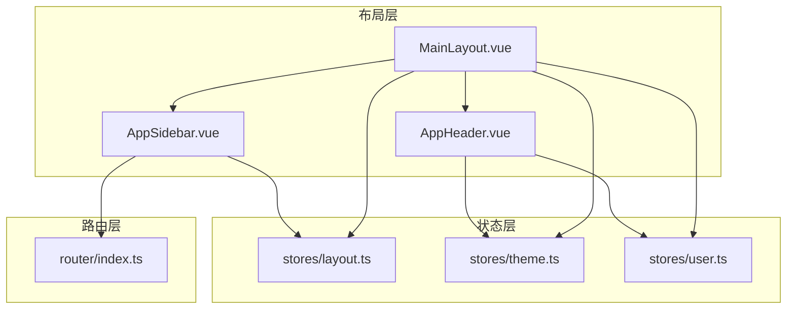
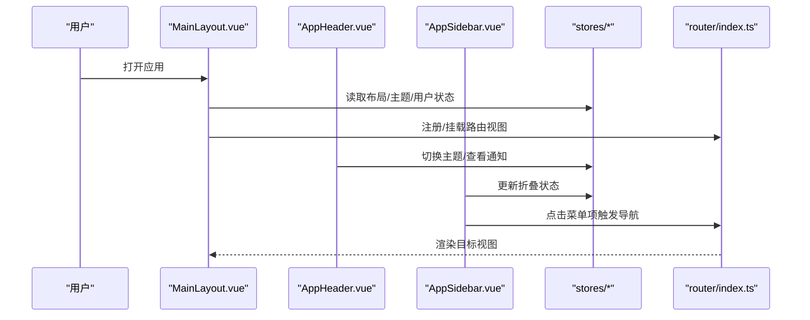
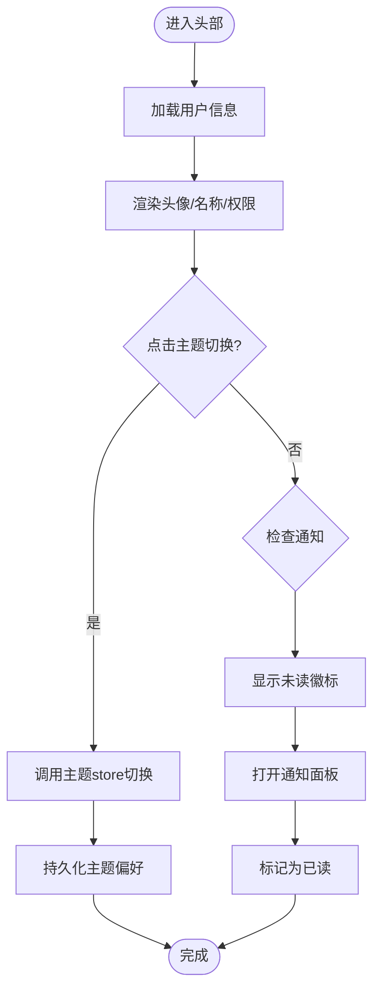
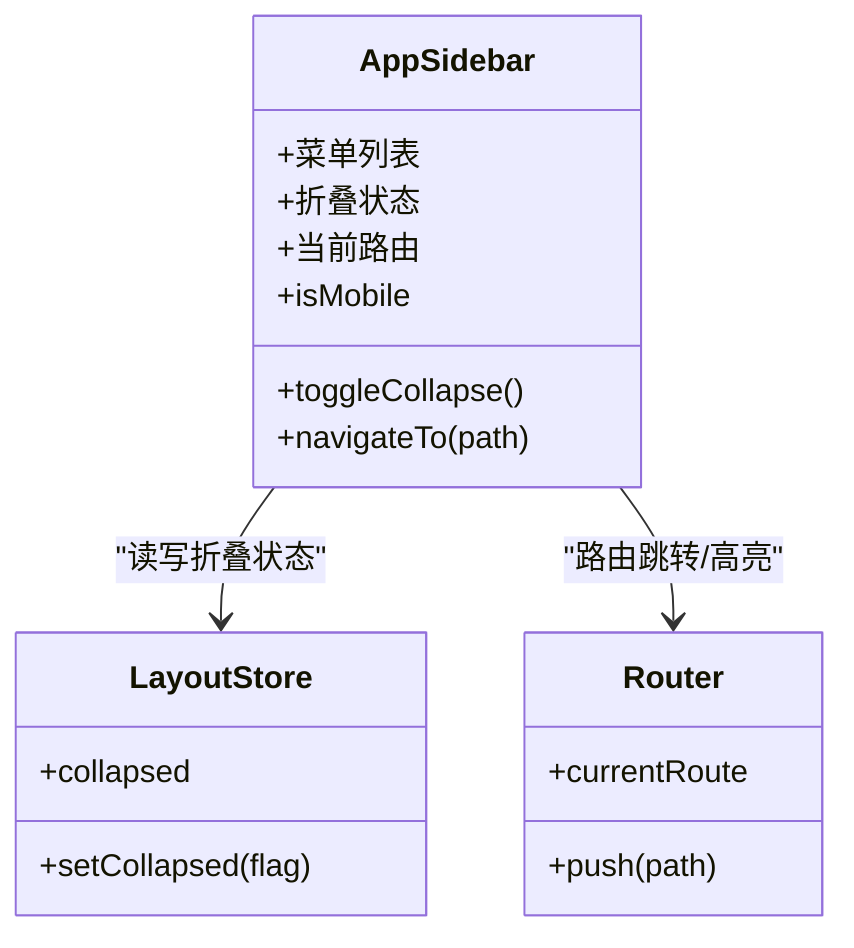
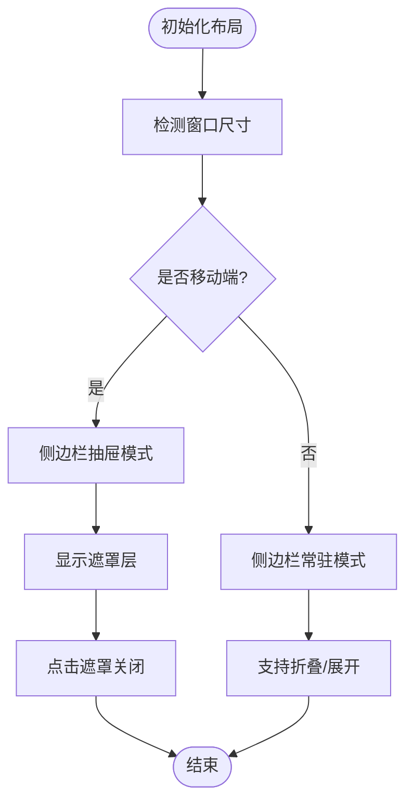
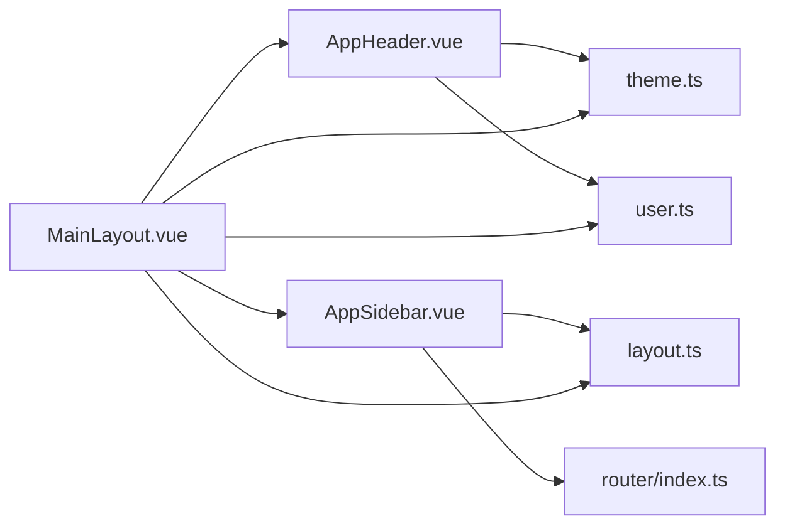

# 布局系统

<cite>
**本文引用的文件**   
- [MainLayout.vue](file://frontend/src/layouts/MainLayout.vue)
- [AppHeader.vue](file://frontend/src/components/layout/AppHeader.vue)
- [AppSidebar.vue](file://frontend/src/components/layout/AppSidebar.vue)
- [layout.ts](file://frontend/src/stores/layout.ts)
- [theme.ts](file://frontend/src/stores/theme.ts)
- [user.ts](file://frontend/src/stores/user.ts)
- [index.ts](file://frontend/src/router/index.ts)
</cite>

## 目录
1. [简介](#简介)
2. [项目结构](#项目结构)
3. [核心组件](#核心组件)
4. [架构总览](#架构总览)
5. [详细组件分析](#详细组件分析)
6. [依赖关系分析](#依赖关系分析)
7. [性能考虑](#性能考虑)
8. [故障排查指南](#故障排查指南)
9. [结论](#结论)
10. [附录](#附录)

## 简介
本文件面向前端布局子系统，聚焦于主布局与头部、侧边栏三大组件的架构设计与实现思路。文档覆盖以下主题：
- 主布局 MainLayout.vue 的整体结构与职责边界
- AppHeader 头部模块：用户信息展示、导航菜单、主题切换、通知系统
- AppSidebar 侧边栏模块：路由导航、菜单折叠、响应式适配
- 布局系统的响应式设计：移动端适配、屏幕尺寸检测
- 布局状态管理、路由守卫集成、权限控制集成
- 扩展指南与自定义布局开发示例
- 性能优化技巧与最佳实践

## 项目结构
布局相关代码位于前端 src 目录下，采用“按功能域组织”的结构：
- layouts：页面级布局容器（如 MainLayout）
- components/layout：通用布局子组件（AppHeader、AppSidebar）
- stores：布局与主题等全局状态（layout.ts、theme.ts、user.ts）
- router：路由定义与守卫（index.ts）

图表来源
- [MainLayout.vue](file://frontend/src/layouts/MainLayout.vue)
- [AppHeader.vue](file://frontend/src/components/layout/AppHeader.vue)
- [AppSidebar.vue](file://frontend/src/components/layout/AppSidebar.vue)
- [layout.ts](file://frontend/src/stores/layout.ts)
- [theme.ts](file://frontend/src/stores/theme.ts)
- [user.ts](file://frontend/src/stores/user.ts)
- [index.ts](file://frontend/src/router/index.ts)

章节来源
- [MainLayout.vue](file://frontend/src/layouts/MainLayout.vue)
- [AppHeader.vue](file://frontend/src/components/layout/AppHeader.vue)
- [AppSidebar.vue](file://frontend/src/components/layout/AppSidebar.vue)
- [layout.ts](file://frontend/src/stores/layout.ts)
- [theme.ts](file://frontend/src/stores/theme.ts)
- [user.ts](file://frontend/src/stores/user.ts)
- [index.ts](file://frontend/src/router/index.ts)

## 核心组件
- MainLayout.vue：应用主布局容器，负责整体骨架、顶部/侧边/内容区域划分、响应式行为协调、与全局状态和路由的对接。
- AppHeader.vue：顶部栏，承载用户信息、导航入口、主题切换、通知中心等功能。
- AppSidebar.vue：侧边栏，承载路由导航菜单、折叠展开、移动端抽屉模式等。

章节来源
- [MainLayout.vue](file://frontend/src/layouts/MainLayout.vue)
- [AppHeader.vue](file://frontend/src/components/layout/AppHeader.vue)
- [AppSidebar.vue](file://frontend/src/components/layout/AppSidebar.vue)

## 架构总览
布局系统遵循“容器-子组件-状态-路由”的分层设计：
- 容器层：MainLayout 作为根布局，组合 Header/Sidebar/Content，并订阅布局状态变化。
- 子组件层：AppHeader 与 AppSidebar 各自专注单一职责，通过 props/events 或 store 与父组件通信。
- 状态层：layout.ts 管理侧边栏折叠、移动端开关；theme.ts 管理明暗主题；user.ts 管理用户信息与权限。
- 路由层：router/index.ts 提供路由表与守卫逻辑，侧边栏根据路由高亮当前项，并在必要时进行跳转拦截。

图表来源
- [MainLayout.vue](file://frontend/src/layouts/MainLayout.vue)
- [AppHeader.vue](file://frontend/src/components/layout/AppHeader.vue)
- [AppSidebar.vue](file://frontend/src/components/layout/AppSidebar.vue)
- [layout.ts](file://frontend/src/stores/layout.ts)
- [theme.ts](file://frontend/src/stores/theme.ts)
- [user.ts](file://frontend/src/stores/user.ts)
- [index.ts](file://frontend/src/router/index.ts)

## 详细组件分析

### MainLayout.vue 主布局组件
- 职责边界
  - 组织页面骨架：头部、侧边栏、主内容区
  - 协调响应式行为：在移动端隐藏/显示侧边栏，处理遮罩层
  - 接入全局状态：监听布局折叠、主题、用户信息变化
  - 与路由集成：承载 <router-view>，配合路由守卫完成鉴权与重定向
- 关键交互
  - 侧边栏折叠：由 layout store 驱动，Header 可触发切换
  - 移动端适配：基于断点判断是否以抽屉模式呈现侧边栏
  - 主题同步：从 theme store 获取当前主题并应用到根节点
- 扩展点
  - 新增布局槽位：可在主布局中预留插槽供业务页复用
  - 多布局支持：通过条件渲染或动态组件加载不同布局模板

章节来源
- [MainLayout.vue](file://frontend/src/layouts/MainLayout.vue)
- [layout.ts](file://frontend/src/stores/layout.ts)
- [theme.ts](file://frontend/src/stores/theme.ts)
- [user.ts](file://frontend/src/stores/user.ts)
- [index.ts](file://frontend/src/router/index.ts)

### AppHeader.vue 头部组件
- 功能模块
  - 用户信息展示：头像、用户名、角色/权限摘要
  - 导航菜单：常用入口、下拉菜单、面包屑（如有）
  - 主题切换：明/暗主题切换按钮，联动 theme store
  - 通知系统：未读计数、消息列表、已读标记
- 数据流
  - 用户信息来自 user store，必要时发起异步请求刷新
  - 主题切换调用 theme store 的切换方法，持久化到本地存储
  - 通知列表与未读数由后端接口或本地队列维护
- 事件与通信
  - 向父组件或 store 派发“切换侧边栏”、“切换主题”等动作
  - 点击用户头像进入个人中心或退出登录

图表来源
- [AppHeader.vue](file://frontend/src/components/layout/AppHeader.vue)
- [theme.ts](file://frontend/src/stores/theme.ts)
- [user.ts](file://frontend/src/stores/user.ts)

章节来源
- [AppHeader.vue](file://frontend/src/components/layout/AppHeader.vue)
- [theme.ts](file://frontend/src/stores/theme.ts)
- [user.ts](file://frontend/src/stores/user.ts)

### AppSidebar.vue 侧边栏组件
- 功能模块
  - 路由导航：根据路由表生成菜单项，高亮当前路由
  - 菜单折叠：支持分组折叠、收起图标模式
  - 响应式适配：移动端以抽屉形式滑出，带遮罩层
- 数据流
  - 从路由配置或 store 中读取菜单结构
  - 监听路由变化，自动更新激活态
  - 折叠状态由 layout store 统一管理
- 交互流程
  - 点击菜单项：执行路由跳转，必要时触发权限校验
  - 折叠/展开：更新 layout store，主布局随之调整宽度

图表来源
- [AppSidebar.vue](file://frontend/src/components/layout/AppSidebar.vue)
- [layout.ts](file://frontend/src/stores/layout.ts)
- [index.ts](file://frontend/src/router/index.ts)

章节来源
- [AppSidebar.vue](file://frontend/src/components/layout/AppSidebar.vue)
- [layout.ts](file://frontend/src/stores/layout.ts)
- [index.ts](file://frontend/src/router/index.ts)

### 响应式设计实现
- 断点策略
  - 使用统一的断点常量，结合媒体查询或 JS 监听 window.innerWidth 判断移动端
- 移动端适配
  - 侧边栏在小屏下以抽屉模式出现，点击遮罩关闭
  - 头部在窄屏下简化操作项，保留关键入口
- 屏幕尺寸检测
  - 在布局层统一监听 resize，避免各组件重复监听造成性能问题
  - 将 isMobile 状态提升到 store，供 Header/Sidebar 共享

图表来源
- [MainLayout.vue](file://frontend/src/layouts/MainLayout.vue)
- [AppSidebar.vue](file://frontend/src/components/layout/AppSidebar.vue)
- [layout.ts](file://frontend/src/stores/layout.ts)

章节来源
- [MainLayout.vue](file://frontend/src/layouts/MainLayout.vue)
- [AppSidebar.vue](file://frontend/src/components/layout/AppSidebar.vue)
- [layout.ts](file://frontend/src/stores/layout.ts)

### 布局状态管理
- 状态划分
  - layout.ts：侧边栏折叠、移动端开关、抽屉可见性
  - theme.ts：主题模式、字体大小、颜色变量
  - user.ts：用户基本信息、权限集合、登录态
- 状态同步
  - 组件通过 actions 修改状态，确保单向数据流
  - 关键状态持久化（如主题、折叠偏好）到 localStorage
- 跨组件通信
  - Header 与 Sidebar 通过 store 共享布局状态，避免 prop drilling

章节来源
- [layout.ts](file://frontend/src/stores/layout.ts)
- [theme.ts](file://frontend/src/stores/theme.ts)
- [user.ts](file://frontend/src/stores/user.ts)

### 路由守卫集成与权限控制
- 路由守卫
  - 在进入受保护路由前，检查登录态与权限
  - 未登录或未授权时重定向至登录页或无权限提示页
- 权限控制
  - 基于用户角色/权限集合，动态渲染菜单与按钮
  - 侧边栏根据权限过滤不可见菜单项
- 集成方式
  - 在 router/index.ts 中定义全局前置守卫
  - 在布局层或子组件中按需二次校验

章节来源
- [index.ts](file://frontend/src/router/index.ts)
- [user.ts](file://frontend/src/stores/user.ts)
- [AppSidebar.vue](file://frontend/src/components/layout/AppSidebar.vue)

## 依赖关系分析
- 组件耦合
  - MainLayout 对 Header/Sidebar 有强依赖，但通过 store 解耦具体实现
  - Header/Sidebar 仅依赖 store 与 router，降低与业务页面的耦合
- 外部依赖
  - 主题库/样式框架（如 Tailwind）用于快速构建响应式界面
  - 路由库提供导航与守卫能力
- 潜在循环依赖
  - 避免在 store 中直接 import 组件，保持单向依赖

图表来源
- [MainLayout.vue](file://frontend/src/layouts/MainLayout.vue)
- [AppHeader.vue](file://frontend/src/components/layout/AppHeader.vue)
- [AppSidebar.vue](file://frontend/src/components/layout/AppSidebar.vue)
- [layout.ts](file://frontend/src/stores/layout.ts)
- [theme.ts](file://frontend/src/stores/theme.ts)
- [user.ts](file://frontend/src/stores/user.ts)
- [index.ts](file://frontend/src/router/index.ts)

章节来源
- [MainLayout.vue](file://frontend/src/layouts/MainLayout.vue)
- [AppHeader.vue](file://frontend/src/components/layout/AppHeader.vue)
- [AppSidebar.vue](file://frontend/src/components/layout/AppSidebar.vue)
- [layout.ts](file://frontend/src/stores/layout.ts)
- [theme.ts](file://frontend/src/stores/theme.ts)
- [user.ts](file://frontend/src/stores/user.ts)
- [index.ts](file://frontend/src/router/index.ts)

## 性能考虑
- 减少不必要的重渲染
  - 将频繁变化的状态拆分到独立 store，避免全量更新
  - 使用计算属性缓存派生状态
- 懒加载与按需引入
  - 路由与大型组件按需加载，首屏更快
- 事件节流与防抖
  - 窗口 resize 监听使用节流，避免高频回调
- 图片与资源优化
  - 头像与缩略图启用懒加载与占位图
- 主题切换优化
  - 使用 CSS 变量或类名切换，避免大量 DOM 操作

[本节为通用指导，不直接分析具体文件]

## 故障排查指南
- 侧边栏无法折叠
  - 检查 layout store 的 collapsed 状态是否正确更新
  - 确认 Header/Sidebar 是否订阅了同一状态源
- 主题切换无效
  - 验证 theme store 的切换方法与持久化逻辑
  - 检查根节点类名或 CSS 变量是否生效
- 路由跳转失败
  - 检查路由守卫是否放行，权限是否满足
  - 确认菜单项 path 与路由定义一致
- 移动端布局错乱
  - 核对断点常量与媒体查询一致性
  - 确认抽屉遮罩层 z-index 层级正确

章节来源
- [layout.ts](file://frontend/src/stores/layout.ts)
- [theme.ts](file://frontend/src/stores/theme.ts)
- [index.ts](file://frontend/src/router/index.ts)
- [AppSidebar.vue](file://frontend/src/components/layout/AppSidebar.vue)
- [AppHeader.vue](file://frontend/src/components/layout/AppHeader.vue)

## 结论
本布局系统通过清晰的分层与职责划分，实现了可扩展、可维护的前端布局方案。主布局负责编排，头部与侧边栏各司其职，状态集中在 store 管理，路由与权限在入口处统一控制。在此基础上，可按需扩展新的布局模板与子组件，同时借助响应式策略保障多端体验。

[本节为总结性内容，不直接分析具体文件]

## 附录

### 扩展指南与自定义布局开发示例
- 新增布局模板
  - 在 layouts 目录下创建新布局组件，复用 Header/Sidebar 或替换为自定义版本
  - 在主路由中为新页面指定新布局
- 自定义头部/侧边栏
  - 继承现有组件的 props/events 约定，保证与 store 的交互一致
  - 如需新增全局状态，先在 store 中定义，再在组件中订阅
- 权限与路由
  - 在路由守卫中集中处理鉴权逻辑，避免分散在各组件
  - 菜单项根据权限动态生成，确保前后端权限模型一致

[本节为概念性指导，不直接分析具体文件]