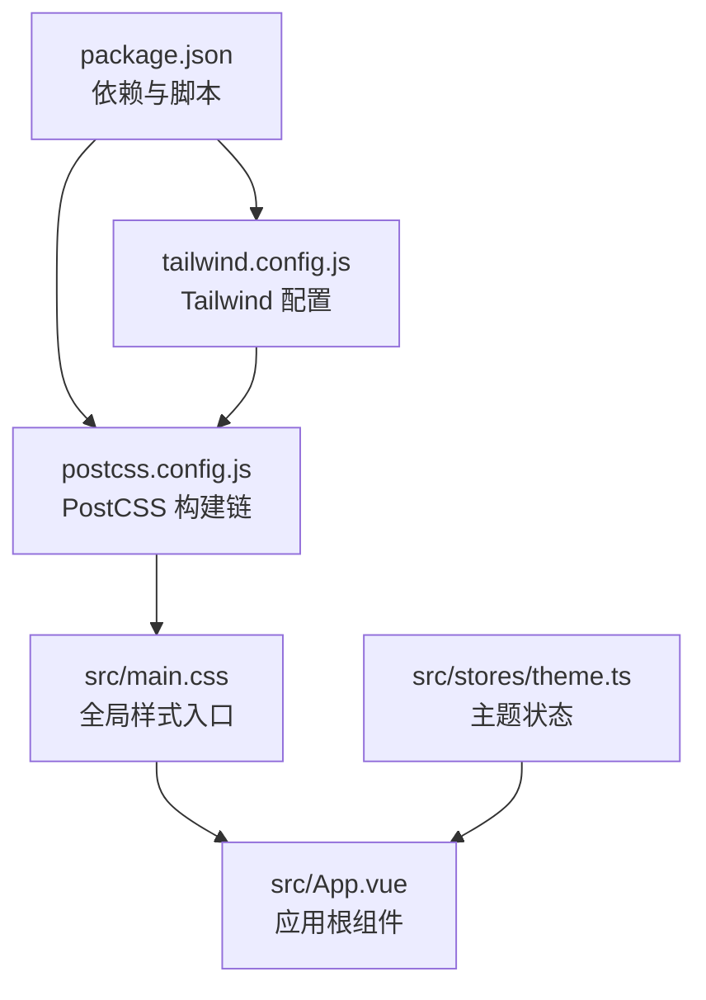
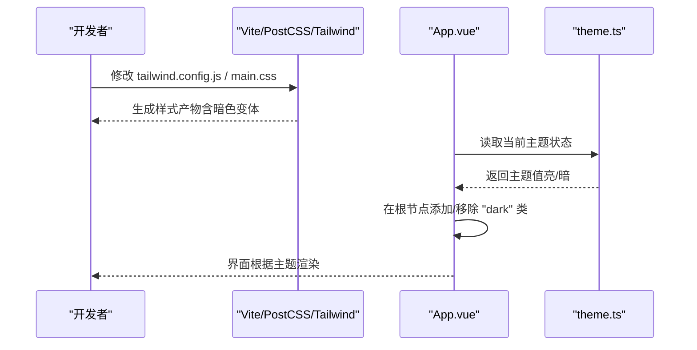
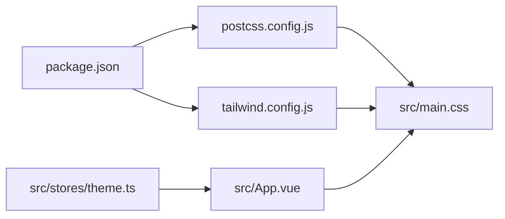

# 样式系统

<cite>
**本文引用的文件**   
- [tailwind.config.js](file://frontend/tailwind.config.js)
- [postcss.config.js](file://frontend/postcss.config.js)
- [main.css](file://frontend/src/main.css)
- [App.vue](file://frontend/src/App.vue)
- [theme.ts](file://frontend/src/stores/theme.ts)
- [package.json](file://frontend/package.json)
</cite>

## 目录
1. [简介](#简介)
2. [项目结构](#项目结构)
3. [核心组件](#核心组件)
4. [架构总览](#架构总览)
5. [详细组件分析](#详细组件分析)
6. [依赖关系分析](#依赖关系分析)
7. [性能考虑](#性能考虑)
8. [故障排查指南](#故障排查指南)
9. [结论](#结论)
10. [附录](#附录)

## 简介
本文件面向前端样式系统，聚焦于 Tailwind CSS 的配置与使用、CSS 架构组织、响应式策略、动画与过渡、主题变量与暗色模式、以及样式性能优化与调试工作流。文档基于仓库中的实际配置与入口文件进行分析，帮助读者快速理解并高效扩展样式体系。

## 项目结构
前端采用 Vue + Vite + Tailwind CSS 的技术栈。样式相关的关键文件包括：
- Tailwind 配置与 PostCSS 构建链
- 全局样式入口
- 应用根组件（挂载主题类）
- 主题状态管理（用于暗色模式切换）
- 包管理与插件声明

图表来源
- [package.json](file://frontend/package.json)
- [tailwind.config.js](file://frontend/tailwind.config.js)
- [postcss.config.js](file://frontend/postcss.config.js)
- [main.css](file://frontend/src/main.css)
- [App.vue](file://frontend/src/App.vue)
- [theme.ts](file://frontend/src/stores/theme.ts)

章节来源
- [tailwind.config.js](file://frontend/tailwind.config.js)
- [postcss.config.js](file://frontend/postcss.config.js)
- [main.css](file://frontend/src/main.css)
- [App.vue](file://frontend/src/App.vue)
- [theme.ts](file://frontend/src/stores/theme.ts)
- [package.json](file://frontend/package.json)

## 核心组件
本节从“配置层、构建层、样式层、运行时层”四个维度梳理样式系统的核心组成与职责。

- 配置层（Tailwind）
  - 自定义主题：颜色、字体、间距、圆角、阴影等设计令牌集中定义，便于统一维护与复用。
  - 断点设置：按移动优先原则定义断点，确保小屏优先的布局与交互体验。
  - 插件与扩展：按需启用官方或第三方插件，控制生成类的范围与体积。
  
- 构建层（PostCSS）
  - 通过 PostCSS 串联 Tailwind、自动前缀、压缩等处理步骤，保证兼容性与产物体积。
  - 在开发/生产环境分别开启不同的优化开关。

- 样式层（CSS）
  - 全局样式：基础重置、排版、滚动条、选择行为等。
  - 组件样式：以 Tailwind 原子类为主，必要时补充少量 scoped 样式。
  - 页面样式：页面级布局与组合样式，尽量复用原子类与设计令牌。

- 运行时层（Vue + Store）
  - 主题状态：通过 store 管理当前主题（亮/暗），并在根节点上切换 class。
  - 暗色模式：结合 Tailwind 的 dark: 变体与根节点 class 实现主题切换。

章节来源
- [tailwind.config.js](file://frontend/tailwind.config.js)
- [postcss.config.js](file://frontend/postcss.config.js)
- [main.css](file://frontend/src/main.css)
- [App.vue](file://frontend/src/App.vue)
- [theme.ts](file://frontend/src/stores/theme.ts)

## 架构总览
下图展示了样式系统在构建期与运行期的关键路径：配置文件驱动 Tailwind 生成类；PostCSS 完成编译与优化；应用根组件挂载主题类；Store 提供主题切换能力。

图表来源
- [tailwind.config.js](file://frontend/tailwind.config.js)
- [postcss.config.js](file://frontend/postcss.config.js)
- [main.css](file://frontend/src/main.css)
- [App.vue](file://frontend/src/App.vue)
- [theme.ts](file://frontend/src/stores/theme.ts)

## 详细组件分析

### Tailwind 配置与主题定制
- 自定义主题
  - 颜色系统：将品牌色、中性色、语义色集中定义，并通过命名空间暴露给模板使用。
  - 字体配置：为标题、正文、代码等场景定义字体族与行高，提升可读性。
  - 间距与尺寸：统一 spacing、radius、shadow 等设计令牌，保持视觉一致性。
- 断点设置
  - 遵循移动优先策略，从小屏开始逐步增强布局，避免在大屏才做适配。
- 插件与扩展
  - 按需启用插件，减少未使用类对最终产物的影响。

章节来源
- [tailwind.config.js](file://frontend/tailwind.config.js)

### PostCSS 构建链
- 作用
  - 串联 Tailwind 扫描与生成、自动前缀、压缩等步骤。
  - 在开发环境保留可读性，在生产环境进行最小化与优化。
- 关键点
  - 确保 Tailwind 插件正确注册。
  - 合理配置 source map 与兼容性目标。

章节来源
- [postcss.config.js](file://frontend/postcss.config.js)

### 全局样式入口
- 职责
  - 引入 Tailwind 基础层（base）、组件层（components）、工具层（utilities）。
  - 定义全局 CSS 变量、基础排版、滚动条样式、选择行为等。
- 最佳实践
  - 尽量使用 Tailwind 原子类覆盖默认样式，减少手写 CSS。
  - 将跨页面复用的样式抽取到 main.css 中，避免重复定义。

章节来源
- [main.css](file://frontend/src/main.css)

### 应用根组件与主题挂载
- 职责
  - 在根节点动态添加/移除 "dark" 类，驱动 Tailwind 的暗色变体生效。
  - 初始化主题状态（例如从本地存储恢复用户偏好）。
- 与 Store 协作
  - 从 theme.ts 获取当前主题，监听变化并同步到 DOM。

章节来源
- [App.vue](file://frontend/src/App.vue)
- [theme.ts](file://frontend/src/stores/theme.ts)

### 主题状态管理（暗色模式）
- 职责
  - 提供统一的主题状态与切换方法。
  - 持久化用户偏好（如 localStorage），保证刷新后保持一致。
- 与 UI 联动
  - 在根节点切换 "dark" 类，使所有使用 dark: 前缀的样式生效。

章节来源
- [theme.ts](file://frontend/src/stores/theme.ts)
- [App.vue](file://frontend/src/App.vue)

### 包管理与依赖
- 依赖
  - 包含 Tailwind CSS、PostCSS、Autoprefixer 等必要依赖。
- 脚本
  - 提供开发与构建命令，集成样式构建流程。

章节来源
- [package.json](file://frontend/package.json)

## 依赖关系分析
样式系统的依赖关系如下：

图表来源
- [package.json](file://frontend/package.json)
- [tailwind.config.js](file://frontend/tailwind.config.js)
- [postcss.config.js](file://frontend/postcss.config.js)
- [main.css](file://frontend/src/main.css)
- [App.vue](file://frontend/src/App.vue)
- [theme.ts](file://frontend/src/stores/theme.ts)

章节来源
- [package.json](file://frontend/package.json)
- [tailwind.config.js](file://frontend/tailwind.config.js)
- [postcss.config.js](file://frontend/postcss.config.js)
- [main.css](file://frontend/src/main.css)
- [App.vue](file://frontend/src/App.vue)
- [theme.ts](file://frontend/src/stores/theme.ts)

## 性能考虑
- 产物体积
  - 仅生成使用的类：利用 Tailwind 的扫描机制与合理的 content 配置，避免冗余类。
  - 关闭不必要的插件与功能，减少生成的 CSS 大小。
- 构建优化
  - 生产环境启用压缩与 tree-shaking，减少网络传输体积。
  - 合理使用缓存：静态资源长缓存，配合版本化文件名。
- 运行时优化
  - 避免频繁切换主题导致的重排重绘，批量更新 DOM 类名。
  - 谨慎使用复杂动画，优先使用 transform 与 opacity 以提升合成性能。

[本节为通用建议，不直接分析具体文件]

## 故障排查指南
- 暗色模式无效
  - 检查根节点是否正确添加/移除 "dark" 类。
  - 确认 Tailwind 配置已启用暗色模式变体。
  - 验证主题状态是否被持久化且能正确恢复。
- 样式未生效
  - 确认 main.css 已被正确引入。
  - 检查 Tailwind 的 content 配置是否覆盖了相关文件路径。
  - 查看浏览器开发者工具的样式面板，确认类名是否存在冲突或优先级问题。
- 构建失败
  - 检查 PostCSS 插件顺序与依赖版本。
  - 清理缓存并重新安装依赖。

章节来源
- [App.vue](file://frontend/src/App.vue)
- [theme.ts](file://frontend/src/stores/theme.ts)
- [main.css](file://frontend/src/main.css)
- [tailwind.config.js](file://frontend/tailwind.config.js)
- [postcss.config.js](file://frontend/postcss.config.js)

## 结论
本样式系统以 Tailwind 为核心，结合 PostCSS 构建链与 Vue 运行时主题管理，形成“配置驱动、原子优先、可维护可扩展”的样式架构。通过移动优先的断点策略、统一的主题令牌与暗色模式支持，既保证了开发效率，也兼顾了用户体验与性能表现。建议在后续迭代中持续完善设计令牌、规范组件样式边界，并结合自动化测试与可视化回归保障样式质量。

[本节为总结性内容，不直接分析具体文件]

## 附录
- 术语说明
  - 原子类：由框架生成的小粒度样式类，组合使用以实现复杂样式。
  - 暗色变体：在类名前加特定前缀（如 dark:）以适配不同主题。
  - 移动优先：先为小屏设备编写样式，再逐步增强到大屏。
- 参考路径
  - Tailwind 配置：[tailwind.config.js](file://frontend/tailwind.config.js)
  - PostCSS 配置：[postcss.config.js](file://frontend/postcss.config.js)
  - 全局样式入口：[main.css](file://frontend/src/main.css)
  - 应用根组件：[App.vue](file://frontend/src/App.vue)
  - 主题状态管理：[theme.ts](file://frontend/src/stores/theme.ts)
  - 包管理与脚本：[package.json](file://frontend/package.json)