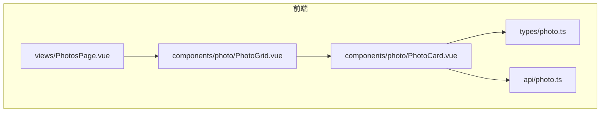
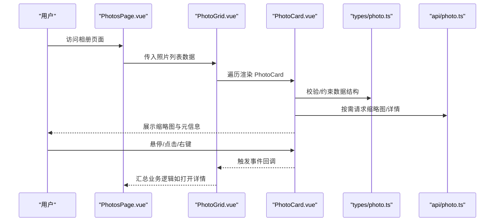
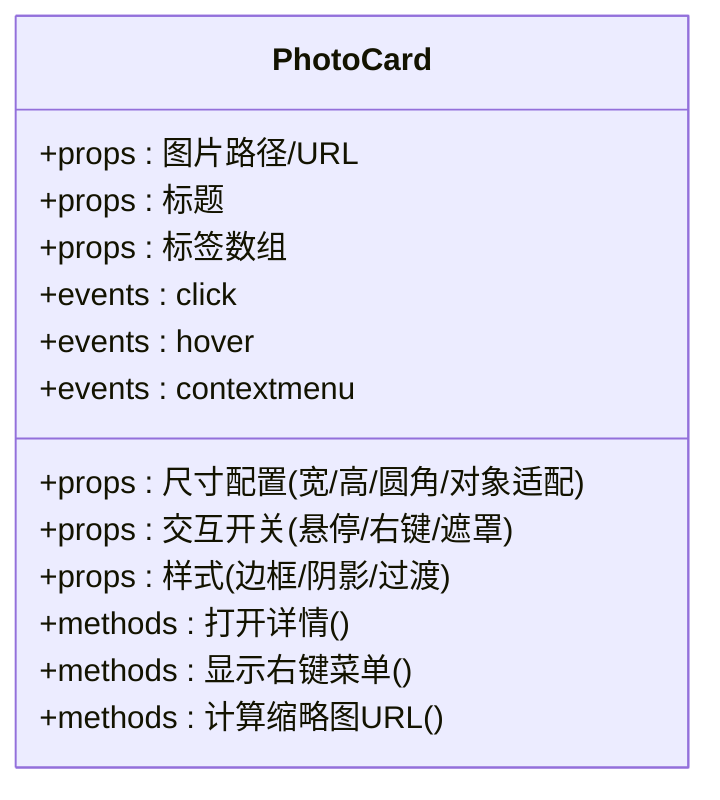
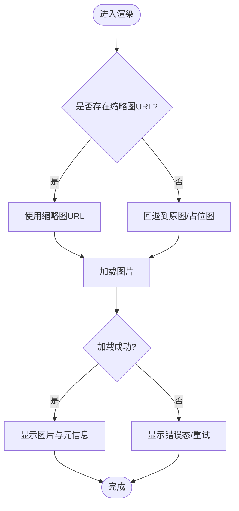
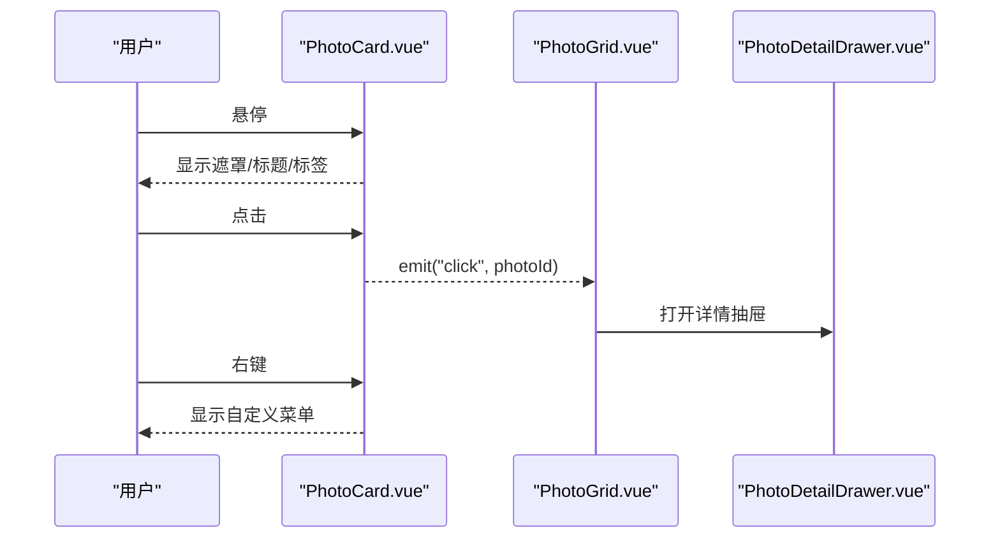
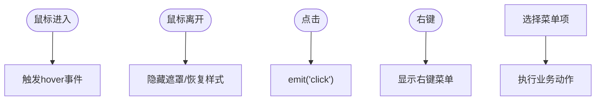
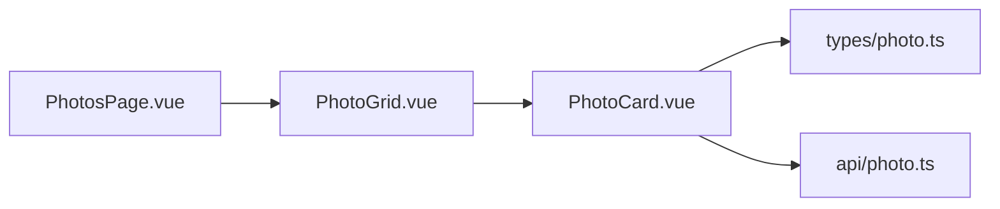

# PhotoCard照片卡片组件

<cite>
**本文引用的文件**   
- [PhotoCard.vue](file://frontend/src/components/photo/PhotoCard.vue)
- [PhotoGrid.vue](file://frontend/src/components/photo/PhotoGrid.vue)
- [photo.ts](file://frontend/src/types/photo.ts)
- [photo.ts](file://frontend/src/api/photo.ts)
- [PhotosPage.vue](file://frontend/src/views/PhotosPage.vue)
</cite>

## 目录
1. [简介](#简介)
2. [项目结构](#项目结构)
3. [核心组件](#核心组件)
4. [架构总览](#架构总览)
5. [详细组件分析](#详细组件分析)
6. [依赖关系分析](#依赖关系分析)
7. [性能考虑](#性能考虑)
8. [故障排查指南](#故障排查指南)
9. [结论](#结论)
10. [附录](#附录)

## 简介
本文件面向前端开发者，系统化梳理 PhotoCard 照片卡片组件的设计与实现。该组件负责在网格或时间线等容器中展示单张照片的缩略图、标题与标签，并提供悬停效果、点击交互与右键菜单等能力。文档将围绕以下目标展开：
- 图片展示与缩略图处理
- 悬停与点击交互
- 事件处理机制（点击、悬停、右键）
- Props 属性说明（图片路径、标题、标签、尺寸配置等）
- 样式定制选项（边框、阴影、动画过渡）
- 使用示例与最佳实践
- 与其他组件的集成方式
- 性能优化建议（懒加载、内存管理）

## 项目结构
PhotoCard 位于前端组件目录 photo 子模块中，通常由上层容器组件（如 PhotoGrid 或 PhotosPage）消费。类型定义集中在 types 目录，API 调用集中在 api 目录。

图表来源
- [PhotoCard.vue](file://frontend/src/components/photo/PhotoCard.vue)
- [PhotoGrid.vue](file://frontend/src/components/photo/PhotoGrid.vue)
- [PhotosPage.vue](file://frontend/src/views/PhotosPage.vue)
- [photo.ts](file://frontend/src/types/photo.ts)
- [photo.ts](file://frontend/src/api/photo.ts)

章节来源
- [PhotoCard.vue](file://frontend/src/components/photo/PhotoCard.vue)
- [PhotoGrid.vue](file://frontend/src/components/photo/PhotoGrid.vue)
- [PhotosPage.vue](file://frontend/src/views/PhotosPage.vue)
- [photo.ts](file://frontend/src/types/photo.ts)
- [photo.ts](file://frontend/src/api/photo.ts)

## 核心组件
本节聚焦 PhotoCard 的核心职责与对外接口，帮助读者快速理解其功能边界与使用方式。

- 主要职责
  - 渲染照片缩略图与元信息（标题、标签）
  - 提供悬停高亮、缩放等视觉反馈
  - 响应点击事件，触发详情查看或选中状态切换
  - 支持右键菜单（如删除、收藏、复制链接等）
  - 暴露可配置的尺寸与样式参数，适配不同布局场景

- 关键输入（Props）
  - 图片资源：本地或远端 URL、占位图策略
  - 元数据：标题、标签列表、拍摄时间等
  - 尺寸与布局：宽度、高度、圆角、对象适配模式
  - 交互开关：是否启用悬停、是否启用右键菜单、是否显示遮罩层
  - 主题与样式：边框、阴影、过渡动画时长与缓动函数

- 事件输出（Events）
  - 点击：用于打开详情抽屉或进入大图预览
  - 悬停：用于触发工具提示或预加载
  - 右键：用于弹出上下文菜单并执行操作

- 典型使用位置
  - 在 PhotoGrid 中以网格形式批量展示
  - 在 PhotosPage 作为页面级照片入口

章节来源
- [PhotoCard.vue](file://frontend/src/components/photo/PhotoCard.vue)
- [PhotoGrid.vue](file://frontend/src/components/photo/PhotoGrid.vue)
- [PhotosPage.vue](file://frontend/src/views/PhotosPage.vue)

## 架构总览
下图展示了 PhotoCard 与其上下游的关系：上游容器组件负责数据聚合与布局；PhotoCard 专注单条数据的可视化与交互；类型与 API 模块提供契约与数据源。

图表来源
- [PhotosPage.vue](file://frontend/src/views/PhotosPage.vue)
- [PhotoGrid.vue](file://frontend/src/components/photo/PhotoGrid.vue)
- [PhotoCard.vue](file://frontend/src/components/photo/PhotoCard.vue)
- [photo.ts](file://frontend/src/types/photo.ts)
- [photo.ts](file://frontend/src/api/photo.ts)

## 详细组件分析

### 组件类结构与职责
PhotoCard 是一个 Vue 单文件组件，内部包含模板、脚本与样式三部分。其职责边界清晰：仅关注“单张照片”的呈现与交互，不关心整体布局与分页。

图表来源
- [PhotoCard.vue](file://frontend/src/components/photo/PhotoCard.vue)

章节来源
- [PhotoCard.vue](file://frontend/src/components/photo/PhotoCard.vue)

### 图片展示与缩略图处理
- 缩略图策略
  - 优先使用后端生成的缩略图 URL，避免全量大图传输
  - 若未提供缩略图，则降级为原图或占位图
  - 结合 CSS object-fit 控制裁剪与填充行为
- 加载状态
  - 加载中显示骨架屏或占位图
  - 失败时显示错误态图标与重试入口
- 缓存与预取
  - 对即将进入视口的卡片进行预加载（配合 IntersectionObserver）
  - 浏览器原生 loading="lazy" 与解码优化

图表来源
- [PhotoCard.vue](file://frontend/src/components/photo/PhotoCard.vue)

章节来源
- [PhotoCard.vue](file://frontend/src/components/photo/PhotoCard.vue)

### 悬停效果与点击交互
- 悬停
  - 鼠标移入时显示遮罩层、标题与标签
  - 可选轻微放大与阴影加深，提升层次感
- 点击
  - 触发父级事件，由容器决定打开详情抽屉或进入大图预览
  - 支持多选场景下的选中态切换
- 右键菜单
  - 阻止默认菜单，自定义菜单项（如删除、收藏、复制链接）
  - 点击空白区域关闭菜单

图表来源
- [PhotoCard.vue](file://frontend/src/components/photo/PhotoCard.vue)
- [PhotoGrid.vue](file://frontend/src/components/photo/PhotoGrid.vue)
- [PhotoDetailDrawer.vue](file://frontend/src/components/photo/PhotoDetailDrawer.vue)

章节来源
- [PhotoCard.vue](file://frontend/src/components/photo/PhotoCard.vue)
- [PhotoGrid.vue](file://frontend/src/components/photo/PhotoGrid.vue)
- [PhotoDetailDrawer.vue](file://frontend/src/components/photo/PhotoDetailDrawer.vue)

### 事件处理机制
- 点击事件
  - 向父组件传递当前照片标识，便于定位详情或选中项
- 悬停事件
  - 可用于触发预加载、统计曝光或显示辅助信息
- 右键菜单
  - 通过拦截默认事件，渲染自定义菜单
  - 支持键盘导航与无障碍焦点管理

图表来源
- [PhotoCard.vue](file://frontend/src/components/photo/PhotoCard.vue)

章节来源
- [PhotoCard.vue](file://frontend/src/components/photo/PhotoCard.vue)

### Props 属性详解
以下为常见 props 的分类说明（具体键名以实际代码为准）：
- 图片相关
  - src / thumbUrl：主图与缩略图地址
  - placeholder：占位图地址或颜色
  - fit：object-fit 值（cover/contain/fill）
- 元信息
  - title：标题文本
  - tags：标签数组（字符串或结构化对象）
  - date：拍摄时间（用于格式化显示）
- 尺寸与布局
  - width / height：固定宽高或百分比
  - aspectRatio：纵横比预设
  - borderRadius：圆角大小
- 交互
  - showOverlay：是否显示悬停遮罩
  - enableContextMenu：是否启用右键菜单
  - selectable：是否参与多选
- 样式
  - borderColor / borderWidth：边框样式
  - shadow：阴影强度
  - transitionDuration / easing：过渡动画参数

章节来源
- [PhotoCard.vue](file://frontend/src/components/photo/PhotoCard.vue)
- [photo.ts](file://frontend/src/types/photo.ts)

### 样式定制选项
- 边框与阴影
  - 通过 props 传入边框色、宽度与阴影级别，统一卡片风格
- 动画过渡
  - 悬停放大、遮罩渐显、阴影变化均使用 CSS transition
  - 可通过 duration/easing 调整体验
- 主题适配
  - 基于 CSS 变量或 Tailwind 类名，支持明暗主题切换
- 响应式
  - 在小屏设备上自动减少圆角与阴影，提升可读性

章节来源
- [PhotoCard.vue](file://frontend/src/components/photo/PhotoCard.vue)

### 使用示例与最佳实践
- 基本用法
  - 在 PhotoGrid 中循环渲染 PhotoCard，绑定 click 事件打开详情
- 推荐做法
  - 始终提供缩略图 URL，降低首屏带宽
  - 使用合理的 fit 与 aspectRatio，避免布局抖动
  - 开启 lazy 加载与预取，提升滚动流畅度
  - 为图片添加 alt 文本，提升可访问性
- 与容器集成
  - 由 PhotoGrid 统一管理选中态与批量操作
  - 由 PhotosPage 协调路由跳转与全局状态

章节来源
- [PhotoGrid.vue](file://frontend/src/components/photo/PhotoGrid.vue)
- [PhotosPage.vue](file://frontend/src/views/PhotosPage.vue)

## 依赖关系分析
- 内部依赖
  - 类型定义：types/photo.ts 提供 PhotoCard 所需的数据模型
  - API 模块：api/photo.ts 提供缩略图/详情等接口
- 外部依赖
  - Vue 运行时与 Composition API
  - 可能的 UI 库（如弹窗、菜单）与样式框架（Tailwind）

图表来源
- [PhotoCard.vue](file://frontend/src/components/photo/PhotoCard.vue)
- [PhotoGrid.vue](file://frontend/src/components/photo/PhotoGrid.vue)
- [PhotosPage.vue](file://frontend/src/views/PhotosPage.vue)
- [photo.ts](file://frontend/src/types/photo.ts)
- [photo.ts](file://frontend/src/api/photo.ts)

章节来源
- [PhotoCard.vue](file://frontend/src/components/photo/PhotoCard.vue)
- [PhotoGrid.vue](file://frontend/src/components/photo/PhotoGrid.vue)
- [PhotosPage.vue](file://frontend/src/views/PhotosPage.vue)
- [photo.ts](file://frontend/src/types/photo.ts)
- [photo.ts](file://frontend/src/api/photo.ts)

## 性能考虑
- 图片懒加载
  - 使用 IntersectionObserver 或浏览器原生 loading="lazy"
  - 对即将进入视口的卡片提前发起缩略图请求
- 缩略图与格式
  - 服务端生成多分辨率缩略图，按设备 DPR 选择合适尺寸
  - 优先使用 WebP/AVIF，兼容回退 JPEG/PNG
- 内存管理
  - 及时释放不可见卡片的图片引用，避免内存泄漏
  - 大列表采用虚拟滚动或分页加载
- 渲染优化
  - 避免在悬停时触发重排，尽量使用 transform 与 opacity
  - 合理使用 will-change 与 GPU 加速
- 网络优化
  - 启用 HTTP 缓存与 CDN
  - 失败重试与降级策略

[本节为通用指导，无需特定文件来源]

## 故障排查指南
- 图片无法加载
  - 检查缩略图 URL 是否有效、跨域与鉴权头是否正确
  - 确认 fallback 占位图路径可用
- 悬停卡顿
  - 检查是否触发了大量重排，改用 transform/opacity
  - 减少复杂滤镜与阴影
- 右键菜单异常
  - 确保阻止默认菜单且正确监听 document 点击关闭
  - 注意移动端长按模拟右键的兼容性
- 内存占用过高
  - 检查是否在销毁前解绑了事件与观察者
  - 确认图片对象已被 GC 回收

章节来源
- [PhotoCard.vue](file://frontend/src/components/photo/PhotoCard.vue)

## 结论
PhotoCard 作为照片展示的最小单元，承担了图片渲染、交互与样式定制的职责。通过与 PhotoGrid 和 PhotosPage 的协作，形成从数据到视图的完整链路。遵循本文的性能与最佳实践建议，可在保证用户体验的同时获得良好的可维护性与扩展性。

[本节为总结性内容，无需特定文件来源]

## 附录
- 术语
  - 缩略图：用于快速预览的小尺寸图片
  - 对象适配：CSS object-fit 的行为模式
  - 懒加载：仅在需要时加载资源的策略
- 参考文件
  - 组件实现：[PhotoCard.vue](file://frontend/src/components/photo/PhotoCard.vue)
  - 容器组件：[PhotoGrid.vue](file://frontend/src/components/photo/PhotoGrid.vue)
  - 页面集成：[PhotosPage.vue](file://frontend/src/views/PhotosPage.vue)
  - 类型定义：[photo.ts](file://frontend/src/types/photo.ts)
  - API 调用：[photo.ts](file://frontend/src/api/photo.ts)