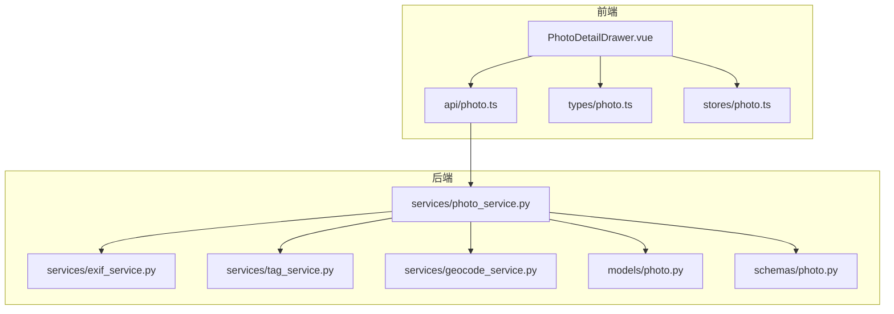
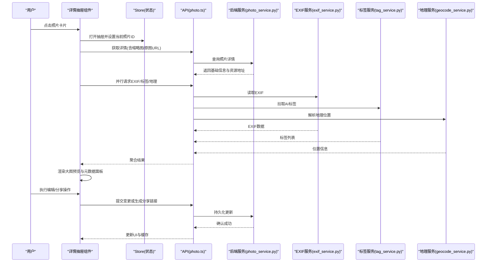
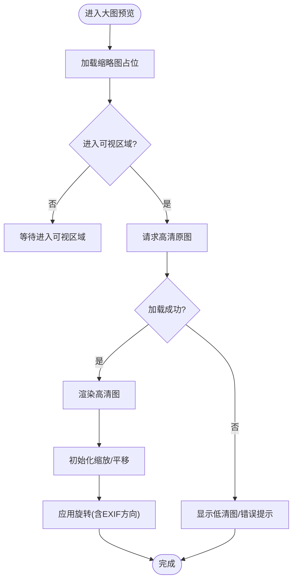
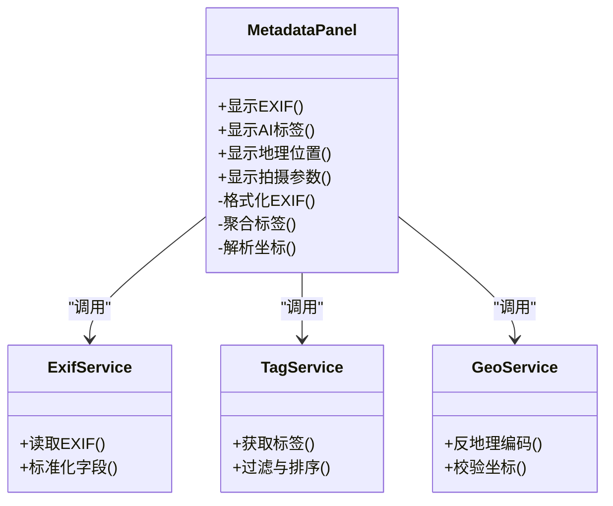
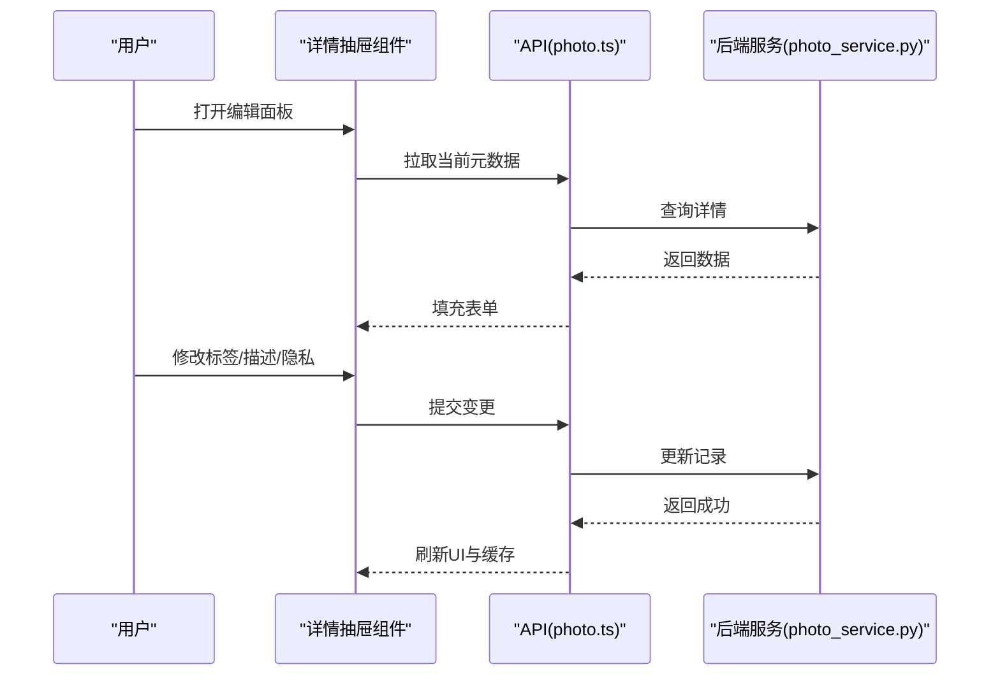
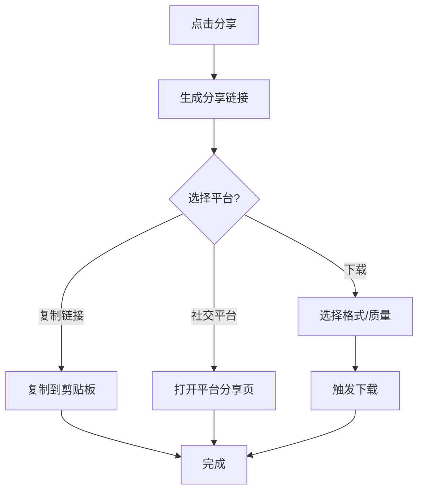
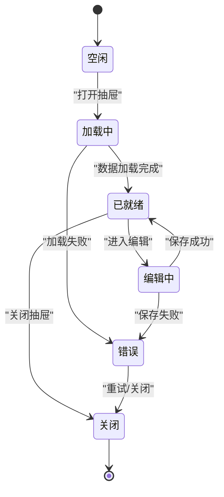
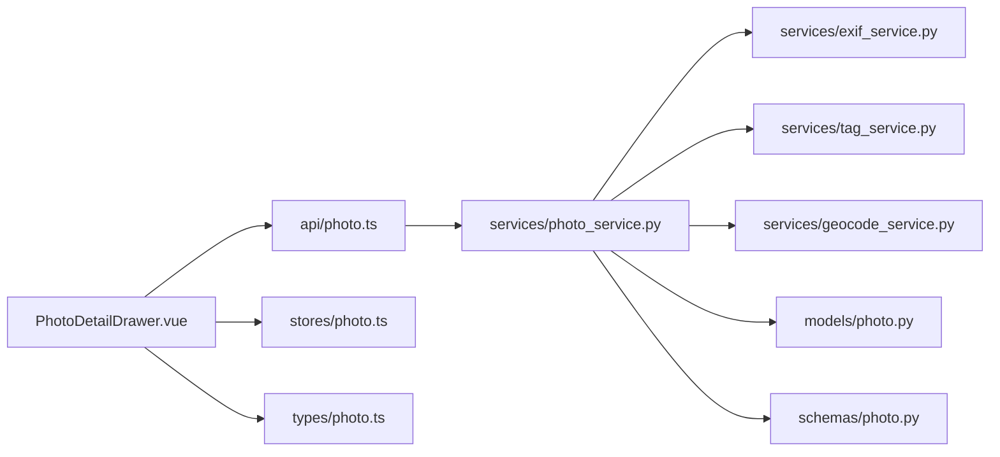

# PhotoDetailDrawer详情抽屉组件

<cite>
**本文引用的文件**   
- [PhotoDetailDrawer.vue](file://frontend/src/components/photo/PhotoDetailDrawer.vue)
- [photo.ts](file://frontend/src/api/photo.ts)
- [photo.ts](file://frontend/src/types/photo.ts)
- [photo.ts](file://frontend/src/stores/photo.ts)
- [exif_service.py](file://backend/app/services/exif_service.py)
- [tag_service.py](file://backend/app/services/tag_service.py)
- [geocode_service.py](file://backend/app/services/geocode_service.py)
- [photo_service.py](file://backend/app/services/photo_service.py)
- [photo.py](file://backend/app/models/photo.py)
- [photo.py](file://backend/app/schemas/photo.py)
</cite>

## 目录
1. [简介](#简介)
2. [项目结构](#项目结构)
3. [核心组件](#核心组件)
4. [架构总览](#架构总览)
5. [详细组件分析](#详细组件分析)
6. [依赖关系分析](#依赖关系分析)
7. [性能考虑](#性能考虑)
8. [故障排查指南](#故障排查指南)
9. [结论](#结论)
10. [附录](#附录)

## 简介
本文件面向前端与后端开发者，系统性梳理 PhotoDetailDrawer 详情抽屉组件的设计与实现。内容覆盖大图预览（高清加载、缩放、旋转）、元数据展示（EXIF、AI标签、地理位置、拍摄参数）、编辑能力（标签、描述、隐私）、分享操作（链接生成、社交分享、下载），以及状态管理（打开关闭动画、数据同步、缓存策略）。同时提供与照片服务集成的端到端示例，帮助快速落地与扩展。

## 项目结构
该组件位于前端 photo 子模块中，围绕“详情抽屉”这一交互模式组织：
- 组件层：负责图片预览、元数据面板、编辑表单、分享入口等 UI 与交互逻辑
- API 层：封装对后端的请求（图片资源、元数据、标签、地理信息等）
- 类型定义：统一前后端数据结构契约
- Store：集中管理抽屉状态、当前选中照片、缓存策略
- 后端服务：提供 EXIF、标签、地理编码、图片处理等服务

图表来源
- [PhotoDetailDrawer.vue](file://frontend/src/components/photo/PhotoDetailDrawer.vue)
- [photo.ts](file://frontend/src/api/photo.ts)
- [photo.ts](file://frontend/src/types/photo.ts)
- [photo.ts](file://frontend/src/stores/photo.ts)
- [photo_service.py](file://backend/app/services/photo_service.py)
- [exif_service.py](file://backend/app/services/exif_service.py)
- [tag_service.py](file://backend/app/services/tag_service.py)
- [geocode_service.py](file://backend/app/services/geocode_service.py)
- [photo.py](file://backend/app/models/photo.py)
- [photo.py](file://backend/app/schemas/photo.py)

章节来源
- [PhotoDetailDrawer.vue](file://frontend/src/components/photo/PhotoDetailDrawer.vue)
- [photo.ts](file://frontend/src/api/photo.ts)
- [photo.ts](file://frontend/src/types/photo.ts)
- [photo.ts](file://frontend/src/stores/photo.ts)
- [photo_service.py](file://backend/app/services/photo_service.py)
- [exif_service.py](file://backend/app/services/exif_service.py)
- [tag_service.py](file://backend/app/services/tag_service.py)
- [geocode_service.py](file://backend/app/services/geocode_service.py)
- [photo.py](file://backend/app/models/photo.py)
- [photo.py](file://backend/app/schemas/photo.py)

## 核心组件
- 大图预览区
  - 支持高清原图加载与缩略图占位
  - 手势/控件缩放（滚轮、双指、按钮）
  - 旋转（顺时针/逆时针/自动根据EXIF方向）
  - 拖拽平移与边界回弹
- 元数据面板
  - EXIF信息：相机型号、镜头、光圈、快门、ISO、焦距、白平衡、时间戳等
  - AI标签：模型识别的物体、场景、人物等
  - 地理位置：经纬度、地名、地图定位
  - 拍摄参数：分辨率、色彩空间、HDR、连拍序列等
- 编辑功能
  - 标签编辑：增删改查、批量操作
  - 描述修改：富文本或纯文本描述
  - 隐私设置：公开/私密、可见范围、水印开关
- 分享操作
  - 链接生成：短链/直链、带参数的查看链接
  - 社交媒体分享：微信、微博、Twitter/X、Facebook 等
  - 下载选项：原图/压缩图/裁剪图、格式选择
- 状态管理
  - 打开/关闭动画：过渡效果、遮罩点击关闭、ESC关闭
  - 数据同步：懒加载、增量更新、冲突解决
  - 缓存策略：本地缓存、内存缓存、失效策略

章节来源
- [PhotoDetailDrawer.vue](file://frontend/src/components/photo/PhotoDetailDrawer.vue)
- [photo.ts](file://frontend/src/stores/photo.ts)
- [photo.ts](file://frontend/src/types/photo.ts)

## 架构总览
从用户交互到后端服务的完整链路如下：

图表来源
- [PhotoDetailDrawer.vue](file://frontend/src/components/photo/PhotoDetailDrawer.vue)
- [photo.ts](file://frontend/src/api/photo.ts)
- [photo.ts](file://frontend/src/stores/photo.ts)
- [photo_service.py](file://backend/app/services/photo_service.py)
- [exif_service.py](file://backend/app/services/exif_service.py)
- [tag_service.py](file://backend/app/services/tag_service.py)
- [geocode_service.py](file://backend/app/services/geocode_service.py)

## 详细组件分析

### 大图预览子系统
- 高清图片加载
  - 优先使用缩略图占位，进入视图后再加载原图
  - 失败重试与降级策略（低清图替代）
- 缩放控制
  - 最小/最大缩放比限制
  - 中心点缩放与边界约束
- 旋转操作
  - 手动旋转与基于EXIF方向的自动校正
  - 旋转角度记录与持久化

图表来源
- [PhotoDetailDrawer.vue](file://frontend/src/components/photo/PhotoDetailDrawer.vue)

章节来源
- [PhotoDetailDrawer.vue](file://frontend/src/components/photo/PhotoDetailDrawer.vue)

### 元数据展示子系统
- EXIF信息
  - 读取相机、镜头、曝光、ISO、焦距、时间等
  - 异常字段容错与单位换算
- AI标签
  - 置信度阈值过滤
  - 分类聚合与去重
- 地理位置
  - 经纬度转地名
  - 地图可视化与跳转
- 拍摄参数
  - 分辨率、色彩空间、HDR、连拍序列等

图表来源
- [PhotoDetailDrawer.vue](file://frontend/src/components/photo/PhotoDetailDrawer.vue)
- [exif_service.py](file://backend/app/services/exif_service.py)
- [tag_service.py](file://backend/app/services/tag_service.py)
- [geocode_service.py](file://backend/app/services/geocode_service.py)

章节来源
- [PhotoDetailDrawer.vue](file://frontend/src/components/photo/PhotoDetailDrawer.vue)
- [exif_service.py](file://backend/app/services/exif_service.py)
- [tag_service.py](file://backend/app/services/tag_service.py)
- [geocode_service.py](file://backend/app/services/geocode_service.py)

### 编辑功能子系统
- 标签编辑
  - 新增/删除/合并标签
  - 批量导入导出
- 描述修改
  - 文本长度限制与敏感词检测
  - 版本历史与撤销
- 隐私设置
  - 可见性：公开/私密/仅自己
  - 水印开关与外链权限

图表来源
- [PhotoDetailDrawer.vue](file://frontend/src/components/photo/PhotoDetailDrawer.vue)
- [photo.ts](file://frontend/src/api/photo.ts)
- [photo_service.py](file://backend/app/services/photo_service.py)

章节来源
- [PhotoDetailDrawer.vue](file://frontend/src/components/photo/PhotoDetailDrawer.vue)
- [photo.ts](file://frontend/src/api/photo.ts)
- [photo_service.py](file://backend/app/services/photo_service.py)

### 分享操作子系统
- 链接生成
  - 直链/短链/带参数查看链接
  - 有效期与访问次数限制
- 社交媒体分享
  - 平台SDK集成与回调处理
- 下载选项
  - 原图/压缩图/裁剪图
  - 格式与质量选择

图表来源
- [PhotoDetailDrawer.vue](file://frontend/src/components/photo/PhotoDetailDrawer.vue)

章节来源
- [PhotoDetailDrawer.vue](file://frontend/src/components/photo/PhotoDetailDrawer.vue)

### 状态管理与缓存策略
- 打开/关闭动画
  - 过渡时长、缓动函数、遮罩层
  - ESC键与点击外部关闭
- 数据同步
  - 懒加载与预取
  - 并发请求与错误隔离
- 缓存策略
  - 内存缓存：按照片ID缓存元数据与原图URL
  - 本地缓存：IndexedDB/LocalStorage存储小对象
  - 失效策略：时间过期、手动清理、变更通知

图表来源
- [PhotoDetailDrawer.vue](file://frontend/src/components/photo/PhotoDetailDrawer.vue)
- [photo.ts](file://frontend/src/stores/photo.ts)

章节来源
- [PhotoDetailDrawer.vue](file://frontend/src/components/photo/PhotoDetailDrawer.vue)
- [photo.ts](file://frontend/src/stores/photo.ts)

## 依赖关系分析
- 前端依赖
  - 组件依赖 API 层进行网络请求
  - 组件依赖 Store 管理全局状态与缓存
  - 类型定义保证前后端契约一致
- 后端依赖
  - 照片服务聚合 EXIF、标签、地理等服务
  - 模型与Schema定义数据结构与校验规则

图表来源
- [PhotoDetailDrawer.vue](file://frontend/src/components/photo/PhotoDetailDrawer.vue)
- [photo.ts](file://frontend/src/api/photo.ts)
- [photo.ts](file://frontend/src/stores/photo.ts)
- [photo.ts](file://frontend/src/types/photo.ts)
- [photo_service.py](file://backend/app/services/photo_service.py)
- [exif_service.py](file://backend/app/services/exif_service.py)
- [tag_service.py](file://backend/app/services/tag_service.py)
- [geocode_service.py](file://backend/app/services/geocode_service.py)
- [photo.py](file://backend/app/models/photo.py)
- [photo.py](file://backend/app/schemas/photo.py)

章节来源
- [PhotoDetailDrawer.vue](file://frontend/src/components/photo/PhotoDetailDrawer.vue)
- [photo.ts](file://frontend/src/api/photo.ts)
- [photo.ts](file://frontend/src/stores/photo.ts)
- [photo.ts](file://frontend/src/types/photo.ts)
- [photo_service.py](file://backend/app/services/photo_service.py)
- [exif_service.py](file://backend/app/services/exif_service.py)
- [tag_service.py](file://backend/app/services/tag_service.py)
- [geocode_service.py](file://backend/app/services/geocode_service.py)
- [photo.py](file://backend/app/models/photo.py)
- [photo.py](file://backend/app/schemas/photo.py)

## 性能考虑
- 图片加载
  - 缩略图先行，按需加载原图
  - 失败重试与降级策略
  - 图片尺寸自适应与懒加载
- 并发与缓存
  - 并行请求元数据，避免串行阻塞
  - 内存缓存命中提升二次打开速度
  - 本地缓存减少重复网络请求
- 渲染优化
  - 虚拟滚动（长列表时）
  - 防抖/节流缩放与拖拽事件
  - 大对象序列化与增量更新

[本节为通用指导，不直接分析具体文件]

## 故障排查指南
- 常见问题
  - 原图加载失败：检查网络、跨域、CDN配置；启用降级图
  - EXIF缺失：部分图片被压缩导致EXIF丢失，需兼容空值
  - 标签为空：AI服务未运行或阈值过高，调整阈值或重试
  - 地理位置无效：坐标缺失或超出范围，提示用户补充
- 调试建议
  - 开启请求日志与错误上报
  - 使用浏览器开发者工具监控网络与缓存
  - 在后端服务增加详细日志与指标

章节来源
- [PhotoDetailDrawer.vue](file://frontend/src/components/photo/PhotoDetailDrawer.vue)
- [exif_service.py](file://backend/app/services/exif_service.py)
- [tag_service.py](file://backend/app/services/tag_service.py)
- [geocode_service.py](file://backend/app/services/geocode_service.py)

## 结论
PhotoDetailDrawer 通过清晰的职责划分与良好的分层设计，实现了高质量的大图预览、丰富的元数据展示、灵活的编辑与分享能力，并结合稳健的状态管理与缓存策略，提供了流畅的用户体验。建议在后续迭代中持续优化图片加载与渲染性能，完善错误处理与可观测性，以支撑更大规模的照片库与更高并发场景。

[本节为总结性内容，不直接分析具体文件]

## 附录
- 与照片服务集成的完整示例（步骤说明）
  - 在组件中引入 API 与 Store
  - 打开抽屉时设置当前照片ID并触发懒加载
  - 并行请求 EXIF、标签、地理信息并聚合渲染
  - 编辑提交时调用更新接口并刷新缓存
  - 分享时生成链接或调用平台分享接口
  - 下载时选择格式与质量并触发下载
- 参考路径
  - 组件实现：[PhotoDetailDrawer.vue](file://frontend/src/components/photo/PhotoDetailDrawer.vue)
  - API封装：[photo.ts](file://frontend/src/api/photo.ts)
  - 类型定义：[photo.ts](file://frontend/src/types/photo.ts)
  - 状态管理：[photo.ts](file://frontend/src/stores/photo.ts)
  - 后端服务：
    - [photo_service.py](file://backend/app/services/photo_service.py)
    - [exif_service.py](file://backend/app/services/exif_service.py)
    - [tag_service.py](file://backend/app/services/tag_service.py)
    - [geocode_service.py](file://backend/app/services/geocode_service.py)
    - [photo.py](file://backend/app/models/photo.py)
    - [photo.py](file://backend/app/schemas/photo.py)