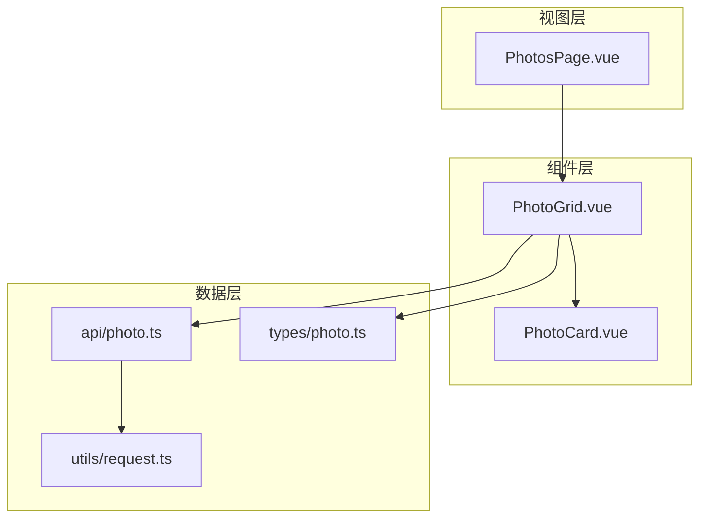
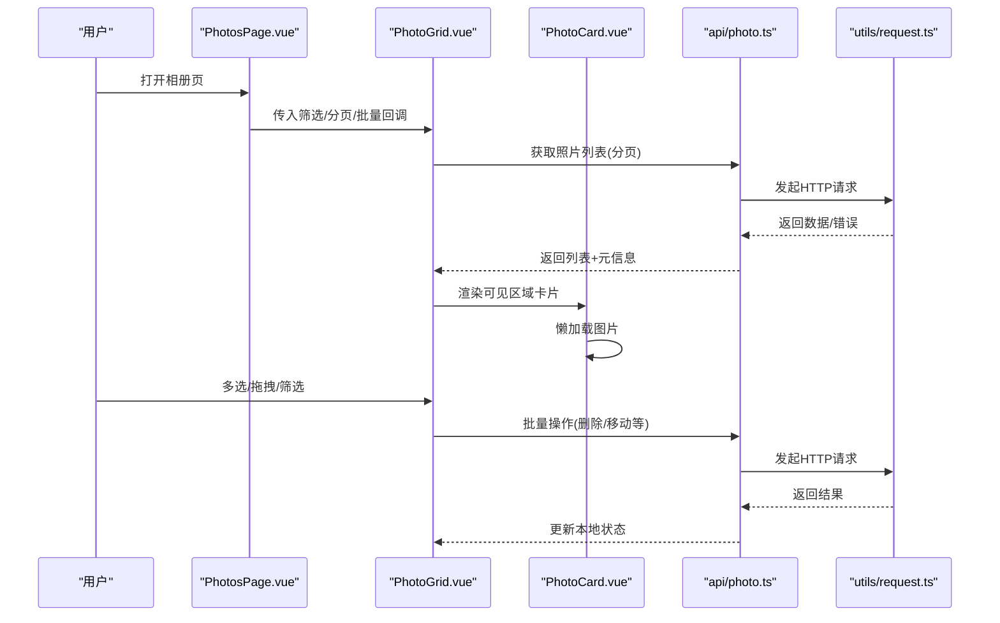
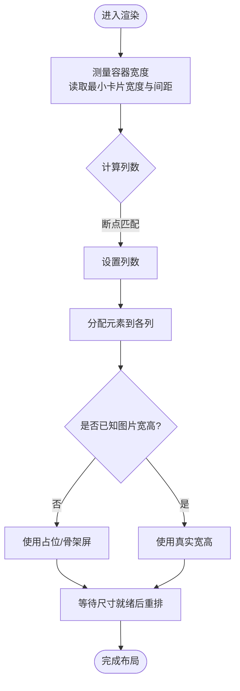
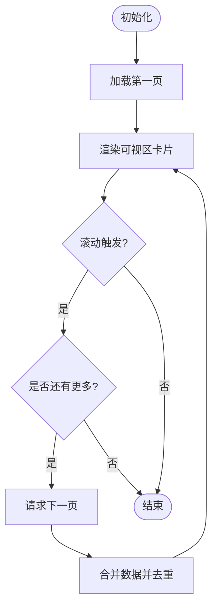
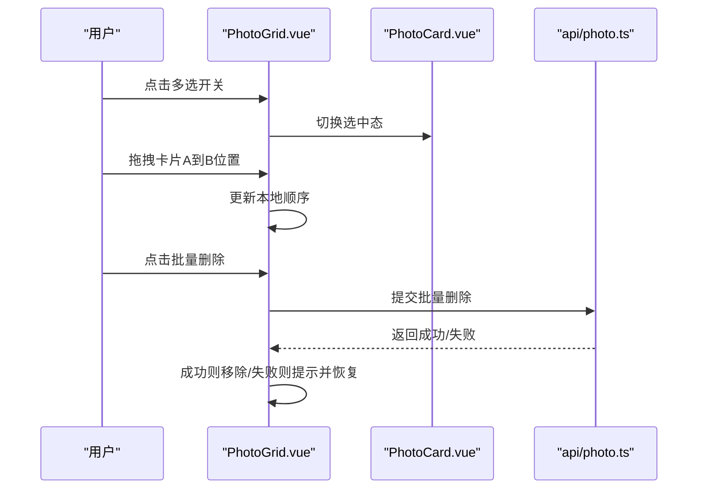
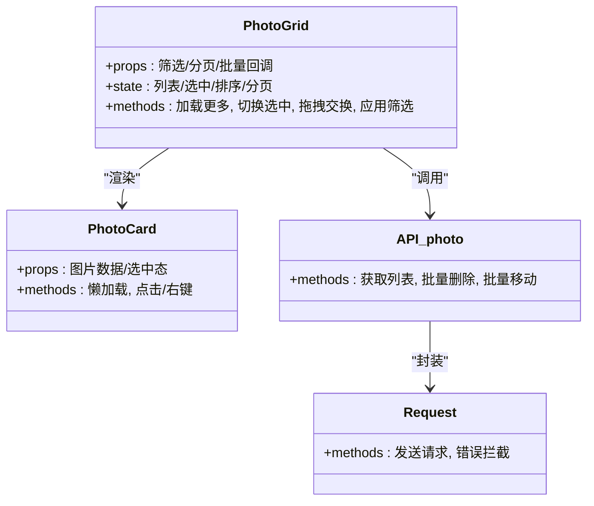
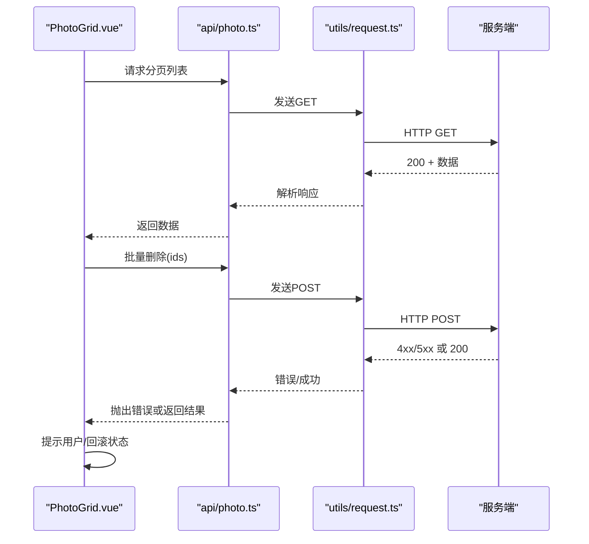
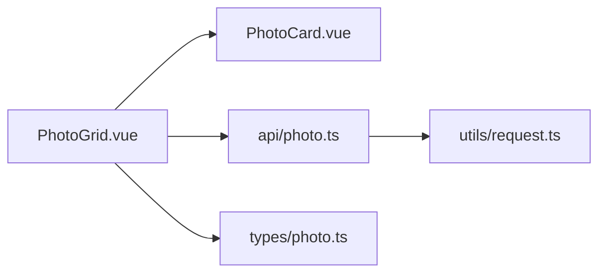

# PhotoGrid照片网格组件

<cite>
**本文引用的文件**   
- [PhotoGrid.vue](file://frontend/src/components/photo/PhotoGrid.vue)
- [PhotoCard.vue](file://frontend/src/components/photo/PhotoCard.vue)
- [photo.ts](file://frontend/src/api/photo.ts)
- [photo.ts](file://frontend/src/types/photo.ts)
- [PhotosPage.vue](file://frontend/src/views/PhotosPage.vue)
- [request.ts](file://frontend/src/utils/request.ts)
</cite>

## 目录
1. [简介](#简介)
2. [项目结构](#项目结构)
3. [核心组件](#核心组件)
4. [架构总览](#架构总览)
5. [详细组件分析](#详细组件分析)
6. [依赖关系分析](#依赖关系分析)
7. [性能考虑](#性能考虑)
8. [故障排查指南](#故障排查指南)
9. [结论](#结论)
10. [附录](#附录)

## 简介
本文件面向前端工程中的“PhotoGrid 照片网格”组件，系统性阐述其布局系统（瀑布流、响应式网格、自适应列数）、数据管理（批量加载、分页、虚拟滚动）、用户交互（多选、拖拽排序、批量操作）、性能优化（懒加载、增量渲染、内存优化）、配置项（间距、显示模式、筛选）以及与后端 API 的集成与错误处理策略。文档以代码级事实为依据，并提供可视化图示帮助理解。

## 项目结构
PhotoGrid 位于前端组件目录中，围绕该组件的相关文件包括：
- 组件实现：PhotoGrid.vue、PhotoCard.vue
- 数据接口：api/photo.ts、types/photo.ts
- 页面集成：views/PhotosPage.vue
- 网络请求封装：utils/request.ts

图表来源
- [PhotosPage.vue](file://frontend/src/views/PhotosPage.vue)
- [PhotoGrid.vue](file://frontend/src/components/photo/PhotoGrid.vue)
- [PhotoCard.vue](file://frontend/src/components/photo/PhotoCard.vue)
- [photo.ts](file://frontend/src/api/photo.ts)
- [photo.ts](file://frontend/src/types/photo.ts)
- [request.ts](file://frontend/src/utils/request.ts)

章节来源
- [PhotoGrid.vue](file://frontend/src/components/photo/PhotoGrid.vue)
- [PhotoCard.vue](file://frontend/src/components/photo/PhotoCard.vue)
- [photo.ts](file://frontend/src/api/photo.ts)
- [photo.ts](file://frontend/src/types/photo.ts)
- [PhotosPage.vue](file://frontend/src/views/PhotosPage.vue)
- [request.ts](file://frontend/src/utils/request.ts)

## 核心组件
- PhotoGrid.vue：负责整体布局、列数自适应、分页与批量数据加载、多选状态、拖拽排序、筛选条件透传、懒加载与虚拟滚动策略等。
- PhotoCard.vue：单张照片卡片，承载图片展示、占位图、懒加载触发、选中态、右键菜单或点击事件等。
- api/photo.ts：封装与后端媒体/相册相关的 HTTP 调用，提供分页查询、批量删除、批量移动等能力。
- types/photo.ts：定义 Photo 实体、分页参数、列表响应结构等类型。
- PhotosPage.vue：页面级容器，组合 PhotoGrid 并传递筛选、分页、批量操作回调等。
- utils/request.ts：统一请求封装，包含拦截器、错误码处理、重试/超时等通用逻辑。

章节来源
- [PhotoGrid.vue](file://frontend/src/components/photo/PhotoGrid.vue)
- [PhotoCard.vue](file://frontend/src/components/photo/PhotoCard.vue)
- [photo.ts](file://frontend/src/api/photo.ts)
- [photo.ts](file://frontend/src/types/photo.ts)
- [PhotosPage.vue](file://frontend/src/views/PhotosPage.vue)
- [request.ts](file://frontend/src/utils/request.ts)

## 架构总览
PhotoGrid 采用“页面容器 + 网格组件 + 卡片组件 + API 服务 + 类型定义”的分层结构。页面负责业务编排，网格组件聚焦布局与交互，卡片组件专注单条数据呈现，API 层屏蔽网络细节，类型层保障数据结构一致性。

图表来源
- [PhotosPage.vue](file://frontend/src/views/PhotosPage.vue)
- [PhotoGrid.vue](file://frontend/src/components/photo/PhotoGrid.vue)
- [PhotoCard.vue](file://frontend/src/components/photo/PhotoCard.vue)
- [photo.ts](file://frontend/src/api/photo.ts)
- [request.ts](file://frontend/src/utils/request.ts)

## 详细组件分析

### 布局系统：瀑布流、响应式网格、自适应列数
- 瀑布流布局：通过计算每列当前高度并选择最短列插入新元素，形成自然错落效果；当图片尺寸未知时，优先使用占位图或骨架屏，待真实宽高可用后重排。
- 响应式网格：监听容器宽度变化，按断点切换列数；在移动端减少列数以提升可读性。
- 自适应列数：基于容器宽度与最小卡片宽度计算最大列数，结合边距与间隙动态调整。

图表来源
- [PhotoGrid.vue](file://frontend/src/components/photo/PhotoGrid.vue)
- [PhotoCard.vue](file://frontend/src/components/photo/PhotoCard.vue)

章节来源
- [PhotoGrid.vue](file://frontend/src/components/photo/PhotoGrid.vue)
- [PhotoCard.vue](file://frontend/src/components/photo/PhotoCard.vue)

### 数据管理：批量加载、分页、虚拟滚动
- 批量数据加载：首次加载默认页大小，支持追加加载；根据滚动位置或可视区域边界触发下一页请求。
- 分页处理：维护 page/pageSize 与 total/hasMore 等元信息，避免重复请求与越界访问。
- 虚拟滚动：仅渲染可视区及邻近缓冲区的卡片，按需挂载/卸载，降低 DOM 压力与内存占用。

图表来源
- [PhotoGrid.vue](file://frontend/src/components/photo/PhotoGrid.vue)
- [photo.ts](file://frontend/src/api/photo.ts)

章节来源
- [PhotoGrid.vue](file://frontend/src/components/photo/PhotoGrid.vue)
- [photo.ts](file://frontend/src/api/photo.ts)

### 用户交互：多选、拖拽排序、批量操作
- 多选模式：支持点击勾选、全选、反选；多选状态下显示批量工具栏。
- 拖拽排序：在多选或编辑模式下启用拖拽，交换元素顺序并持久化；拖拽过程中提供视觉反馈。
- 批量操作：批量删除、批量移动到相册、批量打标签等，提交前二次确认，失败可回滚。

图表来源
- [PhotoGrid.vue](file://frontend/src/components/photo/PhotoGrid.vue)
- [PhotoCard.vue](file://frontend/src/components/photo/PhotoCard.vue)
- [photo.ts](file://frontend/src/api/photo.ts)

章节来源
- [PhotoGrid.vue](file://frontend/src/components/photo/PhotoGrid.vue)
- [PhotoCard.vue](file://frontend/src/components/photo/PhotoCard.vue)
- [photo.ts](file://frontend/src/api/photo.ts)

### 性能优化：懒加载、增量渲染、内存优化
- 图片懒加载：仅在卡片进入可视区时加载真实图片，未进入时使用缩略图或占位图。
- 增量渲染：分页数据追加而非全量替换，减少重排重绘。
- 内存优化：虚拟滚动回收不可见节点；图片对象及时释放引用；对大图进行尺寸裁剪与缓存策略控制。

图表来源
- [PhotoGrid.vue](file://frontend/src/components/photo/PhotoGrid.vue)
- [PhotoCard.vue](file://frontend/src/components/photo/PhotoCard.vue)
- [photo.ts](file://frontend/src/api/photo.ts)
- [request.ts](file://frontend/src/utils/request.ts)

章节来源
- [PhotoGrid.vue](file://frontend/src/components/photo/PhotoGrid.vue)
- [PhotoCard.vue](file://frontend/src/components/photo/PhotoCard.vue)
- [photo.ts](file://frontend/src/api/photo.ts)
- [request.ts](file://frontend/src/utils/request.ts)

### 配置选项：间距、显示模式、筛选条件
- 间距设置：卡片内边距、卡片间间距、行高对齐方式。
- 显示模式：网格/紧凑/大图预览等模式切换。
- 筛选条件：按时间范围、相册、标签、人脸等维度过滤，支持组合筛选与快速重置。

章节来源
- [PhotoGrid.vue](file://frontend/src/components/photo/PhotoGrid.vue)
- [PhotosPage.vue](file://frontend/src/views/PhotosPage.vue)

### 与后端 API 集成示例与错误处理
- 列表分页：GET /photos?page=&size=...&filters=...，返回 data/list、meta/total/hasMore。
- 批量删除：POST /photos/batch/delete，body 为 id 数组，返回操作结果。
- 批量移动：POST /photos/batch/move，body 为 { ids, albumId }。
- 错误处理：统一由 request.ts 拦截器捕获网络异常、业务错误码，向上抛出或转换为友好提示；对幂等操作提供重试与降级策略。

图表来源
- [photo.ts](file://frontend/src/api/photo.ts)
- [request.ts](file://frontend/src/utils/request.ts)
- [PhotoGrid.vue](file://frontend/src/components/photo/PhotoGrid.vue)

章节来源
- [photo.ts](file://frontend/src/api/photo.ts)
- [request.ts](file://frontend/src/utils/request.ts)
- [PhotoGrid.vue](file://frontend/src/components/photo/PhotoGrid.vue)

## 依赖关系分析
- 组件耦合：PhotoGrid 依赖 PhotoCard 进行单项渲染，依赖 api/photo.ts 进行数据获取与批量操作，依赖 types/photo.ts 保证数据结构一致。
- 外部依赖：request.ts 作为网络层抽象，集中处理鉴权、错误、重试等横切关注点。
- 循环依赖：组件与 API 之间单向依赖，无循环导入风险。

图表来源
- [PhotoGrid.vue](file://frontend/src/components/photo/PhotoGrid.vue)
- [PhotoCard.vue](file://frontend/src/components/photo/PhotoCard.vue)
- [photo.ts](file://frontend/src/api/photo.ts)
- [photo.ts](file://frontend/src/types/photo.ts)
- [request.ts](file://frontend/src/utils/request.ts)

章节来源
- [PhotoGrid.vue](file://frontend/src/components/photo/PhotoGrid.vue)
- [PhotoCard.vue](file://frontend/src/components/photo/PhotoCard.vue)
- [photo.ts](file://frontend/src/api/photo.ts)
- [photo.ts](file://frontend/src/types/photo.ts)
- [request.ts](file://frontend/src/utils/request.ts)

## 性能考虑
- 首屏渲染：优先加载缩略图与骨架屏，延迟真实图片加载，缩短 TTI。
- 滚动性能：使用 IntersectionObserver 或视口检测触发懒加载；虚拟滚动限制 DOM 节点数量。
- 内存管理：及时释放不再使用的图片对象与事件监听；避免闭包持有大对象引用。
- 网络优化：分页增量加载、请求去抖/节流、并发上限控制、缓存策略（如 ETag/Last-Modified）。

[本节为通用指导，不直接分析具体文件]

## 故障排查指南
- 图片无法加载：检查缩略图 URL 是否正确、跨域策略、懒加载触发时机；查看浏览器控制台资源加载状态。
- 分页异常：确认 hasMore 判断逻辑、page/pageSize 边界值、重复请求去重。
- 批量操作失败：核对请求体字段与后端契约；检查权限与鉴权头；查看统一错误拦截日志。
- 拖拽错位：确认拖拽目标元素层级与 z-index；校验拖拽交换后的索引映射与渲染键。

章节来源
- [PhotoGrid.vue](file://frontend/src/components/photo/PhotoGrid.vue)
- [photo.ts](file://frontend/src/api/photo.ts)
- [request.ts](file://frontend/src/utils/request.ts)

## 结论
PhotoGrid 通过清晰的组件分层与职责划分，实现了瀑布流布局、响应式列数、分页与虚拟滚动、多选与拖拽排序、批量操作以及完善的错误处理。配合懒加载与增量渲染，可在大数据集下保持流畅体验。建议在生产环境进一步引入图片压缩与 CDN、更细粒度的缓存策略与监控埋点，以提升稳定性与可观测性。

[本节为总结性内容，不直接分析具体文件]

## 附录
- 关键路径参考
  - 组件实现：[PhotoGrid.vue](file://frontend/src/components/photo/PhotoGrid.vue)、[PhotoCard.vue](file://frontend/src/components/photo/PhotoCard.vue)
  - 数据接口：[photo.ts](file://frontend/src/api/photo.ts)、[photo.ts](file://frontend/src/types/photo.ts)
  - 页面集成：[PhotosPage.vue](file://frontend/src/views/PhotosPage.vue)
  - 网络封装：[request.ts](file://frontend/src/utils/request.ts)

[本节为导航性内容，不直接分析具体文件]