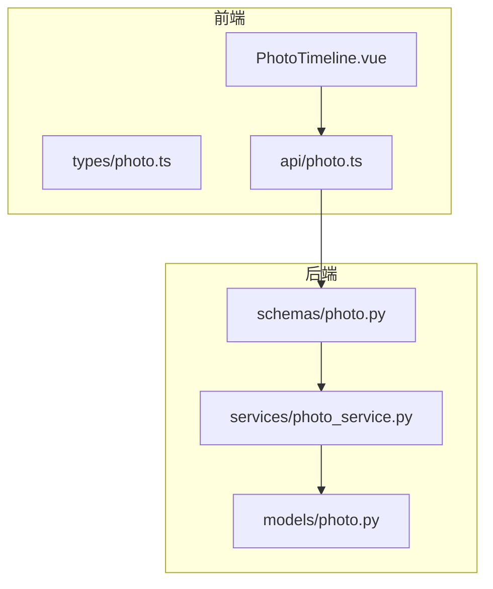
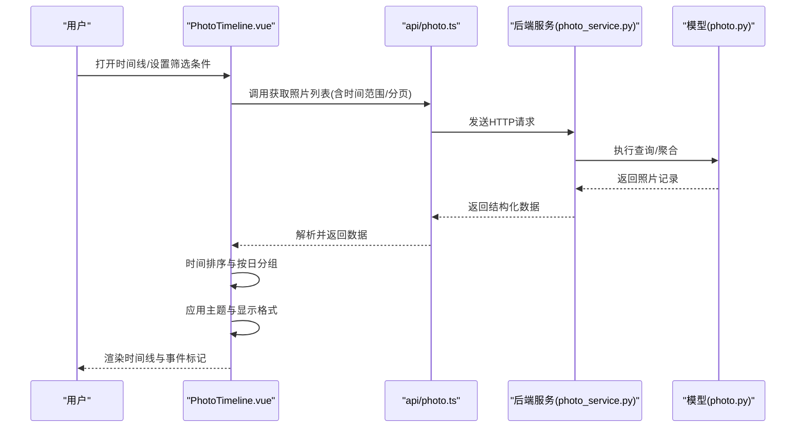
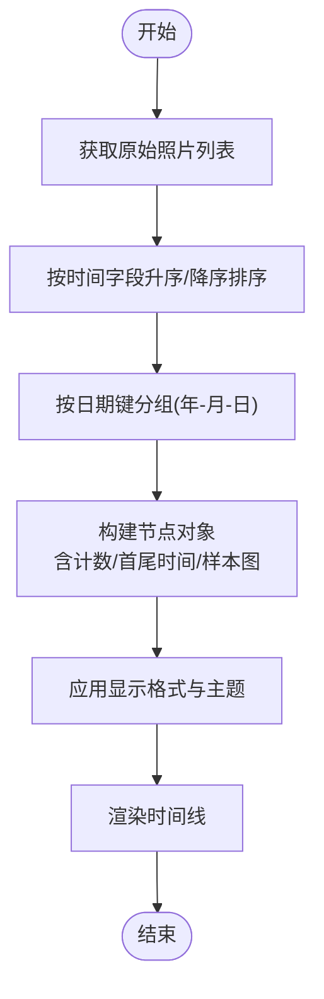
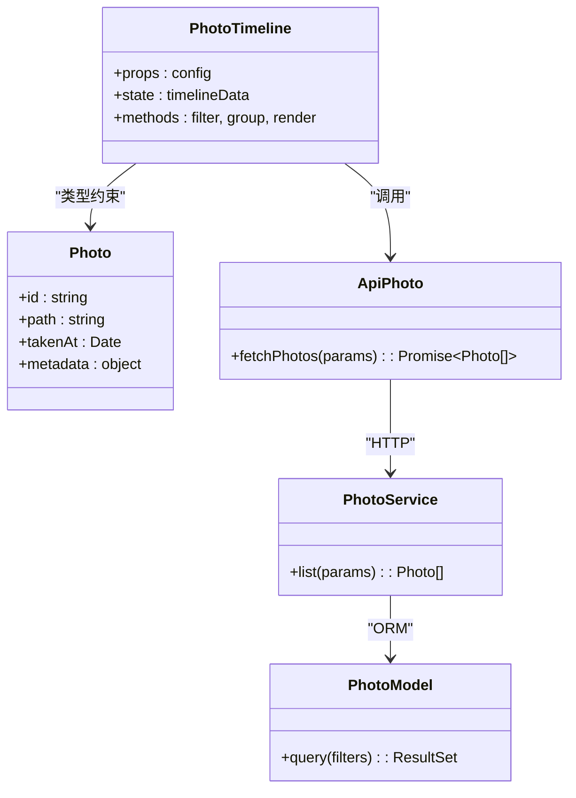
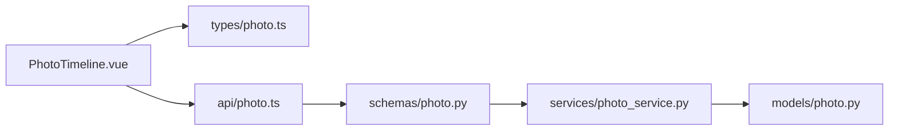

# PhotoTimeline时间线组件

<cite>
**本文引用的文件**   
- [PhotoTimeline.vue](file://frontend/src/components/photo/PhotoTimeline.vue)
- [photo.ts](file://frontend/src/types/photo.ts)
- [photo.ts](file://frontend/src/api/photo.ts)
- [photo.ts](file://backend/app/schemas/photo.py)
- [photo_service.py](file://backend/app/services/photo_service.py)
- [photo.py](file://backend/app/models/photo.py)
</cite>

## 目录
1. [简介](#简介)
2. [项目结构](#项目结构)
3. [核心组件](#核心组件)
4. [架构总览](#架构总览)
5. [详细组件分析](#详细组件分析)
6. [依赖关系分析](#依赖关系分析)
7. [性能考虑](#性能考虑)
8. [故障排查指南](#故障排查指南)
9. [结论](#结论)
10. [附录](#附录)

## 简介
本文件为 PhotoTimeline 时间线组件的完整技术文档。该组件用于以“按日期分组”的方式展示照片时间线，提供历史回溯、快速跳转与缩放控制等交互能力，并支持主题样式与显示格式配置。文档覆盖布局设计、数据处理流程、交互功能、视觉规范、配置项以及与相册数据的集成方案与性能优化策略。

## 项目结构
前端侧的时间线组件位于 components/photo 目录下，类型定义在 types/photo.ts，API 调用封装在 api/photo.ts；后端通过 schemas 与 services 层暴露数据接口，模型定义在 models/photo.py。整体采用前后端分离架构：前端负责渲染与交互，后端负责数据聚合与查询。

图表来源
- [PhotoTimeline.vue](file://frontend/src/components/photo/PhotoTimeline.vue)
- [photo.ts](file://frontend/src/types/photo.ts)
- [photo.ts](file://frontend/src/api/photo.ts)
- [photo.py](file://backend/app/schemas/photo.py)
- [photo_service.py](file://backend/app/services/photo_service.py)
- [photo.py](file://backend/app/models/photo.py)

章节来源
- [PhotoTimeline.vue](file://frontend/src/components/photo/PhotoTimeline.vue)
- [photo.ts](file://frontend/src/types/photo.ts)
- [photo.ts](file://frontend/src/api/photo.ts)
- [photo.py](file://backend/app/schemas/photo.py)
- [photo_service.py](file://backend/app/services/photo_service.py)
- [photo.py](file://backend/app/models/photo.py)

## 核心组件
- 组件职责
  - 接收相册或筛选后的照片列表，按日期分组并渲染时间轴。
  - 提供日期筛选、快速跳转、缩放控制等交互。
  - 支持主题与显示格式配置（如日期格式、缩略图尺寸）。
- 关键输入输出
  - 输入：照片数据源、时间范围、显示格式、主题样式、分页参数。
  - 输出：分组后的时间线节点、当前选中日期、滚动位置状态。
- 典型使用场景
  - 相册页全局时间线浏览。
  - 搜索结果的时间维度回溯。
  - 导出或分享时的历史回顾视图。

章节来源
- [PhotoTimeline.vue](file://frontend/src/components/photo/PhotoTimeline.vue)
- [photo.ts](file://frontend/src/types/photo.ts)

## 架构总览
时间线组件的数据流遵循“请求-响应-分组-渲染”的链路：前端发起带过滤条件的查询，后端返回结构化数据，前端进行本地排序与分组，再根据配置渲染时间刻度与事件标记。

图表来源
- [PhotoTimeline.vue](file://frontend/src/components/photo/PhotoTimeline.vue)
- [photo.ts](file://frontend/src/api/photo.ts)
- [photo_service.py](file://backend/app/services/photo_service.py)
- [photo.py](file://backend/app/models/photo.py)

## 详细组件分析

### 时间线布局与可视化
- 按日期分组
  - 将照片按拍摄日期归入同一组，生成“年-月-日”层级节点。
  - 每个节点包含当日照片数量、首尾时间戳、缩略图集合。
- 时间轴可视化
  - 左侧时间刻度显示日期分隔，右侧为对应事件卡片。
  - 支持纵向滚动与锚点定位，便于长列表回溯。
- 历史回溯
  - 顶部导航栏提供年份/月份快捷入口，点击后平滑滚动至目标区域。
  - 支持键盘快捷键（上/下）快速翻页。

章节来源
- [PhotoTimeline.vue](file://frontend/src/components/photo/PhotoTimeline.vue)

#### 分组算法流程图

图表来源
- [PhotoTimeline.vue](file://frontend/src/components/photo/PhotoTimeline.vue)

### 数据处理：排序、分组与格式化
- 时间排序
  - 依据拍摄时间字段进行稳定排序，确保时间线顺序正确。
- 分组算法
  - 以“年-月-日”为键进行分组，合并同一天内的多张照片为一个事件节点。
  - 对每组计算统计信息（数量、最早/最晚时间、代表性缩略图）。
- 日期格式化
  - 支持多种本地化格式（如 YYYY-MM-DD、中文年月日），由配置项控制。
  - 对于缺失时间的记录，提供默认占位与提示。

章节来源
- [PhotoTimeline.vue](file://frontend/src/components/photo/PhotoTimeline.vue)
- [photo.ts](file://frontend/src/types/photo.ts)

### 交互功能：筛选、跳转与缩放
- 日期筛选
  - 提供起止日期选择器，仅显示范围内的时间线节点。
  - 支持按周/月/年粒度快速切换。
- 快速跳转
  - 顶部导航条提供年份/月份锚点，点击后自动滚动到对应区块。
  - 支持 URL 哈希定位，刷新后保持上下文。
- 缩放控制
  - 缩略图尺寸可调节，影响每行显示数量与页面密度。
  - 支持手势缩放（移动端）与滚轮缩放（桌面端）。

章节来源
- [PhotoTimeline.vue](file://frontend/src/components/photo/PhotoTimeline.vue)

### 视觉设计：刻度、标记与导航控件
- 时间刻度
  - 左侧固定宽度列显示日期分隔线，突出时间层次。
- 事件标记
  - 每个事件节点包含封面图、标题（日期）、数量标签。
  - 高亮当前可见区间，提升可读性。
- 导航控件
  - 顶部工具栏包含筛选器、跳转按钮、缩放滑块与主题切换。
  - 响应式布局适配不同屏幕尺寸。

章节来源
- [PhotoTimeline.vue](file://frontend/src/components/photo/PhotoTimeline.vue)

### 组件配置选项
- 时间范围
  - 起始时间与结束时间，用于限定显示范围。
- 显示格式
  - 日期格式模板、语言环境、时区处理。
- 主题样式
  - 明暗主题、颜色变量、字体大小、间距与圆角。
- 行为开关
  - 是否启用懒加载、是否显示统计摘要、是否允许批量操作。

章节来源
- [PhotoTimeline.vue](file://frontend/src/components/photo/PhotoTimeline.vue)
- [photo.ts](file://frontend/src/types/photo.ts)

### 与相册数据的集成方案
- 前端类型定义
  - 使用统一的 Photo 类型描述字段（ID、路径、时间、元数据等）。
- API 调用
  - 通过 api/photo.ts 封装请求方法，传递筛选参数与分页信息。
- 后端服务
  - photo_service.py 实现查询逻辑，结合 photo.py 模型进行数据访问。
- 数据契约
  - schemas/photo.py 定义请求/响应结构，保证前后端一致性。

图表来源
- [photo.ts](file://frontend/src/types/photo.ts)
- [photo.ts](file://frontend/src/api/photo.ts)
- [photo_service.py](file://backend/app/services/photo_service.py)
- [photo.py](file://backend/app/models/photo.py)

章节来源
- [photo.ts](file://frontend/src/types/photo.ts)
- [photo.ts](file://frontend/src/api/photo.ts)
- [photo_service.py](file://backend/app/services/photo_service.py)
- [photo.py](file://backend/app/models/photo.py)

## 依赖关系分析
- 组件耦合
  - PhotoTimeline 依赖类型定义与 API 模块，低耦合于具体存储实现。
- 外部依赖
  - 前端依赖 UI 框架与日期库（用于格式化与本地化）。
  - 后端依赖数据库 ORM 与存储服务。
- 潜在循环依赖
  - 通过分层与接口隔离避免循环引用。

图表来源
- [PhotoTimeline.vue](file://frontend/src/components/photo/PhotoTimeline.vue)
- [photo.ts](file://frontend/src/types/photo.ts)
- [photo.ts](file://frontend/src/api/photo.ts)
- [photo.py](file://backend/app/schemas/photo.py)
- [photo_service.py](file://backend/app/services/photo_service.py)
- [photo.py](file://backend/app/models/photo.py)

章节来源
- [PhotoTimeline.vue](file://frontend/src/components/photo/PhotoTimeline.vue)
- [photo.ts](file://frontend/src/types/photo.ts)
- [photo.ts](file://frontend/src/api/photo.ts)
- [photo.py](file://backend/app/schemas/photo.py)
- [photo_service.py](file://backend/app/services/photo_service.py)
- [photo.py](file://backend/app/models/photo.py)

## 性能考虑
- 分页与懒加载
  - 后端分页返回，前端按需加载后续批次，减少首屏压力。
- 虚拟滚动
  - 对超长列表启用虚拟滚动，仅渲染可视区域节点。
- 缓存策略
  - 对已加载的日期块进行内存缓存，避免重复请求。
- 图片优化
  - 使用缩略图与延迟加载，降低带宽占用。
- 计算优化
  - 分组与排序在 Web Worker 中执行，避免阻塞主线程。
- 去抖与节流
  - 对滚动与缩放事件进行节流，减少重排与重绘。

[本节为通用指导，不直接分析具体文件]

## 故障排查指南
- 常见问题
  - 时间线空白：检查 API 返回结构与类型定义是否一致。
  - 日期错位：确认时区与本地化配置是否正确。
  - 滚动卡顿：评估是否启用虚拟滚动与懒加载。
- 调试建议
  - 打印分组结果与节点统计信息，验证排序与分组逻辑。
  - 使用浏览器网络面板查看请求参数与响应体。
  - 开启控制台错误日志，关注未捕获异常。

章节来源
- [PhotoTimeline.vue](file://frontend/src/components/photo/PhotoTimeline.vue)
- [photo.ts](file://frontend/src/types/photo.ts)
- [photo.ts](file://frontend/src/api/photo.ts)

## 结论
PhotoTimeline 组件通过清晰的架构与模块化设计，实现了高效、可扩展的照片时间线浏览体验。其按日期分组的布局、完善的交互与灵活的配置，使其能够无缝集成到相册系统中。配合分页、虚拟滚动与缓存等优化策略，可在大数据量场景下保持流畅性能。

[本节为总结性内容，不直接分析具体文件]

## 附录
- 术语表
  - 时间线：按时间顺序组织的事件序列。
  - 事件节点：某一天的照片集合及其统计信息。
  - 虚拟滚动：仅渲染可视区域的滚动优化技术。
- 参考链接
  - 前端类型定义：types/photo.ts
  - API 封装：api/photo.ts
  - 后端服务：services/photo_service.py
  - 数据模型：models/photo.py

[本节为补充信息，不直接分析具体文件]