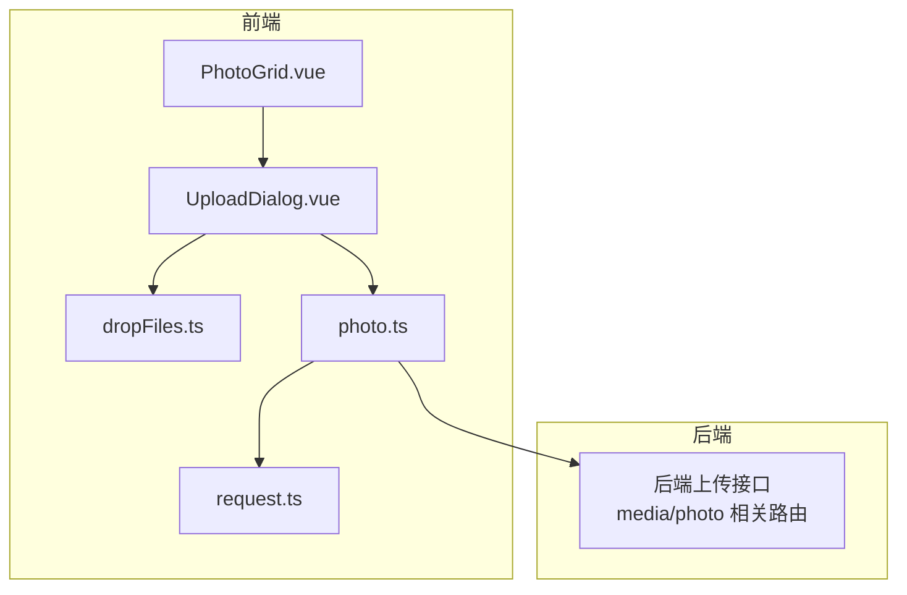
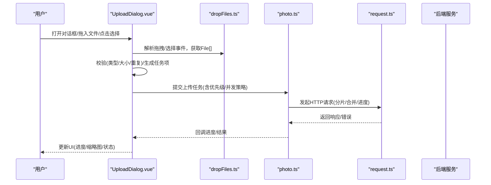
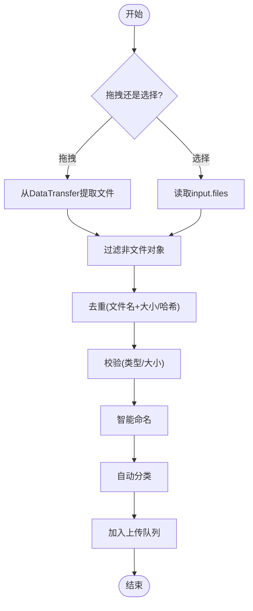
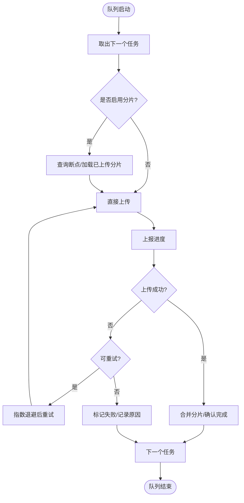
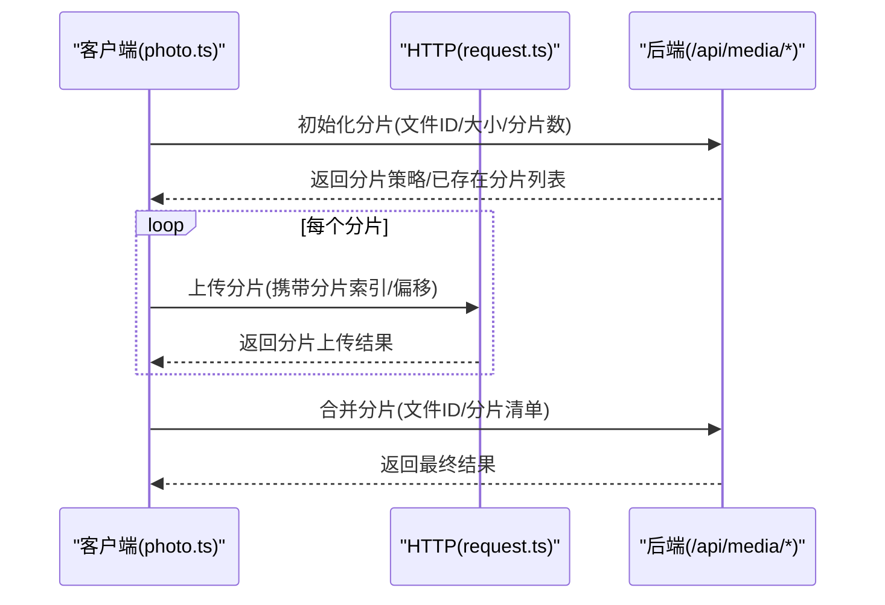
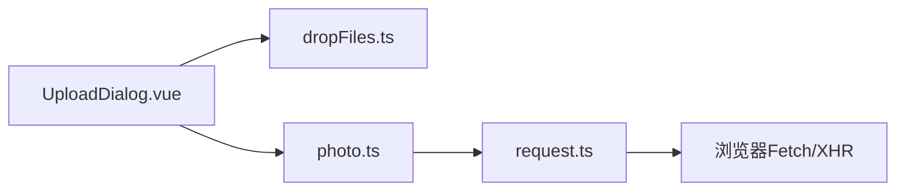

# UploadDialog上传对话框组件

<cite>
**本文引用的文件**   
- [UploadDialog.vue](file://frontend/src/components/photo/UploadDialog.vue)
- [dropFiles.ts](file://frontend/src/utils/dropFiles.ts)
- [photo.ts](file://frontend/src/api/photo.ts)
- [request.ts](file://frontend/src/utils/request.ts)
- [PhotoGrid.vue](file://frontend/src/components/photo/PhotoGrid.vue)
</cite>

## 目录
1. [简介](#简介)
2. [项目结构](#项目结构)
3. [核心组件](#核心组件)
4. [架构总览](#架构总览)
5. [详细组件分析](#详细组件分析)
6. [依赖关系分析](#依赖关系分析)
7. [性能考虑](#性能考虑)
8. [故障排查指南](#故障排查指南)
9. [结论](#结论)
10. [附录](#附录)

## 简介
本文件为前端“UploadDialog上传对话框”组件的完整技术文档。内容覆盖：
- 文件选择：拖拽上传、文件浏览、批量选择
- 进度管理：实时进度显示、断点续传、错误重试
- 文件验证：格式检查、大小限制、重复检测
- 上传队列：并发控制、优先级管理、取消操作
- 用户体验优化：预览缩略图、智能命名、自动分类
- 与后端上传API集成示例与错误处理方案

该组件位于前端工程，负责将用户选择的图片/媒体文件安全、高效地上传到后端服务，并在UI中提供清晰的反馈与可操作的控制项。

## 项目结构
与UploadDialog相关的代码主要分布在以下位置：
- 组件实现：frontend/src/components/photo/UploadDialog.vue
- 拖拽工具：frontend/src/utils/dropFiles.ts
- 上传API封装：frontend/src/api/photo.ts
- HTTP请求封装：frontend/src/utils/request.ts
- 使用方（示例）：frontend/src/components/photo/PhotoGrid.vue

图表来源
- [UploadDialog.vue](file://frontend/src/components/photo/UploadDialog.vue)
- [dropFiles.ts](file://frontend/src/utils/dropFiles.ts)
- [photo.ts](file://frontend/src/api/photo.ts)
- [request.ts](file://frontend/src/utils/request.ts)
- [PhotoGrid.vue](file://frontend/src/components/photo/PhotoGrid.vue)

章节来源
- [UploadDialog.vue](file://frontend/src/components/photo/UploadDialog.vue)
- [dropFiles.ts](file://frontend/src/utils/dropFiles.ts)
- [photo.ts](file://frontend/src/api/photo.ts)
- [request.ts](file://frontend/src/utils/request.ts)
- [PhotoGrid.vue](file://frontend/src/components/photo/PhotoGrid.vue)

## 核心组件
- UploadDialog.vue
  - 职责：承载上传交互（拖拽/选择）、展示队列与进度、触发上传流程、汇总结果并通知父级
  - 关键能力：
    - 文件选择：支持点击按钮选择、拖拽区域放置、多选
    - 进度管理：按文件维度跟踪进度，支持失败重试与取消
    - 文件验证：类型白名单、大小上限、重复检测（基于文件名或哈希）
    - 队列与并发：可配置并发度，支持优先级与取消
    - 体验增强：缩略图预览、智能命名建议、自动分类（如相册/标签）
    - 事件与回调：向父组件暴露完成/失败等事件
- dropFiles.ts
  - 职责：解析拖拽事件，过滤非文件对象，返回标准化File列表
- photo.ts
  - 职责：封装上传相关API调用（分片、合并、进度上报、取消等）
- request.ts
  - 职责：统一HTTP请求封装（拦截器、超时、错误码映射、Token注入等）
- PhotoGrid.vue
  - 职责：作为典型使用方，打开UploadDialog并接收上传结果

章节来源
- [UploadDialog.vue](file://frontend/src/components/photo/UploadDialog.vue)
- [dropFiles.ts](file://frontend/src/utils/dropFiles.ts)
- [photo.ts](file://frontend/src/api/photo.ts)
- [request.ts](file://frontend/src/utils/request.ts)
- [PhotoGrid.vue](file://frontend/src/components/photo/PhotoGrid.vue)

## 架构总览
UploadDialog采用“组件-工具-API-网络层”的分层设计，确保关注点分离与可测试性。

图表来源
- [UploadDialog.vue](file://frontend/src/components/photo/UploadDialog.vue)
- [dropFiles.ts](file://frontend/src/utils/dropFiles.ts)
- [photo.ts](file://frontend/src/api/photo.ts)
- [request.ts](file://frontend/src/utils/request.ts)

## 详细组件分析

### 文件选择与预处理
- 拖拽上传
  - 通过监听拖拽事件，阻止默认行为，提取DataTransfer中的文件集合
  - 过滤非文件对象，避免异常
- 文件浏览
  - 使用隐藏input[type=file]触发系统选择，支持multiple
- 批量选择
  - 支持一次选择多个文件，进入统一队列
- 预处理
  - 去重：基于文件名+大小，或可选的文件哈希
  - 格式化：根据扩展名推断MIME类型，必要时做二次校验
  - 命名：智能命名（时间戳/序列号/原名称保留），避免冲突
  - 分类：根据规则或AI建议自动归类到相册/标签

图表来源
- [UploadDialog.vue](file://frontend/src/components/photo/UploadDialog.vue)
- [dropFiles.ts](file://frontend/src/utils/dropFiles.ts)

章节来源
- [UploadDialog.vue](file://frontend/src/components/photo/UploadDialog.vue)
- [dropFiles.ts](file://frontend/src/utils/dropFiles.ts)

### 进度管理与可靠性
- 实时进度
  - 按文件维度维护进度条，支持百分比与剩余时间估算
- 断点续传
  - 分片上传：计算分片大小，记录已上传分片索引
  - 服务端持久化分片元数据，客户端携带断点信息恢复
- 错误重试
  - 指数退避重试，区分可重试与不可重试错误
  - 失败统计与熔断保护（达到阈值暂停队列）
- 取消操作
  - 支持单文件取消与全部取消，清理资源与状态

图表来源
- [UploadDialog.vue](file://frontend/src/components/photo/UploadDialog.vue)
- [photo.ts](file://frontend/src/api/photo.ts)
- [request.ts](file://frontend/src/utils/request.ts)

章节来源
- [UploadDialog.vue](file://frontend/src/components/photo/UploadDialog.vue)
- [photo.ts](file://frontend/src/api/photo.ts)
- [request.ts](file://frontend/src/utils/request.ts)

### 文件验证
- 格式检查
  - 白名单校验（如image/*、video/*），结合扩展名与MIME双重判断
- 大小限制
  - 单文件大小上限与总大小上限，超限即时提示
- 重复检测
  - 基于文件名+大小快速判定；可选基于文件哈希精确判定
- 其他
  - 敏感词/非法字符过滤（用于命名）
  - 元数据读取（EXIF/时长等）用于预览与分类

章节来源
- [UploadDialog.vue](file://frontend/src/components/photo/UploadDialog.vue)

### 上传队列与并发控制
- 并发控制
  - 可配置最大并发数，避免浏览器带宽拥塞
- 优先级管理
  - 支持高优先级任务插队（如用户当前选中的文件）
- 取消操作
  - 单文件取消：中断当前请求并释放槽位
  - 全部取消：清空队列并中止进行中的请求
- 状态可视化
  - 等待/进行中/成功/失败/取消等状态清晰呈现

章节来源
- [UploadDialog.vue](file://frontend/src/components/photo/UploadDialog.vue)

### 用户体验优化
- 预览缩略图
  - 对图片生成缩略图，视频取首帧或封面，提升感知速度
- 智能命名
  - 自动添加日期/时间戳/序号，避免覆盖
- 自动分类
  - 根据规则或AI建议分配到相册/标签，减少手动操作
- 交互反馈
  - 拖拽高亮、进度动画、错误Toast提示、一键重试/删除

章节来源
- [UploadDialog.vue](file://frontend/src/components/photo/UploadDialog.vue)

### 与后端上传API集成
- 接口约定（示例）
  - 初始化分片：POST /api/media/init
  - 上传分片：POST /api/media/chunk
  - 合并分片：POST /api/media/merge
  - 进度上报：GET/POST /api/media/progress
  - 取消上传：POST /api/media/cancel
- 请求封装
  - 使用request.ts统一处理鉴权、超时、错误码映射
  - 在photo.ts中封装分片逻辑、断点续传、重试策略
- 错误处理
  - 网络错误：自动重试或提示用户检查网络
  - 业务错误：根据错误码给出友好提示与修复建议
  - 服务端异常：记录日志并上报监控

图表来源
- [photo.ts](file://frontend/src/api/photo.ts)
- [request.ts](file://frontend/src/utils/request.ts)

章节来源
- [photo.ts](file://frontend/src/api/photo.ts)
- [request.ts](file://frontend/src/utils/request.ts)

### 使用示例（父组件集成）
- 在页面中引入并渲染UploadDialog
- 监听上传完成/失败事件，刷新照片列表或提示用户
- 传递初始参数（如目标相册、最大并发、允许类型等）

章节来源
- [PhotoGrid.vue](file://frontend/src/components/photo/PhotoGrid.vue)
- [UploadDialog.vue](file://frontend/src/components/photo/UploadDialog.vue)

## 依赖关系分析
- 组件内聚
  - UploadDialog.vue聚合了UI、状态、队列与上传编排，保持高内聚
- 外部依赖
  - dropFiles.ts：仅负责拖拽解析，低耦合
  - photo.ts：仅负责API调用，便于替换后端实现
  - request.ts：统一网络层，便于全局拦截与错误治理
- 潜在循环依赖
  - 组件不直接依赖request.ts，而是通过photo.ts间接使用，避免环依赖

图表来源
- [UploadDialog.vue](file://frontend/src/components/photo/UploadDialog.vue)
- [dropFiles.ts](file://frontend/src/utils/dropFiles.ts)
- [photo.ts](file://frontend/src/api/photo.ts)
- [request.ts](file://frontend/src/utils/request.ts)

章节来源
- [UploadDialog.vue](file://frontend/src/components/photo/UploadDialog.vue)
- [dropFiles.ts](file://frontend/src/utils/dropFiles.ts)
- [photo.ts](file://frontend/src/api/photo.ts)
- [request.ts](file://frontend/src/utils/request.ts)

## 性能考虑
- 分片大小调优
  - 大文件建议分片大小在1~10MB之间，平衡请求开销与吞吐
- 并发度控制
  - 移动端建议较低并发（2~4），桌面端可更高（4~8）
- 缩略图生成
  - 使用Canvas或Web Worker异步生成，避免阻塞主线程
- 内存管理
  - 及时释放Blob/URL对象，避免内存泄漏
- 网络优化
  - 合理设置超时与重试次数，利用缓存与断点续传降低重传成本

[本节为通用指导，无需源码引用]

## 故障排查指南
- 常见问题
  - 拖拽无效：检查是否阻止默认行为、是否正确提取DataTransfer
  - 类型校验失败：确认白名单与MIME匹配，必要时放宽或提示用户
  - 上传失败：查看错误码与日志，区分网络/认证/业务错误
  - 进度不更新：检查进度上报接口是否被调用，是否存在跨域问题
- 定位步骤
  - 打开浏览器开发者工具，观察Network面板的请求与响应
  - 检查控制台错误堆栈与自定义日志
  - 复现最小用例，逐步缩小范围
- 恢复策略
  - 网络抖动：启用重试与指数退避
  - 服务端限流：降低并发或延长间隔
  - 权限问题：重新登录或刷新Token

章节来源
- [UploadDialog.vue](file://frontend/src/components/photo/UploadDialog.vue)
- [photo.ts](file://frontend/src/api/photo.ts)
- [request.ts](file://frontend/src/utils/request.ts)

## 结论
UploadDialog组件通过分层设计与完善的队列/进度/重试机制，提供了稳定高效的上传体验。配合拖拽、批量选择、缩略图预览与智能命名等功能，显著提升了用户效率与满意度。建议在后续迭代中持续优化分片策略、错误提示与可观测性指标。

[本节为总结，无需源码引用]

## 附录
- 术语
  - 分片：将大文件切分为多个小块分别上传
  - 断点续传：从中断处继续上传，避免从头开始
  - 并发：同时进行的上传任务数量
- 最佳实践
  - 始终对用户可见的错误提供明确提示与下一步建议
  - 对关键路径增加埋点与日志，便于问题追踪
  - 定期评估并发与分片大小，结合真实流量调优

[本节为补充说明，无需源码引用]