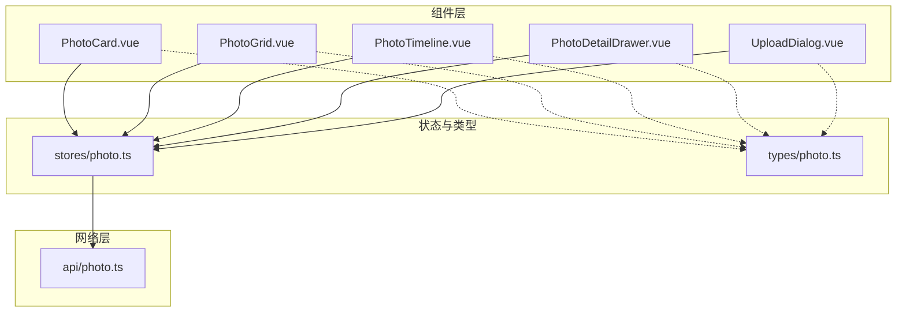
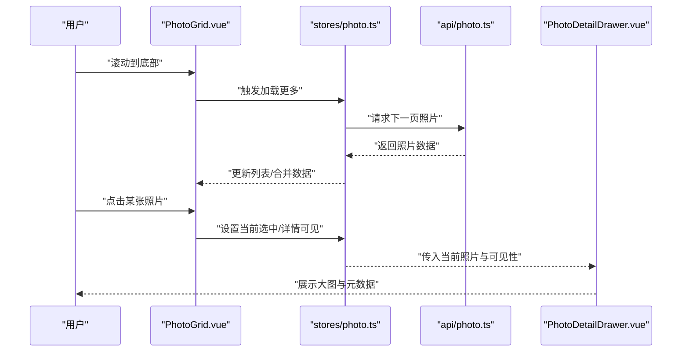
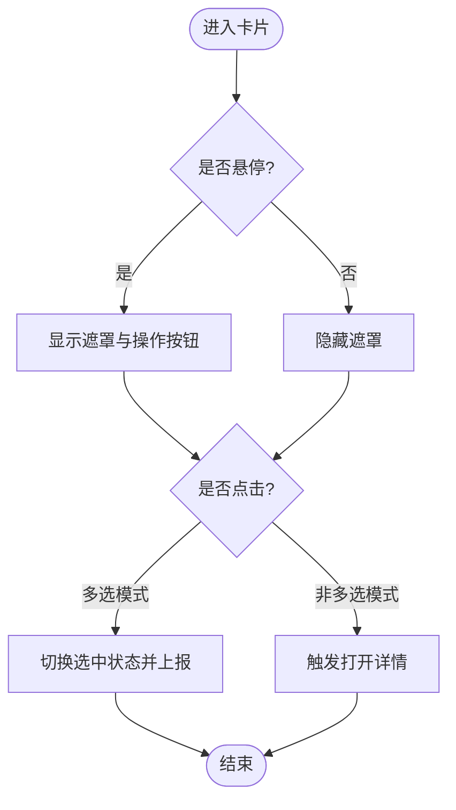
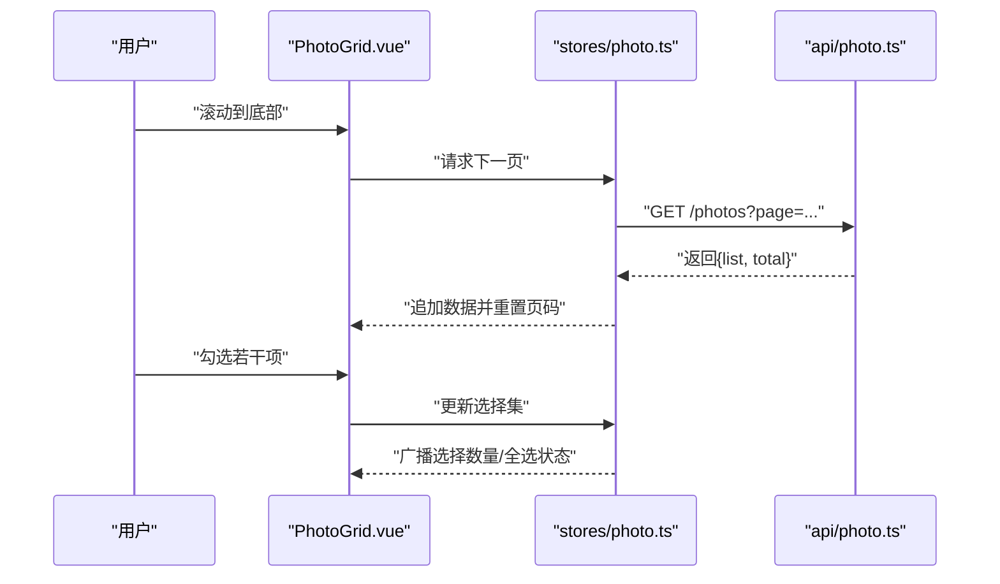
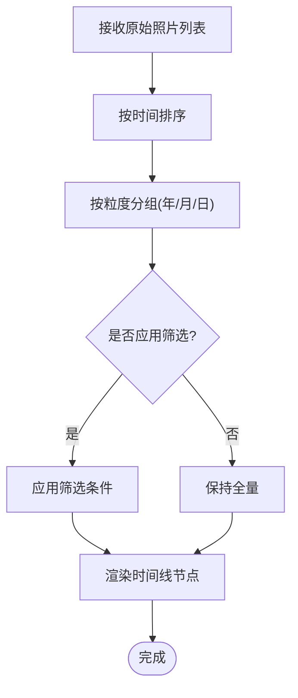
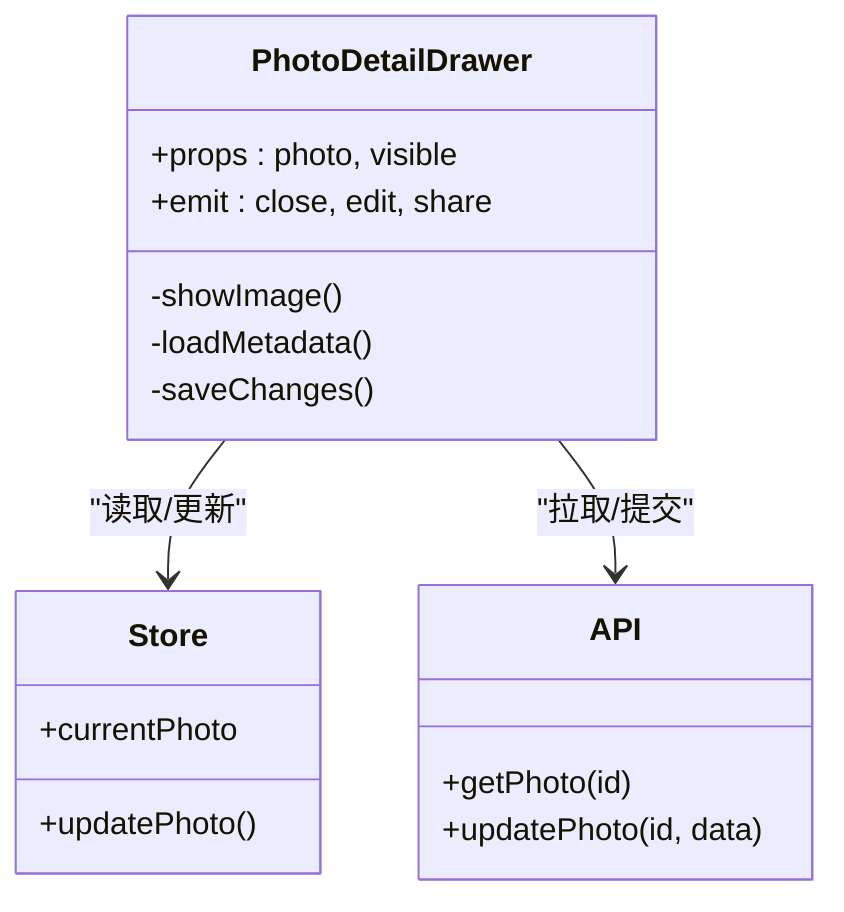
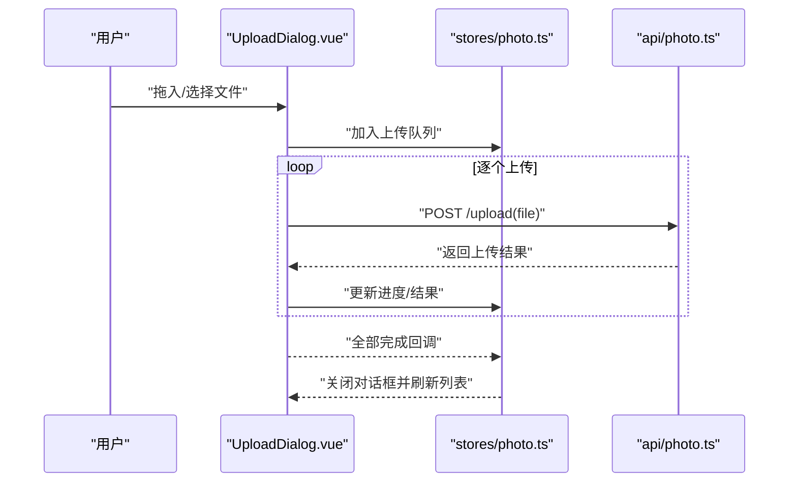
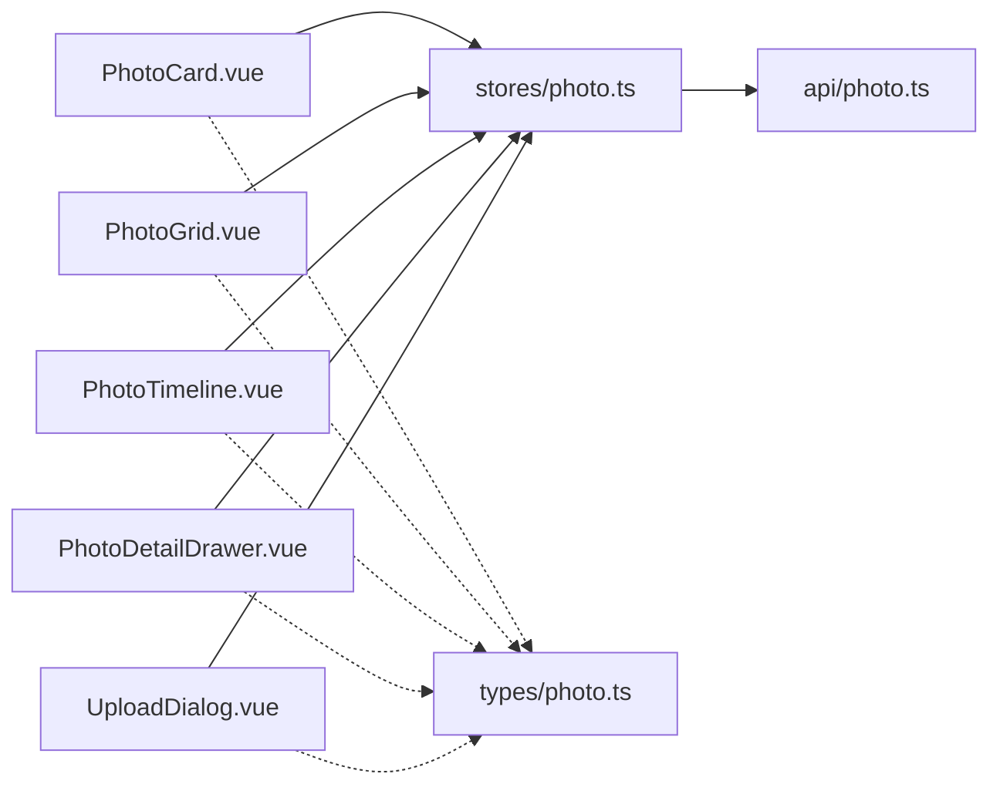

# 照片组件集合

<cite>
**本文引用的文件**   
- [PhotoCard.vue](file://frontend/src/components/photo/PhotoCard.vue)
- [PhotoGrid.vue](file://frontend/src/components/photo/PhotoGrid.vue)
- [PhotoTimeline.vue](file://frontend/src/components/photo/PhotoTimeline.vue)
- [PhotoDetailDrawer.vue](file://frontend/src/components/photo/PhotoDetailDrawer.vue)
- [UploadDialog.vue](file://frontend/src/components/photo/UploadDialog.vue)
- [photo.ts](file://frontend/src/types/photo.ts)
- [photo.ts](file://frontend/src/stores/photo.ts)
- [photo.ts](file://frontend/src/api/photo.ts)
</cite>

## 目录
1. [简介](#简介)
2. [项目结构](#项目结构)
3. [核心组件](#核心组件)
4. [架构总览](#架构总览)
5. [详细组件分析](#详细组件分析)
6. [依赖关系分析](#依赖关系分析)
7. [性能考虑](#性能考虑)
8. [故障排查指南](#故障排查指南)
9. [结论](#结论)
10. [附录](#附录)

## 简介
本文件聚焦于前端“照片”相关组件，系统性梳理并文档化以下五个核心组件：
- PhotoCard 照片卡片：图片展示、缩略图处理、悬停效果、点击交互
- PhotoGrid 照片网格：瀑布流布局、懒加载、无限滚动、批量选择
- PhotoTimeline 时间线：按时间排序、分组显示、筛选功能
- PhotoDetailDrawer 详情抽屉：大图预览、元数据展示、编辑与分享
- UploadDialog 上传对话框：拖拽上传、进度显示、错误处理、批量上传

同时说明组件间的协作关系、事件传递机制、状态同步方案，并提供性能优化策略与用户体验改进建议。

## 项目结构
照片相关的前端代码位于 frontend/src/components/photo 目录下，类型定义在 types/photo.ts，全局状态在 stores/photo.ts，API 接口封装在 api/photo.ts。页面级视图（如 PhotosPage）通过组合这些组件完成业务场景。

图表来源
- [PhotoCard.vue](file://frontend/src/components/photo/PhotoCard.vue)
- [PhotoGrid.vue](file://frontend/src/components/photo/PhotoGrid.vue)
- [PhotoTimeline.vue](file://frontend/src/components/photo/PhotoTimeline.vue)
- [PhotoDetailDrawer.vue](file://frontend/src/components/photo/PhotoDetailDrawer.vue)
- [UploadDialog.vue](file://frontend/src/components/photo/UploadDialog.vue)
- [photo.ts](file://frontend/src/stores/photo.ts)
- [photo.ts](file://frontend/src/types/photo.ts)
- [photo.ts](file://frontend/src/api/photo.ts)

章节来源
- [PhotoCard.vue](file://frontend/src/components/photo/PhotoCard.vue)
- [PhotoGrid.vue](file://frontend/src/components/photo/PhotoGrid.vue)
- [PhotoTimeline.vue](file://frontend/src/components/photo/PhotoTimeline.vue)
- [PhotoDetailDrawer.vue](file://frontend/src/components/photo/PhotoDetailDrawer.vue)
- [UploadDialog.vue](file://frontend/src/components/photo/UploadDialog.vue)
- [photo.ts](file://frontend/src/stores/photo.ts)
- [photo.ts](file://frontend/src/types/photo.ts)
- [photo.ts](file://frontend/src/api/photo.ts)

## 核心组件
本节概述各组件的职责边界与对外暴露的接口约定，便于后续深入分析与集成。

- PhotoCard
  - 职责：单张照片的可视化呈现与基础交互（悬停、点击、选中态）
  - 输入：照片对象、是否选中、尺寸控制等
  - 输出：点击、选中切换等事件
- PhotoGrid
  - 职责：多照片列表渲染、瀑布流布局、分页/无限滚动、批量选择
  - 输入：照片数组、分页参数、选择模式开关
  - 输出：滚动触底、选择变更、打开详情等事件
- PhotoTimeline
  - 职责：按时间维度组织照片，支持分组与筛选
  - 输入：时间范围、分组粒度、筛选条件
  - 输出：筛选变更、时间跳转、打开详情等事件
- PhotoDetailDrawer
  - 职责：大图预览、元数据展示、编辑与分享入口
  - 输入：当前照片、可见性控制
  - 输出：关闭、编辑确认、分享触发等事件
- UploadDialog
  - 职责：文件选择与拖拽上传、进度反馈、错误提示、批量上传
  - 输入：可见性控制、目标相册/标签等
  - 输出：上传成功/失败回调、关闭

章节来源
- [PhotoCard.vue](file://frontend/src/components/photo/PhotoCard.vue)
- [PhotoGrid.vue](file://frontend/src/components/photo/PhotoGrid.vue)
- [PhotoTimeline.vue](file://frontend/src/components/photo/PhotoTimeline.vue)
- [PhotoDetailDrawer.vue](file://frontend/src/components/photo/PhotoDetailDrawer.vue)
- [UploadDialog.vue](file://frontend/src/components/photo/UploadDialog.vue)

## 架构总览
组件间通过“状态集中 + 事件驱动”的模式协作：
- 状态中心：stores/photo.ts 维护照片列表、分页、选择集、上传队列、详情可见性等
- 类型契约：types/photo.ts 统一 Photo 实体与请求/响应模型
- 网络层：api/photo.ts 封装增删改查与上传接口
- 组件层：各组件仅持有必要 props 与 emit，复杂逻辑下沉至 store 或 API

图表来源
- [PhotoGrid.vue](file://frontend/src/components/photo/PhotoGrid.vue)
- [photo.ts](file://frontend/src/stores/photo.ts)
- [photo.ts](file://frontend/src/api/photo.ts)
- [PhotoDetailDrawer.vue](file://frontend/src/components/photo/PhotoDetailDrawer.vue)

## 详细组件分析

### PhotoCard 照片卡片
- 图片展示
  - 使用缩略图 URL 进行快速渲染，必要时回退到原图
  - 根据容器自适应宽高比，避免布局抖动
- 缩略图处理
  - 优先使用后端生成的缩略图路径；若缺失则降级为原图
  - 对长宽比异常的图片做裁剪/填充策略，保持网格整齐
- 悬停效果
  - 鼠标进入时叠加遮罩与操作按钮（如查看详情、多选勾选）
  - 使用过渡动画提升体验
- 点击交互
  - 单击：触发打开详情抽屉
  - 多选模式下：切换选中状态，并向父级发出选中变更事件
- 可访问性与健壮性
  - 提供 alt 文本与键盘可达性
  - 图片加载失败时显示占位图

图表来源
- [PhotoCard.vue](file://frontend/src/components/photo/PhotoCard.vue)

章节来源
- [PhotoCard.vue](file://frontend/src/components/photo/PhotoCard.vue)

### PhotoGrid 照片网格
- 瀑布流布局
  - 基于列数与间距计算每列高度，动态分配下一张到最短列
  - 监听窗口尺寸变化，重新计算布局
- 懒加载
  - 使用 IntersectionObserver 实现可视区域检测，按需加载图片
  - 预加载下一批缩略图，减少首屏等待
- 无限滚动
  - 监听滚动位置，接近底部时触发加载更多
  - 合并新数据并保持选择集一致性
- 批量选择
  - 支持全选、反选、区间选择
  - 将选择集同步到全局状态，供其他组件消费

图表来源
- [PhotoGrid.vue](file://frontend/src/components/photo/PhotoGrid.vue)
- [photo.ts](file://frontend/src/stores/photo.ts)
- [photo.ts](file://frontend/src/api/photo.ts)

章节来源
- [PhotoGrid.vue](file://frontend/src/components/photo/PhotoGrid.vue)
- [photo.ts](file://frontend/src/stores/photo.ts)
- [photo.ts](file://frontend/src/api/photo.ts)

### PhotoTimeline 时间线
- 按时间排序
  - 以照片创建时间为主键降序排列
  - 支持自定义时间格式与本地化
- 分组显示
  - 按年/月/日维度分组，组头固定定位
  - 大列表下采用虚拟滚动思路（仅渲染可视区）
- 筛选功能
  - 支持按时间范围、标签、相册等条件过滤
  - 筛选结果即时刷新，保留分页状态

图表来源
- [PhotoTimeline.vue](file://frontend/src/components/photo/PhotoTimeline.vue)

章节来源
- [PhotoTimeline.vue](file://frontend/src/components/photo/PhotoTimeline.vue)

### PhotoDetailDrawer 详情抽屉
- 大图预览
  - 使用原图 URL 进行高清预览，支持缩放与居中
  - 键盘导航（左右切换、ESC 关闭）
- 元数据展示
  - 展示拍摄时间、设备、分辨率、EXIF 信息等
  - 支持复制与导出
- 编辑功能
  - 提供标题、描述、标签等字段的编辑入口
  - 保存后实时更新局部状态
- 分享操作
  - 生成分享链接或调用系统分享能力

图表来源
- [PhotoDetailDrawer.vue](file://frontend/src/components/photo/PhotoDetailDrawer.vue)
- [photo.ts](file://frontend/src/stores/photo.ts)
- [photo.ts](file://frontend/src/api/photo.ts)

章节来源
- [PhotoDetailDrawer.vue](file://frontend/src/components/photo/PhotoDetailDrawer.vue)
- [photo.ts](file://frontend/src/stores/photo.ts)
- [photo.ts](file://frontend/src/api/photo.ts)

### UploadDialog 上传对话框
- 拖拽上传
  - 支持拖拽与点击选择，限制文件类型与大小
  - 自动去重与重复文件提示
- 进度显示
  - 分片/并发上传时显示整体与单项进度
  - 支持暂停/重试
- 错误处理
  - 网络异常、服务端校验失败、文件损坏等错误分类提示
  - 失败项可单独重试
- 批量上传
  - 支持一次性选择多个文件
  - 上传完成后聚合结果并通知上层

图表来源
- [UploadDialog.vue](file://frontend/src/components/photo/UploadDialog.vue)
- [photo.ts](file://frontend/src/stores/photo.ts)
- [photo.ts](file://frontend/src/api/photo.ts)

章节来源
- [UploadDialog.vue](file://frontend/src/components/photo/UploadDialog.vue)
- [photo.ts](file://frontend/src/stores/photo.ts)
- [photo.ts](file://frontend/src/api/photo.ts)

## 依赖关系分析
- 组件耦合
  - 组件之间不直接互相引用，均通过 stores/photo.ts 进行状态共享
  - 事件冒泡由父级视图统一处理，再分发到 store
- 外部依赖
  - 网络请求集中于 api/photo.ts，便于统一拦截、鉴权与错误处理
  - 类型集中在 types/photo.ts，保证前后端契约一致
- 潜在风险
  - 避免在组件内维护重复状态，防止不同步
  - 对大数据量列表需引入虚拟滚动或分页，避免主线程阻塞

图表来源
- [PhotoCard.vue](file://frontend/src/components/photo/PhotoCard.vue)
- [PhotoGrid.vue](file://frontend/src/components/photo/PhotoGrid.vue)
- [PhotoTimeline.vue](file://frontend/src/components/photo/PhotoTimeline.vue)
- [PhotoDetailDrawer.vue](file://frontend/src/components/photo/PhotoDetailDrawer.vue)
- [UploadDialog.vue](file://frontend/src/components/photo/UploadDialog.vue)
- [photo.ts](file://frontend/src/stores/photo.ts)
- [photo.ts](file://frontend/src/types/photo.ts)
- [photo.ts](file://frontend/src/api/photo.ts)

章节来源
- [PhotoCard.vue](file://frontend/src/components/photo/PhotoCard.vue)
- [PhotoGrid.vue](file://frontend/src/components/photo/PhotoGrid.vue)
- [PhotoTimeline.vue](file://frontend/src/components/photo/PhotoTimeline.vue)
- [PhotoDetailDrawer.vue](file://frontend/src/components/photo/PhotoDetailDrawer.vue)
- [UploadDialog.vue](file://frontend/src/components/photo/UploadDialog.vue)
- [photo.ts](file://frontend/src/stores/photo.ts)
- [photo.ts](file://frontend/src/types/photo.ts)
- [photo.ts](file://frontend/src/api/photo.ts)

## 性能考虑
- 图片渲染
  - 使用缩略图与懒加载，结合 IntersectionObserver 降低首屏压力
  - 对大图启用按需加载与缓存策略
- 列表性能
  - 大数据量采用分页与虚拟滚动，避免一次性渲染过多 DOM
  - 使用 key 稳定标识，减少不必要的重排
- 网络优化
  - 合并请求、防抖/节流滚动与搜索
  - 断点续传与重试机制提升上传稳定性
- 内存管理
  - 及时释放不再使用的图片对象与观察者
  - 避免在高频事件中创建闭包或大对象

[本节为通用指导，无需源码引用]

## 故障排查指南
- 图片无法加载
  - 检查缩略图 URL 是否有效，是否存在跨域问题
  - 查看浏览器控制台是否有 404/403 错误
- 无限滚动不触发
  - 确认滚动容器与监听元素是否正确
  - 检查页码递增与数据合并逻辑
- 上传失败
  - 核对文件大小与类型限制
  - 查看服务端返回的错误码与消息
- 详情抽屉无数据
  - 确认当前选中照片 ID 是否有效
  - 检查详情接口权限与参数

章节来源
- [PhotoGrid.vue](file://frontend/src/components/photo/PhotoGrid.vue)
- [UploadDialog.vue](file://frontend/src/components/photo/UploadDialog.vue)
- [PhotoDetailDrawer.vue](file://frontend/src/components/photo/PhotoDetailDrawer.vue)

## 结论
本组件集合围绕“照片”这一核心领域，通过清晰的状态分层与事件驱动实现了良好的解耦与扩展性。PhotoCard、PhotoGrid、PhotoTimeline、PhotoDetailDrawer、UploadDialog 各司其职，配合统一的类型与 API 封装，形成高内聚、低耦合的前端模块。建议在后续迭代中持续完善虚拟滚动、错误恢复与可访问性，以提升大规模照片场景下的性能与体验。

[本节为总结性内容，无需源码引用]

## 附录
- 关键类型参考
  - 照片实体与分页模型：参见 types/photo.ts
  - 全局状态字段与动作：参见 stores/photo.ts
  - 接口方法与错误码：参见 api/photo.ts

章节来源
- [photo.ts](file://frontend/src/types/photo.ts)
- [photo.ts](file://frontend/src/stores/photo.ts)
- [photo.ts](file://frontend/src/api/photo.ts)