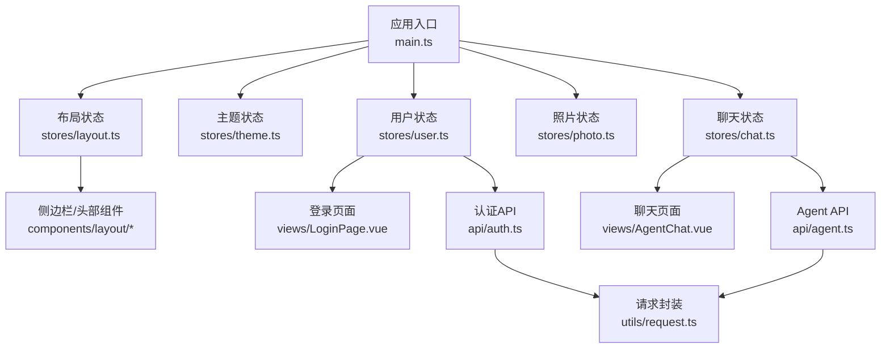
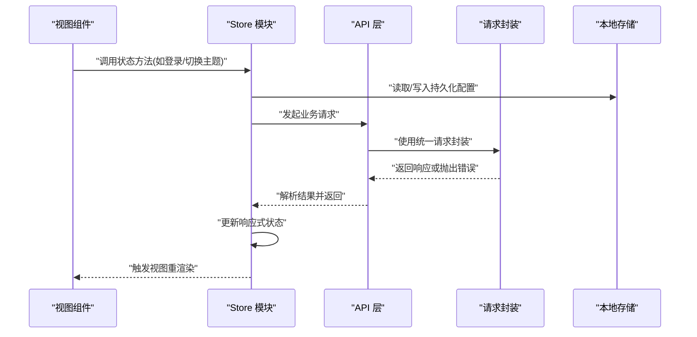
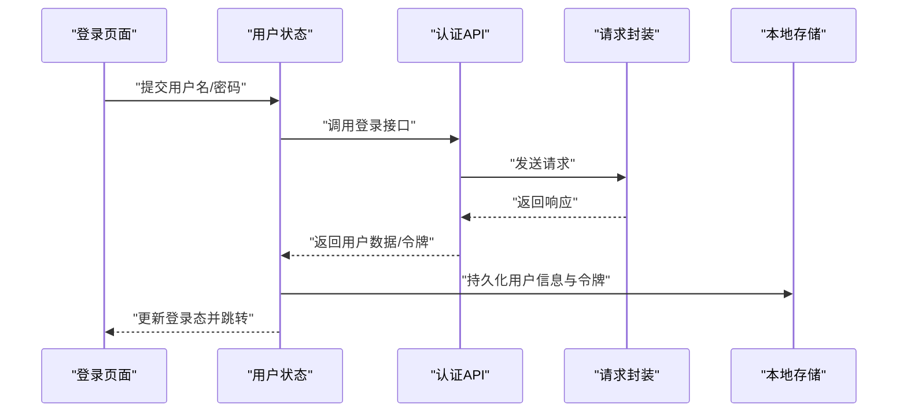
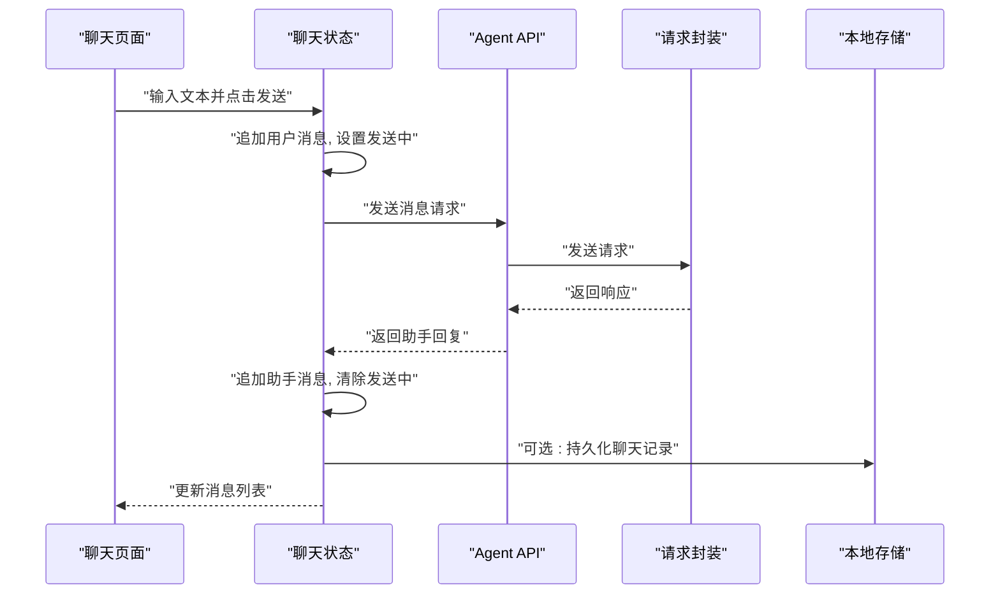
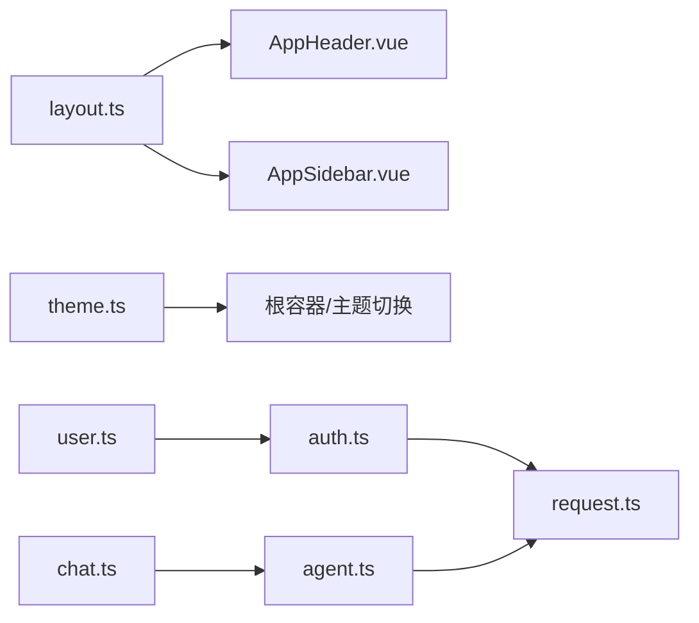

# 状态管理

<cite>
**本文引用的文件**   
- [frontend/src/stores/layout.ts](file://frontend/src/stores/layout.ts)
- [frontend/src/stores/theme.ts](file://frontend/src/stores/theme.ts)
- [frontend/src/stores/user.ts](file://frontend/src/stores/user.ts)
- [frontend/src/stores/photo.ts](file://frontend/src/stores/photo.ts)
- [frontend/src/stores/chat.ts](file://frontend/src/stores/chat.ts)
- [frontend/src/main.ts](file://frontend/src/main.ts)
- [frontend/src/api/auth.ts](file://frontend/src/api/auth.ts)
- [frontend/src/api/agent.ts](file://frontend/src/api/agent.ts)
- [frontend/src/utils/request.ts](file://frontend/src/utils/request.ts)
- [frontend/src/components/layout/AppHeader.vue](file://frontend/src/components/layout/AppHeader.vue)
- [frontend/src/components/layout/AppSidebar.vue](file://frontend/src/components/layout/AppSidebar.vue)
- [frontend/src/views/LoginPage.vue](file://frontend/src/views/LoginPage.vue)
- [frontend/src/views/AgentChat.vue](file://frontend/src/views/AgentChat.vue)
</cite>

## 目录
1. [简介](#简介)
2. [项目结构](#项目结构)
3. [核心组件](#核心组件)
4. [架构总览](#架构总览)
5. [详细组件分析](#详细组件分析)
6. [依赖关系分析](#依赖关系分析)
7. [性能考虑](#性能考虑)
8. [故障排查指南](#故障排查指南)
9. [结论](#结论)
10. [附录](#附录)

## 简介
本文件面向前端开发者，系统化梳理基于 Vue 3 Composition API 的状态管理模式。该方案以轻量、可组合的 store 模块为核心，替代传统 Vuex/Pinia 的重型方案，满足布局、主题、用户、照片与聊天等关键领域状态的组织与同步需求。文档涵盖：
- 各 store 模块的职责边界与数据模型
- 状态持久化策略（本地存储集成）
- 异步状态处理与错误边界
- 调试工具与最佳实践
- 迁移与重构建议

## 项目结构
前端采用按“领域”划分的 store 组织方式，每个模块聚焦单一职责，通过 Composition API 暴露响应式状态与操作方法。整体入口在应用初始化时注册必要的 store 或注入全局能力。

图表来源
- [frontend/src/main.ts](file://frontend/src/main.ts)
- [frontend/src/stores/layout.ts](file://frontend/src/stores/layout.ts)
- [frontend/src/stores/theme.ts](file://frontend/src/stores/theme.ts)
- [frontend/src/stores/user.ts](file://frontend/src/stores/user.ts)
- [frontend/src/stores/photo.ts](file://frontend/src/stores/photo.ts)
- [frontend/src/stores/chat.ts](file://frontend/src/stores/chat.ts)
- [frontend/src/components/layout/AppHeader.vue](file://frontend/src/components/layout/AppHeader.vue)
- [frontend/src/components/layout/AppSidebar.vue](file://frontend/src/components/layout/AppSidebar.vue)
- [frontend/src/views/LoginPage.vue](file://frontend/src/views/LoginPage.vue)
- [frontend/src/views/AgentChat.vue](file://frontend/src/views/AgentChat.vue)
- [frontend/src/api/auth.ts](file://frontend/src/api/auth.ts)
- [frontend/src/api/agent.ts](file://frontend/src/api/agent.ts)
- [frontend/src/utils/request.ts](file://frontend/src/utils/request.ts)

章节来源
- [frontend/src/main.ts](file://frontend/src/main.ts)
- [frontend/src/stores/layout.ts](file://frontend/src/stores/layout.ts)
- [frontend/src/stores/theme.ts](file://frontend/src/stores/theme.ts)
- [frontend/src/stores/user.ts](file://frontend/src/stores/user.ts)
- [frontend/src/stores/photo.ts](file://frontend/src/stores/photo.ts)
- [frontend/src/stores/chat.ts](file://frontend/src/stores/chat.ts)

## 核心组件
本节概述五个核心 store 模块的职责与交互点：
- layout：控制侧边栏展开/收起、顶部导航可见性、移动端适配等布局相关状态
- theme：维护主题模式（明/暗）、字体、配色等 UI 偏好
- user：管理登录态、用户信息、权限与令牌；负责与后端认证接口交互
- photo：维护照片列表、分页、筛选、选中项、上传进度等
- chat：维护会话消息流、输入状态、发送中标志、错误提示等

这些模块均遵循“状态 + 方法”的组合式范式，便于在组件中以函数式调用更新状态，避免全局单例带来的耦合。

章节来源
- [frontend/src/stores/layout.ts](file://frontend/src/stores/layout.ts)
- [frontend/src/stores/theme.ts](file://frontend/src/stores/theme.ts)
- [frontend/src/stores/user.ts](file://frontend/src/stores/user.ts)
- [frontend/src/stores/photo.ts](file://frontend/src/stores/photo.ts)
- [frontend/src/stores/chat.ts](file://frontend/src/stores/chat.ts)

## 架构总览
下图展示状态管理与视图层、API 层的交互关系。store 作为唯一可信源，统一协调 UI 行为与网络请求，确保状态变更的可追踪性与一致性。

图表来源
- [frontend/src/stores/user.ts](file://frontend/src/stores/user.ts)
- [frontend/src/stores/theme.ts](file://frontend/src/stores/theme.ts)
- [frontend/src/stores/chat.ts](file://frontend/src/stores/chat.ts)
- [frontend/src/api/auth.ts](file://frontend/src/api/auth.ts)
- [frontend/src/api/agent.ts](file://frontend/src/api/agent.ts)
- [frontend/src/utils/request.ts](file://frontend/src/utils/request.ts)

## 详细组件分析

### 布局状态（layout）
- 职责
  - 管理侧边栏展开/收起、顶部导航显示、移动端菜单开关
  - 提供切换方法与当前状态的只读访问
- 典型用法
  - 头部与侧边栏组件订阅状态变化，驱动 UI 显隐
- 设计要点
  - 纯 UI 状态，不直接涉及网络请求
  - 可与主题状态联动（例如根据主题调整样式）

章节来源
- [frontend/src/stores/layout.ts](file://frontend/src/stores/layout.ts)
- [frontend/src/components/layout/AppHeader.vue](file://frontend/src/components/layout/AppHeader.vue)
- [frontend/src/components/layout/AppSidebar.vue](file://frontend/src/components/layout/AppSidebar.vue)

### 主题状态（theme）
- 职责
  - 维护主题模式（明/暗）及可选扩展属性（如字体、间距）
  - 将主题偏好持久化到本地存储，保证刷新后一致
- 典型用法
  - 根容器监听主题变化，动态切换 CSS 类或变量
- 设计要点
  - 读写本地存储需考虑首次加载时的空值与异常
  - 提供切换方法，内部完成状态更新与持久化

章节来源
- [frontend/src/stores/theme.ts](file://frontend/src/stores/theme.ts)

### 用户状态（user）
- 职责
  - 管理登录态、用户基本信息、令牌与过期时间
  - 提供登录、登出、刷新令牌等方法
  - 与认证 API 交互，处理成功/失败分支
- 典型流程（登录）
  - 视图调用登录方法
  - Store 调用认证 API
  - 成功后写入用户信息与令牌，并持久化
  - 失败则记录错误并提示
- 错误边界
  - 对网络异常、服务端错误进行统一捕获与提示
  - 登出时清理本地存储与内存中的敏感信息

图表来源
- [frontend/src/stores/user.ts](file://frontend/src/stores/user.ts)
- [frontend/src/api/auth.ts](file://frontend/src/api/auth.ts)
- [frontend/src/utils/request.ts](file://frontend/src/utils/request.ts)
- [frontend/src/views/LoginPage.vue](file://frontend/src/views/LoginPage.vue)

章节来源
- [frontend/src/stores/user.ts](file://frontend/src/stores/user.ts)
- [frontend/src/api/auth.ts](file://frontend/src/api/auth.ts)
- [frontend/src/views/LoginPage.vue](file://frontend/src/views/LoginPage.vue)

### 照片状态（photo）
- 职责
  - 维护照片集合、分页参数、筛选条件、选中项
  - 提供加载、翻页、批量操作等方法
- 典型用法
  - 网格/时间线组件订阅列表与分页状态
  - 上传对话框与详情抽屉与选中项联动
- 设计要点
  - 大列表场景下注意分页与虚拟滚动配合
  - 批量删除/移动等操作需有确认与回滚机制

章节来源
- [frontend/src/stores/photo.ts](file://frontend/src/stores/photo.ts)

### 聊天状态（chat）
- 职责
  - 维护消息列表、输入内容、发送中标志、错误提示
  - 与 Agent API 交互，支持流式或一次性回复
- 典型流程（发送消息）
  - 视图调用发送方法
  - Store 追加用户消息并设置发送中标志
  - 调用 Agent API 获取回复
  - 收到回复后追加至消息列表并清除发送中标志
  - 异常时记录错误并提示
- 错误边界
  - 网络中断、超时、服务不可用等场景需友好提示
  - 长连接或流式场景需具备断线重连与状态恢复

图表来源
- [frontend/src/stores/chat.ts](file://frontend/src/stores/chat.ts)
- [frontend/src/api/agent.ts](file://frontend/src/api/agent.ts)
- [frontend/src/utils/request.ts](file://frontend/src/utils/request.ts)
- [frontend/src/views/AgentChat.vue](file://frontend/src/views/AgentChat.vue)

章节来源
- [frontend/src/stores/chat.ts](file://frontend/src/stores/chat.ts)
- [frontend/src/api/agent.ts](file://frontend/src/api/agent.ts)
- [frontend/src/views/AgentChat.vue](file://frontend/src/views/AgentChat.vue)

## 依赖关系分析
- 低耦合高内聚
  - 每个 store 仅关注自身领域，避免跨模块直接引用
  - 通过 Composition API 暴露的方法实现松耦合调用
- 外部依赖
  - 认证与聊天模块依赖 API 层，API 层统一使用请求封装
  - 主题与用户模块依赖本地存储进行持久化
- 可能的循环依赖
  - 应避免 store 之间相互导入；如需共享逻辑，提取为独立工具函数

图表来源
- [frontend/src/stores/layout.ts](file://frontend/src/stores/layout.ts)
- [frontend/src/stores/theme.ts](file://frontend/src/stores/theme.ts)
- [frontend/src/stores/user.ts](file://frontend/src/stores/user.ts)
- [frontend/src/stores/chat.ts](file://frontend/src/stores/chat.ts)
- [frontend/src/components/layout/AppHeader.vue](file://frontend/src/components/layout/AppHeader.vue)
- [frontend/src/components/layout/AppSidebar.vue](file://frontend/src/components/layout/AppSidebar.vue)
- [frontend/src/api/auth.ts](file://frontend/src/api/auth.ts)
- [frontend/src/api/agent.ts](file://frontend/src/api/agent.ts)
- [frontend/src/utils/request.ts](file://frontend/src/utils/request.ts)

章节来源
- [frontend/src/stores/layout.ts](file://frontend/src/stores/layout.ts)
- [frontend/src/stores/theme.ts](file://frontend/src/stores/theme.ts)
- [frontend/src/stores/user.ts](file://frontend/src/stores/user.ts)
- [frontend/src/stores/chat.ts](file://frontend/src/stores/chat.ts)
- [frontend/src/api/auth.ts](file://frontend/src/api/auth.ts)
- [frontend/src/api/agent.ts](file://frontend/src/api/agent.ts)
- [frontend/src/utils/request.ts](file://frontend/src/utils/request.ts)

## 性能考虑
- 按需订阅
  - 组件仅订阅所需字段，避免全量响应式更新
- 分页与懒加载
  - 照片列表采用分页与增量加载，减少首屏压力
- 防抖与节流
  - 搜索、滚动加载等高频操作应做节流/防抖
- 本地存储优化
  - 避免频繁写入，合并更新或使用批处理
- 错误快速失败
  - 网络请求设置合理超时与重试策略，避免阻塞主线程

[本节为通用指导，无需具体文件来源]

## 故障排查指南
- 常见问题定位
  - 主题未生效：检查本地存储键名与默认值，确认根容器是否正确监听主题变化
  - 登录失败：查看认证 API 返回码与错误信息，确认请求封装是否携带必要头信息
  - 聊天无响应：检查 Agent API 连通性与消息格式，确认发送中标志是否被正确清除
- 调试建议
  - 在关键方法前后打印状态快照
  - 使用浏览器开发者工具的 Network 面板观察请求与响应
  - 对本地存储进行手动校验与清理
- 错误边界
  - 统一捕获网络与服务端错误，向用户展示清晰提示
  - 对敏感信息（如令牌）在登出时彻底清理

章节来源
- [frontend/src/stores/theme.ts](file://frontend/src/stores/theme.ts)
- [frontend/src/stores/user.ts](file://frontend/src/stores/user.ts)
- [frontend/src/stores/chat.ts](file://frontend/src/stores/chat.ts)
- [frontend/src/api/auth.ts](file://frontend/src/api/auth.ts)
- [frontend/src/api/agent.ts](file://frontend/src/api/agent.ts)
- [frontend/src/utils/request.ts](file://frontend/src/utils/request.ts)

## 结论
本方案以 Composition API 为核心，构建轻量、可组合的前端状态管理架构。通过明确的模块边界、统一的 API 层与本地存储持久化，实现了良好的可维护性与可扩展性。建议在后续迭代中持续完善类型定义、错误处理与调试工具，进一步提升开发体验与运行稳定性。

[本节为总结性内容，无需具体文件来源]

## 附录

### 最佳实践清单
- 模块化设计
  - 每个 store 聚焦单一领域，避免跨模块直接依赖
- 类型安全
  - 为状态与方法签名提供完整类型定义，提升可读性与健壮性
- 性能优化
  - 合理使用分页、懒加载、防抖节流与本地存储批处理
- 错误处理
  - 统一错误捕获与提示，保障用户体验
- 调试与可观测性
  - 提供日志与状态快照导出，便于问题定位

[本节为通用指导，无需具体文件来源]

### 迁移与重构建议
- 从 Vuex/Pinia 迁移
  - 逐步将现有 store 拆分为 Composition API 风格模块
  - 先迁移非关键路径（如主题、布局），再迁移核心业务（用户、聊天）
- 重构步骤
  - 明确领域边界，拆分大模块
  - 抽取公共逻辑为工具函数
  - 引入统一错误处理与日志
- 版本兼容
  - 提供过渡期适配器，平滑替换旧接口

[本节为通用指导，无需具体文件来源]