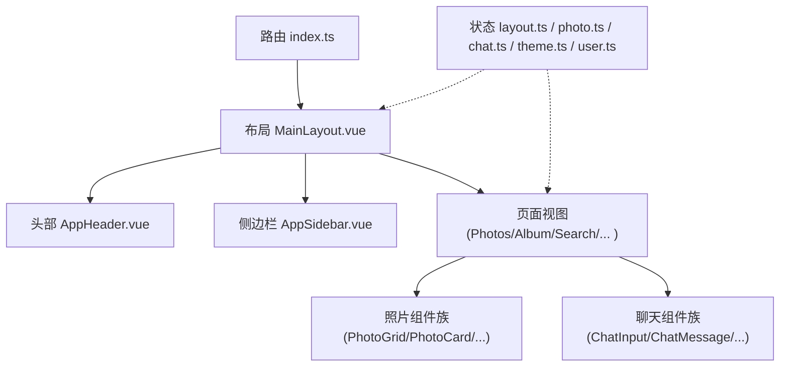
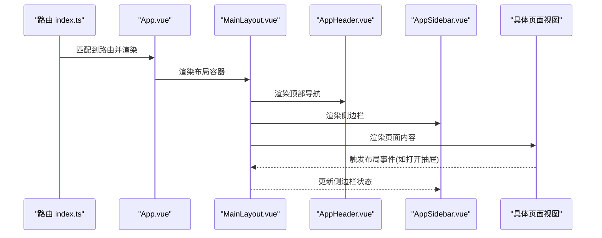
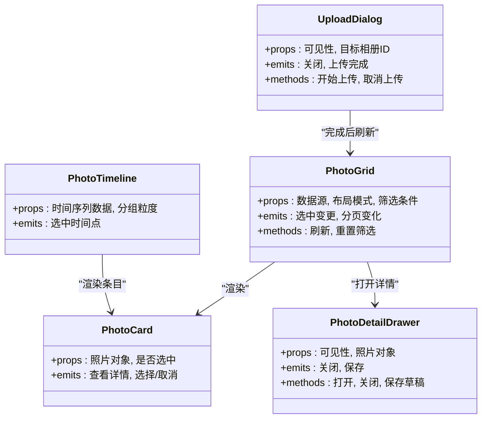
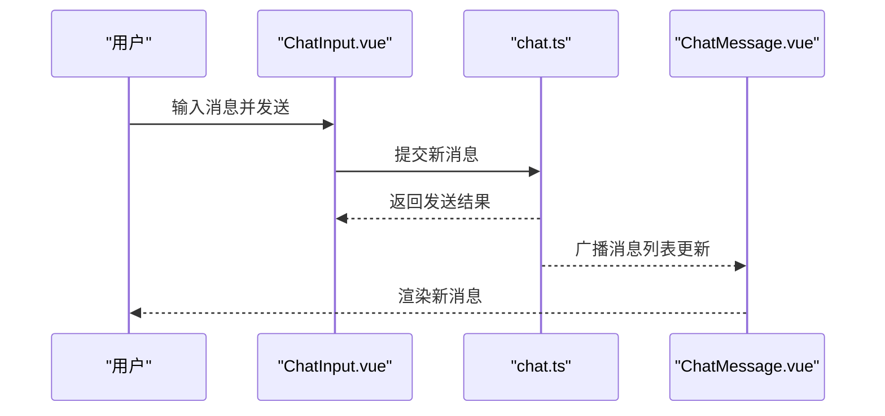
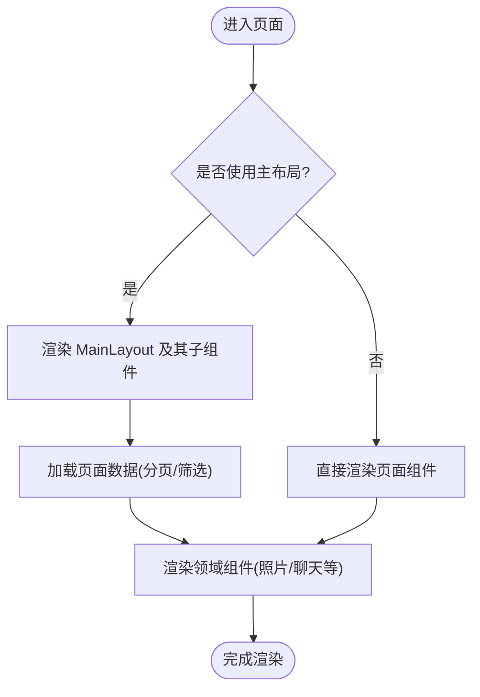
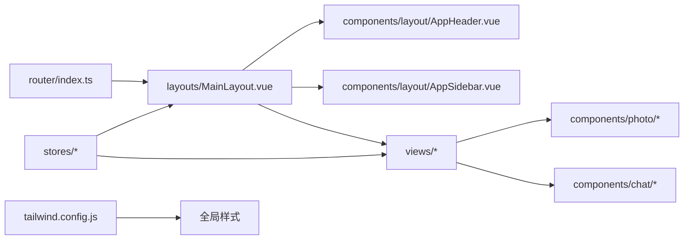

# 组件架构设计

<cite>
**本文引用的文件**   
- [App.vue](file://frontend/src/App.vue)
- [MainLayout.vue](file://frontend/src/layouts/MainLayout.vue)
- [AppHeader.vue](file://frontend/src/components/layout/AppHeader.vue)
- [AppSidebar.vue](file://frontend/src/components/layout/AppSidebar.vue)
- [PhotoCard.vue](file://frontend/src/components/photo/PhotoCard.vue)
- [PhotoDetailDrawer.vue](file://frontend/src/components/photo/PhotoDetailDrawer.vue)
- [PhotoGrid.vue](file://frontend/src/components/photo/PhotoGrid.vue)
- [PhotoTimeline.vue](file://frontend/src/components/photo/PhotoTimeline.vue)
- [UploadDialog.vue](file://frontend/src/components/photo/UploadDialog.vue)
- [ChatInput.vue](file://frontend/src/components/chat/ChatInput.vue)
- [ChatMessage.vue](file://frontend/src/components/chat/ChatMessage.vue)
- [NameConfirmDialog.vue](file://frontend/src/components/chat/NameConfirmDialog.vue)
- [index.ts](file://frontend/src/router/index.ts)
- [layout.ts](file://frontend/src/stores/layout.ts)
- [photo.ts](file://frontend/src/stores/photo.ts)
- [chat.ts](file://frontend/src/stores/chat.ts)
- [theme.ts](file://frontend/src/stores/theme.ts)
- [user.ts](file://frontend/src/stores/user.ts)
- [AlbumPage.vue](file://frontend/src/views/AlbumPage.vue)
- [PhotosPage.vue](file://frontend/src/views/PhotosPage.vue)
- [HomePage.vue](file://frontend/src/views/HomePage.vue)
- [LandingPage.vue](file://frontend/src/views/LandingPage.vue)
- [LoginPage.vue](file://frontend/src/views/LoginPage.vue)
- [SearchPage.vue](file://frontend/src/views/SearchPage.vue)
- [MapPage.vue](file://frontend/src/views/MapPage.vue)
- [FacePage.vue](file://frontend/src/views/FacePage.vue)
- [AgentChat.vue](file://frontend/src/views/AgentChat.vue)
- [Database.vue](file://frontend/src/views/Database.vue)
- [Models.vue](file://frontend/src/views/Models.vue)
- [TasksPage.vue](file://frontend/src/views/TasksPage.vue)
- [SettingsPage.vue](file://frontend/src/views/SettingsPage.vue)
- [RecycleBinPage.vue](file://frontend/src/views/RecycleBinPage.vue)
- [TermsPage.vue](file://frontend/src/views/TermsPage.vue)
- [NotFound.vue](file://frontend/src/views/NotFound.vue)
- [main.ts](file://frontend/src/main.ts)
- [tailwind.config.js](file://frontend/tailwind.config.js)
</cite>

## 目录
1. [简介](#简介)
2. [项目结构](#项目结构)
3. [核心组件](#核心组件)
4. [架构总览](#架构总览)
5. [详细组件分析](#详细组件分析)
6. [依赖关系分析](#依赖关系分析)
7. [性能考虑](#性能考虑)
8. [故障排查指南](#故障排查指南)
9. [结论](#结论)
10. [附录](#附录)

## 简介
本文件面向前端 Vue 3 工程，聚焦于组件架构设计与最佳实践。内容涵盖：
- 组件分层结构与职责边界
- 组合式 API 使用模式与状态管理
- 组件通信机制（Props、Emits、事件总线、全局状态）
- 核心布局组件 App.vue 与 MainLayout.vue 的设计思路
- 组件复用策略、插槽使用、事件处理模式
- 命名规范、目录组织原则、Props 与 Emits 类型定义最佳实践
- 响应式设计、动画效果实现与性能优化技巧
- 可维护的组件开发指导

## 项目结构
前端采用“视图层 + 布局层 + 通用组件 + 业务组件 + 路由 + 状态管理 + 工具”的分层组织方式：
- views：页面级视图，负责路由映射与页面编排
- layouts：应用级布局容器，承载头部、侧边栏与主内容区
- components：按领域划分的可复用组件（如 photo、chat、layout）
- stores：基于组合式 API 的状态模块（layout、photo、chat、theme、user）
- router：路由配置与导航守卫
- utils：跨模块工具函数与请求封装

```mermaid
graph TB
subgraph "入口"
main_ts["main.ts"]
app_vue["App.vue"]
end
subgraph "路由"
router_index["router/index.ts"]
end
subgraph "布局"
main_layout["layouts/MainLayout.vue"]
app_header["components/layout/AppHeader.vue"]
app_sidebar["components/layout/AppSidebar.vue"]
end
subgraph "视图"
photos_page["views/PhotosPage.vue"]
album_page["views/AlbumPage.vue"]
home_page["views/HomePage.vue"]
landing_page["views/LandingPage.vue"]
login_page["views/LoginPage.vue"]
search_page["views/SearchPage.vue"]
map_page["views/MapPage.vue"]
face_page["views/FacePage.vue"]
agent_chat["views/AgentChat.vue"]
database_view["views/Database.vue"]
models_view["views/Models.vue"]
tasks_page["views/TasksPage.vue"]
settings_page["views/SettingsPage.vue"]
recycle_bin["views/RecycleBinPage.vue"]
terms_page["views/TermsPage.vue"]
not_found["views/NotFound.vue"]
end
subgraph "通用组件"
photo_card["components/photo/PhotoCard.vue"]
photo_grid["components/photo/PhotoGrid.vue"]
photo_timeline["components/photo/PhotoTimeline.vue"]
photo_detail_drawer["components/photo/PhotoDetailDrawer.vue"]
upload_dialog["components/photo/UploadDialog.vue"]
chat_input["components/chat/ChatInput.vue"]
chat_message["components/chat/ChatMessage.vue"]
name_confirm_dialog["components/chat/NameConfirmDialog.vue"]
end
subgraph "状态管理"
store_layout["stores/layout.ts"]
store_photo["stores/photo.ts"]
store_chat["stores/chat.ts"]
store_theme["stores/theme.ts"]
store_user["stores/user.ts"]
end
main_ts --> app_vue
app_vue --> router_index
router_index --> main_layout
main_layout --> app_header
main_layout --> app_sidebar
main_layout --> photos_page
main_layout --> album_page
main_layout --> home_page
main_layout --> landing_page
main_layout --> login_page
main_layout --> search_page
main_layout --> map_page
main_layout --> face_page
main_layout --> agent_chat
main_layout --> database_view
main_layout --> models_view
main_layout --> tasks_page
main_layout --> settings_page
main_layout --> recycle_bin
main_layout --> terms_page
main_layout --> not_found
photos_page --> photo_grid
photos_page --> photo_card
photos_page --> photo_detail_drawer
photos_page --> upload_dialog
album_page --> photo_grid
album_page --> photo_card
album_page --> photo_detail_drawer
album_page --> upload_dialog
search_page --> photo_grid
search_page --> photo_card
search_page --> photo_detail_drawer
search_page --> upload_dialog
face_page --> photo_grid
face_page --> photo_card
face_page --> photo_detail_drawer
face_page --> upload_dialog
agent_chat --> chat_input
agent_chat --> chat_message
agent_chat --> name_confirm_dialog
```

图表来源
- [main.ts](file://frontend/src/main.ts)
- [App.vue](file://frontend/src/App.vue)
- [index.ts](file://frontend/src/router/index.ts)
- [MainLayout.vue](file://frontend/src/layouts/MainLayout.vue)
- [AppHeader.vue](file://frontend/src/components/layout/AppHeader.vue)
- [AppSidebar.vue](file://frontend/src/components/layout/AppSidebar.vue)
- [PhotosPage.vue](file://frontend/src/views/PhotosPage.vue)
- [AlbumPage.vue](file://frontend/src/views/AlbumPage.vue)
- [HomePage.vue](file://frontend/src/views/HomePage.vue)
- [LandingPage.vue](file://frontend/src/views/LandingPage.vue)
- [LoginPage.vue](file://frontend/src/views/LoginPage.vue)
- [SearchPage.vue](file://frontend/src/views/SearchPage.vue)
- [MapPage.vue](file://frontend/src/views/MapPage.vue)
- [FacePage.vue](file://frontend/src/views/FacePage.vue)
- [AgentChat.vue](file://frontend/src/views/AgentChat.vue)
- [Database.vue](file://frontend/src/views/Database.vue)
- [Models.vue](file://frontend/src/views/Models.vue)
- [TasksPage.vue](file://frontend/src/views/TasksPage.vue)
- [SettingsPage.vue](file://frontend/src/views/SettingsPage.vue)
- [RecycleBinPage.vue](file://frontend/src/views/RecycleBinPage.vue)
- [TermsPage.vue](file://frontend/src/views/TermsPage.vue)
- [NotFound.vue](file://frontend/src/views/NotFound.vue)
- [PhotoGrid.vue](file://frontend/src/components/photo/PhotoGrid.vue)
- [PhotoCard.vue](file://frontend/src/components/photo/PhotoCard.vue)
- [PhotoDetailDrawer.vue](file://frontend/src/components/photo/PhotoDetailDrawer.vue)
- [UploadDialog.vue](file://frontend/src/components/photo/UploadDialog.vue)
- [ChatInput.vue](file://frontend/src/components/chat/ChatInput.vue)
- [ChatMessage.vue](file://frontend/src/components/chat/ChatMessage.vue)
- [NameConfirmDialog.vue](file://frontend/src/components/chat/NameConfirmDialog.vue)

章节来源
- [main.ts](file://frontend/src/main.ts)
- [App.vue](file://frontend/src/App.vue)
- [index.ts](file://frontend/src/router/index.ts)
- [MainLayout.vue](file://frontend/src/layouts/MainLayout.vue)
- [AppHeader.vue](file://frontend/src/components/layout/AppHeader.vue)
- [AppSidebar.vue](file://frontend/src/components/layout/AppSidebar.vue)
- [PhotoGrid.vue](file://frontend/src/components/photo/PhotoGrid.vue)
- [PhotoCard.vue](file://frontend/src/components/photo/PhotoCard.vue)
- [PhotoDetailDrawer.vue](file://frontend/src/components/photo/PhotoDetailDrawer.vue)
- [UploadDialog.vue](file://frontend/src/components/photo/UploadDialog.vue)
- [ChatInput.vue](file://frontend/src/components/chat/ChatInput.vue)
- [ChatMessage.vue](file://frontend/src/components/chat/ChatMessage.vue)
- [NameConfirmDialog.vue](file://frontend/src/components/chat/NameConfirmDialog.vue)

## 核心组件
- 应用根组件 App.vue
  - 作用：挂载应用、初始化主题与全局样式、提供顶层错误边界与过渡容器
  - 关键点：引入全局样式与 Tailwind 配置；通过路由渲染页面；在必要时注入全局状态或插件
- 主布局 MainLayout.vue
  - 作用：统一页面骨架，包含顶部导航、侧边栏与主内容区域
  - 关键点：根据路由切换激活态；控制侧边栏折叠；承载页面级过渡动画；暴露布局相关的全局状态（如展开/收起）

章节来源
- [App.vue](file://frontend/src/App.vue)
- [MainLayout.vue](file://frontend/src/layouts/MainLayout.vue)

## 架构总览
整体采用“路由驱动 + 布局容器 + 领域组件 + 组合式状态”的架构：
- 路由层：集中管理页面与布局绑定
- 布局层：提供一致的页面外壳与交互框架
- 视图层：页面编排，按需引入领域组件
- 组件层：按功能域拆分，遵循单一职责
- 状态层：以组合式 API 组织状态，避免过度耦合
- 工具层：网络请求、拖拽、坐标转换等通用能力

图表来源
- [index.ts](file://frontend/src/router/index.ts)
- [MainLayout.vue](file://frontend/src/layouts/MainLayout.vue)
- [AppHeader.vue](file://frontend/src/components/layout/AppHeader.vue)
- [AppSidebar.vue](file://frontend/src/components/layout/AppSidebar.vue)
- [PhotoGrid.vue](file://frontend/src/components/photo/PhotoGrid.vue)
- [PhotoCard.vue](file://frontend/src/components/photo/PhotoCard.vue)
- [ChatInput.vue](file://frontend/src/components/chat/ChatInput.vue)
- [ChatMessage.vue](file://frontend/src/components/chat/ChatMessage.vue)
- [layout.ts](file://frontend/src/stores/layout.ts)
- [photo.ts](file://frontend/src/stores/photo.ts)
- [chat.ts](file://frontend/src/stores/chat.ts)
- [theme.ts](file://frontend/src/stores/theme.ts)
- [user.ts](file://frontend/src/stores/user.ts)

## 详细组件分析

### 布局组件：App.vue 与 MainLayout.vue
- App.vue
  - 职责：应用启动、全局样式注入、错误边界与过渡容器
  - 设计要点：
    - 引入全局 CSS 与 Tailwind 基础样式
    - 使用 <router-view> 渲染页面
    - 可选：包裹全局过渡与加载指示器
- MainLayout.vue
  - 职责：页面外壳、导航与侧边栏联动、主内容区占位
  - 设计要点：
    - 根据当前路由高亮对应菜单项
    - 响应式侧边栏（移动端抽屉式）
    - 为页面切换提供统一的进入/离开过渡
    - 暴露布局状态供子组件使用（如侧边栏开关）

图表来源
- [index.ts](file://frontend/src/router/index.ts)
- [App.vue](file://frontend/src/App.vue)
- [MainLayout.vue](file://frontend/src/layouts/MainLayout.vue)
- [AppHeader.vue](file://frontend/src/components/layout/AppHeader.vue)
- [AppSidebar.vue](file://frontend/src/components/layout/AppSidebar.vue)

章节来源
- [App.vue](file://frontend/src/App.vue)
- [MainLayout.vue](file://frontend/src/layouts/MainLayout.vue)
- [AppHeader.vue](file://frontend/src/components/layout/AppHeader.vue)
- [AppSidebar.vue](file://frontend/src/components/layout/AppSidebar.vue)

### 照片领域组件族
- PhotoGrid.vue
  - 职责：照片网格展示、分页/无限滚动、筛选与排序
  - 关键特性：
    - 响应式栅格布局（小屏单列、大屏多列）
    - 懒加载图片与骨架屏占位
    - 支持批量选择与操作
- PhotoCard.vue
  - 职责：单张照片卡片，展示缩略图、元信息与快捷操作
  - 关键特性：
    - 悬停显示操作按钮
    - 点击跳转详情或打开抽屉
- PhotoDetailDrawer.vue
  - 职责：右侧抽屉展示照片详情、编辑与批处理
  - 关键特性：
    - 键盘 ESC 关闭
    - 防抖保存与撤销
- PhotoTimeline.vue
  - 职责：时间轴视图，适合回顾与故事线浏览
  - 关键特性：
    - 分组聚合（年/月/日）
    - 虚拟列表优化长列表渲染
- UploadDialog.vue
  - 职责：上传对话框，支持拖拽与批量上传
  - 关键特性：
    - 进度条与失败重试
    - 预览与删除已选文件

图表来源
- [PhotoGrid.vue](file://frontend/src/components/photo/PhotoGrid.vue)
- [PhotoCard.vue](file://frontend/src/components/photo/PhotoCard.vue)
- [PhotoDetailDrawer.vue](file://frontend/src/components/photo/PhotoDetailDrawer.vue)
- [PhotoTimeline.vue](file://frontend/src/components/photo/PhotoTimeline.vue)
- [UploadDialog.vue](file://frontend/src/components/photo/UploadDialog.vue)

章节来源
- [PhotoGrid.vue](file://frontend/src/components/photo/PhotoGrid.vue)
- [PhotoCard.vue](file://frontend/src/components/photo/PhotoCard.vue)
- [PhotoDetailDrawer.vue](file://frontend/src/components/photo/PhotoDetailDrawer.vue)
- [PhotoTimeline.vue](file://frontend/src/components/photo/PhotoTimeline.vue)
- [UploadDialog.vue](file://frontend/src/components/photo/UploadDialog.vue)

### 聊天领域组件族
- ChatInput.vue
  - 职责：输入框、快捷键发送、表情与附件插入
  - 关键特性：
    - 自动高度文本域
    - Enter 发送，Shift+Enter 换行
- ChatMessage.vue
  - 职责：消息气泡、头像、时间戳、引用与回复
  - 关键特性：
    - 区分用户/系统消息样式
    - 长按复制与分享
- NameConfirmDialog.vue
  - 职责：人脸确认弹窗，用于标注与重命名
  - 关键特性：
    - 快速确认/跳过
    - 批量确认

图表来源
- [ChatInput.vue](file://frontend/src/components/chat/ChatInput.vue)
- [ChatMessage.vue](file://frontend/src/components/chat/ChatMessage.vue)
- [chat.ts](file://frontend/src/stores/chat.ts)

章节来源
- [ChatInput.vue](file://frontend/src/components/chat/ChatInput.vue)
- [ChatMessage.vue](file://frontend/src/components/chat/ChatMessage.vue)
- [NameConfirmDialog.vue](file://frontend/src/components/chat/NameConfirmDialog.vue)
- [chat.ts](file://frontend/src/stores/chat.ts)

### 页面视图与布局集成
- PhotosPage.vue、AlbumPage.vue、SearchPage.vue、FacePage.vue
  - 职责：聚合照片组件，承载筛选、搜索、批量操作
  - 与布局集成：通过 MainLayout 的侧边栏与头部进行导航与全局操作
- AgentChat.vue
  - 职责：AI 助手对话界面，集成聊天组件族
- 其他页面：Home、Landing、Login、Map、Database、Models、Tasks、Settings、RecycleBin、Terms、NotFound
  - 职责：各自独立的功能页面，部分页面可能不使用 MainLayout（如 Landing、Login）

章节来源
- [PhotosPage.vue](file://frontend/src/views/PhotosPage.vue)
- [AlbumPage.vue](file://frontend/src/views/AlbumPage.vue)
- [SearchPage.vue](file://frontend/src/views/SearchPage.vue)
- [FacePage.vue](file://frontend/src/views/FacePage.vue)
- [AgentChat.vue](file://frontend/src/views/AgentChat.vue)
- [HomePage.vue](file://frontend/src/views/HomePage.vue)
- [LandingPage.vue](file://frontend/src/views/LandingPage.vue)
- [LoginPage.vue](file://frontend/src/views/LoginPage.vue)
- [MapPage.vue](file://frontend/src/views/MapPage.vue)
- [Database.vue](file://frontend/src/views/Database.vue)
- [Models.vue](file://frontend/src/views/Models.vue)
- [TasksPage.vue](file://frontend/src/views/TasksPage.vue)
- [SettingsPage.vue](file://frontend/src/views/SettingsPage.vue)
- [RecycleBinPage.vue](file://frontend/src/views/RecycleBinPage.vue)
- [TermsPage.vue](file://frontend/src/views/TermsPage.vue)
- [NotFound.vue](file://frontend/src/views/NotFound.vue)

## 依赖关系分析
- 组件间依赖
  - 视图层依赖布局层与领域组件
  - 领域组件之间通过 Props/Emits 与状态模块解耦
  - 布局层依赖路由与全局状态（如主题、侧边栏状态）
- 状态管理依赖
  - layout.ts：侧边栏展开/收起、面包屑、页面标题
  - photo.ts：照片列表、分页、筛选、批量选择
  - chat.ts：聊天记录、发送状态、未读计数
  - theme.ts：主题切换、颜色变量
  - user.ts：用户信息、权限、登录态
- 外部依赖
  - Tailwind 样式体系（tailwind.config.js）
  - 路由与导航（router/index.ts）

图表来源
- [index.ts](file://frontend/src/router/index.ts)
- [MainLayout.vue](file://frontend/src/layouts/MainLayout.vue)
- [AppHeader.vue](file://frontend/src/components/layout/AppHeader.vue)
- [AppSidebar.vue](file://frontend/src/components/layout/AppSidebar.vue)
- [PhotoGrid.vue](file://frontend/src/components/photo/PhotoGrid.vue)
- [PhotoCard.vue](file://frontend/src/components/photo/PhotoCard.vue)
- [PhotoDetailDrawer.vue](file://frontend/src/components/photo/PhotoDetailDrawer.vue)
- [PhotoTimeline.vue](file://frontend/src/components/photo/PhotoTimeline.vue)
- [UploadDialog.vue](file://frontend/src/components/photo/UploadDialog.vue)
- [ChatInput.vue](file://frontend/src/components/chat/ChatInput.vue)
- [ChatMessage.vue](file://frontend/src/components/chat/ChatMessage.vue)
- [NameConfirmDialog.vue](file://frontend/src/components/chat/NameConfirmDialog.vue)
- [layout.ts](file://frontend/src/stores/layout.ts)
- [photo.ts](file://frontend/src/stores/photo.ts)
- [chat.ts](file://frontend/src/stores/chat.ts)
- [theme.ts](file://frontend/src/stores/theme.ts)
- [user.ts](file://frontend/src/stores/user.ts)
- [tailwind.config.js](file://frontend/tailwind.config.js)

章节来源
- [index.ts](file://frontend/src/router/index.ts)
- [MainLayout.vue](file://frontend/src/layouts/MainLayout.vue)
- [AppHeader.vue](file://frontend/src/components/layout/AppHeader.vue)
- [AppSidebar.vue](file://frontend/src/components/layout/AppSidebar.vue)
- [PhotoGrid.vue](file://frontend/src/components/photo/PhotoGrid.vue)
- [PhotoCard.vue](file://frontend/src/components/photo/PhotoCard.vue)
- [PhotoDetailDrawer.vue](file://frontend/src/components/photo/PhotoDetailDrawer.vue)
- [PhotoTimeline.vue](file://frontend/src/components/photo/PhotoTimeline.vue)
- [UploadDialog.vue](file://frontend/src/components/photo/UploadDialog.vue)
- [ChatInput.vue](file://frontend/src/components/chat/ChatInput.vue)
- [ChatMessage.vue](file://frontend/src/components/chat/ChatMessage.vue)
- [NameConfirmDialog.vue](file://frontend/src/components/chat/NameConfirmDialog.vue)
- [layout.ts](file://frontend/src/stores/layout.ts)
- [photo.ts](file://frontend/src/stores/photo.ts)
- [chat.ts](file://frontend/src/stores/chat.ts)
- [theme.ts](file://frontend/src/stores/theme.ts)
- [user.ts](file://frontend/src/stores/user.ts)
- [tailwind.config.js](file://frontend/tailwind.config.js)

## 性能考虑
- 列表渲染优化
  - 使用虚拟列表或窗口化技术（长列表场景）
  - 分页与增量加载，避免一次性渲染大量节点
- 图片与媒体
  - 懒加载与占位骨架屏
  - 缩略图与 WebP/AVIF 格式
  - 预加载关键首屏资源
- 组件粒度与惰性加载
  - 大组件使用动态导入与路由级懒加载
  - 将重型逻辑下沉至 Composables 或 Worker
- 状态更新频率
  - 合并频繁更新（节流/防抖）
  - 使用计算属性缓存派生数据
- 动画与过渡
  - 合理使用 CSS 过渡与 GPU 加速属性
  - 避免在高频事件中执行复杂动画

[本节为通用性能建议，不直接分析具体文件]

## 故障排查指南
- 常见问题定位
  - 路由未正确渲染：检查路由配置与布局绑定
  - 状态不同步：核对状态模块的订阅与派发路径
  - 组件通信异常：确认 Props/Emits 类型一致性与默认值
  - 样式冲突：检查 Tailwind 覆盖顺序与类名优先级
- 调试手段
  - 使用浏览器开发者工具观察组件树与状态变化
  - 在关键生命周期与事件回调中输出日志
  - 对异步流程增加超时与错误边界

章节来源
- [index.ts](file://frontend/src/router/index.ts)
- [layout.ts](file://frontend/src/stores/layout.ts)
- [photo.ts](file://frontend/src/stores/photo.ts)
- [chat.ts](file://frontend/src/stores/chat.ts)
- [theme.ts](file://frontend/src/stores/theme.ts)
- [user.ts](file://frontend/src/stores/user.ts)

## 结论
本架构通过清晰的层次划分与组合式 API 状态管理，实现了高内聚、低耦合的组件体系。布局层统一了页面外壳与交互框架，领域组件按功能域拆分，配合路由与状态模块，形成可扩展、可维护的前端工程结构。遵循命名规范、目录组织与 Props/Emits 类型定义最佳实践，有助于提升团队协作效率与代码质量。

## 附录

### 组件命名规范
- 组件名使用 PascalCase，文件名与文件夹名保持一致
- 布局组件以 Layout 结尾（如 MainLayout.vue）
- 领域组件以功能名词开头（如 PhotoCard.vue、ChatInput.vue）
- 通用 UI 组件以通用前缀或语义化名称（如 UploadDialog.vue）

### 目录组织原则
- 按“视图 + 布局 + 领域组件 + 状态 + 工具”分层
- 领域组件按功能域分目录（photo、chat、layout）
- 状态模块按领域拆分（photo.ts、chat.ts、layout.ts）
- 路由集中管理，页面与布局绑定清晰

### Props 与 Emits 类型定义最佳实践
- 使用 TypeScript 接口定义 Props 与 Emits 类型
- 为必填字段设置 required，为可选字段提供默认值
- 使用枚举或字面量联合类型约束取值范围
- 在父组件中对传入数据进行校验与格式化

### 插槽使用模式
- 默认插槽：用于主体内容替换
- 具名插槽：用于头部、尾部、空状态等局部替换
- 作用域插槽：向父组件暴露子组件内部数据

### 事件处理模式
- 子组件通过 emits 抛出事件，父组件监听并处理
- 复杂交互可使用状态模块作为中介，降低父子耦合
- 键盘与手势事件统一封装为 Composables

### 响应式设计
- 基于 Tailwind 断点实现栅格与间距适配
- 移动端优先，逐步增强桌面体验
- 侧边栏在移动端以抽屉形式呈现

### 动画效果实现
- 使用 Vue 内置过渡组件与 CSS 过渡
- 列表项进入/离开动画使用 key 稳定标识
- 避免在动画中执行昂贵计算

### 性能优化技巧
- 列表虚拟化与分页加载
- 图片懒加载与占位骨架屏
- 组件与路由懒加载
- 计算属性缓存与事件节流/防抖