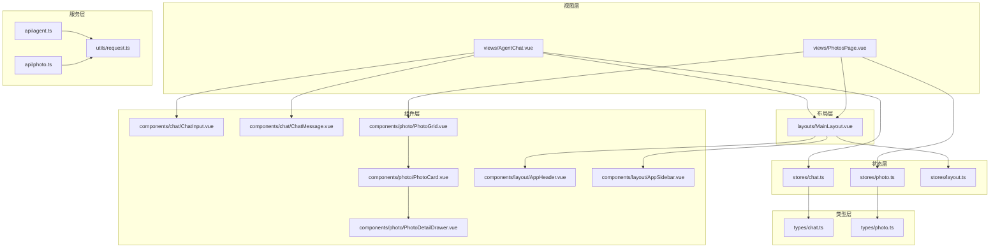
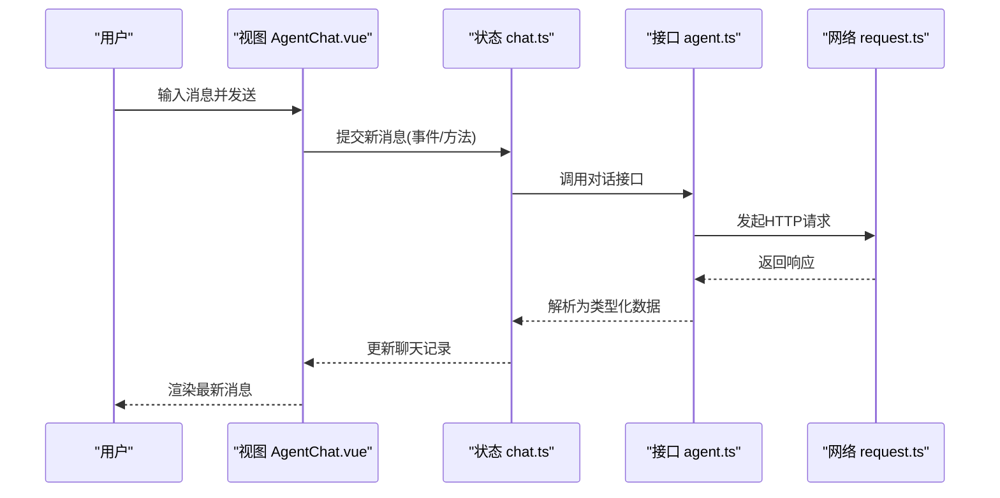
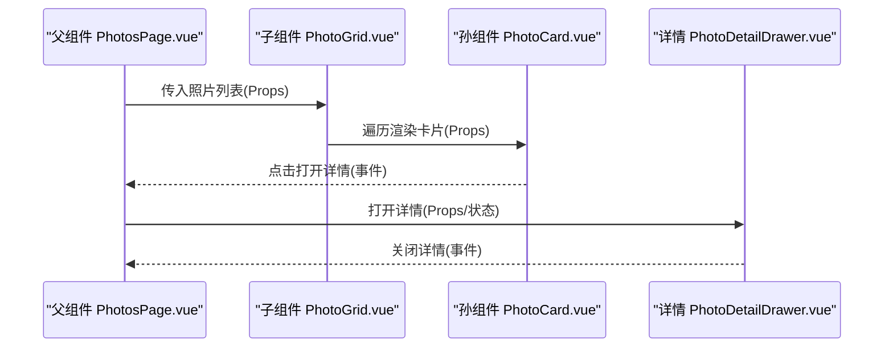
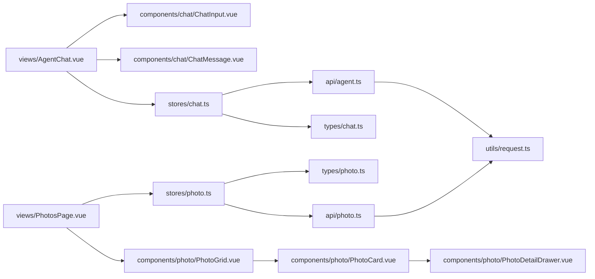

# 组件设计模式

<cite>
**本文引用的文件**   
- [frontend/src/components/chat/ChatInput.vue](file://frontend/src/components/chat/ChatInput.vue)
- [frontend/src/components/chat/ChatMessage.vue](file://frontend/src/components/chat/ChatMessage.vue)
- [frontend/src/components/chat/NameConfirmDialog.vue](file://frontend/src/components/chat/NameConfirmDialog.vue)
- [frontend/src/components/layout/AppHeader.vue](file://frontend/src/components/layout/AppHeader.vue)
- [frontend/src/components/layout/AppSidebar.vue](file://frontend/src/components/layout/AppSidebar.vue)
- [frontend/src/components/photo/PhotoCard.vue](file://frontend/src/components/photo/PhotoCard.vue)
- [frontend/src/components/photo/PhotoDetailDrawer.vue](file://frontend/src/components/photo/PhotoDetailDrawer.vue)
- [frontend/src/components/photo/PhotoGrid.vue](file://frontend/src/components/photo/PhotoGrid.vue)
- [frontend/src/components/photo/PhotoTimeline.vue](file://frontend/src/components/photo/PhotoTimeline.vue)
- [frontend/src/components/photo/UploadDialog.vue](file://frontend/src/components/photo/UploadDialog.vue)
- [frontend/src/layouts/MainLayout.vue](file://frontend/src/layouts/MainLayout.vue)
- [frontend/src/views/AgentChat.vue](file://frontend/src/views/AgentChat.vue)
- [frontend/src/views/PhotosPage.vue](file://frontend/src/views/PhotosPage.vue)
- [frontend/src/stores/chat.ts](file://frontend/src/stores/chat.ts)
- [frontend/src/stores/layout.ts](file://frontend/src/stores/layout.ts)
- [frontend/src/stores/photo.ts](file://frontend/src/stores/photo.ts)
- [frontend/src/types/chat.ts](file://frontend/src/types/chat.ts)
- [frontend/src/types/photo.ts](file://frontend/src/types/photo.ts)
- [frontend/src/api/agent.ts](file://frontend/src/api/agent.ts)
- [frontend/src/api/photo.ts](file://frontend/src/api/photo.ts)
- [frontend/src/utils/request.ts](file://frontend/src/utils/request.ts)
</cite>

## 目录
1. [简介](#简介)
2. [项目结构](#项目结构)
3. [核心组件](#核心组件)
4. [架构总览](#架构总览)
5. [详细组件分析](#详细组件分析)
6. [依赖关系分析](#依赖关系分析)
7. [性能考量](#性能考量)
8. [故障排查指南](#故障排查指南)
9. [结论](#结论)
10. [附录](#附录)

## 简介
本文件面向Vue 3前端工程，系统化总结组合式API（Composition API）的使用模式、组件分层架构与通信机制，结合本项目实际代码组织，给出Props与Emits的类型安全最佳实践、插槽高级用法、条件与列表渲染优化策略，以及命名规范与目录结构建议。目标是帮助团队构建可维护、可扩展的组件体系。

## 项目结构
前端采用按功能域划分的目录组织方式：
- components：通用与业务组件，按领域子目录划分（如 chat、layout、photo）。
- views：页面级视图，组合多个组件完成完整业务场景。
- layouts：布局容器，承载全局导航与侧边栏等。
- stores：状态管理（Pinia），集中管理跨组件共享数据。
- types：TypeScript类型定义，统一数据结构契约。
- api：HTTP请求封装与接口方法。
- utils：工具函数与通用逻辑。

图表来源
- [frontend/src/views/AgentChat.vue](file://frontend/src/views/AgentChat.vue)
- [frontend/src/views/PhotosPage.vue](file://frontend/src/views/PhotosPage.vue)
- [frontend/src/layouts/MainLayout.vue](file://frontend/src/layouts/MainLayout.vue)
- [frontend/src/components/chat/ChatInput.vue](file://frontend/src/components/chat/ChatInput.vue)
- [frontend/src/components/chat/ChatMessage.vue](file://frontend/src/components/chat/ChatMessage.vue)
- [frontend/src/components/photo/PhotoGrid.vue](file://frontend/src/components/photo/PhotoGrid.vue)
- [frontend/src/components/photo/PhotoCard.vue](file://frontend/src/components/photo/PhotoCard.vue)
- [frontend/src/components/photo/PhotoDetailDrawer.vue](file://frontend/src/components/photo/PhotoDetailDrawer.vue)
- [frontend/src/components/layout/AppHeader.vue](file://frontend/src/components/layout/AppHeader.vue)
- [frontend/src/components/layout/AppSidebar.vue](file://frontend/src/components/layout/AppSidebar.vue)
- [frontend/src/stores/chat.ts](file://frontend/src/stores/chat.ts)
- [frontend/src/stores/photo.ts](file://frontend/src/stores/photo.ts)
- [frontend/src/stores/layout.ts](file://frontend/src/stores/layout.ts)
- [frontend/src/types/chat.ts](file://frontend/src/types/chat.ts)
- [frontend/src/types/photo.ts](file://frontend/src/types/photo.ts)
- [frontend/src/api/agent.ts](file://frontend/src/api/agent.ts)
- [frontend/src/api/photo.ts](file://frontend/src/api/photo.ts)
- [frontend/src/utils/request.ts](file://frontend/src/utils/request.ts)

章节来源
- [frontend/src/views/AgentChat.vue](file://frontend/src/views/AgentChat.vue)
- [frontend/src/views/PhotosPage.vue](file://frontend/src/views/PhotosPage.vue)
- [frontend/src/layouts/MainLayout.vue](file://frontend/src/layouts/MainLayout.vue)
- [frontend/src/components/chat/ChatInput.vue](file://frontend/src/components/chat/ChatInput.vue)
- [frontend/src/components/chat/ChatMessage.vue](file://frontend/src/components/chat/ChatMessage.vue)
- [frontend/src/components/photo/PhotoGrid.vue](file://frontend/src/components/photo/PhotoGrid.vue)
- [frontend/src/components/photo/PhotoCard.vue](file://frontend/src/components/photo/PhotoCard.vue)
- [frontend/src/components/photo/PhotoDetailDrawer.vue](file://frontend/src/components/photo/PhotoDetailDrawer.vue)
- [frontend/src/components/layout/AppHeader.vue](file://frontend/src/components/layout/AppHeader.vue)
- [frontend/src/components/layout/AppSidebar.vue](file://frontend/src/components/layout/AppSidebar.vue)
- [frontend/src/stores/chat.ts](file://frontend/src/stores/chat.ts)
- [frontend/src/stores/photo.ts](file://frontend/src/stores/photo.ts)
- [frontend/src/stores/layout.ts](file://frontend/src/stores/layout.ts)
- [frontend/src/types/chat.ts](file://frontend/src/types/chat.ts)
- [frontend/src/types/photo.ts](file://frontend/src/types/photo.ts)
- [frontend/src/api/agent.ts](file://frontend/src/api/agent.ts)
- [frontend/src/api/photo.ts](file://frontend/src/api/photo.ts)
- [frontend/src/utils/request.ts](file://frontend/src/utils/request.ts)

## 核心组件
- 聊天输入 ChatInput：负责用户消息输入与发送交互，通过事件向父组件上报新消息。
- 聊天消息 ChatMessage：展示单条消息内容，支持不同消息类型的差异化渲染。
- 名称确认弹窗 NameConfirmDialog：用于人脸或实体名称确认的对话框，包含确定/取消操作。
- 照片卡片 PhotoCard：展示单张照片缩略图及基本信息，点击触发详情抽屉。
- 照片网格 PhotoGrid：以网格形式批量展示照片卡片，处理分页与加载状态。
- 照片详情抽屉 PhotoDetailDrawer：从右侧滑出显示大图与元信息。
- 上传对话框 UploadDialog：拖拽/选择文件并发起上传流程。
- 应用头部 AppHeader 与应用侧边栏 AppSidebar：全局导航与布局控制。
- 主布局 MainLayout：组合头部、侧边栏与页面内容区域。

章节来源
- [frontend/src/components/chat/ChatInput.vue](file://frontend/src/components/chat/ChatInput.vue)
- [frontend/src/components/chat/ChatMessage.vue](file://frontend/src/components/chat/ChatMessage.vue)
- [frontend/src/components/chat/NameConfirmDialog.vue](file://frontend/src/components/chat/NameConfirmDialog.vue)
- [frontend/src/components/photo/PhotoCard.vue](file://frontend/src/components/photo/PhotoCard.vue)
- [frontend/src/components/photo/PhotoGrid.vue](file://frontend/src/components/photo/PhotoGrid.vue)
- [frontend/src/components/photo/PhotoDetailDrawer.vue](file://frontend/src/components/photo/PhotoDetailDrawer.vue)
- [frontend/src/components/photo/UploadDialog.vue](file://frontend/src/components/photo/UploadDialog.vue)
- [frontend/src/components/layout/AppHeader.vue](file://frontend/src/components/layout/AppHeader.vue)
- [frontend/src/components/layout/AppSidebar.vue](file://frontend/src/components/layout/AppSidebar.vue)
- [frontend/src/layouts/MainLayout.vue](file://frontend/src/layouts/MainLayout.vue)

## 架构总览
整体遵循“视图层 → 组件层 → 状态层 → 服务层”的分层模型：
- 视图层（views）：编排页面所需组件与状态，不直接调用API。
- 组件层（components）：纯UI与交互逻辑，通过Props接收数据，通过Emits向上汇报事件。
- 状态层（stores）：使用Pinia集中管理跨组件共享数据与副作用。
- 服务层（api + utils）：封装HTTP请求与错误处理，提供统一的网络访问能力。

图表来源
- [frontend/src/views/AgentChat.vue](file://frontend/src/views/AgentChat.vue)
- [frontend/src/stores/chat.ts](file://frontend/src/stores/chat.ts)
- [frontend/src/api/agent.ts](file://frontend/src/api/agent.ts)
- [frontend/src/utils/request.ts](file://frontend/src/utils/request.ts)

## 详细组件分析

### 组合式API使用模式
- 使用setup语法糖与ref/reactive管理局部状态，将相关逻辑聚合到独立的组合函数中，提升复用性。
- 对副作用（如监听路由、窗口尺寸变化）使用watch/watchEffect，并在组件卸载时清理资源。
- 将复杂计算逻辑抽离为computed，避免在模板中进行昂贵运算。
- 将网络请求与错误处理集中在store或composable中，组件仅关注UI与事件。

章节来源
- [frontend/src/stores/chat.ts](file://frontend/src/stores/chat.ts)
- [frontend/src/stores/photo.ts](file://frontend/src/stores/photo.ts)
- [frontend/src/stores/layout.ts](file://frontend/src/stores/layout.ts)

### Props与Emits类型安全最佳实践
- 使用defineProps与defineEmits的泛型形式，明确每个属性的类型与默认值，确保父子契约稳定。
- 将公共类型抽取至types目录，供组件与store共同引用，避免重复定义。
- 对可选属性提供合理的默认值与校验逻辑，减少运行时异常。
- Emits事件载荷使用联合类型表达多种可能状态，便于上层分支处理。

章节来源
- [frontend/src/components/chat/ChatInput.vue](file://frontend/src/components/chat/ChatInput.vue)
- [frontend/src/components/chat/ChatMessage.vue](file://frontend/src/components/chat/ChatMessage.vue)
- [frontend/src/components/photo/PhotoCard.vue](file://frontend/src/components/photo/PhotoCard.vue)
- [frontend/src/components/photo/PhotoGrid.vue](file://frontend/src/components/photo/PhotoGrid.vue)
- [frontend/src/types/chat.ts](file://frontend/src/types/chat.ts)
- [frontend/src/types/photo.ts](file://frontend/src/types/photo.ts)

### 组件通信机制
- 父子通信：父组件通过Props传递数据，子组件通过Emits上报事件；适用于大多数场景。
- 兄弟通信：通过共同的父组件中转或使用全局状态（Pinia）进行解耦。
- 跨层级通信：使用Provide/Inject或Pinia，避免深层Props透传。
- 表单与弹窗：通过事件回调与状态同步实现双向交互，保持单向数据流清晰。

图表来源
- [frontend/src/views/PhotosPage.vue](file://frontend/src/views/PhotosPage.vue)
- [frontend/src/components/photo/PhotoGrid.vue](file://frontend/src/components/photo/PhotoGrid.vue)
- [frontend/src/components/photo/PhotoCard.vue](file://frontend/src/components/photo/PhotoCard.vue)
- [frontend/src/components/photo/PhotoDetailDrawer.vue](file://frontend/src/components/photo/PhotoDetailDrawer.vue)

### 插槽（Slots）高级用法与作用域插槽
- 默认插槽：用于包裹组件主体内容，提供灵活的布局扩展点。
- 具名插槽：允许在组件内部多个位置插入不同内容，适合复杂布局。
- 作用域插槽：父组件通过插槽获取子组件内部状态，实现高度定制化的渲染逻辑。
- 推荐将可变部分抽象为插槽，使组件具备更强的可配置性与复用性。

章节来源
- [frontend/src/components/photo/PhotoCard.vue](file://frontend/src/components/photo/PhotoCard.vue)
- [frontend/src/components/photo/PhotoGrid.vue](file://frontend/src/components/photo/PhotoGrid.vue)
- [frontend/src/components/chat/ChatMessage.vue](file://frontend/src/components/chat/ChatMessage.vue)

### 组件复用策略
- 基础组件优先：将按钮、输入框、卡片等抽象为基础组件，统一样式与行为。
- 组合式复用：通过组合函数共享逻辑（如分页、搜索、上传），在多个组件中复用。
- 高阶组件思想：用组合式API替代HOC，避免过度嵌套。
- 主题与变体：通过Props控制组件外观与行为变体，减少重复实现。

章节来源
- [frontend/src/components/photo/PhotoCard.vue](file://frontend/src/components/photo/PhotoCard.vue)
- [frontend/src/components/photo/PhotoGrid.vue](file://frontend/src/components/photo/PhotoGrid.vue)
- [frontend/src/components/chat/ChatInput.vue](file://frontend/src/components/chat/ChatInput.vue)

### 条件渲染与列表渲染优化
- 条件渲染：合理使用v-if/v-show，频繁切换的场景优先v-show，需要销毁重建的场景使用v-if。
- 列表渲染：为每项提供稳定的key，避免不必要的重渲染；大数据量使用虚拟滚动或分页。
- 惰性加载：按需加载图片与组件，减少首屏压力。
- 防抖与节流：对搜索、滚动等高频事件进行节流/防抖，降低计算开销。

章节来源
- [frontend/src/components/photo/PhotoGrid.vue](file://frontend/src/components/photo/PhotoGrid.vue)
- [frontend/src/components/photo/PhotoCard.vue](file://frontend/src/components/photo/PhotoCard.vue)

### 命名规范与文件组织结构
- 组件命名：使用PascalCase，文件名与组件名保持一致，体现领域语义（如 PhotoCard.vue）。
- 目录组织：按功能域划分（chat、photo、layout），每个域内再细分组件、类型与测试。
- 类型文件：集中存放于types目录，模块间共享同一份类型定义。
- 状态与API：分别置于stores与api目录，职责单一、边界清晰。

章节来源
- [frontend/src/components/chat/ChatInput.vue](file://frontend/src/components/chat/ChatInput.vue)
- [frontend/src/components/photo/PhotoGrid.vue](file://frontend/src/components/photo/PhotoGrid.vue)
- [frontend/src/types/chat.ts](file://frontend/src/types/chat.ts)
- [frontend/src/types/photo.ts](file://frontend/src/types/photo.ts)
- [frontend/src/stores/chat.ts](file://frontend/src/stores/chat.ts)
- [frontend/src/api/agent.ts](file://frontend/src/api/agent.ts)

## 依赖关系分析
组件与模块之间的依赖关系如下：
- 视图依赖布局与业务组件。
- 组件依赖类型定义与状态管理。
- 状态依赖API与服务层。
- API依赖网络工具与错误处理。

图表来源
- [frontend/src/views/AgentChat.vue](file://frontend/src/views/AgentChat.vue)
- [frontend/src/views/PhotosPage.vue](file://frontend/src/views/PhotosPage.vue)
- [frontend/src/components/chat/ChatInput.vue](file://frontend/src/components/chat/ChatInput.vue)
- [frontend/src/components/chat/ChatMessage.vue](file://frontend/src/components/chat/ChatMessage.vue)
- [frontend/src/components/photo/PhotoGrid.vue](file://frontend/src/components/photo/PhotoGrid.vue)
- [frontend/src/components/photo/PhotoCard.vue](file://frontend/src/components/photo/PhotoCard.vue)
- [frontend/src/components/photo/PhotoDetailDrawer.vue](file://frontend/src/components/photo/PhotoDetailDrawer.vue)
- [frontend/src/stores/chat.ts](file://frontend/src/stores/chat.ts)
- [frontend/src/stores/photo.ts](file://frontend/src/stores/photo.ts)
- [frontend/src/types/chat.ts](file://frontend/src/types/chat.ts)
- [frontend/src/types/photo.ts](file://frontend/src/types/photo.ts)
- [frontend/src/api/agent.ts](file://frontend/src/api/agent.ts)
- [frontend/src/api/photo.ts](file://frontend/src/api/photo.ts)
- [frontend/src/utils/request.ts](file://frontend/src/utils/request.ts)

## 性能考量
- 列表渲染优化：为大型列表使用分页或虚拟滚动，避免一次性渲染过多节点。
- 懒加载与预加载：图片与重型组件按需加载，关键路径资源提前预取。
- 计算缓存：使用computed缓存昂贵计算结果，减少重复计算。
- 事件节流/防抖：对输入、滚动、窗口resize等高频事件进行限流。
- 组件拆分与惰性导入：将大组件拆分为小模块，按需异步加载，降低首屏体积。

[本节为通用指导，无需源码引用]

## 故障排查指南
- 类型不一致：检查types目录中的类型定义是否与组件Props/Emits一致，确保前后端字段对齐。
- 事件未触发：确认子组件是否正确emit事件，父组件是否绑定对应处理器。
- 状态不同步：检查Pinia store的读写路径，避免多处修改导致状态不一致。
- 网络错误：查看API层的错误处理与重试策略，定位超时与鉴权问题。
- 插槽内容不生效：确认插槽名称与作用域变量是否正确传递。

章节来源
- [frontend/src/types/chat.ts](file://frontend/src/types/chat.ts)
- [frontend/src/types/photo.ts](file://frontend/src/types/photo.ts)
- [frontend/src/stores/chat.ts](file://frontend/src/stores/chat.ts)
- [frontend/src/stores/photo.ts](file://frontend/src/stores/photo.ts)
- [frontend/src/api/agent.ts](file://frontend/src/api/agent.ts)
- [frontend/src/api/photo.ts](file://frontend/src/api/photo.ts)
- [frontend/src/utils/request.ts](file://frontend/src/utils/request.ts)

## 结论
通过清晰的组件分层、严格的类型契约、合理的通信机制与插槽设计，配合组合式API的最佳实践，可以显著提升Vue 3项目的可维护性与可扩展性。建议在团队内推广统一的命名规范、目录结构与类型定义，持续优化列表与网络请求的性能表现，建立完善的错误处理与调试手段。

[本节为总结性内容，无需源码引用]

## 附录
- 组件开发清单：
  - 明确Props与Emits类型，提供默认值与校验。
  - 将复杂逻辑抽离为组合函数或store。
  - 使用插槽暴露扩展点，保持组件高内聚低耦合。
  - 为列表项设置稳定key，考虑分页与虚拟滚动。
  - 统一错误处理与日志记录，便于定位问题。

[本节为补充说明，无需源码引用]