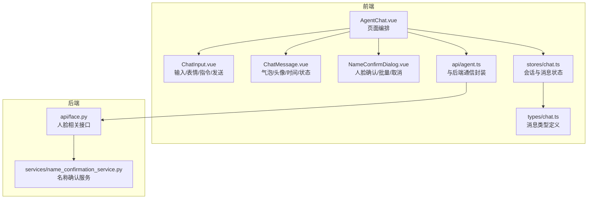
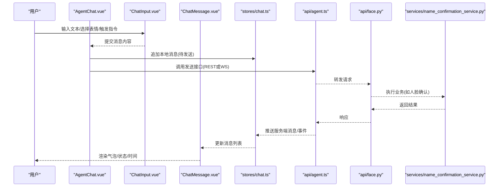
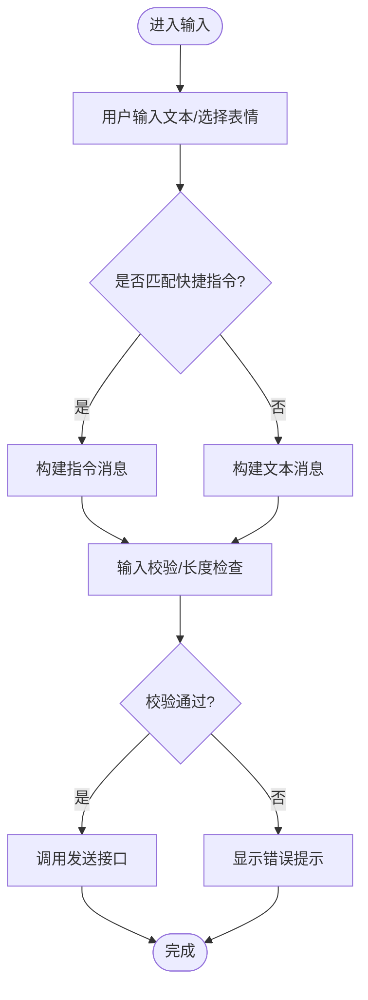
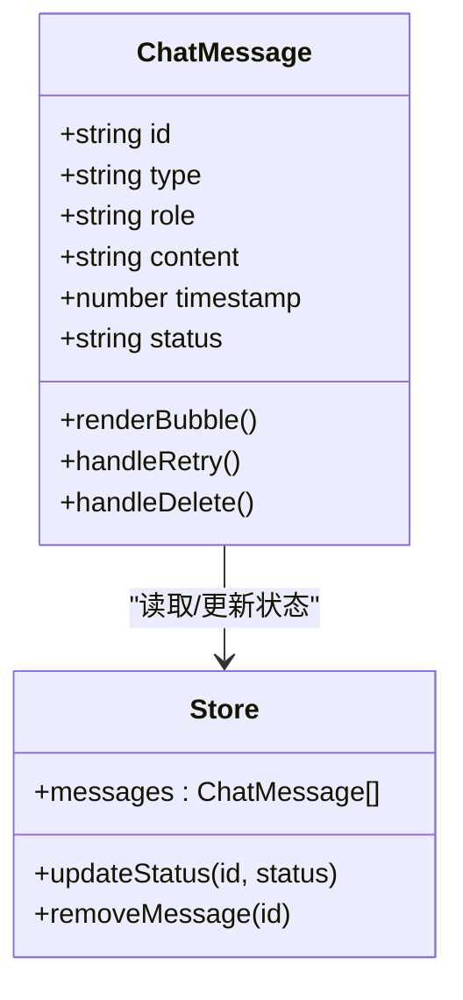
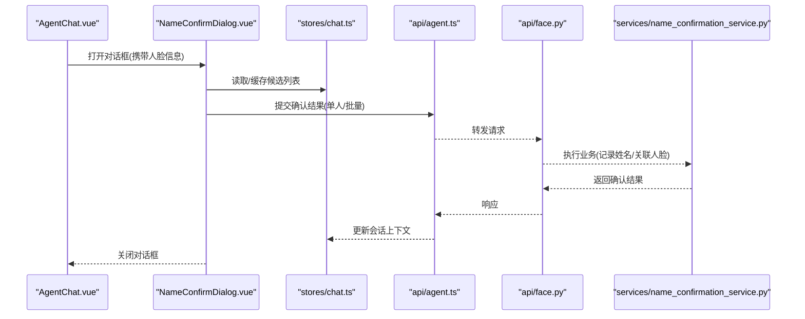
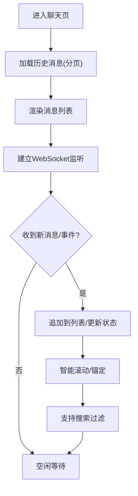
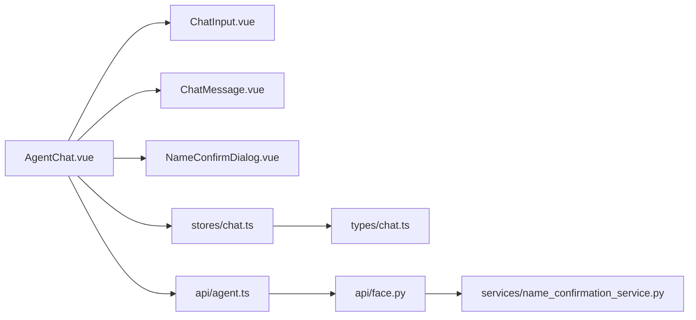

# 聊天组件集合

<cite>
**本文引用的文件**   
- [ChatInput.vue](file://frontend/src/components/chat/ChatInput.vue)
- [ChatMessage.vue](file://frontend/src/components/chat/ChatMessage.vue)
- [NameConfirmDialog.vue](file://frontend/src/components/chat/NameConfirmDialog.vue)
- [AgentChat.vue](file://frontend/src/views/AgentChat.vue)
- [chat.ts](file://frontend/src/stores/chat.ts)
- [chat.ts](file://frontend/src/types/chat.ts)
- [agent.ts](file://frontend/src/api/agent.ts)
- [name_confirmation_service.py](file://backend/app/services/name_confirmation_service.py)
- [face.py](file://backend/app/api/face.py)
</cite>

## 目录
1. [简介](#简介)
2. [项目结构](#项目结构)
3. [核心组件](#核心组件)
4. [架构总览](#架构总览)
5. [详细组件分析](#详细组件分析)
6. [依赖关系分析](#依赖关系分析)
7. [性能与体验优化](#性能与体验优化)
8. [故障排查指南](#故障排查指南)
9. [结论](#结论)
10. [附录：扩展与自定义消息类型](#附录扩展与自定义消息类型)

## 简介
本文件面向AI相册项目的聊天子系统，聚焦以下目标：
- 深入解析前端聊天输入组件 ChatInput、消息展示组件 ChatMessage、名称确认对话框 NameConfirmDialog 的职责与实现要点。
- 说明聊天界面的实时消息更新、历史消息管理、搜索过滤能力。
- 梳理与后端AI服务的连接方式（含WebSocket相关能力）、消息协议约定、错误重连机制。
- 提供扩展指南与自定义消息类型的落地建议，并给出用户体验与性能调优策略。

## 项目结构
聊天功能涉及前后端多个模块，关键位置如下：
- 前端组件层：components/chat 下的三个核心组件；视图层 AgentChat 负责组合与编排；状态层 stores/chat 管理会话与消息；API 层 api/agent 封装与后端的通信接口；类型定义 types/chat 统一数据结构。
- 后端服务层：services/name_confirmation_service 提供人脸名称确认业务逻辑；api/face 暴露相关HTTP接口。

图表来源
- [AgentChat.vue](file://frontend/src/views/AgentChat.vue)
- [ChatInput.vue](file://frontend/src/components/chat/ChatInput.vue)
- [ChatMessage.vue](file://frontend/src/components/chat/ChatMessage.vue)
- [NameConfirmDialog.vue](file://frontend/src/components/chat/NameConfirmDialog.vue)
- [chat.ts](file://frontend/src/stores/chat.ts)
- [chat.ts](file://frontend/src/types/chat.ts)
- [agent.ts](file://frontend/src/api/agent.ts)
- [face.py](file://backend/app/api/face.py)
- [name_confirmation_service.py](file://backend/app/services/name_confirmation_service.py)

章节来源
- [AgentChat.vue](file://frontend/src/views/AgentChat.vue)
- [ChatInput.vue](file://frontend/src/components/chat/ChatInput.vue)
- [ChatMessage.vue](file://frontend/src/components/chat/ChatMessage.vue)
- [NameConfirmDialog.vue](file://frontend/src/components/chat/NameConfirmDialog.vue)
- [chat.ts](file://frontend/src/stores/chat.ts)
- [chat.ts](file://frontend/src/types/chat.ts)
- [agent.ts](file://frontend/src/api/agent.ts)
- [face.py](file://backend/app/api/face.py)
- [name_confirmation_service.py](file://backend/app/services/name_confirmation_service.py)

## 核心组件
本节概述三大组件的职责边界与交互契约，便于快速定位问题与二次开发。

- ChatInput 聊天输入组件
  - 职责：文本输入、表情选择面板、快捷指令触发、发送按钮、输入校验与防抖。
  - 关键能力：支持多行输入、快捷键发送、表情插入、指令识别与提示、发送前清理空白字符。
  - 输出：将用户输入转换为标准消息对象，交由上层 store 或 API 处理。

- ChatMessage 消息组件
  - 职责：渲染单条消息气泡、显示头像与昵称、时间戳、消息状态指示器（发送中/成功/失败）。
  - 关键能力：根据消息类型切换渲染模板（文本/图片/卡片等），支持滚动锚定与高亮。
  - 输入：接收来自 store 的消息数据与操作回调（如重试、删除）。

- NameConfirmDialog 名称确认对话框
  - 职责：在检测到新人脸时弹出确认流程，支持单人确认与批量确认，以及取消操作。
  - 关键能力：预览人脸图、选择已有姓名或新建、提交确认结果至后端服务。
  - 输出：将确认结果回写至会话上下文，以便后续对话引用。

章节来源
- [ChatInput.vue](file://frontend/src/components/chat/ChatInput.vue)
- [ChatMessage.vue](file://frontend/src/components/chat/ChatMessage.vue)
- [NameConfirmDialog.vue](file://frontend/src/components/chat/NameConfirmDialog.vue)

## 架构总览
聊天子系统采用“视图-状态-服务”分层：
- 视图层：AgentChat 聚合 ChatInput、ChatMessage、NameConfirmDialog，协调用户交互。
- 状态层：stores/chat 维护消息列表、会话元信息、搜索过滤条件、连接状态。
- 服务层：api/agent 封装与后端的通信（REST/WebSocket），后端通过 services/name_confirmation_service 完成人脸确认等业务。

图表来源
- [AgentChat.vue](file://frontend/src/views/AgentChat.vue)
- [ChatInput.vue](file://frontend/src/components/chat/ChatInput.vue)
- [ChatMessage.vue](file://frontend/src/components/chat/ChatMessage.vue)
- [chat.ts](file://frontend/src/stores/chat.ts)
- [agent.ts](file://frontend/src/api/agent.ts)
- [face.py](file://backend/app/api/face.py)
- [name_confirmation_service.py](file://backend/app/services/name_confirmation_service.py)

## 详细组件分析

### ChatInput 聊天输入组件
- 输入与交互
  - 文本输入框：支持换行、自动高度、占位符提示。
  - 表情面板：点击表情图标展开，选择后将对应表情插入光标位置。
  - 快捷指令：以特定前缀触发（例如 /help、/clear 等），提供下拉提示与一键执行。
  - 发送按钮：禁用态控制（空输入或加载中），支持快捷键发送。
- 数据处理
  - 输入清洗：去除首尾空白、限制长度、敏感词拦截（可选）。
  - 指令解析：匹配前缀与参数，生成结构化指令对象。
  - 消息构造：将文本、表情、指令合并为统一消息模型，交由上层处理。
- 状态与反馈
  - 加载态：发送中禁用输入，显示进度或骨架屏。
  - 错误提示：网络异常或服务端错误时，给予友好提示与重试入口。

图表来源
- [ChatInput.vue](file://frontend/src/components/chat/ChatInput.vue)
- [chat.ts](file://frontend/src/types/chat.ts)

章节来源
- [ChatInput.vue](file://frontend/src/components/chat/ChatInput.vue)
- [chat.ts](file://frontend/src/types/chat.ts)

### ChatMessage 消息组件
- 样式与布局
  - 气泡容器：区分用户与AI侧对齐、圆角、阴影、最大宽度限制。
  - 头像与昵称：左侧显示头像，右侧显示昵称或系统标识。
  - 时间戳：消息底部或角落显示，支持相对时间格式化。
- 状态指示器
  - 发送中：旋转图标或省略号动画。
  - 成功：对勾图标。
  - 失败：感叹号图标，点击可触发重试。
- 消息类型渲染
  - 文本：支持换行与基础富文本。
  - 图片/卡片：缩略图、标题、描述、跳转链接。
  - 指令回执：命令名、参数摘要、执行结果摘要。
- 交互行为
  - 复制文本、打开大图、查看详情、重试发送、删除消息。

图表来源
- [ChatMessage.vue](file://frontend/src/components/chat/ChatMessage.vue)
- [chat.ts](file://frontend/src/stores/chat.ts)
- [chat.ts](file://frontend/src/types/chat.ts)

章节来源
- [ChatMessage.vue](file://frontend/src/components/chat/ChatMessage.vue)
- [chat.ts](file://frontend/src/stores/chat.ts)
- [chat.ts](file://frontend/src/types/chat.ts)

### NameConfirmDialog 名称确认对话框
- 使用场景
  - 当后端检测到未知人脸时，前端弹出该对话框进行命名确认。
- 操作流程
  - 预览人脸图与候选信息。
  - 选择已有姓名或创建新姓名。
  - 支持批量确认（一次选择多个候选）。
  - 提交确认后关闭对话框，并将结果写入会话上下文。
- 取消与容错
  - 支持取消操作，不改变任何状态。
  - 网络异常时保留已选内容并提供重试。

图表来源
- [NameConfirmDialog.vue](file://frontend/src/components/chat/NameConfirmDialog.vue)
- [chat.ts](file://frontend/src/stores/chat.ts)
- [agent.ts](file://frontend/src/api/agent.ts)
- [face.py](file://backend/app/api/face.py)
- [name_confirmation_service.py](file://backend/app/services/name_confirmation_service.py)

章节来源
- [NameConfirmDialog.vue](file://frontend/src/components/chat/NameConfirmDialog.vue)
- [chat.ts](file://frontend/src/stores/chat.ts)
- [agent.ts](file://frontend/src/api/agent.ts)
- [face.py](file://backend/app/api/face.py)
- [name_confirmation_service.py](file://backend/app/services/name_confirmation_service.py)

### 聊天界面：实时更新、历史记录与搜索过滤
- 实时更新
  - 基于 WebSocket 的事件驱动更新：服务端推送新消息、状态变更、人脸确认提示等。
  - 客户端监听事件，增量更新消息列表，保持滚动位置与焦点合理。
- 历史记录
  - 首次进入加载最近N条消息，支持下拉加载更多。
  - 分页游标与去重策略，避免重复渲染。
- 搜索过滤
  - 按关键词、消息类型、时间范围筛选。
  - 前端缓存索引，提升检索性能。

图表来源
- [AgentChat.vue](file://frontend/src/views/AgentChat.vue)
- [chat.ts](file://frontend/src/stores/chat.ts)
- [agent.ts](file://frontend/src/api/agent.ts)

章节来源
- [AgentChat.vue](file://frontend/src/views/AgentChat.vue)
- [chat.ts](file://frontend/src/stores/chat.ts)
- [agent.ts](file://frontend/src/api/agent.ts)

## 依赖关系分析
- 组件耦合
  - AgentChat 作为编排者，依赖 ChatInput、ChatMessage、NameConfirmDialog 的对外接口。
  - ChatMessage 仅依赖消息数据与 store 的状态更新方法，低耦合易替换。
- 外部依赖
  - api/agent 封装 HTTP/WebSocket 调用，屏蔽底层细节。
  - 后端 face 接口与 name_confirmation_service 解耦，便于独立测试与扩展。

图表来源
- [AgentChat.vue](file://frontend/src/views/AgentChat.vue)
- [ChatInput.vue](file://frontend/src/components/chat/ChatInput.vue)
- [ChatMessage.vue](file://frontend/src/components/chat/ChatMessage.vue)
- [NameConfirmDialog.vue](file://frontend/src/components/chat/NameConfirmDialog.vue)
- [chat.ts](file://frontend/src/stores/chat.ts)
- [chat.ts](file://frontend/src/types/chat.ts)
- [agent.ts](file://frontend/src/api/agent.ts)
- [face.py](file://backend/app/api/face.py)
- [name_confirmation_service.py](file://backend/app/services/name_confirmation_service.py)

章节来源
- [AgentChat.vue](file://frontend/src/views/AgentChat.vue)
- [ChatInput.vue](file://frontend/src/components/chat/ChatInput.vue)
- [ChatMessage.vue](file://frontend/src/components/chat/ChatMessage.vue)
- [NameConfirmDialog.vue](file://frontend/src/components/chat/NameConfirmDialog.vue)
- [chat.ts](file://frontend/src/stores/chat.ts)
- [chat.ts](file://frontend/src/types/chat.ts)
- [agent.ts](file://frontend/src/api/agent.ts)
- [face.py](file://backend/app/api/face.py)
- [name_confirmation_service.py](file://backend/app/services/name_confirmation_service.py)

## 性能与体验优化
- 渲染性能
  - 虚拟列表：长列表使用虚拟滚动，减少DOM节点数量。
  - 消息分片：大消息体延迟渲染，先占位后填充。
  - 图片懒加载：按需加载缩略图，点击再加载原图。
- 网络与连接
  - WebSocket 心跳保活与指数退避重连，避免雪崩。
  - 断线提示与手动重连入口，提升可用性。
- 交互体验
  - 输入防抖与节流，减少无效请求。
  - 键盘快捷键与无障碍支持，提高操作效率。
  - 错误提示明确且可恢复，提供重试与反馈渠道。

[本节为通用指导，无需源码引用]

## 故障排查指南
- 常见问题
  - 消息未送达：检查网络连接、WebSocket状态、后端日志。
  - 表情/指令不生效：核对输入解析逻辑与指令前缀配置。
  - 人脸确认无响应：查看后端接口返回与业务服务日志。
- 调试建议
  - 前端：开启网络面板与状态打印，观察消息生命周期。
  - 后端：增加请求追踪ID，串联前后端日志。
  - 重连策略：记录重连次数与间隔，定位不稳定因素。

章节来源
- [chat.ts](file://frontend/src/stores/chat.ts)
- [agent.ts](file://frontend/src/api/agent.ts)
- [face.py](file://backend/app/api/face.py)
- [name_confirmation_service.py](file://backend/app/services/name_confirmation_service.py)

## 结论
本聊天组件集合围绕输入、展示、确认三大核心场景，结合状态管理与后端服务，形成完整的AI对话闭环。通过清晰的职责划分与可扩展的数据模型，既能满足当前需求，也为未来新增消息类型与交互模式预留空间。配合性能优化与用户体验改进，可在大规模使用中保持稳定与流畅。

[本节为总结性内容，无需源码引用]

## 附录：扩展与自定义消息类型
- 扩展步骤
  - 在类型定义中新增消息类型枚举与字段。
  - 在 ChatMessage 中注册新类型的渲染模板与交互逻辑。
  - 在 ChatInput 中支持新类型的输入入口（如文件上传、卡片选择）。
  - 在后端新增对应的处理分支与返回格式。
- 示例路径参考
  - 类型定义：[chat.ts](file://frontend/src/types/chat.ts)
  - 消息渲染：[ChatMessage.vue](file://frontend/src/components/chat/ChatMessage.vue)
  - 输入扩展：[ChatInput.vue](file://frontend/src/components/chat/ChatInput.vue)
  - 后端对接：[agent.ts](file://frontend/src/api/agent.ts)、[face.py](file://backend/app/api/face.py)、[name_confirmation_service.py](file://backend/app/services/name_confirmation_service.py)

章节来源
- [chat.ts](file://frontend/src/types/chat.ts)
- [ChatMessage.vue](file://frontend/src/components/chat/ChatMessage.vue)
- [ChatInput.vue](file://frontend/src/components/chat/ChatInput.vue)
- [agent.ts](file://frontend/src/api/agent.ts)
- [face.py](file://backend/app/api/face.py)
- [name_confirmation_service.py](file://backend/app/services/name_confirmation_service.py)