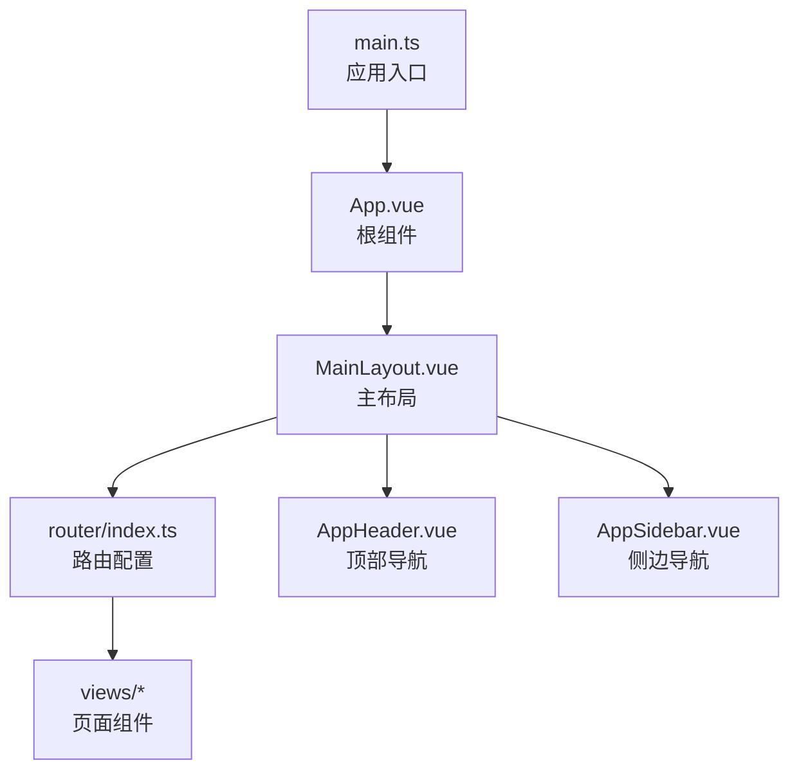
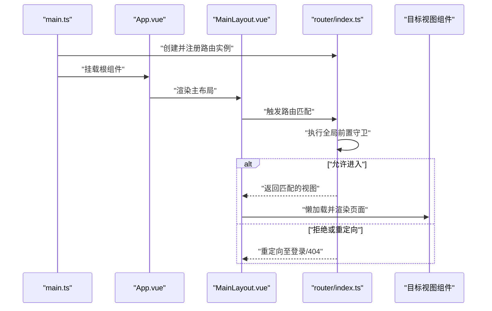
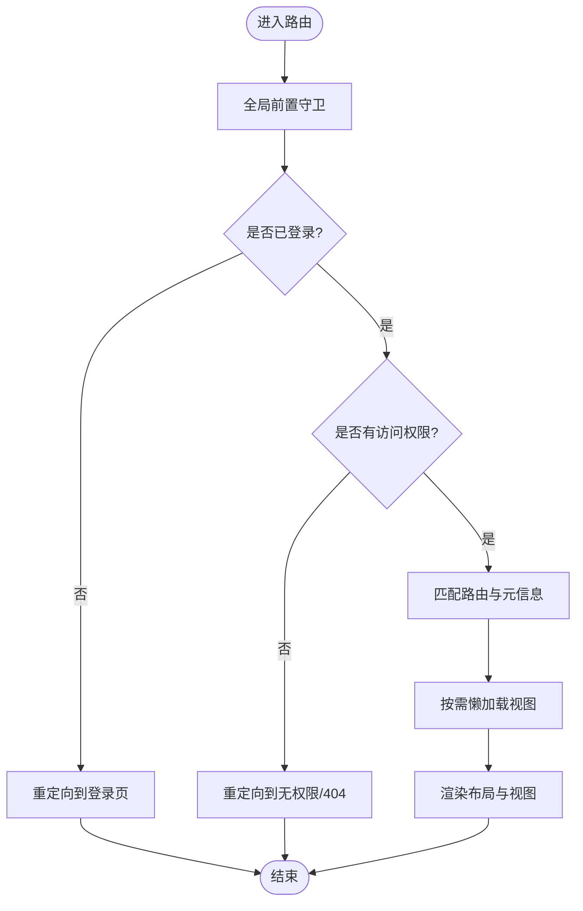
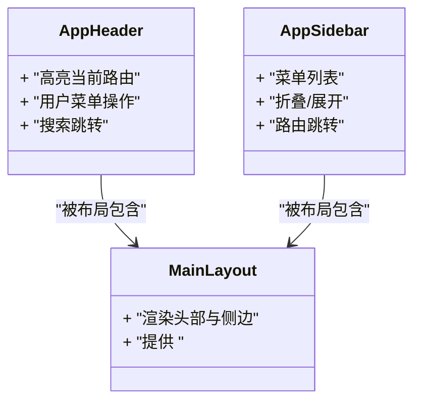
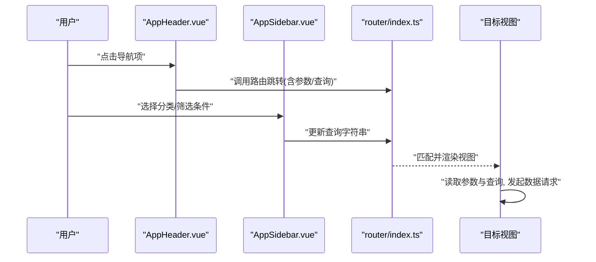
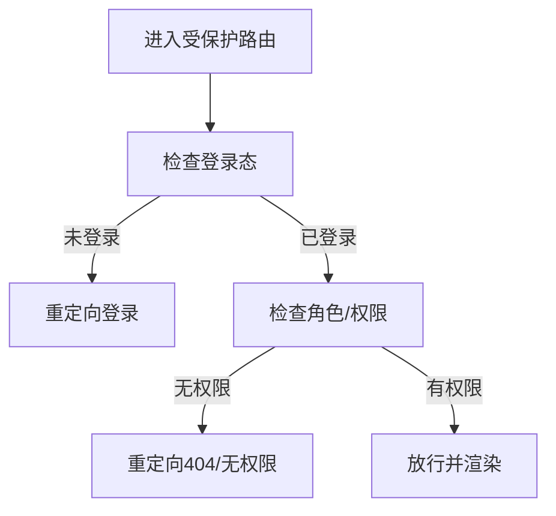
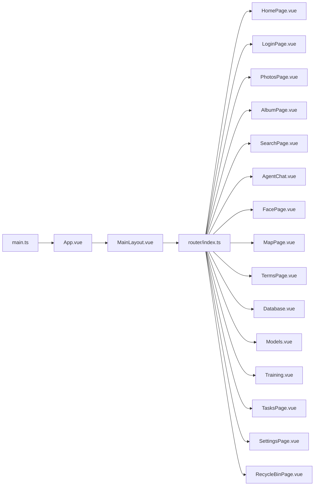

# 路由与导航

<cite>
**本文引用的文件**   
- [frontend/src/router/index.ts](file://frontend/src/router/index.ts)
- [frontend/src/main.ts](file://frontend/src/main.ts)
- [frontend/src/App.vue](file://frontend/src/App.vue)
- [frontend/src/layouts/MainLayout.vue](file://frontend/src/layouts/MainLayout.vue)
- [frontend/src/components/layout/AppHeader.vue](file://frontend/src/components/layout/AppHeader.vue)
- [frontend/src/components/layout/AppSidebar.vue](file://frontend/src/components/layout/AppSidebar.vue)
- [frontend/src/views/HomePage.vue](file://frontend/src/views/HomePage.vue)
- [frontend/src/views/LoginPage.vue](file://frontend/src/views/LoginPage.vue)
- [frontend/src/views/NotFound.vue](file://frontend/src/views/NotFound.vue)
- [frontend/src/views/PhotosPage.vue](file://frontend/src/views/PhotosPage.vue)
- [frontend/src/views/AlbumPage.vue](file://frontend/src/views/AlbumPage.vue)
- [frontend/src/views/SearchPage.vue](file://frontend/src/views/SearchPage.vue)
- [frontend/src/views/AgentChat.vue](file://frontend/src/views/AgentChat.vue)
- [frontend/src/views/FacePage.vue](file://frontend/src/views/FacePage.vue)
- [frontend/src/views/MapPage.vue](file://frontend/src/views/MapPage.vue)
- [frontend/src/views/TermsPage.vue](file://frontend/src/views/TermsPage.vue)
- [frontend/src/views/Database.vue](file://frontend/src/views/Database.vue)
- [frontend/src/views/Models.vue](file://frontend/src/views/Models.vue)
- [frontend/src/views/Training.vue](file://frontend/src/views/Training.vue)
- [frontend/src/views/TasksPage.vue](file://frontend/src/views/TasksPage.vue)
- [frontend/src/views/SettingsPage.vue](file://frontend/src/views/SettingsPage.vue)
- [frontend/src/views/RecycleBinPage.vue](file://frontend/src/views/RecycleBinPage.vue)
</cite>

## 目录
1. [简介](#简介)
2. [项目结构](#项目结构)
3. [核心组件](#核心组件)
4. [架构总览](#架构总览)
5. [详细组件分析](#详细组件分析)
6. [依赖分析](#依赖分析)
7. [性能考虑](#性能考虑)
8. [故障排查指南](#故障排查指南)
9. [结论](#结论)
10. [附录](#附录)

## 简介
本文件聚焦于前端的路由与导航系统，围绕 Vue Router 的配置、页面级组件组织、导航栏与面包屑实现、动态路由加载与懒加载优化、参数与查询字符串处理、权限控制、404 页面以及 SEO 策略展开。目标是帮助开发者构建流畅、可维护且可扩展的导航体验。

## 项目结构
前端采用基于功能域的组织方式：
- router：集中式路由配置与守卫逻辑
- views：页面级组件（每个路由对应一个视图）
- layouts：布局容器（如主布局）
- components/layout：通用导航组件（头部、侧边栏等）
- stores：状态管理（用户态、主题、布局等）
- api：接口封装
- utils：工具函数

图表来源
- [frontend/src/main.ts](file://frontend/src/main.ts)
- [frontend/src/App.vue](file://frontend/src/App.vue)
- [frontend/src/layouts/MainLayout.vue](file://frontend/src/layouts/MainLayout.vue)
- [frontend/src/router/index.ts](file://frontend/src/router/index.ts)

章节来源
- [frontend/src/main.ts](file://frontend/src/main.ts)
- [frontend/src/App.vue](file://frontend/src/App.vue)
- [frontend/src/layouts/MainLayout.vue](file://frontend/src/layouts/MainLayout.vue)
- [frontend/src/router/index.ts](file://frontend/src/router/index.ts)

## 核心组件
- 路由配置中心：负责定义静态路由、嵌套路由、懒加载、全局前置守卫、元信息（meta）与 404 兜底。
- 布局容器：提供 <router-view> 渲染出口，承载导航区域与内容区。
- 导航组件：顶部导航与侧边栏，结合路由元信息与当前路径高亮，支持跳转与面包屑生成。
- 页面组件：按业务划分，按需懒加载，减少首屏体积。

章节来源
- [frontend/src/router/index.ts](file://frontend/src/router/index.ts)
- [frontend/src/layouts/MainLayout.vue](file://frontend/src/layouts/MainLayout.vue)
- [frontend/src/components/layout/AppHeader.vue](file://frontend/src/components/layout/AppHeader.vue)
- [frontend/src/components/layout/AppSidebar.vue](file://frontend/src/components/layout/AppSidebar.vue)

## 架构总览
下图展示从应用启动到页面渲染的关键流程，包括路由初始化、守卫拦截、布局渲染与视图挂载。

图表来源
- [frontend/src/main.ts](file://frontend/src/main.ts)
- [frontend/src/App.vue](file://frontend/src/App.vue)
- [frontend/src/layouts/MainLayout.vue](file://frontend/src/layouts/MainLayout.vue)
- [frontend/src/router/index.ts](file://frontend/src/router/index.ts)

## 详细组件分析

### 路由配置与守卫
- 路由表组织：将常用页面以模块化的方式声明，使用懒加载语法引入视图，降低首屏资源。
- 嵌套路由：在布局内通过 children 定义子路由，便于共享布局与侧边菜单。
- 全局前置守卫：在路由切换前进行鉴权、登录态校验、角色检查与必要的数据预取；未授权时重定向至登录页或无权限提示页。
- 元信息 meta：为每个路由附加标题、是否需要登录、所需角色、面包屑层级等，供导航与守卫消费。
- 404 兜底：将通配符路由置于末尾，指向 NotFound 组件。

图表来源
- [frontend/src/router/index.ts](file://frontend/src/router/index.ts)

章节来源
- [frontend/src/router/index.ts](file://frontend/src/router/index.ts)

### 页面级组件与懒加载
- 页面组件位于 views 目录，每个路由对应一个页面，职责单一，便于测试与维护。
- 懒加载示例：通过异步导入方式引入页面组件，仅在路由激活时加载，显著减少初始包体。
- 命名建议：文件名与路由名保持一致，提升可读性与调试效率。

章节来源
- [frontend/src/views/HomePage.vue](file://frontend/src/views/HomePage.vue)
- [frontend/src/views/LoginPage.vue](file://frontend/src/views/LoginPage.vue)
- [frontend/src/views/PhotosPage.vue](file://frontend/src/views/PhotosPage.vue)
- [frontend/src/views/AlbumPage.vue](file://frontend/src/views/AlbumPage.vue)
- [frontend/src/views/SearchPage.vue](file://frontend/src/views/SearchPage.vue)
- [frontend/src/views/AgentChat.vue](file://frontend/src/views/AgentChat.vue)
- [frontend/src/views/FacePage.vue](file://frontend/src/views/FacePage.vue)
- [frontend/src/views/MapPage.vue](file://frontend/src/views/MapPage.vue)
- [frontend/src/views/TermsPage.vue](file://frontend/src/views/TermsPage.vue)
- [frontend/src/views/Database.vue](file://frontend/src/views/Database.vue)
- [frontend/src/views/Models.vue](file://frontend/src/views/Models.vue)
- [frontend/src/views/Training.vue](file://frontend/src/views/Training.vue)
- [frontend/src/views/TasksPage.vue](file://frontend/src/views/TasksPage.vue)
- [frontend/src/views/SettingsPage.vue](file://frontend/src/views/SettingsPage.vue)
- [frontend/src/views/RecycleBinPage.vue](file://frontend/src/views/RecycleBinPage.vue)

### 导航栏与面包屑
- 顶部导航（AppHeader）：包含站点名称、搜索入口、用户头像与下拉菜单；根据当前路由高亮“首页”、“相册”等入口。
- 侧边导航（AppSidebar）：列出主要功能模块，支持折叠与展开；结合路由元信息显示图标与分组。
- 面包屑：基于路由层级与 meta.title 自动生成，点击可回退到上级页面。

图表来源
- [frontend/src/components/layout/AppHeader.vue](file://frontend/src/components/layout/AppHeader.vue)
- [frontend/src/components/layout/AppSidebar.vue](file://frontend/src/components/layout/AppSidebar.vue)
- [frontend/src/layouts/MainLayout.vue](file://frontend/src/layouts/MainLayout.vue)

章节来源
- [frontend/src/components/layout/AppHeader.vue](file://frontend/src/components/layout/AppHeader.vue)
- [frontend/src/components/layout/AppSidebar.vue](file://frontend/src/components/layout/AppSidebar.vue)
- [frontend/src/layouts/MainLayout.vue](file://frontend/src/layouts/MainLayout.vue)

### 路由参数与查询字符串
- 路径参数：用于标识具体资源（如相册 ID、照片 ID），在视图中通过路由对象读取。
- 查询字符串：用于筛选与分页（如关键词、排序、页码），在视图中监听变化并刷新数据。
- 编程式导航：在组件中通过路由实例进行跳转，携带参数与查询项。

图表来源
- [frontend/src/components/layout/AppHeader.vue](file://frontend/src/components/layout/AppHeader.vue)
- [frontend/src/components/layout/AppSidebar.vue](file://frontend/src/components/layout/AppSidebar.vue)
- [frontend/src/router/index.ts](file://frontend/src/router/index.ts)

章节来源
- [frontend/src/components/layout/AppHeader.vue](file://frontend/src/components/layout/AppHeader.vue)
- [frontend/src/components/layout/AppSidebar.vue](file://frontend/src/components/layout/AppSidebar.vue)
- [frontend/src/router/index.ts](file://frontend/src/router/index.ts)

### 权限控制路由
- 基于全局前置守卫实现：
  - 未登录访问受保护路由时，重定向至登录页，并在登录后返回原地址。
  - 已登录但角色不足时，重定向至无权限提示或 404。
- 路由元信息 meta 中声明 requiredRole 与 requiresAuth，守卫据此判断放行或拦截。
- 可选扩展：结合后端接口获取用户权限集合，动态过滤侧边菜单与按钮。

图表来源
- [frontend/src/router/index.ts](file://frontend/src/router/index.ts)

章节来源
- [frontend/src/router/index.ts](file://frontend/src/router/index.ts)

### 404 页面处理
- 通配符路由放在路由表末尾，避免误匹配。
- 自定义 404 组件提供返回首页、最近访问记录与搜索入口，提升用户体验。
- 可在守卫中对无效路径做统一日志上报。

章节来源
- [frontend/src/router/index.ts](file://frontend/src/router/index.ts)
- [frontend/src/views/NotFound.vue](file://frontend/src/views/NotFound.vue)

### SEO 优化策略
- 为关键页面设置 meta.title、description 与 canonical URL，利于搜索引擎收录。
- 对图片与媒体类页面，提供结构化数据（如 JSON-LD）以提升富摘要效果。
- 若需要服务端渲染或预渲染，可结合 SSR/SSG 方案进一步提升 SEO。

[本节为通用指导，不直接分析具体文件]

## 依赖分析
- main.ts 负责创建应用实例并挂载路由。
- App.vue 作为根组件，通常仅承载布局或全局样式。
- MainLayout.vue 组合头部、侧边与内容区，并通过 <router-view> 渲染页面。
- router/index.ts 集中管理所有路由与守卫逻辑。
- 各视图组件按需懒加载，减少初始包体。

图表来源
- [frontend/src/main.ts](file://frontend/src/main.ts)
- [frontend/src/App.vue](file://frontend/src/App.vue)
- [frontend/src/layouts/MainLayout.vue](file://frontend/src/layouts/MainLayout.vue)
- [frontend/src/router/index.ts](file://frontend/src/router/index.ts)
- [frontend/src/views/HomePage.vue](file://frontend/src/views/HomePage.vue)
- [frontend/src/views/LoginPage.vue](file://frontend/src/views/LoginPage.vue)
- [frontend/src/views/PhotosPage.vue](file://frontend/src/views/PhotosPage.vue)
- [frontend/src/views/AlbumPage.vue](file://frontend/src/views/AlbumPage.vue)
- [frontend/src/views/SearchPage.vue](file://frontend/src/views/SearchPage.vue)
- [frontend/src/views/AgentChat.vue](file://frontend/src/views/AgentChat.vue)
- [frontend/src/views/FacePage.vue](file://frontend/src/views/FacePage.vue)
- [frontend/src/views/MapPage.vue](file://frontend/src/views/MapPage.vue)
- [frontend/src/views/TermsPage.vue](file://frontend/src/views/TermsPage.vue)
- [frontend/src/views/Database.vue](file://frontend/src/views/Database.vue)
- [frontend/src/views/Models.vue](file://frontend/src/views/Models.vue)
- [frontend/src/views/Training.vue](file://frontend/src/views/Training.vue)
- [frontend/src/views/TasksPage.vue](file://frontend/src/views/TasksPage.vue)
- [frontend/src/views/SettingsPage.vue](file://frontend/src/views/SettingsPage.vue)
- [frontend/src/views/RecycleBinPage.vue](file://frontend/src/views/RecycleBinPage.vue)

章节来源
- [frontend/src/main.ts](file://frontend/src/main.ts)
- [frontend/src/App.vue](file://frontend/src/App.vue)
- [frontend/src/layouts/MainLayout.vue](file://frontend/src/layouts/MainLayout.vue)
- [frontend/src/router/index.ts](file://frontend/src/router/index.ts)

## 性能考虑
- 路由懒加载：对大体积页面使用异步导入，仅在访问时加载。
- 路由分块：利用打包工具的代码分割能力，将公共逻辑提取为独立 chunk。
- 预加载策略：对高频访问页面使用预加载指令，缩短二次访问延迟。
- 导航节流：在快速连续跳转时进行防抖/节流，避免重复请求与闪烁。
- 缓存策略：对不变或低频变化的页面数据使用缓存，减少网络开销。

[本节为通用指导，不直接分析具体文件]

## 故障排查指南
- 路由无法匹配：检查路由顺序与通配符位置，确保 404 路由在最后。
- 守卫死循环：避免在守卫中无条件重定向到自身，需加入退出条件。
- 参数丢失：确认路径参数与查询字符串的命名一致，且在跳转时正确传递。
- 面包屑异常：核对路由 meta.title 与层级关系，确保父路由存在。
- 权限误判：检查用户态与角色数据是否正确加载，必要时增加日志输出。

章节来源
- [frontend/src/router/index.ts](file://frontend/src/router/index.ts)
- [frontend/src/views/NotFound.vue](file://frontend/src/views/NotFound.vue)

## 结论
通过将路由配置、守卫、布局与导航组件解耦，并结合懒加载与元信息驱动，本项目实现了清晰、可扩展且高性能的导航体系。建议在后续迭代中持续完善权限模型、SEO 增强与可观测性指标，以获得更佳的开发与用户体验。

## 附录

### 路由配置示例（要点清单）
- 定义基础路由与嵌套路由，使用懒加载引入视图。
- 为受保护路由添加 requiresAuth 与 requiredRole 元信息。
- 在路由表末尾添加通配符路由指向 404 页面。
- 在全局前置守卫中实现登录态与角色校验，并进行必要的重定向。

章节来源
- [frontend/src/router/index.ts](file://frontend/src/router/index.ts)

### 导航组件开发指南
- 顶部导航：
  - 根据当前路由高亮活跃项。
  - 提供用户菜单（登录/登出、个人中心）。
  - 集成搜索框，支持跳转到搜索结果页。
- 侧边导航：
  - 基于路由元信息渲染菜单树，支持分组与折叠。
  - 根据权限动态隐藏不可见菜单项。
- 面包屑：
  - 自动解析路由层级与 meta.title。
  - 支持点击回退与自定义分隔符。

章节来源
- [frontend/src/components/layout/AppHeader.vue](file://frontend/src/components/layout/AppHeader.vue)
- [frontend/src/components/layout/AppSidebar.vue](file://frontend/src/components/layout/AppSidebar.vue)
- [frontend/src/layouts/MainLayout.vue](file://frontend/src/layouts/MainLayout.vue)