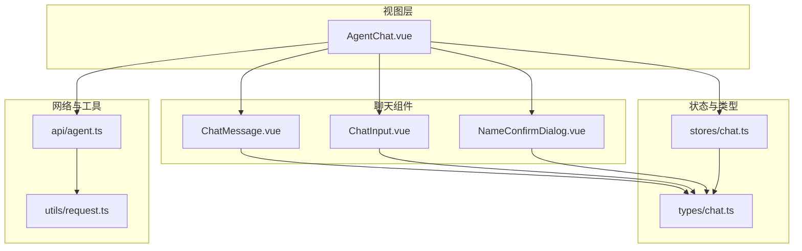
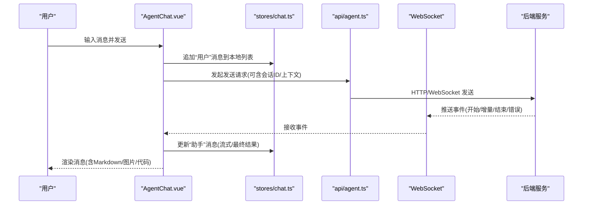
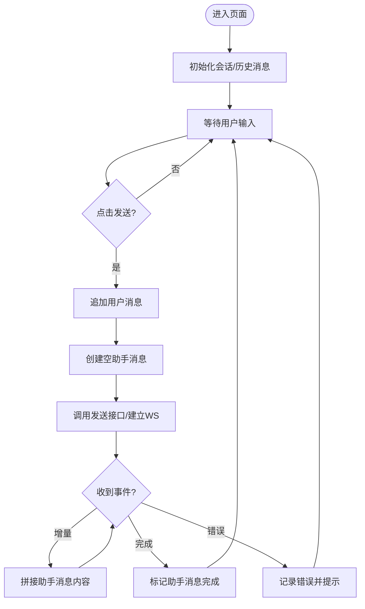
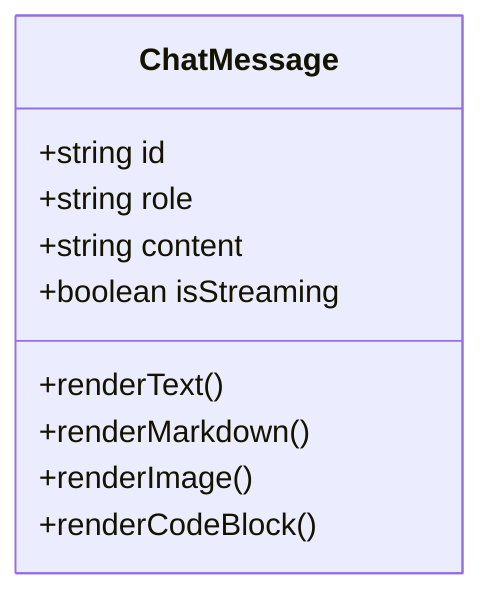
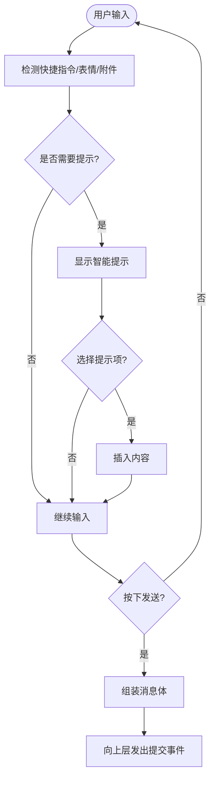
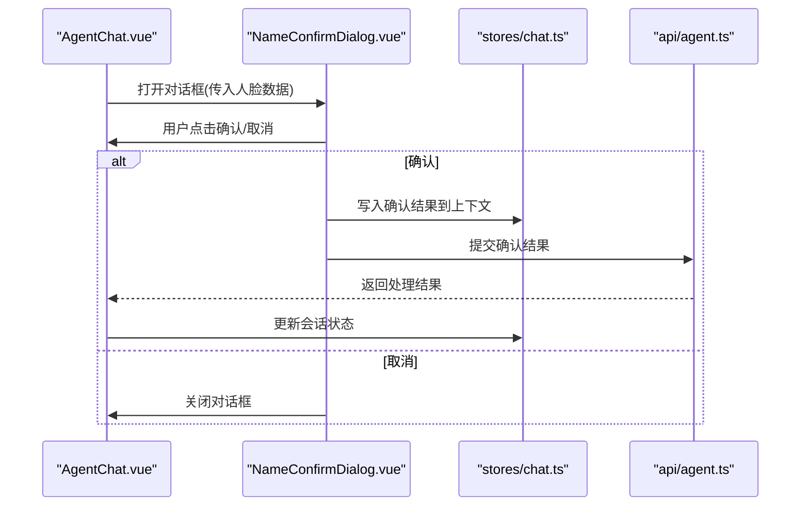
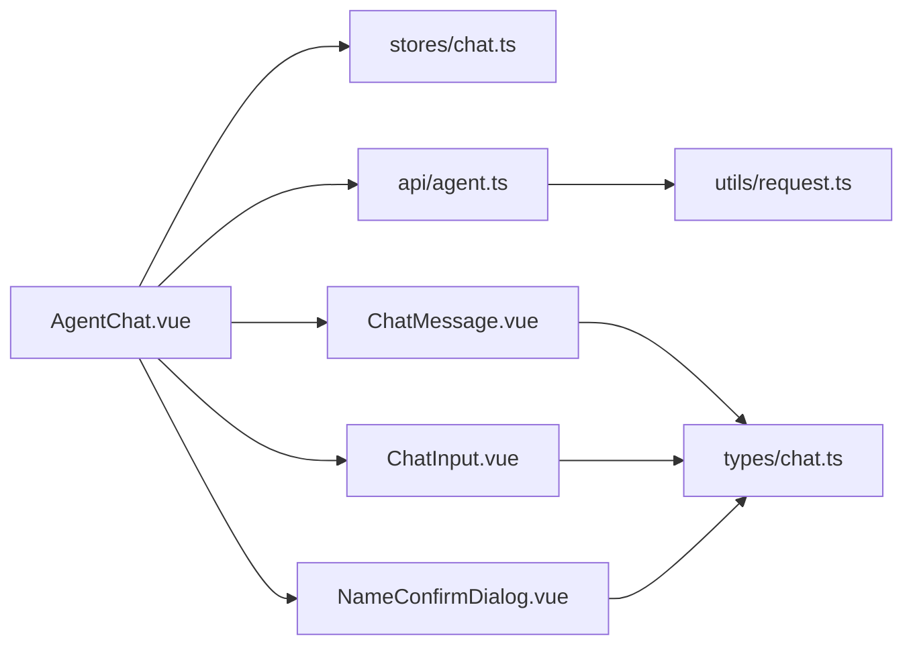

# AI聊天界面

<cite>
**本文引用的文件**   
- [AgentChat.vue](file://frontend/src/views/AgentChat.vue)
- [ChatMessage.vue](file://frontend/src/components/chat/ChatMessage.vue)
- [ChatInput.vue](file://frontend/src/components/chat/ChatInput.vue)
- [NameConfirmDialog.vue](file://frontend/src/components/chat/NameConfirmDialog.vue)
- [chat.ts（状态管理）](file://frontend/src/stores/chat.ts)
- [agent.ts（API 调用）](file://frontend/src/api/agent.ts)
- [chat.ts（类型定义）](file://frontend/src/types/chat.ts)
- [request.ts（请求封装）](file://frontend/src/utils/request.ts)
</cite>

## 目录
1. [简介](#简介)
2. [项目结构](#项目结构)
3. [核心组件](#核心组件)
4. [架构总览](#架构总览)
5. [详细组件分析](#详细组件分析)
6. [依赖关系分析](#依赖关系分析)
7. [性能与体验优化](#性能与体验优化)
8. [故障排查指南](#故障排查指南)
9. [结论](#结论)
10. [附录](#附录)

## 简介
本文件面向AI聊天界面的前端实现，聚焦多Agent协作的对话界面。文档围绕以下目标展开：
- AgentChat.vue 的多Agent协作界面：消息流处理、对话状态管理、上下文保持
- ChatMessage 消息组件：消息渲染、Markdown支持、图片嵌入、代码高亮
- ChatInput 输入组件：智能提示、快捷指令、表情符号支持
- NameConfirmDialog 人脸确认对话框：用户交互流程
- WebSocket实时通信、消息持久化、会话管理、错误恢复机制
- 聊天体验优化与性能调优方案

## 项目结构
前端采用Vue 3 + TypeScript组织，聊天相关代码集中在 views 与 components/chat 下，并通过 stores/chat.ts 进行全局状态管理，api/agent.ts 负责与后端服务交互，types/chat.ts 提供统一的数据类型定义。

图表来源
- [AgentChat.vue](file://frontend/src/views/AgentChat.vue)
- [ChatMessage.vue](file://frontend/src/components/chat/ChatMessage.vue)
- [ChatInput.vue](file://frontend/src/components/chat/ChatInput.vue)
- [NameConfirmDialog.vue](file://frontend/src/components/chat/NameConfirmDialog.vue)
- [chat.ts（状态管理）](file://frontend/src/stores/chat.ts)
- [agent.ts（API 调用）](file://frontend/src/api/agent.ts)
- [chat.ts（类型定义）](file://frontend/src/types/chat.ts)
- [request.ts（请求封装）](file://frontend/src/utils/request.ts)

章节来源
- [AgentChat.vue](file://frontend/src/views/AgentChat.vue)
- [chat.ts（状态管理）](file://frontend/src/stores/chat.ts)
- [agent.ts（API 调用）](file://frontend/src/api/agent.ts)
- [chat.ts（类型定义）](file://frontend/src/types/chat.ts)
- [request.ts（请求封装）](file://frontend/src/utils/request.ts)

## 核心组件
- AgentChat.vue：承载多Agent协作的主页面，负责消息列表展示、输入控制、WebSocket连接与会话上下文维护。
- ChatMessage.vue：单条消息渲染，支持文本、Markdown、图片、代码块等富内容展示。
- ChatInput.vue：输入框组件，提供智能提示、快捷指令、表情符号选择等功能。
- NameConfirmDialog.vue：人脸确认对话框，用于在需要时引导用户完成身份确认。
- stores/chat.ts：集中管理聊天状态（消息列表、当前会话、加载态、错误信息等）。
- api/agent.ts：封装与后端的HTTP/WebSocket交互，包括发送消息、获取历史、订阅事件等。
- types/chat.ts：定义消息、会话、Agent角色、事件等数据结构。
- utils/request.ts：统一的请求封装，包含鉴权、重试、错误转换等。

章节来源
- [AgentChat.vue](file://frontend/src/views/AgentChat.vue)
- [ChatMessage.vue](file://frontend/src/components/chat/ChatMessage.vue)
- [ChatInput.vue](file://frontend/src/components/chat/ChatInput.vue)
- [NameConfirmDialog.vue](file://frontend/src/components/chat/NameConfirmDialog.vue)
- [chat.ts（状态管理）](file://frontend/src/stores/chat.ts)
- [agent.ts（API 调用）](file://frontend/src/api/agent.ts)
- [chat.ts（类型定义）](file://frontend/src/types/chat.ts)
- [request.ts（请求封装）](file://frontend/src/utils/request.ts)

## 架构总览
下图展示了从用户输入到多Agent协作、再到消息渲染的整体流程，涵盖WebSocket实时通信与本地状态同步。

图表来源
- [AgentChat.vue](file://frontend/src/views/AgentChat.vue)
- [chat.ts（状态管理）](file://frontend/src/stores/chat.ts)
- [agent.ts（API 调用）](file://frontend/src/api/agent.ts)

## 详细组件分析

### AgentChat.vue 多Agent协作界面
职责与要点
- 消息流处理：将用户消息加入本地列表，创建占位“助手”消息，按事件流逐步更新内容，直至最终完成。
- 对话状态管理：通过 stores/chat.ts 维护消息数组、当前会话ID、加载态、错误信息、是否正在生成等。
- 上下文保持：为每条消息携带必要的上下文标识（如会话ID、时间戳、Agent角色），确保后续请求能正确续接上下文。
- WebSocket集成：建立长连接，监听服务端推送的事件，区分不同Agent返回的消息片段，合并至对应消息节点。
- 错误恢复：在网络异常或断连时自动重连，失败时回滚临时消息并提示用户；对部分失败的子任务进行重试或降级。

关键流程（简化）
- 初始化：根据路由参数或本地存储恢复会话ID，拉取历史消息，重建UI状态。
- 发送消息：校验输入，追加用户消息，创建空助手消息，触发发送逻辑。
- 流式更新：收到增量事件则拼接文本；收到完成事件则标记完成；收到错误事件则记录错误并提示。
- 清理与切换：切换会话时清空或迁移上下文，避免跨会话污染。

图表来源
- [AgentChat.vue](file://frontend/src/views/AgentChat.vue)
- [chat.ts（状态管理）](file://frontend/src/stores/chat.ts)
- [agent.ts（API 调用）](file://frontend/src/api/agent.ts)

章节来源
- [AgentChat.vue](file://frontend/src/views/AgentChat.vue)
- [chat.ts（状态管理）](file://frontend/src/stores/chat.ts)
- [agent.ts（API 调用）](file://frontend/src/api/agent.ts)

### ChatMessage 消息组件
功能特性
- 消息渲染：根据消息类型（文本、系统、图片、卡片等）渲染不同布局。
- Markdown支持：解析Markdown语法，安全地渲染标题、列表、链接、表格等。
- 图片嵌入：支持内联图片预览、懒加载、缩放查看。
- 代码高亮：识别代码块语言，启用语法高亮与复制按钮。
- 交互能力：长按复制、点击链接在新窗口打开、图片全屏查看。

渲染策略
- 文本优先：纯文本直接显示，避免不必要的DOM开销。
- 安全渲染：对HTML内容进行白名单过滤，防止XSS。
- 按需加载：图片和代码块仅在可见区域内加载，减少首屏压力。

图表来源
- [ChatMessage.vue](file://frontend/src/components/chat/ChatMessage.vue)
- [chat.ts（类型定义）](file://frontend/src/types/chat.ts)

章节来源
- [ChatMessage.vue](file://frontend/src/components/chat/ChatMessage.vue)
- [chat.ts（类型定义）](file://frontend/src/types/chat.ts)

### ChatInput 输入组件
功能特性
- 智能提示：基于已输入文本的前缀匹配，提供候选项建议（如命令、常用短语）。
- 快捷指令：支持以特定前缀触发的快捷命令（例如 /help、/clear、/history）。
- 表情符号：内置表情面板，快速插入表情字符。
- 多行输入：支持换行提交与Shift+Enter插入换行。
- 附件上传：可选拖拽或选择图片/文件，附带到消息中。

交互流程
- 输入监听：捕获键盘事件与粘贴行为，触发提示与校验。
- 指令解析：识别快捷指令，执行相应动作（如清空历史、切换Agent）。
- 提交处理：组装消息体（含上下文、附件、指令参数），交由上层发送。

图表来源
- [ChatInput.vue](file://frontend/src/components/chat/ChatInput.vue)
- [chat.ts（类型定义）](file://frontend/src/types/chat.ts)

章节来源
- [ChatInput.vue](file://frontend/src/components/chat/ChatInput.vue)
- [chat.ts（类型定义）](file://frontend/src/types/chat.ts)

### NameConfirmDialog 人脸确认对话框
交互流程
- 触发条件：当后端判定需要人脸确认时，由AgentChat.vue弹出对话框。
- 展示信息：显示待确认的人脸图像、提示信息与操作按钮。
- 用户操作：确认后提交人脸确认结果；取消则关闭对话框并允许重试。
- 结果反馈：将确认结果写入当前会话上下文，供后续Agent使用。

图表来源
- [NameConfirmDialog.vue](file://frontend/src/components/chat/NameConfirmDialog.vue)
- [AgentChat.vue](file://frontend/src/views/AgentChat.vue)
- [chat.ts（状态管理）](file://frontend/src/stores/chat.ts)
- [agent.ts（API 调用）](file://frontend/src/api/agent.ts)

章节来源
- [NameConfirmDialog.vue](file://frontend/src/components/chat/NameConfirmDialog.vue)
- [AgentChat.vue](file://frontend/src/views/AgentChat.vue)
- [chat.ts（状态管理）](file://frontend/src/stores/chat.ts)
- [agent.ts（API 调用）](file://frontend/src/api/agent.ts)

## 依赖关系分析
- 组件耦合
  - AgentChat.vue 强依赖 stores/chat.ts 与 api/agent.ts，弱依赖 ChatMessage.vue、ChatInput.vue、NameConfirmDialog.vue。
  - ChatMessage.vue 仅依赖 types/chat.ts 进行类型校验与渲染分支判断。
  - ChatInput.vue 依赖 types/chat.ts 与局部提示/表情数据源。
  - NameConfirmDialog.vue 依赖 stores/chat.ts 与 api/agent.ts 完成确认流程。
- 外部依赖
  - WebSocket 客户端由 api/agent.ts 统一管理，AgentChat.vue 仅消费事件回调。
  - 请求封装 utils/request.ts 提供鉴权、重试、错误转换等通用能力。

图表来源
- [AgentChat.vue](file://frontend/src/views/AgentChat.vue)
- [ChatMessage.vue](file://frontend/src/components/chat/ChatMessage.vue)
- [ChatInput.vue](file://frontend/src/components/chat/ChatInput.vue)
- [NameConfirmDialog.vue](file://frontend/src/components/chat/NameConfirmDialog.vue)
- [chat.ts（状态管理）](file://frontend/src/stores/chat.ts)
- [agent.ts（API 调用）](file://frontend/src/api/agent.ts)
- [chat.ts（类型定义）](file://frontend/src/types/chat.ts)
- [request.ts（请求封装）](file://frontend/src/utils/request.ts)

章节来源
- [AgentChat.vue](file://frontend/src/views/AgentChat.vue)
- [chat.ts（状态管理）](file://frontend/src/stores/chat.ts)
- [agent.ts（API 调用）](file://frontend/src/api/agent.ts)
- [chat.ts（类型定义）](file://frontend/src/types/chat.ts)
- [request.ts（请求封装）](file://frontend/src/utils/request.ts)

## 性能与体验优化
- 虚拟滚动与分页加载
  - 对长对话列表采用虚拟滚动，仅渲染可视区域消息，降低DOM节点数量。
  - 历史消息分页加载，首次只加载最近N条，上拉加载更多。
- 流式渲染与增量更新
  - 对助手消息采用增量拼接，避免整段替换导致的闪烁。
  - 对大段Markdown与代码块延迟渲染，仅在可见时计算样式。
- 资源懒加载与缓存
  - 图片使用懒加载与缩略图占位，点击后再加载高清原图。
  - 静态资源与常用表情缓存到内存或IndexedDB，减少重复请求。
- 防抖与节流
  - 输入联想与搜索建议使用防抖，避免频繁触发。
  - 滚动加载与窗口resize使用节流，降低重排重绘频率。
- 错误恢复与用户体验
  - WebSocket断线自动重连，带指数退避与最大重试次数。
  - 发送失败时保留草稿，并提供一键重试。
  - 对长时间无响应的请求设置超时与降级提示。
- 可访问性与国际化
  - 为图片添加alt描述，为代码块提供复制快捷键。
  - 预留i18n键值，便于多语言扩展。

[本节为通用指导，不直接分析具体文件]

## 故障排查指南
常见问题与定位步骤
- 消息未显示或闪烁
  - 检查 stores/chat.ts 中消息追加与更新逻辑是否正确。
  - 确认 ChatMessage.vue 的渲染分支与key绑定是否稳定。
- WebSocket连接不稳定
  - 查看 api/agent.ts 的连接状态与重连策略。
  - 检查浏览器控制台的网络面板，确认心跳与事件推送是否正常。
- 图片无法加载
  - 确认图片URL是否有效，是否存在跨域限制。
  - 检查懒加载逻辑与占位符渲染。
- 代码高亮异常
  - 验证语言识别逻辑与高亮库版本兼容性。
  - 检查是否有非法字符导致解析失败。
- 人脸确认失败
  - 核对 NameConfirmDialog.vue 的提交参数与后端期望一致。
  - 检查 stores/chat.ts 中上下文是否被正确写入。

章节来源
- [chat.ts（状态管理）](file://frontend/src/stores/chat.ts)
- [ChatMessage.vue](file://frontend/src/components/chat/ChatMessage.vue)
- [agent.ts（API 调用）](file://frontend/src/api/agent.ts)
- [NameConfirmDialog.vue](file://frontend/src/components/chat/NameConfirmDialog.vue)

## 结论
本AI聊天界面通过清晰的组件分层与状态管理，实现了多Agent协作的流畅对话体验。借助WebSocket实时通信与流式渲染，用户在长对话中也能获得低延迟与稳定的表现。结合虚拟滚动、资源懒加载与错误恢复机制，整体性能与可用性得到显著提升。未来可在提示词工程、Agent编排与个性化主题方面持续演进。

[本节为总结性内容，不直接分析具体文件]

## 附录
- 术语说明
  - 多Agent协作：多个专用Agent协同处理用户请求，分别承担意图识别、检索、生成等职责。
  - 流式响应：服务端分片推送消息内容，前端增量渲染以提升感知速度。
  - 上下文保持：在会话范围内传递必要信息，保证对话连贯性。
- 参考路径
  - 主页面：[AgentChat.vue](file://frontend/src/views/AgentChat.vue)
  - 消息组件：[ChatMessage.vue](file://frontend/src/components/chat/ChatMessage.vue)
  - 输入组件：[ChatInput.vue](file://frontend/src/components/chat/ChatInput.vue)
  - 人脸确认：[NameConfirmDialog.vue](file://frontend/src/components/chat/NameConfirmDialog.vue)
  - 状态管理：[chat.ts（状态管理）](file://frontend/src/stores/chat.ts)
  - API封装：[agent.ts（API 调用）](file://frontend/src/api/agent.ts)
  - 类型定义：[chat.ts（类型定义）](file://frontend/src/types/chat.ts)
  - 请求工具：[request.ts（请求封装）](file://frontend/src/utils/request.ts)