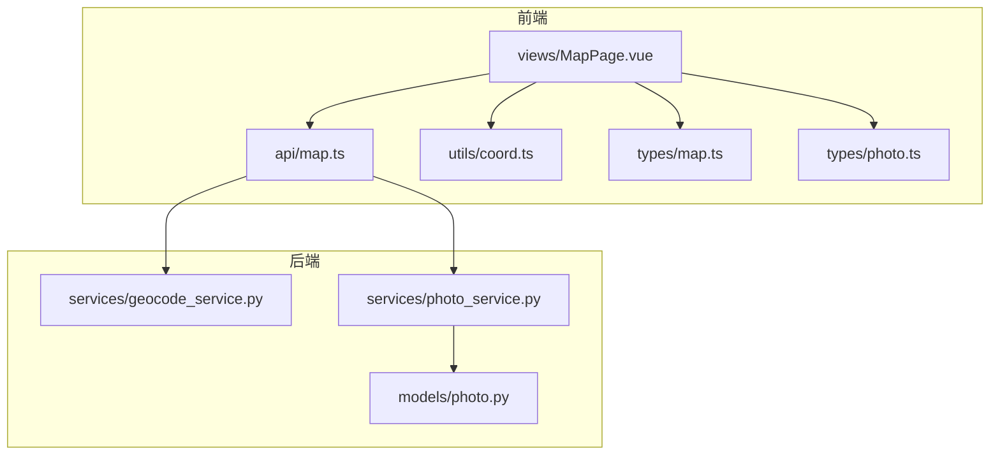
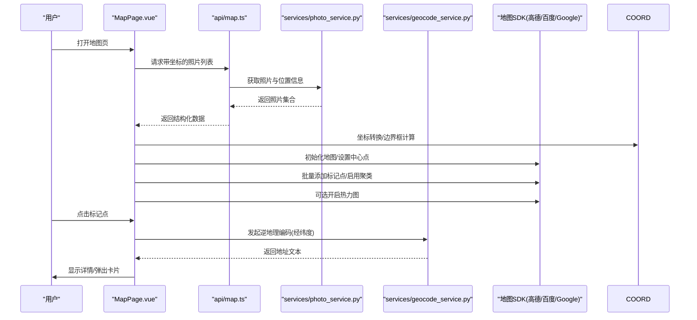
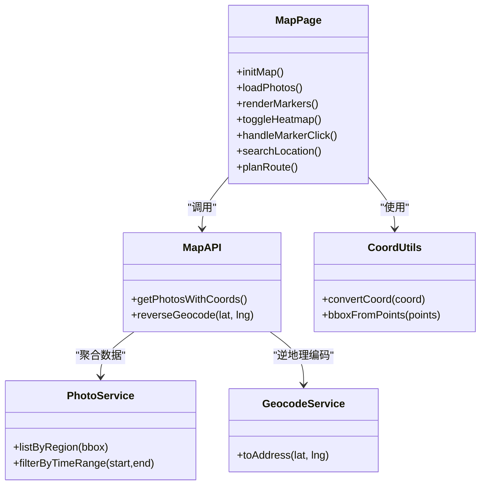
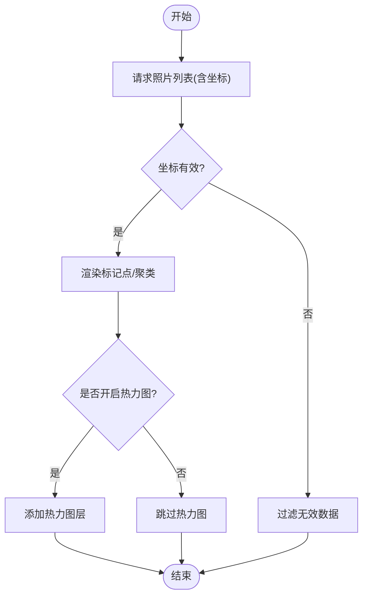
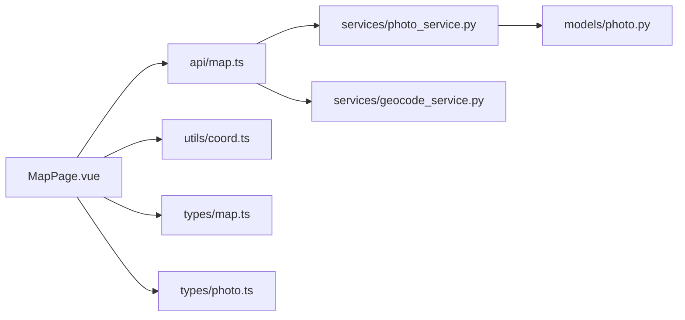

# 地图视图页面

<cite>
**本文引用的文件**   
- [MapPage.vue](file://frontend/src/views/MapPage.vue)
- [map.ts](file://frontend/src/api/map.ts)
- [coord.ts](file://frontend/src/utils/coord.ts)
- [photo.ts](file://frontend/src/types/photo.ts)
- [map.ts](file://frontend/src/types/map.ts)
- [geocode_service.py](file://backend/app/services/geocode_service.py)
- [photo_service.py](file://backend/app/services/photo_service.py)
- [photo.py](file://backend/app/models/photo.py)
</cite>

## 目录
1. [简介](#简介)
2. [项目结构](#项目结构)
3. [核心组件](#核心组件)
4. [架构总览](#架构总览)
5. [详细组件分析](#详细组件分析)
6. [依赖关系分析](#依赖关系分析)
7. [性能考虑](#性能考虑)
8. [故障排查指南](#故障排查指南)
9. [结论](#结论)
10. [附录](#附录)

## 简介
本指南面向需要实现“地图视图”页面的前端与后端开发者，围绕 MapPage.vue 的地图集成进行系统化说明。内容覆盖地理标记显示、照片位置标注、热力图展示、地图 API 调用、坐标转换、地址反编码（逆地理编码）、照片聚类与缩放适配、标记点交互、图层控制、搜索定位、路线规划等高级功能，并给出性能优化、离线地图支持与隐私保护策略，以及多地图服务（高德、百度、Google Maps）的集成方案与切换机制。

## 项目结构
本项目采用前后端分离架构：
- 前端：Vue 3 + TypeScript，使用 Vite 构建，路由与状态管理位于 src 下；地图相关逻辑集中在 views/MapPage.vue，API 封装在 api/map.ts，坐标工具在 utils/coord.ts，类型定义在 types/map.ts 与 types/photo.ts。
- 后端：Python FastAPI，提供照片元数据、地理信息、逆地理编码等服务，关键文件包括 services/geocode_service.py、services/photo_service.py 与 models/photo.py。

图表来源
- [MapPage.vue](file://frontend/src/views/MapPage.vue)
- [map.ts](file://frontend/src/api/map.ts)
- [coord.ts](file://frontend/src/utils/coord.ts)
- [map.ts](file://frontend/src/types/map.ts)
- [photo.ts](file://frontend/src/types/photo.ts)
- [geocode_service.py](file://backend/app/services/geocode_service.py)
- [photo_service.py](file://backend/app/services/photo_service.py)
- [photo.py](file://backend/app/models/photo.py)

章节来源
- [MapPage.vue](file://frontend/src/views/MapPage.vue)
- [map.ts](file://frontend/src/api/map.ts)
- [coord.ts](file://frontend/src/utils/coord.ts)
- [map.ts](file://frontend/src/types/map.ts)
- [photo.ts](file://frontend/src/types/photo.ts)
- [geocode_service.py](file://backend/app/services/geocode_service.py)
- [photo_service.py](file://backend/app/services/photo_service.py)
- [photo.py](file://backend/app/models/photo.py)

## 核心组件
- 地图视图组件 MapPage.vue：负责地图初始化、图层控制、标记点渲染、聚类、点击交互、搜索定位、路线规划入口、热力图开关等。
- 地图 API 封装 map.ts：统一封装与后端的地理信息接口调用，如获取带坐标的照片列表、逆地理编码查询等。
- 坐标工具 coord.ts：提供坐标系转换、距离计算、边界框生成等通用方法。
- 类型定义 map.ts 与 photo.ts：约束地图与照片数据结构，确保前后端一致。
- 后端 geocode_service.py：提供逆地理编码能力，将经纬度转换为可读地址。
- 后端 photo_service.py：聚合照片与地理位置信息，支持按区域或条件筛选。
- 后端 photo.py：定义照片模型字段，包含经纬度、拍摄时间、缩略图等。

章节来源
- [MapPage.vue](file://frontend/src/views/MapPage.vue)
- [map.ts](file://frontend/src/api/map.ts)
- [coord.ts](file://frontend/src/utils/coord.ts)
- [map.ts](file://frontend/src/types/map.ts)
- [photo.ts](file://frontend/src/types/photo.ts)
- [geocode_service.py](file://backend/app/services/geocode_service.py)
- [photo_service.py](file://backend/app/services/photo_service.py)
- [photo.py](file://backend/app/models/photo.py)

## 架构总览
下图展示了从用户操作到地图渲染的关键流程，包括数据加载、坐标处理、标记点与热力图渲染、逆地理编码与交互反馈。

图表来源
- [MapPage.vue](file://frontend/src/views/MapPage.vue)
- [map.ts](file://frontend/src/api/map.ts)
- [photo_service.py](file://backend/app/services/photo_service.py)
- [geocode_service.py](file://backend/app/services/geocode_service.py)
- [coord.ts](file://frontend/src/utils/coord.ts)

## 详细组件分析

### MapPage.vue 地图集成实现
- 地图初始化与配置
  - 根据环境变量选择地图服务（高德/百度/Google），动态加载对应 SDK。
  - 设置初始中心点、缩放级别、图层可见性（道路、卫星、地形）。
- 地理标记与照片标注
  - 将照片集合映射为标记点，支持自定义图标与气泡信息。
  - 根据缩放级别调整标记密度与图标大小，避免视觉拥挤。
- 聚类显示
  - 当标记点数量较大时启用聚类，按层级合并邻近点，提升渲染性能。
  - 聚类半径随缩放级别自适应变化。
- 热力图展示
  - 基于照片密度或时间权重生成热力层，支持透明度与颜色渐变调节。
- 标记点交互
  - 点击标记点触发详情弹窗，显示缩略图、拍摄时间、地点名称。
  - 双击放大至最近一级，聚焦单个标记点。
- 图层控制
  - 提供图层开关面板，允许用户切换基础图层与叠加层（卫星、地形、交通）。
- 搜索定位
  - 输入地名或地址，调用后端逆地理编码接口，定位到目标区域并居中显示。
- 路线规划
  - 提供起点/终点输入框，调用地图 SDK 的路线规划能力，绘制导航路径。
- 错误与边界处理
  - 对无坐标照片进行过滤或降级显示。
  - 网络异常时重试与降级策略，保证用户体验。

章节来源
- [MapPage.vue](file://frontend/src/views/MapPage.vue)

#### 类与模块关系（概念示意）

图表来源
- [MapPage.vue](file://frontend/src/views/MapPage.vue)
- [map.ts](file://frontend/src/api/map.ts)
- [coord.ts](file://frontend/src/utils/coord.ts)
- [photo_service.py](file://backend/app/services/photo_service.py)
- [geocode_service.py](file://backend/app/services/geocode_service.py)

### 地图 API 调用与数据流
- 获取带坐标的照片列表
  - 前端通过 api/map.ts 调用后端 photo_service.listByRegion 或全量接口，返回照片集合。
  - 数据结构遵循 types/photo.ts 与 types/map.ts 定义，包含经纬度、缩略图 URL、拍摄时间等。
- 逆地理编码
  - 前端传入经纬度，后端 geocode_service.toAddress 返回可读地址文本。
- 数据校验与容错
  - 对缺失坐标或无效经纬度的数据进行过滤。
  - 网络失败时提示并重试，必要时回退到本地缓存。

图表来源
- [map.ts](file://frontend/src/api/map.ts)
- [photo_service.py](file://backend/app/services/photo_service.py)
- [geocode_service.py](file://backend/app/services/geocode_service.py)
- [map.ts](file://frontend/src/types/map.ts)
- [photo.ts](file://frontend/src/types/photo.ts)

章节来源
- [map.ts](file://frontend/src/api/map.ts)
- [photo_service.py](file://backend/app/services/photo_service.py)
- [geocode_service.py](file://backend/app/services/geocode_service.py)
- [map.ts](file://frontend/src/types/map.ts)
- [photo.ts](file://frontend/src/types/photo.ts)

### 坐标转换与地址反编码
- 坐标转换
  - 使用 utils/coord.ts 提供的转换函数，将不同地图服务的坐标系（如 GCJ-02、BD-09、WGS-84）统一为内部标准格式。
  - 计算边界框用于区域筛选与聚类半径自适应。
- 地址反编码
  - 调用后端 geocode_service.toAddress，将经纬度解析为街道、城市、国家等结构化地址。
  - 前端缓存常用地址结果，减少重复请求。

章节来源
- [coord.ts](file://frontend/src/utils/coord.ts)
- [geocode_service.py](file://backend/app/services/geocode_service.py)

### 照片聚类与缩放适配
- 聚类策略
  - 基于距离阈值与缩放级别动态调整聚类半径，避免密集区域重叠。
  - 聚合后的节点显示计数与平均位置。
- 缩放适配
  - 高缩放级别时降低标记密度，仅显示重要标记；低缩放级别时启用聚类。
  - 图标尺寸与气泡布局随缩放级别自适应。

章节来源
- [MapPage.vue](file://frontend/src/views/MapPage.vue)

### 标记点交互与详情展示
- 点击事件
  - 打开详情抽屉或弹窗，展示照片缩略图、拍摄时间、地点名称。
- 双击事件
  - 自动放大到最近一级，聚焦当前标记点。
- 键盘与无障碍
  - 支持 Tab 键遍历标记点，Enter 键查看详情。

章节来源
- [MapPage.vue](file://frontend/src/views/MapPage.vue)

### 图层控制与搜索定位
- 图层控制
  - 提供图层面板，切换基础图层（道路、卫星、地形）与叠加层（交通、天气）。
- 搜索定位
  - 输入地名或地址，调用逆地理编码接口，定位并居中显示。
  - 支持历史搜索记录与自动补全。

章节来源
- [MapPage.vue](file://frontend/src/views/MapPage.vue)
- [map.ts](file://frontend/src/api/map.ts)
- [geocode_service.py](file://backend/app/services/geocode_service.py)

### 路线规划
- 起点/终点输入
  - 支持手动输入或从地图拾取坐标。
- 路径绘制
  - 调用地图 SDK 的路线规划能力，绘制导航路径与预估时间。
- 多模式出行
  - 支持驾车、步行、骑行等不同出行方式。

章节来源
- [MapPage.vue](file://frontend/src/views/MapPage.vue)

### 多地图服务集成与切换机制
- 服务选择
  - 通过环境变量或用户设置选择地图服务（高德、百度、Google Maps）。
- SDK 动态加载
  - 按需加载对应地图 SDK，避免不必要的资源占用。
- 坐标体系兼容
  - 使用 coord.ts 进行坐标系转换，确保跨服务一致性。
- 功能差异处理
  - 针对各地图服务的特性（如热力图、聚类、路线规划）做差异化实现与降级策略。

章节来源
- [MapPage.vue](file://frontend/src/views/MapPage.vue)
- [coord.ts](file://frontend/src/utils/coord.ts)

## 依赖关系分析
- 前端依赖
  - MapPage.vue 依赖 api/map.ts、utils/coord.ts、types/map.ts、types/photo.ts。
  - 地图 SDK 作为外部依赖，根据配置动态加载。
- 后端依赖
  - photo_service.py 依赖 models/photo.py 获取照片模型。
  - geocode_service.py 提供逆地理编码能力，可能依赖第三方地理编码服务。

图表来源
- [MapPage.vue](file://frontend/src/views/MapPage.vue)
- [map.ts](file://frontend/src/api/map.ts)
- [coord.ts](file://frontend/src/utils/coord.ts)
- [map.ts](file://frontend/src/types/map.ts)
- [photo.ts](file://frontend/src/types/photo.ts)
- [photo_service.py](file://backend/app/services/photo_service.py)
- [geocode_service.py](file://backend/app/services/geocode_service.py)
- [photo.py](file://backend/app/models/photo.py)

章节来源
- [MapPage.vue](file://frontend/src/views/MapPage.vue)
- [map.ts](file://frontend/src/api/map.ts)
- [coord.ts](file://frontend/src/utils/coord.ts)
- [map.ts](file://frontend/src/types/map.ts)
- [photo.ts](file://frontend/src/types/photo.ts)
- [photo_service.py](file://backend/app/services/photo_service.py)
- [geocode_service.py](file://backend/app/services/geocode_service.py)
- [photo.py](file://backend/app/models/photo.py)

## 性能考虑
- 数据分页与懒加载
  - 按区域或分页加载照片，避免一次性加载大量数据。
- 标记点与聚类优化
  - 使用聚类减少 DOM 节点数量，结合虚拟滚动或离屏渲染。
- 热力图渲染
  - 对热点数据进行降采样与分块渲染，避免主线程阻塞。
- 缓存策略
  - 缓存逆地理编码结果与常用图层配置，减少重复请求。
- 内存管理
  - 及时释放不再使用的标记点与图层引用，防止内存泄漏。

[本节为通用指导，不直接分析具体文件]

## 故障排查指南
- 地图无法加载
  - 检查环境变量与服务密钥是否正确。
  - 确认地图 SDK 脚本加载成功，查看控制台错误。
- 标记点不显示
  - 验证照片坐标是否为空或无效。
  - 检查坐标转换函数返回值是否符合地图 SDK 要求。
- 逆地理编码失败
  - 检查后端 geocode_service 的网络连通性与配额限制。
  - 确认经纬度范围合法。
- 热力图卡顿
  - 降低数据密度或关闭热力图。
  - 增加浏览器硬件加速与 GPU 渲染选项。

章节来源
- [MapPage.vue](file://frontend/src/views/MapPage.vue)
- [geocode_service.py](file://backend/app/services/geocode_service.py)

## 结论
本指南系统梳理了地图视图页面的实现要点，涵盖从数据获取、坐标处理、标记渲染、聚类与热力图，到交互、搜索、路线规划与多地图服务切换的全链路开发流程。通过合理的性能优化与隐私保护措施，可在保障用户体验的同时，稳定支撑大规模照片的地图可视化需求。

[本节为总结性内容，不直接分析具体文件]

## 附录
- 最佳实践
  - 始终对用户隐私敏感信息进行脱敏处理，避免在前端日志中输出精确坐标。
  - 为地图服务提供降级与回退方案，确保在网络或服务不可用时仍可基本可用。
- 扩展建议
  - 引入 Web Worker 进行坐标批量转换与聚类计算，减轻主线程压力。
  - 增加地图主题与样式定制能力，满足不同场景的视觉需求。

[本节为补充性内容，不直接分析具体文件]