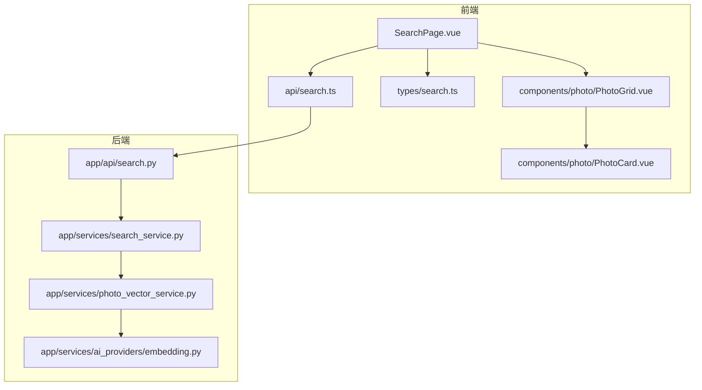
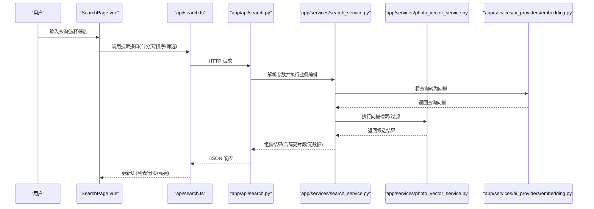
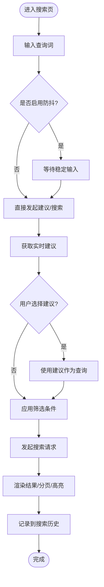
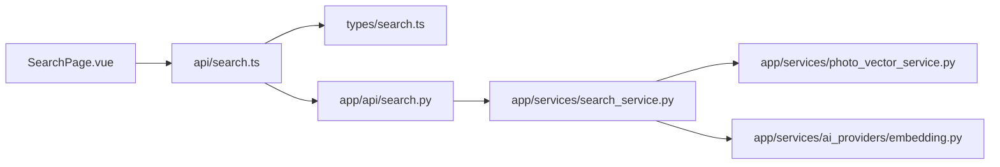
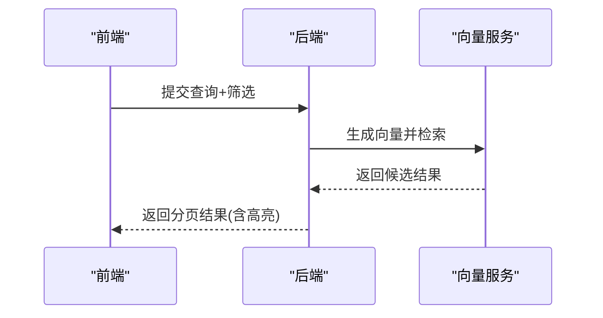

# 智能搜索页面

<cite>
**本文引用的文件**   
- [SearchPage.vue](file://frontend/src/views/SearchPage.vue)
- [search.ts](file://frontend/src/api/search.ts)
- [search_service.py](file://backend/app/services/search_service.py)
- [search.py](file://backend/app/api/search.py)
- [photo_vector_service.py](file://backend/app/services/photo_vector_service.py)
- [embedding.py](file://backend/app/services/ai_providers/embedding.py)
- [types/search.ts](file://frontend/src/types/search.ts)
- [PhotoCard.vue](file://frontend/src/components/photo/PhotoCard.vue)
- [PhotoGrid.vue](file://frontend/src/components/photo/PhotoGrid.vue)
</cite>

## 目录
1. [简介](#简介)
2. [项目结构](#项目结构)
3. [核心组件](#核心组件)
4. [架构总览](#架构总览)
5. [详细组件分析](#详细组件分析)
6. [依赖关系分析](#依赖关系分析)
7. [性能考虑](#性能考虑)
8. [故障排查指南](#故障排查指南)
9. [结论](#结论)
10. [附录](#附录)

## 简介
本指南面向前端与后端开发者，提供“智能搜索页面”的完整开发说明。内容覆盖：
- 搜索界面设计：自然语言查询输入、高级筛选条件（标签、时间范围、地理位置等）、搜索结果展示
- API 集成：搜索接口调用、实时搜索建议、搜索历史管理
- 结果呈现：分页加载、排序选项、结果高亮显示
- 高级能力：语义搜索、标签过滤、时间范围筛选、地理位置搜索
- 性能优化：防抖处理、错误重试机制、缓存策略

## 项目结构
前端以 Vue 单文件组件组织，搜索主视图位于 views 目录；API 层集中在 api 目录；类型定义在 types 目录；通用展示组件在 components/photo 目录。后端采用 FastAPI 风格，搜索相关逻辑分布在 services 与 api 层，向量检索与嵌入服务由独立模块提供。

图表来源
- [SearchPage.vue](file://frontend/src/views/SearchPage.vue)
- [search.ts](file://frontend/src/api/search.ts)
- [search.py](file://backend/app/api/search.py)
- [search_service.py](file://backend/app/services/search_service.py)
- [photo_vector_service.py](file://backend/app/services/photo_vector_service.py)
- [embedding.py](file://backend/app/services/ai_providers/embedding.py)
- [PhotoGrid.vue](file://frontend/src/components/photo/PhotoGrid.vue)
- [PhotoCard.vue](file://frontend/src/components/photo/PhotoCard.vue)

章节来源
- [SearchPage.vue](file://frontend/src/views/SearchPage.vue)
- [search.ts](file://frontend/src/api/search.ts)
- [search.py](file://backend/app/api/search.py)
- [search_service.py](file://backend/app/services/search_service.py)
- [photo_vector_service.py](file://backend/app/services/photo_vector_service.py)
- [embedding.py](file://backend/app/services/ai_providers/embedding.py)
- [PhotoGrid.vue](file://frontend/src/components/photo/PhotoGrid.vue)
- [PhotoCard.vue](file://frontend/src/components/photo/PhotoCard.vue)

## 核心组件
- SearchPage.vue：搜索页主视图，负责查询输入、筛选面板、结果列表、分页与交互状态管理
- search.ts：封装搜索请求、建议请求、历史记录读写等 API 方法
- search_service.py：搜索业务编排，解析查询、组合筛选条件、调用向量检索或关键词检索
- search.py：HTTP 路由层，接收请求参数并返回统一响应格式
- photo_vector_service.py：向量检索服务，执行相似度匹配与召回
- embedding.py：文本/查询向量化提供者
- PhotoGrid.vue / PhotoCard.vue：结果网格与卡片渲染，支持高亮与交互

章节来源
- [SearchPage.vue](file://frontend/src/views/SearchPage.vue)
- [search.ts](file://frontend/src/api/search.ts)
- [search_service.py](file://backend/app/services/search_service.py)
- [search.py](file://backend/app/api/search.py)
- [photo_vector_service.py](file://backend/app/services/photo_vector_service.py)
- [embedding.py](file://backend/app/services/ai_providers/embedding.py)
- [PhotoGrid.vue](file://frontend/src/components/photo/PhotoGrid.vue)
- [PhotoCard.vue](file://frontend/src/components/photo/PhotoCard.vue)

## 架构总览
前后端通过 RESTful API 通信。前端发起自然语言查询与筛选条件，后端进行语义理解与向量检索，返回结构化结果供前端渲染。

图表来源
- [SearchPage.vue](file://frontend/src/views/SearchPage.vue)
- [search.ts](file://frontend/src/api/search.ts)
- [search.py](file://backend/app/api/search.py)
- [search_service.py](file://backend/app/services/search_service.py)
- [photo_vector_service.py](file://backend/app/services/photo_vector_service.py)
- [embedding.py](file://backend/app/services/ai_providers/embedding.py)

## 详细组件分析

### 搜索界面设计与交互（SearchPage.vue）
- 自然语言查询输入：支持回车触发搜索、清空、聚焦提示
- 高级筛选面板：标签多选、时间范围起止、地理位置（经纬度或地名）
- 结果展示：网格布局、卡片信息、点击查看详情
- 分页与排序：页码切换、每页条数、按时间/相关性排序
- 实时建议：输入时触发建议接口，键盘导航选择
- 搜索历史：本地存储最近查询，一键复用
- 高亮显示：对命中关键词或语义片段进行高亮

图表来源
- [SearchPage.vue](file://frontend/src/views/SearchPage.vue)
- [search.ts](file://frontend/src/api/search.ts)

章节来源
- [SearchPage.vue](file://frontend/src/views/SearchPage.vue)
- [search.ts](file://frontend/src/api/search.ts)

### 搜索 API 集成（search.ts）
- 统一封装搜索、建议、历史增删改查等方法
- 请求参数映射：query、filters、page、pageSize、sort、highlight
- 错误处理：网络异常、服务端错误码、超时重试
- 取消重复请求：基于最新查询标识取消旧请求

章节来源
- [search.ts](file://frontend/src/api/search.ts)

### 后端搜索服务（search_service.py）
- 查询解析：提取自然语言意图、识别筛选条件（标签、时间、位置）
- 语义检索：调用嵌入服务生成查询向量，结合向量库检索
- 混合检索：必要时融合关键词匹配与向量相似度
- 结果后处理：排序、去重、高亮片段生成、元数据补充

章节来源
- [search_service.py](file://backend/app/services/search_service.py)

### HTTP 路由层（search.py）
- 定义搜索与建议接口路径
- 参数校验与默认值填充
- 统一响应包装与错误码映射

章节来源
- [search.py](file://backend/app/api/search.py)

### 向量检索与嵌入（photo_vector_service.py, embedding.py）
- embedding.py：将查询文本转换为向量
- photo_vector_service.py：根据向量相似度召回照片，支持过滤条件与分页

章节来源
- [photo_vector_service.py](file://backend/app/services/photo_vector_service.py)
- [embedding.py](file://backend/app/services/ai_providers/embedding.py)

### 结果展示组件（PhotoGrid.vue, PhotoCard.vue）
- PhotoGrid.vue：网格布局、懒加载、骨架屏占位
- PhotoCard.vue：图片缩略图、标题、时间、标签、高亮片段展示

章节来源
- [PhotoGrid.vue](file://frontend/src/components/photo/PhotoGrid.vue)
- [PhotoCard.vue](file://frontend/src/components/photo/PhotoCard.vue)

### 类型定义（types/search.ts）
- 定义查询参数、筛选对象、结果项、分页信息等类型
- 为前后端契约提供强类型约束，减少运行时错误

章节来源
- [types/search.ts](file://frontend/src/types/search.ts)

## 依赖关系分析
- 前端依赖：SearchPage.vue 依赖 search.ts 与展示组件；类型定义贯穿前后端
- 后端依赖：search.py 路由依赖 search_service.py；后者依赖向量与嵌入服务
- 外部依赖：嵌入模型服务、向量数据库（由服务层抽象）

图表来源
- [SearchPage.vue](file://frontend/src/views/SearchPage.vue)
- [search.ts](file://frontend/src/api/search.ts)
- [search.py](file://backend/app/api/search.py)
- [search_service.py](file://backend/app/services/search_service.py)
- [photo_vector_service.py](file://backend/app/services/photo_vector_service.py)
- [embedding.py](file://backend/app/services/ai_providers/embedding.py)

章节来源
- [SearchPage.vue](file://frontend/src/views/SearchPage.vue)
- [search.ts](file://frontend/src/api/search.ts)
- [search.py](file://backend/app/api/search.py)
- [search_service.py](file://backend/app/services/search_service.py)
- [photo_vector_service.py](file://backend/app/services/photo_vector_service.py)
- [embedding.py](file://backend/app/services/ai_providers/embedding.py)

## 性能考虑
- 防抖处理：在输入框变更时延迟发送建议/搜索请求，避免频繁网络调用
- 请求去重与取消：同一查询周期内仅保留最新请求，旧请求自动取消
- 分页与虚拟滚动：大结果集按需加载，减少首屏渲染压力
- 缓存策略：对相同查询与筛选组合做短期缓存，提升二次访问速度
- 错误重试：对瞬时失败的网络请求进行指数退避重试
- 服务端优化：向量检索使用近似最近邻算法，合理设置 topK 与阈值

[本节为通用指导，不直接分析具体文件]

## 故障排查指南
- 常见问题
  - 无结果：检查查询向量生成是否成功、过滤条件是否过严
  - 结果不准确：调整相似度阈值、增加关键词权重或引入混合检索
  - 高亮缺失：确认服务端返回的高亮片段字段存在且非空
  - 建议不触发：确认防抖时间与最小字符数配置
- 定位步骤
  - 查看浏览器网络面板的请求/响应体
  - 核对前后端类型定义一致性
  - 检查后端日志中的异常堆栈与耗时

章节来源
- [search.ts](file://frontend/src/api/search.ts)
- [search.py](file://backend/app/api/search.py)
- [search_service.py](file://backend/app/services/search_service.py)

## 结论
通过前后端协同实现的自然语言搜索与向量检索，配合防抖、分页、高亮与错误重试等工程化手段，可构建出体验流畅、扩展性强的智能搜索页面。建议在后续迭代中持续优化检索质量与性能指标，完善监控与可观测性。

[本节为总结性内容，不直接分析具体文件]

## 附录
- 关键流程时序参考

图表来源
- [SearchPage.vue](file://frontend/src/views/SearchPage.vue)
- [search.ts](file://frontend/src/api/search.ts)
- [search.py](file://backend/app/api/search.py)
- [search_service.py](file://backend/app/services/search_service.py)
- [photo_vector_service.py](file://backend/app/services/photo_vector_service.py)