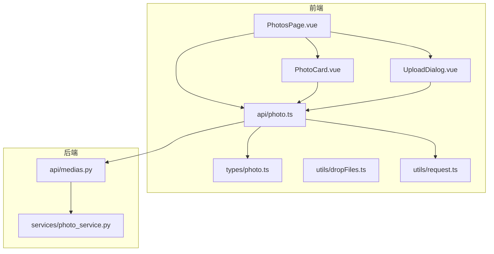
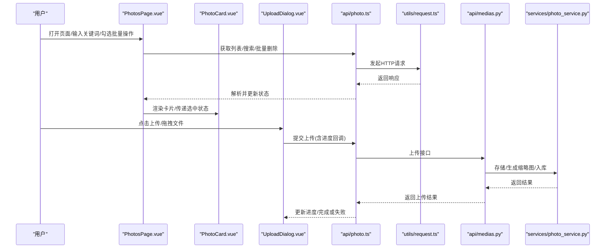
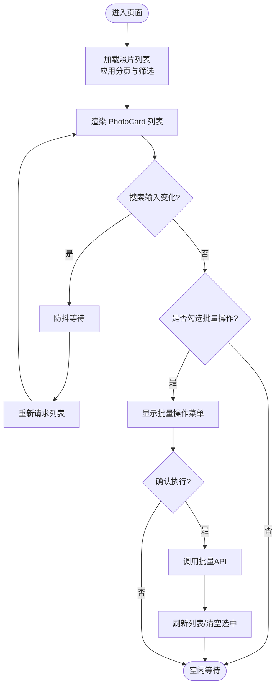
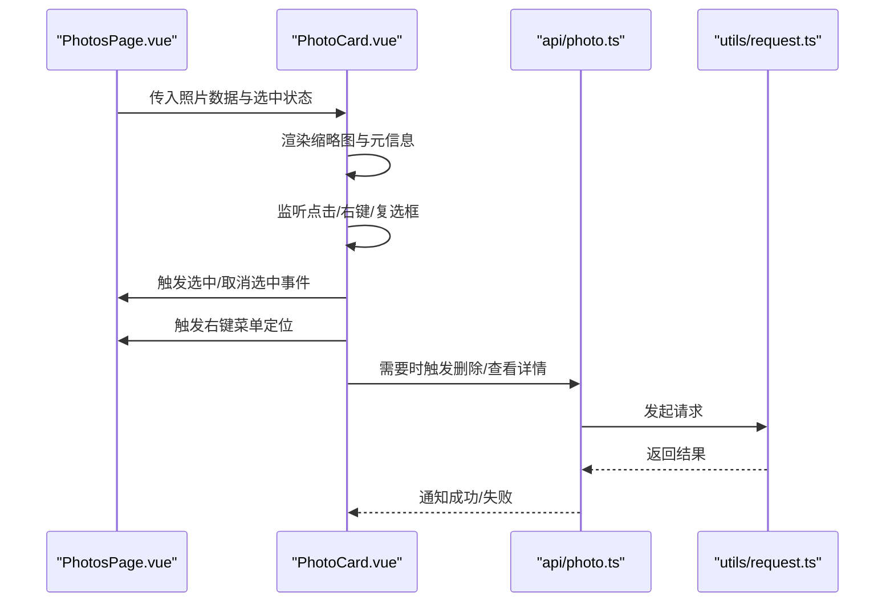
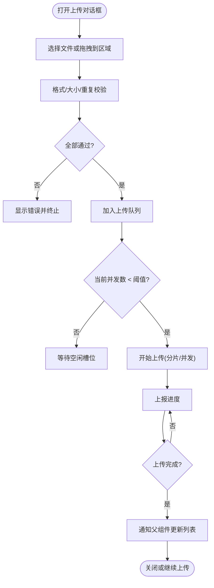
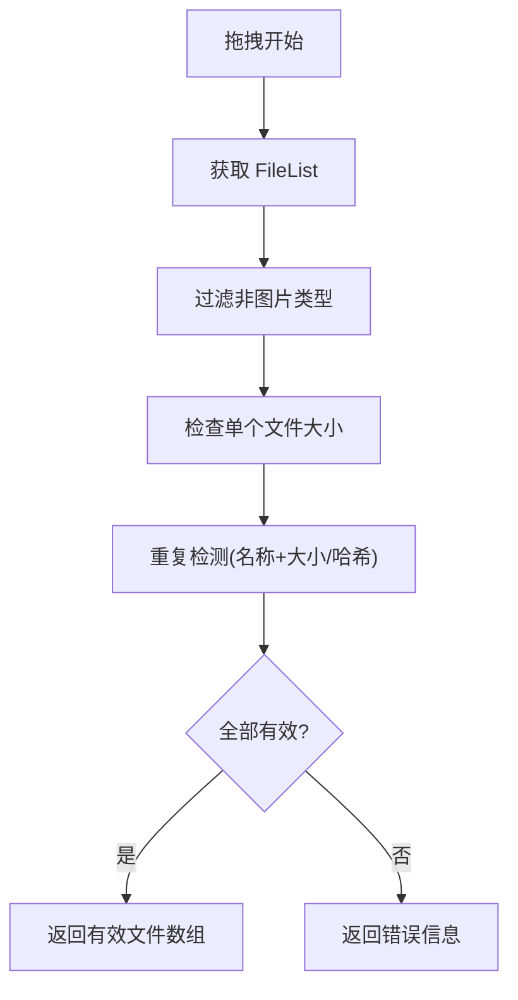
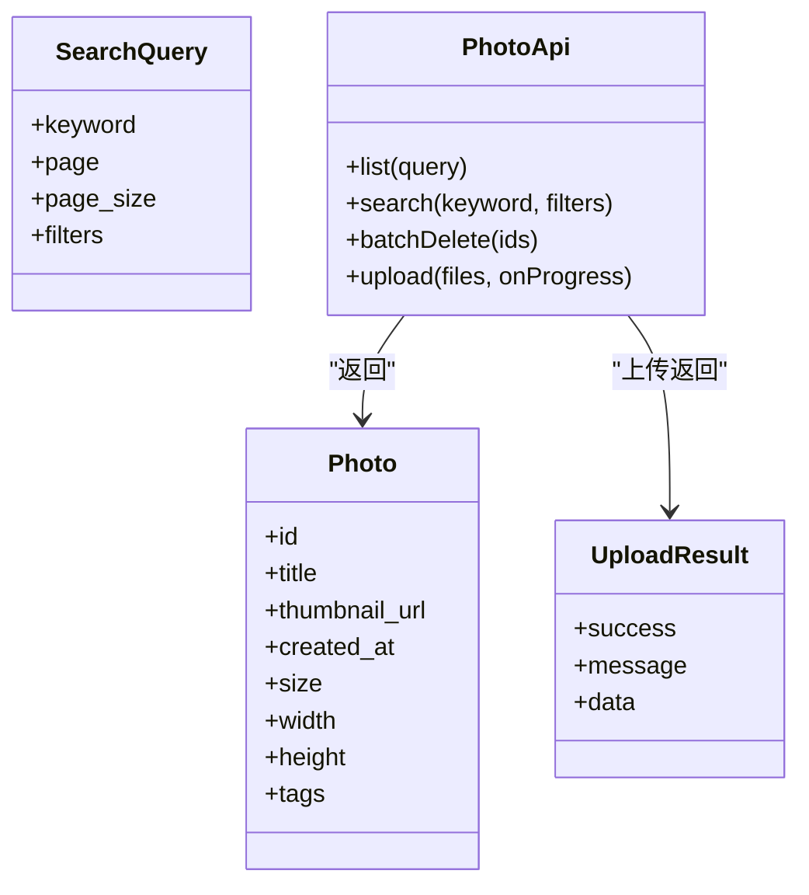
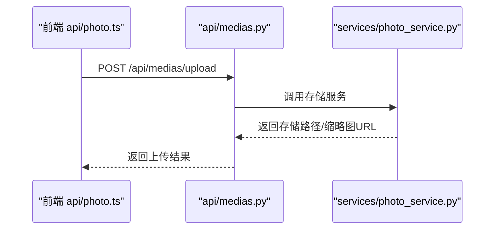
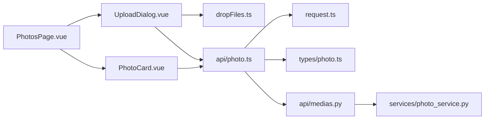

# 照片管理页面

<cite>
**本文引用的文件**   
- [PhotosPage.vue](file://frontend/src/views/PhotosPage.vue)
- [PhotoCard.vue](file://frontend/src/components/photo/PhotoCard.vue)
- [UploadDialog.vue](file://frontend/src/components/photo/UploadDialog.vue)
- [photo.ts](file://frontend/src/api/photo.ts)
- [photo.ts](file://frontend/src/types/photo.ts)
- [dropFiles.ts](file://frontend/src/utils/dropFiles.ts)
- [request.ts](file://frontend/src/utils/request.ts)
- [photoService.ts](file://backend/app/services/photo_service.py)
- [medias.py](file://backend/app/api/medias.py)
</cite>

## 目录
1. [简介](#简介)
2. [项目结构](#项目结构)
3. [核心组件](#核心组件)
4. [架构总览](#架构总览)
5. [详细组件分析](#详细组件分析)
6. [依赖关系分析](#依赖关系分析)
7. [性能与体验优化](#性能与体验优化)
8. [故障排查指南](#故障排查指南)
9. [结论](#结论)
10. [附录](#附录)

## 简介
本指南面向前端与全栈开发者，围绕“照片管理页面”的完整开发流程进行系统化说明。重点覆盖：
- PhotosPage.vue 的页面架构、数据流与交互设计
- PhotoCard 组件的图片展示、元数据呈现与右键菜单操作
- UploadDialog 上传对话框的文件选择、进度跟踪与错误处理
- 高级能力：拖拽上传、格式验证、大小限制、并发控制
- 用户体验优化与性能调优方案

## 项目结构
照片管理相关的前端代码位于 frontend/src 下，核心视图与组件分布如下：
- 视图层：views/PhotosPage.vue
- 组件层：components/photo/PhotoCard.vue、UploadDialog.vue
- API 层：api/photo.ts（封装后端接口）
- 类型定义：types/photo.ts（前后端数据结构）
- 工具函数：utils/dropFiles.ts（拖拽与校验）、utils/request.ts（请求封装）
- 后端服务：services/photo_service.py、api/medias.py（上传、列表、批量操作等）

图表来源
- [PhotosPage.vue](file://frontend/src/views/PhotosPage.vue)
- [PhotoCard.vue](file://frontend/src/components/photo/PhotoCard.vue)
- [UploadDialog.vue](file://frontend/src/components/photo/UploadDialog.vue)
- [photo.ts](file://frontend/src/api/photo.ts)
- [photo.ts](file://frontend/src/types/photo.ts)
- [dropFiles.ts](file://frontend/src/utils/dropFiles.ts)
- [request.ts](file://frontend/src/utils/request.ts)
- [medias.py](file://backend/app/api/medias.py)
- [photo_service.py](file://backend/app/services/photo_service.py)

章节来源
- [PhotosPage.vue](file://frontend/src/views/PhotosPage.vue)
- [PhotoCard.vue](file://frontend/src/components/photo/PhotoCard.vue)
- [UploadDialog.vue](file://frontend/src/components/photo/UploadDialog.vue)
- [photo.ts](file://frontend/src/api/photo.ts)
- [photo.ts](file://frontend/src/types/photo.ts)
- [dropFiles.ts](file://frontend/src/utils/dropFiles.ts)
- [request.ts](file://frontend/src/utils/request.ts)
- [medias.py](file://backend/app/api/medias.py)
- [photo_service.py](file://backend/app/services/photo_service.py)

## 核心组件
- PhotosPage.vue：承载照片列表、搜索筛选、批量操作、分页加载、上下文菜单与上传入口。负责状态管理与事件分发。
- PhotoCard.vue：单张照片卡片，负责缩略图渲染、元数据展示、选中态、右键菜单触发与详情抽屉联动。
- UploadDialog.vue：上传对话框，负责多文件选择、拖拽区域、格式与大小校验、分片/并发上传、进度条与失败重试。

章节来源
- [PhotosPage.vue](file://frontend/src/views/PhotosPage.vue)
- [PhotoCard.vue](file://frontend/src/components/photo/PhotoCard.vue)
- [UploadDialog.vue](file://frontend/src/components/photo/UploadDialog.vue)

## 架构总览
整体采用“视图-组件-API-服务”的分层模式：
- 视图层（PhotosPage.vue）聚合业务逻辑与用户交互
- 组件层（PhotoCard.vue、UploadDialog.vue）专注展示与局部交互
- API 层（api/photo.ts）统一封装 HTTP 调用与参数映射
- 后端服务（services/photo_service.py、api/medias.py）提供媒体资源与任务编排

图表来源
- [PhotosPage.vue](file://frontend/src/views/PhotosPage.vue)
- [PhotoCard.vue](file://frontend/src/components/photo/PhotoCard.vue)
- [UploadDialog.vue](file://frontend/src/components/photo/UploadDialog.vue)
- [photo.ts](file://frontend/src/api/photo.ts)
- [request.ts](file://frontend/src/utils/request.ts)
- [medias.py](file://backend/app/api/medias.py)
- [photo_service.py](file://backend/app/services/photo_service.py)

## 详细组件分析

### PhotosPage.vue 页面架构
职责边界
- 数据源：通过 api/photo.ts 拉取照片列表、执行搜索与批量操作
- 状态管理：本地维护查询条件、分页、选中项集合、上下文菜单位置
- 交互：搜索框输入防抖、多选框批量操作、右键菜单、上传入口
- 子组件：PhotoCard 列表渲染、UploadDialog 上传弹窗

关键流程
- 初始化：加载默认分页与筛选条件，请求列表
- 搜索：监听输入变化，防抖后重新请求
- 批量：根据选中项集合调用批量删除/移动等接口
- 上传：打开 UploadDialog，接收上传进度与结果回调

图表来源
- [PhotosPage.vue](file://frontend/src/views/PhotosPage.vue)
- [photo.ts](file://frontend/src/api/photo.ts)

章节来源
- [PhotosPage.vue](file://frontend/src/views/PhotosPage.vue)
- [photo.ts](file://frontend/src/api/photo.ts)

### PhotoCard.vue 图片与元数据展示
职责边界
- 图片渲染：支持占位、懒加载、缩放预览
- 元数据：标题、拍摄时间、尺寸、标签等
- 交互：单选/多选、右键菜单、点击跳转详情抽屉

交互序列

图表来源
- [PhotoCard.vue](file://frontend/src/components/photo/PhotoCard.vue)
- [photo.ts](file://frontend/src/api/photo.ts)
- [request.ts](file://frontend/src/utils/request.ts)

章节来源
- [PhotoCard.vue](file://frontend/src/components/photo/PhotoCard.vue)
- [photo.ts](file://frontend/src/api/photo.ts)
- [request.ts](file://frontend/src/utils/request.ts)

### UploadDialog.vue 上传对话框
职责边界
- 文件选择：支持点击选择与拖拽区域
- 校验：格式白名单、大小上限、重复检测
- 上传：并发控制、断点续传（可选）、进度上报、失败重试
- 反馈：全局进度条、单项进度、错误提示与重试按钮

上传流程图

图表来源
- [UploadDialog.vue](file://frontend/src/components/photo/UploadDialog.vue)
- [photo.ts](file://frontend/src/api/photo.ts)
- [dropFiles.ts](file://frontend/src/utils/dropFiles.ts)

章节来源
- [UploadDialog.vue](file://frontend/src/components/photo/UploadDialog.vue)
- [photo.ts](file://frontend/src/api/photo.ts)
- [dropFiles.ts](file://frontend/src/utils/dropFiles.ts)

### 拖拽与校验（dropFiles.ts）
功能要点
- 拦截拖拽事件，阻止默认行为
- 过滤非图片文件，按 MIME 与扩展名双重校验
- 计算文件大小，超过阈值则拒绝
- 去重：基于文件名+大小或哈希（若可用）

图表来源
- [dropFiles.ts](file://frontend/src/utils/dropFiles.ts)

章节来源
- [dropFiles.ts](file://frontend/src/utils/dropFiles.ts)

### API 与类型（api/photo.ts、types/photo.ts）
职责边界
- types/photo.ts：定义 Photo、Album、SearchQuery、UploadResult 等类型
- api/photo.ts：封装列表、搜索、批量删除、上传等接口，统一错误处理与响应解包

图表来源
- [photo.ts](file://frontend/src/types/photo.ts)
- [photo.ts](file://frontend/src/api/photo.ts)

章节来源
- [photo.ts](file://frontend/src/types/photo.ts)
- [photo.ts](file://frontend/src/api/photo.ts)

### 后端集成（api/medias.py、services/photo_service.py）
职责边界
- api/medias.py：暴露上传、列表、删除等 REST 接口，处理鉴权与参数校验
- services/photo_service.py：实现存储、缩略图生成、索引构建、批量操作等业务逻辑

图表来源
- [medias.py](file://backend/app/api/medias.py)
- [photo_service.py](file://backend/app/services/photo_service.py)

章节来源
- [medias.py](file://backend/app/api/medias.py)
- [photo_service.py](file://backend/app/services/photo_service.py)

## 依赖关系分析
- 组件耦合
  - PhotosPage.vue 与 PhotoCard.vue：通过 props/events 通信，低耦合高内聚
  - PhotosPage.vue 与 UploadDialog.vue：通过事件与回调传递上传结果
- 模块依赖
  - api/photo.ts 依赖 request.ts 做网络层封装
  - UploadDialog.vue 依赖 dropFiles.ts 做文件校验
  - 前后端通过 REST 接口契约（types/photo.ts）对齐数据结构

图表来源
- [PhotosPage.vue](file://frontend/src/views/PhotosPage.vue)
- [PhotoCard.vue](file://frontend/src/components/photo/PhotoCard.vue)
- [UploadDialog.vue](file://frontend/src/components/photo/UploadDialog.vue)
- [photo.ts](file://frontend/src/api/photo.ts)
- [photo.ts](file://frontend/src/types/photo.ts)
- [dropFiles.ts](file://frontend/src/utils/dropFiles.ts)
- [request.ts](file://frontend/src/utils/request.ts)
- [medias.py](file://backend/app/api/medias.py)
- [photo_service.py](file://backend/app/services/photo_service.py)

章节来源
- [PhotosPage.vue](file://frontend/src/views/PhotosPage.vue)
- [PhotoCard.vue](file://frontend/src/components/photo/PhotoCard.vue)
- [UploadDialog.vue](file://frontend/src/components/photo/UploadDialog.vue)
- [photo.ts](file://frontend/src/api/photo.ts)
- [photo.ts](file://frontend/src/types/photo.ts)
- [dropFiles.ts](file://frontend/src/utils/dropFiles.ts)
- [request.ts](file://frontend/src/utils/request.ts)
- [medias.py](file://backend/app/api/medias.py)
- [photo_service.py](file://backend/app/services/photo_service.py)

## 性能与体验优化
- 列表渲染
  - 虚拟滚动：当列表规模较大时使用虚拟列表减少 DOM 节点数量
  - 图片懒加载：使用 IntersectionObserver 延迟加载可见区域图片
  - 缩略图优先：先展示小图，点击再加载原图
- 搜索与筛选
  - 输入防抖：避免频繁请求
  - 服务端分页：结合 page/page_size 控制单次数据量
- 上传
  - 并发控制：限制同时上传数量，避免阻塞 UI 与带宽
  - 分片上传：大文件分块传输，支持断点续传
  - 进度上报：使用 XMLHttpRequest.upload.onprogress 或 Fetch 流式读取
  - 失败重试：指数退避与最大重试次数
- 交互体验
  - 骨架屏：在数据加载期间展示占位
  - 错误边界：捕获组件异常，防止整页崩溃
  - 可访问性：为图片添加 alt、键盘导航、焦点管理

[本节为通用指导，不直接分析具体文件]

## 故障排查指南
常见问题与定位思路
- 图片无法加载
  - 检查 thumbnail_url 是否可达，跨域与鉴权头是否正确
  - 查看浏览器控制台网络面板，确认 404/403/5xx
- 上传失败
  - 校验 MIME 与扩展名是否匹配
  - 检查文件大小是否超过后端限制
  - 查看 UploadDialog 的错误提示与重试日志
- 搜索无结果
  - 确认关键词与过滤器参数是否正确拼接
  - 对比后端返回结构与前端类型定义是否一致
- 批量操作无效
  - 检查选中项集合是否为空
  - 确认批量接口幂等性与权限

章节来源
- [UploadDialog.vue](file://frontend/src/components/photo/UploadDialog.vue)
- [photo.ts](file://frontend/src/api/photo.ts)
- [request.ts](file://frontend/src/utils/request.ts)
- [medias.py](file://backend/app/api/medias.py)
- [photo_service.py](file://backend/app/services/photo_service.py)

## 结论
通过清晰的组件分层与前后端契约，照片管理页面实现了高效的列表展示、便捷的批量操作与可靠的上传体验。结合虚拟滚动、懒加载、并发控制与错误重试等策略，可在大规模数据与复杂交互场景下保持流畅与稳定。建议持续完善类型约束、错误边界与监控埋点，进一步提升可维护性与可观测性。

## 附录
- 术语
  - 缩略图：用于快速预览的小尺寸图片
  - 分片上传：将大文件切分为多个片段依次上传
  - 并发控制：限制同时进行的上传任务数量
- 参考文件
  - 视图与组件：PhotosPage.vue、PhotoCard.vue、UploadDialog.vue
  - 接口与类型：api/photo.ts、types/photo.ts
  - 工具函数：dropFiles.ts、request.ts
  - 后端服务：api/medias.py、services/photo_service.py