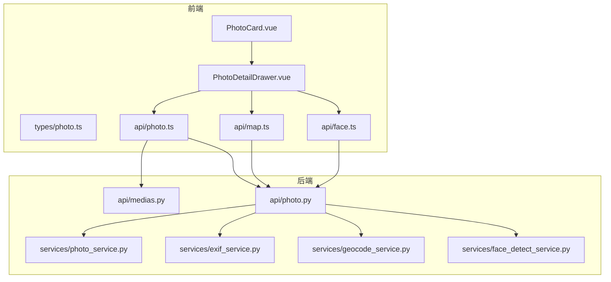
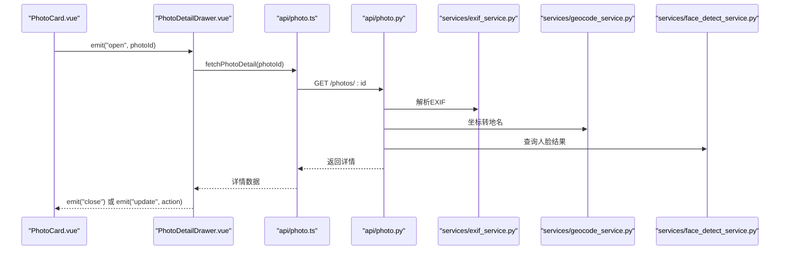
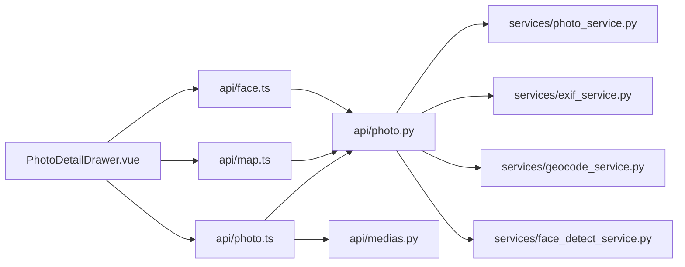

# 照片详情组件

<cite>
**本文引用的文件**   
- [PhotoDetailDrawer.vue](file://frontend/src/components/photo/PhotoDetailDrawer.vue)
- [PhotoCard.vue](file://frontend/src/components/photo/PhotoCard.vue)
- [photo.ts](file://frontend/src/types/photo.ts)
- [photo.ts](file://frontend/src/api/photo.ts)
- [map.ts](file://frontend/src/api/map.ts)
- [face.ts](file://frontend/src/api/face.ts)
- [photo_service.py](file://backend/app/services/photo_service.py)
- [exif_service.py](file://backend/app/services/exif_service.py)
- [geocode_service.py](file://backend/app/services/geocode_service.py)
- [face_detect_service.py](file://backend/app/services/face_detect_service.py)
- [medias.py](file://backend/app/api/medias.py)
- [photo.py](file://backend/app/api/photo.py)
</cite>

## 目录
1. [简介](#简介)
2. [项目结构](#项目结构)
3. [核心组件](#核心组件)
4. [架构总览](#架构总览)
5. [详细组件分析](#详细组件分析)
6. [依赖关系分析](#依赖关系分析)
7. [性能与体验优化](#性能与体验优化)
8. [故障排查指南](#故障排查指南)
9. [结论](#结论)
10. [附录](#附录)

## 简介
本文件面向前端“照片详情”抽屉式面板（PhotoDetailDrawer）的开发与维护，系统性阐述其实现要点与前后端协作方式。内容覆盖：
- 图片放大查看、元数据展示、编辑功能
- 旋转、裁剪、滤镜等编辑工具的实现思路
- EXIF信息展示、地理位置地图集成、人脸识别结果查看
- 下载、分享、添加到相册等操作
- 与 PhotoCard 的交互逻辑与数据传递机制
- 图片加载优化、内存管理与用户体验提升方案

## 项目结构
前端相关代码位于 frontend/src 下，其中照片详情抽屉与卡片分别位于 components/photo 目录；类型定义在 types/photo.ts；API 调用集中在 api 目录；后端服务与接口位于 backend/app 下。

图表来源
- [PhotoDetailDrawer.vue](file://frontend/src/components/photo/PhotoDetailDrawer.vue)
- [PhotoCard.vue](file://frontend/src/components/photo/PhotoCard.vue)
- [photo.ts](file://frontend/src/types/photo.ts)
- [photo.ts](file://frontend/src/api/photo.ts)
- [map.ts](file://frontend/src/api/map.ts)
- [face.ts](file://frontend/src/api/face.ts)
- [medias.py](file://backend/app/api/medias.py)
- [photo.py](file://backend/app/api/photo.py)
- [photo_service.py](file://backend/app/services/photo_service.py)
- [exif_service.py](file://backend/app/services/exif_service.py)
- [geocode_service.py](file://backend/app/services/geocode_service.py)
- [face_detect_service.py](file://backend/app/services/face_detect_service.py)

章节来源
- [PhotoDetailDrawer.vue](file://frontend/src/components/photo/PhotoDetailDrawer.vue)
- [PhotoCard.vue](file://frontend/src/components/photo/PhotoCard.vue)
- [photo.ts](file://frontend/src/types/photo.ts)
- [photo.ts](file://frontend/src/api/photo.ts)
- [map.ts](file://frontend/src/api/map.ts)
- [face.ts](file://frontend/src/api/face.ts)
- [medias.py](file://backend/app/api/medias.py)
- [photo.py](file://backend/app/api/photo.py)
- [photo_service.py](file://backend/app/services/photo_service.py)
- [exif_service.py](file://backend/app/services/exif_service.py)
- [geocode_service.py](file://backend/app/services/geocode_service.py)
- [face_detect_service.py](file://backend/app/services/face_detect_service.py)

## 核心组件
- 照片详情抽屉（PhotoDetailDrawer）
  - 负责打开/关闭详情面板、展示大图与缩略图导航、显示EXIF与位置信息、展示人脸检测结果、提供编辑工具入口（旋转、裁剪、滤镜）、执行下载/分享/加入相册等操作。
  - 通过 props 接收当前选中照片对象，并通过事件向父级回传状态变化（如打开/关闭、删除、加入相册等）。
- 照片卡片（PhotoCard）
  - 负责网格/时间线中单张照片的预览与点击行为，点击后触发打开详情抽屉并传入对应照片数据。

章节来源
- [PhotoDetailDrawer.vue](file://frontend/src/components/photo/PhotoDetailDrawer.vue)
- [PhotoCard.vue](file://frontend/src/components/photo/PhotoCard.vue)

## 架构总览
前端通过 API 层调用后端接口，后端由控制器路由到具体服务模块处理业务逻辑（如EXIF解析、地理编码、人脸检测、媒体访问等），最终返回结构化数据供前端渲染。

图表来源
- [PhotoDetailDrawer.vue](file://frontend/src/components/photo/PhotoDetailDrawer.vue)
- [PhotoCard.vue](file://frontend/src/components/photo/PhotoCard.vue)
- [photo.ts](file://frontend/src/api/photo.ts)
- [map.ts](file://frontend/src/api/map.ts)
- [face.ts](file://frontend/src/api/face.ts)
- [photo.py](file://backend/app/api/photo.py)
- [medias.py](file://backend/app/api/medias.py)
- [photo_service.py](file://backend/app/services/photo_service.py)
- [exif_service.py](file://backend/app/services/exif_service.py)
- [geocode_service.py](file://backend/app/services/geocode_service.py)
- [face_detect_service.py](file://backend/app/services/face_detect_service.py)

## 详细组件分析

### 组件A：PhotoDetailDrawer 抽屉式详情面板
职责与能力
- 打开/关闭控制：受控于父组件或内部状态，支持键盘 ESC 关闭。
- 大图查看：支持缩放、平移、双击放大、滚轮缩放、触摸手势（移动端）。
- 元数据展示：EXIF（拍摄设备、镜头、光圈、快门、ISO、焦距、时间等）。
- 地理位置：基于经纬度调用地图服务，展示地点名称与地图标记。
- 人脸识别：展示人脸框、姓名确认（若已标注）、关联人物聚合。
- 编辑工具：旋转、裁剪、滤镜（灰度、复古、锐化等），以非破坏性方式应用预览，保存时提交变更。
- 操作按钮：下载原图、分享（生成链接或系统分享）、加入指定相册、删除（软删至回收站）。
- 与 PhotoCard 交互：接收选中照片数据，回传打开/关闭、删除、加入相册等事件。

关键数据结构（前端类型）
- 照片详情对象包含：唯一标识、缩略图/原图URL、EXIF字段、经纬度、人脸列表、标签/描述等。
- 地图定位对象包含：经纬度、地名、详细地址、地图中心点等。
- 人脸结果对象包含：人脸框坐标、置信度、是否已命名、关联人物ID等。

交互流程（打开详情）

图表来源
- [PhotoDetailDrawer.vue](file://frontend/src/components/photo/PhotoDetailDrawer.vue)
- [PhotoCard.vue](file://frontend/src/components/photo/PhotoCard.vue)
- [photo.ts](file://frontend/src/api/photo.ts)
- [photo.py](file://backend/app/api/photo.py)
- [exif_service.py](file://backend/app/services/exif_service.py)
- [geocode_service.py](file://backend/app/services/geocode_service.py)
- [face_detect_service.py](file://backend/app/services/face_detect_service.py)

编辑工具实现要点
- 旋转：基于 Canvas 或 CSS transform 实现 90°/180°/270° 旋转，记录变换矩阵以便后续合成。
- 裁剪：提供选区矩形，计算相对比例，保存裁剪参数并在预览中实时反馈。
- 滤镜：使用 Canvas 像素操作或 CSS filter 快速预览，保存时在后端或前端合成新图。
- 撤销/重做：维护操作栈，支持多步撤销与重做。
- 保存：将变换/裁剪/滤镜参数序列化，提交到后端进行持久化或生成新资源。

下载/分享/加入相册
- 下载：直接请求原图二进制流，浏览器自动下载或提示保存。
- 分享：生成带权限的短链或调用系统分享接口（移动端）。
- 加入相册：调用相册接口，将照片ID加入目标相册集合。

章节来源
- [PhotoDetailDrawer.vue](file://frontend/src/components/photo/PhotoDetailDrawer.vue)
- [photo.ts](file://frontend/src/types/photo.ts)
- [photo.ts](file://frontend/src/api/photo.ts)
- [map.ts](file://frontend/src/api/map.ts)
- [face.ts](file://frontend/src/api/face.ts)
- [photo.py](file://backend/app/api/photo.py)
- [exif_service.py](file://backend/app/services/exif_service.py)
- [geocode_service.py](file://backend/app/services/geocode_service.py)
- [face_detect_service.py](file://backend/app/services/face_detect_service.py)

### 组件B：PhotoCard 卡片组件
职责与能力
- 展示缩略图与基本信息（标题/日期/标签）。
- 点击后触发打开详情抽屉，并将当前照片数据传递给详情面板。
- 支持悬停预览、懒加载占位、错误重试。

与详情面板的数据传递
- 通过 props 或事件将照片ID/URL/缩略图路径传给详情面板。
- 详情面板关闭或执行操作后，通过事件回调通知父级更新列表状态。

章节来源
- [PhotoCard.vue](file://frontend/src/components/photo/PhotoCard.vue)
- [PhotoDetailDrawer.vue](file://frontend/src/components/photo/PhotoDetailDrawer.vue)

## 依赖关系分析
- 前端依赖
  - PhotoDetailDrawer 依赖 api/photo.ts、api/map.ts、api/face.ts 获取详情、地图、人脸数据。
  - PhotoCard 依赖 PhotoDetailDrawer 的打开事件与数据传递。
- 后端依赖
  - api/photo.py 协调 photo_service、exif_service、geocode_service、face_detect_service。
  - api/medias.py 提供媒体文件访问与下载。

图表来源
- [PhotoDetailDrawer.vue](file://frontend/src/components/photo/PhotoDetailDrawer.vue)
- [photo.ts](file://frontend/src/api/photo.ts)
- [map.ts](file://frontend/src/api/map.ts)
- [face.ts](file://frontend/src/api/face.ts)
- [photo.py](file://backend/app/api/photo.py)
- [medias.py](file://backend/app/api/medias.py)
- [photo_service.py](file://backend/app/services/photo_service.py)
- [exif_service.py](file://backend/app/services/exif_service.py)
- [geocode_service.py](file://backend/app/services/geocode_service.py)
- [face_detect_service.py](file://backend/app/services/face_detect_service.py)

章节来源
- [photo.ts](file://frontend/src/api/photo.ts)
- [map.ts](file://frontend/src/api/map.ts)
- [face.ts](file://frontend/src/api/face.ts)
- [photo.py](file://backend/app/api/photo.py)
- [medias.py](file://backend/app/api/medias.py)
- [photo_service.py](file://backend/app/services/photo_service.py)
- [exif_service.py](file://backend/app/services/exif_service.py)
- [geocode_service.py](file://backend/app/services/geocode_service.py)
- [face_detect_service.py](file://backend/app/services/face_detect_service.py)

## 性能与体验优化
- 图片加载优化
  - 缩略图优先：列表使用低分辨率缩略图，详情再加载高分辨率原图。
  - 懒加载与预取：视口内图片优先加载，滚动接近时预取下一张。
  - 缓存策略：利用浏览器缓存与本地存储（IndexedDB）缓存大图与EXIF/人脸结果。
- 内存管理
  - 及时释放：离开详情面板时销毁大图引用与Canvas上下文，避免内存泄漏。
  - 分块渲染：对超大图采用分块解码与渐进式渲染。
- 用户体验
  - 骨架屏与占位：加载过程中显示骨架屏，减少白屏感。
  - 错误重试与降级：网络失败时显示重试按钮，并提供备用缩略图。
  - 键盘与手势：支持ESC关闭、左右键切换、双指缩放、拖拽平移。
- 编辑性能
  - 预览与合成分离：编辑仅在前端预览，保存时再合成新图，避免频繁IO。
  - 滤镜GPU加速：尽可能使用CSS filter或WebGL加速，降低CPU占用。

[本节为通用指导，不直接分析具体文件]

## 故障排查指南
- 常见问题
  - 大图加载缓慢：检查CDN配置、图片压缩与尺寸，确认是否启用懒加载与缓存。
  - EXIF缺失：部分平台会剥离EXIF，需确保上传链路保留原始文件或使用后端解析。
  - 地图无结果：校验经纬度有效性，检查地理编码服务可用性与配额。
  - 人脸未检出：确认人脸检测任务已完成且模型可用，必要时重新触发检测。
- 调试建议
  - 前端：打开网络面板查看API响应结构与耗时；控制台打印关键状态。
  - 后端：在服务日志中定位异常堆栈，核对数据库记录与存储路径。
  - 端到端：复现步骤录制视频，附带请求/响应样本便于定位。

章节来源
- [photo.ts](file://frontend/src/api/photo.ts)
- [map.ts](file://frontend/src/api/map.ts)
- [face.ts](file://frontend/src/api/face.ts)
- [photo.py](file://backend/app/api/photo.py)
- [exif_service.py](file://backend/app/services/exif_service.py)
- [geocode_service.py](file://backend/app/services/geocode_service.py)
- [face_detect_service.py](file://backend/app/services/face_detect_service.py)

## 结论
PhotoDetailDrawer 作为照片详情入口，整合了查看、编辑、元数据与AI增强能力，并与 PhotoCard 形成良好的交互闭环。通过合理的加载策略、内存管理与错误处理，可显著提升整体体验。建议在后续迭代中持续完善编辑工具的易用性与性能表现，并扩展更多智能识别与协作能力。

[本节为总结性内容，不直接分析具体文件]

## 附录
- 数据类型参考
  - 照片详情类型定义见 types/photo.ts，用于统一前后端契约。
- 接口清单（示例）
  - 获取照片详情：GET /photos/:id
  - 下载原图：GET /medias/:id/download
  - 地图信息：GET /map/reverse?lat=&lon=
  - 人脸结果：GET /faces/photo/:id

章节来源
- [photo.ts](file://frontend/src/types/photo.ts)
- [photo.ts](file://frontend/src/api/photo.ts)
- [map.ts](file://frontend/src/api/map.ts)
- [face.ts](file://frontend/src/api/face.ts)
- [photo.py](file://backend/app/api/photo.py)
- [medias.py](file://backend/app/api/medias.py)