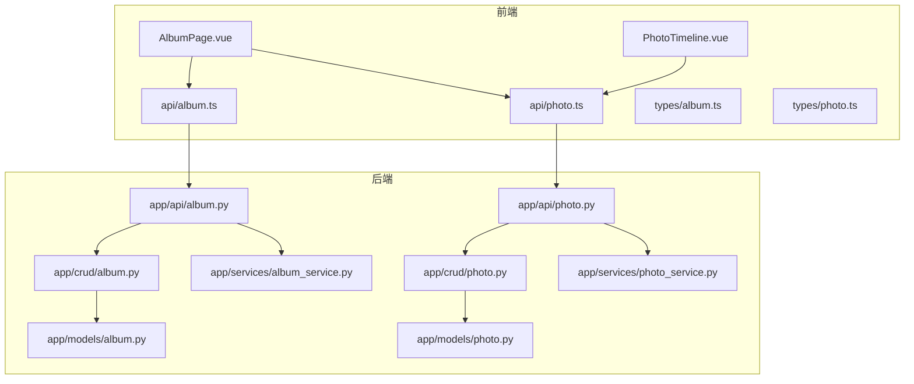
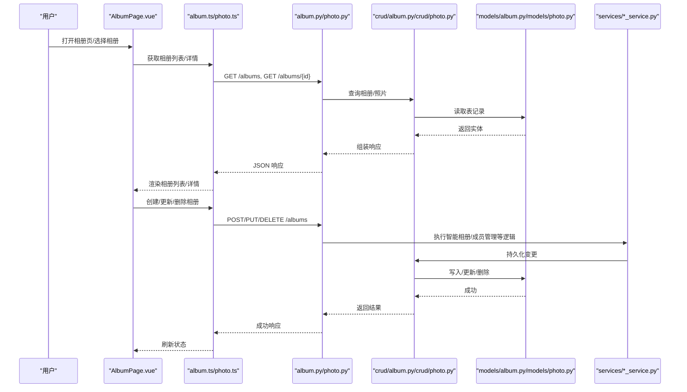
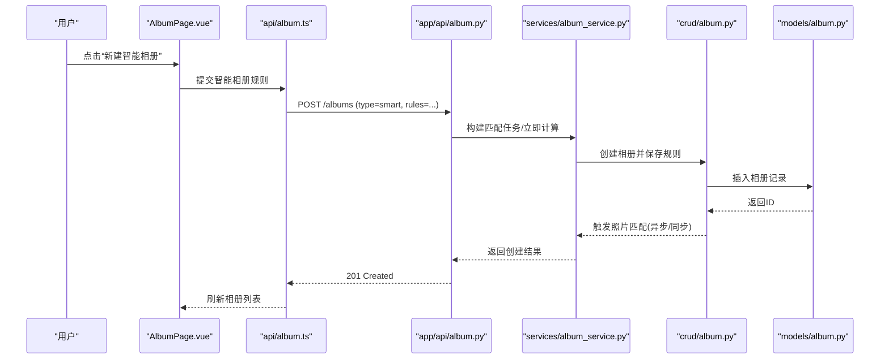
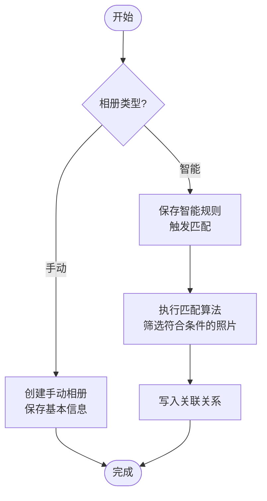
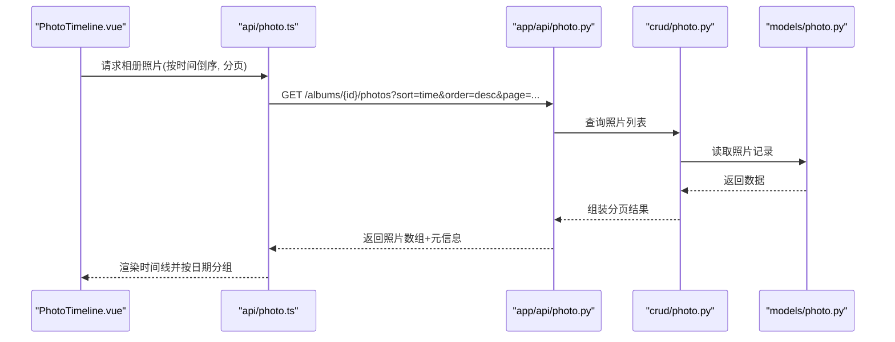
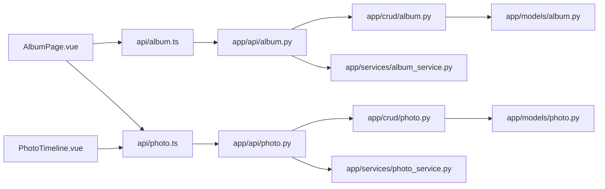

# 相册管理页面

<cite>
**本文引用的文件**   
- [AlbumPage.vue](file://frontend/src/views/AlbumPage.vue)
- [PhotoTimeline.vue](file://frontend/src/components/photo/PhotoTimeline.vue)
- [album.ts](file://frontend/src/api/album.ts)
- [photo.ts](file://frontend/src/api/photo.ts)
- [album.ts](file://frontend/src/types/album.ts)
- [photo.ts](file://frontend/src/types/photo.ts)
- [album.py](file://backend/app/api/album.py)
- [photo.py](file://backend/app/api/photo.py)
- [album.py](file://backend/app/crud/album.py)
- [photo.py](file://backend/app/crud/photo.py)
- [album.py](file://backend/app/models/album.py)
- [photo.py](file://backend/app/models/photo.py)
- [album_service.py](file://backend/app/services/album_service.py)
- [photo_service.py](file://backend/app/services/photo_service.py)
</cite>

## 目录
1. [简介](#简介)
2. [项目结构](#项目结构)
3. [核心组件](#核心组件)
4. [架构总览](#架构总览)
5. [详细组件分析](#详细组件分析)
6. [依赖关系分析](#依赖关系分析)
7. [性能考虑](#性能考虑)
8. [故障排查指南](#故障排查指南)
9. [结论](#结论)
10. [附录](#附录)

## 简介
本文件面向“相册管理页面”的前后端实现，围绕以下目标展开：
- 深入解析 AlbumPage.vue 的相册 CRUD、智能相册创建与成员管理。
- 详解 PhotoTimeline 时间线视图：按时间排序、日期分组、快速导航。
- 说明相册类型（手动 vs 智能）、权限控制与共享设置。
- 覆盖封面设置、批量添加/删除照片、相册统计信息展示。
- 提供数据同步、冲突解决与离线支持方案建议。

## 项目结构
前端采用 Vue + TypeScript，后端基于 FastAPI + SQLAlchemy。相册相关的关键路径如下：
- 前端视图与组件：views/AlbumPage.vue、components/photo/PhotoTimeline.vue
- 前端 API 客户端：api/album.ts、api/photo.ts
- 前端类型定义：types/album.ts、types/photo.ts
- 后端 API：app/api/album.py、app/api/photo.py
- 后端 CRUD：app/crud/album.py、app/crud/photo.py
- 后端模型：app/models/album.py、app/models/photo.py
- 后端服务：app/services/album_service.py、app/services/photo_service.py

图表来源
- [AlbumPage.vue](file://frontend/src/views/AlbumPage.vue)
- [PhotoTimeline.vue](file://frontend/src/components/photo/PhotoTimeline.vue)
- [album.ts](file://frontend/src/api/album.ts)
- [photo.ts](file://frontend/src/api/photo.ts)
- [album.py](file://backend/app/api/album.py)
- [photo.py](file://backend/app/api/photo.py)
- [album.py](file://backend/app/crud/album.py)
- [photo.py](file://backend/app/crud/photo.py)
- [album.py](file://backend/app/models/album.py)
- [photo.py](file://backend/app/models/photo.py)
- [album_service.py](file://backend/app/services/album_service.py)
- [photo_service.py](file://backend/app/services/photo_service.py)

章节来源
- [AlbumPage.vue](file://frontend/src/views/AlbumPage.vue)
- [PhotoTimeline.vue](file://frontend/src/components/photo/PhotoTimeline.vue)
- [album.ts](file://frontend/src/api/album.ts)
- [photo.ts](file://frontend/src/api/photo.ts)
- [album.py](file://backend/app/api/album.py)
- [photo.py](file://backend/app/api/photo.py)
- [album.py](file://backend/app/crud/album.py)
- [photo.py](file://backend/app/crud/photo.py)
- [album.py](file://backend/app/models/album.py)
- [photo.py](file://backend/app/models/photo.py)
- [album_service.py](file://backend/app/services/album_service.py)
- [photo_service.py](file://backend/app/services/photo_service.py)

## 核心组件
- AlbumPage.vue：相册列表、创建/编辑/删除、成员管理、智能相册规则配置、封面设置、批量操作入口、统计概览。
- PhotoTimeline.vue：时间线视图，按拍摄时间倒序排列，按日期分组，提供快速导航到指定日期。
- album.ts / photo.ts：封装相册与照片相关的 HTTP 请求，统一错误处理与参数校验。
- types/album.ts / types/photo.ts：前后端数据结构契约，确保类型安全。
- 后端 API/CRUD/Service/Model：REST 接口、数据库访问、业务逻辑分层清晰。

章节来源
- [AlbumPage.vue](file://frontend/src/views/AlbumPage.vue)
- [PhotoTimeline.vue](file://frontend/src/components/photo/PhotoTimeline.vue)
- [album.ts](file://frontend/src/api/album.ts)
- [photo.ts](file://frontend/src/api/photo.ts)
- [album.ts](file://frontend/src/types/album.ts)
- [photo.ts](file://frontend/src/types/photo.ts)

## 架构总览
整体采用前后端分离架构，前端通过 REST API 与后端交互；后端以 FastAPI 暴露接口，使用 SQLAlchemy 进行 ORM 操作，并通过 Service 层组织复杂业务（如智能相册匹配）。

图表来源
- [AlbumPage.vue](file://frontend/src/views/AlbumPage.vue)
- [album.ts](file://frontend/src/api/album.ts)
- [photo.ts](file://frontend/src/api/photo.ts)
- [album.py](file://backend/app/api/album.py)
- [photo.py](file://backend/app/api/photo.py)
- [album.py](file://backend/app/crud/album.py)
- [photo.py](file://backend/app/crud/photo.py)
- [album.py](file://backend/app/models/album.py)
- [photo.py](file://backend/app/models/photo.py)
- [album_service.py](file://backend/app/services/album_service.py)
- [photo_service.py](file://backend/app/services/photo_service.py)

## 详细组件分析

### AlbumPage.vue 组件分析
职责与功能要点：
- 相册 CRUD：创建、编辑、删除相册；支持手动相册与智能相册两种类型。
- 智能相册：通过规则条件（如标签、时间范围、地点等）自动匹配照片集合。
- 成员管理：邀请/移除成员，设置角色（管理员/普通成员），查看成员列表。
- 封面设置：从相册内选择或上传新图片作为封面。
- 批量操作：多选照片后批量添加到当前相册或批量移出。
- 统计信息：显示照片数量、成员数、最近更新时间等。
- 权限控制：根据当前用户角色限制可执行的操作（如删除、修改成员）。

关键流程（序列图）：

图表来源
- [AlbumPage.vue](file://frontend/src/views/AlbumPage.vue)
- [album.ts](file://frontend/src/api/album.ts)
- [album.py](file://backend/app/api/album.py)
- [album_service.py](file://backend/app/services/album_service.py)
- [album.py](file://backend/app/crud/album.py)
- [album.py](file://backend/app/models/album.py)

章节来源
- [AlbumPage.vue](file://frontend/src/views/AlbumPage.vue)
- [album.ts](file://frontend/src/api/album.ts)
- [album.py](file://backend/app/api/album.py)
- [album_service.py](file://backend/app/services/album_service.py)
- [album.py](file://backend/app/crud/album.py)
- [album.py](file://backend/app/models/album.py)

#### 智能相册创建流程图

图表来源
- [AlbumPage.vue](file://frontend/src/views/AlbumPage.vue)
- [album_service.py](file://backend/app/services/album_service.py)
- [album.py](file://backend/app/crud/album.py)
- [album.py](file://backend/app/models/album.py)

章节来源
- [AlbumPage.vue](file://frontend/src/views/AlbumPage.vue)
- [album_service.py](file://backend/app/services/album_service.py)
- [album.py](file://backend/app/crud/album.py)
- [album.py](file://backend/app/models/album.py)

#### 成员管理与权限控制
- 成员列表：展示已加入成员及其角色。
- 邀请/移除：管理员可邀请新用户或移除现有成员。
- 权限矩阵：
  - 所有者/管理员：增删改相册、管理成员、设置封面、删除相册。
  - 普通成员：查看、下载、添加/移除自己选中的照片（视策略而定）。
  - 未授权用户：无访问权限。
- 前端在调用前进行角色判断，后端在接口层再次校验。

章节来源
- [AlbumPage.vue](file://frontend/src/views/AlbumPage.vue)
- [album.py](file://backend/app/api/album.py)
- [album.py](file://backend/app/crud/album.py)
- [album.py](file://backend/app/models/album.py)

#### 封面设置与批量操作
- 封面设置：从相册照片网格中选择一张设为封面，或上传新图片。
- 批量添加：在照片库中勾选多张照片，一键加入当前相册。
- 批量删除：在相册内勾选多张照片，批量移出或删除。
- 反馈机制：操作进行中显示进度，完成后刷新列表与统计。

章节来源
- [AlbumPage.vue](file://frontend/src/views/AlbumPage.vue)
- [photo.ts](file://frontend/src/api/photo.ts)
- [photo.py](file://backend/app/api/photo.py)
- [photo_service.py](file://backend/app/services/photo_service.py)
- [photo.py](file://backend/app/crud/photo.py)
- [photo.py](file://backend/app/models/photo.py)

#### 统计信息展示
- 指标项：照片总数、成员数、最近更新时间、智能规则命中次数等。
- 数据来源：相册详情接口聚合返回，或由前端本地计算。
- 更新时机：相册内容变更后主动刷新统计。

章节来源
- [AlbumPage.vue](file://frontend/src/views/AlbumPage.vue)
- [album.ts](file://frontend/src/api/album.ts)
- [album.py](file://backend/app/api/album.py)

### PhotoTimeline.vue 组件分析
职责与功能要点：
- 时间线视图：按照片拍摄时间倒序排列，形成连续的时间轴。
- 日期分组：将同一天的照片归为一组，便于浏览。
- 快速导航：侧边栏或顶部索引条跳转到指定日期。
- 懒加载/分页：滚动到底部时加载更多，提升大相册性能。
- 与相册联动：仅展示当前相册内的照片，支持切换相册实时刷新。

关键流程（时序图）：

图表来源
- [PhotoTimeline.vue](file://frontend/src/components/photo/PhotoTimeline.vue)
- [photo.ts](file://frontend/src/api/photo.ts)
- [photo.py](file://backend/app/api/photo.py)
- [photo.py](file://backend/app/crud/photo.py)
- [photo.py](file://backend/app/models/photo.py)

章节来源
- [PhotoTimeline.vue](file://frontend/src/components/photo/PhotoTimeline.vue)
- [photo.ts](file://frontend/src/api/photo.ts)
- [photo.py](file://backend/app/api/photo.py)
- [photo.py](file://backend/app/crud/photo.py)
- [photo.py](file://backend/app/models/photo.py)

#### 时间线渲染与快速导航
- 排序策略：优先使用 EXIF 拍摄时间，缺失则回退至上传时间。
- 分组策略：按本地时区日期切分，避免跨日问题。
- 导航实现：生成日期锚点，点击平滑滚动到对应分组。
- 性能优化：虚拟滚动或按需加载，减少首屏渲染压力。

章节来源
- [PhotoTimeline.vue](file://frontend/src/components/photo/PhotoTimeline.vue)
- [photo.ts](file://frontend/src/api/photo.ts)
- [photo.py](file://backend/app/api/photo.py)

## 依赖关系分析
- 前端依赖：
  - AlbumPage.vue 依赖 api/album.ts、api/photo.ts 与 types/album.ts、types/photo.ts。
  - PhotoTimeline.vue 依赖 api/photo.ts 与 types/photo.ts。
- 后端依赖：
  - app/api/* 依赖 app/crud/* 与 app/services/*。
  - app/crud/* 依赖 app/models/* 与数据库会话。
  - app/services/* 可能依赖外部服务（如 AI 向量检索、EXIF 解析等）。

图表来源
- [AlbumPage.vue](file://frontend/src/views/AlbumPage.vue)
- [PhotoTimeline.vue](file://frontend/src/components/photo/PhotoTimeline.vue)
- [album.ts](file://frontend/src/api/album.ts)
- [photo.ts](file://frontend/src/api/photo.ts)
- [album.py](file://backend/app/api/album.py)
- [photo.py](file://backend/app/api/photo.py)
- [album.py](file://backend/app/crud/album.py)
- [photo.py](file://backend/app/crud/photo.py)
- [album.py](file://backend/app/models/album.py)
- [photo.py](file://backend/app/models/photo.py)
- [album_service.py](file://backend/app/services/album_service.py)
- [photo_service.py](file://backend/app/services/photo_service.py)

章节来源
- [AlbumPage.vue](file://frontend/src/views/AlbumPage.vue)
- [PhotoTimeline.vue](file://frontend/src/components/photo/PhotoTimeline.vue)
- [album.ts](file://frontend/src/api/album.ts)
- [photo.ts](file://frontend/src/api/photo.ts)
- [album.py](file://backend/app/api/album.py)
- [photo.py](file://backend/app/api/photo.py)
- [album.py](file://backend/app/crud/album.py)
- [photo.py](file://backend/app/crud/photo.py)
- [album.py](file://backend/app/models/album.py)
- [photo.py](file://backend/app/models/photo.py)
- [album_service.py](file://backend/app/services/album_service.py)
- [photo_service.py](file://backend/app/services/photo_service.py)

## 性能考虑
- 前端
  - 列表分页与懒加载：相册列表与时间线均应采用分页，避免一次性加载大量数据。
  - 图片优化：缩略图与主图分离，按需加载大图；启用浏览器缓存与 CDN。
  - 防抖与节流：搜索、筛选、滚动事件需做防抖/节流，降低重排重绘。
  - 虚拟滚动：长列表场景建议使用虚拟滚动技术。
- 后端
  - 查询优化：为常用排序字段（拍摄时间、上传时间）建立索引；合理使用 JOIN 与投影列。
  - 异步任务：智能相册匹配、封面生成、缩略图生成应放入任务队列异步执行。
  - 缓存策略：对热点相册的统计信息与元数据使用缓存（如 Redis）。
  - 事务与锁：批量操作使用事务保证一致性，必要时加行级锁避免并发冲突。

[本节为通用指导，不直接分析具体文件]

## 故障排查指南
- 常见问题
  - 智能相册无结果：检查规则条件是否过严；确认照片具备必要元数据（如标签、时间、地点）。
  - 封面设置失败：确认所选照片存在且未被删除；检查存储路径与权限。
  - 成员无法访问：核对成员角色与权限策略；检查后端鉴权中间件日志。
  - 时间线错位：确认 EXIF 时间有效性与时区转换逻辑；必要时回退到上传时间。
- 定位方法
  - 前端：打开开发者工具 Network 面板，查看请求/响应体与状态码；Console 查看异常堆栈。
  - 后端：查看应用日志，关注错误级别日志与慢查询；必要时开启 SQL 日志。
  - 数据库：检查索引命中率与慢查询；验证外键约束与唯一性约束。
- 恢复建议
  - 重试机制：网络抖动导致的失败应带指数退避重试。
  - 幂等设计：批量操作接口应具备幂等键，防止重复提交导致数据不一致。
  - 回滚策略：事务失败时自动回滚，保持数据一致。

章节来源
- [AlbumPage.vue](file://frontend/src/views/AlbumPage.vue)
- [PhotoTimeline.vue](file://frontend/src/components/photo/PhotoTimeline.vue)
- [album.py](file://backend/app/api/album.py)
- [photo.py](file://backend/app/api/photo.py)
- [album_service.py](file://backend/app/services/album_service.py)
- [photo_service.py](file://backend/app/services/photo_service.py)

## 结论
AlbumPage.vue 与 PhotoTimeline.vue 共同构成了相册管理的核心体验：前者负责相册生命周期与协作能力，后者提供高效的时间线浏览。通过清晰的 API 分层与 Service 抽象，系统具备良好的扩展性与可维护性。建议在后续迭代中强化异步任务、缓存与索引优化，以提升大规模相册场景下的性能与稳定性。

[本节为总结性内容，不直接分析具体文件]

## 附录
- 术语
  - 手动相册：由用户手动挑选照片组成的相册。
  - 智能相册：基于规则自动匹配照片集合的相册。
  - 时间线：按时间顺序组织照片的视图模式。
- 参考文件
  - 前端：AlbumPage.vue、PhotoTimeline.vue、api/album.ts、api/photo.ts、types/album.ts、types/photo.ts
  - 后端：app/api/album.py、app/api/photo.py、app/crud/album.py、app/crud/photo.py、app/models/album.py、app/models/photo.py、app/services/album_service.py、app/services/photo_service.py

[本节为补充信息，不直接分析具体文件]