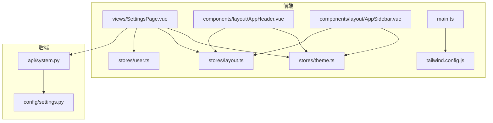
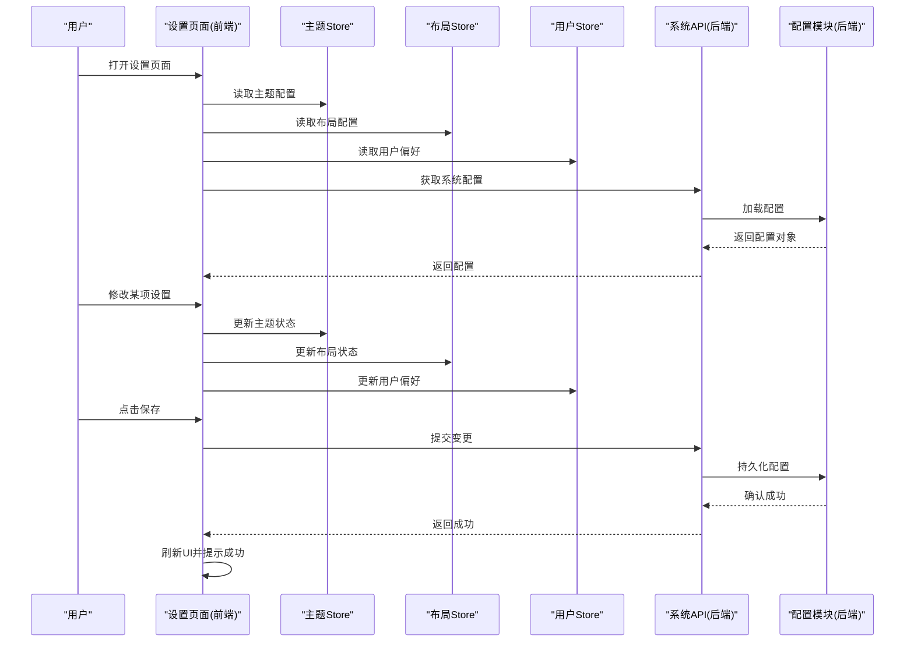
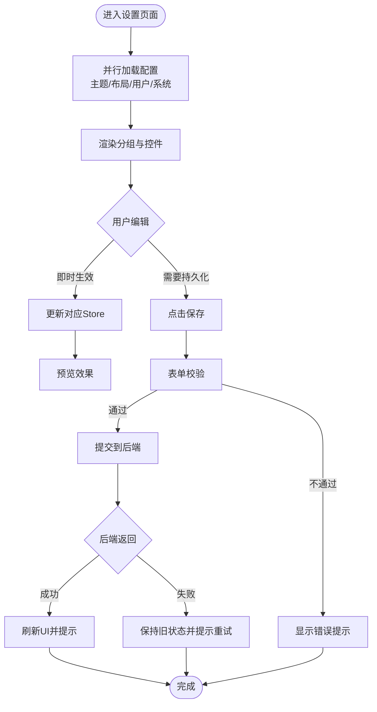
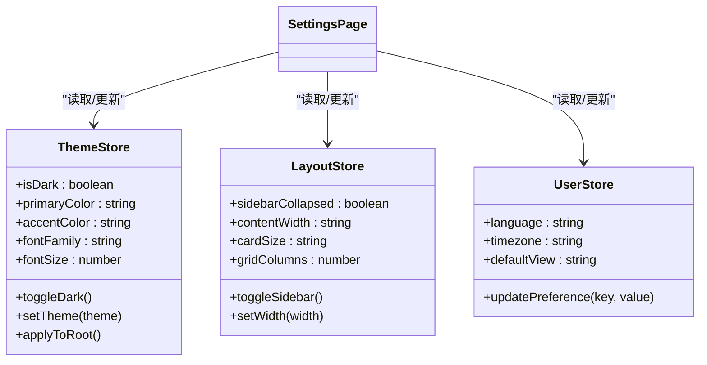
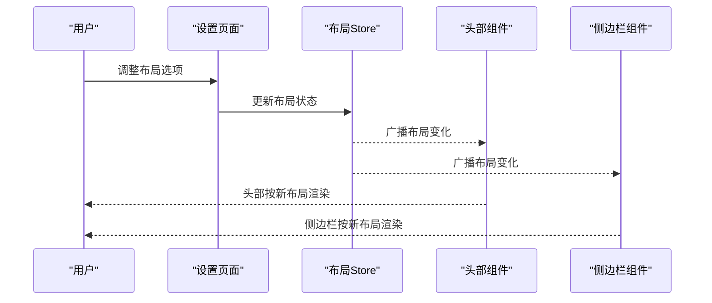
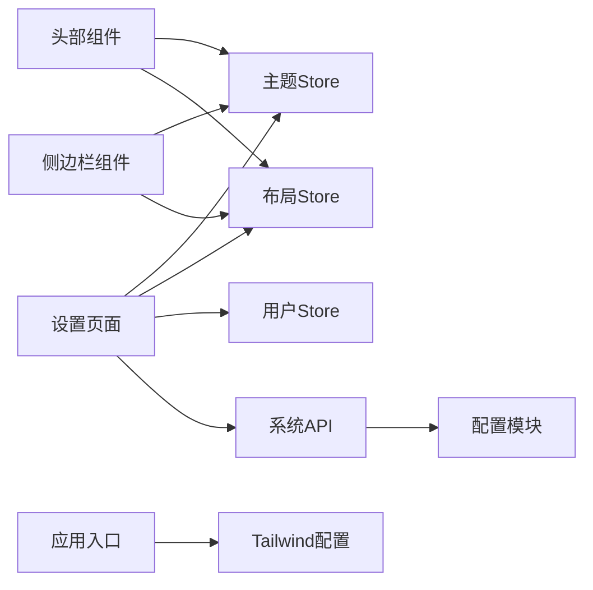

# 系统设置页面

<cite>
**本文引用的文件**   
- [SettingsPage.vue](file://frontend/src/views/SettingsPage.vue)
- [theme.ts](file://frontend/src/stores/theme.ts)
- [layout.ts](file://frontend/src/stores/layout.ts)
- [user.ts](file://frontend/src/stores/user.ts)
- [AppHeader.vue](file://frontend/src/components/layout/AppHeader.vue)
- [AppSidebar.vue](file://frontend/src/components/layout/AppSidebar.vue)
- [main.ts](file://frontend/src/main.ts)
- [tailwind.config.js](file://frontend/tailwind.config.js)
- [system.py](file://backend/app/api/system.py)
- [settings.py](file://backend/app/config/settings.py)
</cite>

## 目录
1. [简介](#简介)
2. [项目结构](#项目结构)
3. [核心组件](#核心组件)
4. [架构总览](#架构总览)
5. [详细组件分析](#详细组件分析)
6. [依赖分析](#依赖分析)
7. [性能考虑](#性能考虑)
8. [故障排查指南](#故障排查指南)
9. [结论](#结论)
10. [附录](#附录)

## 简介
本指南面向前端与后端开发者，系统化阐述“系统设置页面”的设计与实现。内容覆盖设置项分类、配置管理、用户偏好、主题切换（明暗模式、颜色定制、字体）、布局配置、通知设置、存储管理与备份恢复、本地与云端同步、版本兼容、表单验证、导入导出与重置等能力，并提供用户体验与可访问性方案建议。

## 项目结构
前端采用 Vue 3 + TypeScript + Pinia 的状态管理模式，设置相关视图位于 views 目录，主题与布局状态由独立的 store 管理；后端提供系统配置 API 与持久化配置模块。

图表来源
- [SettingsPage.vue](file://frontend/src/views/SettingsPage.vue)
- [theme.ts](file://frontend/src/stores/theme.ts)
- [layout.ts](file://frontend/src/stores/layout.ts)
- [user.ts](file://frontend/src/stores/user.ts)
- [AppHeader.vue](file://frontend/src/components/layout/AppHeader.vue)
- [AppSidebar.vue](file://frontend/src/components/layout/AppSidebar.vue)
- [main.ts](file://frontend/src/main.ts)
- [tailwind.config.js](file://frontend/tailwind.config.js)
- [system.py](file://backend/app/api/system.py)
- [settings.py](file://backend/app/config/settings.py)

章节来源
- [SettingsPage.vue](file://frontend/src/views/SettingsPage.vue)
- [theme.ts](file://frontend/src/stores/theme.ts)
- [layout.ts](file://frontend/src/stores/layout.ts)
- [user.ts](file://frontend/src/stores/user.ts)
- [AppHeader.vue](file://frontend/src/components/layout/AppHeader.vue)
- [AppSidebar.vue](file://frontend/src/components/layout/AppSidebar.vue)
- [main.ts](file://frontend/src/main.ts)
- [tailwind.config.js](file://frontend/tailwind.config.js)
- [system.py](file://backend/app/api/system.py)
- [settings.py](file://backend/app/config/settings.py)

## 核心组件
- 设置页面容器：负责分组展示设置项、承载各子面板的交互与数据绑定。
- 主题状态管理：集中管理明暗模式、主色、字体族与字号等全局样式变量。
- 布局状态管理：控制侧边栏、头部、内容区宽度与折叠状态。
- 用户偏好：语言、时区、默认视图等个人化选项。
- 系统配置接口：读取/写入后端系统级配置（如存储路径、任务调度参数）。

章节来源
- [SettingsPage.vue](file://frontend/src/views/SettingsPage.vue)
- [theme.ts](file://frontend/src/stores/theme.ts)
- [layout.ts](file://frontend/src/stores/layout.ts)
- [user.ts](file://frontend/src/stores/user.ts)
- [system.py](file://backend/app/api/system.py)

## 架构总览
设置功能的前后端交互遵循“前端状态驱动 + 后端持久化”的模式。前端通过 Pinia 维护 UI 状态，并在保存时调用后端 API 进行持久化；同时支持本地缓存以提升响应速度。

图表来源
- [SettingsPage.vue](file://frontend/src/views/SettingsPage.vue)
- [theme.ts](file://frontend/src/stores/theme.ts)
- [layout.ts](file://frontend/src/stores/layout.ts)
- [user.ts](file://frontend/src/stores/user.ts)
- [system.py](file://backend/app/api/system.py)
- [settings.py](file://backend/app/config/settings.py)

## 详细组件分析

### 设置项分类与页面组织
- 通用设置：语言、时区、默认视图、消息通知开关等。
- 外观与主题：明暗模式、主色、强调色、字体族、字号、行高。
- 布局与导航：侧边栏展开/收起、顶部信息密度、卡片尺寸、网格列数。
- 存储与备份：本地存储配额、自动备份开关、备份周期、云存储接入。
- 系统与高级：日志级别、调试开关、模型路径、任务并发度。
- 账户与安全：密码修改、两步验证、会话超时。

建议以“分组+标签页/手风琴”形式组织，保证长列表的可扫描性与操作一致性。

章节来源
- [SettingsPage.vue](file://frontend/src/views/SettingsPage.vue)

### 配置管理与数据流
- 初始化：页面挂载时并行拉取主题、布局、用户偏好与系统配置，填充到对应 Store。
- 变更：用户输入直接更新 Store 中的局部状态，避免频繁网络请求。
- 保存：批量合并变更，调用统一保存接口，成功后触发 UI 刷新与提示。
- 回滚：保存失败时保留上次有效状态，必要时提供“撤销最近更改”。

图表来源
- [SettingsPage.vue](file://frontend/src/views/SettingsPage.vue)
- [theme.ts](file://frontend/src/stores/theme.ts)
- [layout.ts](file://frontend/src/stores/layout.ts)
- [user.ts](file://frontend/src/stores/user.ts)
- [system.py](file://backend/app/api/system.py)

章节来源
- [SettingsPage.vue](file://frontend/src/views/SettingsPage.vue)
- [theme.ts](file://frontend/src/stores/theme.ts)
- [layout.ts](file://frontend/src/stores/layout.ts)
- [user.ts](file://frontend/src/stores/user.ts)
- [system.py](file://backend/app/api/system.py)

### 主题切换：明暗模式、颜色定制、字体设置
- 明暗模式：通过根节点类名或 CSS 变量切换，配合 Tailwind 的 dark 策略。
- 颜色定制：定义语义化颜色令牌（主色、强调色、背景、文本），在 Store 中集中管理。
- 字体设置：字体族与字号作为全局变量，支持实时预览与持久化。

图表来源
- [theme.ts](file://frontend/src/stores/theme.ts)
- [layout.ts](file://frontend/src/stores/layout.ts)
- [user.ts](file://frontend/src/stores/user.ts)
- [SettingsPage.vue](file://frontend/src/views/SettingsPage.vue)

章节来源
- [theme.ts](file://frontend/src/stores/theme.ts)
- [layout.ts](file://frontend/src/stores/layout.ts)
- [user.ts](file://frontend/src/stores/user.ts)
- [SettingsPage.vue](file://frontend/src/views/SettingsPage.vue)
- [tailwind.config.js](file://frontend/tailwind.config.js)

### 布局配置与导航联动
- 侧边栏与头部：根据布局状态动态调整宽度与折叠行为，确保设置页与其他页面一致。
- 内容密度：提供紧凑/舒适两种密度，影响间距与字号。
- 网格与卡片：根据屏幕尺寸与用户偏好自适应列数与卡片尺寸。

图表来源
- [layout.ts](file://frontend/src/stores/layout.ts)
- [AppHeader.vue](file://frontend/src/components/layout/AppHeader.vue)
- [AppSidebar.vue](file://frontend/src/components/layout/AppSidebar.vue)
- [SettingsPage.vue](file://frontend/src/views/SettingsPage.vue)

章节来源
- [layout.ts](file://frontend/src/stores/layout.ts)
- [AppHeader.vue](file://frontend/src/components/layout/AppHeader.vue)
- [AppSidebar.vue](file://frontend/src/components/layout/AppSidebar.vue)
- [SettingsPage.vue](file://frontend/src/views/SettingsPage.vue)

### 通知设置
- 通知渠道：站内通知、邮件、Webhook 等。
- 通知规则：事件类型、频率限制、静默时段。
- 测试与验证：发送测试通知，记录回执与错误码。

章节来源
- [SettingsPage.vue](file://frontend/src/views/SettingsPage.vue)

### 存储管理与备份恢复
- 存储管理：查看使用量、清理临时文件、迁移存储路径。
- 备份策略：全量/增量、定时任务、目标位置（本地/云）。
- 恢复流程：选择备份点、校验完整性、执行恢复、回滚机制。

章节来源
- [SettingsPage.vue](file://frontend/src/views/SettingsPage.vue)
- [system.py](file://backend/app/api/system.py)

### 设置数据的本地存储、云端同步与版本兼容
- 本地存储：将关键偏好缓存至浏览器本地存储，提升首屏体验。
- 云端同步：登录态下将设置同步至后端，多端一致。
- 版本兼容：为配置对象增加版本号字段，迁移脚本在启动时处理升级逻辑。

章节来源
- [theme.ts](file://frontend/src/stores/theme.ts)
- [layout.ts](file://frontend/src/stores/layout.ts)
- [user.ts](file://frontend/src/stores/user.ts)
- [system.py](file://backend/app/api/system.py)
- [settings.py](file://backend/app/config/settings.py)

### 表单验证、配置导入导出与设置重置
- 表单验证：必填、范围、格式、唯一性等规则，实时反馈与汇总提示。
- 导入导出：支持 JSON/YAML 格式的导出与导入，包含差异对比与冲突解决。
- 设置重置：一键恢复默认值，二次确认与不可逆风险提示。

章节来源
- [SettingsPage.vue](file://frontend/src/views/SettingsPage.vue)

### 用户体验设计与可访问性
- 交互一致性：统一的按钮样式、提示文案、成功/失败反馈。
- 可访问性：键盘可达、焦点顺序合理、ARIA 标签完善、色彩对比度达标。
- 国际化：所有可见文案走 i18n，支持运行时切换语言。

章节来源
- [SettingsPage.vue](file://frontend/src/views/SettingsPage.vue)
- [main.ts](file://frontend/src/main.ts)

## 依赖分析
- 前端内部依赖：设置页面依赖三个 Store（主题、布局、用户）以及布局组件（头部、侧边栏）。
- 前后端集成：设置页面通过系统 API 读写后端配置模块。
- 构建与样式：Tailwind 配置提供主题与暗色模式基础能力。

图表来源
- [SettingsPage.vue](file://frontend/src/views/SettingsPage.vue)
- [theme.ts](file://frontend/src/stores/theme.ts)
- [layout.ts](file://frontend/src/stores/layout.ts)
- [user.ts](file://frontend/src/stores/user.ts)
- [AppHeader.vue](file://frontend/src/components/layout/AppHeader.vue)
- [AppSidebar.vue](file://frontend/src/components/layout/AppSidebar.vue)
- [system.py](file://backend/app/api/system.py)
- [settings.py](file://backend/app/config/settings.py)
- [main.ts](file://frontend/src/main.ts)
- [tailwind.config.js](file://frontend/tailwind.config.js)

章节来源
- [SettingsPage.vue](file://frontend/src/views/SettingsPage.vue)
- [theme.ts](file://frontend/src/stores/theme.ts)
- [layout.ts](file://frontend/src/stores/layout.ts)
- [user.ts](file://frontend/src/stores/user.ts)
- [AppHeader.vue](file://frontend/src/components/layout/AppHeader.vue)
- [AppSidebar.vue](file://frontend/src/components/layout/AppSidebar.vue)
- [system.py](file://backend/app/api/system.py)
- [settings.py](file://backend/app/config/settings.py)
- [main.ts](file://frontend/src/main.ts)
- [tailwind.config.js](file://frontend/tailwind.config.js)

## 性能考虑
- 懒加载与分页：大型设置分组按需加载，减少首屏体积。
- 防抖与节流：对高频输入（如搜索过滤、字号预览）做节流/防抖。
- 批量保存：合并多次变更，降低网络开销。
- 缓存策略：优先从本地缓存读取，后台异步同步后端。

[本节为通用指导，无需源码引用]

## 故障排查指南
- 保存失败：检查网络连通与后端健康状态，查看错误码与日志定位原因。
- 主题不生效：确认根节点类名与 CSS 变量注入是否正确，检查 Tailwind 配置是否启用暗色模式。
- 布局错乱：核对布局 Store 的初始值与边界条件，检查响应式断点。
- 备份异常：校验备份文件完整性与权限，确认目标存储可用。

章节来源
- [system.py](file://backend/app/api/system.py)
- [settings.py](file://backend/app/config/settings.py)
- [theme.ts](file://frontend/src/stores/theme.ts)
- [layout.ts](file://frontend/src/stores/layout.ts)

## 结论
通过清晰的分组与状态管理，结合前后端协同的配置持久化机制，系统设置页面能够提供稳定、可扩展且友好的配置体验。建议在后续迭代中持续完善导入导出、版本迁移与可观测性，进一步提升运维效率与用户满意度。

[本节为总结性内容，无需源码引用]

## 附录
- 术语表
  - 主题：明暗模式、颜色令牌、字体等视觉风格集合。
  - 布局：界面结构与空间分配策略。
  - 配置：系统运行所需的关键参数集合。
- 参考文件
  - 前端：设置页面、主题/布局/用户 Store、布局组件、应用入口、样式配置。
  - 后端：系统 API、配置模块。

[本节为补充说明，无需源码引用]