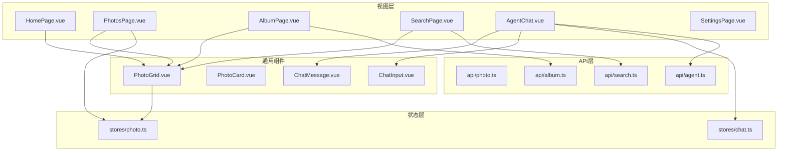
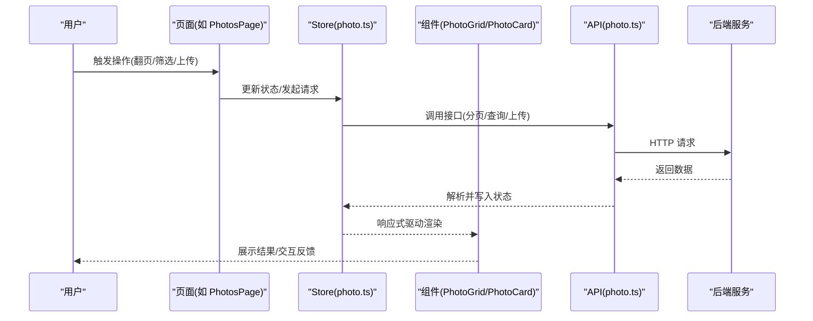
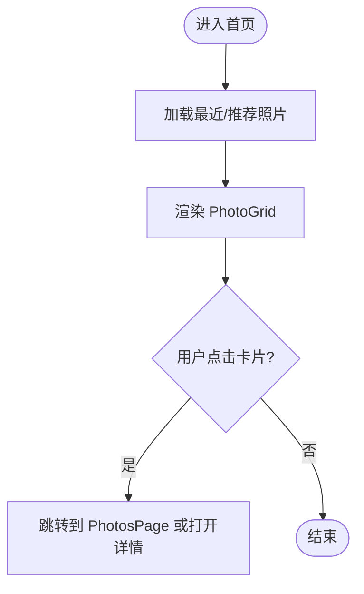
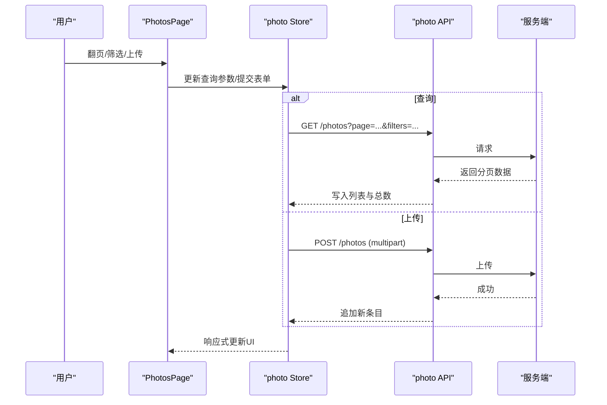
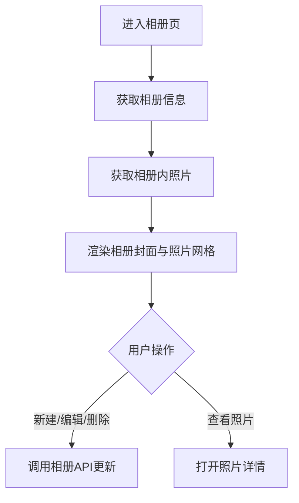
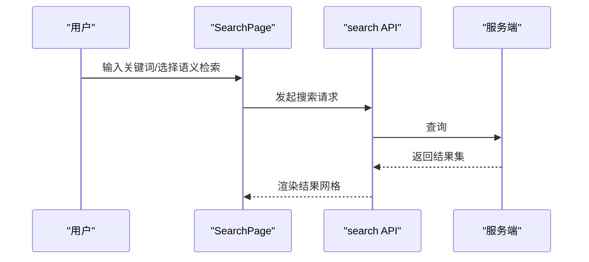
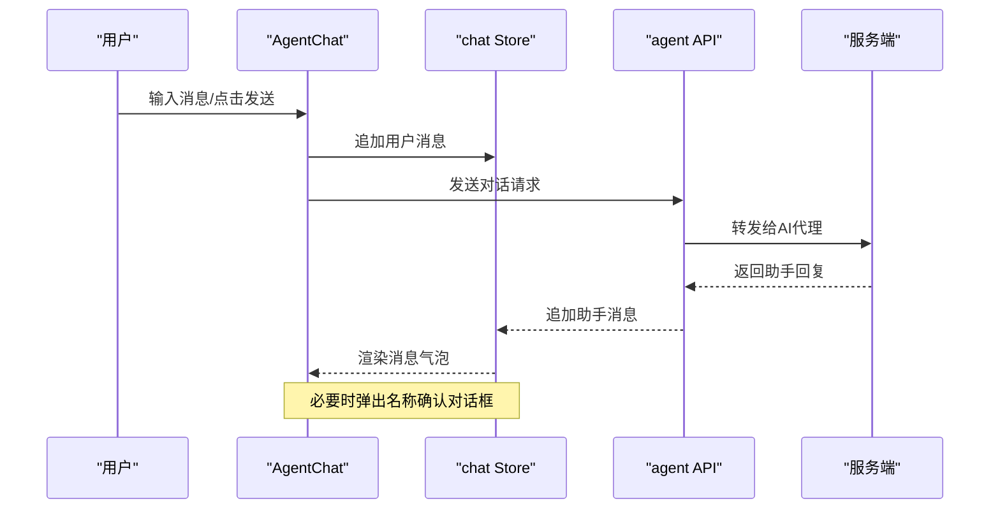
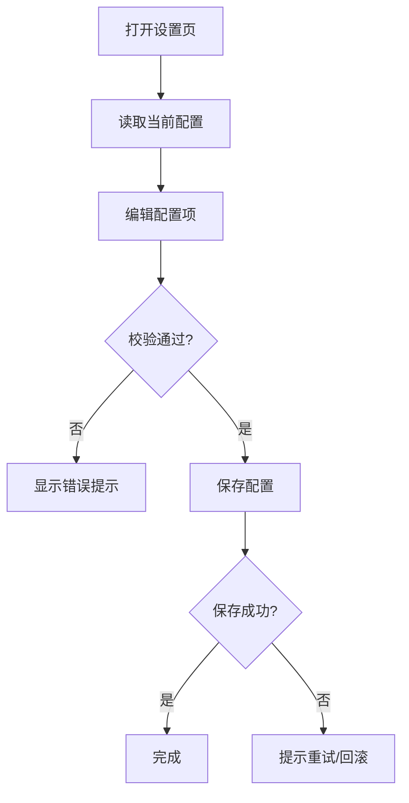
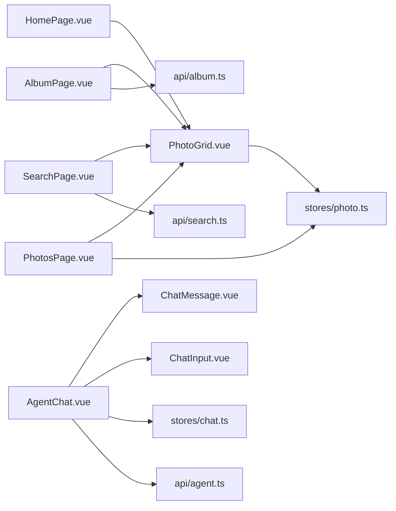

# 页面开发

<cite>
**本文引用的文件**   
- [frontend/src/views/HomePage.vue](file://frontend/src/views/HomePage.vue)
- [frontend/src/views/PhotosPage.vue](file://frontend/src/views/PhotosPage.vue)
- [frontend/src/views/AlbumPage.vue](file://frontend/src/views/AlbumPage.vue)
- [frontend/src/views/SearchPage.vue](file://frontend/src/views/SearchPage.vue)
- [frontend/src/views/AgentChat.vue](file://frontend/src/views/AgentChat.vue)
- [frontend/src/views/SettingsPage.vue](file://frontend/src/views/SettingsPage.vue)
- [frontend/src/components/photo/PhotoGrid.vue](file://frontend/src/components/photo/PhotoGrid.vue)
- [frontend/src/components/photo/PhotoCard.vue](file://frontend/src/components/photo/PhotoCard.vue)
- [frontend/src/components/chat/ChatMessage.vue](file://frontend/src/components/chat/ChatMessage.vue)
- [frontend/src/components/chat/ChatInput.vue](file://frontend/src/components/chat/ChatInput.vue)
- [frontend/src/stores/photo.ts](file://frontend/src/stores/photo.ts)
- [frontend/src/stores/chat.ts](file://frontend/src/stores/chat.ts)
- [frontend/src/api/photo.ts](file://frontend/src/api/photo.ts)
- [frontend/src/api/album.ts](file://frontend/src/api/album.ts)
- [frontend/src/api/search.ts](file://frontend/src/api/search.ts)
- [frontend/src/api/agent.ts](file://frontend/src/api/agent.ts)
- [frontend/src/router/index.ts](file://frontend/src/router/index.ts)
</cite>

## 目录
1. [简介](#简介)
2. [项目结构](#项目结构)
3. [核心组件与页面](#核心组件与页面)
4. [架构总览](#架构总览)
5. [详细组件分析](#详细组件分析)
6. [依赖关系分析](#依赖关系分析)
7. [性能优化与体验提升](#性能优化与体验提升)
8. [测试策略](#测试策略)
9. [故障排查指南](#故障排查指南)
10. [结论](#结论)

## 简介
本指南面向前端开发者，围绕 AI 相册的前端页面实现，系统性梳理六大核心页面的设计模式、数据流、交互流程与性能优化方案。重点覆盖：
- HomePage 首页照片网格展示
- PhotosPage 照片管理（上传、批量操作、分页）
- AlbumPage 相册浏览与筛选
- SearchPage 智能搜索（关键词、语义检索）
- AgentChat AI 聊天界面（对话、名称确认）
- SettingsPage 系统设置（主题、偏好）

文档同时提供响应式布局、图片懒加载、虚拟滚动、错误处理与监控等最佳实践，并给出可落地的测试策略与性能观测方法。

## 项目结构
前端采用 Vue 3 + TypeScript + Vite 技术栈，按“视图层-组件层-状态层-API层”分层组织。路由集中管理，Store 使用组合式状态管理，API 封装统一请求。

图表来源
- [frontend/src/views/HomePage.vue](file://frontend/src/views/HomePage.vue)
- [frontend/src/views/PhotosPage.vue](file://frontend/src/views/PhotosPage.vue)
- [frontend/src/views/AlbumPage.vue](file://frontend/src/views/AlbumPage.vue)
- [frontend/src/views/SearchPage.vue](file://frontend/src/views/SearchPage.vue)
- [frontend/src/views/AgentChat.vue](file://frontend/src/views/AgentChat.vue)
- [frontend/src/views/SettingsPage.vue](file://frontend/src/views/SettingsPage.vue)
- [frontend/src/components/photo/PhotoGrid.vue](file://frontend/src/components/photo/PhotoGrid.vue)
- [frontend/src/components/photo/PhotoCard.vue](file://frontend/src/components/photo/PhotoCard.vue)
- [frontend/src/components/chat/ChatMessage.vue](file://frontend/src/components/chat/ChatMessage.vue)
- [frontend/src/components/chat/ChatInput.vue](file://frontend/src/components/chat/ChatInput.vue)
- [frontend/src/stores/photo.ts](file://frontend/src/stores/photo.ts)
- [frontend/src/stores/chat.ts](file://frontend/src/stores/chat.ts)
- [frontend/src/api/photo.ts](file://frontend/src/api/photo.ts)
- [frontend/src/api/album.ts](file://frontend/src/api/album.ts)
- [frontend/src/api/search.ts](file://frontend/src/api/search.ts)
- [frontend/src/api/agent.ts](file://frontend/src/api/agent.ts)

章节来源
- [frontend/src/router/index.ts](file://frontend/src/router/index.ts)

## 核心组件与页面
本节概述各页面的职责与关键能力，便于快速定位与理解整体分工。

- HomePage 首页照片网格
  - 展示最近或推荐照片的网格视图
  - 支持点击跳转至 PhotosPage 或打开详情抽屉
  - 复用 PhotoGrid 与 PhotoCard 组件

- PhotosPage 照片管理
  - 列表/网格切换、分页、排序、筛选
  - 上传、删除、批量选择与操作
  - 通过 Store 聚合照片数据与选中态

- AlbumPage 相册浏览
  - 相册列表与封面图展示
  - 进入相册后展示其包含的照片网格
  - 调用相册 API 获取元信息与成员

- SearchPage 智能搜索
  - 关键词搜索与语义检索入口
  - 结果以网格形式呈现，支持高亮与快捷操作
  - 与搜索 API 对接，支持分页与缓存

- AgentChat AI 聊天界面
  - 消息气泡渲染、输入框、发送与历史
  - 名称确认弹窗（如人脸识别后的姓名确认）
  - 与 Agent API 进行对话交互

- SettingsPage 系统设置
  - 主题切换、语言、隐私与存储路径等配置
  - 保存设置到后端或本地持久化

章节来源
- [frontend/src/views/HomePage.vue](file://frontend/src/views/HomePage.vue)
- [frontend/src/views/PhotosPage.vue](file://frontend/src/views/PhotosPage.vue)
- [frontend/src/views/AlbumPage.vue](file://frontend/src/views/AlbumPage.vue)
- [frontend/src/views/SearchPage.vue](file://frontend/src/views/SearchPage.vue)
- [frontend/src/views/AgentChat.vue](file://frontend/src/views/AgentChat.vue)
- [frontend/src/views/SettingsPage.vue](file://frontend/src/views/SettingsPage.vue)

## 架构总览
页面到组件、状态与 API 的单向数据流如下：

图表来源
- [frontend/src/views/PhotosPage.vue](file://frontend/src/views/PhotosPage.vue)
- [frontend/src/components/photo/PhotoGrid.vue](file://frontend/src/components/photo/PhotoGrid.vue)
- [frontend/src/components/photo/PhotoCard.vue](file://frontend/src/components/photo/PhotoCard.vue)
- [frontend/src/stores/photo.ts](file://frontend/src/stores/photo.ts)
- [frontend/src/api/photo.ts](file://frontend/src/api/photo.ts)

## 详细组件分析

### HomePage 首页照片网格
- 设计模式
  - 容器-展示分离：HomePage 负责路由与数据准备，PhotoGrid/PhotoCard 专注渲染
  - 响应式网格：基于 CSS Grid/Flex 自适应列数
- 数据流
  - 从 photo Store 拉取最近/推荐数据，或直接调用 photo API
  - 点击卡片触发导航或打开详情抽屉
- 交互与体验
  - 首屏优先加载缩略图，悬停显示操作按钮
  - 空状态与骨架屏提示

图表来源
- [frontend/src/views/HomePage.vue](file://frontend/src/views/HomePage.vue)
- [frontend/src/components/photo/PhotoGrid.vue](file://frontend/src/components/photo/PhotoGrid.vue)
- [frontend/src/components/photo/PhotoCard.vue](file://frontend/src/components/photo/PhotoCard.vue)

章节来源
- [frontend/src/views/HomePage.vue](file://frontend/src/views/HomePage.vue)
- [frontend/src/components/photo/PhotoGrid.vue](file://frontend/src/components/photo/PhotoGrid.vue)
- [frontend/src/components/photo/PhotoCard.vue](file://frontend/src/components/photo/PhotoCard.vue)

### PhotosPage 照片管理
- 功能要点
  - 分页、排序、筛选（时间、标签、人物等）
  - 上传与批量操作（删除、移动至相册）
  - 选中态管理与多选工具栏
- 数据流
  - 通过 photo Store 维护列表、分页参数与选中项
  - 上传走 multipart/form-data，成功后刷新列表
- 性能优化
  - 图片懒加载与占位图
  - 大列表场景启用虚拟滚动（见“性能优化”节）

图表来源
- [frontend/src/views/PhotosPage.vue](file://frontend/src/views/PhotosPage.vue)
- [frontend/src/stores/photo.ts](file://frontend/src/stores/photo.ts)
- [frontend/src/api/photo.ts](file://frontend/src/api/photo.ts)

章节来源
- [frontend/src/views/PhotosPage.vue](file://frontend/src/views/PhotosPage.vue)
- [frontend/src/stores/photo.ts](file://frontend/src/stores/photo.ts)
- [frontend/src/api/photo.ts](file://frontend/src/api/photo.ts)

### AlbumPage 相册浏览
- 功能要点
  - 相册列表与封面图展示
  - 进入相册后展示其照片网格
  - 支持创建/编辑/删除相册
- 数据流
  - 使用 album API 获取相册元信息与其成员
  - 复用 PhotoGrid 展示成员照片

图表来源
- [frontend/src/views/AlbumPage.vue](file://frontend/src/views/AlbumPage.vue)
- [frontend/src/api/album.ts](file://frontend/src/api/album.ts)
- [frontend/src/components/photo/PhotoGrid.vue](file://frontend/src/components/photo/PhotoGrid.vue)

章节来源
- [frontend/src/views/AlbumPage.vue](file://frontend/src/views/AlbumPage.vue)
- [frontend/src/api/album.ts](file://frontend/src/api/album.ts)
- [frontend/src/components/photo/PhotoGrid.vue](file://frontend/src/components/photo/PhotoGrid.vue)

### SearchPage 智能搜索
- 功能要点
  - 关键词与语义检索
  - 搜索结果网格展示，支持分页与去重
  - 搜索历史与常用词建议
- 数据流
  - 将查询条件封装为 search API 请求
  - 结果写入临时状态，避免污染全局列表

图表来源
- [frontend/src/views/SearchPage.vue](file://frontend/src/views/SearchPage.vue)
- [frontend/src/api/search.ts](file://frontend/src/api/search.ts)

章节来源
- [frontend/src/views/SearchPage.vue](file://frontend/src/views/SearchPage.vue)
- [frontend/src/api/search.ts](file://frontend/src/api/search.ts)

### AgentChat AI 聊天界面
- 功能要点
  - 消息列表渲染、自动滚动到底部
  - 输入框校验、发送、历史记录
  - 名称确认弹窗（用于人脸识别后的姓名确认）
- 数据流
  - chat Store 维护会话消息与状态
  - agent API 负责对话与任务执行

图表来源
- [frontend/src/views/AgentChat.vue](file://frontend/src/views/AgentChat.vue)
- [frontend/src/components/chat/ChatMessage.vue](file://frontend/src/components/chat/ChatMessage.vue)
- [frontend/src/components/chat/ChatInput.vue](file://frontend/src/components/chat/ChatInput.vue)
- [frontend/src/stores/chat.ts](file://frontend/src/stores/chat.ts)
- [frontend/src/api/agent.ts](file://frontend/src/api/agent.ts)

章节来源
- [frontend/src/views/AgentChat.vue](file://frontend/src/views/AgentChat.vue)
- [frontend/src/components/chat/ChatMessage.vue](file://frontend/src/components/chat/ChatMessage.vue)
- [frontend/src/components/chat/ChatInput.vue](file://frontend/src/components/chat/ChatInput.vue)
- [frontend/src/stores/chat.ts](file://frontend/src/stores/chat.ts)
- [frontend/src/api/agent.ts](file://frontend/src/api/agent.ts)

### SettingsPage 系统设置
- 功能要点
  - 主题、语言、隐私、存储路径等配置项
  - 保存时进行基础校验与二次确认
  - 失败重试与错误提示
- 数据流
  - 读取当前配置，修改后调用保存接口或本地持久化

图表来源
- [frontend/src/views/SettingsPage.vue](file://frontend/src/views/SettingsPage.vue)

章节来源
- [frontend/src/views/SettingsPage.vue](file://frontend/src/views/SettingsPage.vue)

## 依赖关系分析
页面与组件、状态与 API 的耦合关系如下：

图表来源
- [frontend/src/views/HomePage.vue](file://frontend/src/views/HomePage.vue)
- [frontend/src/views/PhotosPage.vue](file://frontend/src/views/PhotosPage.vue)
- [frontend/src/views/AlbumPage.vue](file://frontend/src/views/AlbumPage.vue)
- [frontend/src/views/SearchPage.vue](file://frontend/src/views/SearchPage.vue)
- [frontend/src/views/AgentChat.vue](file://frontend/src/views/AgentChat.vue)
- [frontend/src/components/photo/PhotoGrid.vue](file://frontend/src/components/photo/PhotoGrid.vue)
- [frontend/src/components/chat/ChatMessage.vue](file://frontend/src/components/chat/ChatMessage.vue)
- [frontend/src/components/chat/ChatInput.vue](file://frontend/src/components/chat/ChatInput.vue)
- [frontend/src/stores/photo.ts](file://frontend/src/stores/photo.ts)
- [frontend/src/stores/chat.ts](file://frontend/src/stores/chat.ts)
- [frontend/src/api/album.ts](file://frontend/src/api/album.ts)
- [frontend/src/api/search.ts](file://frontend/src/api/search.ts)
- [frontend/src/api/agent.ts](file://frontend/src/api/agent.ts)

章节来源
- [frontend/src/router/index.ts](file://frontend/src/router/index.ts)

## 性能优化与体验提升
- 响应式布局适配
  - 使用 CSS Grid/Flex 实现多列自适应；小屏单列、中屏双列、大屏三列及以上
  - 使用相对单位与断点控制间距与字号，保证可读性
- 图片懒加载
  - 使用 IntersectionObserver 或浏览器原生 loading="lazy" 延迟加载可见区域图片
  - 提供占位图与渐进式模糊加载，减少白屏与闪烁
- 虚拟滚动优化
  - 对长列表（如 PhotosPage、SearchPage）启用虚拟滚动，仅渲染可视区节点
  - 合理估算行高，避免抖动；对动态高度内容使用测量器
- 网络与缓存
  - 对静态资源开启强缓存，对动态列表使用 ETag/If-None-Match
  - 搜索与相册列表增加短期内存缓存，避免重复请求
- 交互体验
  - 骨架屏与进度条反馈；错误边界与重试机制
  - 键盘可达性与无障碍标签，提升可用性
- 监控与埋点
  - 记录首屏渲染时间、图片加载耗时、用户操作成功率
  - 上报异常堆栈与慢请求，结合日志平台定位问题

[本节为通用指导，不直接分析具体文件]

## 测试策略
- 单元测试
  - 针对 Store 的状态变更与副作用进行断言（如分页、筛选、上传回调）
  - 对 API 层进行 Mock，验证请求参数与响应映射
- 组件测试
  - 使用快照测试确保 UI 结构稳定
  - 模拟用户交互（点击、输入、拖拽），验证事件派发与状态更新
- 集成测试
  - 端到端流程：登录 -> 上传 -> 搜索 -> 加入相册 -> 聊天
  - 使用无头浏览器自动化脚本，覆盖关键路径
- 性能测试
  - Lighthouse 与 Web Vitals 指标采集（LCP、FID、CLS）
  - 长列表虚拟滚动前后对比，评估帧率与内存占用

[本节为通用指导，不直接分析具体文件]

## 故障排查指南
- 常见问题
  - 图片无法加载：检查 URL 权限、跨域与 CDN 缓存
  - 上传失败：核对表单字段、文件大小限制与后端接收格式
  - 搜索无结果：确认索引是否构建完成、关键词匹配规则
  - 聊天无响应：检查 WebSocket/HTTP 连接状态与鉴权令牌
- 调试技巧
  - 在 Store 与 API 层添加结构化日志，记录入参出参与耗时
  - 使用浏览器 Network 面板过滤 XHR/Fetch，定位慢请求
  - 对复杂状态变更使用时间旅行调试，逐步回放
- 恢复策略
  - 网络异常自动重试与退避
  - 局部错误不影响全局，提供“重试”与“忽略”选项

[本节为通用指导，不直接分析具体文件]

## 结论
通过统一的页面-组件-状态-API 分层与清晰的单向数据流，本项目实现了可扩展、易维护的相册前端架构。配合响应式布局、懒加载、虚拟滚动与完善的测试与监控体系，可在大规模图片与复杂交互场景下保持良好性能与用户体验。建议在新页面开发中沿用现有模式，持续沉淀通用组件与工具函数，进一步提升交付效率与质量。