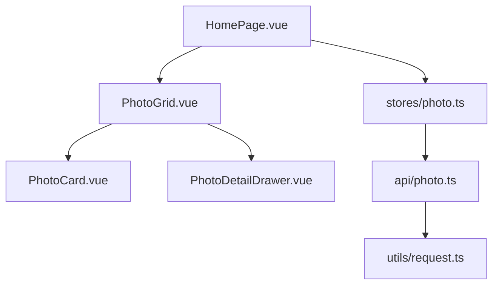
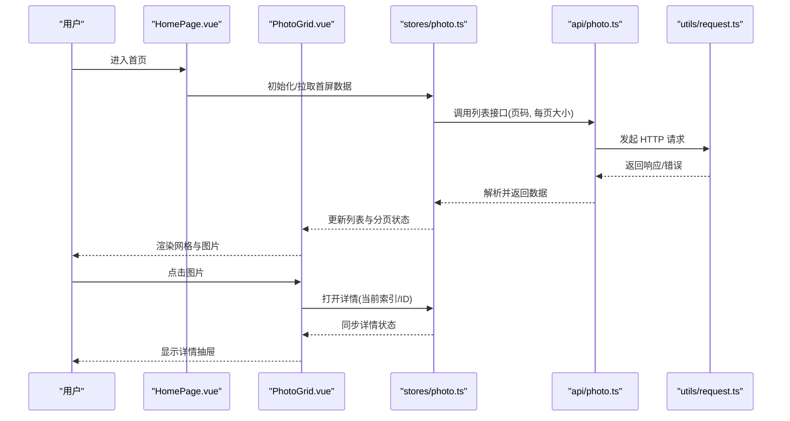
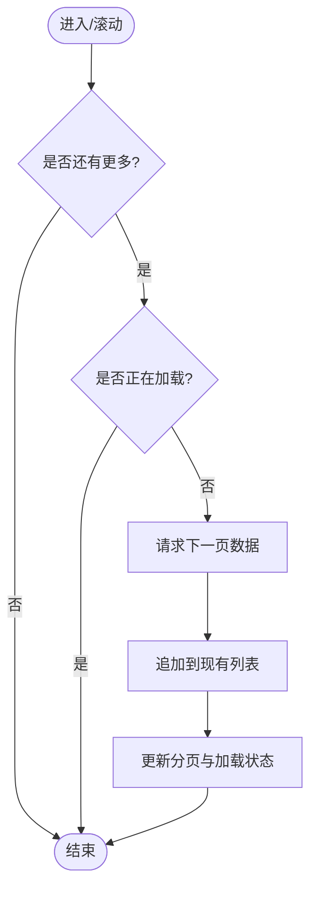
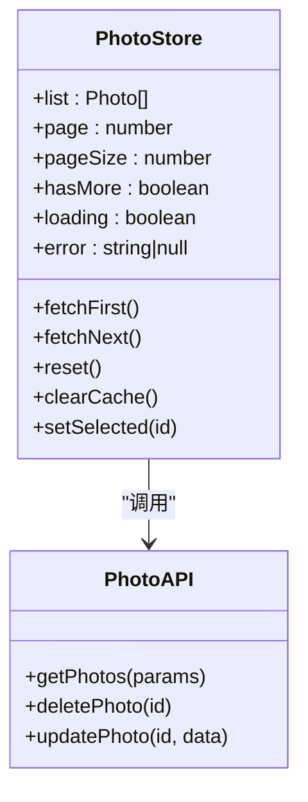
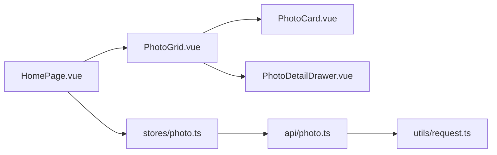

# 首页开发

<cite>
**本文引用的文件**   
- [HomePage.vue](file://frontend/src/views/HomePage.vue)
- [PhotoGrid.vue](file://frontend/src/components/photo/PhotoGrid.vue)
- [photo.ts（状态管理）](file://frontend/src/stores/photo.ts)
- [photo.ts（API 调用）](file://frontend/src/api/photo.ts)
- [PhotoCard.vue](file://frontend/src/components/photo/PhotoCard.vue)
- [PhotoDetailDrawer.vue](file://frontend/src/components/photo/PhotoDetailDrawer.vue)
- [request.ts（请求封装）](file://frontend/src/utils/request.ts)
</cite>

## 目录
1. [简介](#简介)
2. [项目结构](#项目结构)
3. [核心组件与职责](#核心组件与职责)
4. [架构总览](#架构总览)
5. [详细组件分析](#详细组件分析)
6. [依赖关系分析](#依赖关系分析)
7. [性能优化策略](#性能优化策略)
8. [故障排查指南](#故障排查指南)
9. [结论](#结论)
10. [附录：最佳实践清单](#附录最佳实践清单)

## 简介
本文件面向前端开发者，系统性梳理 AI-PhotoAlbum 项目的“首页”实现。重点覆盖以下方面：
- HomePage.vue 的页面组织、数据获取与渲染流程
- PhotoGrid.vue 的照片网格布局、响应式适配、分页加载与图片预览
- 状态管理 store 中照片数据的获取、缓存与更新机制
- 用户交互处理（点击、悬停、选择）
- 性能优化策略（图片懒加载、预加载、内存管理与虚拟滚动建议）
- 错误处理方案与常见问题定位方法

## 项目结构
首页相关的前端代码位于 frontend/src 下，关键文件如下：
- 视图层：views/HomePage.vue
- 展示组件：components/photo/PhotoGrid.vue、components/photo/PhotoCard.vue
- 详情抽屉：components/photo/PhotoDetailDrawer.vue
- 状态管理：stores/photo.ts
- API 层：api/photo.ts
- 网络请求封装：utils/request.ts

图表来源
- [HomePage.vue](file://frontend/src/views/HomePage.vue)
- [PhotoGrid.vue](file://frontend/src/components/photo/PhotoGrid.vue)
- [PhotoCard.vue](file://frontend/src/components/photo/PhotoCard.vue)
- [PhotoDetailDrawer.vue](file://frontend/src/components/photo/PhotoDetailDrawer.vue)
- [photo.ts（状态管理）](file://frontend/src/stores/photo.ts)
- [photo.ts（API 调用）](file://frontend/src/api/photo.ts)
- [request.ts（请求封装）](file://frontend/src/utils/request.ts)

章节来源
- [HomePage.vue](file://frontend/src/views/HomePage.vue)
- [PhotoGrid.vue](file://frontend/src/components/photo/PhotoGrid.vue)
- [photo.ts（状态管理）](file://frontend/src/stores/photo.ts)
- [photo.ts（API 调用）](file://frontend/src/api/photo.ts)
- [request.ts（请求封装）](file://frontend/src/utils/request.ts)

## 核心组件与职责
- HomePage.vue：首页容器，负责初始化数据、组合子组件、承载全局交互入口（如搜索、筛选等扩展点）。
- PhotoGrid.vue：照片网格展示组件，负责：
  - 数据绑定与分页加载
  - 网格布局与响应式适配
  - 图片懒加载与占位图
  - 触发图片预览（打开详情抽屉）
- stores/photo.ts：集中管理照片列表、分页参数、加载状态、错误信息；提供获取、追加、清空等方法。
- api/photo.ts：封装后端接口调用，统一入参出参与错误处理。
- utils/request.ts：HTTP 请求封装，统一拦截器、重试、超时、鉴权头注入等。
- PhotoCard.vue：单张照片卡片，承载缩略图、标题、元信息、选中态与悬停效果。
- PhotoDetailDrawer.vue：图片详情抽屉，支持大图查看、导航、下载等。

章节来源
- [HomePage.vue](file://frontend/src/views/HomePage.vue)
- [PhotoGrid.vue](file://frontend/src/components/photo/PhotoGrid.vue)
- [PhotoCard.vue](file://frontend/src/components/photo/PhotoCard.vue)
- [PhotoDetailDrawer.vue](file://frontend/src/components/photo/PhotoDetailDrawer.vue)
- [photo.ts（状态管理）](file://frontend/src/stores/photo.ts)
- [photo.ts（API 调用）](file://frontend/src/api/photo.ts)
- [request.ts（请求封装）](file://frontend/src/utils/request.ts)

## 架构总览
首页数据流遵循“视图 -> 状态管理 -> API -> 网络封装”的分层模式，组件通过 store 订阅数据变化，避免直接耦合 API。

图表来源
- [HomePage.vue](file://frontend/src/views/HomePage.vue)
- [PhotoGrid.vue](file://frontend/src/components/photo/PhotoGrid.vue)
- [photo.ts（状态管理）](file://frontend/src/stores/photo.ts)
- [photo.ts（API 调用）](file://frontend/src/api/photo.ts)
- [request.ts（请求封装）](file://frontend/src/utils/request.ts)

## 详细组件分析

### HomePage.vue 实现逻辑
- 页面职责
  - 作为容器挂载 PhotoGrid 与详情抽屉
  - 在生命周期内触发首次数据加载
  - 可选承载顶部工具栏（搜索、筛选、批量操作入口）
- 数据与状态
  - 从 stores/photo.ts 读取照片列表、分页参数、加载与错误状态
  - 将 store 暴露给子组件使用，或通过 props 透传
- 交互与事件
  - 监听下拉滚动以触发加载更多（由 PhotoGrid 内部或父级协调）
  - 控制详情抽屉的显隐与初始项
- 错误与边界
  - 捕获加载失败并提示用户
  - 空数据时展示占位引导

章节来源
- [HomePage.vue](file://frontend/src/views/HomePage.vue)
- [photo.ts（状态管理）](file://frontend/src/stores/photo.ts)

### PhotoGrid.vue 数据绑定、分页与预览
- 数据绑定
  - 接收来自 store 的列表与分页参数
  - 维护本地滚动位置与“是否还有更多”的状态
- 分页加载
  - 当滚动接近底部时，自动请求下一页数据并追加到现有列表
  - 防止重复请求（节流/防抖或锁标志）
- 图片懒加载
  - 使用浏览器原生 loading="lazy" 或 IntersectionObserver 实现按需加载
  - 为缩略图设置宽高占位，减少重排重绘
- 图片预览
  - 点击卡片后，计算当前项索引并打开详情抽屉
  - 支持键盘左右切换与关闭手势
- 响应式布局
  - 基于 CSS Grid/Flex 的多列自适应（移动端 2 列，平板 3-4 列，桌面 5+ 列）
  - 图片对象-fit 保持比例，避免裁剪失真

图表来源
- [PhotoGrid.vue](file://frontend/src/components/photo/PhotoGrid.vue)
- [photo.ts（状态管理）](file://frontend/src/stores/photo.ts)

章节来源
- [PhotoGrid.vue](file://frontend/src/components/photo/PhotoGrid.vue)
- [photo.ts（状态管理）](file://frontend/src/stores/photo.ts)

### PhotoCard.vue 与 PhotoDetailDrawer.vue
- PhotoCard.vue
  - 展示缩略图、标题与基础元信息
  - 处理 hover 高亮、选中态样式
  - 派发点击事件，携带当前项标识
- PhotoDetailDrawer.vue
  - 接收当前项 ID/索引，渲染大图
  - 提供上一张/下一张导航、关闭按钮
  - 可集成下载、全屏、标注等扩展能力

章节来源
- [PhotoCard.vue](file://frontend/src/components/photo/PhotoCard.vue)
- [PhotoDetailDrawer.vue](file://frontend/src/components/photo/PhotoDetailDrawer.vue)

### 状态管理 stores/photo.ts
- 数据模型
  - 列表：照片数组
  - 分页：当前页码、每页大小、是否有下一页
  - 状态：加载中、错误信息、选中的项
- 核心方法
  - 获取首屏数据：重置分页与列表，发起请求
  - 加载更多：递增页码，合并结果
  - 清空与刷新：用于搜索/筛选后的重新拉取
  - 错误处理：统一捕获并记录
- 缓存策略
  - 内存缓存：按查询条件缓存结果，避免重复请求
  - 失效策略：新增/删除/编辑后失效对应缓存
  - 可选持久化：对热点数据做 localStorage 缓存（注意体积与一致性）

图表来源
- [photo.ts（状态管理）](file://frontend/src/stores/photo.ts)
- [photo.ts（API 调用）](file://frontend/src/api/photo.ts)

章节来源
- [photo.ts（状态管理）](file://frontend/src/stores/photo.ts)
- [photo.ts（API 调用）](file://frontend/src/api/photo.ts)

### API 层与请求封装
- api/photo.ts
  - 定义统一的列表、详情、删除、更新等函数
  - 将业务参数映射为后端期望格式
  - 统一错误码处理与消息提示
- utils/request.ts
  - 封装 axios/fetch，配置 baseURL、超时、重试
  - 注入鉴权头、刷新 token、错误拦截与日志

章节来源
- [photo.ts（API 调用）](file://frontend/src/api/photo.ts)
- [request.ts（请求封装）](file://frontend/src/utils/request.ts)

## 依赖关系分析
- 组件耦合
  - HomePage.vue 仅聚合子组件与 store，低耦合
  - PhotoGrid.vue 依赖 PhotoCard.vue 与 PhotoDetailDrawer.vue
  - 所有数据访问经由 stores/photo.ts，避免跨层级 prop 传递
- 外部依赖
  - 网络请求通过 utils/request.ts 抽象，便于替换与测试
  - 第三方 UI 库（如弹窗/抽屉）按需引入

图表来源
- [HomePage.vue](file://frontend/src/views/HomePage.vue)
- [PhotoGrid.vue](file://frontend/src/components/photo/PhotoGrid.vue)
- [PhotoCard.vue](file://frontend/src/components/photo/PhotoCard.vue)
- [PhotoDetailDrawer.vue](file://frontend/src/components/photo/PhotoDetailDrawer.vue)
- [photo.ts（状态管理）](file://frontend/src/stores/photo.ts)
- [photo.ts（API 调用）](file://frontend/src/api/photo.ts)
- [request.ts（请求封装）](file://frontend/src/utils/request.ts)

## 性能优化策略
- 图片懒加载
  - 使用原生 loading="lazy" 或 IntersectionObserver 实现可视区域加载
  - 为缩略图设置固定宽高，避免布局抖动
- 图片预加载
  - 对即将可见的图片进行预加载（如滚动方向预测）
  - 详情页大图在进入视口前预取
- 虚拟滚动
  - 当列表规模较大时，采用虚拟滚动只渲染可视区节点
  - 结合 windowing 技术降低 DOM 节点数量，提升滚动帧率
- 内存管理
  - 及时释放不再使用的图片对象引用
  - 取消未完成的请求（AbortController）
  - 对大对象进行弱引用或分片处理
- 并发与去重
  - 请求去重：相同参数在同一时刻只发一次请求
  - 节流/防抖：滚动加载与搜索输入
- 渲染优化
  - 使用 key 稳定标识，避免不必要的重渲染
  - 列表项拆分与 memo 化，减少子树更新

[本节为通用性能建议，不直接分析具体文件]

## 故障排查指南
- 列表不更新
  - 检查 store 的 fetch 方法是否正确合并新数据
  - 确认分页参数与 hasMore 状态变更
- 图片无法加载
  - 检查缩略图 URL 有效性、跨域与防盗链配置
  - 观察控制台 4xx/5xx 错误与网络面板
- 滚动加载异常
  - 验证滚动阈值与节流逻辑
  - 确保“是否正在加载”锁正确释放
- 详情抽屉异常
  - 核对当前项索引/ID 与列表一致性
  - 检查抽屉关闭时的状态清理
- 内存泄漏
  - 监听组件卸载，取消定时器与监听器
  - 释放图片与大数据对象引用

章节来源
- [photo.ts（状态管理）](file://frontend/src/stores/photo.ts)
- [photo.ts（API 调用）](file://frontend/src/api/photo.ts)
- [request.ts（请求封装）](file://frontend/src/utils/request.ts)

## 结论
首页通过清晰的组件分层与集中式状态管理，实现了高效、可扩展的照片浏览体验。配合懒加载、预加载与虚拟滚动等优化手段，可在大规模数据集下保持流畅交互。建议在后续迭代中完善错误提示、无障碍支持与单元测试，进一步提升稳定性与可维护性。

## 附录：最佳实践清单
- 组件设计
  - 单一职责：容器与展示分离
  - 明确 props/events：避免深层级 prop 穿透
- 状态管理
  - 最小化状态：仅保留必要字段
  - 不可变更新：避免直接修改共享状态
- 网络请求
  - 统一错误处理与重试策略
  - 请求去重与取消
- 图片优化
  - 多尺寸缩略图与 WebP/AVIF 格式
  - 懒加载与预加载结合
- 可访问性
  - 键盘导航与焦点管理
  - 语义化标签与替代文本

[本节为通用指导，不直接分析具体文件]