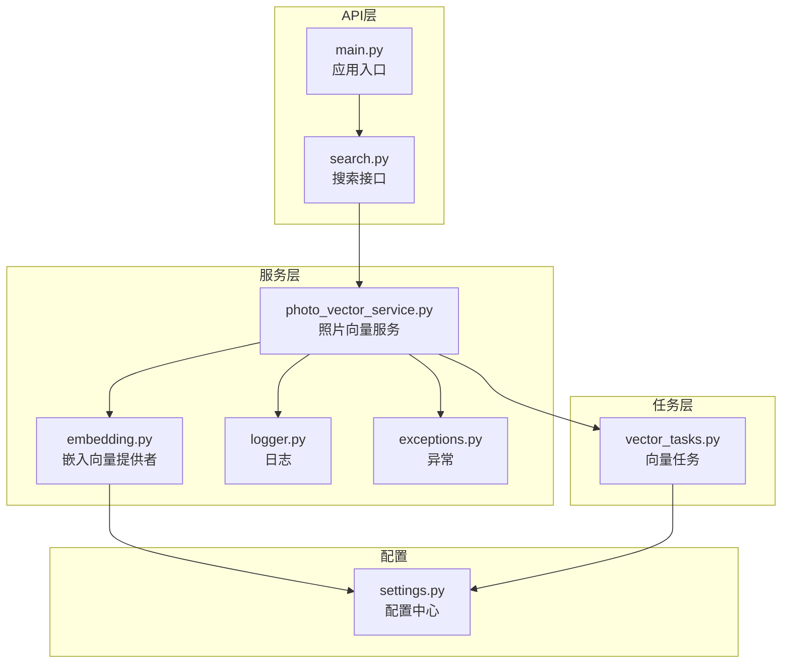
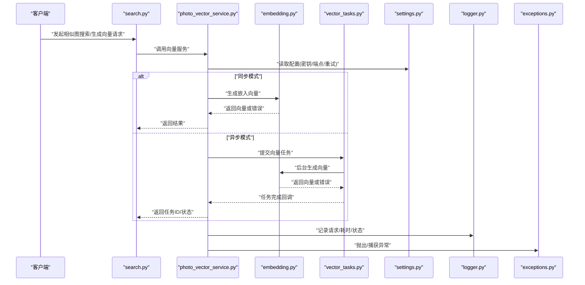
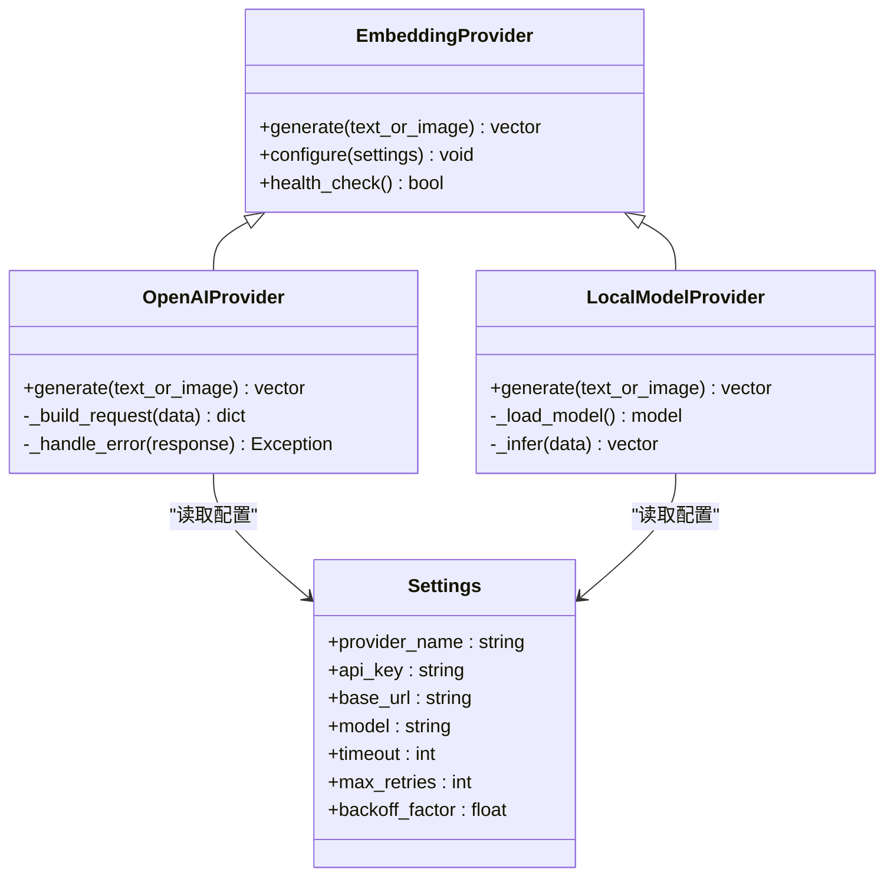
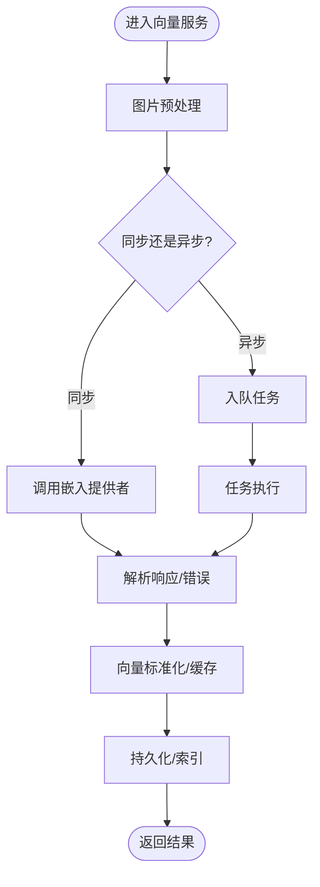
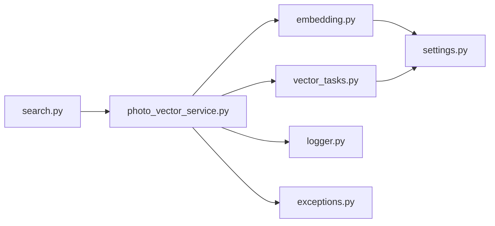

# AI服务提供商

<cite>
**本文引用的文件**   
- [backend/app/services/ai_providers/embedding.py](file://backend/app/services/ai_providers/embedding.py)
- [backend/app/services/photo_vector_service.py](file://backend/app/services/photo_vector_service.py)
- [backend/app/config/settings.py](file://backend/app/config/settings.py)
- [backend/app/api/search.py](file://backend/app/api/search.py)
- [backend/app/tasks/vector_tasks.py](file://backend/app/tasks/vector_tasks.py)
- [backend/app/core/logger.py](file://backend/app/core/logger.py)
- [backend/app/core/exceptions.py](file://backend/app/core/exceptions.py)
- [backend/main.py](file://backend/main.py)
</cite>

## 目录
1. [简介](#简介)
2. [项目结构](#项目结构)
3. [核心组件](#核心组件)
4. [架构总览](#架构总览)
5. [详细组件分析](#详细组件分析)
6. [依赖关系分析](#依赖关系分析)
7. [性能考虑](#性能考虑)
8. [故障排查指南](#故障排查指南)
9. [结论](#结论)
10. [附录](#附录)

## 简介
本文件面向AI服务提供商集成，重点说明嵌入向量服务的实现原理与配置方法，OpenAI API的集成方式（包括API密钥管理、请求封装、响应处理与错误重试），本地模型服务的部署与调用，以及多供应商适配层的设计思路（支持动态切换与负载均衡）。同时提供自定义AI服务提供商的开发指南，涵盖接口规范、认证方式与性能优化策略。

## 项目结构
本项目后端采用分层架构：API层暴露HTTP接口，服务层封装业务逻辑，任务层负责异步处理，配置中心统一管理环境变量与默认值，日志与异常模块贯穿全链路。

图表来源
- [backend/main.py](file://backend/main.py)
- [backend/app/api/search.py](file://backend/app/api/search.py)
- [backend/app/services/photo_vector_service.py](file://backend/app/services/photo_vector_service.py)
- [backend/app/services/ai_providers/embedding.py](file://backend/app/services/ai_providers/embedding.py)
- [backend/app/tasks/vector_tasks.py](file://backend/app/tasks/vector_tasks.py)
- [backend/app/config/settings.py](file://backend/app/config/settings.py)
- [backend/app/core/logger.py](file://backend/app/core/logger.py)
- [backend/app/core/exceptions.py](file://backend/app/core/exceptions.py)

章节来源
- [backend/main.py](file://backend/main.py)
- [backend/app/api/search.py](file://backend/app/api/search.py)
- [backend/app/services/photo_vector_service.py](file://backend/app/services/photo_vector_service.py)
- [backend/app/services/ai_providers/embedding.py](file://backend/app/services/ai_providers/embedding.py)
- [backend/app/tasks/vector_tasks.py](file://backend/app/tasks/vector_tasks.py)
- [backend/app/config/settings.py](file://backend/app/config/settings.py)
- [backend/app/core/logger.py](file://backend/app/core/logger.py)
- [backend/app/core/exceptions.py](file://backend/app/core/exceptions.py)

## 核心组件
- 嵌入向量提供者（Embedding Provider）
  - 职责：统一对外提供文本/图像到向量的能力；屏蔽不同供应商差异；支持配置化选择与扩展。
  - 关键能力：供应商选择、请求封装、响应解析、错误分类与重试、指标与日志记录。
- 照片向量服务（Photo Vector Service）
  - 职责：协调图片预处理、特征提取、向量生成与存储；驱动批量任务；对接向量检索。
- 配置中心（Settings）
  - 职责：集中管理API密钥、端点地址、超时、并发、重试等参数；提供默认值与环境覆盖。
- 任务调度（Vector Tasks）
  - 职责：异步执行向量计算、失败重试、进度上报与结果落盘。
- 日志与异常（Logger & Exceptions）
  - 职责：结构化日志输出、错误类型定义与传播。

章节来源
- [backend/app/services/ai_providers/embedding.py](file://backend/app/services/ai_providers/embedding.py)
- [backend/app/services/photo_vector_service.py](file://backend/app/services/photo_vector_service.py)
- [backend/app/config/settings.py](file://backend/app/config/settings.py)
- [backend/app/tasks/vector_tasks.py](file://backend/app/tasks/vector_tasks.py)
- [backend/app/core/logger.py](file://backend/app/core/logger.py)
- [backend/app/core/exceptions.py](file://backend/app/core/exceptions.py)

## 架构总览
下图展示了从API到向量生成的端到端流程，包含同步与异步两条路径，并体现多供应商适配层与重试机制。

图表来源
- [backend/app/api/search.py](file://backend/app/api/search.py)
- [backend/app/services/photo_vector_service.py](file://backend/app/services/photo_vector_service.py)
- [backend/app/services/ai_providers/embedding.py](file://backend/app/services/ai_providers/embedding.py)
- [backend/app/tasks/vector_tasks.py](file://backend/app/tasks/vector_tasks.py)
- [backend/app/config/settings.py](file://backend/app/config/settings.py)
- [backend/app/core/logger.py](file://backend/app/core/logger.py)
- [backend/app/core/exceptions.py](file://backend/app/core/exceptions.py)

## 详细组件分析

### 嵌入向量提供者（Embedding Provider）
- 设计要点
  - 抽象接口：定义统一的“生成向量”方法，输入为文本或图像数据，输出为标准向量格式。
  - 供应商实现：针对OpenAI、本地模型等不同后端提供具体实现，通过配置选择。
  - 请求封装：统一构建请求体、设置头部（如Authorization）、序列化与反序列化。
  - 错误处理：区分网络错误、鉴权错误、限流错误、业务错误；按策略重试或快速失败。
  - 可观测性：记录关键指标（延迟、成功率、错误码分布）与上下文信息。
- 配置项建议
  - 供应商名称、API密钥、基础URL、模型名、超时、最大重试次数、退避策略、并发限制。
- 重试策略
  - 指数退避+抖动；对瞬时错误（如限流、网络抖动）重试；对不可恢复错误（如401/403）不重试。
- 负载均衡与动态切换
  - 基于权重或健康检查在多个实例间分发；当某实例失败时自动降级到其他实例。

图表来源
- [backend/app/services/ai_providers/embedding.py](file://backend/app/services/ai_providers/embedding.py)
- [backend/app/config/settings.py](file://backend/app/config/settings.py)

章节来源
- [backend/app/services/ai_providers/embedding.py](file://backend/app/services/ai_providers/embedding.py)
- [backend/app/config/settings.py](file://backend/app/config/settings.py)

### 照片向量服务（Photo Vector Service）
- 职责边界
  - 编排图片预处理（缩放、归一化、编码）与向量生成。
  - 决定同步/异步执行路径，管理任务生命周期。
  - 聚合供应商返回的向量，进行标准化与缓存。
- 与任务系统协作
  - 将大图片或批量任务投递至任务队列，避免阻塞请求线程。
  - 监听任务完成事件，更新索引或持久化结果。
- 错误与重试
  - 对供应商错误进行分类，结合全局重试策略与幂等键避免重复计算。

图表来源
- [backend/app/services/photo_vector_service.py](file://backend/app/services/photo_vector_service.py)
- [backend/app/tasks/vector_tasks.py](file://backend/app/tasks/vector_tasks.py)
- [backend/app/services/ai_providers/embedding.py](file://backend/app/services/ai_providers/embedding.py)

章节来源
- [backend/app/services/photo_vector_service.py](file://backend/app/services/photo_vector_service.py)
- [backend/app/tasks/vector_tasks.py](file://backend/app/tasks/vector_tasks.py)
- [backend/app/services/ai_providers/embedding.py](file://backend/app/services/ai_providers/embedding.py)

### 配置中心（Settings）
- 作用
  - 集中管理所有AI相关配置，包括供应商选择、认证、网络与重试参数。
  - 提供默认值与环境变量覆盖，便于多环境部署。
- 关键配置项
  - 供应商名称、API密钥、基础URL、模型标识、超时、最大重试次数、退避因子、并发上限、健康检查间隔。
- 安全建议
  - 敏感信息仅从环境变量注入，禁止硬编码；生产环境使用密钥管理服务。

章节来源
- [backend/app/config/settings.py](file://backend/app/config/settings.py)

### 任务系统（Vector Tasks）
- 职责
  - 异步执行向量计算，支持失败重试与进度上报。
  - 与向量服务解耦，提升吞吐与稳定性。
- 可靠性
  - 任务幂等设计（基于唯一键去重）；失败后持久化中间状态以便恢复。

章节来源
- [backend/app/tasks/vector_tasks.py](file://backend/app/tasks/vector_tasks.py)

### API层（Search）
- 职责
  - 接收用户搜索请求，委托向量服务执行，返回结构化响应。
  - 统一错误包装与日志记录。

章节来源
- [backend/app/api/search.py](file://backend/app/api/search.py)

### 日志与异常（Logger & Exceptions）
- 日志
  - 结构化输出，包含请求ID、供应商、耗时、状态码等维度。
- 异常
  - 定义通用异常族，区分网络、鉴权、限流、业务错误，便于上层统一处理。

章节来源
- [backend/app/core/logger.py](file://backend/app/core/logger.py)
- [backend/app/core/exceptions.py](file://backend/app/core/exceptions.py)

## 依赖关系分析
- 耦合关系
  - API层依赖向量服务；向量服务依赖嵌入提供者与任务系统；两者均依赖配置中心。
  - 日志与异常作为横切关注点被广泛引用。
- 外部依赖
  - OpenAI SDK或HTTP客户端；本地推理框架（如ONNX Runtime、Torch等，视实现而定）。
- 潜在循环依赖
  - 保持服务层与任务层单向依赖，避免反向导入。

图表来源
- [backend/app/api/search.py](file://backend/app/api/search.py)
- [backend/app/services/photo_vector_service.py](file://backend/app/services/photo_vector_service.py)
- [backend/app/services/ai_providers/embedding.py](file://backend/app/services/ai_providers/embedding.py)
- [backend/app/tasks/vector_tasks.py](file://backend/app/tasks/vector_tasks.py)
- [backend/app/config/settings.py](file://backend/app/config/settings.py)
- [backend/app/core/logger.py](file://backend/app/core/logger.py)
- [backend/app/core/exceptions.py](file://backend/app/core/exceptions.py)

章节来源
- [backend/app/api/search.py](file://backend/app/api/search.py)
- [backend/app/services/photo_vector_service.py](file://backend/app/services/photo_vector_service.py)
- [backend/app/services/ai_providers/embedding.py](file://backend/app/services/ai_providers/embedding.py)
- [backend/app/tasks/vector_tasks.py](file://backend/app/tasks/vector_tasks.py)
- [backend/app/config/settings.py](file://backend/app/config/settings.py)
- [backend/app/core/logger.py](file://backend/app/core/logger.py)
- [backend/app/core/exceptions.py](file://backend/app/core/exceptions.py)

## 性能考虑
- 并发与批处理
  - 合理设置并发上限与批大小，平衡吞吐与资源占用。
- 缓存
  - 对相同输入进行向量缓存，减少重复计算。
- 连接复用
  - HTTP连接池与长连接，降低握手开销。
- 超时与熔断
  - 短超时+快速失败，配合熔断器保护上游。
- 本地模型优化
  - 模型量化、算子融合、GPU/CPU设备选择与内存预热。

[本节为通用指导，无需代码来源]

## 故障排查指南
- 常见问题
  - 鉴权失败：检查API密钥是否配置正确、是否过期或被撤销。
  - 限流/配额不足：调整重试退避策略与并发度，必要时升级套餐或增加实例。
  - 网络不稳定：启用重试与熔断，观察错误码分布。
  - 本地模型加载失败：确认模型路径、依赖库版本与硬件资源。
- 定位手段
  - 查看结构化日志中的请求ID、供应商、耗时与错误码。
  - 使用健康检查接口验证各供应商可用性。
  - 开启调试日志，追踪请求构造与响应解析过程。

章节来源
- [backend/app/core/logger.py](file://backend/app/core/logger.py)
- [backend/app/core/exceptions.py](file://backend/app/core/exceptions.py)

## 结论
通过统一的嵌入向量提供者抽象与配置中心，本项目实现了多AI供应商的可插拔集成，具备完善的错误处理、重试与可观测性。照片向量服务与任务系统解耦了同步与异步路径，提升了整体稳定性与吞吐。遵循本文档的接口规范与最佳实践，可快速接入新的AI服务提供商，并在生产环境中获得良好的性能与可靠性。

[本节为总结，无需代码来源]

## 附录

### OpenAI API集成要点
- 密钥管理
  - 通过环境变量注入，避免硬编码；生产环境建议使用密钥管理服务。
- 请求封装
  - 统一设置Authorization头、模型名、超时与重试策略。
- 响应处理
  - 解析标准字段，校验向量维度与数据类型，缺失字段时回退或报错。
- 错误重试
  - 对429/5xx等瞬时错误采用指数退避重试；对401/403直接失败并告警。

章节来源
- [backend/app/services/ai_providers/embedding.py](file://backend/app/services/ai_providers/embedding.py)
- [backend/app/config/settings.py](file://backend/app/config/settings.py)

### 本地模型服务部署与调用
- 部署建议
  - 容器化部署，预留足够CPU/GPU与内存；预加载模型到内存。
- 调用方式
  - 通过HTTP/gRPC暴露推理接口；设置合理的超时与并发限制。
- 监控与扩缩容
  - 采集QPS、延迟、错误率与资源利用率；根据指标自动扩缩容。

章节来源
- [backend/app/services/ai_providers/embedding.py](file://backend/app/services/ai_providers/embedding.py)
- [backend/app/config/settings.py](file://backend/app/config/settings.py)

### 多供应商适配层与负载均衡
- 动态切换
  - 基于配置或运行时策略选择供应商；支持灰度发布与A/B测试。
- 负载均衡
  - 按权重或健康检查结果分发请求；失败实例自动摘除。
- 降级策略
  - 主供应商不可用时自动切换到备用供应商或本地模型。

章节来源
- [backend/app/services/ai_providers/embedding.py](file://backend/app/services/ai_providers/embedding.py)
- [backend/app/config/settings.py](file://backend/app/config/settings.py)

### 自定义AI服务提供商开发指南
- 接口规范
  - 实现统一的“生成向量”方法，输入输出遵循既定数据结构。
- 认证方式
  - 支持API Key、OAuth、签名等认证；通过配置注入凭据。
- 性能优化
  - 连接复用、批处理、缓存、异步I/O；合理设置超时与重试。
- 可观测性
  - 记录关键指标与上下文；暴露健康检查接口。

章节来源
- [backend/app/services/ai_providers/embedding.py](file://backend/app/services/ai_providers/embedding.py)
- [backend/app/config/settings.py](file://backend/app/config/settings.py)