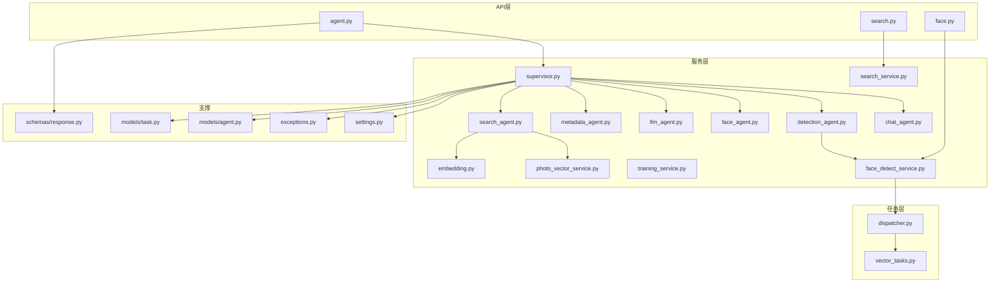
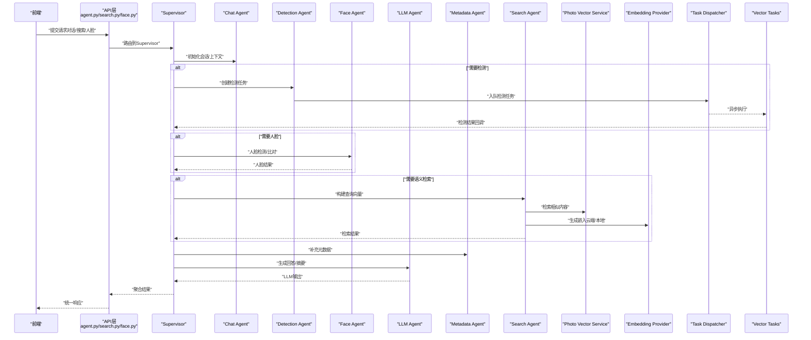
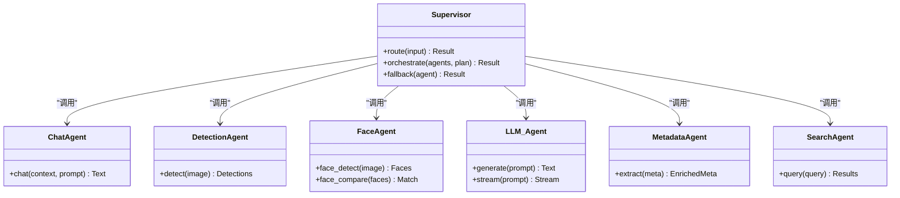
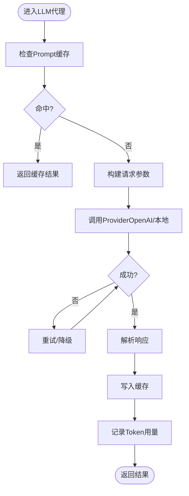
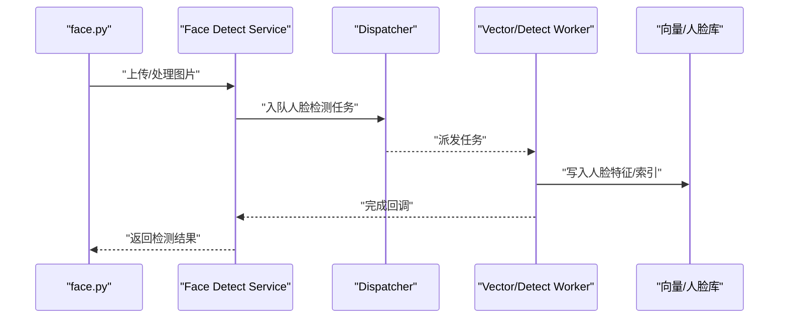
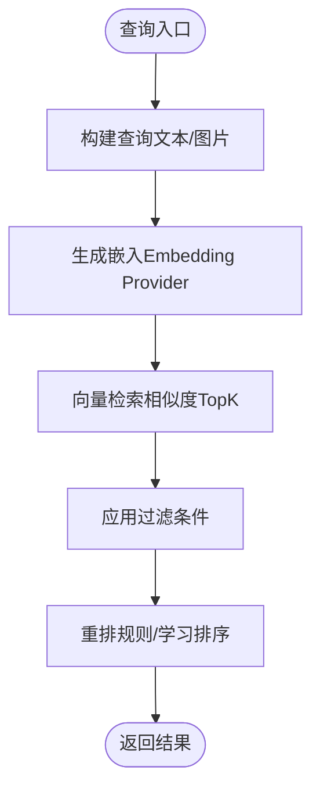
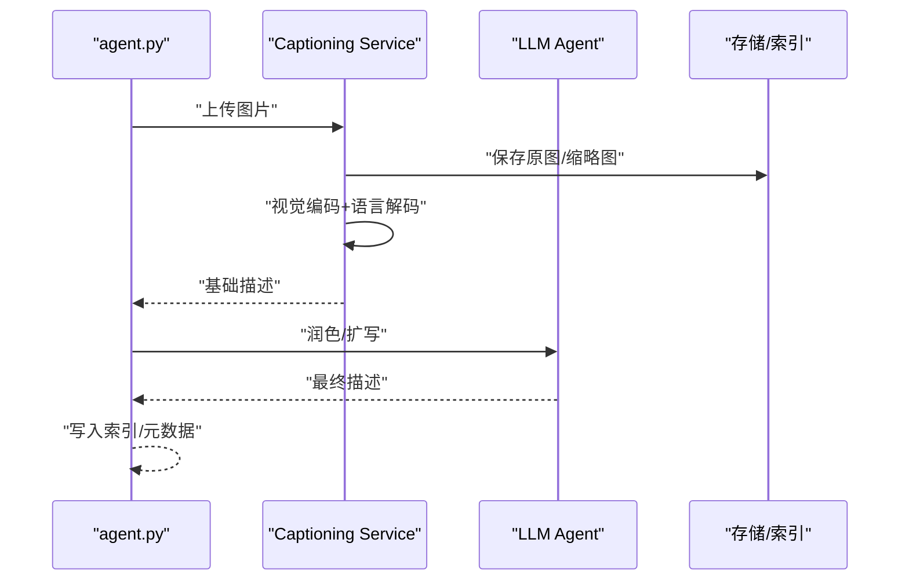
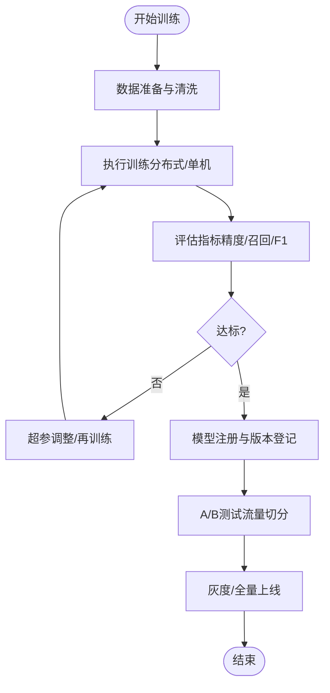
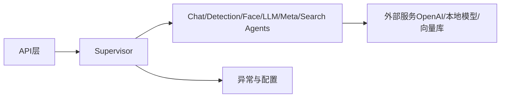

# AI服务集成

<cite>
**本文引用的文件**   
- [backend/main.py](file://backend/main.py)
- [backend/app/api/agent.py](file://backend/app/api/agent.py)
- [backend/app/api/search.py](file://backend/app/api/search.py)
- [backend/app/api/face.py](file://backend/app/api/face.py)
- [backend/app/services/agent/supervisor.py](file://backend/app/services/agent/supervisor.py)
- [backend/app/services/agent/chat_agent.py](file://backend/app/services/agent/chat_agent.py)
- [backend/app/services/agent/detection_agent.py](file://backend/app/services/agent/detection_agent.py)
- [backend/app/services/agent/face_agent.py](file://backend/app/services/agent/face_agent.py)
- [backend/app/services/agent/llm_agent.py](file://backend/app/services/agent/llm_agent.py)
- [backend/app/services/agent/metadata_agent.py](file://backend/app/services/agent/metadata_agent.py)
- [backend/app/services/agent/search_agent.py](file://backend/app/services/agent/search_agent.py)
- [backend/app/services/ai_providers/embedding.py](file://backend/app/services/ai_providers/embedding.py)
- [backend/app/services/photo_vector_service.py](file://backend/app/services/photo_vector_service.py)
- [backend/app/services/search_service.py](file://backend/app/services/search_service.py)
- [backend/app/services/face_detect_service.py](file://backend/app/services/face_detect_service.py)
- [backend/app/services/training_service.py](file://backend/app/services/training_service.py)
- [backend/app/tasks/dispatcher.py](file://backend/app/tasks/dispatcher.py)
- [backend/app/tasks/vector_tasks.py](file://backend/app/tasks/vector_tasks.py)
- [backend/app/config/settings.py](file://backend/app/config/settings.py)
- [backend/app/core/exceptions.py](file://backend/app/core/exceptions.py)
- [backend/app/models/agent.py](file://backend/app/models/agent.py)
- [backend/app/models/task.py](file://backend/app/models/task.py)
- [backend/app/schemas/response.py](file://backend/app/schemas/response.py)
</cite>

## 目录
1. [简介](#简介)
2. [项目结构](#项目结构)
3. [核心组件](#核心组件)
4. [架构总览](#架构总览)
5. [详细组件分析](#详细组件分析)
6. [依赖关系分析](#依赖关系分析)
7. [性能与成本优化](#性能与成本优化)
8. [故障排查指南](#故障排查指南)
9. [结论](#结论)
10. [附录](#附录)

## 简介
本指南面向开发者，系统化阐述AI相册项目的多Agent协作架构设计与实现，覆盖OpenAI API集成、本地机器学习模型部署、向量数据库使用，以及人脸识别、语义搜索、图像描述生成等AI功能的端到端集成方案。文档同时提供AI服务调用封装、错误处理、性能优化与成本控制策略，并说明自定义模型训练、版本管理与A/B测试机制，帮助快速落地可扩展的AI能力。

## 项目结构
后端采用分层与领域驱动相结合的组织方式：API层暴露REST接口；服务层承载业务逻辑与AI编排；任务层负责异步处理（检测、向量化等）；配置与异常定义贯穿全局；数据模型与Schema用于持久化与校验。

图表来源
- [backend/main.py:1-200](file://backend/main.py#L1-L200)
- [backend/app/api/agent.py:1-200](file://backend/app/api/agent.py#L1-L200)
- [backend/app/api/search.py:1-200](file://backend/app/api/search.py#L1-L200)
- [backend/app/api/face.py:1-200](file://backend/app/api/face.py#L1-L200)
- [backend/app/services/agent/supervisor.py:1-200](file://backend/app/services/agent/supervisor.py#L1-L200)
- [backend/app/services/agent/chat_agent.py:1-200](file://backend/app/services/agent/chat_agent.py#L1-L200)
- [backend/app/services/agent/detection_agent.py:1-200](file://backend/app/services/agent/detection_agent.py#L1-L200)
- [backend/app/services/agent/face_agent.py:1-200](file://backend/app/services/agent/face_agent.py#L1-L200)
- [backend/app/services/agent/llm_agent.py:1-200](file://backend/app/services/agent/llm_agent.py#L1-L200)
- [backend/app/services/agent/metadata_agent.py:1-200](file://backend/app/services/agent/metadata_agent.py#L1-L200)
- [backend/app/services/agent/search_agent.py:1-200](file://backend/app/services/agent/search_agent.py#L1-L200)
- [backend/app/services/ai_providers/embedding.py:1-200](file://backend/app/services/ai_providers/embedding.py#L1-L200)
- [backend/app/services/photo_vector_service.py:1-200](file://backend/app/services/photo_vector_service.py#L1-L200)
- [backend/app/services/search_service.py:1-200](file://backend/app/services/search_service.py#L1-L200)
- [backend/app/services/face_detect_service.py:1-200](file://backend/app/services/face_detect_service.py#L1-L200)
- [backend/app/services/training_service.py:1-200](file://backend/app/services/training_service.py#L1-L200)
- [backend/app/tasks/dispatcher.py:1-200](file://backend/app/tasks/dispatcher.py#L1-L200)
- [backend/app/tasks/vector_tasks.py:1-200](file://backend/app/tasks/vector_tasks.py#L1-L200)
- [backend/app/config/settings.py:1-200](file://backend/app/config/settings.py#L1-L200)
- [backend/app/core/exceptions.py:1-200](file://backend/app/core/exceptions.py#L1-L200)
- [backend/app/models/agent.py:1-200](file://backend/app/models/agent.py#L1-L200)
- [backend/app/models/task.py:1-200](file://backend/app/models/task.py#L1-L200)
- [backend/app/schemas/response.py:1-200](file://backend/app/schemas/response.py#L1-L200)

章节来源
- [backend/main.py:1-200](file://backend/main.py#L1-L200)

## 核心组件
- 多Agent协调器（Supervisor）
  - 职责：解析用户意图，调度Chat、Detection、Face、LLM、Metadata、Search等子Agent，聚合结果并返回统一响应。
  - 关键交互：接收API请求→路由到对应Agent→组合输出→标准化响应。
- LLM代理（LLM Agent）
  - 职责：封装OpenAI类API调用，支持文本生成、对话、结构化输出。
  - 关键点：可插拔Provider、重试与超时控制、Token用量统计与限流。
- 检测代理（Detection Agent）
  - 职责：触发图片检测任务（人脸、物体、场景），将结果写入任务队列并异步执行。
- 人脸代理（Face Agent）
  - 职责：人脸检测、对齐、特征提取、聚类与比对，结合元数据辅助确认身份。
- 搜索代理（Search Agent）
  - 职责：构建查询向量，检索相似图片或文本，融合关键词与语义结果。
- 元数据代理（Metadata Agent）
  - 职责：读取EXIF/地理位置/时间等元信息，增强检索与展示。
- 聊天代理（Chat Agent）
  - 职责：维护会话上下文，串联其他Agent能力，以自然语言交互呈现结果。
- 向量服务（Photo Vector Service）
  - 职责：图片向量化、索引更新、相似度检索、批量入库。
- 嵌入服务（Embedding Provider）
  - 职责：抽象文本/图像嵌入生成，支持云端与本地模型切换。
- 训练服务（Training Service）
  - 职责：管理自定义模型训练流程、版本登记、评估指标与回滚。
- 任务分发器（Dispatcher）与向量任务（Vector Tasks）
  - 职责：异步任务调度、失败重试、幂等处理、进度上报。

章节来源
- [backend/app/services/agent/supervisor.py:1-200](file://backend/app/services/agent/supervisor.py#L1-L200)
- [backend/app/services/agent/llm_agent.py:1-200](file://backend/app/services/agent/llm_agent.py#L1-L200)
- [backend/app/services/agent/detection_agent.py:1-200](file://backend/app/services/agent/detection_agent.py#L1-L200)
- [backend/app/services/agent/face_agent.py:1-200](file://backend/app/services/agent/face_agent.py#L1-L200)
- [backend/app/services/agent/search_agent.py:1-200](file://backend/app/services/agent/search_agent.py#L1-L200)
- [backend/app/services/agent/metadata_agent.py:1-200](file://backend/app/services/agent/metadata_agent.py#L1-L200)
- [backend/app/services/agent/chat_agent.py:1-200](file://backend/app/services/agent/chat_agent.py#L1-L200)
- [backend/app/services/photo_vector_service.py:1-200](file://backend/app/services/photo_vector_service.py#L1-L200)
- [backend/app/services/ai_providers/embedding.py:1-200](file://backend/app/services/ai_providers/embedding.py#L1-L200)
- [backend/app/services/training_service.py:1-200](file://backend/app/services/training_service.py#L1-L200)
- [backend/app/tasks/dispatcher.py:1-200](file://backend/app/tasks/dispatcher.py#L1-L200)
- [backend/app/tasks/vector_tasks.py:1-200](file://backend/app/tasks/vector_tasks.py#L1-L200)

## 架构总览
下图展示了从前端到后端的多Agent协作流程，包括同步与异步路径、外部AI服务与本地模型的接入点。

图表来源
- [backend/app/api/agent.py:1-200](file://backend/app/api/agent.py#L1-L200)
- [backend/app/services/agent/supervisor.py:1-200](file://backend/app/services/agent/supervisor.py#L1-L200)
- [backend/app/services/agent/chat_agent.py:1-200](file://backend/app/services/agent/chat_agent.py#L1-L200)
- [backend/app/services/agent/detection_agent.py:1-200](file://backend/app/services/agent/detection_agent.py#L1-L200)
- [backend/app/services/agent/face_agent.py:1-200](file://backend/app/services/agent/face_agent.py#L1-L200)
- [backend/app/services/agent/llm_agent.py:1-200](file://backend/app/services/agent/llm_agent.py#L1-L200)
- [backend/app/services/agent/metadata_agent.py:1-200](file://backend/app/services/agent/metadata_agent.py#L1-L200)
- [backend/app/services/agent/search_agent.py:1-200](file://backend/app/services/agent/search_agent.py#L1-L200)
- [backend/app/services/photo_vector_service.py:1-200](file://backend/app/services/photo_vector_service.py#L1-L200)
- [backend/app/services/ai_providers/embedding.py:1-200](file://backend/app/services/ai_providers/embedding.py#L1-L200)
- [backend/app/tasks/dispatcher.py:1-200](file://backend/app/tasks/dispatcher.py#L1-L200)
- [backend/app/tasks/vector_tasks.py:1-200](file://backend/app/tasks/vector_tasks.py#L1-L200)

## 详细组件分析

### 多Agent协调器（Supervisor）
- 设计要点
  - 意图识别：根据输入类型选择子Agent组合。
  - 编排策略：并行/串行混合，容错与降级（如LLM不可用时回退到规则）。
  - 结果聚合：统一数据结构，便于前端渲染。
- 扩展建议
  - 新增Agent时注册到Supervisor路由表，遵循统一输入输出契约。
  - 引入权重与评分，动态选择最优Agent组合。

图表来源
- [backend/app/services/agent/supervisor.py:1-200](file://backend/app/services/agent/supervisor.py#L1-L200)
- [backend/app/services/agent/chat_agent.py:1-200](file://backend/app/services/agent/chat_agent.py#L1-L200)
- [backend/app/services/agent/detection_agent.py:1-200](file://backend/app/services/agent/detection_agent.py#L1-L200)
- [backend/app/services/agent/face_agent.py:1-200](file://backend/app/services/agent/face_agent.py#L1-L200)
- [backend/app/services/agent/llm_agent.py:1-200](file://backend/app/services/agent/llm_agent.py#L1-L200)
- [backend/app/services/agent/metadata_agent.py:1-200](file://backend/app/services/agent/metadata_agent.py#L1-L200)
- [backend/app/services/agent/search_agent.py:1-200](file://backend/app/services/agent/search_agent.py#L1-L200)

章节来源
- [backend/app/services/agent/supervisor.py:1-200](file://backend/app/services/agent/supervisor.py#L1-L200)

### LLM代理（OpenAI API集成）
- 功能概述
  - 封装文本生成、流式输出、函数调用、结构化输出。
  - 支持多Provider（OpenAI兼容、本地推理服务），通过配置切换。
- 关键特性
  - 重试与退避：指数退避、熔断与短路。
  - Token计量与限额：按租户/用户维度统计，超限告警。
  - Prompt模板与缓存：减少重复计算，提升吞吐。
- 最佳实践
  - 对长上下文进行分段与摘要压缩。
  - 使用系统提示词约束输出格式，降低后处理成本。

图表来源
- [backend/app/services/agent/llm_agent.py:1-200](file://backend/app/services/agent/llm_agent.py#L1-L200)
- [backend/app/config/settings.py:1-200](file://backend/app/config/settings.py#L1-L200)
- [backend/app/core/exceptions.py:1-200](file://backend/app/core/exceptions.py#L1-L200)

章节来源
- [backend/app/services/agent/llm_agent.py:1-200](file://backend/app/services/agent/llm_agent.py#L1-L200)
- [backend/app/config/settings.py:1-200](file://backend/app/config/settings.py#L1-L200)
- [backend/app/core/exceptions.py:1-200](file://backend/app/core/exceptions.py#L1-L200)

### 人脸识别与人脸比对
- 流程概览
  - 人脸检测→人脸对齐→特征提取→库中检索/聚类→结果合并与置信度排序。
- 工程要点
  - 批处理与流水线：GPU加速、内存池复用。
  - 阈值策略：不同场景设置不同相似度阈值。
  - 隐私与安全：人脸特征脱敏存储、访问审计。
- 与任务系统的集成
  - 检测任务异步化，避免阻塞主线程。
  - 失败重试与死信队列，保障可靠性。

图表来源
- [backend/app/api/face.py:1-200](file://backend/app/api/face.py#L1-L200)
- [backend/app/services/face_detect_service.py:1-200](file://backend/app/services/face_detect_service.py#L1-L200)
- [backend/app/tasks/dispatcher.py:1-200](file://backend/app/tasks/dispatcher.py#L1-L200)
- [backend/app/tasks/vector_tasks.py:1-200](file://backend/app/tasks/vector_tasks.py#L1-L200)

章节来源
- [backend/app/api/face.py:1-200](file://backend/app/api/face.py#L1-L200)
- [backend/app/services/face_detect_service.py:1-200](file://backend/app/services/face_detect_service.py#L1-L200)
- [backend/app/tasks/dispatcher.py:1-200](file://backend/app/tasks/dispatcher.py#L1-L200)
- [backend/app/tasks/vector_tasks.py:1-200](file://backend/app/tasks/vector_tasks.py#L1-L200)

### 语义搜索与向量检索
- 流程概览
  - 文本/图片→嵌入生成→向量检索→结果重排→返回。
- 嵌入提供者
  - 支持云端（OpenAI兼容）与本地模型（如SentenceTransformers、ONNX Runtime）。
  - 通过配置切换Provider，统一接口。
- 向量数据库
  - 索引更新策略：增量/全量，冷热分离。
  - 过滤条件：时间、地点、标签、人物等。

图表来源
- [backend/app/services/ai_providers/embedding.py:1-200](file://backend/app/services/ai_providers/embedding.py#L1-L200)
- [backend/app/services/photo_vector_service.py:1-200](file://backend/app/services/photo_vector_service.py#L1-L200)
- [backend/app/services/search_service.py:1-200](file://backend/app/services/search_service.py#L1-L200)
- [backend/app/services/agent/search_agent.py:1-200](file://backend/app/services/agent/search_agent.py#L1-L200)

章节来源
- [backend/app/services/ai_providers/embedding.py:1-200](file://backend/app/services/ai_providers/embedding.py#L1-L200)
- [backend/app/services/photo_vector_service.py:1-200](file://backend/app/services/photo_vector_service.py#L1-L200)
- [backend/app/services/search_service.py:1-200](file://backend/app/services/search_service.py#L1-L200)
- [backend/app/services/agent/search_agent.py:1-200](file://backend/app/services/agent/search_agent.py#L1-L200)

### 图像描述生成（Captioning）
- 典型路径
  - 图片预处理→视觉编码器→语言解码器→后处理（去噪、格式化）。
- 本地部署
  - 模型导出为ONNX/TensorRT，容器化部署，GPU/CPU自适应。
- 与LLM协作
  - 先生成基础描述，再由LLM润色或扩写，提高可读性与一致性。

图表来源
- [backend/app/api/agent.py:1-200](file://backend/app/api/agent.py#L1-L200)
- [backend/app/services/agent/llm_agent.py:1-200](file://backend/app/services/agent/llm_agent.py#L1-L200)
- [backend/app/services/photo_vector_service.py:1-200](file://backend/app/services/photo_vector_service.py#L1-L200)

章节来源
- [backend/app/api/agent.py:1-200](file://backend/app/api/agent.py#L1-L200)
- [backend/app/services/agent/llm_agent.py:1-200](file://backend/app/services/agent/llm_agent.py#L1-L200)
- [backend/app/services/photo_vector_service.py:1-200](file://backend/app/services/photo_vector_service.py#L1-L200)

### 训练服务与模型版本管理
- 训练流程
  - 数据准备→训练脚本→评估指标→模型归档→版本登记。
- 版本管理
  - 版本号规范、变更日志、依赖锁定、可回滚。
- A/B测试
  - 流量切分、指标对比、自动择优与灰度发布。

图表来源
- [backend/app/services/training_service.py:1-200](file://backend/app/services/training_service.py#L1-L200)

章节来源
- [backend/app/services/training_service.py:1-200](file://backend/app/services/training_service.py#L1-L200)

## 依赖关系分析
- 模块耦合
  - API层仅依赖服务层接口，保持松耦合。
  - Supervisor作为编排中心，集中管理Agent间依赖。
- 外部依赖
  - OpenAI兼容API、本地推理服务、向量数据库、对象存储。
- 潜在循环依赖
  - 通过接口抽象与事件回调解耦，避免直接相互引用。

图表来源
- [backend/app/api/agent.py:1-200](file://backend/app/api/agent.py#L1-L200)
- [backend/app/services/agent/supervisor.py:1-200](file://backend/app/services/agent/supervisor.py#L1-L200)
- [backend/app/config/settings.py:1-200](file://backend/app/config/settings.py#L1-L200)
- [backend/app/core/exceptions.py:1-200](file://backend/app/core/exceptions.py#L1-L200)

章节来源
- [backend/app/api/agent.py:1-200](file://backend/app/api/agent.py#L1-L200)
- [backend/app/services/agent/supervisor.py:1-200](file://backend/app/services/agent/supervisor.py#L1-L200)
- [backend/app/config/settings.py:1-200](file://backend/app/config/settings.py#L1-L200)
- [backend/app/core/exceptions.py:1-200](file://backend/app/core/exceptions.py#L1-L200)

## 性能与成本优化
- 并发与异步
  - 使用任务队列与Worker池，避免热点路径阻塞。
  - 对长耗时操作（检测、向量化）异步化。
- 缓存与预取
  - Prompt缓存、向量索引预热、缩略图缓存。
- 资源隔离
  - GPU/CPU任务隔离，按优先级分配资源。
- 成本控制
  - LLM调用限流与配额、短上下文优先、结果缓存。
  - 本地模型替代高成本云端调用，按需切换。
- 监控与度量
  - 延迟、吞吐、错误率、Token用量、GPU利用率。

[本节为通用指导，不直接分析具体文件]

## 故障排查指南
- 常见问题定位
  - 外部API超时/限流：检查重试策略、熔断开关、配额与密钥。
  - 任务堆积：查看队列长度、Worker健康状态、磁盘/网络IO。
  - 向量检索慢：检查索引大小、过滤条件复杂度、硬件资源。
- 诊断手段
  - 结构化日志与TraceID追踪。
  - 指标采集与告警（Prometheus/Grafana）。
  - 快照与回放：保存失败请求样本，复现问题。
- 恢复策略
  - 自动重试与降级、人工介入开关、快速回滚到上一稳定版本。

章节来源
- [backend/app/core/exceptions.py:1-200](file://backend/app/core/exceptions.py#L1-L200)
- [backend/app/tasks/dispatcher.py:1-200](file://backend/app/tasks/dispatcher.py#L1-L200)
- [backend/app/schemas/response.py:1-200](file://backend/app/schemas/response.py#L1-L200)

## 结论
本项目通过多Agent协作与统一的Supervisor编排，实现了灵活的AI能力组合与扩展。借助可插拔的LLM与嵌入Provider、完善的任务系统与训练服务，既能满足高性能与低成本诉求，又具备持续演进的能力。建议在生产环境完善监控、限流与灰度发布机制，确保稳定性与可观测性。

[本节为总结性内容，不直接分析具体文件]

## 附录
- 开发建议
  - 为新Agent编写最小可用示例，先跑通端到端链路，再逐步增强。
  - 所有对外部服务的调用必须包含重试、超时与熔断。
  - 对敏感数据（人脸特征、位置）进行脱敏与权限控制。
- 参考路径
  - API入口：[backend/app/api/agent.py](file://backend/app/api/agent.py)
  - 编排核心：[backend/app/services/agent/supervisor.py](file://backend/app/services/agent/supervisor.py)
  - LLM封装：[backend/app/services/agent/llm_agent.py](file://backend/app/services/agent/llm_agent.py)
  - 嵌入服务：[backend/app/services/ai_providers/embedding.py](file://backend/app/services/ai_providers/embedding.py)
  - 向量服务：[backend/app/services/photo_vector_service.py](file://backend/app/services/photo_vector_service.py)
  - 训练服务：[backend/app/services/training_service.py](file://backend/app/services/training_service.py)
  - 任务分发：[backend/app/tasks/dispatcher.py](file://backend/app/tasks/dispatcher.py)